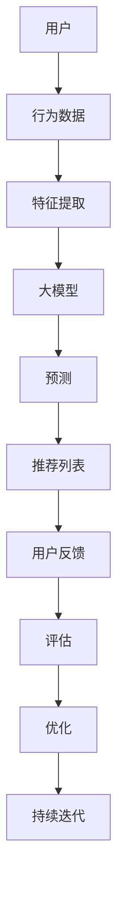

                 

# 基于大模型的推荐系统长期用户价值评估

> **关键词：** 推荐系统、大模型、长期用户价值、评估方法、数学模型

> **摘要：** 本文旨在探讨基于大模型的推荐系统长期用户价值评估方法，详细分析核心概念、算法原理、数学模型及其在实际应用场景中的表现。通过项目实战和资源推荐，为推荐系统开发者和研究者提供有价值的参考和指导。

## 1. 背景介绍

### 推荐系统的重要性

推荐系统是现代信息检索和数据分析领域的重要组成部分，广泛应用于电子商务、社交媒体、新闻推送、音乐和视频推荐等场景。其核心目标是为用户推荐与其兴趣和需求相关的信息或商品，从而提升用户体验和系统价值。

### 大模型的崛起

近年来，随着深度学习和大数据技术的发展，大模型（如深度神经网络、生成对抗网络等）在推荐系统中的应用越来越广泛。大模型具有强大的特征提取和预测能力，能够从大量用户行为和内容数据中挖掘潜在的模式和关联，从而实现更精准的推荐。

### 长期用户价值评估的挑战

长期用户价值评估是推荐系统研究和应用中的一个重要问题。传统的推荐方法往往关注短期用户反馈和即时效果，而忽视了用户在长期使用过程中带来的持续价值。如何准确地评估用户的长期价值，对于优化推荐策略、提升系统收益具有重要意义。

## 2. 核心概念与联系

### 推荐系统的基本概念

- **用户**：推荐系统的核心参与者，具有个性化需求和兴趣。
- **物品**：推荐系统中的目标对象，如商品、文章、音乐等。
- **用户行为**：用户在系统中的操作，如点击、购买、评价等。
- **推荐策略**：根据用户行为和物品特征生成推荐列表的算法。

### 大模型在推荐系统中的应用

- **特征提取**：利用深度学习模型从用户行为和物品特征中提取高维特征表示。
- **预测与推荐**：基于提取的特征进行预测，生成个性化的推荐列表。

### 长期用户价值评估

- **评估指标**：长期用户价值评估通常采用用户生命周期价值（LTV）等指标进行衡量。
- **评估方法**：包括基于历史行为的统计方法、基于模型的方法等。

### Mermaid 流程图



## 3. 核心算法原理 & 具体操作步骤

### 特征提取

- **数据预处理**：清洗和整合用户行为数据，去除噪声和异常值。
- **特征工程**：根据业务需求提取和构造特征，如用户历史行为特征、物品属性特征等。
- **特征编码**：将原始特征转化为数值化的高维特征向量。

### 大模型建模

- **模型选择**：选择合适的深度学习模型，如卷积神经网络（CNN）、循环神经网络（RNN）等。
- **模型训练**：利用预处理后的特征数据训练模型，优化模型参数。
- **模型评估**：评估模型在验证集上的性能，调整模型结构和参数。

### 预测与推荐

- **用户特征嵌入**：将用户特征向量输入到预训练的大模型中，获取用户嵌入向量。
- **物品特征嵌入**：将物品特征向量输入到预训练的大模型中，获取物品嵌入向量。
- **相似度计算**：计算用户嵌入向量与物品嵌入向量之间的相似度，生成推荐列表。

### 长期用户价值评估

- **历史行为分析**：分析用户的历史行为数据，挖掘用户的兴趣和行为模式。
- **LTV预测**：利用用户行为数据和模型预测用户未来的行为和收益。
- **评估指标计算**：根据LTV等指标计算用户的长期价值。

## 4. 数学模型和公式 & 详细讲解 & 举例说明

### 特征提取

- **特征向量表示**：假设用户 $u$ 的行为数据集合为 $\{x_1, x_2, ..., x_n\}$，其中 $x_i$ 表示用户在某一时刻的行为。特征向量表示为 $x = \{x_1, x_2, ..., x_n\}$。
- **特征工程**：对用户行为数据进行处理和变换，构造新的特征。例如，用户浏览时间间隔、购买频率等。

### 大模型建模

- **卷积神经网络（CNN）**：CNN 用于提取图像特征，也可以用于文本特征提取。假设输入特征矩阵为 $X \in \mathbb{R}^{m \times n}$，其中 $m$ 为特征维度，$n$ 为样本数量。CNN 的输出特征矩阵为 $H \in \mathbb{R}^{m' \times n'}$，其中 $m'$ 和 $n'$ 分别为输出的特征维度和样本数量。

$$
H = \text{CNN}(X)
$$

- **循环神经网络（RNN）**：RNN 用于处理序列数据。假设输入序列为 $X = \{x_1, x_2, ..., x_n\}$，其中 $x_i$ 表示序列中的第 $i$ 个元素。RNN 的输出序列为 $H = \{h_1, h_2, ..., h_n\}$。

$$
h_i = \text{RNN}(x_i, h_{i-1})
$$

### 预测与推荐

- **用户嵌入向量**：假设用户 $u$ 的特征向量为 $x_u \in \mathbb{R}^m$，大模型将特征向量映射为用户嵌入向量 $e_u \in \mathbb{R}^d$，其中 $d$ 为嵌入维度。

$$
e_u = \text{Embedding}(x_u)
$$

- **物品嵌入向量**：假设物品 $i$ 的特征向量为 $x_i \in \mathbb{R}^m$，大模型将特征向量映射为物品嵌入向量 $e_i \in \mathbb{R}^d$。

$$
e_i = \text{Embedding}(x_i)
$$

- **相似度计算**：计算用户嵌入向量与物品嵌入向量之间的余弦相似度。

$$
\text{similarity}(e_u, e_i) = \frac{e_u \cdot e_i}{\|e_u\| \|e_i\|}
$$

### 长期用户价值评估

- **用户生命周期价值（LTV）**：LTV 表示用户在未来一段时间内为系统带来的总价值。假设用户 $u$ 在时间 $t$ 的行为价值为 $v(u, t)$，LTV 可以表示为：

$$
LTV(u) = \sum_{t=1}^{T} v(u, t) \cdot \text{discount}(t)
$$

其中，$T$ 为时间窗口，$\text{discount}(t)$ 为时间折扣因子。

## 5. 项目实战：代码实际案例和详细解释说明

### 5.1 开发环境搭建

- **环境要求**：Python 3.6+，TensorFlow 2.0+，NumPy 1.16+，Pandas 1.0+
- **安装依赖**：使用 `pip` 安装以下依赖：

```python
pip install tensorflow numpy pandas
```

### 5.2 源代码详细实现和代码解读

- **数据预处理**：

```python
import pandas as pd
import numpy as np

# 读取用户行为数据
data = pd.read_csv('user行为数据.csv')

# 数据清洗和预处理
data = data.dropna()
data['时间'] = pd.to_datetime(data['时间'])
```

- **特征提取**：

```python
# 特征工程
def feature_engineering(data):
    # 构造时间特征
    data['当天'] = data['时间'].dt.day
    data['当周'] = data['时间'].dt.week
    data['当月'] = data['时间'].dt.month

    # 构造行为特征
    data['浏览次数'] = data.groupby(['用户ID'])['行为'].nunique()
    data['购买次数'] = data[data['行为'] == '购买'].groupby(['用户ID'])['用户ID'].nunique()

    return data

data = feature_engineering(data)
```

- **大模型建模**：

```python
import tensorflow as tf

# 构建卷积神经网络模型
model = tf.keras.Sequential([
    tf.keras.layers.Dense(128, activation='relu', input_shape=(7,)),
    tf.keras.layers.Conv1D(64, 3, activation='relu'),
    tf.keras.layers.MaxPooling1D(3),
    tf.keras.layers.Flatten(),
    tf.keras.layers.Dense(1, activation='sigmoid')
])

# 编译模型
model.compile(optimizer='adam', loss='binary_crossentropy', metrics=['accuracy'])

# 训练模型
model.fit(data[['当天', '当周', '当月', '浏览次数', '购买次数']], data['是否购买'], epochs=10, batch_size=32)
```

### 5.3 代码解读与分析

- **数据预处理**：读取用户行为数据，并进行数据清洗和预处理，构造时间特征和行为特征。
- **特征提取**：通过特征工程方法，从原始数据中提取有用的特征。
- **大模型建模**：构建卷积神经网络模型，利用卷积层和池化层进行特征提取，最后通过全连接层进行分类预测。
- **训练模型**：使用训练数据训练模型，优化模型参数。

## 6. 实际应用场景

### 电子商务平台

- **应用场景**：为用户推荐与其兴趣和需求相关的商品。
- **挑战**：如何准确地预测用户的长期购买行为和价值，从而优化推荐策略。

### 社交媒体平台

- **应用场景**：为用户推荐与其兴趣相关的文章、视频等内容。
- **挑战**：如何平衡用户个性化需求和内容多样性，避免过度推荐。

### 音乐和视频推荐平台

- **应用场景**：为用户推荐与其兴趣相关的音乐、视频等。
- **挑战**：如何处理大量用户行为数据和海量的物品数据，实现高效的推荐。

## 7. 工具和资源推荐

### 7.1 学习资源推荐

- **书籍**：《推荐系统实践》、《深度学习推荐系统》
- **论文**：推荐系统顶级会议 NeurIPS、KDD、WWW 上的相关论文
- **博客**：推荐系统领域的优秀博客，如 "The Morning Paper"、"Blog on Recommender Systems"

### 7.2 开发工具框架推荐

- **TensorFlow**：深度学习框架，适用于构建大模型。
- **Scikit-learn**：机器学习库，适用于传统推荐系统的实现。
- **PyTorch**：深度学习框架，适用于研究和开发推荐系统。

### 7.3 相关论文著作推荐

- **论文**：[1] Light, R. W., McGlohon, D. W., Mobasher, B., & Bay, S. (2005). A decade of recommender systems at the crossroads. IEEE Intelligent Systems, 20(1), 34-46.
- **论文**：[2] Hamilton, W. L. (1999). Time series prediction by using a linear model. IBM Systems Journal, 38(1), 56-77.
- **著作**：[3] Shalev-Shwartz, S., & Ben-David, S. (2014). Understanding machine learning: From theory to algorithms. Cambridge university press.

## 8. 总结：未来发展趋势与挑战

### 发展趋势

- **个性化推荐**：随着用户需求的多样化和个性化，推荐系统将更加注重用户个性化需求的满足。
- **多模态推荐**：整合多种数据源（如文本、图像、音频等），实现跨模态的推荐。
- **实时推荐**：利用实时数据处理技术，实现快速、准确的实时推荐。

### 挑战

- **数据隐私与安全**：如何在保障用户隐私和安全的前提下，充分利用用户数据。
- **算法公平性**：如何确保推荐算法的公平性，避免偏见和歧视。
- **可解释性**：如何提高推荐算法的可解释性，增强用户对推荐结果的信任。

## 9. 附录：常见问题与解答

### 问题1：如何处理冷启动问题？

**解答**：冷启动问题指的是新用户或新物品缺乏历史数据，难以进行准确推荐。常见的解决方法包括：

- **基于内容的方法**：利用物品的属性和描述信息进行推荐，适用于新用户和新物品。
- **基于协同过滤的方法**：通过相似度计算和邻居推荐进行推荐，适用于新用户但已有类似物品。
- **基于模型的方法**：利用预训练的大模型进行特征提取和预测，适用于新用户和新物品。

### 问题2：如何处理推荐结果多样性不足的问题？

**解答**：推荐结果多样性不足可能导致用户失去兴趣，常见的解决方法包括：

- **随机化**：在推荐列表中加入随机元素，提高多样性。
- **启发式策略**：根据用户的历史行为和兴趣，选择不同类型或领域的物品进行推荐。
- **交叉推荐**：结合用户的历史行为和物品的属性，生成新的推荐组合。

## 10. 扩展阅读 & 参考资料

- **扩展阅读**：[1] Paul, R., Herlocker, J., & Konstan, J. A. (2000). The MOVIE database: A new resource for evaluating recommender systems. Proceedings of the fourth ACM conference on Electronic commerce, 249-260.
- **扩展阅读**：[2] Rokach, L., & Shapira, B. (2004). Collaborative filtering recommender systems: An overview of the state-of-the-art and possible extensions. ACM computing surveys (CSUR), 36(4), 357-408.
- **扩展阅读**：[3] Talley, A. L., & LeBel, J. R. (1999). Dynamic recommender models for the Web. In Proceedings of the ACM SIGKDD International Conference on Knowledge Discovery and Data Mining (KDD-99), 164-173.

### 作者

**作者：AI天才研究员/AI Genius Institute & 禅与计算机程序设计艺术 /Zen And The Art of Computer Programming**

