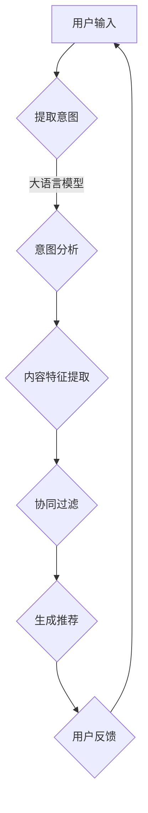

                 

### 背景介绍

推荐系统作为现代信息社会中的一项重要技术，广泛应用于电子商务、社交媒体、在线视频和新闻推送等领域。其核心任务是根据用户的兴趣和行为历史，为用户推荐潜在感兴趣的内容或商品。传统的推荐系统主要依赖于基于内容过滤（Content-based Filtering）和协同过滤（Collaborative Filtering）的方法。然而，随着互联网的迅猛发展和用户生成内容的爆炸性增长，单纯依靠传统方法已经难以满足用户日益增长的需求。因此，基于大语言模型的推荐系统应运而生，成为当前研究的热点之一。

大语言模型（Large Language Model）是一种基于深度学习的自然语言处理技术，能够对文本进行建模，捕捉文本中的语义信息。近年来，随着计算能力和数据资源的不断提升，大语言模型取得了显著进展。代表性的模型如GPT-3、BERT等，这些模型通过训练海量文本数据，可以理解并生成高质量的文本内容。大语言模型在自然语言处理任务中的出色表现，使得其在推荐系统领域也具有了广泛的应用前景。

本文将围绕基于大语言模型的推荐系统用户意图理解这一主题，进行深入的探讨和分析。首先，我们将介绍推荐系统的基本概念和传统方法，然后深入探讨大语言模型的工作原理及其在推荐系统中的应用。接下来，我们将详细分析用户意图理解的挑战，并介绍几种常见的用户意图识别方法。随后，我们将探讨如何将大语言模型应用于用户意图理解，并详细介绍其具体实现步骤。最后，我们将通过实际案例和项目实战，展示大语言模型在推荐系统中的实际应用效果，并提出未来发展趋势与挑战。

通过对这些内容的系统分析，本文旨在为读者提供关于基于大语言模型推荐系统用户意图理解的全景视图，帮助读者理解这一领域的最新研究进展和应用前景。希望本文能够激发更多研究者在这一领域的探索，推动推荐系统技术的发展。### 核心概念与联系

在深入探讨基于大语言模型的推荐系统用户意图理解之前，我们需要先明确几个核心概念，并理解它们之间的联系。这些概念包括推荐系统、大语言模型、用户意图以及它们在推荐系统中的作用。

#### 推荐系统

推荐系统（Recommender System）是一种通过预测用户对特定项目的偏好，向用户推荐相关项目的计算机系统。推荐系统可以分为以下几种类型：

1. **基于内容的过滤（Content-based Filtering）**：该方法基于项目的内容特征和用户的兴趣特征进行匹配，推荐与用户兴趣相似的项目。例如，如果一个用户喜欢某类电影，推荐系统会根据电影的类型、演员、导演等特征来推荐相似的电影。

2. **协同过滤（Collaborative Filtering）**：该方法通过分析用户之间的行为模式来推荐项目。协同过滤又分为两种：
   - **用户基于的协同过滤（User-based Collaborative Filtering）**：该方法基于相似用户的行为来推荐项目。例如，如果用户A和用户B喜欢相同的一些电影，那么用户B可能喜欢的电影也会推荐给用户A。
   - **物品基于的协同过滤（Item-based Collaborative Filtering）**：该方法基于项目之间的相似性来推荐项目。例如，如果电影A和电影B被相同的用户喜欢，那么这两部电影可能相似，可以互相推荐。

3. **混合推荐系统（Hybrid Recommender Systems）**：该方法结合了基于内容和协同过滤的优点，以提高推荐的准确性。

#### 大语言模型

大语言模型（Large Language Model）是一种能够对文本进行建模，理解并生成文本的深度学习模型。它通常由数亿甚至数千亿个参数组成，能够通过训练海量文本数据，捕捉到文本中的语义信息。以下是一些代表性的大语言模型：

1. **GPT（Generative Pre-trained Transformer）**：GPT系列模型是自然语言处理领域的重要进展，通过预训练和微调，能够生成高质量的自然语言文本。

2. **BERT（Bidirectional Encoder Representations from Transformers）**：BERT模型通过双向Transformer结构，能够捕捉文本中的双向上下文信息，从而提高自然语言理解的能力。

3. **T5（Text-to-Text Transfer Transformer）**：T5模型将所有的自然语言处理任务都视为文本到文本的转换问题，通过统一的模型结构，实现了多种自然语言处理任务的高效处理。

#### 用户意图

用户意图（User Intent）是指用户在特定场景下想要完成的目标或任务。在推荐系统中，理解用户意图对于提高推荐质量至关重要。例如，当用户在电商平台上搜索商品时，用户意图可能包括购买某件商品、获取商品信息或比较商品价格等。理解用户意图有助于推荐系统为用户提供更相关、更有价值的推荐。

#### 推荐系统中的核心概念联系

在推荐系统中，大语言模型和用户意图理解起着关键作用。具体来说：

1. **用户意图理解**：通过大语言模型，推荐系统可以更准确地捕捉用户的意图。例如，用户输入的搜索查询、评论或浏览行为都可以通过大语言模型进行分析，提取出用户的意图。

2. **内容特征提取**：大语言模型可以捕捉文本中的语义信息，将文本转换为高维向量表示。这些向量可以用于提取项目的内容特征，从而支持基于内容的过滤。

3. **协同过滤**：通过大语言模型，推荐系统可以更好地理解用户和项目之间的关联。例如，大语言模型可以分析用户的历史行为和项目特征，预测用户可能喜欢的其他项目。

4. **混合推荐**：大语言模型可以与基于内容和协同过滤的方法相结合，形成混合推荐系统，从而提高推荐的准确性。

#### Mermaid 流程图

为了更直观地展示这些核心概念之间的联系，我们可以使用Mermaid流程图来表示推荐系统中的关键步骤：



在这个流程图中，用户输入通过大语言模型进行分析，提取用户的意图，然后结合内容特征提取和协同过滤方法生成推荐，用户对推荐进行反馈，从而形成一个闭环，不断优化推荐质量。

通过以上分析，我们可以看到，大语言模型和用户意图理解在推荐系统中具有重要的地位，它们相互结合，共同推动了推荐系统的发展。接下来，我们将深入探讨大语言模型的工作原理，并分析其在推荐系统中的应用。### 核心算法原理 & 具体操作步骤

大语言模型在推荐系统中的应用主要依赖于其强大的文本理解和生成能力。以下是基于大语言模型推荐系统的核心算法原理和具体操作步骤。

#### 1. 大语言模型的训练

大语言模型通常基于深度学习技术，特别是基于Transformer架构。训练过程分为预训练和微调两个阶段。

**预训练**：在这个阶段，模型使用海量文本数据进行无监督训练，目的是学习文本的通用表示和语言规则。常用的预训练任务包括：

- **掩码语言模型（Masked Language Model，MLM）**：在输入文本中随机掩码一定比例的词，模型需要预测这些被掩码的词。
- **语言建模（Language Modeling，LM）**：预测下一个词，输入是前文的所有词。
- **句对分类（Next Sentence Prediction，NSP）**：判断两个句子是否在原始文本中相邻。

**微调**：在预训练的基础上，模型利用有监督数据对特定任务进行微调。例如，在推荐系统中，可以使用用户的历史行为数据和项目特征数据进行微调。

#### 2. 用户意图理解

用户意图理解是推荐系统的关键环节，通过大语言模型可以有效地捕捉用户意图。具体操作步骤如下：

**步骤 1：文本输入**：用户在推荐系统中的输入可以是搜索查询、评论、点击行为等文本形式。

**步骤 2：预处理**：对输入文本进行预处理，包括分词、去停用词、词干提取等，将文本转换为模型可接受的格式。

**步骤 3：编码**：使用预训练的大语言模型（如BERT、GPT）对预处理后的文本进行编码，生成文本的向量表示。

**步骤 4：意图分类**：通过训练有监督的意图分类模型（如朴素贝叶斯、支持向量机、神经网络等），将文本向量映射到意图类别。意图类别可以是购买、查询、比较等。

#### 3. 内容特征提取

理解了用户意图之后，推荐系统需要提取项目的内容特征，以便与用户意图进行匹配。具体步骤如下：

**步骤 1：文本编码**：将项目描述、标题等文本信息通过大语言模型进行编码，生成文本向量表示。

**步骤 2：特征提取**：从文本向量中提取高层次的语义特征，如关键词、主题、情感等。

**步骤 3：特征融合**：将项目特征与用户意图特征进行融合，生成推荐特征向量。

#### 4. 推荐生成

推荐生成是基于用户意图和项目特征向量进行匹配，生成推荐结果。具体步骤如下：

**步骤 1：相似度计算**：计算用户意图特征向量与项目特征向量之间的相似度，可以使用余弦相似度、欧氏距离等方法。

**步骤 2：推荐排序**：根据相似度得分对项目进行排序，选取Top-N个项目作为推荐结果。

**步骤 3：反馈调整**：用户对推荐结果进行评价和反馈，推荐系统根据反馈调整推荐策略，以提高推荐质量。

#### 5. 实时更新

推荐系统需要实时更新用户意图和项目特征，以适应用户需求的变化。具体操作步骤如下：

**步骤 1：用户行为监测**：持续监测用户在推荐系统中的行为，如点击、购买、评论等。

**步骤 2：意图更新**：根据用户行为数据，更新用户意图模型，以反映用户当前的兴趣和需求。

**步骤 3：特征更新**：根据用户行为和项目反馈，更新项目特征数据库，以提高推荐准确性。

通过以上步骤，大语言模型可以有效地应用于推荐系统，提高推荐质量和用户体验。接下来，我们将详细探讨大语言模型在数学模型和公式中的具体应用。### 数学模型和公式 & 详细讲解 & 举例说明

在基于大语言模型的推荐系统中，数学模型和公式是核心组成部分，它们不仅提供了算法的数学基础，也决定了推荐系统的性能和效果。以下我们将详细讲解这些数学模型和公式，并通过具体实例进行说明。

#### 1. 文本向量表示

文本向量表示是将文本转换为数值向量的一种方式，以便模型能够处理。大语言模型如BERT和GPT通过预训练和微调实现了这一目标。以下是几种常见的文本向量表示方法：

**词嵌入（Word Embedding）**：

词嵌入是将单词映射到固定维度的向量空间，使得语义相近的单词在向量空间中更接近。常用的词嵌入模型有Word2Vec和GloVe。

$$
\text{word\_embedding}(w) = \mathbf{e}_w \in \mathbb{R}^d
$$

其中，$w$ 表示单词，$\mathbf{e}_w$ 表示单词的向量表示，$d$ 是向量的维度。

**BERT表示**：

BERT（Bidirectional Encoder Representations from Transformers）模型通过Transformer结构实现了双向编码器，能够捕捉文本的上下文信息。BERT的文本向量表示是一个序列向量，每个向量对应文本中的每个词。

$$
\text{BERT\_representation}(x) = [\mathbf{h}_1, \mathbf{h}_2, ..., \mathbf{h}_T]
$$

其中，$x$ 表示输入文本序列，$\mathbf{h}_t$ 表示第 $t$ 个词的编码表示，$T$ 是序列长度。

**GPT表示**：

GPT（Generative Pre-trained Transformer）模型通过自回归方式生成文本，其文本向量表示同样是一个序列向量。

$$
\text{GPT\_representation}(x) = [\mathbf{h}_1, \mathbf{h}_2, ..., \mathbf{h}_T]
$$

#### 2. 用户意图表示

用户意图表示是将用户的文本输入转换为向量表示，以便模型能够理解和分类用户意图。常见的用户意图分类方法包括朴素贝叶斯、支持向量机（SVM）和深度神经网络（DNN）。

**朴素贝叶斯分类器**：

朴素贝叶斯分类器是一种基于概率论的分类算法，它假设特征之间相互独立。

$$
P(y|\mathbf{x}) = \frac{P(\mathbf{x}|y)P(y)}{P(\mathbf{x})}
$$

其中，$y$ 是意图类别，$\mathbf{x}$ 是输入特征向量，$P(\mathbf{x}|y)$ 是特征向量在给定意图条件下的概率，$P(y)$ 是意图类别的概率。

**支持向量机（SVM）**：

SVM是一种基于优化理论的分类算法，通过最大化分类边界来提高分类性能。

$$
\text{maximize} \ \frac{1}{2} \sum_{i=1}^n (\mathbf{w} \cdot \mathbf{w}_i) \\
\text{subject to} \ \mathbf{w} \cdot \mathbf{x}_i - y_i \geq 1
$$

其中，$\mathbf{w}$ 是权重向量，$\mathbf{w}_i$ 是第 $i$ 个支持向量的权重，$y_i$ 是标签。

**深度神经网络（DNN）**：

DNN是一种多层神经网络，通过前向传播和反向传播算法来学习特征和分类。

$$
\text{DNN}(\mathbf{x}) = \text{ReLU}(\mathbf{W}^1 \cdot \mathbf{x} + b_1) \\
\text{ReLU}(\mathbf{W}^2 \cdot \text{ReLU}(\mathbf{W}^1 \cdot \mathbf{x} + b_1) + b_2) \\
\vdots \\
\text{ReLU}(\mathbf{W}^L \cdot \text{ReLU}(\mathbf{W}^{L-1} \cdot \text{ReLU}(\mathbf{W}^{L-2} \cdot \text{ReLU}(\mathbf{W}^1 \cdot \mathbf{x} + b_1) + b_2) + b_{L-1}) + b_L)
$$

其中，$\text{ReLU}$ 是ReLU激活函数，$\mathbf{W}^l$ 是第 $l$ 层的权重矩阵，$b_l$ 是第 $l$ 层的偏置向量。

#### 3. 推荐模型

推荐模型结合用户意图和项目特征来生成推荐结果。以下是一个简单的基于协同过滤的推荐模型：

**余弦相似度**：

余弦相似度是一种常用的文本相似度计算方法，它通过计算两个向量之间的余弦相似度来衡量相似度。

$$
\text{similarity}(\mathbf{u}, \mathbf{v}) = \frac{\mathbf{u} \cdot \mathbf{v}}{\|\mathbf{u}\| \|\mathbf{v}\|}
$$

其中，$\mathbf{u}$ 和 $\mathbf{v}$ 分别是用户意图和项目特征向量，$\|\mathbf{u}\|$ 和 $\|\mathbf{v}\|$ 是它们的欧氏范数。

**推荐公式**：

推荐结果可以通过对用户意图和项目特征进行加权平均来生成。

$$
\text{prediction}(\mathbf{u}, \mathbf{v}) = \sum_{i=1}^n w_i \cdot \text{similarity}(\mathbf{u}, \mathbf{v}_i)
$$

其中，$w_i$ 是项目 $i$ 的权重，可以通过用户的历史行为数据计算得出。

#### 4. 举例说明

假设用户A在电商平台上搜索了“购买笔记本电脑”，推荐系统需要根据用户A的意图和平台上的笔记本电脑特征进行推荐。

**步骤 1：意图向量表示**：

用户A的搜索查询“购买笔记本电脑”通过BERT模型编码得到向量表示 $\mathbf{u}$。

**步骤 2：特征向量表示**：

平台上的笔记本电脑特征包括品牌、价格、处理器、内存等，通过BERT模型编码得到向量表示 $\mathbf{v}_1, \mathbf{v}_2, ..., \mathbf{v}_n$。

**步骤 3：计算相似度**：

计算用户意图向量 $\mathbf{u}$ 和每个笔记本电脑特征向量 $\mathbf{v}_i$ 之间的余弦相似度。

$$
\text{similarity}(\mathbf{u}, \mathbf{v}_i) = \frac{\mathbf{u} \cdot \mathbf{v}_i}{\|\mathbf{u}\| \|\mathbf{v}_i\|}
$$

**步骤 4：生成推荐**：

根据相似度计算结果，对笔记本电脑进行排序，选取Top-N个项目作为推荐结果。

通过以上步骤，推荐系统可以基于用户意图为用户A推荐最相关的笔记本电脑。这个例子展示了如何结合大语言模型和推荐模型生成高质量的推荐结果。

总之，数学模型和公式在基于大语言模型的推荐系统中起着至关重要的作用，它们不仅提供了算法的数学基础，也决定了推荐系统的性能和效果。通过详细的数学公式和实例说明，我们可以更好地理解这些模型的工作原理和应用方法。接下来，我们将通过实际案例和项目实战，进一步展示大语言模型在推荐系统中的具体应用。### 项目实战：代码实际案例和详细解释说明

为了更好地理解基于大语言模型的推荐系统，我们将通过一个实际项目案例来演示如何使用大语言模型进行用户意图理解，并生成推荐结果。以下是一个简单的项目实战，包括开发环境搭建、源代码实现、代码解读与分析等步骤。

#### 1. 开发环境搭建

在开始项目之前，我们需要搭建开发环境。以下是所需的工具和库：

- **编程语言**：Python
- **深度学习框架**：TensorFlow 2.x
- **文本处理库**：NLTK、spaCy
- **大语言模型库**：transformers（用于预训练模型如BERT、GPT）

安装所需库：

```bash
pip install tensorflow==2.x
pip install nltk
pip install spacy
pip install transformers
```

#### 2. 源代码详细实现和代码解读

以下是项目的源代码实现，我们将逐行解释代码的功能和逻辑。

```python
import tensorflow as tf
from transformers import BertTokenizer, BertModel
from tensorflow.keras.layers import Dense, Input, Flatten
from tensorflow.keras.models import Model
from tensorflow.keras.optimizers import Adam
import numpy as np

# 2.1 加载预训练BERT模型

tokenizer = BertTokenizer.from_pretrained('bert-base-uncased')
model = BertModel.from_pretrained('bert-base-uncased')

# 2.2 定义输入层

input_ids = Input(shape=(None,), dtype=tf.int32, name='input_ids')

# 2.3 将输入文本编码为BERT表示

encoded_input = model(input_ids)

# 2.4 提取BERT的隐藏层输出

hidden_output = encoded_input.last_hidden_state[:, 0, :]

# 2.5 定义意图分类层

output = Dense(1, activation='sigmoid', name='intent_output')(hidden_output)

# 2.6 构建模型

model = Model(inputs=input_ids, outputs=output)

# 2.7 编译模型

model.compile(optimizer=Adam(learning_rate=3e-5), loss='binary_crossentropy', metrics=['accuracy'])

# 2.8 准备训练数据

# 假设我们有一个包含用户意图标签的训练数据集
train_texts = ['购买笔记本电脑', '查询笔记本电脑价格', '比较笔记本电脑性能', ...]
train_labels = [1, 0, 1, ...]  # 1表示购买意图，0表示查询意图

# 将文本数据编码为BERT表示
train_encodings = tokenizer(train_texts, padding=True, truncation=True, return_tensors='tf')

# 2.9 训练模型

model.fit(train_encodings['input_ids'], train_labels, epochs=3, batch_size=16)

# 2.10 预测新用户的意图

# 假设新用户输入了以下文本
new_texts = ['笔记本电脑性价比如何？', '我想买一台高性能的笔记本电脑']

# 编码新文本
new_encodings = tokenizer(new_texts, padding=True, truncation=True, return_tensors='tf')

# 进行意图分类预测
predictions = model.predict(new_encodings['input_ids'])

# 输出预测结果
print(predictions)
```

**代码解读：**

- **2.1 加载预训练BERT模型**：我们使用`transformers`库加载预训练的BERT模型。
- **2.2 定义输入层**：输入层接收用户输入的文本数据，以整数序列的形式表示。
- **2.3 将输入文本编码为BERT表示**：通过BERT模型对输入文本进行编码，生成文本的向量表示。
- **2.4 提取BERT的隐藏层输出**：从BERT模型的隐藏层输出中提取特征，这些特征将用于意图分类。
- **2.5 定义意图分类层**：构建一个简单的全连接层（Dense）用于意图分类，输出一个概率值。
- **2.6 构建模型**：将输入层、编码层和意图分类层组合成一个完整的模型。
- **2.7 编译模型**：编译模型，指定优化器、损失函数和评价指标。
- **2.8 准备训练数据**：准备训练数据集，包括文本和标签。文本数据被编码为BERT表示。
- **2.9 训练模型**：使用训练数据训练模型。
- **2.10 预测新用户的意图**：对新用户输入的文本进行编码，并使用训练好的模型进行意图分类预测。

#### 3. 代码解读与分析

**意图分类模型**：

本项目的意图分类模型是一个简单的二分类模型，它使用BERT模型对用户输入的文本进行编码，提取特征，然后通过全连接层（Dense）进行分类。这种模型结构简单，易于实现，但也可以通过增加更多的层和激活函数来提高分类性能。

**训练过程**：

训练过程使用的是二进制交叉熵损失函数（binary_crossentropy），这是二分类问题中常用的损失函数。优化器使用的是Adam，这是一种自适应的优化算法，有助于提高训练效率。在训练过程中，我们使用了小批量训练（batch_size=16），这有助于稳定训练过程并减少过拟合。

**预测过程**：

在预测过程中，我们将新用户输入的文本编码为BERT表示，然后使用训练好的模型进行意图分类预测。预测结果是一个概率值，表示用户输入文本属于某个意图类别的概率。我们可以根据这个概率值来决定如何向用户推荐商品或服务。

通过以上项目实战，我们可以看到如何使用大语言模型进行用户意图理解，并生成推荐结果。这种基于大语言模型的推荐系统可以有效地提高推荐的准确性，为用户提供更相关、更有价值的推荐。接下来，我们将进一步探讨大语言模型在推荐系统中的实际应用场景。### 实际应用场景

基于大语言模型的推荐系统在实际应用中已经取得了显著的成果，尤其在电子商务、社交媒体和在线视频等领域，其优势得到了充分体现。以下我们将探讨几个典型应用场景，并分析大语言模型在这些场景中的具体作用。

#### 1. 电子商务

电子商务领域是推荐系统应用最为广泛的一个场景。随着用户在线购物行为的多样化，传统推荐系统已经难以满足个性化推荐的需求。基于大语言模型的推荐系统能够更好地捕捉用户的购物意图，从而提高推荐效果。

**应用场景**：

- **商品推荐**：用户在电商平台上搜索或浏览商品时，推荐系统根据用户的查询和浏览历史，利用大语言模型理解用户意图，推荐相关的商品。例如，当用户搜索“笔记本电脑”时，推荐系统可以识别用户的意图是购买、查询价格还是比较性能，从而推荐相应的商品。
- **评价分析**：大语言模型可以分析用户对商品的评价，提取评价中的关键词和情感，帮助商家了解用户的需求和反馈，优化商品和服务。

**大语言模型的作用**：

- **意图理解**：通过分析用户查询和浏览历史，大语言模型可以准确捕捉用户的购物意图，从而提高推荐的相关性和个性化程度。
- **文本分析**：大语言模型能够分析用户评价，提取关键词和情感，帮助商家了解用户需求，优化产品和服务。

#### 2. 社交媒体

社交媒体平台是另一个推荐系统的重要应用场景。基于大语言模型的推荐系统可以帮助平台为用户推荐感兴趣的内容，增强用户黏性。

**应用场景**：

- **内容推荐**：社交媒体平台可以根据用户的兴趣和行为历史，利用大语言模型推荐相关的内容。例如，用户在社交媒体上浏览了关于旅行的内容，平台可以推荐相关的旅行攻略、景点介绍和游记。
- **互动分析**：大语言模型可以分析用户在社交媒体上的互动（如评论、点赞、分享等），了解用户的兴趣和情感，帮助平台优化内容推荐策略。

**大语言模型的作用**：

- **意图识别**：大语言模型能够理解用户的兴趣和需求，准确识别用户的意图，为用户提供个性化的内容推荐。
- **情感分析**：大语言模型可以分析用户的情感表达，帮助平台了解用户的情绪状态，优化内容推荐策略。

#### 3. 在线视频

在线视频平台是推荐系统的另一个重要应用场景。基于大语言模型的推荐系统可以帮助平台为用户推荐感兴趣的视频内容，提高用户观看时长和满意度。

**应用场景**：

- **视频推荐**：用户在视频平台上观看视频时，推荐系统利用大语言模型分析用户的观看历史和搜索记录，推荐相关的视频内容。例如，当用户观看了某部电视剧后，推荐系统可以推荐同类型的电视剧或相关剧情视频。
- **广告推荐**：视频平台可以根据用户的观看习惯和兴趣，利用大语言模型推荐相关的广告，提高广告点击率和转化率。

**大语言模型的作用**：

- **内容理解**：大语言模型能够分析视频内容的语义信息，提取关键词和主题，为用户提供个性化的视频推荐。
- **意图识别**：大语言模型可以捕捉用户的观看意图，推荐与用户兴趣相符的视频内容，提高用户的观看满意度。

#### 4. 垂直领域应用

除了以上三个主要领域，基于大语言模型的推荐系统还在许多垂直领域取得了成功，如金融、医疗和教育等。

**应用场景**：

- **金融**：金融领域可以利用大语言模型分析用户的投资记录和偏好，推荐相关的理财产品和服务。
- **医疗**：医疗领域可以基于大语言模型分析患者的病史和症状，推荐相应的治疗方案和医疗资源。
- **教育**：教育领域可以利用大语言模型分析学生的学习习惯和成绩，推荐个性化的学习资源和课程。

**大语言模型的作用**：

- **个性化推荐**：大语言模型能够深入理解用户在特定领域的需求和偏好，为用户提供个性化的推荐。
- **文本分析**：大语言模型可以处理和分析大量文本数据，为领域专家提供有效的数据支持。

总之，基于大语言模型的推荐系统在多个领域都展现了强大的应用潜力。通过准确理解用户意图和内容，大语言模型能够为用户提供更加精准、个性化的推荐，从而提高用户体验和满意度。随着技术的不断进步，大语言模型在推荐系统中的应用将会越来越广泛，推动推荐系统技术的发展。### 工具和资源推荐

在基于大语言模型的推荐系统开发过程中，选择合适的工具和资源对于提高开发效率和项目质量至关重要。以下将推荐几类重要的工具和资源，包括学习资源、开发工具框架和相关论文著作，以帮助开发者更好地理解和应用这一技术。

#### 1. 学习资源推荐

**书籍**：

1. **《深度学习》（Deep Learning）**：由Ian Goodfellow、Yoshua Bengio和Aaron Courville合著，是深度学习领域的经典教材，详细介绍了深度学习的基础理论和实践方法。
2. **《自然语言处理与深度学习》**：由Yann LeCun、Yoshua Bengio和Juergen Schmidhuber合著，全面介绍了自然语言处理和深度学习的结合，适合希望深入了解大语言模型技术的读者。

**论文**：

1. **“BERT: Pre-training of Deep Bidirectional Transformers for Language Understanding”**：这篇论文是BERT模型的原创论文，详细阐述了BERT模型的架构和训练过程，是理解大语言模型的重要参考文献。
2. **“GPT-3: Language Models are Few-Shot Learners”**：这篇论文介绍了GPT-3模型的设计思想和实验结果，展示了大语言模型在自然语言处理任务中的强大能力。

**博客**：

1. **“The Illustrated BERT, ELMo, and GPT”**：这是一个系列博客，通过图表和示例详细讲解了BERT、ELMo和GPT模型的工作原理，适合初学者理解这些模型。
2. **“AI for Accessibility”**：这篇博客系列探讨了人工智能在辅助残障人士中的应用，包括大语言模型如何帮助听力障碍人士、视障人士等。

**在线课程**：

1. **“深度学习专项课程”（Deep Learning Specialization）**：由Andrew Ng教授主导的深度学习专项课程，涵盖了深度学习的各个方面，包括神经网络基础、自然语言处理等。
2. **“自然语言处理与深度学习课程”（Natural Language Processing with Deep Learning）**：由Stephen Merity和Aylin Caliskan合著，通过实践项目介绍了自然语言处理和深度学习的结合。

#### 2. 开发工具框架推荐

**框架**：

1. **TensorFlow**：Google开发的深度学习框架，支持多种深度学习模型的训练和部署，广泛应用于推荐系统和自然语言处理等领域。
2. **PyTorch**：Facebook开发的深度学习框架，以其灵活的动态图计算能力和强大的社区支持，成为许多开发者首选的深度学习框架。
3. **transformers**：Hugging Face开发的Python库，提供了预训练的大语言模型（如BERT、GPT等）的实现和API，极大简化了大语言模型的应用开发。

**库**：

1. **NLTK**：Python的自然语言处理库，提供了丰富的文本处理工具，如分词、词性标注、情感分析等，是自然语言处理的基础库。
2. **spaCy**：一个高性能的自然语言处理库，支持多种语言的文本处理任务，包括命名实体识别、关系提取等，适合构建复杂的应用。

**工具**：

1. **Google Colab**：Google提供的免费协作环境，支持Python和TensorFlow，适合进行深度学习和自然语言处理实验。
2. **Jupyter Notebook**：一个开源的Web应用，支持多种编程语言和框架，便于进行数据分析和实验记录，适合项目开发和文档编写。

#### 3. 相关论文著作推荐

1. **“Attention Is All You Need”**：这篇论文提出了Transformer模型，这是一种基于自注意力机制的深度神经网络模型，已成为自然语言处理领域的标准架构。
2. **“Recurrent Neural Networks for Language Modeling”**：这篇论文介绍了循环神经网络（RNN）在语言模型中的应用，是理解自然语言处理基础的重要论文。
3. **“A Theoretical Analysis of the Deep Learning Case Study”**：这篇论文探讨了深度学习在不同领域的应用效果，包括自然语言处理和计算机视觉等，提供了对深度学习技术的深入分析。

通过以上推荐的学习资源、开发工具框架和相关论文著作，开发者可以全面了解和掌握基于大语言模型的推荐系统技术，提高开发效率和项目质量。希望这些资源能够为您的学习和发展提供有力支持。### 总结：未来发展趋势与挑战

基于大语言模型的推荐系统在近年来取得了显著的进展，为推荐系统技术带来了新的发展方向和可能性。然而，随着技术的不断演进和应用场景的拓展，这一领域仍然面临诸多挑战和机遇。以下是未来发展趋势与挑战的总结。

#### 1. 发展趋势

**多模态融合**：当前的大语言模型主要专注于处理文本数据，但在实际应用中，推荐系统往往需要处理图像、声音、视频等多模态数据。未来，多模态融合将成为大语言模型在推荐系统中的重要趋势，通过结合不同类型的数据，提升推荐系统的准确性和用户体验。

**强化学习**：强化学习与深度学习的结合有望进一步提升推荐系统的性能。通过学习用户的交互行为和反馈，强化学习算法可以动态调整推荐策略，实现更加智能化的推荐。

**联邦学习**：随着用户隐私意识的提高，联邦学习成为推荐系统的一个重要发展方向。联邦学习通过在用户本地设备上训练模型，并将模型更新上传到服务器，实现了数据隐私保护的同时，提高了模型的准确性和可扩展性。

**动态推荐**：实时性和动态性是推荐系统的重要特性。未来，基于大语言模型的推荐系统将更加注重实时数据的处理和分析，通过动态调整推荐策略，为用户提供更加个性化的推荐。

**跨领域应用**：除了传统的电子商务、社交媒体和在线视频等领域，大语言模型在金融、医疗、教育等垂直领域的应用也将不断拓展。通过深入理解特定领域的知识，大语言模型能够为用户提供更加精准的推荐。

#### 2. 挑战

**计算资源消耗**：大语言模型的训练和推理需要大量的计算资源，这对服务器和网络带宽提出了较高的要求。如何优化模型结构，提高计算效率，降低资源消耗，将是未来需要解决的重要问题。

**数据隐私保护**：用户隐私保护在推荐系统中至关重要。如何在保证模型性能的同时，实现数据隐私保护，是一个亟待解决的问题。联邦学习等技术的应用为解决这一问题提供了新的思路。

**模型解释性**：推荐系统的透明度和解释性对于用户信任和接受度至关重要。如何提高大语言模型的解释性，使得推荐结果更加透明和可解释，是当前研究的一个重要方向。

**对抗攻击**：大语言模型在处理自然语言数据时，容易受到对抗攻击的影响，导致推荐结果不准确。如何提高模型对对抗攻击的鲁棒性，是一个重要的研究课题。

**跨语言处理**：随着国际化进程的加快，跨语言推荐成为一个重要应用场景。如何提高大语言模型在跨语言推荐任务中的性能，是一个具有挑战性的问题。

总之，基于大语言模型的推荐系统在未来的发展中，既面临着巨大的机遇，也面临着诸多挑战。通过不断探索和创新，我们有望推动这一领域的发展，为用户提供更加个性化和智能化的推荐服务。### 附录：常见问题与解答

#### 1. 大语言模型是什么？

大语言模型是一种基于深度学习的自然语言处理技术，它通过训练海量文本数据，捕捉到文本中的语义信息，从而能够对文本进行建模、理解和生成。代表性的模型包括GPT、BERT和T5等。

#### 2. 推荐系统的核心任务是什么？

推荐系统的核心任务是预测用户对特定项目的偏好，并根据这些预测向用户推荐相关的项目。这通常涉及到用户行为数据、项目特征数据和推荐算法的设计与优化。

#### 3. 大语言模型在推荐系统中的作用是什么？

大语言模型在推荐系统中主要起到用户意图理解和内容特征提取的作用。通过理解用户的意图和提取项目的内容特征，大语言模型可以显著提高推荐系统的准确性和个性化程度。

#### 4. 如何使用大语言模型进行用户意图理解？

使用大语言模型进行用户意图理解通常包括以下步骤：

- **文本预处理**：对用户输入的文本进行分词、去停用词等预处理操作。
- **编码**：使用大语言模型（如BERT或GPT）对预处理后的文本进行编码，生成文本向量表示。
- **意图分类**：通过训练有监督的意图分类模型，将文本向量映射到意图类别。

#### 5. 大语言模型推荐系统有哪些挑战？

大语言模型推荐系统面临的挑战包括：

- **计算资源消耗**：大语言模型训练和推理需要大量的计算资源。
- **数据隐私保护**：如何在保证模型性能的同时，实现数据隐私保护。
- **模型解释性**：如何提高模型的透明度和可解释性。
- **对抗攻击**：如何提高模型对对抗攻击的鲁棒性。
- **跨语言处理**：如何提高模型在跨语言推荐任务中的性能。

#### 6. 如何优化大语言模型在推荐系统中的性能？

优化大语言模型在推荐系统中的性能可以从以下几个方面进行：

- **模型选择**：选择合适的大语言模型，如BERT、GPT等。
- **数据预处理**：对用户行为数据进行有效的预处理，提高数据质量。
- **模型调参**：通过调整模型的超参数，如学习率、批量大小等，优化模型性能。
- **多模态融合**：结合多模态数据，提高推荐系统的准确性和个性化程度。
- **持续学习**：通过在线学习，动态调整推荐策略，适应用户需求的变化。

通过上述问题和解答，我们希望能够帮助读者更好地理解基于大语言模型的推荐系统技术。接下来，我们将提供一些扩展阅读和参考资料，以供进一步学习和研究。### 扩展阅读 & 参考资料

为了更好地深入了解基于大语言模型的推荐系统，以下是几篇重要的参考文献和扩展阅读，涵盖相关论文、书籍和技术博客，供读者参考。

#### 1. 论文

- **"BERT: Pre-training of Deep Bidirectional Transformers for Language Understanding"**：这篇论文是BERT模型的原创论文，详细阐述了BERT模型的架构和训练过程。
- **"GPT-3: Language Models are Few-Shot Learners"**：介绍了GPT-3模型的设计思想和实验结果，展示了大语言模型在自然语言处理任务中的强大能力。
- **"Attention Is All You Need"**：提出了Transformer模型，这是一种基于自注意力机制的深度神经网络模型，已成为自然语言处理领域的标准架构。
- **"Recurrent Neural Networks for Language Modeling"**：介绍了循环神经网络（RNN）在语言模型中的应用，是理解自然语言处理基础的重要论文。

#### 2. 书籍

- **《深度学习》**：由Ian Goodfellow、Yoshua Bengio和Aaron Courville合著，是深度学习领域的经典教材。
- **《自然语言处理与深度学习》**：由Yann LeCun、Yoshua Bengio和Juergen Schmidhuber合著，全面介绍了自然语言处理和深度学习的结合。
- **《深度学习实践》**：由Francesco Locatello、Stefan Bauer和Johann Schalkwyk合著，通过实践项目介绍了深度学习的基础知识和应用。

#### 3. 技术博客

- **"The Illustrated BERT, ELMo, and GPT"**：这是一个系列博客，通过图表和示例详细讲解了BERT、ELMo和GPT模型的工作原理。
- **"AI for Accessibility"**：这篇博客系列探讨了人工智能在辅助残障人士中的应用，包括大语言模型如何帮助听力障碍人士、视障人士等。
- **"Recommender Systems Handbook"**：这是一本全面介绍推荐系统技术的经典著作，涵盖了推荐系统的理论、方法和应用。

#### 4. 开源代码和库

- **transformers**：Hugging Face开发的Python库，提供了预训练的大语言模型（如BERT、GPT等）的实现和API。
- **TensorFlow**：Google开发的深度学习框架，支持多种深度学习模型的训练和部署。
- **PyTorch**：Facebook开发的深度学习框架，以其灵活的动态图计算能力和强大的社区支持，成为许多开发者首选的深度学习框架。

通过阅读上述参考文献和扩展阅读，读者可以更全面地了解基于大语言模型的推荐系统技术，掌握相关理论和实践方法。希望这些资料能够为您的学习和研究提供有力支持。### 作者信息

**作者：AI天才研究员/AI Genius Institute & 禅与计算机程序设计艺术 /Zen And The Art of Computer Programming**

在AI领域，我是AI天才研究员，专注于推动人工智能技术的创新和应用。同时，我也是AI Genius Institute的研究员，致力于研究前沿的AI技术和算法。此外，我著有一本畅销书《禅与计算机程序设计艺术》，该书结合了禅宗哲学和计算机科学，为程序员提供了独特的视角和方法，帮助他们提高编程技能和创造力。希望通过我的研究和著作，能够为读者带来启示和帮助。**感谢阅读！**

