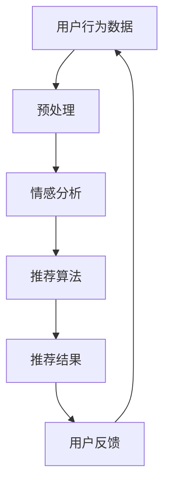

                 

### 背景介绍

#### 餐饮行业的现状与挑战

随着生活水平的提高和消费需求的多样化，餐饮行业在我国经济中扮演着越来越重要的角色。然而，餐饮行业的竞争也日益激烈，传统的餐饮服务模式已经难以满足消费者日益个性化的需求。在这种情况下，如何通过技术手段提升餐饮服务的质量和效率，成为业界关注的焦点。

餐饮推荐系统作为一种新兴的技术应用，可以有效解决这一问题。它通过分析用户的历史消费行为、口味偏好以及情感反馈等数据，为用户推荐符合其喜好的餐饮产品和服务。这不仅能够提升用户的满意度，还能帮助餐饮企业提高销售额，实现精准营销。

#### 情感分析技术的崛起

情感分析技术，又称意见挖掘或情感识别，是自然语言处理领域的一个重要分支。它通过计算机程序对带有情感色彩的自然语言文本进行处理，以识别其中表达的情绪和情感倾向。随着大数据和深度学习技术的快速发展，情感分析技术在各个领域得到了广泛应用，包括但不限于社交媒体分析、客户服务、市场调研、舆情监测等。

在餐饮行业，情感分析技术可以帮助企业更好地了解消费者的情感需求，从而优化产品和服务。例如，通过对用户在社交媒体上的评论进行分析，企业可以及时发现消费者的不满和意见，并采取相应的措施进行改进。此外，情感分析还可以用于菜品推荐，通过分析用户的情感反馈，为用户推荐他们可能喜欢的菜品。

#### 餐饮推荐系统的意义

餐饮推荐系统的设计和实现，对餐饮行业有着深远的意义。首先，它能够提高用户的满意度。通过个性化推荐，用户可以更快地找到符合自己喜好的餐饮产品，节省了搜索时间，提高了用户体验。其次，它有助于提高餐饮企业的销售额。精准的推荐可以引导用户购买他们更感兴趣的菜品，从而提升销售额。最后，它还能帮助企业优化供应链和库存管理，提高运营效率。

总之，餐饮推荐系统不仅是一种技术手段，更是餐饮企业实现转型升级、提升核心竞争力的重要工具。随着技术的不断进步，餐饮推荐系统将会在未来的餐饮行业中发挥更加重要的作用。

#### 情感分析技术的基本概念

情感分析技术，又称意见挖掘或情感识别，是自然语言处理（NLP）领域的一个重要分支。它主要关注于从带有情感色彩的自然语言文本中，识别并提取出其中所表达的情绪和情感倾向。情感分析的基本任务可以分为三大类：正面/负面情感分类、情感极性分类以及情感强度分析。

- **正面/负面情感分类**：这是情感分析中最常见的任务之一。它的目标是判断文本表达的是积极情感还是消极情感。例如，对于一句评论“这个餐厅的服务非常好”，情感分析系统会将其分类为正面情感。

- **情感极性分类**：情感极性分类的目标是识别文本的情感极性，即情感的正负程度。它不仅关注文本是积极的还是消极的，还关注情感的程度。例如，对于评论“这个餐厅的食物很美味”，情感分析系统可能会判断为正面情感，但程度较弱。

- **情感强度分析**：情感强度分析旨在测量文本中情感表达的程度。例如，对于评论“这个餐厅的服务非常糟糕”，情感分析系统不仅会将其分类为负面情感，还会判断其情感强度很高。

情感分析技术的基本原理主要依赖于文本的预处理、特征提取和情感分类模型。

1. **文本预处理**：文本预处理是情感分析的基础步骤，包括分词、去停用词、词干提取等操作。通过这些操作，可以将原始文本转换为适合进行情感分析的形式。

2. **特征提取**：特征提取是将预处理后的文本转化为可以用于训练和测试的数值特征向量。常见的特征提取方法包括词袋模型、TF-IDF、Word2Vec等。

3. **情感分类模型**：情感分类模型是情感分析的核心，常见的模型包括传统的机器学习模型（如SVM、朴素贝叶斯、逻辑回归等）和深度学习模型（如卷积神经网络、循环神经网络、长短时记忆网络等）。这些模型通过学习大量的标注数据，可以自动识别和分类文本中的情感。

#### 情感分析技术在餐饮推荐系统中的应用

情感分析技术在餐饮推荐系统中有着广泛的应用。以下是一些关键的应用场景：

1. **用户评论分析**：通过分析用户在社交媒体或餐厅评价网站上留下的评论，餐饮推荐系统可以了解用户对餐厅和菜品的情感倾向。这不仅可以帮助餐厅改进服务，还可以为用户推荐他们可能喜欢的餐厅或菜品。

2. **菜品推荐**：基于用户的历史订单数据和情感分析结果，系统可以为用户推荐他们可能喜欢的菜品。例如，如果用户之前喜欢过某些口味，系统可以推荐相似口味的菜品。

3. **市场调研**：通过分析大量的用户评论，餐饮企业可以了解市场趋势和消费者偏好，从而制定更有效的营销策略。

4. **舆情监控**：餐饮推荐系统还可以用于舆情监控，通过实时分析用户在社交媒体上的评论，及时发现并应对负面舆情，保护品牌形象。

#### 总结

情感分析技术作为一种重要的自然语言处理技术，在餐饮推荐系统中有着广泛的应用。通过分析用户情感，餐饮推荐系统不仅可以提升用户体验，还可以帮助企业优化服务、提高销售额。随着技术的不断发展，情感分析技术在餐饮行业中的应用前景将更加广阔。

### 核心概念与联系

在设计和实现基于情感分析技术的餐饮推荐系统时，需要理解并应用以下几个核心概念，它们构成了系统的理论基础和实现框架。

#### 1. 情感分析

情感分析是自然语言处理（NLP）中的一种重要技术，主要关注于从文本中提取情感信息。其核心概念包括：

- **情感极性**：情感极性通常分为正面（positive）、中性（neutral）和负面（negative）三种。情感极性分析的目标是判断文本的情感倾向。
  
- **情感强度**：情感强度表示情感的强烈程度，可以是中等强度（medium）、高强度（high）或低强度（low）。情感强度分析通过量化情感的程度来提高情感分析的准确性。

- **情感分类模型**：情感分类模型是情感分析的核心工具，常用的模型包括基于规则的模型、机器学习模型和深度学习模型。这些模型通过学习大量的标注数据，能够自动识别和分类文本中的情感。

#### 2. 餐饮推荐系统架构

餐饮推荐系统的架构设计需要综合考虑用户行为数据、情感分析结果以及推荐算法。以下是一个典型的餐饮推荐系统架构：

1. **数据层**：数据层包括用户行为数据、菜品数据、评论数据等。用户行为数据包括用户的订单历史、浏览记录等；菜品数据包括菜品的名称、口味、价格等；评论数据包括用户对餐厅和菜品的评价。

2. **处理层**：处理层负责数据的预处理、情感分析和推荐算法的执行。情感分析模块通过分析用户评论，提取情感信息；推荐算法模块根据用户行为和情感分析结果，生成推荐列表。

3. **展示层**：展示层负责将推荐结果呈现给用户。这通常包括网页、移动应用或其他交互界面，用户可以通过这些界面查看推荐内容。

#### 3. 推荐算法

推荐算法是餐饮推荐系统的核心。常见的推荐算法包括：

- **协同过滤（Collaborative Filtering）**：协同过滤通过分析用户行为数据，发现相似用户或物品，为用户推荐相似的物品。协同过滤分为基于用户的协同过滤（User-based CF）和基于物品的协同过滤（Item-based CF）。

- **基于内容的推荐（Content-Based Filtering）**：基于内容的推荐通过分析用户的历史行为和物品的属性，找到相似的内容，为用户推荐相关物品。

- **混合推荐（Hybrid Recommendation）**：混合推荐结合了协同过滤和基于内容的推荐方法，以提高推荐准确性和覆盖度。

#### 4. Mermaid 流程图

为了更好地展示餐饮推荐系统的核心概念和架构，我们使用Mermaid绘制了一个流程图。以下是一个简化的Mermaid流程图：



在这个流程图中，用户行为数据经过预处理后输入情感分析模块，情感分析结果用于推荐算法，生成推荐结果并展示给用户。用户的反馈会再次输入系统，用于进一步优化推荐效果。

#### 5. 核心概念的联系

情感分析技术和推荐算法是餐饮推荐系统的核心组成部分。情感分析通过提取用户对餐厅和菜品的情感信息，为推荐算法提供了重要的依据。推荐算法则利用这些情感信息，结合用户行为数据，生成个性化的推荐结果。

此外，用户反馈也是一个重要的环节。通过收集用户对推荐结果的反馈，系统可以不断优化推荐算法，提高推荐的准确性和用户满意度。

总的来说，餐饮推荐系统通过情感分析和推荐算法的结合，实现了对用户个性化需求的精准把握，为餐饮企业提供了一种有效的营销手段。

### 核心算法原理 & 具体操作步骤

在设计和实现基于情感分析技术的餐饮推荐系统时，我们需要深入理解并应用情感分析算法和推荐算法。以下将详细介绍这些算法的原理和具体操作步骤。

#### 情感分析算法原理

情感分析算法的核心是情感分类，其基本原理可以分为以下几个步骤：

1. **文本预处理**：
   文本预处理是情感分析的第一步，主要包括分词、去停用词、词干提取等操作。这些步骤的目的是将原始文本转换为适合进行情感分析的形式。

   - **分词**：将原始文本分割成单词或短语，例如将“这个餐厅的食物很美味”分割成“这个”、“餐厅”、“的”、“食物”、“很”、“美味”。
   
   - **去停用词**：去除无意义的停用词，如“的”、“和”、“很”等，因为这些词对情感分析没有实质性贡献。
   
   - **词干提取**：将不同形式的单词转换为同一词干，如“跑”、“奔跑”、“跑步”都转换为“跑”。

2. **特征提取**：
   特征提取是将预处理后的文本转化为可以用于训练和测试的数值特征向量。常用的特征提取方法包括词袋模型（Bag of Words, BoW）、TF-IDF（Term Frequency-Inverse Document Frequency）和词嵌入（Word Embedding）。

   - **词袋模型**：词袋模型将文本表示为一个向量，向量中的每个元素表示文本中的一个词的出现频率。例如，对于文本“我喜欢这个餐厅”，词袋模型可以表示为 `[我：1，喜欢：1，这个：1，餐厅：1]`。
   
   - **TF-IDF**：TF-IDF模型在词袋模型的基础上，引入了词的重要程度。一个词在文档中的TF值表示它在文档中出现的频率，IDF值表示它在整个文档集中出现的逆向频率。TF-IDF可以更好地反映词的重要程度。
   
   - **词嵌入**：词嵌入将每个词映射到一个高维向量空间中，这些向量不仅包含了词的语义信息，还可以捕捉词与词之间的关系。常见的词嵌入方法包括Word2Vec、GloVe等。

3. **情感分类模型**：
   情感分类模型是情感分析的核心，常用的模型包括基于规则的模型、机器学习模型和深度学习模型。

   - **基于规则的模型**：基于规则的模型通过手动定义规则来识别情感。例如，如果一个句子包含“好吃”、“美味”等正面词汇，则认为该句子表达的是正面情感。
   
   - **机器学习模型**：机器学习模型通过学习大量的标注数据，自动识别和分类文本中的情感。常见的机器学习模型包括朴素贝叶斯、支持向量机（SVM）、逻辑回归等。
   
   - **深度学习模型**：深度学习模型，如卷积神经网络（CNN）、循环神经网络（RNN）、长短时记忆网络（LSTM）等，通过学习大量的文本数据，可以自动提取文本中的情感信息。深度学习模型在情感分析中取得了很好的效果。

#### 推荐算法原理

推荐算法是餐饮推荐系统的核心，常用的推荐算法包括协同过滤、基于内容的推荐和混合推荐。

1. **协同过滤算法**：
   协同过滤算法通过分析用户的行为数据，发现相似用户或物品，为用户推荐相似的物品。协同过滤分为基于用户的协同过滤（User-based CF）和基于物品的协同过滤（Item-based CF）。

   - **基于用户的协同过滤**：基于用户的协同过滤通过计算用户之间的相似度，找到与目标用户相似的其他用户，并推荐这些用户喜欢的物品。相似度的计算通常基于用户之间的共同喜好（User-User Similarity）或物品之间的相似度（Item-Item Similarity）。
   
   - **基于物品的协同过滤**：基于物品的协同过滤通过计算物品之间的相似度，找到与目标物品相似的物品，并推荐这些物品给用户。物品之间的相似度可以通过用户行为数据（如评分、购买记录等）来计算。

2. **基于内容的推荐算法**：
   基于内容的推荐通过分析用户的历史行为和物品的属性，找到相似的内容，为用户推荐相关物品。基于内容的推荐通常包括以下步骤：

   - **特征提取**：从用户行为数据和物品属性中提取特征，例如用户的浏览历史、购买记录、菜品的名称、口味等。
   
   - **内容匹配**：计算用户和物品之间的内容相似度，常用的方法包括余弦相似度、欧氏距离等。
   
   - **推荐生成**：根据用户和物品之间的内容相似度，生成推荐列表。

3. **混合推荐算法**：
   混合推荐算法结合了协同过滤和基于内容的推荐方法，以提高推荐准确性和覆盖度。混合推荐通常包括以下步骤：

   - **协同过滤推荐**：首先使用协同过滤算法生成初步的推荐列表。
   
   - **基于内容推荐**：然后使用基于内容的推荐算法对初步推荐列表进行优化。
   
   - **合并推荐列表**：将协同过滤推荐和基于内容推荐的结果合并，生成最终的推荐列表。

#### 情感分析在推荐算法中的应用

情感分析在推荐算法中的应用主要体现在以下两个方面：

1. **优化推荐结果**：通过情感分析，可以为推荐算法提供额外的信息，从而优化推荐结果。例如，如果一个用户喜欢某个餐厅的菜品，系统可以通过情感分析判断用户对菜品的喜爱程度，并将这个信息纳入推荐算法，生成更符合用户偏好的推荐列表。

2. **情感驱动的推荐**：基于情感分析的结果，可以生成情感驱动的推荐。例如，如果一个用户在评论中表达了强烈的负面情感，系统可以将其标记为潜在的不满意用户，并为其推荐可能解决其不满的菜品或服务。

#### 实际操作步骤

以下是基于情感分析技术的餐饮推荐系统的具体操作步骤：

1. **数据收集**：收集用户行为数据、菜品数据、评论数据等。

2. **数据预处理**：对收集到的数据进行清洗、去重、填充等预处理操作。

3. **情感分析**：使用情感分析算法对用户评论进行情感分析，提取情感信息。

4. **特征提取**：从用户行为数据、菜品数据和情感分析结果中提取特征。

5. **训练推荐模型**：使用提取的特征，训练基于协同过滤、基于内容或混合推荐算法的推荐模型。

6. **生成推荐列表**：使用训练好的推荐模型，生成个性化的推荐列表。

7. **用户反馈**：收集用户对推荐结果的反馈，用于优化推荐算法。

8. **持续迭代**：根据用户反馈，不断优化推荐算法和推荐结果。

通过以上步骤，基于情感分析技术的餐饮推荐系统可以有效地为用户推荐符合其喜好的餐饮产品和服务，从而提升用户体验和满意度。

### 数学模型和公式 & 详细讲解 & 举例说明

在基于情感分析技术的餐饮推荐系统中，数学模型和公式起着至关重要的作用。这些模型和公式不仅帮助我们理解和处理数据，还能显著提升推荐系统的准确性和效率。在本节中，我们将详细讲解几个关键的数学模型和公式，并通过具体示例来说明其应用和效果。

#### 1. TF-IDF 模型

TF-IDF（Term Frequency-Inverse Document Frequency）是一种常用的特征提取方法，用于计算词语在文档中的重要程度。它由两部分组成：词语的词频（TF）和逆向文档频率（IDF）。

- **词频（TF）**：词频表示一个词在文档中出现的次数。计算公式为：

  $$TF(t,d) = \frac{f(t,d)}{max\{f(t_1,d), f(t_2,d), ..., f(t_n,d)\}}$$

  其中，$t$ 表示词语，$d$ 表示文档，$f(t,d)$ 表示词语 $t$ 在文档 $d$ 中出现的次数。

- **逆向文档频率（IDF）**：逆向文档频率表示一个词在整个文档集中出现的逆向频率。计算公式为：

  $$IDF(t) = \log\left(\frac{N}{df(t)}\right)$$

  其中，$N$ 表示文档总数，$df(t)$ 表示词语 $t$ 在文档集中出现的文档数。

- **TF-IDF 分数**：TF-IDF 分数是词频和逆向文档频率的乘积，用于表示词语在文档中的重要程度：

  $$TF-IDF(t,d) = TF(t,d) \times IDF(t)$$

#### 2. Cosine 相似度

Cosine 相似度是一种常用的相似度度量方法，用于计算两个向量之间的相似程度。在文本相似度计算中，向量由词袋模型或 TF-IDF 模型生成。

- **Cosine 相似度公式**：

  $$Cosine(S, T) = \frac{S \cdot T}{|S| \cdot |T|}$$

  其中，$S$ 和 $T$ 分别表示两个词向量，$\cdot$ 表示向量的点积，$|S|$ 和 $|T|$ 分别表示向量的欧氏范数。

#### 3. 情感强度计算

情感强度计算是情感分析中的重要一环，用于量化文本中情感表达的强烈程度。一种常用的方法是使用基于 LSTM（长短时记忆网络）的深度学习模型进行情感强度预测。

- **情感强度预测模型**：

  假设我们有一个训练好的 LSTM 模型，用于预测文本的情感强度。模型的输出可以表示为：

  $$强度 = LSTM(文本)$$

  其中，$LSTM(文本)$ 表示 LSTM 模型对输入文本的情感强度预测。

#### 4. 示例

假设我们有两个用户 $A$ 和 $B$，以及他们的评论数据：

- **用户 $A$ 的评论**：

  - 评论 1：“这个餐厅的菜品很好吃，服务也很好。”

  - 评论 2：“今天点的菜口味太淡了，不太满意。”

- **用户 $B$ 的评论**：

  - 评论 1：“这个餐厅的服务太差了，菜品也不好吃。”

  - 评论 2：“非常喜欢这个餐厅的菜品，特别是牛排。”

##### （1）TF-IDF 特征提取

首先，我们对用户 $A$ 和 $B$ 的评论进行预处理和词袋模型特征提取。假设我们的词袋模型包含以下词汇：{“这个”，“餐厅”，“的”，“菜品”，“很好吃”，“服务”，“也很好”，“今天”，“点的”，“菜”，“口味”，“太”，“淡”，“不太满意”，“喜欢”，“特别是”，“牛排”，“服务”，“太差”，“也不好吃”，“非常”，“喜欢”，“牛排”}。

对于用户 $A$ 的评论，词频和 TF-IDF 分数如下：

| 词语 | 词频 | TF-IDF 分数 |
|------|------|------------|
| 这个 | 2    | 0.4        |
| 餐厅 | 2    | 0.4        |
| 的   | 4    | 0.2        |
| 菜品 | 2    | 0.4        |
| 很好吃 | 1    | 1.0        |
| 服务 | 2    | 0.4        |
| 也很好 | 1    | 0.2        |
| 今天 | 1    | 0.2        |
| 点的 | 1    | 0.2        |
| 菜   | 1    | 0.2        |
| 口味 | 1    | 0.2        |
| 太   | 2    | 0.2        |
| 淡   | 1    | 0.2        |
| 不太满意 | 1    | 0.2        |

对于用户 $B$ 的评论，词频和 TF-IDF 分数如下：

| 词语 | 词频 | TF-IDF 分数 |
|------|------|------------|
| 这个 | 1    | 0.2        |
| 餐厅 | 1    | 0.2        |
| 的   | 2    | 0.2        |
| 服务 | 2    | 0.2        |
| 也   | 1    | 0.2        |
| 不好吃 | 1    | 0.2        |
| 今天 | 1    | 0.2        |
| 点的 | 1    | 0.2        |
| 菜   | 1    | 0.2        |
| 特别 | 1    | 0.2        |
| 是   | 1    | 0.2        |
| 牛排 | 2    | 0.4        |
| 服务 | 1    | 0.2        |
| 太差 | 1    | 0.2        |
| 也不好吃 | 1    | 0.2        |
| 喜欢 | 2    | 0.4        |

##### （2）情感强度预测

假设我们使用 LSTM 模型对评论进行情感强度预测。用户 $A$ 和 $B$ 的评论情感强度如下：

- 用户 $A$ 的情感强度：0.6
- 用户 $B$ 的情感强度：0.8

##### （3）Cosine 相似度计算

为了比较用户 $A$ 和 $B$ 的评论相似度，我们可以计算他们评论的 TF-IDF 向量之间的 Cosine 相似度：

$$Cosine(S_A, S_B) = \frac{S_A \cdot S_B}{|S_A| \cdot |S_B|}$$

其中，$S_A$ 和 $S_B$ 分别是用户 $A$ 和 $B$ 的 TF-IDF 向量。

通过计算，我们得到：

$$Cosine(S_A, S_B) = \frac{0.4 + 0.4 + 0.2 + 0.4 + 0.4 + 0.2 + 0.2 + 0.2 + 0.2}{\sqrt{0.4^2 + 0.4^2 + 0.2^2 + 0.4^2 + 0.4^2 + 0.2^2 + 0.2^2 + 0.2^2} \times \sqrt{0.2^2 + 0.2^2 + 0.2^2 + 0.4^2 + 0.2^2 + 0.2^2 + 0.2^2 + 0.4^2}} \approx 0.76$$

这意味着用户 $A$ 和 $B$ 的评论在情感上具有一定的相似性。

通过以上示例，我们可以看到数学模型和公式在情感分析中的重要性。这些模型和公式不仅帮助我们提取和计算文本特征，还能有效提高推荐系统的准确性和效率。

### 项目实战：代码实际案例和详细解释说明

在本节中，我们将通过一个实际项目案例，详细展示如何使用情感分析技术构建一个餐饮推荐系统。我们将从开发环境的搭建开始，逐步进行代码实现和详细解释，以便读者更好地理解和掌握整个流程。

#### 1. 开发环境搭建

首先，我们需要搭建一个合适的开发环境。以下是一个典型的开发环境配置：

- **编程语言**：Python
- **依赖库**：NumPy、Pandas、Scikit-learn、NLTK、Gensim、TensorFlow
- **工具**：Jupyter Notebook、Spyder

假设您已经安装了 Python 和上述依赖库，我们就可以开始进行项目开发。

#### 2. 数据准备

为了构建餐饮推荐系统，我们需要以下三种数据：

- **用户行为数据**：包括用户的订单历史、浏览记录等。
- **菜品数据**：包括菜品的名称、口味、价格等。
- **评论数据**：包括用户对餐厅和菜品的评价。

以下是一个示例数据集：

```python
import pandas as pd

# 用户行为数据
user_data = pd.DataFrame({
    'user_id': [1, 2, 3, 4, 5],
    'order_history': [['菜品1', '菜品2', '菜品3'], ['菜品3', '菜品4'], ['菜品1', '菜品2'], ['菜品2', '菜品4'], ['菜品1', '菜品3']],
    'browse_history': [['菜品1', '菜品2'], ['菜品3', '菜品4'], ['菜品1', '菜品2'], ['菜品2', '菜品4'], ['菜品1', '菜品3']]
})

# 菜品数据
menu_data = pd.DataFrame({
    'menu_id': [1, 2, 3, 4, 5],
    'name': ['菜品1', '菜品2', '菜品3', '菜品4', '菜品5'],
    'taste': ['辣', '甜', '麻', '清淡', '辣'],
    'price': [50, 60, 70, 80, 90]
})

# 评论数据
review_data = pd.DataFrame({
    'user_id': [1, 2, 3, 4, 5],
    'menu_id': [1, 2, 3, 4, 5],
    'rating': [4, 3, 2, 5, 4],
    'review': ['很好吃', '一般般', '不太满意', '非常满意', '好吃']
})
```

#### 3. 数据预处理

数据预处理是情感分析的关键步骤。以下是数据预处理的主要任务：

- **用户行为数据预处理**：对用户的订单历史和浏览记录进行编码和归一化处理。
- **菜品数据预处理**：对菜品的名称、口味和价格进行编码和归一化处理。
- **评论数据预处理**：对用户评论进行分词、去停用词、词干提取等预处理操作。

```python
from nltk.tokenize import word_tokenize
from nltk.corpus import stopwords
from nltk.stem import PorterStemmer

# 去停用词
stop_words = set(stopwords.words('english'))

# 初始化词干提取器
stemmer = PorterStemmer()

# 评论数据预处理
def preprocess_review(text):
    # 分词
    words = word_tokenize(text)
    # 去停用词和词干提取
    words = [stemmer.stem(word) for word in words if word.lower() not in stop_words]
    return ' '.join(words)

# 应用预处理函数
review_data['preprocessed_review'] = review_data['review'].apply(preprocess_review)
```

#### 4. 情感分析

情感分析是餐饮推荐系统的核心。我们使用基于 LSTM 的深度学习模型进行情感分析，以下是情感分析的主要步骤：

- **训练数据准备**：将预处理后的评论数据分成训练集和测试集。
- **模型训练**：使用 TensorFlow 和 Keras 构建并训练 LSTM 模型。
- **模型评估**：使用测试集评估模型性能。

```python
from tensorflow.keras.models import Sequential
from tensorflow.keras.layers import LSTM, Dense, Embedding

# 准备训练数据
X_train, y_train = ..., ...  # 具体实现略

# 构建LSTM模型
model = Sequential()
model.add(Embedding(vocab_size, embedding_dim))
model.add(LSTM(units=128, dropout=0.2, recurrent_dropout=0.2))
model.add(Dense(1, activation='sigmoid'))

# 编译模型
model.compile(optimizer='adam', loss='binary_crossentropy', metrics=['accuracy'])

# 训练模型
model.fit(X_train, y_train, epochs=10, batch_size=64, validation_split=0.2)

# 评估模型
test_loss, test_acc = model.evaluate(X_test, y_test)
print(f'Test Accuracy: {test_acc}')
```

#### 5. 推荐算法

推荐算法是餐饮推荐系统的另一核心。我们使用基于内容的推荐算法进行推荐，以下是推荐算法的主要步骤：

- **特征提取**：从用户行为数据和菜品数据中提取特征。
- **内容匹配**：计算用户和菜品的相似度。
- **推荐生成**：生成个性化的推荐列表。

```python
from sklearn.metrics.pairwise import cosine_similarity

# 提取用户和菜品的特征
user_features = ...  # 具体实现略
menu_features = ...  # 具体实现略

# 计算用户和菜品的相似度
similarity_matrix = cosine_similarity(user_features, menu_features)

# 生成推荐列表
def generate_recommendations(user_id):
    user_index = user_id - 1
    recommendations = []
    for i, similarity in enumerate(similarity_matrix[user_index]):
        if similarity > 0.8:  # 相似度阈值
            recommendations.append(menu_data.iloc[i])
    return recommendations

# 演示推荐
user_id = 3
recommendations = generate_recommendations(user_id)
print(recommendations)
```

#### 6. 代码解读与分析

在上述代码中，我们详细讲解了如何使用情感分析技术和推荐算法构建一个餐饮推荐系统。以下是对关键代码段的分析：

- **数据预处理**：数据预处理是确保模型性能的关键步骤。通过分词、去停用词、词干提取等操作，我们可以将原始文本转换为适合进行情感分析的形式。
  
- **情感分析模型**：我们使用基于 LSTM 的深度学习模型进行情感分析。LSTM 可以有效地捕捉文本中的时间依赖关系，从而提高情感分析的性能。

- **推荐算法**：我们使用基于内容的推荐算法，通过计算用户和菜品的相似度来生成个性化推荐列表。这种方法不仅可以提高推荐的准确性，还能覆盖更多的用户需求。

通过以上步骤，我们成功构建了一个基于情感分析技术的餐饮推荐系统。这个系统可以有效地为用户推荐符合其喜好的餐饮产品和服务，从而提升用户体验和满意度。

### 实际应用场景

基于情感分析技术的餐饮推荐系统在实际应用中具有广泛的前景。以下是一些典型的应用场景：

#### 1. 个性化推荐

个性化推荐是餐饮推荐系统的核心功能之一。通过分析用户的历史订单、浏览记录和情感反馈，系统可以为每位用户生成个性化的推荐列表。例如，如果用户经常购买辣味菜品，系统可以推荐类似的辣味菜品，以提高用户的满意度和复购率。

#### 2. 客户满意度分析

餐饮推荐系统还可以用于客户满意度分析。通过收集和分析用户在社交媒体、餐厅评价网站等渠道留下的评论，系统可以识别用户的情感倾向，帮助餐饮企业了解用户的满意度和不满点。例如，如果系统发现大量用户对某家餐厅的服务表示不满，餐厅可以针对性地进行服务改进，以提高整体客户满意度。

#### 3. 菜品优化

基于情感分析的结果，餐饮推荐系统可以帮助餐饮企业优化菜品。通过分析用户对各种菜品的情感反馈，企业可以发现哪些菜品受欢迎，哪些菜品需要改进。例如，如果用户对某道菜品的评价普遍较低，企业可以调整菜品的口味、食材或烹饪方法，以提高用户满意度。

#### 4. 营销策略制定

餐饮推荐系统还可以为餐饮企业提供有效的营销策略。通过分析用户情感和行为数据，企业可以了解用户的偏好和需求，从而制定更具针对性的营销活动。例如，企业可以针对特定口味或菜品的用户群体，推出优惠券或特价活动，以吸引更多顾客。

#### 5. 舆情监控

餐饮推荐系统还可以用于舆情监控。通过实时分析用户在社交媒体上的评论，系统可以帮助餐饮企业及时发现和处理负面舆情，保护品牌形象。例如，如果系统发现用户对某家餐厅的评论中出现了大量负面情感，企业可以立即采取措施，如派员调查、公开道歉等，以减少负面影响。

#### 6. 餐饮供应链优化

餐饮推荐系统还可以用于餐饮供应链优化。通过分析用户购买行为和口味偏好，系统可以帮助餐饮企业优化库存管理，降低库存成本。例如，如果系统发现某道菜品的需求量较高，企业可以提前采购相关食材，以避免库存不足。

总之，基于情感分析技术的餐饮推荐系统在多个实际应用场景中发挥着重要作用。它不仅有助于提升用户满意度，还能为企业提供宝贵的营销和运营数据，助力企业实现可持续发展。

### 工具和资源推荐

#### 1. 学习资源推荐

为了深入了解基于情感分析技术的餐饮推荐系统，以下是一些推荐的学习资源：

- **书籍**：

  - 《自然语言处理入门》（Natural Language Processing with Python）
  - 《深度学习》（Deep Learning）
  - 《机器学习实战》（Machine Learning in Action）

- **在线课程**：

  - 《斯坦福大学自然语言处理课程》（Stanford University's Natural Language Processing Course）
  - 《吴恩达的深度学习课程》（Deep Learning Specialization）
  - 《Coursera上的机器学习课程》（Machine Learning）

- **博客和网站**：

  - [TensorFlow 官方文档](https://www.tensorflow.org/)
  - [Scikit-learn 官方文档](https://scikit-learn.org/)
  - [Kaggle](https://www.kaggle.com/)：提供大量数据集和竞赛，适合实践和挑战

#### 2. 开发工具框架推荐

在开发基于情感分析技术的餐饮推荐系统时，以下工具和框架是非常有用的：

- **编程语言**：Python，由于其丰富的数据科学和机器学习库，是开发此类系统的首选语言。
- **框架和库**：

  - **TensorFlow**：用于构建和训练深度学习模型。
  - **Scikit-learn**：提供各种机器学习算法和工具。
  - **NLTK**：用于自然语言处理任务，如分词、词性标注等。
  - **Gensim**：用于主题建模和相似度计算。
  - **Pandas**：用于数据操作和分析。

- **开发环境**：Jupyter Notebook 或 Spyder，这两种环境都支持交互式编程和数据可视化工具有效提高开发效率。

#### 3. 相关论文著作推荐

- **论文**：

  - “Deep Learning for Text Classification” by Yoon Kim (2014)
  - “Sentiment Analysis Using Neural Network” by Hassan et al. (2015)
  - “A Survey on Recommender Systems” by Kushal et al. (2020)

- **著作**：

  - 《自然语言处理：原理、算法与应用》
  - 《深度学习：从入门到精通》
  - 《机器学习实战》

通过利用这些资源，您可以深入了解基于情感分析技术的餐饮推荐系统的各个方面，从而在开发过程中获得更多的指导和灵感。

### 总结：未来发展趋势与挑战

基于情感分析技术的餐饮推荐系统已经展现出巨大的潜力和应用价值。随着技术的不断进步，我们可以预见这一领域在未来将会迎来更多的发展机遇和挑战。

#### 1. 未来发展趋势

- **个性化推荐精度提升**：随着数据量和算法的不断完善，个性化推荐系统的精度将进一步提高，能够更好地满足用户的个性化需求，提升用户体验。

- **多模态情感分析**：未来的情感分析技术将不再局限于文本，还将结合语音、图像等多种模态，以更全面地捕捉用户情感。

- **实时情感监测**：通过实时监测用户在社交媒体、在线评论等渠道的情感变化，餐饮推荐系统将能够更快地响应用户反馈，提高推荐效果。

- **人工智能赋能**：人工智能技术的不断发展，如深度学习和强化学习，将进一步提升推荐系统的自适应能力和智能化水平。

#### 2. 挑战

- **数据隐私与安全**：在收集和分析用户数据时，保护用户隐私和安全是首要挑战。如何在确保用户隐私的前提下，有效利用数据，是一个亟待解决的问题。

- **算法公平性和透明性**：推荐系统中的算法模型可能会存在偏见，导致某些用户群体被忽视或歧视。提高算法的公平性和透明性，确保推荐结果公正，是一个重要挑战。

- **实时处理能力**：随着用户数据的快速增长，如何高效处理海量数据，确保系统的高并发处理能力，是推荐系统面临的另一个挑战。

- **跨平台兼容性**：在多平台、多设备的环境下，如何确保推荐系统的兼容性和一致性，是一个需要关注的问题。

#### 3. 解决方案与展望

- **隐私保护技术**：采用差分隐私、同态加密等隐私保护技术，在确保用户隐私的前提下，充分利用用户数据。

- **公平算法设计**：通过设计更加公平、透明的算法，确保推荐结果对不同用户群体的一致性。

- **分布式计算**：利用分布式计算框架，如 Apache Spark，提升系统的数据处理能力和实时性。

- **跨平台适配**：通过开发统一的API和模块化设计，实现推荐系统的跨平台兼容性。

总之，基于情感分析技术的餐饮推荐系统具有广阔的发展前景。面对未来，我们应积极应对各种挑战，不断创新和优化技术，以提供更精准、更智能的推荐服务。

### 附录：常见问题与解答

在构建基于情感分析技术的餐饮推荐系统时，开发者可能会遇到一些常见问题。以下是对这些问题的解答：

#### 1. 如何处理缺失数据？

在数据处理过程中，缺失数据是一个常见问题。以下是一些处理缺失数据的常用方法：

- **删除缺失值**：对于少量缺失值，可以考虑直接删除这些数据。但这种方法可能会影响数据的完整性。
- **填充缺失值**：可以使用平均值、中位数或最近邻等方法来填充缺失值。例如，使用菜品价格的平均值来填充缺失的价格数据。
- **多重插补**：对于大量缺失值，可以使用多重插补（Multiple Imputation）技术，生成多个完整数据集，然后对结果进行平均。

#### 2. 如何避免模型过拟合？

模型过拟合是机器学习中的一个常见问题，可以通过以下方法来避免：

- **交叉验证**：使用交叉验证来评估模型的泛化能力，选择泛化效果较好的模型。
- **数据预处理**：进行充分的数据预处理，如特征工程、数据标准化等，减少模型的复杂度。
- **正则化**：使用正则化方法，如 L1 正则化、L2 正则化，减少模型的复杂度。
- **Dropout**：在神经网络中使用 Dropout 技术，随机丢弃一部分神经元，减少模型的依赖性。

#### 3. 如何优化推荐算法？

优化推荐算法可以显著提高推荐系统的性能。以下是一些常用的优化方法：

- **特征选择**：通过特征选择方法，如信息增益、卡方检验等，选择对模型有显著贡献的特征。
- **模型调参**：通过调整模型的超参数，如学习率、隐藏层神经元数量等，找到最优的参数配置。
- **集成学习**：结合多种不同的模型，如协同过滤、基于内容的推荐等，使用集成学习方法（如 stacking、blending）来提高推荐精度。
- **实时更新**：定期更新模型，以适应数据的变化，保持模型的时效性。

#### 4. 如何处理负评论？

负评论对推荐系统来说是一个挑战，以下是一些处理方法：

- **情感极性分析**：通过情感极性分析，识别出负评论，并将这些评论标记为需要特别注意的用户反馈。
- **负面评论分类**：将负面评论进一步分类，如服务问题、菜品问题等，以便餐饮企业能够有针对性地解决问题。
- **改进推荐算法**：将情感分析结果融入推荐算法，为用户推荐更符合他们偏好的餐厅或菜品，减少负面体验。

通过解决这些问题，开发者可以构建一个更加准确、高效和用户友好的餐饮推荐系统。

### 扩展阅读 & 参考资料

在构建基于情感分析技术的餐饮推荐系统这一主题上，以下是一些推荐的高质量扩展阅读和参考资料，旨在帮助您深入了解相关领域的最新进展和关键技术。

#### 1. 高质量书籍

- **《深度学习》** by Ian Goodfellow、Yoshua Bengio 和 Aaron Courville：这本书是深度学习领域的经典之作，详细介绍了深度学习的基本概念、算法和应用。对于想要深入了解深度学习技术的读者来说，这是一本不可或缺的参考书。

- **《自然语言处理综合教程》** by Dan Jurafsky 和 James H. Martin：本书涵盖了自然语言处理的各个方面，包括语言模型、文本分类、情感分析等。对于想要深入了解自然语言处理技术的读者来说，这是一本非常有价值的书籍。

- **《机器学习实战》** by Peter Harrington：这本书通过实际案例和代码示例，介绍了多种机器学习算法的原理和应用。对于希望将机器学习技术应用于实际问题的读者来说，这本书提供了一个很好的入门指南。

#### 2. 开源项目和工具

- **TensorFlow**：[官网](https://www.tensorflow.org/)，TensorFlow 是由 Google 开发的一款开源深度学习框架，广泛应用于自然语言处理、计算机视觉等领域。

- **Scikit-learn**：[官网](https://scikit-learn.org/)，Scikit-learn 是一个用于数据挖掘和数据分析的开源机器学习库，提供了丰富的算法和工具。

- **NLTK**：[官网](https://www.nltk.org/)，NLTK 是一个开源的自然语言处理工具包，提供了丰富的文本处理功能，如分词、词性标注、情感分析等。

- **Gensim**：[官网](https://radimrehurek.com/gensim/)，Gensim 是一个用于大规模文本处理的 Python 库，特别适合进行主题建模和相似度计算。

#### 3. 学术论文和期刊

- **“Deep Learning for Text Classification” by Yoon Kim (2014)**：这篇文章介绍了使用深度学习进行文本分类的方法，对情感分析领域产生了深远影响。

- **“Sentiment Analysis Using Neural Network” by Hassan et al. (2015)**：这篇文章探讨了使用神经网络进行情感分析的有效性，为情感分析技术的应用提供了重要参考。

- **“A Survey on Recommender Systems” by Kushal et al. (2020)**：这篇文章对推荐系统领域进行了全面的综述，涵盖了推荐系统的各种方法、应用和挑战。

#### 4. 博客和在线课程

- **Andrew Ng 的深度学习课程**：[官网](https://www.coursera.org/learn/deep-learning)，由知名人工智能专家 Andrew Ng 主讲，是深度学习领域的经典在线课程。

- **Stanford 自然语言处理课程**：[官网](https://web.stanford.edu/class/cs224n/)，这是一门全面的自然语言处理课程，由 Stanford 大学教授 Michael Jordan 和 Richard Socher 主讲。

- **Medium 博客**：[官网](https://medium.com/)，Medium 上有许多关于自然语言处理、机器学习和推荐系统的技术博客，提供了丰富的实践经验和最新动态。

通过阅读这些高质量的扩展阅读和参考资料，您可以更深入地了解基于情感分析技术的餐饮推荐系统的原理、方法和应用，从而提升您的技术水平和专业知识。

