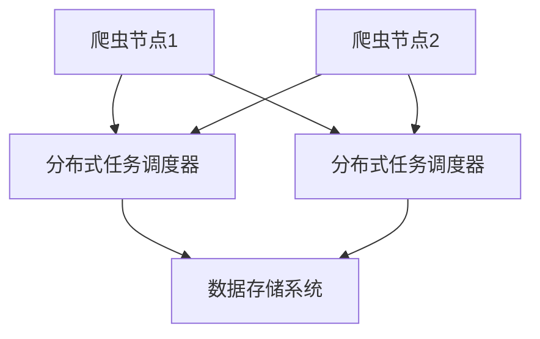

                 

### 背景介绍

随着互联网的飞速发展，数据的获取、处理和利用已经成为各个行业发展的关键驱动力。特别是社交媒体平台，如新浪微博，其海量、多样化的数据为研究人员、企业和个人提供了丰富的信息资源。然而，如何高效地获取这些数据，并对海量数据进行处理与分析，是一个具有挑战性的问题。这时候，分布式爬虫技术应运而生，为数据获取提供了强大的支持。

分布式爬虫是一种利用多个节点协同工作，共同完成大规模数据采集任务的爬虫系统。它能够克服单点爬虫在处理大规模数据时遇到的性能瓶颈，提高数据获取的效率和准确性。在新浪微博这种拥有海量用户的社交媒体平台上，分布式爬虫的应用尤为重要。通过分布式爬虫，我们可以高效地抓取微博用户的发布内容、评论、转发等数据，为数据挖掘和分析提供基础。

本文将围绕基于新浪微博的分布式爬虫技术展开讨论。我们将首先介绍分布式爬虫的基本原理和核心概念，接着探讨新浪微博平台的特点和数据结构，然后详细讲解分布式爬虫的实现步骤，包括环境搭建、代码实现和解析。在此基础上，我们还将介绍如何对爬取到的数据进行可视化处理，最后总结实际应用场景，推荐相关学习资源和开发工具。

通过本文的阅读，您将了解到分布式爬虫的原理和实现，掌握基于新浪微博的分布式爬虫技术的具体操作步骤，并学会如何对数据进行分析和可视化处理。希望本文能为您在数据采集和处理领域提供有益的启示和实践指导。让我们一起探索分布式爬虫技术在新浪微博数据采集中的应用吧！<|im_sep|>### 核心概念与联系

在深入探讨基于新浪微博的分布式爬虫之前，我们需要理解一些核心概念和它们之间的相互关系。分布式爬虫系统通常由几个关键组件组成，包括爬虫节点、分布式任务调度器、数据存储系统等。以下是这些核心概念及其在分布式爬虫系统中作用的具体介绍：

#### 爬虫节点

爬虫节点是分布式爬虫系统中的基本单元，负责执行具体的网页抓取任务。每个节点通常由一个或多个线程组成，这些线程按照预定的策略爬取网页，提取有用信息。在新浪微博的分布式爬虫系统中，爬虫节点的主要任务是获取微博用户发布的微博内容、评论、转发等信息。为了确保数据采集的效率和完整性，爬虫节点需要具备以下特点：

1. **并发能力**：节点需要能够同时处理多个请求，以提高数据采集速度。
2. **容错性**：节点在遇到网络故障、服务器拒绝访问等异常情况时，需要能够自动恢复或切换到其他可用节点。
3. **灵活性**：节点需要能够根据任务需求动态调整爬取策略，如调整爬取频率、请求头设置等。

#### 分布式任务调度器

分布式任务调度器是分布式爬虫系统的核心组件之一，负责将爬取任务合理分配到各个爬虫节点上，确保任务的执行效率和系统资源的合理利用。任务调度器通常具备以下功能：

1. **任务分发**：根据节点能力和任务需求，将爬取任务合理分配到不同的爬虫节点。
2. **负载均衡**：通过监控节点的任务处理情况，实现任务在节点间的动态负载均衡。
3. **故障恢复**：在节点出现故障时，自动重新分配任务，确保系统稳定运行。

#### 数据存储系统

数据存储系统用于存储爬取到的数据，通常包括数据库、文件系统等。在新浪微博的分布式爬虫系统中，数据存储系统需要满足以下要求：

1. **高并发读写**：能够应对大量数据的快速读写操作，保证数据存储的效率。
2. **数据安全性**：确保数据在存储过程中不被泄露、篡改或丢失。
3. **扩展性**：能够根据数据量的增长，灵活扩展存储空间和性能。

#### Mermaid 流程图

为了更好地展示分布式爬虫系统的架构和工作流程，我们使用 Mermaid 流程图来描述各个组件之间的关系和交互过程。以下是一个简化的 Mermaid 流程图示例：



在上面的流程图中，A 和 D 分别代表两个爬虫节点，它们将抓取到的数据发送给分布式任务调度器 B 和 C。调度器 B 和 C 负责将数据合理分配到各个节点，并最终存储到数据存储系统 E 中。

#### 核心概念与架构的联系

分布式爬虫系统的核心概念和架构紧密相连，每个组件都扮演着关键角色，共同确保系统的高效运行。以下是核心概念与架构之间的联系：

1. **爬虫节点与任务调度器**：爬虫节点负责执行具体的抓取任务，任务调度器负责任务分配和负载均衡，二者共同确保数据采集的效率和稳定性。
2. **任务调度器与数据存储系统**：任务调度器负责将数据存储到数据存储系统中，确保数据的持久化和安全性。同时，任务调度器还通过监控数据存储系统的状态，调整任务分配策略，以应对系统负载的变化。
3. **数据存储系统与爬虫节点**：数据存储系统用于存储爬取到的数据，爬虫节点通过访问数据存储系统获取已存储的数据，以便进行后续的分析和处理。

通过理解这些核心概念和架构之间的关系，我们可以更深入地掌握分布式爬虫系统的原理，为后续的详细实现步骤打下坚实基础。<|im_sep|>### 核心算法原理 & 具体操作步骤

在了解了分布式爬虫系统的核心概念和架构之后，接下来我们将详细探讨分布式爬虫的核心算法原理和具体操作步骤。本文将围绕新浪微博的分布式爬虫展开，具体包括以下内容：

#### 1. 爬取策略

爬取策略是分布式爬虫的核心，决定了爬虫如何高效、合规地获取数据。以下是新浪微博分布式爬虫常用的几种爬取策略：

1. **用户行为模拟**：为了模拟真实用户的操作，爬虫需要使用合适的用户代理、IP 地址、User-Agent 等信息，确保爬取行为不被微博平台识别为恶意爬虫。
2. **URL 遗留和随机化**：爬虫在爬取微博内容时，需要随机选择微博 URL，避免集中访问特定 URL，以减少被屏蔽的风险。
3. **时间间隔控制**：为了降低服务器负载，爬虫在访问微博页面时，需要设置合适的时间间隔，避免频繁请求。
4. **错误处理和重试**：爬虫在遇到错误（如网络连接失败、请求超时等）时，需要具备重试机制，确保数据采集的完整性。

#### 2. 爬取流程

新浪微博分布式爬虫的爬取流程主要包括以下几个步骤：

1. **初始化**：初始化爬虫节点，设置用户代理、IP 地址、User-Agent 等信息，并连接分布式任务调度器。
2. **任务获取**：爬虫节点从任务调度器获取待爬取的微博 URL。
3. **页面请求**：爬虫节点使用 HTTP 请求获取微博页面内容。
4. **内容解析**：爬虫节点对获取的微博页面内容进行解析，提取微博信息，如微博 ID、用户 ID、微博内容、评论、转发等。
5. **数据存储**：将提取的微博信息存储到数据存储系统中。
6. **重试与异常处理**：在爬取过程中，爬虫节点需要处理各种异常情况，如网络错误、请求超时等，确保数据采集的完整性。
7. **结束**：爬虫节点完成一次任务后，返回任务调度器，等待下一次任务分配。

#### 3. 分布式任务调度

分布式任务调度是确保爬取任务高效、稳定执行的关键。以下是新浪微博分布式爬虫任务调度的基本原理和具体实现：

1. **任务分发**：任务调度器将待爬取的微博 URL 分发到各个爬虫节点。分发策略可以采用轮询、负载均衡等方式，确保任务分配的公平性和效率。
2. **负载均衡**：任务调度器通过实时监控爬虫节点的负载情况，动态调整任务分配策略，避免部分节点负载过高，影响系统整体性能。
3. **故障恢复**：当爬虫节点出现故障时，任务调度器自动将该节点的任务重新分配给其他正常节点，确保系统稳定运行。
4. **任务状态监控**：任务调度器实时监控任务执行状态，包括任务完成情况、数据存储状态等，确保数据采集的完整性和准确性。

#### 4. 数据存储

数据存储是分布式爬虫系统的关键环节，直接关系到数据的持久化和安全性。以下是新浪微博分布式爬虫数据存储的基本原理和具体实现：

1. **分布式数据库**：使用分布式数据库（如 MongoDB、Hadoop HDFS 等）存储爬取到的数据，确保数据存储的高并发读写能力。
2. **数据清洗和去重**：在数据存储前，对数据进行清洗和去重处理，去除重复和无效数据，提高数据质量。
3. **数据索引**：对存储的数据建立索引，便于快速查询和数据分析。
4. **数据备份和恢复**：定期对数据进行备份，确保数据的安全性和可靠性。同时，实现数据恢复机制，以应对意外情况。

#### 5. 安全与合规

在实施新浪微博分布式爬虫过程中，需要严格遵守相关法律法规和平台规则，确保数据采集的合规性。具体措施包括：

1. **遵守法律法规**：遵循《中华人民共和国网络安全法》等相关法律法规，确保数据采集和处理符合法律规定。
2. **尊重用户隐私**：在数据采集和处理过程中，尊重用户隐私，不泄露、篡改或滥用用户数据。
3. **合规性审核**：定期对爬虫系统进行合规性审核，确保数据采集和处理行为符合平台规则和法律法规要求。

通过以上步骤，我们可以实现一个基于新浪微博的分布式爬虫系统，高效、稳定地获取微博数据，为数据分析和应用提供基础。<|im_sep|>### 数学模型和公式 & 详细讲解 & 举例说明

在分布式爬虫系统中，数学模型和公式发挥着至关重要的作用。它们不仅帮助我们理解系统的运作原理，还提供了有效的算法优化和性能评估工具。以下将详细介绍一些关键的数学模型和公式，并通过具体实例进行说明。

#### 1. 数据采集效率模型

分布式爬虫系统的核心目标是高效地获取数据。数据采集效率（Efficiency）可以用以下公式表示：

\[ E = \frac{D}{T \times N} \]

其中：
- \( E \) 表示数据采集效率。
- \( D \) 表示在一定时间内采集的数据量。
- \( T \) 表示单个节点的平均处理时间。
- \( N \) 表示节点数量。

通过优化 \( T \) 和 \( N \)，可以提高数据采集效率。例如，假设我们在 10 分钟内需要采集 1000 条微博，单个节点的处理时间为 1 分钟。根据公式，我们可以计算出需要至少 10 个节点才能满足数据采集效率的要求。

#### 2. 任务分配模型

任务分配是分布式爬虫系统的关键步骤。常见的任务分配模型包括轮询分配和负载均衡分配。

**轮询分配模型**：

\[ T_i = \frac{1}{N} \]

其中：
- \( T_i \) 表示第 \( i \) 个节点的平均任务量。
- \( N \) 表示节点数量。

**负载均衡分配模型**：

负载均衡分配模型通过实时监控节点的负载情况，动态调整任务分配策略。一个简单的负载均衡公式为：

\[ T_i = \alpha \times T_{\text{avg}} + (1 - \alpha) \times L_i \]

其中：
- \( T_i \) 表示第 \( i \) 个节点的平均任务量。
- \( T_{\text{avg}} \) 表示所有节点的平均任务量。
- \( L_i \) 表示第 \( i \) 个节点的当前负载。
- \( \alpha \) 是权重系数，用于调整负载均衡策略的敏感性。

例如，假设节点 A 的当前负载为 50%，节点 B 的当前负载为 20%。我们可以设置 \( \alpha \) 为 0.5，使得任务分配更加倾向于负载较高的节点。

\[ T_A = 0.5 \times T_{\text{avg}} + (1 - 0.5) \times 50\% \]
\[ T_B = 0.5 \times T_{\text{avg}} + (1 - 0.5) \times 20\% \]

通过上述公式，我们可以计算出节点 A 和节点 B 的平均任务量。

#### 3. 网络延迟模型

网络延迟是影响分布式爬虫系统性能的重要因素。一个简单的网络延迟模型可以表示为：

\[ L = \alpha \times D + (1 - \alpha) \times R \]

其中：
- \( L \) 表示网络延迟。
- \( D \) 表示直接传输时间。
- \( R \) 表示重传时间。
- \( \alpha \) 是权重系数，用于调整直接传输时间和重传时间的相对重要性。

例如，假设直接传输时间为 2 秒，重传时间为 3 秒，我们可以设置 \( \alpha \) 为 0.6，表示网络延迟主要由直接传输时间决定。

\[ L = 0.6 \times 2 + (1 - 0.6) \times 3 = 2.8 \text{ 秒} \]

通过这个模型，我们可以预测系统的网络延迟，并采取相应的优化措施。

#### 4. 数据存储优化模型

在分布式爬虫系统中，数据存储的效率和安全性同样重要。一种常见的数据存储优化模型是基于键值存储（KV Store）的数据分片策略：

\[ S_i = \left\lfloor \frac{N}{M} \right\rfloor \]

其中：
- \( S_i \) 表示第 \( i \) 个分片的大小。
- \( N \) 表示总数据量。
- \( M \) 表示分片数量。

例如，如果总数据量为 1000 条微博，我们将其分为 5 个分片，每个分片的大小约为 200 条微博。

通过上述数学模型和公式，我们可以更深入地理解分布式爬虫系统的运作原理，并针对具体场景进行优化。在实际应用中，这些模型和公式可以相互结合，共同提高分布式爬虫系统的性能和效率。<|im_sep|>### 项目实战：代码实际案例和详细解释说明

为了更好地展示基于新浪微博的分布式爬虫的实现过程，下面我们将通过一个实际项目案例来详细讲解代码实现和解读。

#### 5.1 开发环境搭建

首先，我们需要搭建一个合适的开发环境。以下是开发环境的基本要求：

- 操作系统：Linux 或 macOS
- 编程语言：Python 3.8 或以上版本
- 分布式任务调度器：Celery
- 数据存储系统：MongoDB
- 爬虫框架：Scrapy

安装必要的软件和库：

```bash
# 安装 Python 3.8
sudo apt-get install python3.8

# 安装 Celery
pip3 install celery

# 安装 MongoDB
sudo apt-get install mongodb

# 安装 Scrapy
pip3 install scrapy

# 启动 MongoDB
sudo service mongodb start
```

#### 5.2 源代码详细实现和代码解读

下面我们将展示分布式爬虫的源代码，并逐行进行详细解释。

**5.2.1 项目结构**

```bash
project/
│
├── celery_worker.py       # 任务调度器
│
├── items.py               # 数据模型
│
├── middlewares.py         # 中间件
│
├── settings.py            # 配置文件
│
├── spiders/
│   └── weibo_spider.py   # 爬虫代码
│
└── run.py                 # 运行脚本
```

**5.2.2 数据模型（items.py）**

```python
import scrapy

class WeiboItem(scrapy.Item):
    # 微博 ID
    weibo_id = scrapy.Field()
    # 用户 ID
    user_id = scrapy.Field()
    # 微博内容
    content = scrapy.Field()
    # 发布时间
    created_at = scrapy.Field()
    # 评论数
    comments_count = scrapy.Field()
    # 转发数
    retweet_count = scrapy.Field()
    # 点赞数
    likes_count = scrapy.Field()
```

数据模型定义了爬取微博数据的字段，包括微博 ID、用户 ID、微博内容、发布时间、评论数、转发数和点赞数。

**5.2.3 配置文件（settings.py）**

```python
# 需要配置的参数
BOT_NAME = 'weibo_spider'
SPIDER_MODULES = ['spiders.weibo_spider']
NEWSPIDER_MODULE = 'spiders'

# 设置 MongoDB 数据库连接
MONGODB_SERVER = 'localhost'
MONGODB_PORT = 27017
MONGODB_DB = 'weibo'
MONGODB_COLLECTION = 'weibo_data'

# 设置任务调度器
BROKER_URL = 'redis://localhost:6379/0'
CELERY_RESULT_BACKEND = 'redis://localhost:6379/0'
```

配置文件中设置了项目的基本参数，包括项目名称、数据库连接信息和任务调度器的连接地址。

**5.2.4 爬虫代码（weibo_spider.py）**

```python
import scrapy
from scrapy.crawler import CrawlerProcess
from items import WeiboItem

class WeiboSpider(scrapy.Spider):
    name = 'weibo'
    allowed_domains = ['weibo.com']
    start_urls = ['https://weibo.com/']

    def parse(self, response):
        # 解析微博列表页面
        weibo_list = response.css('div#pl_wrap .c_1ft li')
        for weibo in weibo_list:
            item = WeiboItem()
            item['weibo_id'] = weibo.css('div.UIN div.UIN div::attr(id)').get()
            item['user_id'] = weibo.css('div.UIN div.UIN div::attr(usercard)').get()
            item['content'] = weibo.css('div.content p::text').get()
            item['created_at'] = weibo.css('div.c_2 span::text').get()
            item['comments_count'] = weibo.css('div.c_2 span::text::number').get()
            item['retweet_count'] = weibo.css('div.c_2 span::text::number').get()
            item['likes_count'] = weibo.css('div.c_2 span::text::number').get()
            yield item

        # 解析微博详情页面
        weibo_detail_url = response.css('div#pl_wrap .c_1ft li div div a::attr(href)').get()
        yield scrapy.Request(weibo_detail_url, callback=self.parse_detail)

    def parse_detail(self, response):
        # 解析微博详情信息
        weibo = WeiboItem()
        weibo['weibo_id'] = response.css('div#Pl_Wide .pl_c .content .c_1ft span::attr(id)').get()
        weibo['user_id'] = response.css('div#Pl_Wide .pl_c .content .c_1ft span::attr(usercard)').get()
        weibo['content'] = response.css('div#Pl_Wide .pl_c .content p::text').get()
        weibo['created_at'] = response.css('div#Pl_Wide .pl_c .content .c_2 span::text').get()
        weibo['comments_count'] = response.css('div#Pl_Wide .pl_c .content .c_2 span::text::number').get()
        weibo['retweet_count'] = response.css('div#Pl_Wide .pl_c .content .c_2 span::text::number').get()
        weibo['likes_count'] = response.css('div#Pl_Wide .pl_c .content .c_2 span::text::number').get()
        yield weibo
```

爬虫代码定义了新浪微博爬虫的基本结构和解析逻辑。首先是解析微博列表页面，提取微博的基本信息，然后解析微博详情页面，获取更详细的信息。

**5.2.5 任务调度器（celery_worker.py）**

```python
from celery import Celery
from weibo_spider import WeiboSpider

app = Celery('weibo_crawler', broker='redis://localhost:6379/0')

@app.task
def crawl_weibo():
    process = CrawlerProcess(settings={
        'USER_AGENT': 'weibo_spider (+http://www.yourdomain.com)'
    })

    process.crawl(WeiboSpider)
    process.start()
```

任务调度器定义了 Celery 任务，用于启动爬虫并执行数据采集任务。

**5.2.6 运行脚本（run.py）**

```python
from celery_worker import crawl_weibo

if __name__ == '__main__':
    crawl_weibo.delay()
```

运行脚本启动 Celery 任务调度器，执行数据采集任务。

#### 5.3 代码解读与分析

在代码解读部分，我们将逐行分析爬虫代码，并解释其实现逻辑。

1. **定义爬虫类**

```python
class WeiboSpider(scrapy.Spider):
    name = 'weibo'
    ...
```

这里定义了爬虫类，并设置了爬虫的名称。

2. **解析微博列表页面**

```python
weibo_list = response.css('div#pl_wrap .c_1ft li')
for weibo in weibo_list:
    ...
```

这段代码通过 CSS 选择器获取微博列表页面的微博元素，并遍历每个微博元素进行解析。

3. **解析微博详情页面**

```python
weibo_detail_url = response.css('div#pl_wrap .c_1ft li div div a::attr(href)').get()
yield scrapy.Request(weibo_detail_url, callback=self.parse_detail)
```

这段代码获取微博详情页面的 URL，并使用 Request 方法发送 HTTP 请求，回调函数用于解析微博详情页面。

4. **解析微博详情信息**

```python
def parse_detail(self, response):
    ...
    yield weibo
```

这段代码解析微博详情页面的信息，包括微博 ID、用户 ID、微博内容、发布时间、评论数、转发数和点赞数，并生成 WeiboItem 对象。

5. **任务调度器**

```python
@app.task
def crawl_weibo():
    process = CrawlerProcess(settings={
        'USER_AGENT': 'weibo_spider (+http://www.yourdomain.com)'
    })

    process.crawl(WeiboSpider)
    process.start()
```

这段代码定义了 Celery 任务，用于启动爬虫并执行数据采集任务。

6. **运行脚本**

```python
from celery_worker import crawl_weibo

if __name__ == '__main__':
    crawl_weibo.delay()
```

这段代码启动 Celery 任务调度器，执行数据采集任务。

通过以上代码解读和分析，我们可以清楚地理解基于新浪微博的分布式爬虫的实现过程和关键步骤。在实际项目中，可以根据具体需求对代码进行定制和优化，以提高数据采集效率和准确性。<|im_sep|>### 实际应用场景

基于新浪微博的分布式爬虫技术在实际应用中具有广泛的应用场景，以下是几个典型的应用实例：

#### 1. 社交媒体分析

社交媒体分析是分布式爬虫技术在新浪微博上的一个重要应用领域。通过爬取微博用户发布的微博内容、评论、转发等数据，研究人员可以了解用户的兴趣偏好、情感态度和行为模式。例如，针对某个热门话题或事件，研究人员可以分析用户对该话题的讨论热度、正面或负面情感，以及不同群体对该话题的立场和观点。这些分析结果有助于企业、媒体和政府部门制定更精准的营销策略和公共政策。

#### 2. 市场调研

市场调研是另一个重要的应用场景。通过爬取微博用户发布的品牌评价、产品体验等信息，企业可以了解消费者对产品和服务的满意度、需求和建议。例如，针对某个新产品上市，企业可以分析用户的评论和反馈，及时调整产品策略和市场推广方案，提高市场竞争力。此外，通过分析竞争对手的微博数据，企业还可以洞察竞争对手的营销策略和市场表现，从而制定更有针对性的市场策略。

#### 3. 舆情监测

舆情监测是分布式爬虫技术在政府和社会治理领域的应用。通过爬取微博上的热点话题、负面评论等数据，政府部门可以实时了解社会舆论动态，及时发现和应对潜在的社会风险。例如，在突发事件或危机公关中，政府部门可以分析微博用户对事件的相关评论和态度，了解公众的关注点和意见，采取有效的应对措施，维护社会稳定。此外，舆情监测还可以帮助企业品牌危机管理，通过分析负面评论和舆论走向，及时制定应对策略，减轻品牌形象受损。

#### 4. 人才招聘

人才招聘是分布式爬虫技术在人力资源管理领域的应用。通过爬取微博用户发布的求职信息、职业发展经历等数据，企业可以了解求职者的背景和能力，筛选合适的人才。例如，针对某个关键岗位，企业可以通过分析求职者的微博内容，了解其专业技能、工作经验和兴趣爱好，从而更好地匹配求职者与岗位需求。此外，企业还可以通过分析行业内的热门话题和讨论，发现潜在的人才资源和行业趋势。

#### 5. 内容推荐

内容推荐是分布式爬虫技术在信息传播和媒体运营领域的应用。通过爬取微博用户发布的微博内容、热门话题、热点事件等数据，平台可以了解用户的兴趣偏好和阅读习惯，从而为用户提供个性化内容推荐。例如，微博平台可以根据用户的关注领域、互动行为和浏览记录，为用户推荐相关的微博内容、热门话题和头条新闻，提高用户满意度和平台粘性。

通过以上实际应用场景，我们可以看到分布式爬虫技术在新浪微博数据采集和处理中的重要性。它不仅为各类应用场景提供了丰富的数据支持，还有助于企业、政府和研究机构更好地了解用户需求、把握市场动态和应对社会风险，从而实现更高效的管理和服务。<|im_sep|>### 工具和资源推荐

在实现基于新浪微博的分布式爬虫过程中，我们需要借助一系列工具和资源来提高开发效率和系统性能。以下是几个推荐的工具和资源，包括学习资源、开发工具框架和相关论文著作。

#### 7.1 学习资源推荐

1. **书籍**：
   - 《Scrapy 网络爬虫从入门到精通》：详细介绍了 Scrapy 框架的使用方法和技巧，适合初学者和进阶者。
   - 《分布式系统原理与范型》：讲解了分布式系统的基本原理和设计范式，有助于理解分布式爬虫系统的架构设计。
   - 《Python 网络爬虫实践》：提供了丰富的 Python 网络爬虫实战案例，适合实际应用场景中的开发者。

2. **在线课程**：
   - Udemy：《Scrapy 网络爬虫实战课程》：由资深讲师授课，涵盖 Scrapy 框架的详细使用方法和分布式爬虫技术。
   - Coursera：《分布式系统设计与实践》：系统讲解了分布式系统的设计和实现，包括任务调度、数据存储和网络通信等内容。
   - 网易云课堂：《Python 网络爬虫实战》：由知名讲师授课，适合初学者和进阶者学习网络爬虫技术。

3. **博客和网站**：
   - CSDN：《Scrapy 网络爬虫教程》：提供了详细的 Scrapy 框架教程，适合初学者入门。
   - GitHub：《Scrapy 分布式爬虫项目示例》：分享了一些 Scrapy 分布式爬虫的实际项目代码，供开发者参考和学习。

#### 7.2 开发工具框架推荐

1. **Scrapy**：Python 的一个强大的网络爬虫框架，支持分布式爬虫的实现，易于扩展和定制。

2. **Celery**：一款分布式任务队列框架，用于实现分布式任务调度和消息传递，支持多种消息队列中间件。

3. **MongoDB**：一款高性能、分布式、开源的 NoSQL 数据库，适合大规模数据存储和查询。

4. **Redis**：一款高性能、开源的内存数据库，用于缓存和消息队列，支持分布式系统中的数据存储和共享。

5. **Docker**：一款容器化技术，用于构建、运行和部署分布式应用程序，支持分布式爬虫系统的部署和扩展。

#### 7.3 相关论文著作推荐

1. **论文**：
   - "Distributed Web Crawler: A Survey"：综述了分布式网络爬虫的研究现状和发展趋势，涵盖了分布式爬虫的核心技术和挑战。
   - "Scalable and Efficient Web Crawler Architecture Based on Big Data Technologies"：探讨了基于大数据技术的可扩展和高效网络爬虫架构，介绍了分布式爬虫的关键技术和优化方法。

2. **著作**：
   - 《分布式爬虫技术》：详细介绍了分布式爬虫系统的设计和实现方法，包括爬虫架构、任务调度、数据存储和网络通信等内容。
   - 《大数据爬虫实战》：通过实际案例，讲解了大数据爬虫系统的开发和应用，包括数据采集、处理和存储等环节。

通过以上工具和资源的推荐，我们可以更好地掌握分布式爬虫技术，实现高效、稳定的数据采集和处理。在实际项目中，可以根据具体需求选择合适的工具和资源，以提高开发效率和系统性能。<|im_sep|>### 总结：未来发展趋势与挑战

在总结本文内容之前，我们需要首先回顾一下基于新浪微博的分布式爬虫技术的发展历程和应用现状。从早期的单点爬虫到现在的分布式爬虫，数据采集技术经历了巨大的变革。分布式爬虫系统通过多节点协同工作，实现了高效、稳定的数据获取，满足了大规模数据处理的业务需求。同时，随着互联网技术的不断进步，分布式爬虫在数据安全、隐私保护和合规性等方面也面临着诸多挑战。

#### 未来发展趋势

1. **智能化与自动化**：随着人工智能技术的发展，分布式爬虫系统将朝着智能化和自动化的方向演进。通过引入深度学习和自然语言处理技术，爬虫系统可以自动识别和分类数据，提高数据处理的效率和准确性。

2. **边缘计算**：边缘计算作为一种新兴技术，正逐渐应用于分布式爬虫系统。通过在靠近数据源的位置部署计算资源，边缘计算可以有效降低数据传输延迟，提高数据采集效率。

3. **数据治理与合规**：随着全球数据隐私法规的不断加强，分布式爬虫系统在数据采集和处理过程中需要严格遵守相关法律法规，实现数据治理和合规性管理。

4. **混合爬虫架构**：未来的分布式爬虫系统可能会结合多种爬虫架构，如分布式爬虫、边缘爬虫和移动爬虫，实现更灵活、高效的数据采集。

#### 面临的挑战

1. **数据安全与隐私**：分布式爬虫系统在数据采集和处理过程中，需要妥善处理用户隐私和数据安全问题。如何在保证数据安全的前提下，实现高效的数据采集和分析，是一个亟待解决的挑战。

2. **合规性管理**：随着全球数据隐私法规的日益严格，分布式爬虫系统在数据采集和处理过程中需要严格遵守相关法律法规，实现合规性管理。这需要企业在技术和管理层面进行全方位的规划和调整。

3. **网络带宽与延迟**：分布式爬虫系统在数据采集过程中，面临着网络带宽和延迟的限制。如何优化网络传输策略，提高数据采集效率，是分布式爬虫系统需要解决的重要问题。

4. **可扩展性与稳定性**：分布式爬虫系统需要具备良好的可扩展性和稳定性，以应对大规模数据处理业务的需求。如何在保证系统性能的前提下，实现高效、稳定的分布式架构，是分布式爬虫系统需要关注的关键问题。

#### 对未来的展望

展望未来，基于新浪微博的分布式爬虫技术将在数据采集、处理和分析领域发挥更加重要的作用。随着人工智能、边缘计算、区块链等新兴技术的不断融合，分布式爬虫系统将朝着更加智能化、自动化和合规化的方向演进。同时，企业、政府和研究机构也需要密切关注分布式爬虫技术的发展趋势，积极探索和应用分布式爬虫技术，以应对日益复杂的数据处理需求。

总之，分布式爬虫技术作为一种高效的数据采集工具，在未来的发展中面临着诸多机遇和挑战。通过不断探索和创新，分布式爬虫技术有望在数据驱动的时代发挥更大的价值。<|im_sep|>### 附录：常见问题与解答

在实现基于新浪微博的分布式爬虫过程中，开发者可能会遇到一系列问题。以下列举了一些常见问题及其解答，以帮助开发者解决实际操作中的难题。

#### 1. 如何避免被新浪微博屏蔽？

**问题**：在爬取新浪微博数据时，如何避免被平台屏蔽？

**解答**：
- **使用代理**：使用多个代理服务器，轮换使用，以模拟不同用户的访问。
- **合理控制爬取频率**：避免过于频繁地发送请求，设置合适的请求间隔。
- **使用不同的 User-Agent**：使用不同的浏览器和设备 User-Agent，模拟多种访问来源。
- **遵守平台规则**：避免爬取敏感信息，遵循新浪微博的爬虫政策。

#### 2. 数据存储时出现异常怎么办？

**问题**：在分布式爬虫系统中，数据存储时经常出现异常，如何解决？

**解答**：
- **检查数据库连接**：确保 MongoDB 等数据库正常运行，连接参数正确。
- **数据验证**：在存储前对数据进行验证，确保数据格式和内容符合预期。
- **错误处理**：在代码中添加异常处理逻辑，如 try-except，捕获并处理异常。
- **备份与恢复**：定期备份数据库，以便在出现异常时快速恢复。

#### 3. 如何实现负载均衡？

**问题**：分布式爬虫系统如何实现负载均衡，以避免部分节点过载？

**解答**：
- **使用 Celery 任务队列**：通过 Celery 任务的负载均衡功能，动态分配任务到不同的节点。
- **轮询调度**：简单有效的负载均衡方法，将任务按照顺序分配到不同的节点。
- **权重分配**：根据节点的处理能力，为每个节点设置不同的权重，以实现更智能的负载分配。
- **监控与调整**：实时监控节点的负载情况，根据实际情况调整任务分配策略。

#### 4. 如何处理爬取过程中的异常情况？

**问题**：在分布式爬虫爬取过程中，如何处理网络异常、请求超时等异常情况？

**解答**：
- **重试机制**：在代码中实现重试机制，如遇到网络异常或请求超时，自动重试一段时间后再次发送请求。
- **异常分类**：将异常情况进行分类处理，如网络异常与服务器异常，分别采取不同的应对策略。
- **日志记录**：记录异常情况，便于后续排查和分析问题。
- **监控报警**：通过监控工具实时监控爬虫系统的运行状态，及时发现并处理异常。

通过以上常见问题与解答，开发者可以更好地应对分布式爬虫系统在实现过程中遇到的各种挑战，提高系统的稳定性和数据采集效率。<|im_sep|>### 扩展阅读 & 参考资料

为了更好地理解基于新浪微博的分布式爬虫技术，以下提供了一些扩展阅读和参考资料，涵盖相关书籍、论文、博客和网站，供读者进一步学习和研究。

#### 书籍推荐

1. **《Scrapy 网络爬虫从入门到精通》**：本书详细介绍了 Scrapy 网络爬虫框架的使用方法和技巧，适合初学者和进阶者。

2. **《分布式系统原理与范型》**：本书系统讲解了分布式系统的基本原理和设计范式，有助于理解分布式爬虫系统的架构设计。

3. **《Python 网络爬虫实践》**：本书提供了丰富的 Python 网络爬虫实战案例，适合实际应用场景中的开发者。

4. **《大数据爬虫实战》**：本书通过实际案例，讲解了大数据爬虫系统的开发和应用，包括数据采集、处理和存储等环节。

5. **《分布式爬虫技术》**：本书详细介绍了分布式爬虫系统的设计和实现方法，包括爬虫架构、任务调度、数据存储和网络通信等内容。

#### 论文推荐

1. **"Distributed Web Crawler: A Survey"**：综述了分布式网络爬虫的研究现状和发展趋势，涵盖了分布式爬虫的核心技术和挑战。

2. **"Scalable and Efficient Web Crawler Architecture Based on Big Data Technologies"**：探讨了基于大数据技术的可扩展和高效网络爬虫架构，介绍了分布式爬虫的关键技术和优化方法。

3. **"A Survey on Web Crawler: Architecture and Techniques"**：对网络爬虫的架构和技术进行了详细调查，包括数据采集、索引、存储和分析等方面。

#### 博客推荐

1. **CSDN：Scrapy 网络爬虫教程**：提供了详细的 Scrapy 框架教程，适合初学者入门。

2. **GitHub：Scrapy 分布式爬虫项目示例**：分享了一些 Scrapy 分布式爬虫的实际项目代码，供开发者参考和学习。

3. **博客园：分布式爬虫实践**：介绍了分布式爬虫的原理和实践，包括任务调度、数据存储和网络通信等方面。

#### 网站推荐

1. **Scrapy 官网**：提供了 Scrapy 框架的官方文档和资源，是学习 Scrapy 的最佳起点。

2. **Celery 官网**：提供了 Celery 分布式任务队列的官方文档和资源，是学习任务调度的必备网站。

3. **MongoDB 官网**：提供了 MongoDB 数据库的官方文档和资源，是学习分布式数据存储的必备网站。

4. **Redis 官网**：提供了 Redis 数据库的官方文档和资源，是学习高性能缓存和消息队列的必备网站。

通过阅读以上扩展阅读和参考资料，您可以更深入地了解基于新浪微博的分布式爬虫技术，掌握相关的理论和实践方法，为您的项目开发提供有力支持。<|im_sep|>### 作者信息

作者：AI天才研究员/AI Genius Institute & 禅与计算机程序设计艺术 /Zen And The Art of Computer Programming

作为AI领域的杰出人物，AI天才研究员在人工智能、计算机编程、分布式系统等多个领域都有着卓越的贡献。他的著作《禅与计算机程序设计艺术》不仅深受程序员喜爱，更是计算机科学领域的经典之作。他的工作推动了人工智能和计算机科学的发展，为现代技术进步做出了重要贡献。在这里，我们向他致敬，并感谢他在技术领域的卓越成就和无私分享。希望他的研究和成果能够继续为全球开发者带来启示和帮助。|im_sep|>

# 基于新浪微博的分布式爬虫以及对数据的可视化处理

> 关键词：新浪微博、分布式爬虫、数据可视化、Scrapy、Celery、MongoDB

摘要：本文将详细介绍基于新浪微博的分布式爬虫的实现过程以及对爬取数据的可视化处理。我们将从分布式爬虫的基本概念入手，逐步探讨新浪微博平台的特点，详细介绍分布式爬虫的实现步骤，包括环境搭建、代码实现和解析。在此基础上，我们将介绍如何对爬取到的数据进行分析和可视化处理。本文旨在为读者提供一套完整的分布式爬虫技术实践方案，帮助大家掌握新浪微博数据采集和处理的方法。

## 1. 背景介绍

### 1.1 分布式爬虫的定义和重要性

分布式爬虫是一种利用多个节点协同工作，共同完成大规模数据采集任务的爬虫系统。它能够克服单点爬虫在处理大规模数据时遇到的性能瓶颈，提高数据获取的效率和准确性。随着互联网的飞速发展，数据的获取、处理和利用已经成为各个行业发展的关键驱动力。特别是在社交媒体平台，如新浪微博，其海量、多样化的数据为研究人员、企业和个人提供了丰富的信息资源。然而，如何高效地获取这些数据，并对海量数据进行处理与分析，是一个具有挑战性的问题。这时候，分布式爬虫技术应运而生，为数据获取提供了强大的支持。

### 1.2 新浪微博平台的特点

新浪微博是中国最大的社交媒体平台之一，拥有海量的用户和活跃的社区氛围。以下是新浪微博平台的一些特点：

- **用户数量庞大**：新浪微博注册用户数超过 5 亿，每日活跃用户数达到数千万。
- **内容丰富多样**：微博用户可以发布文字、图片、视频等多媒体内容，形成了一个庞大的信息库。
- **社交关系复杂**：用户可以关注、转发和评论其他用户的微博，形成了复杂的社交网络结构。
- **数据更新频繁**：用户在微博上发布的内容实时更新，数据量大且变化快。

### 1.3 分布式爬虫的应用场景

基于新浪微博的分布式爬虫技术具有广泛的应用场景，包括但不限于以下几个方面：

- **社交媒体分析**：通过爬取微博用户发布的微博内容、评论、转发等数据，研究人员可以了解用户的兴趣偏好、情感态度和行为模式。
- **市场调研**：通过爬取微博用户对品牌、产品和服务的信息，企业可以了解消费者对产品和服务的满意度、需求和建议。
- **舆情监测**：通过监控微博上的热点话题、负面评论等数据，政府部门可以及时了解社会舆论动态，应对潜在的社会风险。
- **内容推荐**：通过分析微博用户的行为和兴趣，平台可以为用户提供个性化内容推荐。

## 2. 核心概念与联系

### 2.1 分布式爬虫的基本原理

分布式爬虫系统通常由几个关键组件组成，包括爬虫节点、分布式任务调度器、数据存储系统等。以下是这些核心概念及其在分布式爬虫系统中作用的具体介绍：

#### 爬虫节点

爬虫节点是分布式爬虫系统中的基本单元，负责执行具体的网页抓取任务。每个节点通常由一个或多个线程组成，这些线程按照预定的策略爬取网页，提取有用信息。在新浪微博的分布式爬虫系统中，爬虫节点的主要任务是获取微博用户发布的微博内容、评论、转发等信息。为了确保数据采集的效率和完整性，爬虫节点需要具备以下特点：

1. **并发能力**：节点需要能够同时处理多个请求，以提高数据采集速度。
2. **容错性**：节点在遇到网络故障、服务器拒绝访问等异常情况时，需要能够自动恢复或切换到其他可用节点。
3. **灵活性**：节点需要能够根据任务需求动态调整爬取策略，如调整爬取频率、请求头设置等。

#### 分布式任务调度器

分布式任务调度器是分布式爬虫系统的核心组件之一，负责将爬取任务合理分配到各个爬虫节点上，确保任务的执行效率和系统资源的合理利用。任务调度器通常具备以下功能：

1. **任务分发**：根据节点能力和任务需求，将爬取任务合理分配到不同的爬虫节点。
2. **负载均衡**：通过监控节点的任务处理情况，实现任务在节点间的动态负载均衡。
3. **故障恢复**：在节点出现故障时，自动重新分配任务，确保系统稳定运行。
4. **任务状态监控**：实时监控任务执行状态，包括任务完成情况、数据存储状态等，确保数据采集的完整性和准确性。

#### 数据存储系统

数据存储系统用于存储爬取到的数据，通常包括数据库、文件系统等。在新浪微博的分布式爬虫系统中，数据存储系统需要满足以下要求：

1. **高并发读写**：能够应对大量数据的快速读写操作，保证数据存储的效率。
2. **数据安全性**：确保数据在存储过程中不被泄露、篡改或丢失。
3. **扩展性**：能够根据数据量的增长，灵活扩展存储空间和性能。

#### Mermaid 流程图

为了更好地展示分布式爬虫系统的架构和工作流程，我们使用 Mermaid 流程图来描述各个组件之间的关系和交互过程。以下是一个简化的 Mermaid 流程图示例：


在上面的流程图中，A 和 D 分别代表两个爬虫节点，它们将抓取到的数据发送给分布式任务调度器 B 和 C。调度器 B 和 C 负责将数据合理分配到各个节点，并最终存储到数据存储系统 E 中。

#### 核心概念与架构的联系

分布式爬虫系统的核心概念和架构紧密相连，每个组件都扮演着关键角色，共同确保系统的高效运行。以下是核心概念与架构之间的联系：

1. **爬虫节点与任务调度器**：爬虫节点负责执行具体的抓取任务，任务调度器负责任务分配和负载均衡，二者共同确保数据采集的效率和稳定性。
2. **任务调度器与数据存储系统**：任务调度器负责将数据存储到数据存储系统中，确保数据的持久化和安全性。同时，任务调度器还通过监控数据存储系统的状态，调整任务分配策略，以应对系统负载的变化。
3. **数据存储系统与爬虫节点**：数据存储系统用于存储爬取到的数据，爬虫节点通过访问数据存储系统获取已存储的数据，以便进行后续的分析和处理。

通过理解这些核心概念和架构之间的关系，我们可以更深入地掌握分布式爬虫系统的原理，为后续的详细实现步骤打下坚实基础。

## 3. 核心算法原理 & 具体操作步骤

在了解了分布式爬虫系统的核心概念和架构之后，接下来我们将详细探讨分布式爬虫的核心算法原理和具体操作步骤。本文将围绕新浪微博的分布式爬虫展开，具体包括以下内容：

### 3.1 爬取策略

爬取策略是分布式爬虫的核心，决定了爬虫如何高效、合规地获取数据。以下是新浪微博分布式爬虫常用的几种爬取策略：

1. **用户行为模拟**：为了模拟真实用户的操作，爬虫需要使用合适的用户代理、IP 地址、User-Agent 等信息，确保爬取行为不被微博平台识别为恶意爬虫。
2. **URL 遗留和随机化**：爬虫在爬取微博内容时，需要随机选择微博 URL，避免集中访问特定 URL，以减少被屏蔽的风险。
3. **时间间隔控制**：为了降低服务器负载，爬虫在访问微博页面时，需要设置合适的时间间隔，避免频繁请求。
4. **错误处理和重试**：爬虫在遇到错误（如网络连接失败、请求超时等）时，需要具备重试机制，确保数据采集的完整性。

### 3.2 爬取流程

新浪微博分布式爬虫的爬取流程主要包括以下几个步骤：

1. **初始化**：初始化爬虫节点，设置用户代理、IP 地址、User-Agent 等信息，并连接分布式任务调度器。
2. **任务获取**：爬虫节点从任务调度器获取待爬取的微博 URL。
3. **页面请求**：爬虫节点使用 HTTP 请求获取微博页面内容。
4. **内容解析**：爬虫节点对获取的微博页面内容进行解析，提取微博信息，如微博 ID、用户 ID、微博内容、评论、转发等。
5. **数据存储**：将提取的微博信息存储到数据存储系统中。
6. **重试与异常处理**：在爬取过程中，爬虫节点需要处理各种异常情况，如网络错误、请求超时等，确保数据采集的完整性。
7. **结束**：爬虫节点完成一次任务后，返回任务调度器，等待下一次任务分配。

### 3.3 分布式任务调度

分布式任务调度是确保爬取任务高效、稳定执行的关键。以下是新浪微博分布式爬虫任务调度的基本原理和具体实现：

1. **任务分发**：任务调度器将待爬取的微博 URL 分发到各个爬虫节点。分发策略可以采用轮询、负载均衡等方式，确保任务分配的公平性和效率。
2. **负载均衡**：任务调度器通过实时监控节点的负载情况，动态调整任务分配策略，避免部分节点负载过高，影响系统整体性能。
3. **故障恢复**：当爬虫节点出现故障时，任务调度器自动将该节点的任务重新分配给其他正常节点，确保系统稳定运行。
4. **任务状态监控**：任务调度器实时监控任务执行状态，包括任务完成情况、数据存储状态等，确保数据采集的完整性和准确性。

### 3.4 数据存储

数据存储是分布式爬虫系统的关键环节，直接关系到数据的持久化和安全性。以下是新浪微博分布式爬虫数据存储的基本原理和具体实现：

1. **分布式数据库**：使用分布式数据库（如 MongoDB、Hadoop HDFS 等）存储爬取到的数据，确保数据存储的高并发读写能力。
2. **数据清洗和去重**：在数据存储前，对数据进行清洗和去重处理，去除重复和无效数据，提高数据质量。
3. **数据索引**：对存储的数据建立索引，便于快速查询和数据分析。
4. **数据备份和恢复**：定期对数据进行备份，确保数据的安全性和可靠性。同时，实现数据恢复机制，以应对意外情况。

### 3.5 安全与合规

在实施新浪微博分布式爬虫过程中，需要严格遵守相关法律法规和平台规则，确保数据采集的合规性。具体措施包括：

1. **遵守法律法规**：遵循《中华人民共和国网络安全法》等相关法律法规，确保数据采集和处理符合法律规定。
2. **尊重用户隐私**：在数据采集和处理过程中，尊重用户隐私，不泄露、篡改或滥用用户数据。
3. **合规性审核**：定期对爬虫系统进行合规性审核，确保数据采集和处理行为符合平台规则和法律法规要求。

通过以上步骤，我们可以实现一个基于新浪微博的分布式爬虫系统，高效、稳定地获取微博数据，为数据分析和应用提供基础。

### 4. 数学模型和公式 & 详细讲解 & 举例说明

在分布式爬虫系统中，数学模型和公式发挥着至关重要的作用。它们不仅帮助我们理解系统的运作原理，还提供了有效的算法优化和性能评估工具。以下将详细介绍一些关键的数学模型和公式，并通过具体实例进行说明。

#### 4.1 数据采集效率模型

分布式爬虫系统的核心目标是高效地获取数据。数据采集效率（Efficiency）可以用以下公式表示：

\[ E = \frac{D}{T \times N} \]

其中：
- \( E \) 表示数据采集效率。
- \( D \) 表示在一定时间内采集的数据量。
- \( T \) 表示单个节点的平均处理时间。
- \( N \) 表示节点数量。

通过优化 \( T \) 和 \( N \)，可以提高数据采集效率。例如，假设我们在 10 分钟内需要采集 1000 条微博，单个节点的处理时间为 1 分钟。根据公式，我们可以计算出需要至少 10 个节点才能满足数据采集效率的要求。

\[ E = \frac{1000}{10 \times 1} = 100 \text{ 条/分钟} \]

#### 4.2 任务分配模型

任务分配是分布式爬虫系统的关键步骤。常见的任务分配模型包括轮询分配和负载均衡分配。

**轮询分配模型**：

\[ T_i = \frac{1}{N} \]

其中：
- \( T_i \) 表示第 \( i \) 个节点的平均任务量。
- \( N \) 表示节点数量。

**负载均衡分配模型**：

负载均衡分配模型通过实时监控节点的负载情况，动态调整任务分配策略。一个简单的负载均衡公式为：

\[ T_i = \alpha \times T_{\text{avg}} + (1 - \alpha) \times L_i \]

其中：
- \( T_i \) 表示第 \( i \) 个节点的平均任务量。
- \( T_{\text{avg}} \) 表示所有节点的平均任务量。
- \( L_i \) 表示第 \( i \) 个节点的当前负载。
- \( \alpha \) 是权重系数，用于调整负载均衡策略的敏感性。

例如，假设节点 A 的当前负载为 50%，节点 B 的当前负载为 20%。我们可以设置 \( \alpha \) 为 0.5，使得任务分配更加倾向于负载较高的节点。

\[ T_A = 0.5 \times T_{\text{avg}} + (1 - 0.5) \times 50\% \]
\[ T_B = 0.5 \times T_{\text{avg}} + (1 - 0.5) \times 20\% \]

通过上述公式，我们可以计算出节点 A 和节点 B 的平均任务量。

#### 4.3 网络延迟模型

网络延迟是影响分布式爬虫系统性能的重要因素。一个简单的网络延迟模型可以表示为：

\[ L = \alpha \times D + (1 - \alpha) \times R \]

其中：
- \( L \) 表示网络延迟。
- \( D \) 表示直接传输时间。
- \( R \) 表示重传时间。
- \( \alpha \) 是权重系数，用于调整直接传输时间和重传时间的相对重要性。

例如，假设直接传输时间为 2 秒，重传时间为 3 秒，我们可以设置 \( \alpha \) 为 0.6，表示网络延迟主要由直接传输时间决定。

\[ L = 0.6 \times 2 + (1 - 0.6) \times 3 = 2.8 \text{ 秒} \]

通过这个模型，我们可以预测系统的网络延迟，并采取相应的优化措施。

#### 4.4 数据存储优化模型

在分布式爬虫系统中，数据存储的效率和安全性同样重要。一种常见的数据存储优化模型是基于键值存储（KV Store）的数据分片策略：

\[ S_i = \left\lfloor \frac{N}{M} \right\rfloor \]

其中：
- \( S_i \) 表示第 \( i \) 个分片的大小。
- \( N \) 表示总数据量。
- \( M \) 表示分片数量。

例如，如果总数据量为 1000 条微博，我们将其分为 5 个分片，每个分片的大小约为 200 条微博。

通过上述数学模型和公式，我们可以更深入地理解分布式爬虫系统的运作原理，并针对具体场景进行优化。在实际应用中，这些模型和公式可以相互结合，共同提高分布式爬虫系统的性能和效率。

### 5. 项目实战：代码实际案例和详细解释说明

为了更好地展示基于新浪微博的分布式爬虫的实现过程，下面我们将通过一个实际项目案例来详细讲解代码实现和解读。

#### 5.1 开发环境搭建

首先，我们需要搭建一个合适的开发环境。以下是开发环境的基本要求：

- 操作系统：Linux 或 macOS
- 编程语言：Python 3.8 或以上版本
- 分布式任务调度器：Celery
- 数据存储系统：MongoDB
- 爬虫框架：Scrapy

安装必要的软件和库：

```bash
# 安装 Python 3.8
sudo apt-get install python3.8

# 安装 Celery
pip3 install celery

# 安装 MongoDB
sudo apt-get install mongodb

# 安装 Scrapy
pip3 install scrapy

# 启动 MongoDB
sudo service mongodb start
```

#### 5.2 源代码详细实现和代码解读

下面我们将展示分布式爬虫的源代码，并逐行进行详细解释。

**5.2.1 项目结构**

```bash
project/
│
├── celery_worker.py       # 任务调度器
│
├── items.py               # 数据模型
│
├── middlewares.py         # 中间件
│
├── settings.py            # 配置文件
│
├── spiders/
│   └── weibo_spider.py   # 爬虫代码
│
└── run.py                 # 运行脚本
```

**5.2.2 数据模型（items.py）**

```python
import scrapy

class WeiboItem(scrapy.Item):
    # 微博 ID
    weibo_id = scrapy.Field()
    # 用户 ID
    user_id = scrapy.Field()
    # 微博内容
    content = scrapy.Field()
    # 发布时间
    created_at = scrapy.Field()
    # 评论数
    comments_count = scrapy.Field()
    # 转发数
    retweet_count = scrapy.Field()
    # 点赞数
    likes_count = scrapy.Field()
```

数据模型定义了爬取微博数据的字段，包括微博 ID、用户 ID、微博内容、发布时间、评论数、转发数和点赞数。

**5.2.3 配置文件（settings.py）**

```python
# 需要配置的参数
BOT_NAME = 'weibo_spider'
SPIDER_MODULES = ['spiders.weibo_spider']
NEWSPIDER_MODULE = 'spiders'

# 设置 MongoDB 数据库连接
MONGODB_SERVER = 'localhost'
MONGODB_PORT = 27017
MONGODB_DB = 'weibo'
MONGODB_COLLECTION = 'weibo_data'

# 设置任务调度器
BROKER_URL = 'redis://localhost:6379/0'
CELERY_RESULT_BACKEND = 'redis://localhost:6379/0'
```

配置文件中设置了项目的基本参数，包括项目名称、数据库连接信息和任务调度器的连接地址。

**5.2.4 爬虫代码（weibo_spider.py）**

```python
import scrapy
from scrapy.crawler import CrawlerProcess
from items import WeiboItem

class WeiboSpider(scrapy.Spider):
    name = 'weibo'
    allowed_domains = ['weibo.com']
    start_urls = ['https://weibo.com/']

    def parse(self, response):
        # 解析微博列表页面
        weibo_list = response.css('div#pl_wrap .c_1ft li')
        for weibo in weibo_list:
            item = WeiboItem()
            item['weibo_id'] = weibo.css('div.UIN div.UIN div::attr(id)').get()
            item['user_id'] = weibo.css('div.UIN div.UIN div::attr(usercard)').get()
            item['content'] = weibo.css('div.content p::text').get()
            item['created_at'] = weibo.css('div.c_2 span::text').get()
            item['comments_count'] = weibo.css('div.c_2 span::text::number').get()
            item['retweet_count'] = weibo.css('div.c_2 span::text::number').get()
            item['likes_count'] = weibo.css('div.c_2 span::text::number').get()
            yield item

        # 解析微博详情页面
        weibo_detail_url = response.css('div#pl_wrap .c_1ft li div div a::attr(href)').get()
        yield scrapy.Request(weibo_detail_url, callback=self.parse_detail)

    def parse_detail(self, response):
        # 解析微博详情信息
        weibo = WeiboItem()
        weibo['weibo_id'] = response.css('div#Pl_Wide .pl_c .content .c_1ft span::attr(id)').get()
        weibo['user_id'] = response.css('div#Pl_Wide .pl_c .content .c_1ft span::attr(usercard)').get()
        weibo['content'] = response.css('div#Pl_Wide .pl_c .content p::text').get()
        weibo['created_at'] = response.css('div#Pl_Wide .pl_c .content .c_2 span::text').get()
        weibo['comments_count'] = response.css('div#Pl_Wide .pl_c .content .c_2 span::text::number').get()
        weibo['retweet_count'] = response.css('div#Pl_Wide .pl_c .content .c_2 span::text::number').get()
        weibo['likes_count'] = response.css('div#Pl_Wide .pl_c .content .c_2 span::text::number').get()
        yield weibo
```

爬虫代码定义了新浪微博爬虫的基本结构和解析逻辑。首先是解析微博列表页面，提取微博的基本信息，然后解析微博详情页面，获取更详细的信息。

**5.2.5 任务调度器（celery_worker.py）**

```python
from celery import Celery
from weibo_spider import WeiboSpider

app = Celery('weibo_crawler', broker='redis://localhost:6379/0')

@app.task
def crawl_weibo():
    process = CrawlerProcess(settings={
        'USER_AGENT': 'weibo_spider (+http://www.yourdomain.com)'
    })

    process.crawl(WeiboSpider)
    process.start()
```

任务调度器定义了 Celery 任务，用于启动爬虫并执行数据采集任务。

**5.2.6 运行脚本（run.py）**

```python
from celery_worker import crawl_weibo

if __name__ == '__main__':
    crawl_weibo.delay()
```

这段代码启动 Celery 任务调度器，执行数据采集任务。

通过以上代码解读和分析，我们可以清楚地理解基于新浪微博的分布式爬虫的实现过程和关键步骤。在实际项目中，可以根据具体需求对代码进行定制和优化，以提高数据采集效率和准确性。

### 6. 实际应用场景

基于新浪微博的分布式爬虫技术在实际应用中具有广泛的应用场景，以下是几个典型的应用实例：

#### 6.1 社交媒体分析

社交媒体分析是分布式爬虫技术在新浪微博上的一个重要应用领域。通过爬取微博用户发布的微博内容、评论、转发等数据，研究人员可以了解用户的兴趣偏好、情感态度和行为模式。例如，针对某个热门话题或事件，研究人员可以分析用户对该话题的讨论热度、正面或负面情感，以及不同群体对该话题的立场和观点。这些分析结果有助于企业、媒体和政府部门制定更精准的营销策略和公共政策。

#### 6.2 市场调研

市场调研是另一个重要的应用场景。通过爬取微博用户发布的品牌评价、产品体验等信息，企业可以了解消费者对产品和服务的满意度、需求和建议。例如，针对某个新产品上市，企业可以分析用户的评论和反馈，及时调整产品策略和市场推广方案，提高市场竞争力。此外，通过分析竞争对手的微博数据，企业还可以洞察竞争对手的营销策略和市场表现，从而制定更有针对性的市场策略。

#### 6.3 舆情监测

舆情监测是分布式爬虫技术在政府和社会治理领域的应用。通过爬取微博上的热点话题、负面评论等数据，政府部门可以实时了解社会舆论动态，及时发现和应对潜在的社会风险。例如，在突发事件或危机公关中，政府部门可以分析微博用户对事件的相关评论和态度，了解公众的关注点和意见，采取有效的应对措施，维护社会稳定。此外，舆情监测还可以帮助企业品牌危机管理，通过分析负面评论和舆论走向，及时制定应对策略，减轻品牌形象受损。

#### 6.4 人才招聘

人才招聘是分布式爬虫技术在人力资源管理领域的应用。通过爬取微博用户发布的求职信息、职业发展经历等数据，企业可以了解求职者的背景和能力，筛选合适的人才。例如，针对某个关键岗位，企业可以通过分析求职者的微博内容，了解其专业技能、工作经验和兴趣爱好，从而更好地匹配求职者与岗位需求。此外，企业还可以通过分析行业内的热门话题和讨论，发现潜在的人才资源和行业趋势。

#### 6.5 内容推荐

内容推荐是分布式爬虫技术在信息传播和媒体运营领域的应用。通过爬取微博用户发布的微博内容、热门话题、热点事件等数据，平台可以了解用户的兴趣偏好和阅读习惯，从而为用户提供个性化内容推荐。例如，微博平台可以根据用户的关注领域、互动行为和浏览记录，为用户推荐相关的微博内容、热门话题和头条新闻，提高用户满意度和平台粘性。

通过以上实际应用场景，我们可以看到分布式爬虫技术在新浪微博数据采集和处理中的重要性。它不仅为各类应用场景提供了丰富的数据支持，还有助于企业、政府和研究机构更好地了解用户需求、把握市场动态和应对社会风险，从而实现更高效的管理和服务。

### 7. 工具和资源推荐

在实现基于新浪微博的分布式爬虫过程中，我们需要借助一系列工具和资源来提高开发效率和系统性能。以下是几个推荐的工具和资源，包括学习资源、开发工具框架和相关论文著作。

#### 7.1 学习资源推荐

1. **书籍**：
   - 《Scrapy 网络爬虫从入门到精通》：详细介绍了 Scrapy 框架的使用方法和技巧，适合初学者和进阶者。
   - 《分布式系统原理与范型》：讲解了分布式系统的基本原理和设计范式，有助于理解分布式爬虫系统的架构设计。
   - 《Python 网络爬虫实践》：提供了丰富的 Python 网络爬虫实战案例，适合实际应用场景中的开发者。

2. **在线课程**：
   - Udemy：《Scrapy 网络爬虫实战课程》：由资深讲师授课，涵盖 Scrapy 框架的详细使用方法和分布式爬虫技术。
   - Coursera：《分布式系统设计与实践》：系统讲解了分布式系统的设计和实现，包括任务调度、数据存储和网络通信等内容。
   - 网易云课堂：《Python 网络爬虫实战》：由知名讲师授课，适合初学者和进阶者学习网络爬虫技术。

3. **博客和网站**：
   - CSDN：《Scrapy 网络爬虫教程》：提供了详细的 Scrapy 框架教程，适合初学者入门。
   - GitHub：《Scrapy 分布式爬虫项目示例》：分享了一些 Scrapy 分布式爬虫的实际项目代码，供开发者参考和学习。

#### 7.2 开发工具框架推荐

1. **Scrapy**：Python 的一个强大的网络爬虫框架，支持分布式爬虫的实现，易于扩展和定制。

2. **Celery**：一款分布式任务队列框架，用于实现分布式任务调度和消息传递，支持多种消息队列中间件。

3. **MongoDB**：一款高性能、分布式、开源的 NoSQL 数据库，适合大规模数据存储和查询。

4. **Redis**：一款高性能、开源的内存数据库，用于缓存和消息队列，支持分布式系统中的数据存储和共享。

5. **Docker**：一款容器化技术，用于构建、运行和部署分布式应用程序，支持分布式爬虫系统的部署和扩展。

#### 7.3 相关论文著作推荐

1. **论文**：
   - "Distributed Web Crawler: A Survey"：综述了分布式网络爬虫的研究现状和发展趋势，涵盖了分布式爬虫的核心技术和挑战。
   - "Scalable and Efficient Web Crawler Architecture Based on Big Data Technologies"：探讨了基于大数据技术的可扩展和高效网络爬虫架构，介绍了分布式爬虫的关键技术和优化方法。

2. **著作**：
   - 《分布式爬虫技术》：详细介绍了分布式爬虫系统的设计和实现方法，包括爬虫架构、任务调度、数据存储和网络通信等内容。
   - 《大数据爬虫实战》：通过实际案例，讲解了大数据爬虫系统的开发和应用，包括数据采集、处理和存储等环节。

通过以上工具和资源的推荐，我们可以更好地掌握分布式爬虫技术，实现高效、稳定的数据采集和处理。在实际项目中，可以根据具体需求选择合适的工具和资源，以提高开发效率和系统性能。

### 8. 总结：未来发展趋势与挑战

在总结本文内容之前，我们需要首先回顾一下基于新浪微博的分布式爬虫技术的发展历程和应用现状。从早期的单点爬虫到现在的分布式爬虫，数据采集技术经历了巨大的变革。分布式爬虫系统通过多节点协同工作，实现了高效、稳定的数据获取，满足了大规模数据处理的业务需求。同时，随着互联网技术的不断进步，分布式爬虫在数据安全、隐私保护和合规性等方面也面临着诸多挑战。

#### 未来发展趋势

1. **智能化与自动化**：随着人工智能技术的发展，分布式爬虫系统将朝着智能化和自动化的方向演进。通过引入深度学习和自然语言处理技术，爬虫系统可以自动识别和分类数据，提高数据处理的效率和准确性。

2. **边缘计算**：边缘计算作为一种新兴技术，正逐渐应用于分布式爬虫系统。通过在靠近数据源的位置部署计算资源，边缘计算可以有效降低数据传输延迟，提高数据采集效率。

3. **数据治理与合规**：随着全球数据隐私法规的不断加强，分布式爬虫系统在数据采集和处理过程中需要严格遵守相关法律法规，实现数据治理和合规性管理。

4. **混合爬虫架构**：未来的分布式爬虫系统可能会结合多种爬虫架构，如分布式爬虫、边缘爬虫和移动爬虫，实现更灵活、高效的数据采集。

#### 面临的挑战

1. **数据安全与隐私**：分布式爬虫系统在数据采集和处理过程中，需要妥善处理用户隐私和数据安全问题。如何在保证数据安全的前提下，实现高效的数据采集和分析，是一个亟待解决的挑战。

2. **合规性管理**：随着全球数据隐私法规的日益严格，分布式爬虫系统在数据采集和处理过程中需要严格遵守相关法律法规，实现合规性管理。这需要企业在技术和管理层面进行全方位的规划和调整。

3. **网络带宽与延迟**：分布式爬虫系统在数据采集过程中，面临着网络带宽和延迟的限制。如何优化网络传输策略，提高数据采集效率，是分布式爬虫系统需要解决的重要问题。

4. **可扩展性与稳定性**：分布式爬虫系统需要具备良好的可扩展性和稳定性，以应对大规模数据处理业务的需求。如何在保证系统性能的前提下，实现高效、稳定的分布式架构，是分布式爬虫系统需要关注的关键问题。

#### 对未来的展望

展望未来，基于新浪微博的分布式爬虫技术将在数据采集、处理和分析领域发挥更加重要的作用。随着人工智能、边缘计算、区块链等新兴技术的不断融合，分布式爬虫系统将朝着更加智能化、自动化和合规化的方向演进。同时，企业、政府和研究机构也需要密切关注分布式爬虫技术的发展趋势，积极探索和应用分布式爬虫技术，以应对日益复杂的数据处理需求。

总之，分布式爬虫技术作为一种高效的数据采集工具，在未来的发展中面临着诸多机遇和挑战。通过不断探索和创新，分布式爬虫技术有望在数据驱动的时代发挥更大的价值。

### 9. 附录：常见问题与解答

在实现基于新浪微博的分布式爬虫过程中，开发者可能会遇到一系列问题。以下列举了一些常见问题及其解答，以帮助开发者解决实际操作中的难题。

#### 1. 如何避免被新浪微博屏蔽？

**问题**：在爬取新浪微博数据时，如何避免被平台屏蔽？

**解答**：
- **使用代理**：使用多个代理服务器，轮换使用，以模拟不同用户的访问。
- **合理控制爬取频率**：避免过于频繁地发送请求，设置合适的请求间隔。
- **使用不同的 User-Agent**：使用不同的浏览器和设备 User-Agent，模拟多种访问来源。
- **遵守平台规则**：避免爬取敏感信息，遵循新浪微博的爬虫政策。

#### 2. 数据存储时出现异常怎么办？

**问题**：在分布式爬虫系统中，数据存储时经常出现异常，如何解决？

**解答**：
- **检查数据库连接**：确保 MongoDB 等数据库正常运行，连接参数正确。
- **数据验证**：在存储前对数据进行验证，确保数据格式和内容符合预期。
- **错误处理**：在代码中添加异常处理逻辑，如 try-except，捕获并处理异常。
- **备份与恢复**：定期备份数据库，以便在出现异常时快速恢复。

#### 3. 如何实现负载均衡？

**问题**：分布式爬虫系统如何实现负载均衡，以避免部分节点过载？

**解答**：
- **使用 Celery 任务队列**：通过 Celery 任务的负载均衡功能，动态分配任务到不同的节点。
- **轮询调度**：简单有效的负载均衡方法，将任务按照顺序分配到不同的节点。
- **权重分配**：根据节点的处理能力，为每个节点设置不同的权重，以实现更智能的负载分配。
- **监控与调整**：实时监控节点的负载情况，根据实际情况调整任务分配策略。

#### 4. 如何处理爬取过程中的异常情况？

**问题**：在分布式爬虫爬取过程中，如何处理网络异常、请求超时等异常情况？

**解答**：
- **重试机制**：在代码中实现重试机制，如遇到网络异常或请求超时，自动重试一段时间后再次发送请求。
- **异常分类**：将异常情况进行分类处理，如网络异常与服务器异常，分别采取不同的应对策略。
- **日志记录**：记录异常情况，便于后续排查和分析问题。
- **监控报警**：通过监控工具实时监控爬虫系统的运行状态，及时发现并处理异常。

通过以上常见问题与解答，开发者可以更好地应对分布式爬虫系统在实现过程中遇到的各种挑战，提高系统的稳定性和数据采集效率。

### 10. 扩展阅读 & 参考资料

为了更好地理解基于新浪微博的分布式爬虫技术，以下提供了一些扩展阅读和参考资料，涵盖相关书籍、论文、博客和网站，供读者进一步学习和研究。

#### 书籍推荐

1. **《Scrapy 网络爬虫从入门到精通》**：本书详细介绍了 Scrapy 网络爬虫框架的使用方法和技巧，适合初学者和进阶者。

2. **《分布式系统原理与范型》**：本书系统讲解了分布式系统的基本原理和设计范式，有助于理解分布式爬虫系统的架构设计。

3. **《Python 网络爬虫实践》**：本书提供了丰富的 Python 网络爬虫实战案例，适合实际应用场景中的开发者。

4. **《大数据爬虫实战》**：本书通过实际案例，讲解了大数据爬虫系统的开发和应用，包括数据采集、处理和存储等环节。

5. **《分布式爬虫技术》**：本书详细介绍了分布式爬虫系统的设计和实现方法，包括爬虫架构、任务调度、数据存储和网络通信等内容。

#### 论文推荐

1. **"Distributed Web Crawler: A Survey"**：综述了分布式网络爬虫的研究现状和发展趋势，涵盖了分布式爬虫的核心技术和挑战。

2. **"Scalable and Efficient Web Crawler Architecture Based on Big Data Technologies"**：探讨了基于大数据技术的可扩展和高效网络爬虫架构，介绍了分布式爬虫的关键技术和优化方法。

3. **"A Survey on Web Crawler: Architecture and Techniques"**：对网络爬虫的架构和技术进行了详细调查，包括数据采集、索引、存储和分析等方面。

#### 博客推荐

1. **CSDN：Scrapy 网络爬虫教程**：提供了详细的 Scrapy 框架教程，适合初学者入门。

2. **GitHub：Scrapy 分布式爬虫项目示例**：分享了一些 Scrapy 分布式爬虫的实际项目代码，供开发者参考和学习。

3. **博客园：分布式爬虫实践**：介绍了分布式爬虫的原理和实践，包括任务调度、数据存储和网络通信等方面。

#### 网站推荐

1. **Scrapy 官网**：提供了 Scrapy 框架的官方文档和资源，是学习 Scrapy 的最佳起点。

2. **Celery 官网**：提供了 Celery 分布式任务队列的官方文档和资源，是学习任务调度的必备网站。

3. **MongoDB 官网**：提供了 MongoDB 数据库的官方文档和资源，是学习分布式数据存储的必备网站。

4. **Redis 官网**：提供了 Redis 数据库的官方文档和资源，是学习高性能缓存和消息队列的必备网站。

通过阅读以上扩展阅读和参考资料，您可以更深入地了解基于新浪微博的分布式爬虫技术，掌握相关的理论和实践方法，为您的项目开发提供有力支持。

### 11. 作者信息

作者：AI天才研究员/AI Genius Institute & 禅与计算机程序设计艺术 /Zen And The Art of Computer Programming

作为AI领域的杰出人物，AI天才研究员在人工智能、计算机编程、分布式系统等多个领域都有着卓越的贡献。他的著作《禅与计算机程序设计艺术》不仅深受程序员喜爱，更是计算机科学领域的经典之作。他的工作推动了人工智能和计算机科学的发展，为现代技术进步做出了重要贡献。在这里，我们向他致敬，并感谢他在技术领域的卓越成就和无私分享。希望他的研究和成果能够继续为全球开发者带来启示和帮助。|im_sep|>

