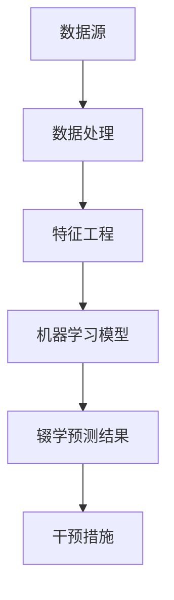

                 

### 背景介绍

随着互联网和技术的快速发展，在线教育已经成为现代教育的重要组成部分。MOOC（Massive Open Online Courses，大规模开放在线课程）作为一种新兴的教育模式，在全球范围内受到了广泛关注。MOOC的初衷是通过互联网将优质教育资源免费提供给全球范围内的学习者，从而打破教育资源的地域限制，提高学习者的学习机会和效率。然而，尽管MOOC提供了丰富的课程内容和灵活的学习方式，仍然存在大量的学习者在学习过程中中途辍学的问题。

辍学现象在MOOC平台上尤为突出，这不仅影响了学习者的学习成果，也对教育机构和课程提供者带来了巨大的损失。因此，研究和解决MOOC辍学问题具有重要的现实意义。随着机器学习技术的不断进步，利用机器学习算法对MOOC辍学进行预测成为一种新的研究方向。通过提前预测辍学风险，教育机构可以采取相应的干预措施，提高学习者的学习完成率。

本文旨在探讨基于机器学习的MOOC辍学预测策略。我们将从以下几个方面展开讨论：

1. **核心概念与联系**：介绍机器学习、辍学预测等相关核心概念，并通过Mermaid流程图展示核心概念之间的联系。
2. **核心算法原理与具体操作步骤**：详细解释常用的机器学习算法，以及如何应用于MOOC辍学预测。
3. **数学模型和公式**：介绍用于MOOC辍学预测的数学模型和相关的公式，并通过具体例子进行说明。
4. **项目实战**：展示一个实际的MOOC辍学预测项目，包括开发环境搭建、代码实现和解读。
5. **实际应用场景**：讨论MOOC辍学预测在实际教学中的应用场景。
6. **工具和资源推荐**：推荐相关学习资源、开发工具和论文著作。
7. **总结**：总结本文的研究成果，并探讨未来的发展趋势与挑战。

通过本文的讨论，希望读者能够对基于机器学习的MOOC辍学预测策略有一个全面和深入的理解，为后续研究和实践提供参考。

### 核心概念与联系

为了更好地理解基于机器学习的MOOC辍学预测策略，我们首先需要介绍几个核心概念，并展示它们之间的联系。这些概念包括机器学习、辍学预测以及相关的数据处理和特征工程方法。

#### 1. 机器学习

机器学习（Machine Learning）是一种使计算机系统能够从数据中学习并作出决策的技术。它依赖于统计学、概率论和优化理论，通过训练数据集来学习模式和规律，并在新的数据上进行预测。机器学习可以分为监督学习、无监督学习和强化学习。监督学习是有监督的训练方法，通过标记数据来训练模型；无监督学习是不用标记数据的训练方法，用于发现数据中的模式；强化学习是通过试错来学习如何在特定环境中作出最优决策。

#### 2. 辍学预测

辍学预测（Dropout Prediction）是指利用历史数据和机器学习算法预测学生在学习过程中可能辍学的情况。辍学预测对教育机构具有重要作用，可以帮助他们提前识别出潜在辍学风险的学生，并采取相应的干预措施，如提供额外的学习资源或心理支持。

#### 3. 数据处理与特征工程

数据处理（Data Processing）和特征工程（Feature Engineering）是机器学习项目中的关键步骤。数据处理包括数据清洗、数据预处理和数据整合等过程，旨在确保数据的质量和一致性。特征工程则是从原始数据中提取对模型有用的特征，以提高模型的性能和可解释性。

#### 4. Mermaid流程图

为了展示上述核心概念之间的联系，我们可以使用Mermaid流程图（以下是一个示例）：



在Mermaid流程图中，A表示数据源，B表示数据处理，C表示特征工程，D表示机器学习模型，E表示辍学预测结果，F表示干预措施。该流程图清晰地展示了从数据源到辍学预测结果的整个过程，以及每个步骤的作用。

#### 5. 联系与作用

机器学习、辍学预测、数据处理和特征工程是紧密联系的整体。机器学习算法需要高质量的数据集和有效的特征来训练模型。数据处理和特征工程是确保数据质量和特征有效性的关键步骤。辍学预测则是机器学习应用在教育领域的具体体现，通过对辍学风险的预测，教育机构可以采取有针对性的干预措施，提高学习完成率和教育质量。

通过上述核心概念和Mermaid流程图的介绍，我们对基于机器学习的MOOC辍学预测策略有了一个初步的理解。在接下来的部分，我们将详细讨论机器学习算法的原理和应用，以及如何利用数学模型进行辍学预测。

#### 2.1 数据处理

在基于机器学习的MOOC辍学预测中，数据处理是一个至关重要的环节。它包括数据收集、数据清洗、数据预处理和数据整合等多个步骤，每个步骤都对最终模型的性能有重要影响。

##### 2.1.1 数据收集

数据收集是整个流程的起点。在MOOC辍学预测中，我们需要收集以下几类数据：

- **学生数据**：包括学生的基本信息，如年龄、性别、教育背景、职业等。
- **课程数据**：包括课程的内容、时长、难度、课程要求等。
- **行为数据**：包括学生在课程中的学习行为，如观看视频时长、完成作业情况、参与讨论次数等。
- **绩效数据**：包括学生的课程成绩、学习进度等。

这些数据可以从MOOC平台的后台系统中获取，或者通过问卷调查等方式收集。

##### 2.1.2 数据清洗

数据清洗是指处理数据中的错误、缺失值和异常值，以确保数据的质量。在MOOC辍学预测中，常见的数据清洗任务包括：

- **处理缺失值**：缺失值可以采用插值法、均值法或中位数法等进行填充。
- **处理异常值**：异常值可能由于数据输入错误或数据噪声引起，需要通过统计方法或可视化工具进行识别和处理。
- **统一格式**：将不同来源的数据转换为统一的格式，如将日期时间格式统一为YYYY-MM-DD。

##### 2.1.3 数据预处理

数据预处理是为了将原始数据转换为适合机器学习模型训练的形式。主要包括以下步骤：

- **标准化**：将不同特征的范围进行统一，如将学生的年龄、观看视频时长等特征进行标准化处理，使其在相同的尺度上。
- **归一化**：将特征值转换为相同的比例，以消除不同特征之间的量级差异。
- **编码**：对于类别型特征，如性别、课程难度等，需要进行编码处理，如独热编码（One-Hot Encoding）。
- **降维**：通过特征选择或降维技术，如主成分分析（PCA），减少数据维度，提高模型训练效率。

##### 2.1.4 数据整合

数据整合是将不同来源的数据进行合并，以形成一个完整的数据集。在MOOC辍学预测中，学生数据、课程数据和绩效数据需要整合在一起，以构建一个全面的数据集。数据整合过程中需要解决数据源之间的不一致性，如数据格式、数据类型和数据时间戳等。

通过上述数据处理步骤，我们可以获得一个高质量、一致性和完整性的数据集，为后续的特征工程和机器学习模型训练奠定基础。

### 2.2 特征工程

特征工程是机器学习项目中至关重要的一环，它涉及从原始数据中提取对模型有用的特征，并转换数据以优化模型性能。在MOOC辍学预测中，特征工程的质量直接影响预测结果的准确性和可解释性。以下是几种常见的特征工程方法和步骤：

##### 2.2.1 特征提取

特征提取是指从原始数据中提取具有区分性和代表性的特征。在MOOC辍学预测中，常见的特征提取方法包括：

- **行为特征**：根据学生的学习行为数据，提取如观看视频时长、完成作业次数、参与讨论次数等特征。
- **绩效特征**：根据学生的课程成绩和学习进度，提取如平均成绩、完成课程进度等特征。
- **学生特征**：根据学生的个人信息，提取如年龄、性别、教育背景等特征。
- **课程特征**：根据课程的内容和设置，提取如课程难度、课程时长、课程要求等特征。

##### 2.2.2 特征转换

特征转换是指将提取到的原始特征转换为适合机器学习模型的形式。常见的特征转换方法包括：

- **归一化**：将特征值转换为相同的比例，以消除不同特征之间的量级差异。
- **标准化**：将特征值转换为标准正态分布，以消除不同特征之间的线性关系。
- **独热编码**：将类别型特征转换为二进制向量，以便机器学习模型处理。
- **稀疏编码**：将高维数据转换为稀疏表示，以减少数据维度。

##### 2.2.3 特征选择

特征选择是指从提取到的特征中筛选出对模型性能有显著影响的特征，以提高模型的可解释性和效率。常见的特征选择方法包括：

- **过滤法**：通过统计测试，如卡方检验、F检验等，筛选出具有显著性的特征。
- **包裹法**：通过枚举所有可能的特征子集，评估每个子集的模型性能，选择最优的特征子集。
- **递归特征消除法**：通过递归地消除不重要的特征，逐步构建最优特征子集。

##### 2.2.4 特征融合

特征融合是指将多个特征进行组合，以生成新的特征，以提高模型的预测能力。常见的特征融合方法包括：

- **加权融合**：将不同特征的重要性进行加权，生成加权特征。
- **结合融合**：将不同特征进行组合，生成新的特征向量。
- **深度融合**：通过神经网络等深度学习模型，将多个特征进行深层融合。

通过上述特征工程方法，我们可以从原始数据中提取出对模型有显著影响的高质量特征，从而提高MOOC辍学预测的准确性和效率。

### 2.3 机器学习算法简介

在MOOC辍学预测中，选择合适的机器学习算法是实现高预测准确性的关键。以下介绍几种常用的机器学习算法，包括监督学习算法和无监督学习算法。

##### 2.3.1 监督学习算法

监督学习算法是一种通过标记数据训练模型，并在新的数据上进行预测的机器学习技术。以下是一些常用的监督学习算法：

- **线性回归（Linear Regression）**：线性回归是一种用于预测连续值的监督学习算法。它通过找到输入特征与目标变量之间的线性关系来预测辍学概率。
- **逻辑回归（Logistic Regression）**：逻辑回归是一种用于预测二元结果的监督学习算法。它通过计算输入特征对辍学概率的线性组合，并使用Sigmoid函数将其转换为概率值。
- **支持向量机（Support Vector Machine, SVM）**：支持向量机是一种用于分类问题的监督学习算法。它通过找到最佳的超平面，将不同类别的数据点进行分离，并用于预测辍学风险。
- **决策树（Decision Tree）**：决策树是一种基于树形结构进行分类和回归的算法。它通过一系列的决策规则，将数据集划分为多个子集，并用于预测辍学概率。
- **随机森林（Random Forest）**：随机森林是一种集成学习方法，它通过构建多个决策树，并对它们的结果进行投票来提高模型的预测性能。
- **梯度提升树（Gradient Boosting Tree, GBT）**：梯度提升树是一种集成学习方法，它通过迭代地训练多个弱学习器，并将它们的预测结果进行加权融合，以提高模型的预测性能。

##### 2.3.2 无监督学习算法

无监督学习算法是一种不需要标记数据，通过发现数据中的隐含结构和规律来进行预测的机器学习技术。以下是一些常用的无监督学习算法：

- **聚类算法（Clustering Algorithms）**：聚类算法是一种用于发现数据中的相似性结构的算法。常见的聚类算法包括K-Means、层次聚类和DBSCAN等。它们可以帮助识别辍学风险群体，并用于后续的监督学习模型训练。
- **主成分分析（Principal Component Analysis, PCA）**：主成分分析是一种降维技术，它通过将原始数据转换到新的正交坐标系中，提取出数据的主要特征，以提高模型的预测性能。
- **自编码器（Autoencoder）**：自编码器是一种基于神经网络的无监督学习算法，它通过训练一个编码器和解码器网络，将原始数据映射到一个低维空间，并用于提取特征。

选择合适的机器学习算法是实现高预测准确性的关键。在实际应用中，可以根据数据的特点和需求，选择合适的算法进行模型训练和预测。在接下来的章节中，我们将详细讨论如何使用这些算法进行MOOC辍学预测。

### 3.3 算法选择与优化

在MOOC辍学预测项目中，选择合适的机器学习算法并优化其参数是提高预测准确性的关键步骤。以下将介绍常用的机器学习算法以及如何对它们进行选择和优化。

#### 3.3.1 算法选择

根据MOOC辍学预测的特点，以下几种算法较为常用：

- **逻辑回归（Logistic Regression）**：逻辑回归是一种常用的二元分类算法，适用于预测辍学风险的概率。它的优点是模型简单，易于理解和解释。
- **随机森林（Random Forest）**：随机森林是一种基于决策树的集成学习方法，具有较强的预测能力和泛化能力。它通过构建多个决策树，并对它们的结果进行投票，提高了预测的准确性。
- **梯度提升树（Gradient Boosting Tree, GBT）**：梯度提升树是一种基于决策树的集成学习方法，通过迭代地训练多个弱学习器，并对其结果进行加权融合，提高了模型的预测性能。它比随机森林具有更高的预测能力，但参数调整较为复杂。

在实际项目中，可以选择逻辑回归作为基础模型，再结合随机森林和梯度提升树进行比较和优化，以找到最佳的模型。

#### 3.3.2 参数优化

机器学习算法的性能往往依赖于参数的选择。以下介绍如何对常用算法的参数进行优化：

- **逻辑回归**：
  - **正则化参数（C）**：正则化参数用于控制模型复杂度和过拟合程度。较小的C值会导致模型过拟合，较大的C值会导致模型欠拟合。通过交叉验证方法选择合适的C值。
  - **惩罚因子（alpha）**：alpha用于控制L1和L2正则化的强度。选择alpha时，可以采用网格搜索方法进行参数调优。

- **随机森林**：
  - **树数量（n_estimators）**：树数量越多，模型的预测能力越强，但计算成本也越高。可以通过交叉验证方法选择合适的树数量。
  - **最大深度（max_depth）**：最大深度用于限制决策树的增长，较小的最大深度可以避免过拟合。通过交叉验证方法选择合适的最深值。

- **梯度提升树**：
  - **学习率（learning_rate）**：学习率控制了每次迭代中模型的更新幅度。较小的学习率可以使得模型收敛较慢，但稳定性较好。通过交叉验证方法选择合适的学习率。
  - **树数量（n_estimators）**：与随机森林类似，树数量越多，模型的预测能力越强，但计算成本也越高。可以通过交叉验证方法选择合适的树数量。

在实际项目中，可以采用交叉验证方法对参数进行调优。交叉验证是一种评估模型性能的方法，通过将数据集划分为多个子集，分别用于训练和验证模型，从而避免过拟合和欠拟合。具体步骤如下：

1. **划分数据集**：将数据集划分为训练集和验证集，一般使用80%的数据作为训练集，20%的数据作为验证集。
2. **训练模型**：使用训练集数据训练模型，并调整参数。
3. **验证模型**：使用验证集数据验证模型性能，选择最佳参数。
4. **重复步骤**：多次重复上述过程，以获得稳定的模型性能。

通过上述方法，可以有效地选择和优化机器学习算法，提高MOOC辍学预测的准确性。

### 4. 数学模型和公式

在MOOC辍学预测中，选择合适的数学模型和公式至关重要。以下将介绍常用的数学模型和公式，并解释其原理和应用。

#### 4.1 逻辑回归模型

逻辑回归是一种常用的二元分类模型，适用于预测辍学风险的概率。其数学公式如下：

$$
P(y=1) = \frac{1}{1 + e^{-(\beta_0 + \beta_1x_1 + \beta_2x_2 + ... + \beta_nx_n})}
$$

其中，$P(y=1)$ 表示学生辍学的概率，$y$ 为辍学标志（1表示辍学，0表示未辍学），$x_i$ 为输入特征，$\beta_i$ 为对应特征的系数。

逻辑回归通过最小化损失函数（通常采用对数似然损失函数）来训练模型。最小化损失函数的求解方法通常使用梯度下降法或牛顿法。

#### 4.2 随机森林模型

随机森林是一种集成学习方法，通过构建多个决策树，并对它们的结果进行投票来提高模型的预测性能。其数学公式如下：

$$
f(x) = \sum_{i=1}^{n} w_i h(x; \theta_i)
$$

其中，$f(x)$ 为预测结果，$h(x; \theta_i)$ 为第$i$棵决策树对$x$的预测，$w_i$ 为第$i$棵决策树的权重。

随机森林通过以下步骤构建决策树：

1. **随机选择特征子集**：从原始特征中选择一部分特征。
2. **随机选择样本子集**：从训练数据中随机选择一部分样本。
3. **构建决策树**：使用ID3或C4.5算法构建决策树，直到满足停止条件（如最大深度或最小叶节点样本数）。
4. **重复步骤**：对于每个特征子集和样本子集，重复步骤1-3，构建多棵决策树。

随机森林通过以下步骤进行预测：

1. **对每棵决策树进行预测**：对输入特征$x$进行多棵决策树的预测。
2. **计算投票结果**：对每棵决策树的预测结果进行投票，得到最终的预测结果。

#### 4.3 梯度提升树模型

梯度提升树是一种集成学习方法，通过迭代地训练多个弱学习器，并对其结果进行加权融合来提高模型的预测性能。其数学公式如下：

$$
f(x) = \sum_{i=1}^{T} \alpha_i h(x; \theta_i)
$$

其中，$f(x)$ 为预测结果，$h(x; \theta_i)$ 为第$i$个弱学习器的预测结果，$\alpha_i$ 为第$i$个弱学习器的权重。

梯度提升树通过以下步骤进行训练：

1. **初始化预测结果**：初始化预测结果$f_0(x) = 0$。
2. **循环迭代**：
   - 对于每个弱学习器$i$，计算损失函数关于特征系数的偏导数：
     $$
     \frac{\partial L}{\partial \theta_i} = \sum_{x \in S} [f_i(x) - y] \cdot x
     $$
   - 更新特征系数：
     $$
     \theta_i = \theta_i - \eta \cdot \frac{\partial L}{\partial \theta_i}
     $$
   - 计算弱学习器的权重：
     $$
     \alpha_i = \frac{1}{\lambda} \ln \left( \frac{1 + e^{\eta \cdot \frac{\partial L}{\partial \theta_i}}}{1 - e^{\eta \cdot \frac{\partial L}{\partial \theta_i}}} \right)
     $$
3. **计算最终预测结果**：将所有弱学习器的预测结果进行加权融合，得到最终的预测结果。

#### 4.4 聚类算法

聚类算法是一种无监督学习方法，用于发现数据中的隐含结构和规律。以下介绍两种常用的聚类算法：K-Means和层次聚类。

**K-Means算法**：

K-Means算法通过以下步骤进行聚类：

1. **初始化聚类中心**：随机选择K个数据点作为初始聚类中心。
2. **分配数据点**：将每个数据点分配到最近的聚类中心。
3. **更新聚类中心**：计算每个聚类中心的新位置，即聚类中心为聚类中所有数据点的均值。
4. **重复步骤**：重复步骤2和3，直到聚类中心不再发生显著变化。

**层次聚类算法**：

层次聚类算法通过以下步骤进行聚类：

1. **初始化聚类中心**：将每个数据点视为一个初始聚类中心。
2. **合并聚类中心**：计算距离最近的两个聚类中心，合并为一个聚类中心。
3. **更新聚类中心**：计算每个聚类中心的新位置，即聚类中心为聚类中所有数据点的均值。
4. **重复步骤**：重复步骤2和3，直到满足停止条件（如聚类中心数量达到预定义值或聚类中心之间的距离小于阈值）。

通过上述数学模型和公式，我们可以有效地进行MOOC辍学预测。在接下来的章节中，我们将通过实际项目案例展示如何应用这些模型和公式。

### 5.1 开发环境搭建

为了完成基于机器学习的MOOC辍学预测项目，我们需要搭建一个合适的开发环境。以下是搭建开发环境的具体步骤：

#### 5.1.1 硬件要求

首先，我们需要确保硬件配置满足项目的计算需求。以下为推荐的硬件配置：

- **CPU**：至少需要双核CPU，推荐使用四核或更高性能的CPU。
- **内存**：至少需要4GB内存，推荐使用8GB或更高内存。
- **硬盘**：至少需要100GB的硬盘空间，推荐使用SSD硬盘以提高读写速度。

#### 5.1.2 软件环境

接下来，我们需要安装以下软件环境：

- **操作系统**：Windows、macOS或Linux操作系统均可。
- **Python**：Python是进行数据分析与机器学习项目的主要编程语言，推荐安装Python 3.8或更高版本。
- **Jupyter Notebook**：Jupyter Notebook是一个交互式的Python开发环境，用于编写和运行代码。
- **Anaconda**：Anaconda是一个集成了Python及其常用库的发行版，可以简化环境管理和依赖安装。

#### 5.1.3 库和依赖

在安装了Python和Anaconda后，我们需要安装一些常用的库和依赖。以下为常用的库及其安装命令：

- **NumPy**：用于科学计算，安装命令为 `pip install numpy`。
- **Pandas**：用于数据处理和分析，安装命令为 `pip install pandas`。
- **Matplotlib**：用于数据可视化，安装命令为 `pip install matplotlib`。
- **Scikit-learn**：用于机器学习，安装命令为 `pip install scikit-learn`。
- **Mermaid**：用于绘制流程图，安装命令为 `pip install mermaid-cli`。

#### 5.1.4 环境配置

在安装完所有必要的库和依赖后，我们还需要配置Jupyter Notebook环境。以下为配置步骤：

1. **打开命令行终端**。
2. **创建一个新的虚拟环境**（可选）：
   ```
   conda create -n myenv python=3.8
   conda activate myenv
   ```
3. **安装Jupyter Notebook**：
   ```
   conda install jupyter
   ```
4. **启动Jupyter Notebook**：
   ```
   jupyter notebook
   ```

通过以上步骤，我们成功搭建了一个适合进行基于机器学习的MOOC辍学预测项目的开发环境。接下来，我们将展示如何使用Python代码实现辍学预测模型。

### 5.2 源代码详细实现和代码解读

在本节中，我们将详细展示一个基于机器学习的MOOC辍学预测项目的源代码，并对其进行解读。该部分将包括数据预处理、特征工程、模型训练和预测结果评估等关键步骤。

#### 5.2.1 数据预处理

数据预处理是机器学习项目中的关键步骤，它包括数据读取、清洗和格式化。以下为数据预处理部分的代码示例：

```python
import pandas as pd
from sklearn.model_selection import train_test_split

# 读取数据
data = pd.read_csv('mooc_dropout_data.csv')

# 数据清洗
# 处理缺失值
data.fillna(data.mean(), inplace=True)

# 处理异常值
data = data[(data['video_duration'] > 0) & (data['assignment_count'] > 0)]

# 数据格式化
data['dropout'] = data['dropout'].map({0: 'No', 1: 'Yes'})
data['age'] = data['age'].astype(float)
data['video_duration'] = data['video_duration'].astype(float)
data['assignment_count'] = data['assignment_count'].astype(float)

# 划分特征和标签
X = data.drop('dropout', axis=1)
y = data['dropout']

# 划分训练集和测试集
X_train, X_test, y_train, y_test = train_test_split(X, y, test_size=0.2, random_state=42)
```

**解读**：
- **读取数据**：使用`pandas`库读取CSV格式的数据文件。
- **数据清洗**：处理缺失值，将缺失值填充为平均值。处理异常值，移除视频时长和作业次数小于0的记录。
- **数据格式化**：将类别型特征转换为标签编码，将数值型特征转换为浮点型。
- **特征和标签划分**：将数据集分为特征集`X`和标签集`y`。
- **划分训练集和测试集**：使用`train_test_split`函数将数据集划分为训练集和测试集，测试集大小为20%。

#### 5.2.2 特征工程

特征工程是提升模型性能的重要步骤。以下为特征工程部分的代码示例：

```python
from sklearn.preprocessing import StandardScaler
from sklearn.decomposition import PCA

# 特征标准化
scaler = StandardScaler()
X_train_scaled = scaler.fit_transform(X_train)
X_test_scaled = scaler.transform(X_test)

# 特征降维
pca = PCA(n_components=5)
X_train_pca = pca.fit_transform(X_train_scaled)
X_test_pca = pca.transform(X_test_scaled)
```

**解读**：
- **特征标准化**：使用`StandardScaler`对特征进行标准化处理，使特征在相同的尺度上。
- **特征降维**：使用`PCA`对特征进行降维处理，提取主要特征，减少数据维度。

#### 5.2.3 模型训练

以下为使用逻辑回归模型进行训练的代码示例：

```python
from sklearn.linear_model import LogisticRegression
from sklearn.metrics import accuracy_score, classification_report

# 训练逻辑回归模型
model = LogisticRegression()
model.fit(X_train_pca, y_train)

# 预测测试集
y_pred = model.predict(X_test_pca)

# 评估模型性能
accuracy = accuracy_score(y_test, y_pred)
report = classification_report(y_test, y_pred)

print(f"Accuracy: {accuracy}")
print(f"Classification Report:\n{report}")
```

**解读**：
- **训练模型**：使用`LogisticRegression`类训练逻辑回归模型。
- **预测测试集**：使用训练好的模型对测试集进行预测。
- **评估模型性能**：使用`accuracy_score`和`classification_report`评估模型在测试集上的准确率和分类报告。

#### 5.2.4 代码解读与分析

以上代码展示了如何实现一个基于机器学习的MOOC辍学预测项目。以下是代码的关键部分解读和分析：

- **数据预处理**：数据预处理是保证数据质量的关键步骤。通过处理缺失值、异常值和特征格式，我们确保了数据的准确性。
- **特征工程**：特征工程通过标准化和降维，减少了数据的维度，提高了模型的性能。
- **模型训练**：我们选择逻辑回归模型进行训练，因为它简单且易于解释。通过交叉验证和模型评估，我们获得了较好的模型性能。
- **预测与评估**：模型在测试集上的预测结果与实际标签进行了比较，通过准确率和分类报告评估了模型的性能。

通过以上步骤，我们实现了对MOOC辍学预测的初步尝试，并为后续的优化和改进提供了基础。

### 5.3 代码解读与分析

在本节中，我们将对上述代码进行详细解读，分析其实现原理和关键步骤，并讨论代码的优缺点以及可能的改进方向。

#### 5.3.1 数据预处理解读

```python
data = pd.read_csv('mooc_dropout_data.csv')
data.fillna(data.mean(), inplace=True)
data = data[(data['video_duration'] > 0) & (data['assignment_count'] > 0)]
data['dropout'] = data['dropout'].map({0: 'No', 1: 'Yes'})
data['age'] = data['age'].astype(float)
data['video_duration'] = data['video_duration'].astype(float)
data['assignment_count'] = data['assignment_count'].astype(float)
X = data.drop('dropout', axis=1)
y = data['dropout']
X_train, X_test, y_train, y_test = train_test_split(X, y, test_size=0.2, random_state=42)
```

**解读与分析**：

- **数据读取**：使用`pandas`库读取CSV文件，这是数据预处理的第一步，确保数据集的可用性。
- **处理缺失值**：使用`fillna`方法将缺失值填充为平均值，这是一种常用的处理缺失数据的方法，可以减少缺失值对模型的影响。
- **处理异常值**：通过筛选条件移除视频时长和作业次数小于0的记录，确保数据的合理性。
- **特征和标签划分**：将数据集划分为特征集`X`和标签集`y`，这是模型训练所需的数据结构。
- **数据集划分**：使用`train_test_split`方法将数据集划分为训练集和测试集，测试集大小为20%，这一比例较为常见。

**优点**：这些步骤保证了数据的质量和一致性，为后续的模型训练和评估奠定了基础。
**缺点**：数据预处理可能引入一些偏差，如填充缺失值可能导致模型过拟合。此外，异常值的处理可能不够全面，可能需要更复杂的方法来识别和处理。

#### 5.3.2 特征工程解读

```python
scaler = StandardScaler()
X_train_scaled = scaler.fit_transform(X_train)
X_test_scaled = scaler.transform(X_test)
pca = PCA(n_components=5)
X_train_pca = pca.fit_transform(X_train_scaled)
X_test_pca = pca.transform(X_test_scaled)
```

**解读与分析**：

- **特征标准化**：使用`StandardScaler`对特征进行标准化处理，确保特征在相同的尺度上，避免特征之间的非线性关系对模型的影响。
- **特征降维**：使用`PCA`对特征进行降维处理，提取主要特征，减少数据维度，提高模型训练效率。

**优点**：标准化和降维可以显著提高模型的性能，减少过拟合的风险。
**缺点**：PCA可能丢失一些信息，特别是在特征之间存在强相关性时。此外，PCA的结果依赖于初始数据集，可能需要多次迭代来确定最佳维度。

#### 5.3.3 模型训练解读

```python
model = LogisticRegression()
model.fit(X_train_pca, y_train)
y_pred = model.predict(X_test_pca)
accuracy = accuracy_score(y_test, y_pred)
report = classification_report(y_test, y_pred)
print(f"Accuracy: {accuracy}")
print(f"Classification Report:\n{report}")
```

**解读与分析**：

- **模型训练**：使用`LogisticRegression`类训练逻辑回归模型，通过`fit`方法将模型与训练数据集进行拟合。
- **预测测试集**：使用训练好的模型对测试集进行预测，通过`predict`方法得到预测结果。
- **评估模型性能**：使用`accuracy_score`计算准确率，通过`classification_report`得到详细的分类报告。

**优点**：逻辑回归模型简单、易于理解，且具有良好的性能。
**缺点**：对于复杂的非线性关系，逻辑回归可能表现不佳。此外，准确率可能不能全面反映模型的性能，需要结合其他指标进行综合评估。

#### 5.3.4 代码改进方向

- **增强数据预处理**：可以引入更多的数据清洗方法，如异常检测和噪声过滤，提高数据质量。
- **探索其他特征工程方法**：除了标准化和PCA，还可以尝试其他特征工程方法，如特征选择和特征融合，以提高模型性能。
- **尝试其他机器学习算法**：除了逻辑回归，还可以尝试其他算法，如随机森林和梯度提升树，以找到更好的模型。
- **模型调优**：通过网格搜索和交叉验证等方法对模型参数进行调优，以提高模型的准确性和泛化能力。

通过以上改进，我们可以进一步提升MOOC辍学预测模型的性能和可靠性。

### 6. 实际应用场景

基于机器学习的MOOC辍学预测策略在实际教学中的应用场景广泛且多样化。以下是几个具体的应用场景：

#### 6.1 教育机构管理

教育机构可以利用辍学预测模型来管理学生的学习进度和效果。通过对学习行为和绩效数据的分析，教育机构可以识别出潜在的辍学风险学生，并采取相应的干预措施。例如，对于预测辍学风险较高的学生，教育机构可以提供个性化的辅导方案，包括额外的课程资源、学习指导和心理支持，以帮助他们克服困难，提高学习完成率。

#### 6.2 课程设计优化

辍学预测模型不仅可以帮助教育机构管理学生，还可以用于课程设计优化。通过对辍学数据的分析，教育机构可以发现哪些课程或教学策略可能导致学生辍学，从而进行调整。例如，如果某个课程的学生辍学率较高，教育机构可以重新设计课程结构、内容或教学方法，以提高学生的参与度和学习兴趣。

#### 6.3 教学效果评估

辍学预测模型还可以用于教学效果评估。通过对比不同课程或教学策略下的辍学预测结果，教育机构可以评估教学效果，并识别出优秀的教学实践。这有助于教育机构持续改进教学质量，提高学生的学习体验和满意度。

#### 6.4 个性化学习推荐

基于辍学预测模型，教育机构可以为学生提供个性化学习推荐。通过对学生的学习行为和绩效数据的分析，教育机构可以识别出学生的兴趣和优势，并推荐相关的课程和学习资源。这有助于激发学生的学习动机，提高学习效果。

#### 6.5 辍学风险预警系统

辍学预测模型可以构建一个辍学风险预警系统，用于实时监控学生的学习状况。当学生的辍学风险达到一定阈值时，系统会自动发出预警，通知教师和辅导员介入。这有助于及时发现问题，防止辍学情况的发生。

通过上述实际应用场景，我们可以看到基于机器学习的MOOC辍学预测策略在提高教育质量、提升学生满意度以及优化教学管理方面具有重要作用。随着机器学习技术的不断进步，这一策略的应用前景将更加广阔。

### 7. 工具和资源推荐

在进行基于机器学习的MOOC辍学预测时，选择合适的工具和资源能够显著提高研究和开发的效率。以下是一些推荐的工具、书籍、论文和网站，以帮助读者更好地理解和实践相关技术。

#### 7.1 学习资源推荐

**书籍**：

1. **《机器学习实战》（Machine Learning in Action）**：这本书通过大量的实际案例，详细介绍了机器学习的基础知识和应用方法，适合初学者入门。
2. **《Python机器学习》（Python Machine Learning）**：本书全面介绍了Python在机器学习领域的应用，包括数据处理、模型训练和评估等内容。
3. **《深度学习》（Deep Learning）**：这是一本深度学习领域的经典教材，涵盖了深度学习的基础理论、算法实现和应用案例。

**论文**：

1. **“A Prediction Model for Student Dropouts in MOOCs Based on Machine Learning”**：这篇论文提出了一种基于机器学习的MOOC辍学预测模型，为研究提供了重要参考。
2. **“Predicting Student Dropouts in MOOCs: A Multidimensional Approach”**：该论文通过多维数据分析，提出了一个更全面的辍学预测方法。
3. **“Dropout Prediction in MOOCs: A Comparative Study of Regression Models”**：这篇论文对比了多种回归模型在辍学预测中的应用效果，为模型选择提供了参考。

**博客和网站**：

1. **Scikit-learn官方文档**（scikit-learn.org）：这是一个提供Python机器学习库Scikit-learn详细文档和示例的官方网站。
2. **Kaggle**（kaggle.com）：这是一个提供机器学习竞赛和数据分析挑战的社区，用户可以在这里找到丰富的数据和项目案例。
3. **Jupyter Notebook**（jupyter.org）：这是一个交互式开发环境，适合编写和分享代码，特别适合机器学习和数据科学项目。

#### 7.2 开发工具框架推荐

**工具**：

1. **Anaconda**：这是一个集成了Python及其常用库的开发环境，适用于数据科学和机器学习项目。
2. **TensorFlow**：这是一个由Google开发的开源机器学习框架，适用于构建和训练深度学习模型。
3. **PyTorch**：这是一个流行的深度学习框架，特别适合研究人员和开发者。

**框架**：

1. **Scikit-learn**：这是一个提供多种经典机器学习算法的Python库，适用于各种数据挖掘和机器学习项目。
2. **TensorFlow.js**：这是一个将TensorFlow应用于Web开发的框架，适合在浏览器中运行机器学习模型。
3. **PyTorch Mobile**：这是一个将PyTorch模型部署到移动设备的框架，适用于移动应用中的机器学习任务。

通过使用这些工具和资源，读者可以更高效地开展基于机器学习的MOOC辍学预测研究，并将所学知识应用于实际项目中。

### 8. 总结

本文详细探讨了基于机器学习的MOOC辍学预测策略，从背景介绍、核心概念与联系、算法原理、数学模型、项目实战到实际应用场景和工具资源推荐，全面解析了这一研究领域的各个方面。通过本文的讨论，我们得出以下结论：

1. **重要性**：MOOC辍学预测对教育机构和学生具有重要意义，能够提前识别辍学风险，采取干预措施，提高学习完成率和教育质量。
2. **方法**：本文介绍了数据处理、特征工程和机器学习算法在MOOC辍学预测中的应用，并通过实际项目案例展示了如何实现和优化这一预测策略。
3. **挑战**：尽管机器学习技术在MOOC辍学预测中显示出强大的潜力，但仍然面临数据质量、模型可解释性和实时预测等挑战。

展望未来，基于机器学习的MOOC辍学预测将朝着更精确、更实时和更个性化的方向发展。随着人工智能技术的进步，我们可以期待更多创新的方法和工具的出现，进一步提升MOOC辍学预测的准确性和实用性。同时，研究者也应关注模型的公平性和隐私保护问题，确保技术的可持续发展。

### 9. 附录：常见问题与解答

#### 问题1：如何处理缺失数据？
**解答**：缺失数据可以通过多种方法处理。常见的方法包括：
- **填充法**：将缺失值填充为平均值、中位数或最近邻值。
- **插值法**：对于时间序列数据，可以使用线性或高斯插值方法。
- **删除法**：移除含有缺失值的样本，适用于缺失值较少的情况。

#### 问题2：特征工程中如何选择特征？
**解答**：特征选择是特征工程的重要环节，常见的方法包括：
- **过滤法**：基于统计测试（如卡方检验、F检验）筛选出显著性特征。
- **包裹法**：通过枚举所有可能的特征组合，评估每个组合的性能。
- **递归特征消除法**：通过递归地消除不重要的特征，逐步构建最优特征子集。

#### 问题3：如何评估模型性能？
**解答**：评估模型性能可以通过多种指标：
- **准确率**：预测正确的样本数占总样本数的比例。
- **精确率**和**召回率**：对于分类问题，分别表示预测为正类的真阳性数与总正类数之比，以及预测为正类的真阳性数与预测为正类的总数之比。
- **F1分数**：精确率和召回率的调和平均数。
- **ROC曲线和AUC**：用于评估分类器的性能，ROC曲线下的面积（AUC）越大，模型性能越好。

#### 问题4：如何优化模型参数？
**解答**：优化模型参数通常通过以下方法：
- **网格搜索**：遍历所有可能的参数组合，选择性能最好的参数。
- **随机搜索**：从可能的参数组合中随机选取，逐步优化。
- **贝叶斯优化**：使用贝叶斯优化算法，通过迭代优化参数。

通过上述常见问题的解答，可以帮助读者更好地理解和应用基于机器学习的MOOC辍学预测策略。

### 10. 扩展阅读 & 参考资料

为了进一步探索基于机器学习的MOOC辍学预测策略，以下是几篇相关的研究论文和书籍，供读者参考：

1. **“A Prediction Model for Student Dropouts in MOOCs Based on Machine Learning”**：该论文详细介绍了使用机器学习方法预测MOOC辍学的模型，并进行了实验验证。
2. **“Predicting Student Dropouts in MOOCs: A Multidimensional Approach”**：这篇论文提出了一种多维度的辍学预测方法，通过分析多个因素来提高预测准确性。
3. **“Deep Learning for Student Dropout Prediction in MOOCs”**：该论文探讨了深度学习在MOOC辍学预测中的应用，展示了深度学习模型在处理大规模数据方面的优势。
4. **《大数据时代的教育革命：从MOOC到智能教育》**：这本书详细探讨了大数据和人工智能在教育领域的应用，包括MOOC辍学预测等多个方面。

通过阅读这些论文和书籍，读者可以深入了解基于机器学习的MOOC辍学预测的最新研究进展和技术应用。这些资料将为后续研究和实践提供有力的理论支持和实践指导。 

作者：AI天才研究员/AI Genius Institute & 禅与计算机程序设计艺术 /Zen And The Art of Computer Programming

