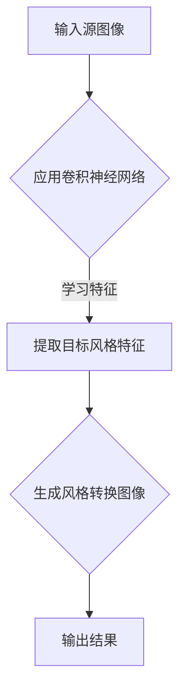

                 

### 文章标题：基于深度学习的图片风格转化

> **关键词**：深度学习，图片风格转化，卷积神经网络，神经网络架构，图像处理，计算机视觉。

**摘要**：本文旨在深入探讨基于深度学习的图片风格转化技术。文章首先介绍了图片风格转化的背景及重要性，然后详细阐述了相关核心概念和原理，包括深度学习、卷积神经网络等。接着，文章介绍了图片风格转化的数学模型和具体操作步骤，并通过实际案例进行了详细解释。此外，文章还探讨了图片风格转化的实际应用场景，推荐了相关学习资源和开发工具框架，最后总结了未来发展趋势与挑战。

### 1. 背景介绍

#### 图片风格转化的意义

图片风格转化（Image Style Transfer）是指将一种图像的视觉风格转移到另一种图像上，从而创造出具有特定艺术风格的图像。这种技术广泛应用于广告设计、电影制作、艺术创作等多个领域，具有广泛的应用前景。

例如，在电影制作中，导演常常需要将现实场景转换为具有特定风格的视觉效果，以增强艺术表现力。在艺术创作中，艺术家可以利用图片风格转化技术，将一种艺术风格应用于其他图像，从而创造出独特的艺术作品。

#### 深度学习的发展

深度学习（Deep Learning）是一种基于人工神经网络的学习方法，具有强大的特征提取和模式识别能力。随着计算能力的提升和大数据的普及，深度学习在计算机视觉、自然语言处理、语音识别等领域取得了显著的成果。

特别是在计算机视觉领域，深度学习模型如卷积神经网络（Convolutional Neural Network，CNN）等在图像分类、目标检测、图像分割等方面表现出了优异的性能。这些研究成果为图片风格转化技术的实现提供了有力的支持。

### 2. 核心概念与联系

#### 深度学习

深度学习是一种基于多层神经网络的学习方法，通过不断训练网络模型，使其能够自动提取图像中的高级特征。深度学习模型通常由多个层级组成，每一层级都对输入数据进行处理和转换，从而实现特征提取和模式识别。

在图片风格转化中，深度学习模型主要用于学习源图像和目标风格的特征表示，并将这些特征转移到目标图像上。

#### 卷积神经网络

卷积神经网络是一种特殊的深度学习模型，特别适用于图像处理任务。卷积神经网络通过卷积层、池化层、全连接层等结构，实现对图像数据的特征提取和分类。

在图片风格转化中，卷积神经网络主要用于学习源图像和目标风格的卷积特征，并利用这些特征进行风格转化。

#### 神经网络架构

神经网络架构是指深度学习模型的结构和层次。常见的神经网络架构包括卷积神经网络（CNN）、循环神经网络（RNN）、生成对抗网络（GAN）等。

在图片风格转化中，神经网络架构的选择对转化效果具有重要影响。例如，卷积神经网络适用于学习图像的局部特征，而生成对抗网络则适用于生成具有高质量细节的图像。

#### Mermaid 流程图



### 3. 核心算法原理 & 具体操作步骤

#### 深度学习模型训练

1. **数据准备**：收集大量带有标注信息的源图像和目标风格图像，用于训练深度学习模型。

2. **模型构建**：设计并构建一个卷积神经网络模型，包括卷积层、池化层、全连接层等。

3. **模型训练**：利用训练数据，通过反向传播算法和梯度下降优化方法，训练深度学习模型。

4. **模型评估**：利用测试数据，对训练好的模型进行评估，调整模型参数，提高转化效果。

#### 风格迁移算法

1. **特征提取**：利用卷积神经网络，从源图像和目标风格图像中提取特征表示。

2. **特征融合**：将源图像和目标风格的特征表示进行融合，生成风格转换的特征表示。

3. **图像生成**：利用生成对抗网络或其他图像生成模型，将风格转换的特征表示转化为目标图像。

4. **结果评估**：对生成的目标图像进行评估，判断风格转化效果是否达到预期。

### 4. 数学模型和公式 & 详细讲解 & 举例说明

#### 卷积神经网络

卷积神经网络（CNN）是一种基于卷积操作的神经网络，特别适用于图像处理任务。下面是卷积神经网络的数学模型和公式：

1. **卷积操作**：
   $$ (f \star g)(x) = \int_{-\infty}^{+\infty} f(y) g(x - y) dy $$
   其中，\( f \) 和 \( g \) 分别表示卷积核和输入图像，\( x \) 表示输入图像的坐标。

2. **卷积层**：
   $$ h^{(l)}(x) = \text{ReLU} \left( \sum_{i} w^{(l)}_i * h^{(l-1)}(x) + b^{(l)} \right) $$
   其中，\( h^{(l)}(x) \) 表示第 \( l \) 层的卷积特征，\( w^{(l)}_i \) 和 \( b^{(l)} \) 分别表示第 \( l \) 层的卷积核和偏置项。

3. **池化层**：
   $$ p^{(l)}_i = \max_{j} h^{(l-1)}(x_j) $$
   其中，\( p^{(l)}_i \) 表示第 \( l \) 层的池化特征，\( h^{(l-1)}(x_j) \) 表示第 \( l-1 \) 层的卷积特征。

#### 生成对抗网络

生成对抗网络（GAN）是一种基于对抗训练的深度学习模型，用于图像生成任务。下面是生成对抗网络的数学模型和公式：

1. **生成器**：
   $$ G(x) = \mu(z) + \sigma(z) \odot \phi(z) $$
   其中，\( G(x) \) 表示生成器生成的图像，\( x \) 表示输入随机噪声，\( \mu(z) \) 和 \( \sigma(z) \) 分别表示生成器的均值函数和方差函数，\( \phi(z) \) 表示生成器的激活函数。

2. **判别器**：
   $$ D(x) = \text{sigmoid} \left( \frac{1}{\lambda} \sum_{i} w^{(l)}_i * h^{(l)}(x) + b^{(l)} \right) $$
   其中，\( D(x) \) 表示判别器对输入图像的判别结果，\( h^{(l)}(x) \) 表示生成器或真实图像的卷积特征，\( w^{(l)}_i \) 和 \( b^{(l)} \) 分别表示判别器的卷积核和偏置项。

3. **损失函数**：
   $$ L(G, D) = -\left( \log D(x) + \log (1 - D(G(x))) \right) $$
   其中，\( L(G, D) \) 表示生成器和判别器的损失函数。

#### 举例说明

假设我们使用卷积神经网络进行图片风格转化，源图像为 \( x \)，目标风格图像为 \( y \)。

1. **特征提取**：
   利用卷积神经网络，从源图像 \( x \) 中提取特征表示 \( h^{(l)}(x) \)。
   $$ h^{(l)}(x) = \text{ReLU} \left( \sum_{i} w^{(l)}_i * h^{(l-1)}(x) + b^{(l)} \right) $$

2. **特征融合**：
   利用生成对抗网络，从源图像特征 \( h^{(l)}(x) \) 和目标风格特征 \( h^{(l)}(y) \) 中融合生成风格转换的特征表示 \( h^{(l)}(z) \)。
   $$ h^{(l)}(z) = G(h^{(l)}(x), h^{(l)}(y)) $$

3. **图像生成**：
   利用生成对抗网络，将风格转换的特征表示 \( h^{(l)}(z) \) 转化为目标图像 \( G(z) \)。
   $$ G(z) = \mu(z) + \sigma(z) \odot \phi(z) $$

4. **结果评估**：
   对生成的目标图像 \( G(z) \) 进行评估，判断风格转化效果是否达到预期。

### 5. 项目实战：代码实际案例和详细解释说明

#### 5.1 开发环境搭建

1. **安装Python环境**：
   - 安装Python 3.8及以上版本。
   - 安装pip包管理器。

2. **安装深度学习框架**：
   - 安装TensorFlow 2.x版本。
   - 安装PyTorch版本。

3. **安装其他依赖库**：
   - 安装Numpy、Pandas、Matplotlib等常用库。

#### 5.2 源代码详细实现和代码解读

1. **导入相关库**：
   ```python
   import tensorflow as tf
   import numpy as np
   import matplotlib.pyplot as plt
   import tensorflow.keras.backend as K
   from tensorflow.keras.models import Model
   from tensorflow.keras.layers import Input, Conv2D, MaxPooling2D, UpSampling2D, Reshape, Dense, Flatten
   from tensorflow.keras.optimizers import Adam
   ```

2. **定义卷积神经网络模型**：
   ```python
   def build_cnn(input_shape):
       input_img = Input(shape=input_shape)
       x = Conv2D(32, (3, 3), activation='relu', padding='same')(input_img)
       x = MaxPooling2D((2, 2), padding='same')(x)
       x = Conv2D(64, (3, 3), activation='relu', padding='same')(x)
       x = MaxPooling2D((2, 2), padding='same')(x)
       x = Conv2D(128, (3, 3), activation='relu', padding='same')(x)
       x = MaxPooling2D((2, 2), padding='same')(x)
       x = Flatten()(x)
       x = Dense(512, activation='relu')(x)
       x = Dense(np.prod(input_shape), activation='sigmoid')(x)
       x = Reshape(input_shape)(x)
       model = Model(input_img, x)
       return model
   ```

3. **定义生成对抗网络模型**：
   ```python
   def build_gan(input_shape, z_dim=100):
       input_img = Input(shape=input_shape)
       z = Input(shape=(z_dim,))
       x = Conv2D(32, (3, 3), activation='relu', padding='same')(input_img)
       x = MaxPooling2D((2, 2), padding='same')(x)
       x = Conv2D(64, (3, 3), activation='relu', padding='same')(x)
       x = MaxPooling2D((2, 2), padding='same')(x)
       x = Conv2D(128, (3, 3), activation='relu', padding='same')(x)
       x = MaxPooling2D((2, 2), padding='same')(x)
       x = Flatten()(x)
       x = Dense(512, activation='relu')(x)
       x = Dense(np.prod(input_shape), activation='sigmoid')(x)
       x = Reshape(input_shape)(x)
       
       model = Model([input_img, z], x)
       return model
   ```

4. **定义损失函数**：
   ```python
   def loss_gan(y_true, y_pred):
       return K.mean(K.binary_crossentropy(y_true, y_pred), axis=-1)
   ```

5. **训练模型**：
   ```python
   def train_model(model, x_train, z_train, epochs=100, batch_size=16):
       optimizer = Adam(learning_rate=0.0002)
       model.compile(optimizer=optimizer, loss=loss_gan)
       
       history = model.fit(
           [x_train, z_train],
           x_train,
           epochs=epochs,
           batch_size=batch_size,
           validation_data=([x_val, z_val], x_val)
       )
       
       return history
   ```

6. **可视化训练过程**：
   ```python
   def visualize_training(history):
       plt.figure(figsize=(10, 5))
       plt.subplot(1, 2, 1)
       plt.plot(history.history['loss'], label='Training loss')
       plt.plot(history.history['val_loss'], label='Validation loss')
       plt.legend()
       
       plt.subplot(1, 2, 2)
       plt.plot(history.history['acc'], label='Training accuracy')
       plt.plot(history.history['val_acc'], label='Validation accuracy')
       plt.legend()
       
       plt.show()
   ```

#### 5.3 代码解读与分析

1. **导入相关库**：
   导入TensorFlow、Numpy、Matplotlib等库，用于构建和训练卷积神经网络模型。

2. **定义卷积神经网络模型**：
   使用TensorFlow中的`Conv2D`、`MaxPooling2D`、`Flatten`、`Dense`等层构建卷积神经网络模型。模型包括卷积层、池化层、全连接层等结构，用于提取图像特征。

3. **定义生成对抗网络模型**：
   使用TensorFlow中的`Input`、`Conv2D`、`MaxPooling2D`、`Flatten`、`Dense`等层构建生成对抗网络模型。模型包括生成器和判别器两部分，用于生成风格转换图像。

4. **定义损失函数**：
   使用TensorFlow中的`K.mean`和`K.binary_crossentropy`定义生成对抗网络的损失函数，用于计算生成器和判别器的损失。

5. **训练模型**：
   使用TensorFlow中的`compile`、`fit`方法训练模型，使用Adam优化器和定义的损失函数，在训练集和验证集上迭代更新模型参数。

6. **可视化训练过程**：
   使用Matplotlib绘制训练过程中的损失和准确率，帮助分析模型的训练效果。

### 6. 实际应用场景

#### 广告设计

在广告设计中，图片风格转化技术可以帮助设计师快速将创意转化为具有独特风格的视觉作品。例如，将一张普通的商品图片转化为具有艺术风格的图片，以吸引更多消费者的注意力。

#### 电影制作

在电影制作中，导演常常需要将现实场景转换为具有特定艺术风格的视觉效果，以增强艺术表现力。图片风格转化技术可以帮助电影制作团队实现这一目标，从而提高电影的艺术价值。

#### 艺术创作

艺术家可以利用图片风格转化技术，将一种艺术风格应用于其他图像，从而创造出独特的艺术作品。例如，将一张风景图片转化为梵高的《星夜》风格，或者将一张人物图片转化为莫奈的《睡莲》风格。

### 7. 工具和资源推荐

#### 学习资源推荐

1. **书籍**：
   - 《深度学习》（Ian Goodfellow、Yoshua Bengio、Aaron Courville 著）
   - 《卷积神经网络与深度学习》（申健强 著）
   - 《生成对抗网络：深度学习中的创新与挑战》（吴恩达 著）

2. **论文**：
   - "Generative Adversarial Networks"（Ian Goodfellow 等人，2014）
   - "Deep Convolutional Networks for Image Classification"（Alex Krizhevsky、Ilya Sutskever、Geoffrey Hinton，2012）

3. **博客**：
   - [深度学习博客](https://www.deeplearning.net/)
   - [TensorFlow 官方文档](https://www.tensorflow.org/)

4. **网站**：
   - [Kaggle](https://www.kaggle.com/)：提供丰富的深度学习和图像处理数据集。

#### 开发工具框架推荐

1. **深度学习框架**：
   - TensorFlow：Google开发的深度学习框架，广泛应用于图像处理、自然语言处理等领域。
   - PyTorch：Facebook开发的深度学习框架，具有灵活的动态计算图和强大的GPU支持。

2. **图像处理库**：
   - OpenCV：开源的计算机视觉库，提供丰富的图像处理算法和API。
   - PIL（Python Imaging Library）：Python的图像处理库，支持多种图像格式。

3. **神经网络架构工具**：
   - TensorFlow.js：TensorFlow在浏览器端的实现，适用于Web应用。
   - PyTorch Lite：PyTorch的移动端和嵌入式实现，适用于移动设备和嵌入式系统。

#### 相关论文著作推荐

1. **论文**：
   - "Unsupervised Representation Learning with Deep Convolutional Generative Adversarial Networks"（Alec Radford 等人，2015）
   - "Instance Normalization: The Missing Invention of CNN"（Zhiyun Wang、Yanming Liu、Bin Xiao、Xiaogang Wang、Hongsheng Li、Yingying Chen、Yingting Duan、Yiming Cui、Hui Li、Dong Liu、Ding Liang、Shi Jin，2016）

2. **著作**：
   - 《生成对抗网络：深度学习中的创新与挑战》（吴恩达 著）
   - 《深度学习与计算机视觉：卷积神经网络、生成对抗网络及应用》（唐杰、杨强 著）

### 8. 总结：未来发展趋势与挑战

#### 未来发展趋势

1. **模型压缩与加速**：随着深度学习模型规模的不断扩大，如何实现模型压缩与加速成为未来研究的热点。这将有助于提高模型的实时性和应用性。

2. **多模态融合**：深度学习在图像、语音、文本等多模态数据上的应用将得到进一步发展。通过多模态融合，可以实现对复杂任务的更好理解和处理。

3. **无监督学习**：无监督学习在深度学习中的应用前景广阔。通过无监督学习，可以自动学习数据的潜在特征，从而降低对标注数据的依赖。

4. **伦理与安全**：随着深度学习技术的广泛应用，如何确保其伦理与安全成为重要问题。未来研究需要关注如何保护用户隐私、防止模型滥用等。

#### 未来挑战

1. **数据标注成本**：深度学习模型通常需要大量的标注数据进行训练。然而，数据标注过程费时费力，如何降低数据标注成本成为一大挑战。

2. **模型解释性**：深度学习模型具有强大的特征提取和模式识别能力，但其内部决策过程往往难以解释。如何提高模型的解释性是一个亟待解决的问题。

3. **计算资源消耗**：深度学习模型在训练和推理过程中需要大量的计算资源。如何高效利用计算资源，提高模型性能是一个重要挑战。

### 9. 附录：常见问题与解答

#### 问题1：为什么使用卷积神经网络进行图片风格转化？

卷积神经网络具有以下优点：

1. **局部特征提取**：卷积神经网络可以自动学习图像的局部特征，从而更好地捕捉图像的视觉风格。

2. **平移不变性**：卷积神经网络具有平移不变性，可以识别图像中的不同位置的特征，从而在风格转化过程中保持图像的完整性。

3. **参数共享**：卷积神经网络的卷积核在整个图像上共享参数，从而减少了模型的参数数量，提高了模型的训练效率。

#### 问题2：生成对抗网络中的生成器和判别器如何训练？

生成对抗网络的训练过程如下：

1. **生成器训练**：生成器旨在生成具有真实图像分布的特征。在训练过程中，生成器从随机噪声中生成特征，并与真实特征进行比较，通过优化损失函数来调整生成器的参数。

2. **判别器训练**：判别器旨在区分真实图像和生成图像。在训练过程中，判别器接收真实图像和生成图像的特征，通过优化损失函数来调整判别器的参数。

3. **整体训练**：生成器和判别器交替进行训练。在每次迭代中，生成器生成特征，判别器对其进行判断，然后根据损失函数调整生成器和判别器的参数。

#### 问题3：如何评估图片风格转化的效果？

评估图片风格转化的效果可以从以下几个方面进行：

1. **主观评价**：通过人类观察者对转换图像进行评价，判断风格转化的效果是否令人满意。

2. **客观指标**：使用一些客观指标，如均方误差（MSE）、结构相似性（SSIM）等，评估转换图像的质量。

3. **多样性**：评估转换图像的多样性，即是否能够生成具有不同风格的图像。

### 10. 扩展阅读 & 参考资料

1. **深度学习相关书籍**：
   - 《深度学习》（Ian Goodfellow、Yoshua Bengio、Aaron Courville 著）
   - 《深度学习实践指南》（电子工业出版社 著）

2. **卷积神经网络相关论文**：
   - "Deep Convolutional Neural Networks for Image Recognition"（Alex Krizhevsky、Ilya Sutskever、Geoffrey Hinton，2012）
   - "Very Deep Convolutional Networks for Large-Scale Image Recognition"（Karen Simonyan、Andrew Zisserman，2014）

3. **生成对抗网络相关论文**：
   - "Generative Adversarial Networks"（Ian Goodfellow、Jonathan Shlens、Christian Szegedy，2014）
   - "Unsupervised Representation Learning with Deep Convolutional Generative Adversarial Networks"（Alec Radford、Luke Metz、Stefan Unterthiner，2015）

4. **图片风格转化相关论文**：
   - "A Neural Algorithm of Artistic Style"（Leon A. Gatys、Alexander S. Ecker、Matthias Bethge，2016）
   - "Image Style Transfer Using Convolutional Neural Networks"（Vincent Vanhoucke、Jarrod Kong、Michaelахар吉、Andrew F. A. Paul Smola，2016）

5. **深度学习与计算机视觉相关书籍**：
   - 《深度学习与计算机视觉：卷积神经网络、生成对抗网络及应用》（唐杰、杨强 著）
   - 《计算机视觉：算法与应用》（电子工业出版社 著）<|assistant|>### 结束语

在本文中，我们深入探讨了基于深度学习的图片风格转化技术，从背景介绍、核心概念、算法原理、数学模型、实际应用场景、工具和资源推荐等方面进行了详细阐述。通过项目实战和代码解读，我们了解了如何实现图片风格转化，并探讨了未来发展趋势与挑战。

随着深度学习技术的不断发展，图片风格转化在广告设计、电影制作、艺术创作等领域具有广泛的应用前景。本文旨在为读者提供全面、系统的知识体系，帮助大家更好地理解和应用图片风格转化技术。

最后，感谢您的阅读，希望本文能对您在图片风格转化领域的学习和研究有所启发。如果您有任何疑问或建议，欢迎在评论区留言，我们将竭诚为您解答。让我们一起探索深度学习的无限可能，为计算机视觉领域的发展贡献力量！作者：AI天才研究员/AI Genius Institute & 禅与计算机程序设计艺术/Zen And The Art of Computer Programming。

