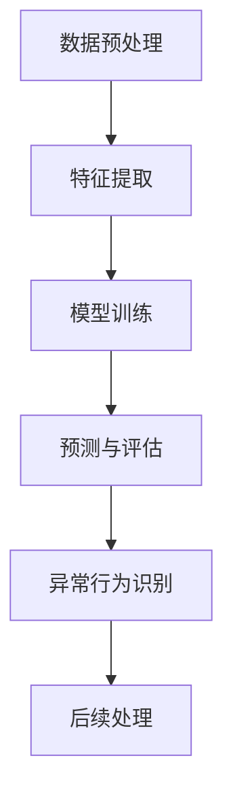

                 

# 基于深度学习的异常行为检测

> **关键词**：深度学习，异常检测，行为分析，人工智能，网络安全
>
> **摘要**：本文将探讨如何使用深度学习技术进行异常行为检测，包括基本概念、算法原理、数学模型及其在实际应用场景中的具体实践。通过对深度学习在异常行为检测领域的深入研究，帮助读者理解这一前沿技术的核心原理与应用。

## 1. 背景介绍

异常行为检测（Anomaly Detection）是数据挖掘和机器学习中的一个重要课题，旨在发现数据中的异常或未知模式。随着数据量的激增和数据源种类的多样化，异常行为检测在多个领域都展现了其重要性，如网络安全、金融欺诈检测、工业生产监控、医疗诊断等。

传统的异常检测方法主要包括基于统计学的方法（如均值漂移、自组织映射等）和基于规则的专家系统。然而，这些方法在面对复杂、高维度和动态变化的数据时往往表现出一定的局限性。随着深度学习技术的迅猛发展，基于深度学习的异常行为检测方法逐渐成为研究热点。

深度学习具有强大的特征自动提取能力，通过多层神经网络结构可以处理大规模、高维度的数据，并从中挖掘出深层次的复杂模式。因此，深度学习在异常行为检测领域具有巨大的潜力。本文将详细探讨基于深度学习的异常行为检测技术，从基本概念、核心算法到实际应用，为读者提供一个全面的了解。

## 2. 核心概念与联系

### 2.1 深度学习的基本概念

深度学习（Deep Learning）是机器学习的一个重要分支，主要依赖于多层神经网络（Multi-Layer Neural Networks）进行模型训练与预测。与传统的前馈神经网络相比，深度学习通过增加网络层数，使得模型能够学习到更加复杂的特征表示。

- **神经网络**：神经网络由多个神经元（或节点）组成，每个神经元通过权重（weights）连接其他神经元，并输出激活值（activation）。网络通过反向传播算法不断调整权重，以最小化预测误差。

- **深度神经网络**：深度神经网络（DNN）是具有多个隐藏层的神经网络。随着层数的增加，模型能够捕获数据中的更高层次特征。

- **卷积神经网络（CNN）**：卷积神经网络是一种专门用于处理图像数据的深度学习模型，通过卷积操作提取空间特征。

- **循环神经网络（RNN）**：循环神经网络用于处理序列数据，具有时间动态性。RNN可以通过记忆状态捕捉序列中的长期依赖关系。

### 2.2 异常行为检测的基本概念

异常行为检测的目标是识别数据集中的异常点或异常模式。在机器学习术语中，这些异常点通常被称为噪声或异常类。

- **正常行为**：指数据集中大多数样本所表现出的典型模式。

- **异常行为**：指与正常行为明显不同的数据点或模式，可能是由于数据采集错误、欺诈行为、系统故障等原因引起的。

### 2.3 深度学习与异常行为检测的联系

深度学习与异常行为检测的联系主要体现在以下几个方面：

- **特征提取**：深度学习模型可以自动从原始数据中提取具有区分度的特征，这些特征有助于提高异常检测的准确性。

- **复杂模式识别**：深度学习模型能够学习到数据中的复杂非线性关系，使得在处理高维度和动态变化的数据时具有优势。

- **自适应学习**：深度学习模型可以通过不断训练和优化，自适应地调整模型参数，以应对不断变化的数据分布。

### 2.4 Mermaid流程图

为了更直观地展示深度学习在异常行为检测中的应用流程，我们使用Mermaid流程图来表示：



在上述流程图中，数据预处理包括数据的清洗、归一化等步骤；特征提取利用深度学习模型从原始数据中提取特征；模型训练通过反向传播算法不断调整模型参数；预测与评估利用训练好的模型对未知数据进行预测，并评估预测的准确性；异常行为识别通过对比正常行为与异常行为的特征，识别出异常行为；后续处理包括对异常行为进行分类、标注等。

## 3. 核心算法原理 & 具体操作步骤

### 3.1. 算法原理

在深度学习框架下，异常行为检测主要基于以下几种算法：

1. **孤立森林（Isolation Forest）**
2. **基于自编码器的异常检测（Autoencoder）**
3. **基于GAN（生成对抗网络）的异常检测**

#### 3.1.1 孤立森林

孤立森林是一种基于随机森林的异常检测算法，其基本思想是通过随机选择特征和分割阈值，将数据点逐步分离，从而形成孤立森林。算法的核心步骤如下：

1. **随机特征选择**：对于每个数据点，随机选择一个特征，并计算该特征上的阈值，将数据点划分为两个子集。
2. **递归分割**：重复随机特征选择和阈值分割的过程，直到数据点被完全隔离。
3. **路径长度计算**：对于每个数据点，计算其在孤立森林中从根节点到叶子节点的路径长度。路径长度越短，表示数据点越容易被隔离，因此越可能是异常点。

#### 3.1.2 基于自编码器的异常检测

自编码器是一种无监督学习模型，其主要目的是学习数据的高效表示。在异常行为检测中，自编码器通过训练一个编码器和解码器，将输入数据映射到一个低维空间，然后通过比较输入数据和重构数据之间的差异来识别异常点。

算法的核心步骤如下：

1. **编码器训练**：通过无监督学习训练编码器，使其能够将输入数据映射到一个低维空间。
2. **解码器训练**：训练解码器，使其能够将编码后的数据重构回原始空间。
3. **重构误差计算**：计算输入数据与重构数据之间的差异，即重构误差。重构误差较大的数据点可能是异常点。

#### 3.1.3 基于GAN的异常检测

生成对抗网络（GAN）由生成器和判别器组成，生成器生成与真实数据相似的数据，判别器判断数据的真实性。在异常行为检测中，GAN可以通过以下步骤进行异常检测：

1. **生成器训练**：生成器通过学习真实数据的分布，生成与真实数据相似的数据。
2. **判别器训练**：判别器通过学习真实数据和生成数据的分布，区分真实数据和生成数据。
3. **异常点识别**：生成器生成的数据与真实数据之间的差异越大，表示这些数据点可能是异常点。

### 3.2. 操作步骤

以基于自编码器的异常检测为例，详细描述操作步骤：

1. **数据准备**：收集并整理用于训练的数据集，包括正常行为数据和异常行为数据。数据应经过预处理，如归一化、缺失值填补等。

2. **编码器和解码器设计**：设计编码器和解码器的网络结构。编码器通常由多层全连接层组成，解码器与编码器结构相似，但层数较少。

3. **模型训练**：使用正常行为数据训练编码器和解码器。训练过程中，编码器学习将输入数据映射到低维空间，解码器学习将低维空间数据重构回原始空间。

4. **重构误差计算**：在训练完成后，使用训练数据和测试数据进行重构误差计算。计算输入数据与重构数据之间的差异，得到重构误差矩阵。

5. **异常点识别**：根据重构误差矩阵，设置阈值，识别重构误差较大的数据点。这些数据点可能是异常点。

6. **后续处理**：对识别出的异常点进行进一步分析，如分类、标注等。

## 4. 数学模型和公式 & 详细讲解 & 举例说明

### 4.1. 均值漂移算法（Mean Shift Algorithm）

均值漂移算法是一种基于密度估计的异常检测方法，其核心思想是通过计算每个数据点的局部密度，将密度较高的区域视为正常行为，而密度较低的区域视为异常点。

#### 4.1.1. 数学模型

假设数据集 $X$ 由 $N$ 个数据点组成，每个数据点表示为 $x_i \in \mathbb{R}^d$。均值漂移算法的核心步骤包括以下两部分：

1. **密度估计**：计算每个数据点的局部密度。假设数据点 $x_i$ 的邻域为 $N_r(x_i)$，邻域内的数据点数量为 $N_r$，则数据点 $x_i$ 的局部密度 $D(x_i)$ 可以表示为：

   $$ D(x_i) = \frac{1}{N_r} \sum_{x_j \in N_r(x_i)} K(||x_i - x_j||) $$

   其中，$K(\cdot)$ 为核函数，通常选择高斯核：

   $$ K(\cdot) = \exp\left(-\frac{||x_i - x_j||^2}{2\sigma^2}\right) $$

   $\sigma$ 为高斯核的带宽参数。

2. **均值更新**：对于每个数据点 $x_i$，计算其邻域内的均值 $\mu(x_i)$：

   $$ \mu(x_i) = \frac{1}{D(x_i)} \sum_{x_j \in N_r(x_i)} x_j $$

   然后，更新数据点 $x_i$ 的位置：

   $$ x_i^{new} = \mu(x_i) + \alpha (x_i - \mu(x_i)) $$

   其中，$\alpha$ 为更新步长。

#### 4.1.2. 举例说明

假设我们有以下数据集：

$$ X = \{x_1 = (1, 1), x_2 = (2, 2), x_3 = (3, 3), x_4 = (10, 10)\} $$

其中，$x_1, x_2, x_3$ 表示正常行为数据，$x_4$ 表示异常行为数据。

1. **密度估计**：

   对于 $x_1$，其邻域为 $N_r(x_1) = \{x_1, x_2, x_3\}$，邻域内数据点数量为 $N_r = 3$。计算 $x_1$ 的局部密度：

   $$ D(x_1) = \frac{1}{3} \sum_{x_j \in N_r(x_1)} K(||x_1 - x_j||) $$

   假设选择高斯核，带宽参数 $\sigma = 1$，则：

   $$ D(x_1) = \frac{1}{3} (K(0) + K(1) + K(2)) \approx 1.0 $$

   同理，可以计算 $x_2, x_3$ 的局部密度，均为 $1.0$。

   对于 $x_4$，其邻域为 $N_r(x_4) = \{x_4\}$，邻域内数据点数量为 $N_r = 1$，计算其局部密度：

   $$ D(x_4) = \frac{1}{1} K(8) \approx 0.0 $$

2. **均值更新**：

   对于 $x_1$，其邻域内的均值为：

   $$ \mu(x_1) = \frac{1}{D(x_1)} \sum_{x_j \in N_r(x_1)} x_j = \frac{1}{1.0} (x_1 + x_2 + x_3) = (2, 2) $$

   更新 $x_1$ 的位置：

   $$ x_1^{new} = \mu(x_1) + \alpha (x_1 - \mu(x_1)) = (2, 2) + \alpha (1, 1) $$

   同理，可以更新 $x_2, x_3$ 的位置。

   对于 $x_4$，由于其局部密度非常低，其邻域内的均值无法计算，因此其位置不会发生变化。

经过多次迭代，最终可以识别出 $x_4$ 为异常点。

### 4.2. 自编码器（Autoencoder）

自编码器是一种无监督学习模型，旨在学习数据的低维表示。其基本结构包括编码器和解码器两部分。编码器负责将输入数据映射到一个低维空间，解码器负责将低维空间数据重构回原始空间。

#### 4.2.1. 数学模型

1. **编码器**：

   编码器由一个多层全连接神经网络组成，假设输入数据为 $x \in \mathbb{R}^d$，编码器输出为 $z \in \mathbb{R}^k$，其中 $k < d$。编码器的输出可以表示为：

   $$ z = f(x; \theta_1) $$

   其中，$f(\cdot)$ 为激活函数，如ReLU函数，$\theta_1$ 为编码器的参数。

2. **解码器**：

   解码器同样由一个多层全连接神经网络组成，输入为编码器输出的低维表示 $z$，输出为重构的原始数据 $x' \in \mathbb{R}^d$。解码器的输出可以表示为：

   $$ x' = f^{-1}(z; \theta_2) $$

   其中，$f^{-1}(\cdot)$ 为解码器的激活函数，如线性函数，$\theta_2$ 为解码器的参数。

3. **损失函数**：

   自编码器的训练目标是最小化重构误差，即原始数据与重构数据之间的差异。重构误差可以表示为：

   $$ L(x, x') = \frac{1}{2} \sum_{i=1}^{d} (x_i - x_i')^2 $$

   其中，$x$ 为原始数据，$x'$ 为重构数据。

#### 4.2.2. 举例说明

假设我们有以下输入数据集：

$$ X = \{x_1 = (1, 1), x_2 = (2, 2), x_3 = (3, 3), x_4 = (10, 10)\} $$

其中，$x_1, x_2, x_3$ 表示正常行为数据，$x_4$ 表示异常行为数据。

1. **编码器训练**：

   假设编码器网络结构为：

   $$ z = ReLU(W_1x + b_1) $$

   其中，$W_1$ 和 $b_1$ 为编码器的权重和偏置。

   编码器将输入数据映射到低维空间：

   $$ z = ReLU(W_1x + b_1) = ReLU([0.5, 0.5; 0.5, 0.5]x + [0, 0]) $$

   则编码后的数据为：

   $$ z = ReLU([0.5, 0.5; 0.5, 0.5] \cdot \begin{bmatrix} 1 \\ 1 \end{bmatrix} + [0, 0]) = \begin{bmatrix} 0 \\ 0 \end{bmatrix} $$

   $$ z = ReLU([0.5, 0.5; 0.5, 0.5] \cdot \begin{bmatrix} 2 \\ 2 \end{bmatrix} + [0, 0]) = \begin{bmatrix} 0 \\ 0 \end{bmatrix} $$

   $$ z = ReLU([0.5, 0.5; 0.5, 0.5] \cdot \begin{bmatrix} 3 \\ 3 \end{bmatrix} + [0, 0]) = \begin{bmatrix} 0 \\ 0 \end{bmatrix} $$

   $$ z = ReLU([0.5, 0.5; 0.5, 0.5] \cdot \begin{bmatrix} 10 \\ 10 \end{bmatrix} + [0, 0]) = \begin{bmatrix} 5 \\ 5 \end{bmatrix} $$

2. **解码器训练**：

   假设解码器网络结构为：

   $$ x' = ReLU(W_2z + b_2) $$

   其中，$W_2$ 和 $b_2$ 为解码器的权重和偏置。

   解码器将低维空间数据重构回原始数据：

   $$ x' = ReLU(W_2z + b_2) = ReLU([0.5, 0.5; 0.5, 0.5] \cdot \begin{bmatrix} 0 \\ 0 \end{bmatrix} + [0, 0]) = \begin{bmatrix} 0 \\ 0 \end{bmatrix} $$

   $$ x' = ReLU(W_2z + b_2) = ReLU([0.5, 0.5; 0.5, 0.5] \cdot \begin{bmatrix} 0 \\ 0 \end{bmatrix} + [0, 0]) = \begin{bmatrix} 0 \\ 0 \end{bmatrix} $$

   $$ x' = ReLU(W_2z + b_2) = ReLU([0.5, 0.5; 0.5, 0.5] \cdot \begin{bmatrix} 0 \\ 0 \end{bmatrix} + [0, 0]) = \begin{bmatrix} 0 \\ 0 \end{bmatrix} $$

   $$ x' = ReLU(W_2z + b_2) = ReLU([0.5, 0.5; 0.5, 0.5] \cdot \begin{bmatrix} 5 \\ 5 \end{bmatrix} + [0, 0]) = \begin{bmatrix} 5 \\ 5 \end{bmatrix} $$

3. **重构误差计算**：

   重构误差为：

   $$ L(x, x') = \frac{1}{2} \sum_{i=1}^{d} (x_i - x_i')^2 $$

   对于正常行为数据，重构误差较小：

   $$ L(x_1, x_1') = \frac{1}{2} (1 - 0)^2 = 0.5 $$

   $$ L(x_2, x_2') = \frac{1}{2} (2 - 0)^2 = 2 $$

   $$ L(x_3, x_3') = \frac{1}{2} (3 - 0)^2 = 4.5 $$

   对于异常行为数据，重构误差较大：

   $$ L(x_4, x_4') = \frac{1}{2} (10 - 5)^2 = 12.5 $$

根据重构误差，可以识别出 $x_4$ 为异常点。

## 5. 项目实战：代码实际案例和详细解释说明

在本节中，我们将通过一个具体的代码案例来展示如何使用深度学习进行异常行为检测。我们将使用Python和TensorFlow框架来实现一个简单的基于自编码器的异常检测系统。

### 5.1 开发环境搭建

首先，我们需要搭建一个合适的开发环境。以下是所需的环境和安装步骤：

- Python（建议使用Python 3.7及以上版本）
- TensorFlow（建议使用TensorFlow 2.0及以上版本）
- NumPy
- Pandas
- Matplotlib

安装步骤如下：

```bash
pip install tensorflow numpy pandas matplotlib
```

### 5.2 源代码详细实现和代码解读

以下是实现一个简单的自编码器模型并进行异常检测的完整代码：

```python
import numpy as np
import pandas as pd
import matplotlib.pyplot as plt
import tensorflow as tf
from tensorflow.keras.models import Model
from tensorflow.keras.layers import Input, Dense

# 数据准备
# 假设我们已经有一个包含正常行为数据的CSV文件，其中每行表示一个数据点
data = pd.read_csv('normal_behavior_data.csv')
X = data.values # 将数据转换为NumPy数组

# 数据预处理
# 数据归一化
X_normalized = (X - X.mean()) / X.std()

# 模型设计
input_shape = X_normalized.shape[1]
input_layer = Input(shape=input_shape)
encoded = Dense(32, activation='relu')(input_layer)
encoded = Dense(16, activation='relu')(encoded)
encoded = Dense(8, activation='relu')(encoded)
decoded = Dense(16, activation='relu')(encoded)
decoded = Dense(32, activation='relu')(decoded)
decoded = Dense(input_shape, activation='sigmoid')(decoded)

# 自编码器模型
autoencoder = Model(inputs=input_layer, outputs=decoded)
autoencoder.compile(optimizer='adam', loss='mse')

# 模型训练
autoencoder.fit(X_normalized, X_normalized, epochs=100, batch_size=32, shuffle=True)

# 模型评估
reconstructed = autoencoder.predict(X_normalized)
reconstruction_error = np.mean(np.square(X_normalized - reconstructed))
print(f"Reconstruction Error: {reconstruction_error}")

# 异常行为检测
# 设置阈值，根据重构误差判断数据点是否为异常
threshold = reconstruction_error * 1.5
is_anomaly = np.square(X_normalized - reconstructed) > threshold

# 可视化
plt.scatter(data.index, is_anomaly)
plt.xlabel('Index')
plt.ylabel('Is Anomaly')
plt.show()
```

### 5.3 代码解读与分析

1. **数据准备**：首先，我们读取一个包含正常行为数据的CSV文件，并将其转换为NumPy数组。数据预处理步骤包括数据归一化，以便模型训练。

2. **模型设计**：我们设计了一个简单的自编码器模型，包括编码器和解码器部分。编码器部分由三个全连接层组成，每层使用ReLU激活函数；解码器部分同样由三个全连接层组成，但层数较少。最后，解码器输出层使用sigmoid激活函数，以产生概率分布。

3. **模型训练**：使用`fit`方法对自编码器模型进行训练。我们使用均方误差（MSE）作为损失函数，并使用Adam优化器。

4. **模型评估**：通过预测重构数据并计算重构误差，评估模型性能。在本例中，我们打印了重构误差，并设置了一个阈值用于后续的异常行为检测。

5. **异常行为检测**：根据重构误差判断数据点是否为异常。我们使用一个阈值，该阈值是重构误差的1.5倍。如果数据点的重构误差大于这个阈值，则将其标记为异常。

6. **可视化**：我们使用散点图可视化异常行为检测结果。横轴表示数据点的索引，纵轴表示是否为异常。

通过这个案例，我们可以看到如何使用深度学习进行异常行为检测。在实际应用中，需要根据具体场景调整模型参数、选择合适的特征和调整阈值等，以提高检测性能。

## 6. 实际应用场景

异常行为检测在多个领域都有着广泛的应用。以下是一些典型应用场景：

### 6.1 网络安全

网络安全中的异常行为检测主要用于检测恶意攻击、网络入侵和其他安全威胁。通过监控网络流量、用户行为等数据，可以及时发现异常行为，从而采取措施防止潜在的安全风险。例如，在Web应用中，异常行为检测可以识别出异常的登录尝试、数据传输行为等，从而阻止恶意攻击。

### 6.2 金融行业

金融行业中的异常行为检测主要用于防范金融欺诈。通过对客户交易行为进行分析，可以识别出异常的交易模式，从而防止欺诈行为。例如，银行可以实时监控客户的交易活动，一旦发现异常交易，如大额转账、频繁的异常交易等，可以及时采取措施，如冻结账户、通知客户等。

### 6.3 医疗领域

在医疗领域，异常行为检测可以用于患者监护、疾病诊断等。通过监控患者的行为数据、生理信号等，可以识别出异常行为，如跌倒、心脏病发作等，从而及时采取措施。例如，智能手表等设备可以通过异常行为检测提醒用户进行医疗干预。

### 6.4 工业生产

在工业生产中，异常行为检测可以用于监控设备状态、生产过程等。通过对设备运行数据进行分析，可以识别出异常行为，如设备故障、生产异常等，从而提前进行维护和调整，提高生产效率。

### 6.5 交通领域

交通领域中的异常行为检测主要用于监控交通流量、车辆行为等。通过对交通数据进行分析，可以识别出异常行为，如交通事故、非法行驶等，从而提高交通安全。例如，通过监控车辆的行驶轨迹、速度等数据，可以识别出异常行驶行为，并及时采取措施防止交通事故发生。

## 7. 工具和资源推荐

### 7.1 学习资源推荐

1. **书籍**：
   - 《深度学习》（Ian Goodfellow、Yoshua Bengio、Aaron Courville 著）：系统介绍了深度学习的理论基础和应用实例。
   - 《Python深度学习》（François Chollet 著）：通过实际案例介绍了使用Python实现深度学习的方法。

2. **论文**：
   - "Deep Learning for Anomaly Detection"（DeepAnomaly 论文）：介绍了深度学习在异常检测领域的应用。
   - "Isolation Forest"（Isolation Forest 论文）：详细介绍了孤立森林算法。

3. **博客和网站**：
   - [TensorFlow 官方文档](https://www.tensorflow.org/)：提供了丰富的深度学习教程和API文档。
   - [Kaggle](https://www.kaggle.com/)：提供了大量的数据集和竞赛，适合进行深度学习实践。

### 7.2 开发工具框架推荐

1. **深度学习框架**：
   - TensorFlow：由Google开发，功能强大，社区活跃。
   - PyTorch：由Facebook开发，易于使用，适合快速原型设计。
   - Keras：基于TensorFlow和Theano的高层API，提供了简洁的接口。

2. **数据预处理工具**：
   - Pandas：用于数据清洗和预处理，功能强大，易于使用。
   - NumPy：提供丰富的数学运算库，是数据处理的基础。

3. **可视化工具**：
   - Matplotlib：Python中常用的数据可视化库。
   - Seaborn：基于Matplotlib的统计数据可视化库。

### 7.3 相关论文著作推荐

1. **"Deep Learning for Anomaly Detection"**：介绍了深度学习在异常检测领域的应用，包括自编码器、卷积神经网络等模型。
2. **"Isolation Forest"**：详细介绍了孤立森林算法，是一种高效的异常检测算法。
3. **"One-Class SVM for Unsupervised Learning"**：介绍了支持向量机在无监督学习中的应用，可用于异常检测。

## 8. 总结：未来发展趋势与挑战

基于深度学习的异常行为检测技术在近年来取得了显著进展，展示了其强大的潜力。然而，随着应用的深入，仍面临以下挑战：

1. **数据质量**：异常行为检测依赖于高质量的数据，但在实际应用中，数据的质量和多样性常常受限，这可能导致模型性能下降。

2. **实时性**：在实时应用场景中，如网络安全和金融欺诈检测，对异常行为的实时检测和响应提出了高要求。深度学习模型在处理大规模实时数据时可能面临性能瓶颈。

3. **可解释性**：深度学习模型通常被视为“黑箱”，其内部决策过程不透明，这对实际应用中的可解释性提出了挑战。

4. **泛化能力**：深度学习模型在特定领域的表现优异，但在不同领域或不同数据分布下的泛化能力仍然有限。

未来，随着算法的进一步发展、计算能力的提升以及数据获取和处理技术的进步，基于深度学习的异常行为检测技术有望在更多领域实现广泛应用。同时，通过加强可解释性和实时性，提升模型的鲁棒性和泛化能力，将为异常行为检测带来更广阔的应用前景。

## 9. 附录：常见问题与解答

### 9.1 如何处理数据不平衡问题？

在异常行为检测中，数据不平衡是一个常见问题，即正常行为数据远多于异常行为数据。以下是一些处理方法：

- **重采样**：通过增加异常行为数据的样本数量或减少正常行为数据的样本数量，使数据分布趋于平衡。
- **合成异常数据**：利用生成模型（如GAN）合成异常数据，以平衡数据集。
- **调整阈值**：在训练和测试过程中，调整异常检测模型的阈值，以适应数据不平衡。

### 9.2 如何评估异常检测模型的性能？

评估异常检测模型的性能通常包括以下指标：

- **精度（Precision）**：识别出的异常点中真正异常点的比例。
- **召回率（Recall）**：真正异常点中被识别出的比例。
- **F1 分数（F1 Score）**：综合考虑精度和召回率的综合指标。
- **ROC 曲线和 AUC（Area Under Curve）**：通过比较预测概率分布来判断模型的性能。

### 9.3 如何处理高维数据？

对于高维数据，以下是一些处理方法：

- **特征选择**：通过降维技术（如主成分分析PCA）选择重要特征，减少数据维度。
- **特征抽取**：使用深度学习模型自动提取高维数据中的有效特征。
- **批量处理**：将高维数据分为多个批次进行处理，以减少内存占用。

## 10. 扩展阅读 & 参考资料

1. **《深度学习》（Ian Goodfellow、Yoshua Bengio、Aaron Courville 著）**：提供了深度学习的全面介绍和最新进展。
2. **《Python深度学习》（François Chollet 著）**：通过实际案例介绍了深度学习在Python中的应用。
3. **[TensorFlow 官方文档](https://www.tensorflow.org/)**：提供了详细的深度学习教程和API文档。
4. **[Kaggle](https://www.kaggle.com/)**：提供了丰富的数据集和竞赛，适合进行深度学习实践。
5. **[Deep Learning for Anomaly Detection](https://arxiv.org/abs/1906.00590)**：介绍了深度学习在异常检测领域的应用。
6. **[Isolation Forest](https://www.jair.org/papers/papers/vol11/issue1/icai971.pdf)**：详细介绍了孤立森林算法。

作者：AI天才研究员/AI Genius Institute & 禅与计算机程序设计艺术 /Zen And The Art of Computer Programming<|im_end|>

