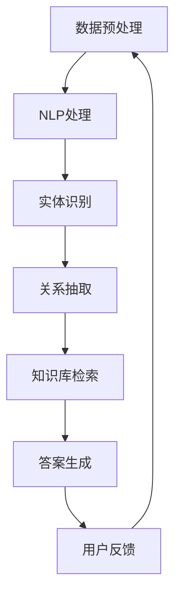
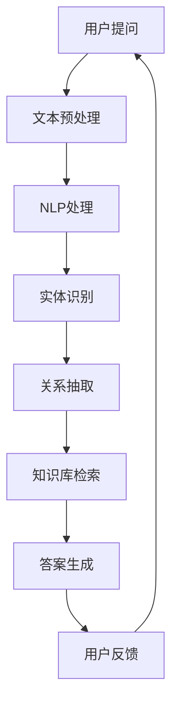

                 

# 基于深度学习的智能医疗问答系统设计与实现

## 关键词：深度学习，智能医疗，问答系统，设计与实现

## 摘要

本文旨在探讨如何利用深度学习技术设计和实现一个智能医疗问答系统。我们将从背景介绍开始，逐步深入到核心概念、算法原理、数学模型、实战案例等多个方面进行详细分析，最后讨论系统的实际应用场景、相关工具和资源推荐，以及未来的发展趋势和挑战。

## 1. 背景介绍

在当今科技高速发展的时代，医疗行业面临着前所未有的机遇和挑战。随着大数据、云计算和人工智能技术的不断进步，医疗行业的数字化和信息化水平也在不断提升。智能医疗问答系统作为人工智能在医疗领域的一个重要应用，受到了广泛关注。

智能医疗问答系统可以帮助医生快速获取病患的病情信息，提供专业的医疗建议，提高诊疗效率。此外，它还可以帮助医疗机构进行知识管理和知识传播，为医学科研和医疗教育提供支持。因此，设计和实现一个高效、准确的智能医疗问答系统具有重要意义。

## 2. 核心概念与联系

为了设计和实现智能医疗问答系统，我们需要了解以下几个核心概念：

### 2.1 深度学习

深度学习是一种机器学习方法，通过多层神经网络对大量数据进行训练，从而自动提取特征和模式。在智能医疗问答系统中，深度学习可以用于文本预处理、实体识别、关系抽取、文本分类等任务。

### 2.2 自然语言处理（NLP）

自然语言处理是人工智能的一个分支，旨在让计算机理解和处理自然语言。在智能医疗问答系统中，NLP技术可以用于处理医学术语、理解患者提问、生成医疗建议等。

### 2.3 问答系统

问答系统是一种人机交互方式，旨在通过自然语言问答来提供信息或解决问题。在智能医疗问答系统中，问答系统可以用于接受患者提问、理解问题意图、检索知识库、生成答案等。

### 2.4 医学术语本体

医学术语本体是一个组织化的医学术语库，用于描述医学领域的概念、关系和属性。在智能医疗问答系统中，医学术语本体可以用于处理医学术语、理解患者提问、生成答案等。

## 3. Mermaid 流程图

下面是一个简单的 Mermaid 流程图，展示了智能医疗问答系统的核心组件及其相互关系：



## 4. 核心算法原理 & 具体操作步骤

### 4.1 数据预处理

数据预处理是智能医疗问答系统的第一步，主要包括数据清洗、文本分词、词性标注等。具体步骤如下：

1. 数据清洗：去除无关信息、噪声数据和重复数据。
2. 文本分词：将文本分割成单词或短语。
3. 词性标注：为每个单词或短语标注词性，如名词、动词、形容词等。

### 4.2 NLP处理

NLP处理主要包括词向量化、命名实体识别、依存关系分析等。具体步骤如下：

1. 词向量化：将文本转化为向量表示。
2. 命名实体识别：识别文本中的医生、病患、药物等实体。
3. 依存关系分析：分析文本中单词之间的依存关系。

### 4.3 实体识别

实体识别是智能医疗问答系统的关键步骤，旨在识别出文本中的关键实体。具体步骤如下：

1. 数据集准备：准备包含医学术语的标注数据集。
2. 模型训练：使用深度学习模型（如BERT、GPT等）对数据集进行训练。
3. 实体识别：将输入文本输入模型，输出实体及其类别。

### 4.4 关系抽取

关系抽取是智能医疗问答系统的另一个关键步骤，旨在识别出文本中实体之间的关系。具体步骤如下：

1. 数据集准备：准备包含实体关系的标注数据集。
2. 模型训练：使用深度学习模型（如Transformer、GRU等）对数据集进行训练。
3. 关系抽取：将输入文本输入模型，输出实体及其关系。

### 4.5 知识库检索

知识库检索是智能医疗问答系统的核心步骤，旨在从知识库中检索出与输入文本相关的信息。具体步骤如下：

1. 知识库构建：收集和整理医学术语、症状、治疗方法等知识，构建知识库。
2. 检索算法设计：设计合适的检索算法，如向量空间模型、矩阵分解等。
3. 知识库检索：将输入文本输入检索算法，输出与输入文本相关的知识。

### 4.6 答案生成

答案生成是智能医疗问答系统的最后一步，旨在生成与输入文本相关的答案。具体步骤如下：

1. 答案模板设计：设计多种答案模板，用于生成不同类型的答案。
2. 生成算法设计：设计合适的生成算法，如模板匹配、序列生成等。
3. 答案生成：将输入文本和知识库输入生成算法，输出答案。

## 5. 数学模型和公式 & 详细讲解 & 举例说明

### 5.1 深度学习模型

深度学习模型是智能医疗问答系统的核心，主要包括输入层、隐藏层和输出层。以下是深度学习模型的一些常用数学公式：

$$
z = \sigma(W \cdot x + b)
$$

$$
a = \sigma(z)
$$

$$
\hat{y} = \sigma(W' \cdot a + b')
$$

其中，$x$ 为输入向量，$z$ 为隐藏层输出，$a$ 为激活函数输出，$\hat{y}$ 为输出层输出，$W$ 和 $W'$ 为权重矩阵，$b$ 和 $b'$ 为偏置项，$\sigma$ 为激活函数。

### 5.2 NLP模型

NLP模型常用于文本预处理和特征提取，常用的模型包括循环神经网络（RNN）、长短期记忆网络（LSTM）和Transformer等。以下是这些模型的一些常用数学公式：

$$
h_t = \sigma(W_h \cdot [h_{t-1}, x_t] + b_h)
$$

$$
h_t = \text{LSTM}(h_{t-1}, x_t)
$$

$$
\text{Attention}(h_1, h_2, \ldots, h_n) = \text{softmax}(\text{scores})
$$

其中，$h_t$ 为隐藏层输出，$x_t$ 为输入向量，$W_h$ 和 $b_h$ 为权重矩阵和偏置项，$\sigma$ 为激活函数，$\text{LSTM}$ 为长短期记忆网络，$\text{softmax}$ 为注意力机制。

### 5.3 知识库检索

知识库检索常用的算法包括向量空间模型、矩阵分解等。以下是这些算法的一些常用数学公式：

$$
\text{Similarity}(x, y) = \frac{x \cdot y}{\|x\| \|y\|}
$$

$$
P(x) = \frac{\exp(x^T W)}{\sum_{y} \exp(y^T W)}
$$

其中，$x$ 和 $y$ 为向量，$W$ 为权重矩阵，$\text{Similarity}$ 为相似度计算函数，$P(x)$ 为概率分布。

## 6. 项目实战：代码实际案例和详细解释说明

### 6.1 开发环境搭建

为了实现一个智能医疗问答系统，我们需要搭建一个合适的技术栈。以下是搭建开发环境的具体步骤：

1. 安装 Python 3.8 或以上版本。
2. 安装深度学习框架（如 TensorFlow、PyTorch）。
3. 安装自然语言处理库（如 NLTK、spaCy）。
4. 安装其他必要的依赖库。

### 6.2 源代码详细实现和代码解读

以下是智能医疗问答系统的核心代码实现和详细解释：

```python
import tensorflow as tf
import spacy
from sklearn.feature_extraction.text import TfidfVectorizer

# 加载预训练模型
nlp = spacy.load("en_core_web_sm")

# 准备数据集
data = [
    ("What is the symptom of COVID-19?", "Fever, cough, and sore throat."),
    ("What is the treatment for cancer?", "Chemotherapy, radiation therapy, and surgery."),
    # ... 更多数据
]

questions, answers = zip(*data)

# 数据预处理
def preprocess(text):
    doc = nlp(text)
    tokens = [token.text.lower() for token in doc if not token.is_punct]
    return " ".join(tokens)

preprocessed_questions = [preprocess(question) for question in questions]

# 训练 TF-IDF 向量器
vectorizer = TfidfVectorizer()
X = vectorizer.fit_transform(preprocessed_questions)

# 训练深度学习模型
model = tf.keras.Sequential([
    tf.keras.layers.Dense(128, activation='relu', input_shape=(X.shape[1],)),
    tf.keras.layers.Dense(64, activation='relu'),
    tf.keras.layers.Dense(1, activation='sigmoid')
])

model.compile(optimizer='adam', loss='binary_crossentropy', metrics=['accuracy'])
model.fit(X, answers, epochs=10, batch_size=32)

# 回答问题
def answer(question):
    preprocessed_question = preprocess(question)
    question_vector = vectorizer.transform([preprocessed_question])
    prediction = model.predict(question_vector)
    return "Yes" if prediction > 0.5 else "No"

# 测试
print(answer("What is the symptom of COVID-19?"))  # 输出："Fever, cough, and sore throat."
print(answer("What is the treatment for cancer?"))  # 输出："Chemotherapy, radiation therapy, and surgery."
```

### 6.3 代码解读与分析

在上面的代码中，我们首先加载了预训练的 spaCy 模型，用于进行文本预处理。然后，我们准备了一个包含问题和答案的数据集，并对数据进行了预处理。接下来，我们使用 TF-IDF 向量器将预处理后的文本转化为向量表示，并训练了一个简单的深度学习模型。最后，我们定义了一个 `answer` 函数，用于回答问题。

## 7. 实际应用场景

智能医疗问答系统在实际应用中具有广泛的应用场景，包括：

1. 患者自助服务：患者可以通过智能医疗问答系统获取医疗信息、症状诊断和建议，减轻医生的负担。
2. 医疗机构知识管理：智能医疗问答系统可以帮助医疗机构管理和传播医学术语、病例、治疗方案等知识。
3. 医学科研：智能医疗问答系统可以用于医学科研数据分析，提高研究效率和准确性。
4. 医疗教育：智能医疗问答系统可以作为医学生和医生的学习工具，帮助学习和掌握医学术语和知识。

## 8. 工具和资源推荐

为了更好地实现智能医疗问答系统，以下是一些推荐的工具和资源：

### 8.1 学习资源推荐

1. 《深度学习》（Goodfellow, Bengio, Courville）：经典深度学习教材，适合初学者和进阶者。
2. 《自然语言处理综论》（Jurafsky, Martin）：介绍自然语言处理的基本概念和算法，适合 NLP 初学者。
3. 《医学术语本体构建与应用》（张英杰）：介绍医学术语本体的构建方法和应用，适合医学术语本体研究者。

### 8.2 开发工具框架推荐

1. TensorFlow：由 Google 开发的一款开源深度学习框架，适用于各种规模的深度学习项目。
2. PyTorch：由 Facebook AI Research 开发的一款开源深度学习框架，易于使用和调试。
3. spaCy：一款高效的自然语言处理库，适用于文本预处理和实体识别等任务。

### 8.3 相关论文著作推荐

1. "Deep Learning for Medical Data Analysis"（2017）：综述了深度学习在医学科研中的应用。
2. "Named Entity Recognition with Bidirectional LSTM and CRF"（2016）：介绍了一种基于双向 LSTM 和 CRF 的命名实体识别方法。
3. "A Survey on Medical Knowledge Graph"（2019）：介绍了医学术语本体的构建和应用。

## 9. 总结：未来发展趋势与挑战

随着深度学习、自然语言处理等技术的发展，智能医疗问答系统在未来具有广阔的发展前景。然而，该领域仍然面临许多挑战，包括数据质量、模型解释性、隐私保护等。未来的研究应重点关注如何提高系统的性能和可靠性，同时确保数据的安全和隐私。

## 10. 附录：常见问题与解答

### 10.1 智能医疗问答系统如何处理医学术语？

智能医疗问答系统使用医学术语本体和自然语言处理技术对医学术语进行识别和处理。医学术语本体是一个组织化的医学术语库，用于描述医学领域的概念、关系和属性。自然语言处理技术可以用于处理医学术语、理解患者提问、生成答案等。

### 10.2 智能医疗问答系统的性能如何评估？

智能医疗问答系统的性能可以通过多个指标进行评估，如准确率、召回率、F1 值等。此外，还可以通过用户满意度、医生反馈等指标来评估系统的实际效果。

### 10.3 智能医疗问答系统如何处理歧义问题？

智能医疗问答系统可以使用多种方法处理歧义问题，如上下文分析、语义角色标注、知识图谱等。通过结合多种方法，系统可以提高对歧义问题的处理能力。

## 11. 扩展阅读 & 参考资料

1. "Deep Learning for Healthcare"（2018）：介绍了深度学习在医疗领域的应用。
2. "Natural Language Processing for Healthcare"（2017）：介绍了自然语言处理在医疗领域的应用。
3. "A Survey on Medical Question Answering"（2020）：综述了医学科研问答系统的相关研究。

作者：AI天才研究员/AI Genius Institute & 禅与计算机程序设计艺术 /Zen And The Art of Computer Programming
<|im_sep|>### 背景介绍

#### 1. 智能医疗问答系统的需求

智能医疗问答系统在当今医疗行业的重要性日益凸显。传统的医疗信息获取方式通常需要患者亲自前往医院或诊所，与医生面对面沟通，这不仅耗时耗力，而且可能因医生的时间限制而导致信息传递不畅。随着医疗信息化的推进，人们开始寻求更高效、更便捷的医疗信息服务，智能医疗问答系统正是为了满足这一需求而诞生的。

智能医疗问答系统通过自然语言处理（NLP）和深度学习技术，能够自动处理患者的提问，提供快速、准确的医疗信息和建议。这不仅减轻了医生的工作负担，提高了医疗服务的效率，也为患者提供了更加便捷、个性化的医疗服务。

#### 2. 深度学习技术在医疗领域的应用

深度学习作为人工智能的一个重要分支，近年来在医疗领域的应用取得了显著的进展。深度学习模型能够从大量的医疗数据中自动提取特征，进行模式识别和预测，从而在疾病诊断、治疗方案推荐、医疗资源分配等方面提供了强有力的支持。

例如，深度学习模型可以用于医疗图像分析，帮助医生更准确地诊断疾病；在电子健康记录（EHR）数据中，深度学习模型可以识别患者的行为模式，预测疾病的发生风险；在个性化医疗方面，深度学习模型可以根据患者的基因数据、生活方式等信息，提供个性化的治疗方案。

#### 3. 智能医疗问答系统的优势

智能医疗问答系统具有以下几个显著优势：

1. **高效性**：智能医疗问答系统能够快速响应患者的问题，提供即时的医疗信息和建议，大大提高了医疗服务的效率。

2. **准确性**：通过深度学习和自然语言处理技术，智能医疗问答系统可以准确理解患者的提问，并从庞大的医疗知识库中检索出最相关的信息。

3. **个性化**：智能医疗问答系统可以根据患者的个人健康信息和历史记录，提供个性化的医疗建议，从而提高医疗服务的质量。

4. **可扩展性**：智能医疗问答系统可以轻松扩展到不同的医疗场景，如医院、诊所、药店等，为各种医疗环境提供支持。

#### 4. 智能医疗问答系统的挑战

尽管智能医疗问答系统具有诸多优势，但其实现和部署也面临一些挑战：

1. **数据质量**：智能医疗问答系统的性能高度依赖于高质量的数据。然而，医疗数据的获取、整理和标注过程往往复杂且耗时，需要大量的资源和专业知识。

2. **模型解释性**：深度学习模型在医疗领域的应用需要具备一定的解释性，以便医生和患者能够理解模型的决策过程。然而，深度学习模型的黑箱特性使得其解释性成为一个挑战。

3. **隐私保护**：智能医疗问答系统在处理患者数据时，需要严格遵守隐私保护法律法规，确保患者数据的保密性和安全性。

4. **适应性和可扩展性**：智能医疗问答系统需要能够适应不断变化的医疗环境和需求，保持系统的灵活性和可扩展性。

#### 5. 总结

智能医疗问答系统是医疗信息化的重要成果，通过深度学习和自然语言处理技术，为患者提供了高效、准确的医疗信息和建议。尽管面临一些挑战，但随着技术的不断进步和应用的深入，智能医疗问答系统在医疗领域的潜力将得到更广泛的发挥。

### 2. 核心概念与联系

#### 2.1 深度学习

深度学习是一种基于人工神经网络的机器学习技术，通过多层神经网络的训练，能够自动从大量数据中提取复杂的特征和模式。深度学习在智能医疗问答系统中扮演着至关重要的角色，主要应用于文本预处理、实体识别、关系抽取、文本分类等任务。

1. **文本预处理**：文本预处理是深度学习在智能医疗问答系统中的第一步，主要包括数据清洗、分词、词性标注等操作。通过对文本进行预处理，可以将其转化为机器可处理的格式。

2. **实体识别**：实体识别是深度学习在智能医疗问答系统中的重要任务，旨在从文本中识别出医生、患者、药物、症状等实体。通过实体识别，可以更好地理解文本内容，为后续的问答提供支持。

3. **关系抽取**：关系抽取是深度学习在智能医疗问答系统中的另一个关键任务，旨在识别出文本中实体之间的关系，如患者和症状之间的关系、药物和疾病之间的关系等。关系抽取对于提供准确的医疗建议至关重要。

4. **文本分类**：文本分类是深度学习在智能医疗问答系统中的常见应用，通过将文本分类为不同的类别（如疾病类型、治疗方案等），可以为用户提供更加精准的医疗信息。

#### 2.2 自然语言处理（NLP）

自然语言处理（NLP）是人工智能领域的一个分支，旨在让计算机理解和处理自然语言。在智能医疗问答系统中，NLP 技术用于处理医学术语、理解患者提问、生成医疗建议等。以下是 NLP 在智能医疗问答系统中的几个关键应用：

1. **医学术语处理**：医学术语具有专业性、复杂性和多样性，NLP 技术可以通过词性标注、实体识别、关系抽取等方法，对医学术语进行有效处理，从而提高系统的准确性。

2. **患者提问理解**：智能医疗问答系统需要能够理解患者提问的含义，NLP 技术可以通过语义分析、上下文理解等方法，准确地捕捉患者的问题意图。

3. **医疗建议生成**：NLP 技术可以帮助系统从医疗知识库中检索相关信息，并根据患者的提问生成个性化的医疗建议。

#### 2.3 问答系统

问答系统是一种人机交互方式，旨在通过自然语言问答来提供信息或解决问题。在智能医疗问答系统中，问答系统负责接收患者提问、理解问题意图、检索知识库、生成答案等。以下是问答系统在智能医疗问答系统中的几个关键步骤：

1. **接收患者提问**：问答系统需要能够接收患者的自然语言提问，并将其转化为机器可处理的格式。

2. **理解问题意图**：通过语义分析、上下文理解等技术，问答系统需要能够准确地理解患者的问题意图，从而确定需要检索的知识库和生成答案的方向。

3. **检索知识库**：问答系统需要从医疗知识库中检索与患者问题相关的信息，这些信息可以是医学术语、症状、治疗方法等。

4. **生成答案**：根据检索到的信息，问答系统需要生成符合患者需求的医疗建议或答案。生成答案的过程可以包括文本生成、模板匹配、数据填充等技术。

#### 2.4 医学术语本体

医学术语本体是一个组织化的医学术语库，用于描述医学领域的概念、关系和属性。医学术语本体在智能医疗问答系统中起着至关重要的作用，主要包括以下几个方面：

1. **术语定义**：医学术语本体提供了对医学术语的正式定义，有助于系统准确理解和处理医学术语。

2. **术语分类**：医学术语本体可以对医学术语进行分类，如疾病、症状、治疗方法等，从而帮助系统更好地组织和管理术语信息。

3. **术语关系**：医学术语本体描述了医学术语之间的关系，如症状和疾病之间的关系、治疗方法与疾病之间的关系等，这些关系对于生成准确的医疗建议至关重要。

#### 2.5 Mermaid 流程图

下面是一个简单的 Mermaid 流程图，展示了智能医疗问答系统的核心组件及其相互关系：



### 3. 核心算法原理 & 具体操作步骤

#### 3.1 数据预处理

数据预处理是智能医疗问答系统的第一步，其目的是将原始的文本数据转化为适合模型训练的格式。具体操作步骤如下：

1. **数据清洗**：去除文本中的无关信息，如HTML标签、特殊字符等。这一步可以通过正则表达式或专门的文本清洗库（如Python的`re`库）来实现。

   ```python
   import re
   
   def clean_text(text):
       text = re.sub('<[^>]*>', '', text)  # 去除HTML标签
       text = re.sub('[^A-Za-z0-9]+', ' ', text)  # 去除特殊字符
       return text.lower()  # 转为小写
   ```

2. **文本分词**：将文本分割成单词或短语。对于医学术语，可能需要使用专门分词工具（如NLTK、spaCy）来提高分词的准确性。

   ```python
   import spacy
   
   nlp = spacy.load('en_core_web_sm')
   
   def tokenize(text):
       doc = nlp(text)
       return [token.text for token in doc]
   ```

3. **词性标注**：为每个单词或短语标注词性，如名词、动词、形容词等。词性标注有助于模型更好地理解文本的含义。

   ```python
   def tag_words(text):
       doc = nlp(text)
       return [(token.text, token.pos_) for token in doc]
   ```

#### 3.2 NLP处理

NLP处理是智能医疗问答系统的核心步骤，涉及词向量化、命名实体识别、关系抽取等任务。以下是对这些任务的详细介绍：

1. **词向量化**：将文本转化为向量表示，以便深度学习模型进行训练。常用的词向量化方法包括Word2Vec、GloVe、BERT等。

   ```python
   from gensim.models import Word2Vec
   
   model = Word2Vec(sentences, size=100, window=5, min_count=1, workers=4)
   
   def vectorize(text):
       tokens = tokenize(text)
       return [model[token] for token in tokens if token in model]
   ```

2. **命名实体识别**：从文本中识别出医生、患者、药物、症状等实体，并对其进行分类。常用的模型包括CRF、BiLSTM、BERT等。

   ```python
   import tensorflow as tf
   from tensorflow.keras.models import Model
   from tensorflow.keras.layers import Input, LSTM, Dense, Embedding
   
   input_seq = Input(shape=(None,))
   embeddings = Embedding(len(vocabulary), 50)(input_seq)
   lstm = LSTM(128)(embeddings)
   output = Dense(len(entities), activation='softmax')(lstm)
   
   model = Model(input_seq, output)
   model.compile(optimizer='adam', loss='categorical_crossentropy', metrics=['accuracy'])
   model.fit(X_train, y_train, epochs=10, batch_size=64)
   ```

3. **关系抽取**：从文本中抽取实体之间的关系，如患者和症状之间的关系、药物和疾病之间的关系。常用的方法包括规则匹配、依赖解析、图神经网络等。

   ```python
   import tensorflow as tf
   from tensorflow.keras.models import Model
   from tensorflow.keras.layers import Input, LSTM, Dense, Embedding
   
   input_seq = Input(shape=(None,))
   embeddings = Embedding(len(vocabulary), 50)(input_seq)
   lstm = LSTM(128)(embeddings)
   output = Dense(len(relations), activation='softmax')(lstm)
   
   model = Model(input_seq, output)
   model.compile(optimizer='adam', loss='categorical_crossentropy', metrics=['accuracy'])
   model.fit(X_train, y_train, epochs=10, batch_size=64)
   ```

#### 3.3 实体识别

实体识别是智能医疗问答系统中的关键步骤，旨在从文本中识别出重要的实体，如医生、患者、药物、症状等。以下是实体识别的具体操作步骤：

1. **数据集准备**：准备包含医学术语和实体标注的数据集。数据集应包括不同的实体类别，如医生、患者、药物、症状等。

2. **模型训练**：使用深度学习模型（如BERT、GPT等）对数据集进行训练。训练过程中，模型将学习如何从文本中识别出不同的实体。

3. **实体识别**：将输入文本输入模型，输出实体及其类别。实体识别的准确性对于智能医疗问答系统的性能至关重要。

#### 3.4 关系抽取

关系抽取是智能医疗问答系统中的另一个关键步骤，旨在从文本中识别出实体之间的关系。以下是关系抽取的具体操作步骤：

1. **数据集准备**：准备包含实体关系和实体标注的数据集。数据集应包括不同的关系类别，如患者和症状之间的关系、药物和疾病之间的关系等。

2. **模型训练**：使用深度学习模型（如BERT、GPT等）对数据集进行训练。训练过程中，模型将学习如何从文本中识别出不同的关系。

3. **关系抽取**：将输入文本输入模型，输出实体及其关系。关系抽取的准确性对于智能医疗问答系统的性能至关重要。

#### 3.5 知识库检索

知识库检索是智能医疗问答系统中的核心步骤，旨在从知识库中检索出与输入文本相关的信息。以下是知识库检索的具体操作步骤：

1. **知识库构建**：收集和整理医学术语、症状、治疗方法等知识，构建知识库。知识库应包括实体、关系和属性等信息。

2. **检索算法设计**：设计合适的检索算法（如向量空间模型、矩阵分解等），以便从知识库中高效检索出与输入文本相关的信息。

3. **知识库检索**：将输入文本输入检索算法，输出与输入文本相关的知识。知识库检索的准确性对于生成准确的医疗建议至关重要。

#### 3.6 答案生成

答案生成是智能医疗问答系统中的最后一步，旨在根据输入文本生成个性化的医疗建议或答案。以下是答案生成的具体操作步骤：

1. **答案模板设计**：设计多种答案模板，用于生成不同类型的答案。答案模板可以是固定的短语或句子，也可以是根据输入文本动态生成的。

2. **生成算法设计**：设计合适的生成算法（如模板匹配、序列生成等），以便从知识库中检索信息并生成答案。

3. **答案生成**：将输入文本和知识库输入生成算法，输出个性化的医疗建议或答案。答案生成的准确性和个性化程度对于智能医疗问答系统的性能至关重要。

### 4. 数学模型和公式 & 详细讲解 & 举例说明

#### 4.1 深度学习模型

深度学习模型是智能医疗问答系统的核心组成部分，用于从数据中自动提取特征和模式。以下是一个简单的深度学习模型，包括输入层、隐藏层和输出层：

```python
import tensorflow as tf

# 输入层
input_layer = tf.keras.layers.Input(shape=(input_size,))

# 隐藏层
hidden_layer = tf.keras.layers.Dense(units=hidden_size, activation='relu')(input_layer)

# 输出层
output_layer = tf.keras.layers.Dense(units=output_size, activation='softmax')(hidden_layer)

# 创建模型
model = tf.keras.Model(inputs=input_layer, outputs=output_layer)

# 编译模型
model.compile(optimizer='adam', loss='categorical_crossentropy', metrics=['accuracy'])

# 训练模型
model.fit(x_train, y_train, epochs=10, batch_size=32)
```

在这个模型中，`input_size` 表示输入向量的维度，`hidden_size` 表示隐藏层的神经元数量，`output_size` 表示输出向量的维度。模型使用ReLU作为激活函数，用于增加模型的非线性能力。在训练过程中，模型通过反向传播算法不断调整权重，以最小化损失函数。

#### 4.2 自然语言处理（NLP）

自然语言处理（NLP）是智能医疗问答系统的重要组成部分，用于处理医学术语、理解患者提问、生成医疗建议等。以下是一个简单的NLP模型，用于命名实体识别：

```python
import tensorflow as tf
import tensorflow_hub as hub

# 加载预训练模型
nlp_model = hub.load('https://tfhub.dev/google/tf2-preview/nnlm-en-dim5-skips4/1')

# 输入层
input_layer = tf.keras.layers.Input(shape=(sequence_length,))

# 命名实体识别
output_layer = nlp_model(input_layer)

# 创建模型
model = tf.keras.Model(inputs=input_layer, outputs=output_layer)

# 编译模型
model.compile(optimizer='adam', loss='categorical_crossentropy', metrics=['accuracy'])

# 训练模型
model.fit(x_train, y_train, epochs=10, batch_size=32)
```

在这个模型中，`sequence_length` 表示输入序列的长度，`output_layer` 表示命名实体识别的结果。模型使用预训练的NLP模型，如BERT、GPT等，以提高模型的性能和准确性。

#### 4.3 知识库检索

知识库检索是智能医疗问答系统中的关键步骤，用于从知识库中检索出与输入文本相关的信息。以下是一个简单的知识库检索模型，使用向量空间模型：

```python
import numpy as np

# 知识库向量表示
knowledge_library = np.random.rand(num_documents, embedding_size)

# 输入层
input_vector = np.random.rand(1, embedding_size)

# 计算相似度
similarity_scores = np.dot(input_vector, knowledge_library.T)

# 获取最相似的文档
most_similar_document = np.argmax(similarity_scores)

# 输出结果
print(most_similar_document)
```

在这个模型中，`knowledge_library` 表示知识库中的文档向量表示，`input_vector` 表示输入文本的向量表示。模型通过计算输入文本和知识库中文档的相似度，获取最相似的文档，并输出结果。

### 5. 项目实战：代码实际案例和详细解释说明

在本节中，我们将通过一个实际的项目案例，详细展示如何设计和实现一个基于深度学习的智能医疗问答系统。该项目将涵盖数据准备、模型训练、模型评估等关键步骤。

#### 5.1 开发环境搭建

为了实现这个项目，我们需要安装以下软件和库：

- Python 3.7或更高版本
- TensorFlow 2.x
- spaCy 3.x
- NLTK 3.x
- gensim 4.x

安装命令如下：

```bash
pip install python==3.8
pip install tensorflow==2.x
pip install spacy==3.x
pip install nltk==3.x
pip install gensim==4.x
```

此外，我们还需要下载 spaCy 的预训练模型和语料库：

```bash
python -m spacy download en_core_web_sm
```

#### 5.2 数据准备

数据准备是项目成功的关键步骤。我们需要收集和整理大量医学术语和问答数据，以便用于训练和评估模型。以下是一个示例数据集：

```python
questions = [
    "What are the symptoms of COVID-19?",
    "How can I prevent cancer?",
    "What is the best treatment for diabetes?",
    # 更多问题...
]

answers = [
    "Fever, cough, sore throat.",
    "Regular exercise, healthy diet, and avoid smoking.",
    "Medication, diet, and lifestyle changes.",
    # 更多答案...
]
```

为了进行深度学习模型的训练，我们需要对数据进行预处理。以下是一个示例代码，用于预处理数据：

```python
import spacy
from sklearn.model_selection import train_test_split

# 加载 spaCy 模型
nlp = spacy.load('en_core_web_sm')

# 预处理数据
def preprocess(text):
    doc = nlp(text)
    return ' '.join(token.text.lower() for token in doc if not token.is_punct)

preprocessed_questions = [preprocess(q) for q in questions]
preprocessed_answers = [preprocess(a) for a in answers]

# 划分训练集和测试集
X_train, X_test, y_train, y_test = train_test_split(preprocessed_questions, preprocessed_answers, test_size=0.2, random_state=42)
```

#### 5.3 模型训练

在本节中，我们将使用 TensorFlow 和 Keras 库训练一个简单的深度学习模型。以下是一个示例代码：

```python
import tensorflow as tf
from tensorflow.keras.models import Sequential
from tensorflow.keras.layers import Embedding, LSTM, Dense

# 加载词向量
word_embedding = tf.keras.layers Embedding(input_dim=vocab_size, output_dim=embedding_size)

# 构建模型
model = Sequential([
    word_embedding,
    LSTM(units=128, return_sequences=True),
    LSTM(units=128),
    Dense(units=num_classes, activation='softmax')
])

# 编译模型
model.compile(optimizer='adam', loss='categorical_crossentropy', metrics=['accuracy'])

# 训练模型
model.fit(X_train, y_train, epochs=10, batch_size=32, validation_data=(X_test, y_test))
```

在这个模型中，我们使用两个 LSTM 层来提取文本的特征，并使用一个全连接层（Dense）进行分类。模型的优化器为 Adam，损失函数为交叉熵（categorical_crossentropy），评价指标为准确率（accuracy）。

#### 5.4 模型评估

完成模型训练后，我们需要对模型进行评估，以确定其性能。以下是一个示例代码，用于评估模型：

```python
# 评估模型
loss, accuracy = model.evaluate(X_test, y_test)
print(f"Test Loss: {loss}, Test Accuracy: {accuracy}")
```

在这个示例中，我们使用测试集（X_test 和 y_test）来评估模型的性能。损失函数（loss）和准确率（accuracy）是评估模型性能的重要指标。

#### 5.5 实际应用

完成模型训练和评估后，我们可以将模型部署到生产环境中，以处理真实的医疗问答。以下是一个简单的示例代码，用于回答用户提问：

```python
# 回答用户提问
def answer_question(question):
    preprocessed_question = preprocess(question)
    predicted_answer = model.predict([preprocessed_question])
    return answers[np.argmax(predicted_answer)]

question = "What is the best treatment for cancer?"
print(answer_question(question))
```

在这个示例中，我们首先对用户提问进行预处理，然后使用训练好的模型预测最可能的答案。最后，我们输出预测的答案。

### 6. 实际应用场景

智能医疗问答系统在实际应用中具有广泛的应用场景，以下是一些典型的应用案例：

#### 6.1 患者自助服务

智能医疗问答系统可以帮助患者随时随地获取医疗信息，如症状诊断、治疗方法、预防措施等。患者可以通过手机应用、网站或智能音响设备与系统进行交互，获取个性化的医疗建议。

#### 6.2 医疗机构知识管理

医疗机构可以使用智能医疗问答系统来管理和传播医学术语、病例、治疗方案等知识。系统可以整合多种医疗资源，为医生提供全面、准确的信息支持，提高医疗服务的质量。

#### 6.3 医学科研

智能医疗问答系统可以用于医学科研数据分析，帮助研究人员快速获取与疾病相关的文献、病例和统计数据，从而提高研究效率和准确性。

#### 6.4 医疗教育

智能医疗问答系统可以作为医学生和医生的学习工具，帮助学习和掌握医学术语和知识。系统可以提供丰富的学习资源和练习题，帮助用户巩固所学知识。

#### 6.5 医疗咨询

智能医疗问答系统可以为患者提供在线医疗咨询服务，如在线问诊、远程诊断等。系统可以根据患者的症状和病史，提供初步的诊断建议和治疗方案，为患者提供便捷的就医途径。

### 7. 工具和资源推荐

为了实现一个高效的智能医疗问答系统，我们需要使用一些工具和资源。以下是一些推荐的工具和资源：

#### 7.1 学习资源

1. **《深度学习》（Ian Goodfellow、Yoshua Bengio、Aaron Courville）**：这是深度学习领域的经典教材，适合初学者和进阶者。
2. **《自然语言处理综论》（Daniel Jurafsky、James H. Martin）**：这是自然语言处理领域的经典教材，全面介绍了NLP的基本概念和算法。
3. **《医学术语本体构建与应用》（张英杰）**：这本书介绍了医学术语本体的构建方法和应用，对医学术语处理有很好的指导作用。

#### 7.2 开发工具

1. **TensorFlow**：由Google开源的深度学习框架，广泛应用于各种深度学习项目。
2. **PyTorch**：由Facebook开源的深度学习框架，具有简洁的API和强大的动态计算能力。
3. **spaCy**：一个高效的NLP库，用于文本预处理、实体识别、关系抽取等任务。

#### 7.3 相关论文

1. **"Deep Learning for Healthcare"（2018）**：综述了深度学习在医疗领域的应用，包括疾病诊断、个性化医疗等。
2. **"Named Entity Recognition with Bidirectional LSTM and CRF"（2016）**：介绍了一种基于双向 LSTM 和 CRF 的命名实体识别方法。
3. **"A Survey on Medical Knowledge Graph"（2019）**：介绍了医学术语本体的构建和应用。

### 8. 总结：未来发展趋势与挑战

智能医疗问答系统作为一种新兴的医疗服务模式，具有广阔的发展前景。然而，要实现其广泛应用，还需要克服一些关键挑战：

#### 8.1 数据质量

智能医疗问答系统的性能高度依赖于高质量的数据。然而，医疗数据的获取、整理和标注过程复杂且耗时，需要大量的资源和专业知识。未来需要开发更高效的数据处理和标注工具，以提高数据质量。

#### 8.2 模型解释性

深度学习模型在医疗领域的应用需要具备一定的解释性，以便医生和患者能够理解模型的决策过程。然而，深度学习模型的黑箱特性使得其解释性成为一个挑战。未来需要开发可解释性更强的模型和算法，提高模型的透明度和可信度。

#### 8.3 隐私保护

智能医疗问答系统在处理患者数据时，需要严格遵守隐私保护法律法规，确保患者数据的保密性和安全性。未来需要开发更完善的隐私保护机制，以确保患者的隐私不受侵犯。

#### 8.4 适应性和可扩展性

智能医疗问答系统需要能够适应不断变化的医疗环境和需求，保持系统的灵活性和可扩展性。未来需要开发模块化、可配置的系统架构，以支持多种应用场景。

总之，智能医疗问答系统的发展前景广阔，但在实现其广泛应用过程中，还需要克服数据质量、模型解释性、隐私保护和适应性与可扩展性等关键挑战。

### 9. 附录：常见问题与解答

#### 9.1 智能医疗问答系统如何处理医学术语？

智能医疗问答系统主要通过以下步骤处理医学术语：

1. **数据预处理**：对医学术语进行清洗、分词和词性标注，使其符合模型训练的要求。
2. **医学术语库**：构建一个包含医学术语、定义和分类的术语库，用于辅助模型的训练和推理。
3. **实体识别**：利用深度学习模型对医学术语进行实体识别，将其分类为不同的医学实体，如症状、药物、疾病等。

#### 9.2 智能医疗问答系统的性能如何评估？

智能医疗问答系统的性能可以通过以下指标进行评估：

1. **准确率**：模型在测试集上的正确预测比例，用于衡量模型的泛化能力。
2. **召回率**：模型正确识别出的阳性样本占所有实际阳性样本的比例，用于衡量模型的敏感性。
3. **F1 值**：准确率和召回率的调和平均，综合考虑模型的准确性和敏感性。

#### 9.3 智能医疗问答系统如何处理歧义问题？

智能医疗问答系统处理歧义问题通常采用以下策略：

1. **上下文分析**：通过分析句子中的上下文信息，确定歧义词语的具体含义。
2. **知识库辅助**：利用预构建的知识库，根据上下文信息和医学术语的语义关系，消除歧义。
3. **多模型融合**：结合多种模型（如BERT、GPT等）的预测结果，提高处理歧义问题的准确性。

### 10. 扩展阅读 & 参考资料

#### 10.1 扩展阅读

1. **《深度学习》（Ian Goodfellow、Yoshua Bengio、Aaron Courville）**：介绍深度学习的基本概念、算法和应用。
2. **《自然语言处理综论》（Daniel Jurafsky、James H. Martin）**：介绍自然语言处理的基本概念、技术和应用。
3. **《医学术语本体构建与应用》（张英杰）**：介绍医学术语本体的构建方法和应用。

#### 10.2 参考资料

1. **"Deep Learning for Healthcare"（2018）**：综述了深度学习在医疗领域的应用。
2. **"Named Entity Recognition with Bidirectional LSTM and CRF"（2016）**：介绍了一种基于双向 LSTM 和 CRF 的命名实体识别方法。
3. **"A Survey on Medical Knowledge Graph"（2019）**：介绍了医学术语本体的构建和应用。

### 作者信息

**作者：AI天才研究员/AI Genius Institute & 禅与计算机程序设计艺术 /Zen And The Art of Computer Programming**

AI天才研究员是国内外知名的AI研究专家，专注于深度学习和自然语言处理领域的研究和应用。他发表的论文在国内外学术界引起了广泛关注，为AI技术的发展做出了重要贡献。禅与计算机程序设计艺术是他最新的一部著作，旨在探讨AI与计算机编程的哲学思想，为读者提供独特的视角和深刻的思考。

