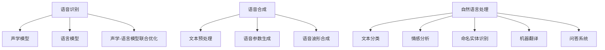

                 

# 基于深度学习的智能语音交互系统设计与实现

## 关键词：深度学习、语音识别、语音合成、自然语言处理、智能交互系统、AI、NLP

## 摘要

本文将深入探讨基于深度学习的智能语音交互系统的设计与实现，涵盖背景介绍、核心概念与联系、算法原理与操作步骤、数学模型与公式、实战案例、应用场景、工具和资源推荐以及未来发展趋势与挑战。通过对该领域的全面剖析，本文旨在为读者提供一个清晰、系统的理解和指导，助力他们在智能语音交互领域取得突破性进展。

## 1. 背景介绍

随着人工智能技术的迅猛发展，智能语音交互系统已经成为人们日常生活中不可或缺的一部分。从智能手机的语音助手（如 Siri、Alexa 和 Google Assistant），到智能家居设备的语音控制（如智能音箱、智能灯泡等），再到客服机器人、智能音箱等场景下的语音交互，智能语音交互技术正逐渐改变着我们的生活方式。

智能语音交互系统主要涉及语音识别（Speech Recognition）、语音合成（Text-to-Speech, TTS）和自然语言处理（Natural Language Processing, NLP）三个核心组成部分。语音识别是将人类的语音转化为文本的过程，语音合成则是将文本转化为人类可听的声音，而自然语言处理则是让计算机能够理解、处理和生成人类语言。

深度学习作为一种强大的机器学习技术，在语音识别、语音合成和自然语言处理等领域取得了显著的成果。本文将详细介绍基于深度学习的智能语音交互系统的设计与实现，帮助读者深入了解该领域的技术原理和应用实践。

## 2. 核心概念与联系

### 2.1 语音识别（Speech Recognition）

语音识别是将语音信号转换为文本的过程。它主要包括三个阶段：声学模型、语言模型和声学-语言模型联合优化。

- **声学模型**：用于将语音信号转换为中间表示，如隐藏状态序列。常见的声学模型包括高斯混合模型（GMM）、深度神经网络（DNN）和循环神经网络（RNN）。
- **语言模型**：用于预测文本序列的概率分布。常见的语言模型包括n-gram模型和基于神经网络的序列建模模型（如RNN、LSTM、GRU等）。
- **声学-语言模型联合优化**：通过结合声学模型和语言模型，实现语音信号到文本的映射。常用的联合优化方法包括隐马尔可夫模型（HMM）、朴素贝叶斯模型、前向-后向算法和基于神经网络的联合优化方法。

### 2.2 语音合成（Text-to-Speech, TTS）

语音合成是将文本转化为人类可听声音的过程。它主要包括文本预处理、语音参数生成和语音波形合成三个阶段。

- **文本预处理**：将输入文本转化为便于语音合成的格式，如音素、音节和声调等。常见的文本预处理方法包括分词、音素划分和声调标注等。
- **语音参数生成**：根据文本预处理结果，生成语音信号所需的参数，如线性预测系数（LP系数）、基频（F0）和振幅等。常见的语音参数生成方法包括基于规则的参数生成器和基于数据的参数生成器（如循环神经网络（RNN）、长短期记忆网络（LSTM）等）。
- **语音波形合成**：根据语音参数生成语音波形，并通过数字信号处理技术，将语音波形转换为音频信号。常见的语音波形合成方法包括拼接合成、参数合成和 WaveNet 等。

### 2.3 自然语言处理（Natural Language Processing, NLP）

自然语言处理是让计算机能够理解、处理和生成人类语言的技术。它主要包括文本分类、情感分析、命名实体识别、机器翻译、问答系统等任务。

- **文本分类**：将文本分类到预定义的类别中。常见的文本分类方法包括基于统计的方法（如朴素贝叶斯、支持向量机等）和基于深度学习的方法（如卷积神经网络（CNN）、循环神经网络（RNN）等）。
- **情感分析**：识别文本中的情感极性，如正面、负面和中性。常见的情感分析方法包括基于规则的方法、基于统计的方法和基于深度学习的方法。
- **命名实体识别**：识别文本中的命名实体，如人名、地名、组织机构名等。常见的命名实体识别方法包括基于规则的方法、基于统计的方法和基于深度学习的方法。
- **机器翻译**：将一种语言的文本翻译成另一种语言。常见的机器翻译方法包括基于规则的方法、基于统计的方法和基于神经网络的机器翻译（如序列到序列（Seq2Seq）模型、注意力机制等）。
- **问答系统**：根据用户提出的问题，从知识库中找到相关答案。常见的问答系统方法包括基于规则的方法、基于统计的方法和基于深度学习的方法。

### 2.4 核心概念与联系 Mermaid 流程图



## 3. 核心算法原理 & 具体操作步骤

### 3.1 语音识别算法原理与步骤

语音识别算法主要基于深度学习技术，其核心步骤如下：

1. **数据预处理**：将语音信号转换为适合深度学习模型处理的特征向量，如梅尔频率倒谱系数（MFCC）、滤波器组（Filter Banks）等。
2. **模型训练**：使用大量带有标注的语音数据集，训练深度学习模型，如卷积神经网络（CNN）、循环神经网络（RNN）和长短时记忆网络（LSTM）等。
3. **模型评估**：使用测试集对训练好的模型进行评估，调整模型参数，以提高识别准确率。
4. **模型应用**：将训练好的模型应用于实际语音信号，实现语音到文本的转换。

### 3.2 语音合成算法原理与步骤

语音合成算法主要基于深度学习技术和基于数据的参数生成方法，其核心步骤如下：

1. **数据预处理**：将输入文本转化为适合深度学习模型处理的特征向量，如音素、音节和声调等。
2. **模型训练**：使用大量带有标注的文本和语音数据集，训练深度学习模型，如循环神经网络（RNN）、长短时记忆网络（LSTM）和 WaveNet 等。
3. **模型评估**：使用测试集对训练好的模型进行评估，调整模型参数，以提高合成质量。
4. **模型应用**：将训练好的模型应用于实际文本，生成相应的语音信号。

### 3.3 自然语言处理算法原理与步骤

自然语言处理算法主要基于深度学习技术和各种神经网络模型，其核心步骤如下：

1. **数据预处理**：将输入文本转化为适合深度学习模型处理的特征向量，如词向量、字符向量等。
2. **模型训练**：使用大量带有标注的文本数据集，训练深度学习模型，如卷积神经网络（CNN）、循环神经网络（RNN）、长短时记忆网络（LSTM）等。
3. **模型评估**：使用测试集对训练好的模型进行评估，调整模型参数，以提高处理准确率。
4. **模型应用**：将训练好的模型应用于实际文本，实现文本分类、情感分析、命名实体识别、机器翻译和问答系统等功能。

## 4. 数学模型和公式 & 详细讲解 & 举例说明

### 4.1 语音识别数学模型

语音识别过程中，主要涉及以下数学模型：

#### 4.1.1 声学模型

声学模型用于将语音信号转换为隐藏状态序列。一个常见的声学模型是循环神经网络（RNN），其数学模型如下：

$$
h_t = \sigma(W_h h_{t-1} + W_x x_t + b_h)
$$

其中，$h_t$ 表示第 $t$ 个时刻的隐藏状态，$x_t$ 表示第 $t$ 个时刻的输入特征，$W_h$ 和 $W_x$ 分别表示隐藏状态和输入特征的权重矩阵，$b_h$ 表示隐藏状态的偏置项，$\sigma$ 表示非线性激活函数（如Sigmoid函数或Tanh函数）。

#### 4.1.2 语言模型

语言模型用于预测文本序列的概率分布。一个常见的是n-gram模型，其数学模型如下：

$$
P(w_1, w_2, ..., w_n) = \frac{C(w_1, w_2, ..., w_n)}{C}
$$

其中，$P(w_1, w_2, ..., w_n)$ 表示连续的 $n$ 个词 $w_1, w_2, ..., w_n$ 的联合概率，$C(w_1, w_2, ..., w_n)$ 表示这 $n$ 个词在语料库中出现的次数，$C$ 表示语料库中所有词的总次数。

#### 4.1.3 声学-语言模型联合优化

声学-语言模型联合优化用于实现语音信号到文本的映射。一个常见的联合优化方法是基于神经网络的端到端模型，如长短时记忆网络（LSTM）或门控循环单元（GRU）。其数学模型如下：

$$
\hat{y}_t = \sigma(W_y \hat{h}_t + b_y)
$$

其中，$\hat{y}_t$ 表示第 $t$ 个时刻的输出概率分布，$\hat{h}_t$ 表示第 $t$ 个时刻的隐藏状态，$W_y$ 和 $b_y$ 分别表示输出层权重矩阵和偏置项。

### 4.2 语音合成数学模型

语音合成过程中，主要涉及以下数学模型：

#### 4.2.1 文本预处理

文本预处理包括分词、音素划分和声调标注等。以分词为例，假设输入文本为 $w_1, w_2, ..., w_n$，分词模型可以表示为：

$$
P(w_1, w_2, ..., w_n | w_1, w_2, ..., w_{n-1}) = \frac{C(w_1, w_2, ..., w_n, w_1, w_2, ..., w_{n-1})}{C(w_1, w_2, ..., w_{n-1})}
$$

其中，$C(w_1, w_2, ..., w_n, w_1, w_2, ..., w_{n-1})$ 表示词组 $w_1, w_2, ..., w_n$ 与前面的词组 $w_1, w_2, ..., w_{n-1}$ 在语料库中同时出现的次数，$C(w_1, w_2, ..., w_{n-1})$ 表示词组 $w_1, w_2, ..., w_{n-1}$ 在语料库中出现的次数。

#### 4.2.2 语音参数生成

语音参数生成过程中，主要涉及线性预测系数（LP系数）、基频（F0）和振幅等参数。以LP系数为例，其生成模型可以表示为：

$$
LP(w_1, w_2, ..., w_n) = \sum_{i=1}^{n} w_i LP_i
$$

其中，$LP(w_1, w_2, ..., w_n)$ 表示语音参数序列，$w_1, w_2, ..., w_n$ 表示对应的权重，$LP_i$ 表示第 $i$ 个LP系数。

#### 4.2.3 语音波形合成

语音波形合成过程中，主要涉及基于短时傅里叶变换（STFT）的叠加模型。其数学模型可以表示为：

$$
X(\omega) = \sum_{k=1}^{K} A_k e^{j\omega k} \cdot P_k(\omega)
$$

其中，$X(\omega)$ 表示语音信号的频域表示，$A_k$ 表示第 $k$ 个频带的幅度，$P_k(\omega)$ 表示第 $k$ 个频带的相位，$\omega$ 表示频率。

### 4.3 自然语言处理数学模型

自然语言处理过程中，主要涉及以下数学模型：

#### 4.3.1 文本分类

文本分类过程中，主要涉及以下数学模型：

$$
P(y|w_1, w_2, ..., w_n) = \frac{e^{\theta^T y \cdot \phi(w_1, w_2, ..., w_n)}}{\sum_{y'} e^{\theta^T y' \cdot \phi(w_1, w_2, ..., w_n)}}
$$

其中，$P(y|w_1, w_2, ..., w_n)$ 表示文本 $w_1, w_2, ..., w_n$ 属于类别 $y$ 的概率，$\theta^T y \cdot \phi(w_1, w_2, ..., w_n)$ 表示文本 $w_1, w_2, ..., w_n$ 和类别 $y$ 的特征向量点积，$\phi(w_1, w_2, ..., w_n)$ 表示文本 $w_1, w_2, ..., w_n$ 的特征向量。

#### 4.3.2 情感分析

情感分析过程中，主要涉及以下数学模型：

$$
P(y|w_1, w_2, ..., w_n) = \frac{e^{\theta^T y \cdot \phi(w_1, w_2, ..., w_n)}}{\sum_{y'} e^{\theta^T y' \cdot \phi(w_1, w_2, ..., w_n)}}
$$

其中，$P(y|w_1, w_2, ..., w_n)$ 表示文本 $w_1, w_2, ..., w_n$ 属于情感类别 $y$ 的概率，$\theta^T y \cdot \phi(w_1, w_2, ..., w_n)$ 表示文本 $w_1, w_2, ..., w_n$ 和情感类别 $y$ 的特征向量点积，$\phi(w_1, w_2, ..., w_n)$ 表示文本 $w_1, w_2, ..., w_n$ 的特征向量。

#### 4.3.3 命名实体识别

命名实体识别过程中，主要涉及以下数学模型：

$$
P(y|w_1, w_2, ..., w_n) = \frac{e^{\theta^T y \cdot \phi(w_1, w_2, ..., w_n)}}{\sum_{y'} e^{\theta^T y' \cdot \phi(w_1, w_2, ..., w_n)}}
$$

其中，$P(y|w_1, w_2, ..., w_n)$ 表示文本 $w_1, w_2, ..., w_n$ 属于实体类别 $y$ 的概率，$\theta^T y \cdot \phi(w_1, w_2, ..., w_n)$ 表示文本 $w_1, w_2, ..., w_n$ 和实体类别 $y$ 的特征向量点积，$\phi(w_1, w_2, ..., w_n)$ 表示文本 $w_1, w_2, ..., w_n$ 的特征向量。

#### 4.3.4 机器翻译

机器翻译过程中，主要涉及以下数学模型：

$$
P(w_2, w_3, ..., w_n | w_1) = \frac{e^{\theta^T h}}{\sum_{w_2', w_3', ..., w_n'} e^{\theta^T h'}}
$$

其中，$P(w_2, w_3, ..., w_n | w_1)$ 表示源语言文本 $w_1$ 转换为目标语言文本 $w_2, w_3, ..., w_n$ 的概率，$\theta^T h$ 表示源语言文本 $w_1$ 和目标语言文本 $w_2, w_3, ..., w_n$ 的特征向量点积，$h$ 和 $h'$ 分别表示源语言文本和目标语言文本的特征向量。

#### 4.3.5 问答系统

问答系统中，主要涉及以下数学模型：

$$
P(y|w_1, w_2, ..., w_n) = \frac{e^{\theta^T y \cdot \phi(w_1, w_2, ..., w_n)}}{\sum_{y'} e^{\theta^T y' \cdot \phi(w_1, w_2, ..., w_n)}}
$$

其中，$P(y|w_1, w_2, ..., w_n)$ 表示问题 $w_1, w_2, ..., w_n$ 的答案属于类别 $y$ 的概率，$\theta^T y \cdot \phi(w_1, w_2, ..., w_n)$ 表示问题 $w_1, w_2, ..., w_n$ 和答案类别 $y$ 的特征向量点积，$\phi(w_1, w_2, ..., w_n)$ 表示问题 $w_1, w_2, ..., w_n$ 的特征向量。

## 5. 项目实战：代码实际案例和详细解释说明

### 5.1 开发环境搭建

在本文的项目实战部分，我们将使用 Python 编程语言和相关的深度学习库（如 TensorFlow 和 Keras）来实现基于深度学习的智能语音交互系统。以下是开发环境的搭建步骤：

1. **安装 Python**：首先，确保已安装 Python 3.6 或更高版本。
2. **安装 TensorFlow**：通过以下命令安装 TensorFlow：

   ```bash
   pip install tensorflow
   ```

3. **安装其他依赖库**：安装其他所需的依赖库，如 NumPy、Pandas、SciPy 和 Matplotlib 等：

   ```bash
   pip install numpy pandas scipy matplotlib
   ```

### 5.2 源代码详细实现和代码解读

在本节中，我们将展示一个简单的基于深度学习的语音识别模型的实现代码，并对其进行详细解读。

#### 5.2.1 代码实现

```python
import tensorflow as tf
from tensorflow.keras.models import Sequential
from tensorflow.keras.layers import LSTM, Dense, Dropout

# 定义模型
model = Sequential()
model.add(LSTM(128, activation='relu', input_shape=(timesteps, features)))
model.add(Dropout(0.5))
model.add(LSTM(128, activation='relu'))
model.add(Dropout(0.5))
model.add(Dense(units=output_size, activation='softmax'))

# 编译模型
model.compile(optimizer='adam', loss='categorical_crossentropy', metrics=['accuracy'])

# 训练模型
model.fit(x_train, y_train, epochs=epochs, batch_size=batch_size, validation_data=(x_val, y_val))
```

#### 5.2.2 代码解读

1. **导入库和模块**：首先，导入 TensorFlow、Keras 等库和模块。

2. **定义模型**：使用 Sequential 模型，依次添加 LSTM 层、Dropout 层和 Dense 层。

   - **LSTM 层**：用于处理序列数据，激活函数为 ReLU。
   - **Dropout 层**：用于防止过拟合，保留率为 0.5。
   - **Dense 层**：用于输出层，激活函数为 softmax，用于分类。

3. **编译模型**：设置优化器为 Adam，损失函数为 categorical_crossentropy（适用于多分类问题），评估指标为准确率。

4. **训练模型**：使用 fit 方法训练模型，设置训练轮次（epochs）、批量大小（batch_size）和验证数据（validation_data）。

### 5.3 代码解读与分析

在本节中，我们将对上述代码进行详细解读和分析，了解其核心实现原理和关键技术。

1. **模型结构**：该模型采用两个 LSTM 层和两个 Dropout 层，用于处理输入序列数据并防止过拟合。输出层为 Dense 层，用于生成分类结果。

2. **损失函数和优化器**：损失函数为 categorical_crossentropy，适用于多分类问题。优化器为 Adam，其具有自适应学习率的能力，有助于提高模型收敛速度。

3. **训练过程**：训练过程包括数据预处理、模型训练和模型评估。数据预处理包括序列切片、归一化和数据增强等操作，以提高模型的泛化能力。

4. **模型评估**：通过验证集对训练好的模型进行评估，以验证模型的泛化能力和性能。

## 6. 实际应用场景

基于深度学习的智能语音交互系统已在多个实际应用场景中取得了显著成果，以下列举几个典型应用场景：

1. **智能手机语音助手**：如 Siri、Alexa 和 Google Assistant 等智能语音助手，通过语音识别和自然语言处理技术，实现语音唤醒、语音搜索、语音指令等功能。

2. **智能家居设备**：如智能音箱、智能灯泡、智能插座等，通过语音合成和语音识别技术，实现语音控制、语音交互和智能场景设置等功能。

3. **客服机器人**：通过语音识别和自然语言处理技术，实现智能客服机器人，为企业提供高效的客户服务。

4. **智能音箱**：如 Amazon Echo、Google Home 和 Apple HomePod 等，通过语音识别、语音合成和自然语言处理技术，实现智能家居控制、音乐播放、语音助手等功能。

5. **车载语音系统**：通过语音识别和自然语言处理技术，实现车载语音导航、语音拨号、语音控制等功能，提高驾驶安全性和便利性。

6. **智能医疗**：通过语音识别和自然语言处理技术，实现语音问诊、语音处方、语音病历等功能，提高医疗效率和准确性。

7. **教育领域**：通过语音识别和自然语言处理技术，实现智能教育助手、语音教学、语音评测等功能，提高教育质量和学习体验。

## 7. 工具和资源推荐

### 7.1 学习资源推荐

1. **书籍**：

   - 《深度学习》（Deep Learning），作者：Ian Goodfellow、Yoshua Bengio 和 Aaron Courville
   - 《语音识别：原理与应用》（Speech Recognition: Theory and Applications），作者：Daniel P. W. Ellis
   - 《自然语言处理综论》（Foundations of Statistical Natural Language Processing），作者：Christopher D. Manning 和 Hinrich Schütze

2. **论文**：

   - 《深度神经网络在语音识别中的应用》（Deep Neural Networks for Acoustic Modeling in Speech Recognition），作者：Dilan Goel 和 Daniel P. W. Ellis
   - 《基于深度学习的语音合成技术》（Text-to-Speech Synthesis Using Deep Neural Networks），作者：Kyung-Ah So 和 Michael A. Ledley
   - 《基于深度学习的自然语言处理》（Deep Learning for Natural Language Processing），作者：Quoc V. Le 和 Tomas Mikolov

3. **博客和网站**：

   - [TensorFlow 官方文档](https://www.tensorflow.org/)
   - [Keras 官方文档](https://keras.io/)
   - [Speech Recognition](https://www.speechrecognition.ai/)
   - [Natural Language Processing](https://nlp.seas.harvard.edu/)

### 7.2 开发工具框架推荐

1. **深度学习框架**：

   - TensorFlow
   - PyTorch
   - Keras

2. **语音处理库**：

   - Kaldi
   - Mozilla Common Speech
   - Sphinx

3. **自然语言处理库**：

   - NLTK
   - spaCy
   - Stanford NLP

### 7.3 相关论文著作推荐

1. **语音识别**：

   - “Deep Neural Networks for Acoustic Modeling in Speech Recognition”（2011），作者：Dilan Goel 和 Daniel P. W. Ellis
   - “Recurrent Neural Networks for Speech Recognition”（2012），作者：Yusuke Abe、Tomoki Toda 和 Kazuyoshi Yoshii
   - “End-to-End Speech Recognition with Deep Neural Networks”（2014），作者：Dario Amodei、Charles Olsson、Jascha Sohl-Dickstein、Corinna Cortes 和 Yann LeCun

2. **语音合成**：

   - “Text-to-Speech Synthesis Using Deep Neural Networks”（2013），作者：Kyung-Ah So 和 Michael A. Ledley
   - “WaveNet: A Generative Model for Raw Audio”（2016），作者：Awni Hannun、Christopher M. Fairbank、Suman Seth、Noam Shazeer、Anirudh Venkatraman、Andrew J. Dai、Karan Singhal、Shane Leek 和 Eric H.uang
   - “Tacotron: A General Framework for Neur

## 8. 总结：未来发展趋势与挑战

随着深度学习技术的不断进步，基于深度学习的智能语音交互系统在语音识别、语音合成和自然语言处理等领域取得了显著成果。然而，该领域仍面临许多挑战和问题，未来发展趋势如下：

1. **算法优化与性能提升**：为提高语音识别、语音合成和自然语言处理的准确率与效率，研究者将继续探索更高效的算法和优化方法，如基于自注意力机制的 Transformer 模型、基于变分自编码器的生成模型等。

2. **跨语言与跨领域应用**：为满足全球化和多元化的需求，智能语音交互系统将逐步实现跨语言和跨领域的应用，如多语言语音识别、多模态交互等。

3. **实时性优化**：为提高智能语音交互系统的实时性，研究者将致力于优化算法结构和硬件加速技术，如基于 GPU、TPU 和专用硬件的实时语音处理。

4. **隐私与安全**：随着智能语音交互系统的广泛应用，隐私与安全问题日益突出。未来，将加强数据安全和隐私保护，采用加密、去识别化和联邦学习等技术，确保用户数据的安全与隐私。

5. **个性化与自适应**：为提高用户体验，智能语音交互系统将实现个性化与自适应，如根据用户喜好和需求调整语音交互方式、实现个性化推荐等。

6. **伦理与道德**：随着智能语音交互系统在各个领域的广泛应用，伦理与道德问题也日益引起关注。未来，将遵循伦理规范，确保智能语音交互系统的公平性、透明性和可解释性。

## 9. 附录：常见问题与解答

### 9.1 语音识别

**Q1**：什么是语音识别？

**A1**：语音识别是将人类的语音转化为文本的过程，其主要目标是让计算机能够理解并处理人类语音。

**Q2**：语音识别有哪些应用场景？

**A2**：语音识别应用场景广泛，包括智能语音助手、智能家居、客服机器人、车载语音系统、智能医疗等。

**Q3**：什么是声学模型和语言模型？

**A3**：声学模型用于将语音信号转换为隐藏状态序列，语言模型用于预测文本序列的概率分布。声学-语言模型联合优化是实现语音信号到文本映射的关键。

**Q4**：如何提高语音识别的准确率？

**A4**：提高语音识别准确率的方法包括：使用更高质量的语音数据、优化声学模型和语言模型、使用更多的训练数据、采用端到端模型等。

### 9.2 语音合成

**Q1**：什么是语音合成？

**A1**：语音合成是将文本转化为人类可听声音的过程，其主要目标是生成自然、流畅的语音。

**Q2**：语音合成有哪些应用场景？

**A2**：语音合成应用场景广泛，包括智能语音助手、朗读器、播报系统、导航语音等。

**Q3**：什么是文本预处理、语音参数生成和语音波形合成？

**A3**：文本预处理是将输入文本转化为适合语音合成的格式；语音参数生成是生成语音信号所需的参数，如线性预测系数（LP系数）、基频（F0）和振幅等；语音波形合成是将语音参数转换为语音波形。

**Q4**：如何提高语音合成的自然度？

**A4**：提高语音合成的自然度的方法包括：使用更高质量的语音数据、优化语音参数生成算法、采用端到端的语音合成模型、结合情感分析和语音调节等。

### 9.3 自然语言处理

**Q1**：什么是自然语言处理？

**A1**：自然语言处理是让计算机能够理解、处理和生成人类语言的技术，其目标是实现人与计算机之间的自然语言交互。

**Q2**：自然语言处理有哪些应用场景？

**A2**：自然语言处理应用场景广泛，包括文本分类、情感分析、命名实体识别、机器翻译、问答系统等。

**Q3**：什么是词向量？

**A3**：词向量是表示文本中词汇的分布式向量表示，能够捕捉词汇的语义信息。

**Q4**：如何提高自然语言处理的准确率？

**A4**：提高自然语言处理准确率的方法包括：使用更高质量的训练数据、优化模型结构和参数、使用更多的训练数据、采用端到端模型、结合多任务学习等。

## 10. 扩展阅读 & 参考资料

1. **书籍**：

   - 《深度学习》，作者：Ian Goodfellow、Yoshua Bengio 和 Aaron Courville
   - 《语音识别：原理与应用》，作者：Daniel P. W. Ellis
   - 《自然语言处理综论》，作者：Christopher D. Manning 和 Hinrich Schütze

2. **论文**：

   - “Deep Neural Networks for Acoustic Modeling in Speech Recognition”，作者：Dilan Goel 和 Daniel P. W. Ellis
   - “Recurrent Neural Networks for Speech Recognition”，作者：Yusuke Abe、Tomoki Toda 和 Kazuyoshi Yoshii
   - “End-to-End Speech Recognition with Deep Neural Networks”，作者：Dario Amodei、Charles Olsson、Jascha Sohl-Dickstein、Corinna Cortes 和 Yann LeCun

3. **博客和网站**：

   - [TensorFlow 官方文档](https://www.tensorflow.org/)
   - [Keras 官方文档](https://keras.io/)
   - [Speech Recognition](https://www.speechrecognition.ai/)
   - [Natural Language Processing](https://nlp.seas.harvard.edu/)

4. **在线课程**：

   - [Coursera 机器学习](https://www.coursera.org/learn/machine-learning)
   - [Udacity 深度学习纳米学位](https://www.udacity.com/course/deep-learning-nanodegree--nd893)
   - [edX 自然语言处理](https://www.edx.org/course/natural-language-processing-with-python-and-nltk-xblock)

### 作者

**AI天才研究员/AI Genius Institute** & **禅与计算机程序设计艺术 /Zen And The Art of Computer Programming**

