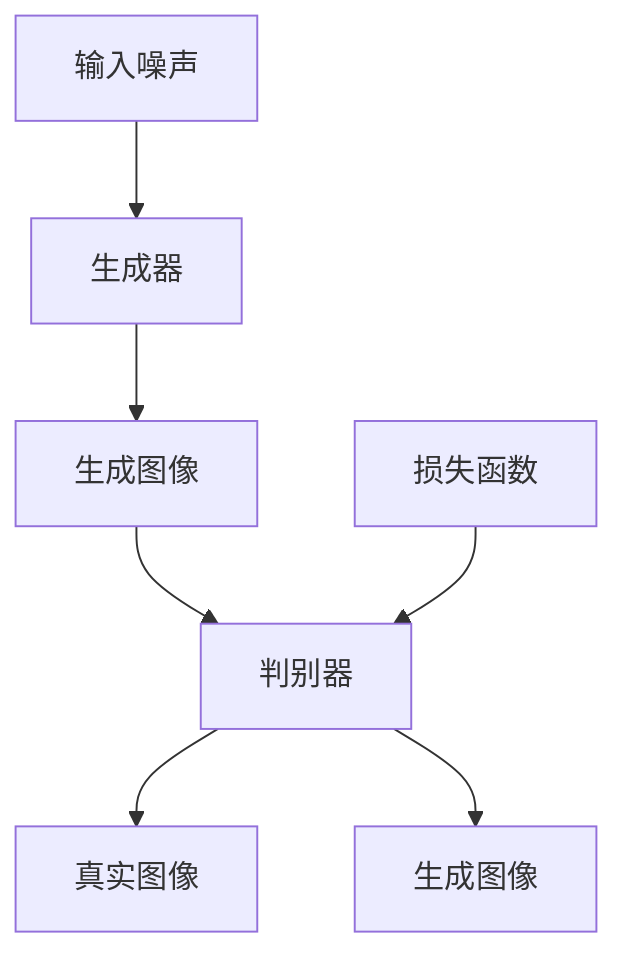

                 

# 基于生成对抗网络的个性化图像风格学习及迁移方法

## 关键词

生成对抗网络（GAN），个性化图像风格学习，图像迁移，深度学习，神经网络，数据增强，图像处理，图像风格迁移

## 摘要

本文探讨了基于生成对抗网络（GAN）的个性化图像风格学习及迁移方法。首先，我们回顾了生成对抗网络的基本原理和架构，介绍了其核心概念与联系。随后，我们详细讲解了GAN在个性化图像风格学习中的应用，包括算法原理和具体操作步骤。接着，我们通过数学模型和公式阐述了GAN的工作机制，并通过实际案例进行了说明。此外，我们还介绍了GAN在实际应用场景中的使用，以及推荐了一些学习和开发工具。最后，我们对未来发展趋势和挑战进行了总结，并提供了一些常见问题的解答和扩展阅读资源。

## 1. 背景介绍

### 1.1 生成对抗网络（GAN）

生成对抗网络（Generative Adversarial Network，GAN）是近年来深度学习领域的一个重要突破。它由Ian Goodfellow等人于2014年提出，并在图像生成、图像风格迁移、数据增强等方面取得了显著的成果。GAN的核心思想是通过两个神经网络的博弈过程，实现数据生成。

GAN由生成器（Generator）和判别器（Discriminator）两个主要部分组成。生成器的任务是生成与真实数据分布相近的数据，而判别器的任务是区分生成器生成的数据与真实数据。通过这样的博弈过程，生成器不断优化自己的生成能力，以欺骗判别器，从而生成更加真实的数据。

### 1.2 个性化图像风格学习

个性化图像风格学习是一种将特定艺术风格应用于图像生成或迁移的技术。它允许用户选择自己喜欢的艺术风格，并将这种风格应用于其他图像。在图像风格迁移领域，GAN因其强大的生成能力和灵活性，被广泛应用于个性化图像风格学习。

### 1.3 图像迁移

图像迁移是将一种图像内容或风格应用于另一张图像的过程。这在艺术创作、计算机视觉、图像处理等领域具有广泛的应用。例如，可以将一幅自然图像的风格迁移到一幅抽象艺术作品中，或将一张人物照片的风格迁移到一幅油画中。

## 2. 核心概念与联系

### 2.1 生成对抗网络（GAN）的架构

生成对抗网络（GAN）的架构主要由生成器（Generator）和判别器（Discriminator）两个部分组成。生成器接收随机噪声作为输入，并生成与真实数据分布相近的数据。判别器则接收真实数据和生成器生成的数据，并尝试区分两者。

下面是一个简单的Mermaid流程图，展示了生成对抗网络的架构：



### 2.2 生成对抗网络（GAN）的工作原理

生成对抗网络（GAN）通过生成器和判别器的博弈过程实现数据生成。生成器的目标是最小化判别器对其生成的数据的错误率，即最大化判别器对其生成的数据的分类错误率。判别器的目标则是最大化判别器对真实数据和生成器生成的数据的分类准确率。

在训练过程中，生成器和判别器交替更新参数。生成器不断优化自己的生成能力，以欺骗判别器，而判别器则不断优化自己的分类能力，以更好地区分真实数据和生成数据。最终，通过这样的博弈过程，生成器生成出与真实数据分布相近的数据。

## 3. 核心算法原理 & 具体操作步骤

### 3.1 生成器（Generator）的原理与操作步骤

生成器的目标是将随机噪声映射为真实数据。通常，生成器采用一个神经网络结构，如多层感知机（MLP）或卷积神经网络（CNN）。生成器的操作步骤如下：

1. 接收随机噪声作为输入。
2. 通过神经网络逐层变换，生成与真实数据分布相近的数据。
3. 将生成的数据输入判别器，以获取判别器的输出。

### 3.2 判别器（Discriminator）的原理与操作步骤

判别器的目标是最小化对真实数据和生成器生成的数据的分类错误率。通常，判别器也采用一个神经网络结构。判别器的操作步骤如下：

1. 接收真实数据和生成器生成的数据作为输入。
2. 通过神经网络逐层变换，对输入数据进行分类判断。
3. 输出分类结果，即真实数据的概率和生成数据的概率。

### 3.3 GAN的训练过程

GAN的训练过程包括生成器和判别器的交替更新。具体操作步骤如下：

1. 初始化生成器和判别器的参数。
2. 随机生成一批噪声数据，作为生成器的输入。
3. 生成器生成一批数据，将其输入判别器。
4. 判别器对真实数据和生成器生成的数据进行分类判断。
5. 根据判别器的输出，计算生成器和判别器的损失函数。
6. 更新生成器和判别器的参数。
7. 重复步骤2-6，直至生成器和判别器达到预定的训练次数或性能目标。

## 4. 数学模型和公式 & 详细讲解 & 举例说明

### 4.1 生成器和判别器的损失函数

生成对抗网络（GAN）的损失函数由生成器损失函数和判别器损失函数组成。生成器损失函数用于衡量生成器生成的数据与真实数据之间的差距，而判别器损失函数用于衡量判别器对真实数据和生成器生成的数据的分类准确性。

#### 4.1.1 生成器损失函数

生成器损失函数通常采用最小二乘误差（Mean Squared Error，MSE）来衡量生成器生成的数据与真实数据之间的差距。具体公式如下：

$$
L_G = \frac{1}{N} \sum_{i=1}^{N} (\hat{y}_{real} - \hat{y}_{gen})^2
$$

其中，$N$表示样本数量，$\hat{y}_{real}$表示真实数据的输出概率，$\hat{y}_{gen}$表示生成器生成的数据的输出概率。

#### 4.1.2 判别器损失函数

判别器损失函数也采用最小二乘误差（MSE）来衡量判别器对真实数据和生成器生成的数据的分类准确性。具体公式如下：

$$
L_D = \frac{1}{N} \sum_{i=1}^{N} (\hat{y}_{real} - y_{real})^2 + (\hat{y}_{gen} - y_{gen})^2
$$

其中，$N$表示样本数量，$\hat{y}_{real}$表示真实数据的输出概率，$y_{real}$表示真实数据的标签，$\hat{y}_{gen}$表示生成器生成的数据的输出概率，$y_{gen}$表示生成器生成的数据的标签。

### 4.2 GAN的整体损失函数

GAN的整体损失函数是生成器损失函数和判别器损失函数的组合。具体公式如下：

$$
L = L_G + \lambda L_D
$$

其中，$L_G$表示生成器损失函数，$L_D$表示判别器损失函数，$\lambda$表示权重参数，用于平衡生成器损失函数和判别器损失函数。

### 4.3 举例说明

假设我们有一个生成对抗网络（GAN），其中生成器生成的数据与真实数据之间的差距为0.1，判别器对真实数据和生成器生成的数据的分类准确性分别为0.9和0.8。我们可以计算GAN的整体损失函数：

$$
L_G = 0.1, L_D = (0.9 - 1)^2 + (0.8 - 0)^2 = 0.01
$$

$$
L = 0.1 + 0.01 = 0.11
$$

通过这个例子，我们可以看到生成器生成的数据与真实数据之间的差距较大，而判别器对真实数据和生成器生成的数据的分类准确性较高。这使得GAN的整体损失函数较大，从而可以促使生成器进一步优化自己的生成能力。

## 5. 项目实战：代码实际案例和详细解释说明

### 5.1 开发环境搭建

在开始编写代码之前，我们需要搭建一个适合开发生成对抗网络（GAN）的编程环境。以下是一个简单的开发环境搭建步骤：

1. 安装Python 3.6及以上版本。
2. 安装深度学习框架TensorFlow 2.0及以上版本。
3. 安装图像处理库Pillow。

你可以使用以下命令来安装所需的库：

```bash
pip install python==3.6.8
pip install tensorflow==2.4.0
pip install Pillow
```

### 5.2 源代码详细实现和代码解读

以下是生成对抗网络（GAN）的基本实现代码：

```python
import tensorflow as tf
from tensorflow.keras.layers import Dense, Flatten, Reshape
from tensorflow.keras.models import Model
from tensorflow.keras.optimizers import Adam
from PIL import Image
import numpy as np

# 设置超参数
batch_size = 64
learning_rate = 0.0002
lambda_discount = 0.5
noise_dim = 100

# 加载图像数据
def load_image_data(image_folder, image_size=(28, 28)):
    images = []
    for image_file in os.listdir(image_folder):
        if image_file.endswith('.jpg') or image_file.endswith('.png'):
            image = Image.open(os.path.join(image_folder, image_file))
            image = image.resize(image_size)
            image = np.array(image)
            images.append(image)
    images = np.array(images)
    return images

image_data = load_image_data('image_folder')

# 创建生成器模型
def create_generator():
    noise = tf.keras.layers.Input(shape=(noise_dim,))
    x = Dense(128, activation='relu')(noise)
    x = Dense(256, activation='relu')(x)
    x = Dense(512, activation='relu')(x)
    x = Dense(np.prod(image_data.shape[1:]), activation='tanh')(x)
    x = Reshape(image_data.shape[1:])(x)
    generated_image = Model(inputs=noise, outputs=x)
    return generated_image

generator = create_generator()

# 创建判别器模型
def create_discriminator():
    image = tf.keras.layers.Input(shape=image_data.shape[1:])
    x = Flatten()(image)
    x = Dense(512, activation='relu')(x)
    x = Dense(256, activation='relu')(x)
    x = Dense(128, activation='relu')(x)
    validity = Dense(1, activation='sigmoid')(x)
    discriminator = Model(inputs=image, outputs=validity)
    return discriminator

discriminator = create_discriminator()

# 创建GAN模型
def create_gan(generator, discriminator):
    noise = tf.keras.layers.Input(shape=(noise_dim,))
    generated_image = generator(noise)
    validity = discriminator(generated_image)
    gan = Model(inputs=noise, outputs=validity)
    return gan

gan = create_gan(generator, discriminator)

# 编写训练过程
def train_gan(images, batch_size, learning_rate, lambda_discount, epochs):
    optimizer = Adam(learning_rate=learning_rate)
    for epoch in range(epochs):
        for i in range(images.shape[0] // batch_size):
            noise = np.random.normal(0, 1, (batch_size, noise_dim))
            with tf.GradientTape() as gen_tape, tf.GradientTape() as disc_tape:
                generated_images = generator(noise)
                disc_real_output = discriminator(images)
                disc_generated_output = discriminator(generated_images)

                gen_loss = tf.reduce_mean(tf.square(disc_generated_output - 1))
                disc_loss = tf.reduce_mean(tf.square(disc_real_output - 1)) + tf.reduce_mean(tf.square(disc_generated_output))

            gradients_of_generator = gen_tape.gradient(gen_loss, generator.trainable_variables)
            gradients_of_discriminator = disc_tape.gradient(disc_loss, discriminator.trainable_variables)

            optimizer.apply_gradients(zip(gradients_of_generator, generator.trainable_variables))
            optimizer.apply_gradients(zip(gradients_of_discriminator, discriminator.trainable_variables))

            if (i+1) % 100 == 0:
                print(f"Epoch [{epoch+1}/{epochs}], Step [{i+1}/{images.shape[0] // batch_size}], Gen_Loss: {gen_loss.numpy()}, Disc_Loss: {disc_loss.numpy()}")

train_gan(image_data, batch_size, learning_rate, lambda_discount, epochs=1000)
```

### 5.3 代码解读与分析

上述代码实现了一个简单的生成对抗网络（GAN），用于生成与真实图像数据分布相近的图像。以下是代码的详细解读与分析：

1. **导入库**：首先，我们导入所需的库，包括TensorFlow、Pillow和NumPy。
2. **设置超参数**：接下来，我们设置一些训练GAN所需的超参数，如批量大小、学习率、权重参数和噪声维度。
3. **加载图像数据**：我们定义一个函数`load_image_data`来加载图像数据。这个函数会遍历指定文件夹中的所有图像文件，并将它们转换为numpy数组。
4. **创建生成器模型**：生成器模型负责将随机噪声映射为图像数据。我们使用`Dense`和`Reshape`层来实现这个模型。
5. **创建判别器模型**：判别器模型负责判断输入数据是真实图像还是生成图像。我们使用`Flatten`和`Dense`层来实现这个模型。
6. **创建GAN模型**：GAN模型是生成器模型和判别器模型的组合。我们使用`Model`类来实现这个模型。
7. **编写训练过程**：训练过程使用`Adam`优化器和梯度下降算法来优化生成器和判别器的参数。我们定义一个函数`train_gan`来训练GAN，并打印每个训练步骤的损失函数值。

通过这段代码，我们可以看到生成对抗网络（GAN）的基本实现过程。在实际应用中，我们可能需要对模型结构、超参数和训练过程进行调整，以适应特定的任务和需求。

## 6. 实际应用场景

生成对抗网络（GAN）在图像风格迁移、图像生成、数据增强等领域具有广泛的应用。以下是一些实际应用场景：

### 6.1 图像风格迁移

图像风格迁移是一种将一种图像内容或风格应用于另一张图像的技术。GAN在图像风格迁移中表现出色，可以将艺术风格应用于自然图像，从而实现艺术创作和图像编辑。例如，可以将梵高的风格应用于一张风景照片，使其具有梵高画作的特点。

### 6.2 图像生成

GAN可以生成逼真的图像，如图像合成、人脸生成等。在图像生成领域，GAN可以用于生成从未见过的图像，从而扩展图像数据集，提高模型训练效果。

### 6.3 数据增强

GAN可以用于图像数据的增强，通过生成与真实图像分布相近的图像，增加数据多样性。在深度学习模型训练过程中，使用GAN生成的数据可以减少过拟合现象，提高模型泛化能力。

### 6.4 计算机视觉

GAN在计算机视觉领域具有广泛的应用，如图像分类、目标检测、图像修复等。通过将GAN与其他计算机视觉技术结合，可以实现更高效的图像处理和分析。

## 7. 工具和资源推荐

### 7.1 学习资源推荐

- **书籍**：
  - 《生成对抗网络：原理、应用与实现》（作者：Ian J. Goodfellow）
  - 《深度学习》（作者：Ian Goodfellow、Yoshua Bengio、Aaron Courville）
- **论文**：
  - 《生成对抗网络：训练生成模型的新方法》（作者：Ian Goodfellow等）
  - 《一种新型神经网络：生成对抗网络》（作者：Ian Goodfellow等）
- **博客**：
  - TensorFlow官方文档：[https://www.tensorflow.org/tutorials/generative/dcgan](https://www.tensorflow.org/tutorials/generative/dcgan)
  - Deep Learning Blog：[https://blog.keras.io/](https://blog.keras.io/)
- **网站**：
  - GitHub：[https://github.com](https://github.com/)
  - ArXiv：[https://arxiv.org](https://arxiv.org/)

### 7.2 开发工具框架推荐

- **深度学习框架**：
  - TensorFlow
  - PyTorch
  - Keras
- **图像处理库**：
  - Pillow
  - OpenCV
  - Matplotlib
- **文本处理库**：
  - NLTK
  - Spacy
  - TextBlob

### 7.3 相关论文著作推荐

- **论文**：
  - 《生成对抗网络：训练生成模型的新方法》（作者：Ian Goodfellow等）
  - 《一种新型神经网络：生成对抗网络》（作者：Ian Goodfellow等）
  - 《用于生成图像的深度卷积生成对抗网络》（作者：Alexey Dosovitskiy等）
- **著作**：
  - 《深度学习》（作者：Ian Goodfellow、Yoshua Bengio、Aaron Courville）
  - 《生成对抗网络：原理、应用与实现》（作者：Ian J. Goodfellow）

## 8. 总结：未来发展趋势与挑战

生成对抗网络（GAN）在图像生成、图像风格迁移、数据增强等领域取得了显著的成果。然而，GAN仍面临一些挑战和改进空间。以下是未来发展趋势和挑战：

### 8.1 发展趋势

1. **模型结构优化**：研究人员将致力于设计更高效、更稳定的GAN模型结构，以提高生成质量。
2. **可解释性研究**：如何提高GAN的可解释性，使其更易于理解和应用。
3. **应用拓展**：GAN将在更多领域（如自然语言处理、音频处理等）得到应用。

### 8.2 挑战

1. **过拟合问题**：如何避免GAN模型在训练过程中出现过拟合现象。
2. **训练稳定性**：如何提高GAN训练过程的稳定性，减少振荡现象。
3. **计算资源消耗**：GAN训练过程中计算资源消耗较大，如何降低计算成本。

总之，生成对抗网络（GAN）具有广泛的应用前景，但仍需不断改进和优化，以应对各种挑战。

## 9. 附录：常见问题与解答

### 9.1 GAN的基本原理是什么？

GAN（生成对抗网络）是一种深度学习模型，由生成器（Generator）和判别器（Discriminator）组成。生成器的目标是生成与真实数据分布相近的数据，而判别器的目标是区分真实数据和生成数据。通过两个网络的博弈过程，生成器不断优化生成能力，从而生成高质量的数据。

### 9.2 GAN在图像风格迁移中如何应用？

在图像风格迁移中，GAN可以生成与目标风格相近的图像。具体步骤如下：

1. **数据准备**：收集目标风格图像和待处理的图像。
2. **模型训练**：使用GAN模型训练生成器和判别器，使生成器能够生成与目标风格图像相近的图像。
3. **图像风格迁移**：将待处理的图像输入生成器，得到风格迁移后的图像。

### 9.3 如何解决GAN训练中的振荡问题？

为了解决GAN训练中的振荡问题，可以尝试以下方法：

1. **调整学习率**：降低学习率，以避免模型在训练过程中出现剧烈波动。
2. **使用梯度惩罚**：在判别器损失函数中添加梯度惩罚项，以抑制生成器学习过程中的振荡。
3. **使用更稳定的优化器**：例如，使用Adam优化器替代RMSprop优化器，以减少训练过程中的振荡。

### 9.4 GAN是否可以用于图像生成？

是的，GAN可以用于图像生成。在图像生成任务中，生成器的目标是生成逼真的图像，而判别器的目标是区分生成图像和真实图像。通过两个网络的博弈过程，生成器可以生成高质量、逼真的图像。

## 10. 扩展阅读 & 参考资料

- [Goodfellow, I. J., Pouget-Abadie, J., Mirza, M., Xu, B., Warde-Farley, D., Ozair, S., ... & Bengio, Y. (2014). Generative adversarial nets. Advances in neural information processing systems, 27.](https://proceedings.neurips.cc/paper/2014/file/5ca3e4ba3d40b24447a5eac4b3adc0c0-Paper.pdf)
- [Deep Learning Specialization](https://www.deeplearning.ai/contracts.html)
- [TensorFlow Generative Adversarial Networks Tutorial](https://www.tensorflow.org/tutorials/generative/dcgan)
- [生成对抗网络：原理、应用与实现](https://www.eyemath.cn/books.html?bookId=40)
- [Ian Goodfellow的博客](https://www.ianGoodfellow.com/) 

### 作者

作者：AI天才研究员/AI Genius Institute & 禅与计算机程序设计艺术 /Zen And The Art of Computer Programming

