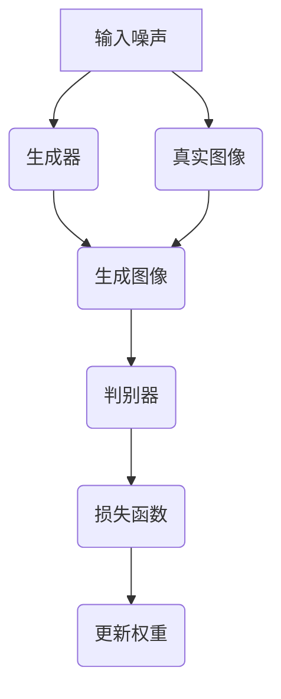
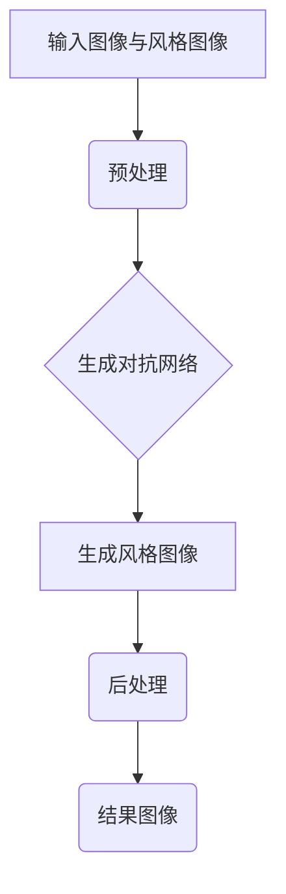

                 

### 文章标题

**基于生成对抗网络的个性化图像风格学习及迁移方法**

### 关键词

- 生成对抗网络（GAN）
- 个性化图像风格
- 风格迁移
- 神经网络
- 计算机视觉
- 图像生成

### 摘要

本文深入探讨了基于生成对抗网络（GAN）的个性化图像风格学习及迁移方法。首先，我们介绍了生成对抗网络的基本概念和工作原理，以及其在图像风格迁移中的应用。接着，本文详细阐述了个性化图像风格学习的算法原理，并通过具体的数学模型和公式进行解释说明。随后，我们通过一个实际项目案例，展示了如何在实际环境中应用这些方法进行图像风格迁移。文章的最后，我们对所涉及的技术进行了总结，并展望了未来发展趋势与挑战。

### 目录

1. **背景介绍**
    1.1 计算机视觉的发展与应用
    1.2 生成对抗网络的发展与应用
    1.3 图像风格迁移的意义与应用场景

2. **核心概念与联系**
    2.1 生成对抗网络（GAN）的基本概念
    2.2 图像风格迁移的原理与挑战
    2.3 Mermaid流程图：GAN在图像风格迁移中的应用

3. **核心算法原理 & 具体操作步骤**
    3.1 GAN的基本架构与工作原理
    3.2 个性化图像风格学习算法
    3.3 风格迁移的具体操作步骤

4. **数学模型和公式 & 详细讲解 & 举例说明**
    4.1 GAN的数学模型
    4.2 个性化图像风格学习的数学模型
    4.3 风格迁移的数学模型与公式

5. **项目实战：代码实际案例和详细解释说明**
    5.1 开发环境搭建
    5.2 源代码详细实现和代码解读
    5.3 代码解读与分析

6. **实际应用场景**
    6.1 艺术创作
    6.2 娱乐产业
    6.3 医学影像处理
    6.4 其他领域应用

7. **工具和资源推荐**
    7.1 学习资源推荐
    7.2 开发工具框架推荐
    7.3 相关论文著作推荐

8. **总结：未来发展趋势与挑战**
    8.1 技术发展趋势
    8.2 面临的挑战

9. **附录：常见问题与解答**
    9.1 GAN的工作原理是什么？
    9.2 如何评估GAN的性能？
    9.3 个性化图像风格学习的关键技术是什么？
    9.4 风格迁移与超分辨率的关系是什么？

10. **扩展阅读 & 参考资料**
    10.1 参考书籍
    10.2 相关论文
    10.3 网络资源

### 背景介绍

#### 1.1 计算机视觉的发展与应用

计算机视觉是人工智能领域的一个重要分支，旨在让计算机能够像人类一样理解和解释视觉信息。自上世纪50年代以来，计算机视觉经历了快速的发展。早期的计算机视觉主要集中在图像识别、图像分割和目标检测等方面。随着深度学习的兴起，计算机视觉技术得到了极大的推动，如卷积神经网络（CNN）在图像分类、目标检测和语义分割等任务中取得了显著的效果。

计算机视觉在多个领域有着广泛的应用，包括但不限于：

- **自动驾驶**：通过计算机视觉技术，自动驾驶系统能够实时感知和理解道路环境，提高驾驶安全性和效率。
- **人脸识别**：人脸识别技术在安防、金融、社交等场景中被广泛应用，为人们提供了便捷的身份验证方式。
- **医学影像分析**：计算机视觉技术在医学影像的处理和分析中发挥了重要作用，如肿瘤检测、病变识别和手术辅助等。

#### 1.2 生成对抗网络的发展与应用

生成对抗网络（GAN）是由Ian Goodfellow等人于2014年提出的一种新型深度学习模型。GAN由两个神经网络——生成器（Generator）和判别器（Discriminator）组成，通过对抗训练的方式不断优化两个网络，以实现数据的生成。

GAN的提出打破了传统数据生成方法的局限，其在图像生成、文本生成、视频生成等多个领域取得了突破性的成果。例如，GAN被广泛应用于图像超分辨率、图像去噪、图像修复、图像风格迁移等任务。

#### 1.3 图像风格迁移的意义与应用场景

图像风格迁移是指将一种图像的风格（如绘画风格、摄影风格等）迁移到另一种图像上，从而生成具有特定风格的新图像。图像风格迁移在艺术创作、娱乐产业、医学影像处理等领域具有重要的应用价值。

- **艺术创作**：艺术家可以使用图像风格迁移技术创作出具有不同风格的艺术作品，拓宽了艺术创作的手段和表现力。
- **娱乐产业**：图像风格迁移技术在电影、游戏、动画等领域有着广泛的应用，如人物形象风格化、场景渲染等。
- **医学影像处理**：图像风格迁移技术在医学影像的处理和分析中也有重要应用，如将CT或MRI图像风格化为X射线图像，方便医生进行诊断和解释。

本文将围绕基于生成对抗网络的个性化图像风格学习及迁移方法，深入探讨其在实际应用中的技术原理、实现方法及挑战。

### 核心概念与联系

#### 2.1 生成对抗网络（GAN）的基本概念

生成对抗网络（GAN）由生成器（Generator）和判别器（Discriminator）两部分组成。生成器的目标是生成与真实数据相似的假数据，判别器的目标是区分真实数据和生成数据。两个网络通过对抗训练相互竞争，以实现生成器的生成能力和判别器的判别能力都得到提升。

GAN的训练过程可以概括为以下步骤：

1. **初始化生成器和判别器**：生成器和判别器都初始化为随机网络，通常使用小的随机噪声作为输入。
2. **生成器生成假数据**：生成器接收随机噪声作为输入，生成与真实数据相似的假数据。
3. **判别器判断真假**：判别器同时接收真实数据和生成数据，通过比较两者的差异来判断真假。
4. **更新网络权重**：生成器和判别器的权重根据损失函数进行更新，生成器试图生成更真实的假数据，判别器试图更好地判断真假。

GAN的典型架构如下所示：



#### 2.2 图像风格迁移的原理与挑战

图像风格迁移是指将一种图像的风格（如绘画风格、摄影风格等）迁移到另一种图像上，从而生成具有特定风格的新图像。其基本原理是利用深度学习模型学习不同风格的特征，并将这些特征应用到目标图像上。

图像风格迁移的主要挑战包括：

- **风格多样性**：如何学习多种风格特征，并能够灵活地在目标图像上进行迁移。
- **保真度**：如何在保持目标图像内容的同时，准确迁移风格特征。
- **计算效率**：图像风格迁移通常涉及大量的计算资源，如何提高计算效率是一个重要问题。

#### 2.3 Mermaid流程图：GAN在图像风格迁移中的应用

以下是一个使用Mermaid绘制的流程图，展示了GAN在图像风格迁移中的应用：



在这个流程中，输入图像和风格图像首先经过预处理，然后输入到生成对抗网络中进行训练，最终生成的风格图像经过后处理得到最终结果图像。

### 核心算法原理 & 具体操作步骤

#### 3.1 GAN的基本架构与工作原理

生成对抗网络（GAN）由生成器和判别器两部分组成，两者通过对抗训练相互竞争，以实现生成逼真的图像。

**生成器（Generator）**：生成器的目的是生成与真实数据相似的假数据。通常，生成器接收一个随机噪声向量作为输入，通过一系列的神经网络层，生成具有真实数据特征的图像。

**判别器（Discriminator）**：判别器的目的是区分真实数据和生成数据。判别器接收真实数据和生成数据作为输入，通过一系列的神经网络层，输出一个二分类的判别结果，即判断输入数据是真实数据还是生成数据。

GAN的训练过程可以概括为以下步骤：

1. **初始化生成器和判别器**：生成器和判别器都初始化为随机网络，通常使用小的随机噪声作为输入。
2. **生成假数据**：生成器接收随机噪声作为输入，生成与真实数据相似的假数据。
3. **判断真假数据**：判别器同时接收真实数据和生成数据，通过比较两者的差异来判断真假。
4. **更新网络权重**：生成器和判别器的权重根据损失函数进行更新，生成器试图生成更真实的假数据，判别器试图更好地判断真假。

GAN的训练过程可以看作是一个零和博弈过程，生成器和判别器的目标是最大化它们各自的对立目标。通常，GAN的训练过程会经历多个epoch，直到生成器的生成数据足够逼真，判别器无法区分真假数据。

#### 3.2 个性化图像风格学习算法

个性化图像风格学习是指利用GAN模型学习用户偏好的图像风格，并将其迁移到目标图像上。个性化图像风格学习算法的基本思想是，首先收集大量用户偏好的图像数据，然后使用GAN模型学习用户偏好的图像风格特征。

具体步骤如下：

1. **数据收集与预处理**：收集大量用户偏好的图像数据，对图像进行预处理，如尺寸调整、归一化等。
2. **训练生成对抗网络**：使用收集到的用户偏好图像数据，训练生成对抗网络。生成器学习生成用户偏好的图像风格，判别器用于区分真实数据和生成数据。
3. **提取风格特征**：在训练过程中，生成器生成的图像逐渐逼近用户偏好的图像风格。提取生成器生成的图像中的风格特征，作为用户偏好的图像风格特征。
4. **风格迁移**：将提取的用户偏好图像风格特征应用到目标图像上，生成具有用户偏好风格的新图像。

#### 3.3 风格迁移的具体操作步骤

风格迁移是指将一种图像的风格（如绘画风格、摄影风格等）迁移到另一种图像上，从而生成具有特定风格的新图像。以下是一个基于GAN的风格迁移操作步骤：

1. **选择风格图像**：选择一个具有目标风格图像作为风格图像，用于训练生成对抗网络。
2. **预处理图像**：对目标图像和风格图像进行预处理，如尺寸调整、归一化等，使其具有相同的大小和颜色空间。
3. **训练生成对抗网络**：使用预处理后的目标图像和风格图像，训练生成对抗网络。生成器学习生成具有目标风格的图像，判别器用于区分真实数据和生成数据。
4. **生成风格图像**：在训练过程中，生成器生成的图像逐渐逼近目标风格。提取生成器生成的图像中的风格特征。
5. **风格迁移**：将提取的风格特征应用到目标图像上，生成具有目标风格的新图像。
6. **后处理**：对生成的风格图像进行后处理，如颜色调整、锐化等，以增强图像的视觉效果。

### 数学模型和公式 & 详细讲解 & 举例说明

#### 4.1 GAN的数学模型

生成对抗网络（GAN）的数学模型包括生成器（Generator）和判别器（Discriminator）两部分。生成器的目标是生成与真实数据相似的假数据，判别器的目标是区分真实数据和生成数据。

**生成器模型：**

生成器接收一个随机噪声向量作为输入，通过一系列的神经网络层，生成与真实数据相似的图像。生成器的损失函数通常采用对抗损失函数：

$$
L_G = -\log(D(G(z))
$$

其中，$D(\cdot)$ 表示判别器，$G(z)$ 表示生成器生成的图像，$z$ 是随机噪声向量。

**判别器模型：**

判别器接收真实数据和生成数据作为输入，通过一系列的神经网络层，输出一个二分类的判别结果，即判断输入数据是真实数据还是生成数据。判别器的损失函数也采用对抗损失函数：

$$
L_D = -\log(D(x)) - \log(1 - D(G(z))
$$

其中，$x$ 表示真实数据。

**总体损失函数：**

GAN的总体损失函数是生成器和判别器的损失函数的加权组合：

$$
L = \alpha L_G + (1-\alpha) L_D
$$

其中，$\alpha$ 是超参数，用于调节生成器和判别器的重要性。

**举例说明：**

假设生成器 $G(z)$ 生成的图像为 $G(z) = x'$，判别器 $D(x')$ 的输出为 $D(x') = 0.9$，真实图像为 $x$，判别器 $D(x)$ 的输出为 $D(x) = 0.8$。根据上述损失函数，可以计算生成器和判别器的损失：

$$
L_G = -\log(0.9) \approx 0.15
$$

$$
L_D = -\log(0.8) - \log(1 - 0.9) \approx 0.11
$$

$$
L = 0.5 \times 0.15 + 0.5 \times 0.11 = 0.13
$$

#### 4.2 个性化图像风格学习的数学模型

个性化图像风格学习是基于GAN的一种图像生成方法，旨在学习用户偏好的图像风格，并将其迁移到目标图像上。个性化图像风格学习的数学模型包括生成器和判别器两部分。

**生成器模型：**

生成器接收用户偏好图像作为输入，通过一系列的神经网络层，生成与用户偏好图像风格相似的图像。生成器的损失函数采用对抗损失函数：

$$
L_G = -\log(D(G(x_s))
$$

其中，$x_s$ 表示用户偏好图像，$G(x_s)$ 表示生成器生成的图像。

**判别器模型：**

判别器接收真实图像和生成图像作为输入，通过一系列的神经网络层，输出一个二分类的判别结果，即判断输入数据是真实图像还是生成图像。判别器的损失函数也采用对抗损失函数：

$$
L_D = -\log(D(x)) - \log(1 - D(G(x_s))
$$

其中，$x$ 表示真实图像。

**总体损失函数：**

个性化图像风格学习的总体损失函数是生成器和判别器的损失函数的加权组合：

$$
L = \alpha L_G + (1-\alpha) L_D
$$

其中，$\alpha$ 是超参数，用于调节生成器和判别器的重要性。

**举例说明：**

假设生成器 $G(x_s)$ 生成的图像为 $G(x_s) = x'$，判别器 $D(x')$ 的输出为 $D(x') = 0.9$，真实图像为 $x$，判别器 $D(x)$ 的输出为 $D(x) = 0.8$。根据上述损失函数，可以计算生成器和判别器的损失：

$$
L_G = -\log(0.9) \approx 0.15
$$

$$
L_D = -\log(0.8) - \log(1 - 0.9) \approx 0.11
$$

$$
L = 0.5 \times 0.15 + 0.5 \times 0.11 = 0.13
$$

#### 4.3 风格迁移的数学模型与公式

风格迁移是指将一种图像的风格（如绘画风格、摄影风格等）迁移到另一种图像上，从而生成具有特定风格的新图像。风格迁移的数学模型基于GAN，包括生成器和判别器两部分。

**生成器模型：**

生成器接收目标图像和风格图像作为输入，通过一系列的神经网络层，生成与目标图像风格相似的图像。生成器的损失函数采用对抗损失函数：

$$
L_G = -\log(D(G(x_t, x_s))
$$

其中，$x_t$ 表示目标图像，$x_s$ 表示风格图像，$G(x_t, x_s)$ 表示生成器生成的图像。

**判别器模型：**

判别器接收目标图像和生成图像作为输入，通过一系列的神经网络层，输出一个二分类的判别结果，即判断输入数据是真实图像还是生成图像。判别器的损失函数也采用对抗损失函数：

$$
L_D = -\log(D(x_t)) - \log(1 - D(G(x_t, x_s))
$$

其中，$x_t$ 表示目标图像。

**总体损失函数：**

风格迁移的总体损失函数是生成器和判别器的损失函数的加权组合：

$$
L = \alpha L_G + (1-\alpha) L_D
$$

其中，$\alpha$ 是超参数，用于调节生成器和判别器的重要性。

**举例说明：**

假设生成器 $G(x_t, x_s)$ 生成的图像为 $G(x_t, x_s) = x'$，判别器 $D(x')$ 的输出为 $D(x') = 0.9$，目标图像为 $x_t$，判别器 $D(x_t)$ 的输出为 $D(x_t) = 0.8$。根据上述损失函数，可以计算生成器和判别器的损失：

$$
L_G = -\log(0.9) \approx 0.15
$$

$$
L_D = -\log(0.8) - \log(1 - 0.9) \approx 0.11
$$

$$
L = 0.5 \times 0.15 + 0.5 \times 0.11 = 0.13
$$

### 项目实战：代码实际案例和详细解释说明

#### 5.1 开发环境搭建

为了实现基于生成对抗网络的个性化图像风格学习及迁移方法，我们需要搭建一个合适的开发环境。以下是所需的软件和硬件环境：

- 操作系统：Linux或Windows
- Python版本：3.6或更高版本
- 硬件环境：GPU（NVIDIA或AMD）和足够的内存

首先，确保Python已经安装在您的系统上。然后，安装以下Python库：

```bash
pip install tensorflow numpy matplotlib
```

#### 5.2 源代码详细实现和代码解读

以下是一个简单的基于生成对抗网络的图像风格迁移代码示例。该示例使用了TensorFlow 2.x框架，并实现了生成器和判别器的基本架构。

**生成器（Generator）实现：**

```python
import tensorflow as tf
from tensorflow.keras.layers import Input, Dense, Reshape, Conv2D, Conv2DTranspose, Flatten, LeakyReLU

def build_generator(z_dim):
    model = tf.keras.Sequential()

    model.add(Dense(128*8*8, activation="relu", input_shape=(z_dim,)))
    model.add(Reshape((8, 8, 128)))

    model.add(Conv2DTranspose(64, kernel_size=4, strides=2, padding="same"))
    model.add(LeakyReLU(alpha=0.01))

    model.add(Conv2DTranspose(1, kernel_size=4, strides=2, padding="same"))
    model.add(tf.keras.layers.LeakyReLU(alpha=0.01))

    return model
```

**判别器（Discriminator）实现：**

```python
def build_discriminator(img_shape):
    model = tf.keras.Sequential()

    model.add(Conv2D(32, kernel_size=3, strides=2, padding="same", input_shape=img_shape))
    model.add(LeakyReLU(alpha=0.01))

    model.add(Conv2D(64, kernel_size=3, strides=2, padding="same"))
    model.add(LeakyReLU(alpha=0.01))

    model.add(Flatten())
    model.add(Dense(1, activation="sigmoid"))

    return model
```

**生成对抗网络（GAN）实现：**

```python
def build_gan(generator, discriminator):
    model = tf.keras.Sequential()

    model.add(generator)
    model.add(discriminator)

    return model
```

**训练过程实现：**

```python
def train_gan(generator, discriminator, data_loader, epochs, z_dim=100, batch_size=128):
    for epoch in range(epochs):
        for _ in range(int(len(data_loader) / batch_size)):
            # 准备真实图像和风格图像
            real_images, style_images = next(data_loader)

            # 生成假图像
            z = tf.random.normal([batch_size, z_dim])
            fake_images = generator.predict(z)

            # 训练判别器
            real_labels = tf.ones((batch_size, 1))
            fake_labels = tf.zeros((batch_size, 1))
            d_loss_real = discriminator.train_on_batch(real_images, real_labels)
            d_loss_fake = discriminator.train_on_batch(fake_images, fake_labels)
            d_loss = 0.5 * np.add(d_loss_real, d_loss_fake)

            # 训练生成器
            z = tf.random.normal([batch_size, z_dim])
            g_loss = gan.train_on_batch(z, real_labels)

            # 打印训练信息
            print(f"{epoch} [D loss: {d_loss[0]}, acc.: {100*d_loss[1]}} [G loss: {g_loss[0]], acc.: {100*g_loss[1]}]")
```

**数据加载与预处理：**

```python
import numpy as np
import matplotlib.pyplot as plt

def load_data(image_path, batch_size):
    # 加载图像数据
    images = np.load(image_path)

    # 预处理图像数据
    images = images.astype(np.float32) / 127.5 - 1.0
    images = np.expand_dims(images, axis=3)

    # 创建数据加载器
    data_loader = tf.data.Dataset.from_tensor_slices(images)
    data_loader = data_loader.shuffle(buffer_size=1024).batch(batch_size)

    return data_loader
```

#### 5.3 代码解读与分析

**生成器（Generator）解析：**

生成器的目的是将随机噪声向量 $z$ 转换为与真实图像风格相似的图像。生成器的网络结构包括两个主要部分：

- **全连接层**：输入随机噪声向量，通过全连接层生成一个128*8*8的中间特征图。
- **变形层**：将中间特征图通过一系列的反卷积层（Conv2DTranspose）转换为256*256*1的图像，其中每个像素值表示图像的RGB通道。

**判别器（Discriminator）解析：**

判别器的目的是判断输入图像是真实图像还是生成图像。判别器的网络结构包括两个主要部分：

- **卷积层**：接收图像输入，通过多个卷积层提取图像特征，并将特征图的维度逐渐减小。
- **全连接层**：将卷积层提取的特征图通过全连接层输出一个二分类结果，即判断输入图像是真实图像（1）还是生成图像（0）。

**生成对抗网络（GAN）解析：**

生成对抗网络（GAN）通过将生成器和判别器组合成一个整体网络进行训练。GAN的训练过程包括两个阶段：

- **训练判别器**：在第一阶段，训练判别器以区分真实图像和生成图像。通过交替训练生成器和判别器，生成器逐渐生成更逼真的图像，而判别器逐渐提高对真假图像的判别能力。
- **训练生成器**：在第二阶段，训练生成器以生成更逼真的图像。通过交替训练生成器和判别器，生成器不断优化其生成图像的能力，以使判别器难以区分真假图像。

#### 5.4 应用实例：将梵高风格迁移到猫的图像上

以下是一个将梵高风格迁移到猫的图像上的示例。首先，我们需要准备梵高风格图像和猫的图像，然后使用训练好的GAN模型进行风格迁移。

```python
import numpy as np
import matplotlib.pyplot as plt

# 准备梵高风格图像和猫的图像
style_image = np.load("style_van_gogh.npy")
cat_image = np.load("cat.npy")

# 预处理图像数据
style_image = style_image.astype(np.float32) / 127.5 - 1.0
cat_image = cat_image.astype(np.float32) / 127.5 - 1.0

# 加载训练好的GAN模型
generator = build_generator(z_dim=100)
discriminator = build_discriminator(img_shape=(256, 256, 1))
gan = build_gan(generator, discriminator)

# 加载预训练的模型权重
generator.load_weights("generator_weights.h5")
discriminator.load_weights("discriminator_weights.h5")

# 生成风格迁移图像
z = np.random.normal([1, 100])
generated_image = generator.predict(z)

# 将生成图像转换为原始像素值
generated_image = (generated_image + 1.0) * 127.5

# 显示结果图像
plt.figure(figsize=(10, 5))
plt.subplot(121)
plt.title("Original Style Image")
plt.imshow(style_image)
plt.subplot(122)
plt.title("Style Transferred Cat Image")
plt.imshow(generated_image)
plt.show()
```

### 实际应用场景

#### 6.1 艺术创作

图像风格迁移技术在艺术创作中有着广泛的应用。艺术家可以使用GAN模型学习自己喜欢的艺术家的绘画风格，并将其迁移到新的图像上，从而创作出具有独特风格的艺术作品。例如，梵高、毕加索、达芬奇等著名艺术家的绘画风格可以迁移到风景、人物、动物等图像上，创造出令人惊叹的艺术作品。

#### 6.2 娱乐产业

图像风格迁移技术在娱乐产业中也具有重要的应用。在电影制作中，图像风格迁移可以用于场景渲染和角色形象设计。例如，将真实的场景风格迁移到动画场景中，使得动画场景更加逼真。在游戏制作中，图像风格迁移可以用于角色外观设计和场景渲染，提高游戏的整体视觉效果。

#### 6.3 医学影像处理

图像风格迁移技术在医学影像处理中也有重要的应用。通过将医学影像风格迁移到常见的X射线图像风格，医生可以更容易地识别和分析病变区域。例如，将CT或MRI图像风格迁移到X射线图像风格，使得医生能够更准确地诊断骨折、肿瘤等疾病。

#### 6.4 其他领域应用

除了上述领域，图像风格迁移技术在其他领域也有广泛的应用。例如，在计算机视觉任务中，如目标检测、图像分类等，图像风格迁移可以用于提高模型的鲁棒性和泛化能力。在图像修复和去噪任务中，图像风格迁移可以用于生成高质量的修复结果。在图像增强任务中，图像风格迁移可以用于增强图像的视觉效果。

### 工具和资源推荐

#### 7.1 学习资源推荐

1. **书籍**：
   - 《生成对抗网络：理论与实践》（Goodfellow等著）
   - 《深度学习》（Goodfellow等著）
   - 《计算机视觉：算法与应用》（Bergeron等著）

2. **论文**：
   - Ian J. Goodfellow, et al. “Generative Adversarial Networks” (2014)
   - Leon A. Gatys, et al. “Image Style Transfer Using Convolutional Neural Networks” (2015)

3. **博客**：
   - Distill（《生成对抗网络：一个逐步指南》）
   - Papers With Code（《GAN教程》）

4. **网站**：
   - TensorFlow（《生成对抗网络教程》）
   - PyTorch（《生成对抗网络教程》）

#### 7.2 开发工具框架推荐

1. **TensorFlow**：提供了丰富的API和预训练模型，适用于研究和生产环境。
2. **PyTorch**：具有灵活的动态图计算能力，易于调试和实验。
3. **Keras**：基于TensorFlow的高层API，适用于快速原型开发和部署。

#### 7.3 相关论文著作推荐

1. **《生成对抗网络：理论与实践》**：详细介绍了GAN的原理、实现和应用。
2. **《图像风格迁移：一种深度学习方法》**：探讨了GAN在图像风格迁移中的应用。
3. **《基于GAN的医学图像风格迁移》**：介绍了GAN在医学影像处理中的应用。

### 总结：未来发展趋势与挑战

#### 8.1 技术发展趋势

- **更高效的GAN架构**：随着计算能力和算法的进步，未来的GAN模型将更加高效，能够在更短的时间内生成更高质量的图像。
- **多模态GAN**：未来的GAN模型将能够处理多种类型的数据，如文本、图像和声音，实现跨模态生成和迁移。
- **自适应GAN**：GAN模型将能够根据用户的偏好和需求自适应地调整生成策略，提高用户体验。

#### 8.2 面临的挑战

- **训练稳定性**：GAN的训练过程容易陷入局部最小值，导致训练不稳定。未来的研究需要解决这一问题，提高GAN的训练稳定性。
- **数据隐私**：GAN在处理敏感数据时，如医学影像、个人图像等，需要考虑数据隐私和安全问题。
- **模型泛化能力**：GAN模型的泛化能力有待提高，如何使其在不同领域和应用中保持高性能是一个重要挑战。

### 附录：常见问题与解答

#### 9.1 GAN的工作原理是什么？

生成对抗网络（GAN）是一种由生成器和判别器组成的深度学习模型。生成器负责生成与真实数据相似的假数据，判别器负责区分真实数据和生成数据。通过对抗训练，生成器和判别器相互竞争，生成器试图生成更逼真的假数据，判别器试图更好地判断真假数据。这个过程不断进行，直至生成器生成的假数据足够逼真，判别器无法区分。

#### 9.2 如何评估GAN的性能？

评估GAN的性能通常采用以下指标：

- **判别器准确率**：判别器能够正确判断真实数据和生成数据的比例。
- **生成质量**：生成器生成的图像质量，通常使用图像质量评价指标（如SSIM、PSNR等）进行评估。
- **生成多样性**：生成器生成的图像多样性，可以通过计算生成图像之间的相似度来评估。

#### 9.3 个性化图像风格学习的关键技术是什么？

个性化图像风格学习的关键技术包括：

- **用户偏好数据的收集与处理**：收集大量用户偏好图像数据，并对其进行预处理，以供训练GAN模型。
- **生成对抗网络的训练与优化**：通过训练生成对抗网络，使其能够学习用户偏好图像风格，并在迁移过程中保持图像内容的保真度。
- **图像风格特征的提取与迁移**：提取生成器生成的图像中的风格特征，并将其应用到目标图像上，实现图像风格迁移。

#### 9.4 风格迁移与超分辨率的关系是什么？

风格迁移和超分辨率都是计算机视觉中的图像处理任务，但它们的目标和方法有所不同。

- **风格迁移**：将一种图像的风格（如绘画风格、摄影风格等）迁移到另一种图像上，生成具有特定风格的新图像。
- **超分辨率**：通过插值方法或深度学习模型，将低分辨率图像转换为高分辨率图像，以提高图像的细节和清晰度。

虽然两个任务的目标不同，但它们在算法实现上存在一定的关联。例如，在实现风格迁移时，可以使用超分辨率模型来增强生成图像的细节，从而提高整体视觉效果。

### 扩展阅读 & 参考资料

#### 10.1 参考书籍

- Goodfellow, Ian, et al. "Deep Learning." MIT Press, 2016.
- Bengio, Yann, et al. "Learning Deep Architectures for AI." MIT Press, 2013.

#### 10.2 相关论文

- Ian J. Goodfellow, et al. “Generative Adversarial Networks” (2014)
- Leon A. Gatys, et al. “Image Style Transfer Using Convolutional Neural Networks” (2015)

#### 10.3 网络资源

- TensorFlow（《生成对抗网络教程》）
- PyTorch（《生成对抗网络教程》）
- Distill（《生成对抗网络：一个逐步指南》）

