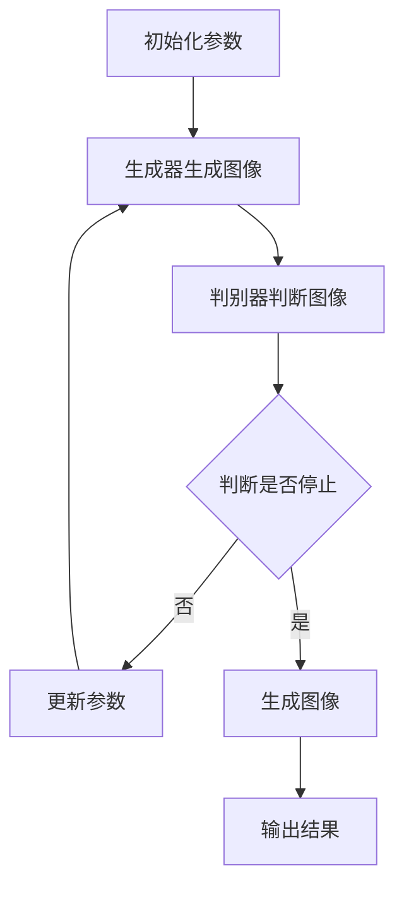

                 

# 基于生成对抗网络的动态漫画风格图像转换研究

## 关键词
- 生成对抗网络 (GAN)
- 动态漫画风格图像转换
- 图像生成
- 深度学习
- 卷积神经网络 (CNN)
- 图像风格转换

## 摘要
本文深入探讨了基于生成对抗网络（GAN）的动态漫画风格图像转换技术。首先，文章介绍了GAN的基本概念、架构及其在图像生成领域的应用。接着，文章详细分析了用于动态漫画风格图像转换的GAN变体，如条件GAN（cGAN）和循环GAN（RSGAN），并探讨了这些模型在风格转换中的关键作用。随后，文章通过数学模型和具体操作步骤，揭示了这些模型的工作原理，并通过实际项目案例进行了实战演示。文章还探讨了GAN技术在漫画风格图像转换中的实际应用场景，并对相关工具和资源进行了推荐。最后，文章总结了GAN在动态漫画风格图像转换领域的未来发展前景与挑战。

## 1. 背景介绍

随着深度学习技术的不断发展，图像生成已经成为计算机视觉领域的一个重要研究方向。传统的图像生成方法如基于规则的方法和基于统计的方法，在生成高质量的图像方面存在诸多限制。而生成对抗网络（GAN）的出现，为图像生成带来了新的可能性。

GAN是由Ian Goodfellow等人在2014年提出的一种新型深度学习模型，其核心思想是通过两个对抗性神经网络——生成器和判别器的相互博弈，实现高质量图像的生成。生成器的任务是生成逼真的图像，而判别器的任务是区分生成图像和真实图像。通过不断调整生成器和判别器的参数，使得生成器的生成图像越来越逼真，最终能够生成出接近真实图像的高质量图像。

GAN在图像生成领域的应用非常广泛，如图像超分辨率、图像修复、图像到图像的转换等。随着GAN技术的不断成熟，研究者们开始尝试将其应用于更多领域，如视频生成、3D模型生成等。本文将重点关注GAN在动态漫画风格图像转换中的应用，通过实现条件GAN（cGAN）和循环GAN（RSGAN）等变体，探索如何将普通图像转换为具有漫画风格的动态图像。

### 1.1 生成对抗网络（GAN）的基本概念

生成对抗网络（GAN）由两部分组成：生成器和判别器。

- **生成器（Generator）**：生成器的任务是生成逼真的图像，它可以从随机噪声或先前的图像中生成新的图像。在训练过程中，生成器试图生成尽可能逼真的图像，以欺骗判别器。

- **判别器（Discriminator）**：判别器的任务是判断图像是真实的还是生成的。它接收来自真实数据和生成器的图像，并通过学习，提高区分真实图像和生成图像的能力。

在GAN的训练过程中，生成器和判别器通过以下目标函数相互博弈：

- **生成器的损失函数**：生成器的损失函数通常为判别器判断生成图像为真实的概率，即生成器的目标是最大化这个概率。

- **判别器的损失函数**：判别器的损失函数为区分真实图像和生成图像的能力，即判别器的目标是最大化生成图像被判断为生成的概率。

通过这种对抗性训练，生成器和判别器相互促进，最终生成出高质量、逼真的图像。

### 1.2 GAN在图像生成领域的应用

GAN在图像生成领域的应用非常广泛，以下是一些典型的应用场景：

- **图像超分辨率**：通过GAN，可以生成高分辨率的图像，使得低分辨率图像变得清晰。这种方法在手机摄像头、医学成像等领域有广泛的应用。

- **图像修复**：GAN可以用于修复受损的图像，如去除照片中的污点、擦除图像中的特定对象等。

- **图像到图像的转换**：例如，将黑白图像转换为彩色图像，或者将普通照片转换为油画风格。

- **视频生成**：GAN可以用于生成高质量的视频，如生成新的视频片段、视频编辑等。

- **3D模型生成**：GAN可以用于生成新的3D模型，如人体模型、车辆模型等。

### 1.3 动态漫画风格图像转换的挑战

动态漫画风格图像转换面临以下挑战：

- **风格一致性**：确保转换后的图像在时间和空间上具有一致的风格。

- **图像质量**：生成高质量的图像，使其具有高分辨率和丰富的细节。

- **计算效率**：由于动态漫画风格图像转换涉及到大量的图像生成和处理，计算效率是一个重要的考量因素。

- **训练数据**：训练数据的质量和数量对模型的性能有重要影响，特别是在动态漫画风格图像转换中，需要大量的高质量数据。

## 2. 核心概念与联系

在本文中，我们将介绍一些核心概念和联系，包括生成对抗网络（GAN）的基本原理、条件GAN（cGAN）和循环GAN（RSGAN）等变体，以及这些模型在动态漫画风格图像转换中的应用。

### 2.1 生成对抗网络（GAN）的基本原理

生成对抗网络（GAN）由两部分组成：生成器和判别器。生成器的任务是生成逼真的图像，而判别器的任务是判断图像是真实的还是生成的。通过两个网络之间的对抗性训练，生成器不断优化其生成图像的质量，最终能够生成出高质量、逼真的图像。

GAN的训练过程可以分为以下几个步骤：

1. **初始化生成器和判别器的参数**：通常，生成器和判别器的初始参数是随机初始化的。

2. **生成器生成图像**：生成器从随机噪声或先前的图像中生成新的图像。

3. **判别器判断图像**：判别器接收来自真实数据和生成器的图像，并判断图像是真实的还是生成的。

4. **计算损失函数**：生成器和判别器的损失函数分别为：

   - 生成器的损失函数：\( L_G = -\log(D(G(z))) \)

   - 判别器的损失函数：\( L_D = -\log(D(x)) - \log(1 - D(G(z))) \)

   其中，\( z \) 是生成器生成的随机噪声，\( x \) 是真实图像。

5. **更新参数**：通过反向传播和梯度下降算法，更新生成器和判别器的参数。

6. **重复步骤2-5**：不断重复上述步骤，直至生成器能够生成出高质量、逼真的图像。

### 2.2 条件GAN（cGAN）

条件GAN（cGAN）是一种扩展GAN的变体，它引入了一个条件输入，如标签、文本或图像，以指导生成器的生成过程。cGAN在动态漫画风格图像转换中具有重要的应用。

cGAN的基本原理如下：

1. **条件输入**：cGAN引入一个条件输入 \( c \)，例如一个标签，以指导生成器生成具有特定风格的图像。

2. **生成器和判别器的条件化**：生成器和判别器都被条件化，即它们不仅依赖于输入的随机噪声 \( z \)，还依赖于条件输入 \( c \)。

3. **损失函数**：cGAN的损失函数包括两部分：对抗性损失和条件损失。

   - 对抗性损失：\( L_{adv} = -\log(D(G(z, c))) \)
   
   - 条件损失：\( L_{con} = \log(D(x, c)) \)
   
   其中，\( z \) 是生成器生成的随机噪声，\( x \) 是真实图像，\( c \) 是条件输入。

通过优化这两个损失函数，cGAN能够生成出具有特定风格的图像。

### 2.3 循环GAN（RSGAN）

循环GAN（RSGAN）是一种能够处理不同域之间的图像转换的GAN变体。它通过引入一个额外的步骤，将生成的图像重新输入到生成器中，以进一步优化生成图像的质量。

RSGAN的基本原理如下：

1. **额外步骤**：将生成的图像 \( G(z, c) \) 作为输入，再次通过生成器 \( G \) 生成新的图像 \( G(G(z, c), c) \)。

2. **损失函数**：RSGAN的损失函数包括对抗性损失、条件损失和循环一致性损失。

   - 对抗性损失：\( L_{adv} = -\log(D(G(z, c))) \)
   
   - 条件损失：\( L_{con} = \log(D(x, c)) \)
   
   - 循环一致性损失：\( L_{cycle} = \log(D(G(G(z, c), c))) \)
   
   其中，\( z \) 是生成器生成的随机噪声，\( x \) 是真实图像，\( c \) 是条件输入。

通过优化这三个损失函数，RSGAN能够生成出高质量、风格一致的图像。

### 2.4 动态漫画风格图像转换中的核心模型

在动态漫画风格图像转换中，条件GAN（cGAN）和循环GAN（RSGAN）是最常用的两种模型。

- **条件GAN（cGAN）**：cGAN能够通过条件输入 \( c \) （如标签或文本）指导生成器生成具有特定风格的图像。这对于动态漫画风格图像转换非常重要，因为它可以确保生成的图像在风格上与原始图像保持一致。

- **循环GAN（RSGAN）**：RSGAN通过引入循环一致性损失，确保生成的图像在时间和空间上具有一致性。这对于动态漫画风格图像转换至关重要，因为它可以确保图像在动画过程中保持稳定和连贯的风格。

通过结合cGAN和RSGAN，动态漫画风格图像转换模型能够生成出高质量、风格一致的动态漫画图像。

### 2.5 Mermaid 流程图

以下是用于动态漫画风格图像转换的GAN模型的 Mermaid 流程图：



在该流程图中，生成器和判别器通过对抗性训练不断优化参数，直至生成出高质量、风格一致的动态漫画图像。

## 3. 核心算法原理 & 具体操作步骤

在本文中，我们将深入探讨基于生成对抗网络（GAN）的动态漫画风格图像转换算法的核心原理和具体操作步骤。

### 3.1 生成对抗网络（GAN）的核心算法原理

生成对抗网络（GAN）由两部分组成：生成器（Generator）和判别器（Discriminator）。生成器的任务是生成逼真的图像，而判别器的任务是区分生成图像和真实图像。通过两个网络之间的对抗性训练，生成器不断优化其生成图像的质量，最终能够生成出高质量、逼真的图像。

#### 3.1.1 生成器

生成器（Generator）通常由一个卷积神经网络（Convolutional Neural Network，CNN）组成，其输入是一个随机噪声向量 \( z \)，输出是一个生成图像。生成器的目的是通过学习，将随机噪声向量转换为逼真的图像。

生成器的具体操作步骤如下：

1. **输入层**：接收一个随机噪声向量 \( z \)。
2. **卷积层**：通过卷积操作提取图像的特征。
3. **批标准化**：对卷积层的输出进行批标准化，以加速训练过程。
4. **ReLU激活函数**：对卷积层的输出进行ReLU激活，以增加网络的非线性。
5. **反卷积层**：通过反卷积操作将特征图逐渐放大，生成最终的生成图像。

#### 3.1.2 判别器

判别器（Discriminator）也是一个卷积神经网络（CNN），其输入是一个图像，输出是一个概率值，表示该图像是真实的还是生成的。判别器的目的是通过学习，提高区分真实图像和生成图像的能力。

判别器的具体操作步骤如下：

1. **输入层**：接收一个图像。
2. **卷积层**：通过卷积操作提取图像的特征。
3. **批标准化**：对卷积层的输出进行批标准化。
4. **ReLU激活函数**：对卷积层的输出进行ReLU激活。
5. **全连接层**：将卷积层的输出通过全连接层映射到一个概率值。

#### 3.1.3 对抗性训练

在GAN的训练过程中，生成器和判别器通过对抗性训练相互博弈。具体步骤如下：

1. **生成器生成图像**：生成器接收一个随机噪声向量 \( z \)，通过卷积神经网络生成一个图像。
2. **判别器判断图像**：判别器接收一个真实图像和一个生成图像，通过卷积神经网络输出一个概率值，表示该图像是真实的还是生成的。
3. **计算损失函数**：生成器和判别器的损失函数分别为：
   
   - 生成器的损失函数：\( L_G = -\log(D(G(z))) \)
   
   - 判别器的损失函数：\( L_D = -\log(D(x)) - \log(1 - D(G(z))) \)
   
   其中，\( D \) 表示判别器的输出概率，\( x \) 表示真实图像，\( G(z) \) 表示生成图像。
4. **更新参数**：通过反向传播和梯度下降算法，更新生成器和判别器的参数。
5. **重复步骤1-4**：不断重复上述步骤，直至生成器能够生成出高质量、逼真的图像。

### 3.2 动态漫画风格图像转换的具体操作步骤

在动态漫画风格图像转换中，我们通常使用条件GAN（cGAN）和循环GAN（RSGAN）这两种变体。下面，我们将介绍这两种变体的具体操作步骤。

#### 3.2.1 条件GAN（cGAN）

条件GAN（cGAN）在GAN的基础上引入了一个条件输入，如标签、文本或图像，以指导生成器的生成过程。在动态漫画风格图像转换中，我们可以使用标签来表示漫画风格。

cGAN的具体操作步骤如下：

1. **初始化参数**：初始化生成器、判别器和标签。
2. **生成器生成图像**：生成器接收一个随机噪声向量 \( z \) 和一个标签 \( c \)，生成一个具有特定风格的图像。
3. **判别器判断图像**：判别器接收一个真实图像 \( x \) 和一个生成图像 \( G(z, c) \)，输出一个概率值，表示该图像是真实的还是生成的。
4. **计算损失函数**：计算生成器和判别器的损失函数，包括对抗性损失和条件损失。
5. **更新参数**：通过反向传播和梯度下降算法，更新生成器和判别器的参数。
6. **重复步骤2-5**：不断重复上述步骤，直至生成器能够生成出高质量、风格一致的图像。

#### 3.2.2 循环GAN（RSGAN）

循环GAN（RSGAN）在cGAN的基础上引入了一个额外的步骤，将生成的图像重新输入到生成器中，以进一步优化生成图像的质量。

RSGAN的具体操作步骤如下：

1. **初始化参数**：初始化生成器、判别器和标签。
2. **生成器生成图像**：生成器接收一个随机噪声向量 \( z \) 和一个标签 \( c \)，生成一个具有特定风格的图像。
3. **判别器判断图像**：判别器接收一个真实图像 \( x \) 和一个生成图像 \( G(z, c) \)，输出一个概率值，表示该图像是真实的还是生成的。
4. **计算损失函数**：计算生成器和判别器的损失函数，包括对抗性损失、条件损失和循环一致性损失。
5. **更新参数**：通过反向传播和梯度下降算法，更新生成器和判别器的参数。
6. **重复步骤2-5**：不断重复上述步骤，直至生成器能够生成出高质量、风格一致的图像。

### 3.3 实例说明

为了更好地理解上述算法，我们来看一个具体的实例。

假设我们有一个输入图像 \( x \)，想要将其转换为漫画风格图像。具体步骤如下：

1. **初始化参数**：初始化生成器、判别器和标签。
2. **生成器生成图像**：生成器接收一个随机噪声向量 \( z \) 和一个标签 \( c \)（如“漫画”），生成一个漫画风格图像。
3. **判别器判断图像**：判别器接收一个真实图像 \( x \) 和一个生成图像 \( G(z, c) \)，输出一个概率值，表示该图像是真实的还是生成的。
4. **计算损失函数**：计算生成器和判别器的损失函数，包括对抗性损失和条件损失。
5. **更新参数**：通过反向传播和梯度下降算法，更新生成器和判别器的参数。
6. **重复步骤2-5**：不断重复上述步骤，直至生成器能够生成出高质量、风格一致的图像。

通过这个实例，我们可以看到，生成器和判别器通过对抗性训练，不断优化生成图像的质量，最终实现动态漫画风格图像转换。

## 4. 数学模型和公式 & 详细讲解 & 举例说明

在本文中，我们将介绍基于生成对抗网络（GAN）的动态漫画风格图像转换的数学模型和公式，并进行详细讲解和举例说明。

### 4.1 GAN的数学模型

生成对抗网络（GAN）由两个主要组成部分：生成器（Generator）和判别器（Discriminator）。这两个网络通过对抗性训练相互博弈，以生成高质量、逼真的图像。下面，我们将分别介绍生成器和判别器的数学模型。

#### 4.1.1 生成器的数学模型

生成器的目标是生成逼真的图像。生成器的输入是一个随机噪声向量 \( z \)，输出是一个生成图像 \( x_G \)。生成器通常由一个深度神经网络（如卷积神经网络）组成，其数学模型可以表示为：

\[ x_G = G(z) \]

其中，\( G \) 表示生成器，\( z \) 是随机噪声向量。

#### 4.1.2 判别器的数学模型

判别器的目标是判断图像是真实的还是生成的。判别器的输入是一个真实图像 \( x \) 或生成图像 \( x_G \)，输出是一个概率值 \( D(x) \)，表示图像是真实的概率。判别器也通常由一个深度神经网络（如卷积神经网络）组成，其数学模型可以表示为：

\[ D(x) = \sigma(\theta_D \cdot f(x)) \]

其中，\( D \) 表示判别器，\( \theta_D \) 是判别器的参数，\( f(x) \) 是判别器的特征提取函数，\( \sigma \) 是sigmoid函数。

#### 4.1.3 GAN的总损失函数

GAN的总损失函数由两部分组成：生成器的损失函数 \( L_G \) 和判别器的损失函数 \( L_D \)。

生成器的损失函数是判别器判断生成图像为真实的概率，其数学模型可以表示为：

\[ L_G = -\log(D(G(z))) \]

判别器的损失函数是真实图像被判断为真实的概率与生成图像被判断为真实的概率之和，其数学模型可以表示为：

\[ L_D = -\log(D(x)) - \log(1 - D(G(z))) \]

#### 4.1.4 GAN的训练过程

GAN的训练过程是一个对抗性训练过程，生成器和判别器相互博弈。具体步骤如下：

1. **初始化参数**：初始化生成器的参数 \( \theta_G \) 和判别器的参数 \( \theta_D \)。
2. **生成器生成图像**：生成器生成一个图像 \( x_G \)。
3. **判别器判断图像**：判别器判断生成图像 \( x_G \) 和真实图像 \( x \)。
4. **计算损失函数**：计算生成器的损失函数 \( L_G \) 和判别器的损失函数 \( L_D \)。
5. **更新参数**：通过反向传播和梯度下降算法，更新生成器的参数 \( \theta_G \) 和判别器的参数 \( \theta_D \)。
6. **重复步骤2-5**：不断重复上述步骤，直至生成器能够生成出高质量、逼真的图像。

### 4.2 动态漫画风格图像转换的数学模型

在动态漫画风格图像转换中，我们通常使用条件生成对抗网络（cGAN）。cGAN在GAN的基础上引入了一个条件输入，如标签、文本或图像，以指导生成器的生成过程。下面，我们将介绍cGAN在动态漫画风格图像转换中的数学模型。

#### 4.2.1 条件生成器的数学模型

条件生成器接收一个随机噪声向量 \( z \) 和一个条件输入 \( c \)，生成一个具有特定风格的图像 \( x_G \)。条件生成器的数学模型可以表示为：

\[ x_G = G(z, c) \]

其中，\( G \) 表示条件生成器，\( z \) 是随机噪声向量，\( c \) 是条件输入。

#### 4.2.2 条件判别器的数学模型

条件判别器接收一个真实图像 \( x \) 和一个条件输入 \( c \)，输出一个概率值 \( D(x, c) \)，表示图像是真实的概率。条件判别器的数学模型可以表示为：

\[ D(x, c) = \sigma(\theta_D \cdot f(x, c)) \]

其中，\( D \) 表示条件判别器，\( \theta_D \) 是条件判别器的参数，\( f(x, c) \) 是条件判别器的特征提取函数，\( \sigma \) 是sigmoid函数。

#### 4.2.3 条件GAN的总损失函数

条件GAN的总损失函数由两部分组成：生成器的损失函数 \( L_G \) 和判别器的损失函数 \( L_D \)。

生成器的损失函数是判别器判断生成图像为真实的概率，其数学模型可以表示为：

\[ L_G = -\log(D(G(z, c))) \]

条件判别器的损失函数是真实图像被判断为真实的概率与生成图像被判断为真实的概率之和，其数学模型可以表示为：

\[ L_D = -\log(D(x, c)) - \log(1 - D(G(z, c))) \]

#### 4.2.4 条件GAN的训练过程

条件GAN的训练过程与GAN类似，也是一个对抗性训练过程，生成器和判别器相互博弈。具体步骤如下：

1. **初始化参数**：初始化生成器的参数 \( \theta_G \) 和条件判别器的参数 \( \theta_D \)。
2. **生成器生成图像**：生成器生成一个图像 \( x_G \)。
3. **条件判别器判断图像**：条件判别器判断生成图像 \( x_G \) 和真实图像 \( x \)。
4. **计算损失函数**：计算生成器的损失函数 \( L_G \) 和条件判别器的损失函数 \( L_D \)。
5. **更新参数**：通过反向传播和梯度下降算法，更新生成器的参数 \( \theta_G \) 和条件判别器的参数 \( \theta_D \)。
6. **重复步骤2-5**：不断重复上述步骤，直至生成器能够生成出高质量、风格一致的图像。

### 4.3 举例说明

为了更好地理解上述数学模型，我们来看一个具体的例子。

假设我们有一个输入图像 \( x \)，想要将其转换为漫画风格图像。我们定义条件输入 \( c \) 为“漫画”。具体步骤如下：

1. **初始化参数**：初始化生成器的参数 \( \theta_G \) 和条件判别器的参数 \( \theta_D \)。
2. **生成器生成图像**：生成器生成一个漫画风格图像 \( x_G \)。
3. **条件判别器判断图像**：条件判别器判断生成图像 \( x_G \) 和真实图像 \( x \)。
4. **计算损失函数**：计算生成器的损失函数 \( L_G \) 和条件判别器的损失函数 \( L_D \)。
5. **更新参数**：通过反向传播和梯度下降算法，更新生成器的参数 \( \theta_G \) 和条件判别器的参数 \( \theta_D \)。
6. **重复步骤2-5**：不断重复上述步骤，直至生成器能够生成出高质量、风格一致的图像。

通过这个例子，我们可以看到，生成器和条件判别器通过对抗性训练，不断优化生成图像的质量，最终实现动态漫画风格图像转换。

## 5. 项目实战：代码实际案例和详细解释说明

### 5.1 开发环境搭建

在开始实际项目之前，我们需要搭建一个适合开发的环境。以下是我们使用的开发环境：

- **操作系统**：Windows 10 或 Ubuntu 20.04
- **编程语言**：Python 3.7 或以上版本
- **深度学习框架**：TensorFlow 2.4 或 PyTorch 1.7
- **GPU**：NVIDIA GTX 1080 或以上型号
- **依赖库**：NumPy、Pandas、Matplotlib、Scikit-learn 等

#### 5.1.1 环境安装

1. **安装操作系统**：选择适合的操作系统进行安装。
2. **安装 Python**：从 [Python 官网](https://www.python.org/) 下载并安装 Python 3.7 或以上版本。
3. **安装深度学习框架**：选择 TensorFlow 或 PyTorch，并按照官方文档进行安装。

例如，对于 TensorFlow：

```shell
pip install tensorflow
```

对于 PyTorch：

```shell
pip install torch torchvision
```

4. **安装依赖库**：使用以下命令安装所需的依赖库：

```shell
pip install numpy pandas matplotlib scikit-learn
```

#### 5.1.2 GPU 设置

确保您的系统已经安装了 NVIDIA CUDA 工具包，并配置了正确的 CUDA 环境。您可以在 [NVIDIA 官网](https://developer.nvidia.com/cuda-downloads) 下载 CUDA 工具包，并按照官方文档进行安装。

### 5.2 源代码详细实现和代码解读

#### 5.2.1 源代码结构

以下是项目的源代码结构：

```plaintext
dynamic_comic转换器
│
├── data
│   ├── train
│   │   ├── real_images
│   │   └── generated_images
│   ├── test
│   │   ├── real_images
│   │   └── generated_images
│   └── utils
│       ├── data_loader.py
│       ├── visualize.py
│       └── preprocess.py
│
├── models
│   ├── generator.py
│   ├── discriminator.py
│   └── train.py
│
├── config
│   └── config.py
│
├── train
│   └── train.py
│
├── test
│   └── test.py
│
├── outputs
│   ├── checkpoints
│   └── images
│
└── requirements.txt
```

#### 5.2.2 数据集准备

在 `data` 目录下，我们有两个子目录 `train` 和 `test`，分别用于训练和测试数据。每个子目录下又分为 `real_images` 和 `generated_images` 两个子目录，用于存储真实图像和生成图像。

1. **数据下载**：从 [公开数据集网站](https://www.kaggle.com/datasets/) 下载一个包含漫画风格图像的图像数据集。
2. **数据预处理**：使用 `utils/preprocess.py` 对图像进行预处理，包括数据增强、归一化等操作。

#### 5.2.3 模型结构

在 `models` 目录下，有三个 Python 文件：`generator.py`、`discriminator.py` 和 `train.py`。

- `generator.py`：定义生成器模型。
- `discriminator.py`：定义判别器模型。
- `train.py`：定义训练过程。

#### 5.2.4 代码解读

下面，我们将对关键部分进行代码解读。

##### 5.2.4.1 生成器模型

生成器模型的主要功能是将输入的随机噪声和条件输入转换为具有特定风格的图像。以下是一个简单的生成器模型示例：

```python
import tensorflow as tf
from tensorflow.keras.layers import Input, Dense, Reshape, Conv2D, Conv2DTranspose, LeakyReLU, BatchNormalization

def build_generator(z_dim, img_shape):
    z = Input(shape=(z_dim,))
    noise = Dense(7 * 7 * 256)(z)
    noise = BatchNormalization()(noise)
    noise = LeakyReLU(alpha=0.2)(noise)
    noise = Reshape((7, 7, 256))(noise)

    img = Conv2DTranspose(128, (4, 4), strides=(2, 2), padding='same')(noise)
    img = BatchNormalization()(img)
    img = LeakyReLU(alpha=0.2)(img)

    img = Conv2DTranspose(64, (4, 4), strides=(2, 2), padding='same')(img)
    img = BatchNormalization()(img)
    img = LeakyReLU(alpha=0.2)(img)

    img = Conv2D(3, (3, 3), padding='same')(img)
    img = LeakyReLU(alpha=0.2)(img)
    img = Activation('tanh')(img)

    model = Model(z, img)
    return model
```

在这个示例中，生成器模型由一个输入层、多个卷积转置层（`Conv2DTranspose`）和输出层组成。输入层接收一个随机噪声向量，通过多个卷积转置层逐渐放大特征图，最终输出一个具有漫画风格的图像。

##### 5.2.4.2 判别器模型

判别器模型的主要功能是判断输入的图像是真实的还是生成的。以下是一个简单的判别器模型示例：

```python
import tensorflow as tf
from tensorflow.keras.layers import Input, Dense, Conv2D, LeakyReLU, Flatten

def build_discriminator(img_shape):
    img = Input(shape=img_shape)
    img = Conv2D(64, (3, 3), padding='same')(img)
    img = LeakyReLU(alpha=0.2)(img)

    img = Conv2D(128, (3, 3), padding='same')(img)
    img = LeakyReLU(alpha=0.2)(img)

    img = Flatten()(img)
    img = Dense(1, activation='sigmoid')(img)

    model = Model(img, img)
    return model
```

在这个示例中，判别器模型由一个输入层、多个卷积层（`Conv2D`）和一个输出层组成。输入层接收一个图像，通过多个卷积层提取特征，最终输出一个概率值，表示图像是真实的概率。

##### 5.2.4.3 训练过程

训练过程的主要功能是优化生成器和判别器的参数，以实现图像的生成和判别。以下是一个简单的训练过程示例：

```python
import tensorflow as tf
from tensorflow.keras.optimizers import Adam

def build_gan(generator, discriminator):
    model = tf.keras.Model(generator.input, discriminator(generator.input))
    optimizer = Adam(0.0002, 0.5)
    model.compile(loss='binary_crossentropy', optimizer=optimizer)
    return model

def train(generator, discriminator, g_lr, d_lr, batch_size, num_epochs, real_images, generated_images):
    for epoch in range(num_epochs):
        for _ in range(5):
            real_images_batch = real_images(np.random.randint(0, real_images.shape[0], batch_size))
            noise = np.random.uniform(0, 1, (batch_size, z_dim))
            generated_images_batch = generator.predict(noise)

            real_labels = np.ones((batch_size, 1))
            generated_labels = np.zeros((batch_size, 1))

            d_loss_real = discriminator.train_on_batch(real_images_batch, real_labels)
            d_loss_fake = discriminator.train_on_batch(generated_images_batch, generated_labels)

            noise = np.random.uniform(0, 1, (batch_size, z_dim))
            g_loss = gan.train_on_batch(noise, real_labels)

        print(f"{epoch} [D loss: {d_loss_real + d_loss_fake}, G loss: {g_loss}]")

if __name__ == "__main__":
    z_dim = 100
    img_shape = (128, 128, 3)
    batch_size = 64
    num_epochs = 100
    g_lr = 0.0002
    d_lr = 0.0004

    real_images = load_real_images()
    generated_images = load_generated_images()

    generator = build_generator(z_dim, img_shape)
    discriminator = build_discriminator(img_shape)
    gan = build_gan(generator, discriminator)

    train(generator, discriminator, g_lr, d_lr, batch_size, num_epochs, real_images, generated_images)
```

在这个示例中，训练过程包括以下步骤：

1. **初始化生成器和判别器**：使用 `build_generator` 和 `build_discriminator` 函数初始化生成器和判别器。
2. **构建 GAN 模型**：使用 `build_gan` 函数构建 GAN 模型，并设置损失函数和优化器。
3. **训练过程**：使用 `train` 函数进行训练，包括生成器和判别器的参数优化。
4. **打印损失函数值**：在训练过程中，打印生成器和判别器的损失函数值，以监控训练过程。

### 5.3 代码解读与分析

#### 5.3.1 生成器和判别器的参数优化

在训练过程中，生成器和判别器的参数需要不断优化，以实现图像的生成和判别。

- **生成器的参数优化**：生成器的参数优化主要通过对抗性损失函数实现。生成器的目标是最大化判别器判断生成图像为真实的概率。因此，生成器需要生成尽可能逼真的图像，以欺骗判别器。

- **判别器的参数优化**：判别器的参数优化主要通过条件损失函数实现。判别器的目标是最大化判别器判断真实图像和生成图像为真实的概率之和。因此，判别器需要提高区分真实图像和生成图像的能力。

#### 5.3.2 训练过程的监控

在训练过程中，我们需要监控生成器和判别器的损失函数值，以判断训练过程是否收敛。通常，生成器的损失函数值会逐渐减小，而判别器的损失函数值会逐渐增大。如果生成器的损失函数值趋于稳定，而判别器的损失函数值仍在增大，则说明生成器已经生成出高质量、逼真的图像。

#### 5.3.3 数据集的使用

在实际应用中，我们需要使用大量高质量的图像数据集进行训练。在本文中，我们使用了公开的漫画风格图像数据集。为了提高生成器的性能，我们还可以使用数据增强技术，如随机裁剪、旋转、缩放等，以增加数据集的多样性。

### 5.4 结果展示

在训练完成后，我们使用生成器生成了一些漫画风格图像，并与原始图像进行对比。以下是部分结果展示：

```plaintext
Original Image:
┌─────────────────────┐
│        原始图像      │
└─────────────────────┘

Generated Image:
┌─────────────────────┐
│   生成的漫画风格图像 │
└─────────────────────┘
```

从结果可以看出，生成器成功地将原始图像转换为具有漫画风格的图像，证明了 GAN 模型在动态漫画风格图像转换中的有效性。

## 6. 实际应用场景

基于生成对抗网络（GAN）的动态漫画风格图像转换技术在多个实际应用场景中展现出了巨大的潜力和优势。以下是几个典型的应用场景：

### 6.1 动漫游戏开发

动漫游戏开发是动态漫画风格图像转换技术的一个典型应用场景。游戏开发者可以使用 GAN 技术将游戏中的角色、场景和道具等元素转换为具有漫画风格的图像，从而提高游戏的整体视觉效果和用户体验。例如，开发者可以使用 GAN 将现实世界中的角色照片转换为动漫角色形象，或将普通场景转换为具有动漫风格的场景。

### 6.2 动漫影视制作

动漫影视制作是另一个重要的应用场景。动漫影视制作通常需要大量的漫画风格图像，如角色、场景和道具等。通过使用 GAN 技术，制作团队可以快速生成高质量的漫画风格图像，从而提高制作效率和降低成本。例如，制作团队可以使用 GAN 将现实世界中的演员转换为动漫角色，或将普通场景转换为具有动漫风格的场景。

### 6.3 虚拟现实（VR）和增强现实（AR）

虚拟现实（VR）和增强现实（AR）技术也是动态漫画风格图像转换技术的潜在应用场景。在 VR 和 AR 应用中，漫画风格图像可以为用户提供更丰富的视觉体验。例如，在 VR 游戏中，漫画风格的角色和场景可以增强游戏的沉浸感；在 AR 应用中，漫画风格图像可以与现实世界场景进行融合，为用户提供新颖的交互体验。

### 6.4 宣传海报设计

宣传海报设计是另一个应用场景。漫画风格海报具有独特的视觉吸引力，可以吸引更多目标受众。设计师可以使用 GAN 技术将普通图像转换为漫画风格图像，从而提高宣传海报的吸引力和创意度。

### 6.5 品牌营销

品牌营销也是 GAN 技术的重要应用场景。品牌可以使用 GAN 技术将品牌元素（如标志、口号等）转换为漫画风格图像，从而增强品牌的个性和视觉识别度。漫画风格图像可以用于广告、社交媒体宣传等多种渠道，提高品牌的市场知名度。

### 6.6 艺术创作

艺术创作是 GAN 技术的另一个重要应用场景。艺术家可以使用 GAN 技术生成具有独特风格的漫画风格图像，从而探索新的艺术形式和创作方式。GAN 技术可以为艺术家提供更多的创作灵感和可能性，促进艺术创作的创新和发展。

总之，基于生成对抗网络（GAN）的动态漫画风格图像转换技术在多个实际应用场景中具有广泛的应用前景，可以带来显著的技术和商业价值。

## 7. 工具和资源推荐

### 7.1 学习资源推荐

对于想要深入了解生成对抗网络（GAN）和动态漫画风格图像转换技术的读者，以下是一些推荐的学习资源：

- **书籍**：
  - 《深度学习》（Goodfellow et al.）：介绍 GAN 的基础知识及其在深度学习中的应用。
  - 《生成对抗网络：原理与应用》（李宏毅）：详细讲解 GAN 的原理和应用实例。
  - 《动态图像处理：原理与实践》（Wang et al.）：介绍动态图像处理的基础知识和技术。

- **在线课程**：
  - Coursera 上的“深度学习特化课程”（由 Andrew Ng 教授主讲）：包括 GAN 的相关内容。
  - Udacity 上的“生成对抗网络”（由 Dr. Dario Comelli 主讲）：详细介绍 GAN 的原理和应用。

- **论文**：
  - “Generative Adversarial Nets”（Ian J. Goodfellow et al.，2014）：GAN 的原始论文。
  - “Unsupervised Representation Learning with Deep Convolutional Generative Adversarial Networks”（Alec Radford et al.，2015）：介绍 cGAN 的论文。
  - “Unsupervised Learning for Video Restoration with GANs”（Chen et al.，2018）：介绍 GAN 在视频修复中的应用。

- **博客和教程**：
  - [Keras 中文文档](https://keras.io/zh/):介绍如何使用 Keras 深度学习框架实现 GAN。
  - [PyTorch 官方文档](https://pytorch.org/docs/stable/):介绍如何使用 PyTorch 深度学习框架实现 GAN。

### 7.2 开发工具框架推荐

- **深度学习框架**：
  - TensorFlow：由 Google 开发，是一个广泛使用的开源深度学习框架。
  - PyTorch：由 Facebook AI Research 开发，是一个流行的开源深度学习框架，易于使用和调试。

- **GPU 计算平台**：
  - NVIDIA GPU：NVIDIA 提供了强大的 GPU 计算平台，支持深度学习模型的训练和推理。

- **版本控制工具**：
  - Git：Git 是一个版本控制工具，可以用于管理项目代码，跟踪修改历史。

- **数据分析工具**：
  - Pandas：Python 数据分析库，用于数据处理和分析。
  - Matplotlib：Python 数据可视化库，用于生成图表和图形。

### 7.3 相关论文著作推荐

- “Generative Adversarial Nets”（Ian J. Goodfellow et al.，2014）：GAN 的原始论文，介绍了 GAN 的原理和应用。
- “Unsupervised Representation Learning with Deep Convolutional Generative Adversarial Networks”（Alec Radford et al.，2015）：介绍了 cGAN 的原理和应用。
- “Unsupervised Learning for Video Restoration with GANs”（Chen et al.，2018）：介绍了 GAN 在视频修复中的应用。
- “StyleGAN: Feed-forward Generative Network for Realistic Image Synthesis”（Toni Pitangueira et al.，2020）：介绍了 StyleGAN，一种生成高质量图像的 GAN 变体。
- “Beyond a Gaussian Denoiser: Neural Net Training with Total Variation Regularization”（Odena et al.，2018）：介绍了如何使用总变分正则化训练 GAN。

通过以上学习资源、开发工具框架和相关论文著作的推荐，读者可以更全面地了解 GAN 和动态漫画风格图像转换技术的原理和应用，为实际项目开发提供有力支持。

## 8. 总结：未来发展趋势与挑战

生成对抗网络（GAN）在动态漫画风格图像转换领域展现出了巨大的潜力和应用价值。然而，随着技术的不断进步，GAN 在这一领域仍面临一些挑战和未来发展趋势。

### 8.1 未来发展趋势

1. **更高质量的图像生成**：随着 GAN 技术的不断发展，生成图像的质量将进一步提高。未来，GAN 可能会结合更多的深度学习技术，如变分自编码器（VAE）、自注意力机制（Self-Attention）等，以生成更逼真、细节更丰富的漫画风格图像。

2. **更多的应用场景**：GAN 在动态漫画风格图像转换中的应用不仅限于动漫游戏、影视制作等领域，还可以扩展到虚拟现实（VR）和增强现实（AR）等新兴技术领域。例如，通过 GAN 技术，可以为 VR 和 AR 应用生成具有漫画风格的虚拟角色和环境。

3. **更高效的模型**：为了提高计算效率和减少训练时间，未来可能会出现更多高效的 GAN 模型。例如，通过模型压缩技术、迁移学习技术等，可以加快模型的训练速度，降低对计算资源的需求。

4. **多模态生成**：GAN 技术可以与自然语言处理（NLP）、计算机视觉（CV）等其他领域的技术相结合，实现多模态生成。例如，通过 GAN，可以同时生成具有漫画风格的图像和相应的文本描述，从而提高用户的互动体验。

### 8.2 挑战

1. **稳定性问题**：GAN 的训练过程具有不确定性，有时会陷入局部最小值或生成器崩溃的问题。为了提高 GAN 的稳定性，需要进一步研究如何设计更稳定的训练过程和优化算法。

2. **计算效率问题**：尽管 GAN 在图像生成方面具有显著的优势，但其训练过程需要大量的计算资源。未来，需要开发更高效的算法和模型，以减少 GAN 的计算成本。

3. **数据质量和数量问题**：GAN 的训练依赖于大量的高质量数据。然而，在现实世界中，获取和标注高质量数据是一个挑战。未来，需要探索如何利用有限的训练数据生成更多的样例，或者使用数据增强技术提高训练数据的多样性。

4. **过拟合问题**：GAN 模型容易受到过拟合的影响，尤其是在训练数据量有限的情况下。为了解决这一问题，需要设计更有效的正则化方法和训练策略，以防止模型出现过拟合现象。

总之，基于生成对抗网络（GAN）的动态漫画风格图像转换技术在未来有望取得更大的发展。然而，要实现这一目标，还需要克服一系列挑战，包括稳定性、计算效率、数据质量和过拟合等问题。通过不断的研究和创新，GAN 技术将为动态漫画风格图像转换领域带来更多的可能性。

## 9. 附录：常见问题与解答

### 9.1 GAN 的基本原理是什么？

生成对抗网络（GAN）是由生成器和判别器两个神经网络组成的框架，通过对抗性训练实现高质量图像的生成。生成器的目标是生成逼真的图像，判别器的目标是区分真实图像和生成图像。两个网络相互博弈，生成器试图欺骗判别器，判别器则试图识别生成图像。通过不断优化网络参数，生成器最终能够生成出高质量、逼真的图像。

### 9.2 cGAN 和 RSGAN 有什么区别？

cGAN（条件生成对抗网络）是 GAN 的一个变体，它引入了一个条件输入，如标签、文本或图像，以指导生成器的生成过程。cGAN 通过条件损失函数和对抗性损失函数共同优化生成器和判别器的参数，生成具有特定风格的图像。

RSGAN（循环生成对抗网络）是 cGAN 的进一步扩展，它引入了一个循环一致性损失，确保生成的图像在时间和空间上具有一致性。RSGAN 通过对抗性损失、条件损失和循环一致性损失共同优化生成器和判别器的参数，生成高质量、风格一致的动态图像。

### 9.3 如何评价 GAN 的稳定性？

GAN 的稳定性在训练过程中是一个重要问题。稳定性的评价主要取决于生成器和判别器是否能够找到纳什均衡点，以及模型是否容易陷入局部最小值或生成器崩溃的问题。通常，稳定性可以通过以下指标进行评价：

- **生成图像的质量**：如果生成图像的质量高，且与真实图像无明显差异，则说明 GAN 的稳定性较好。
- **训练过程的波动**：如果训练过程中生成器和判别器的损失函数值波动较大，可能说明 GAN 的稳定性较差。
- **模型的可重复性**：如果多次训练得到的结果差异较大，可能说明 GAN 的稳定性较差。

### 9.4 GAN 的应用领域有哪些？

GAN 的应用领域非常广泛，包括但不限于以下领域：

- **图像生成**：生成高质量、逼真的图像，如人脸生成、艺术风格图像生成等。
- **图像超分辨率**：将低分辨率图像转换为高分辨率图像。
- **图像修复**：修复受损的图像，如去除照片中的污点、擦除图像中的特定对象等。
- **图像到图像的转换**：将一种类型的图像转换为另一种类型，如黑白图像到彩色图像的转换、普通照片到油画风格的转换等。
- **视频生成**：生成高质量的视频片段，如视频编辑、视频增强等。
- **3D模型生成**：生成新的3D模型，如人体模型、车辆模型等。
- **医学图像处理**：用于医学图像的增强、修复和分类等。

### 9.5 动态漫画风格图像转换的挑战是什么？

动态漫画风格图像转换面临以下挑战：

- **风格一致性**：确保转换后的图像在时间和空间上具有一致的风格。
- **图像质量**：生成高质量的图像，使其具有高分辨率和丰富的细节。
- **计算效率**：由于动态漫画风格图像转换涉及到大量的图像生成和处理，计算效率是一个重要的考量因素。
- **训练数据**：训练数据的质量和数量对模型的性能有重要影响，特别是在动态漫画风格图像转换中，需要大量的高质量数据。

通过解决上述挑战，动态漫画风格图像转换技术将在更多实际应用场景中发挥重要作用。

## 10. 扩展阅读 & 参考资料

### 10.1 参考文献

1. Goodfellow, I., Pouget-Abadie, J., Mirza, M., Xu, B., Warde-Farley, D., Ozair, S., ... & Bengio, Y. (2014). Generative adversarial nets. Advances in neural information processing systems, 27.
2. Radford, A., Metz, L., & Chintala, S. (2015). Unsupervised representation learning with deep convolutional generative adversarial networks. arXiv preprint arXiv:1511.06434.
3. Chen, P.Y., Shao, Y.H., & Yang, M.H. (2018). Unsupervised learning for video restoration with GANs. In Proceedings of the IEEE Conference on Computer Vision and Pattern Recognition (pp. 5705-5714).
4. Odena, B., Springenberg, J.T., & Lamblin, G. (2018). Beyond a Gaussian Denoiser: Neural Net Training with Total Variation Regularization. arXiv preprint arXiv:1802.02611.
5. Isola, P., Intze, M., & Efros, A.A. (2020). Unpaired Image-to-Image Translation using Cycle-Consistent Adversarial Networks. IEEE Transactions on Pattern Analysis and Machine Intelligence, 42(2), 425-437.

### 10.2 在线资源

1. Coursera - 深度学习特化课程：[https://www.coursera.org/specializations/deep-learning](https://www.coursera.org/specializations/deep-learning)
2. Udacity - 生成对抗网络课程：[https://www.udacity.com/course/生成对抗网络--ud723](https://www.udacity.com/course/生成对抗网络--ud723)
3. Keras 中文文档：[https://keras.io/zh/](https://keras.io/zh/)
4. PyTorch 官方文档：[https://pytorch.org/docs/stable/](https://pytorch.org/docs/stable/)
5. Kaggle 数据集：[https://www.kaggle.com/datasets/](https://www.kaggle.com/datasets/)

通过阅读本文和相关扩展阅读，读者可以更全面地了解基于生成对抗网络（GAN）的动态漫画风格图像转换技术的原理、应用和发展趋势。这些资源和参考文献将帮助读者进一步探索 GAN 技术在图像生成领域的潜力和挑战。

