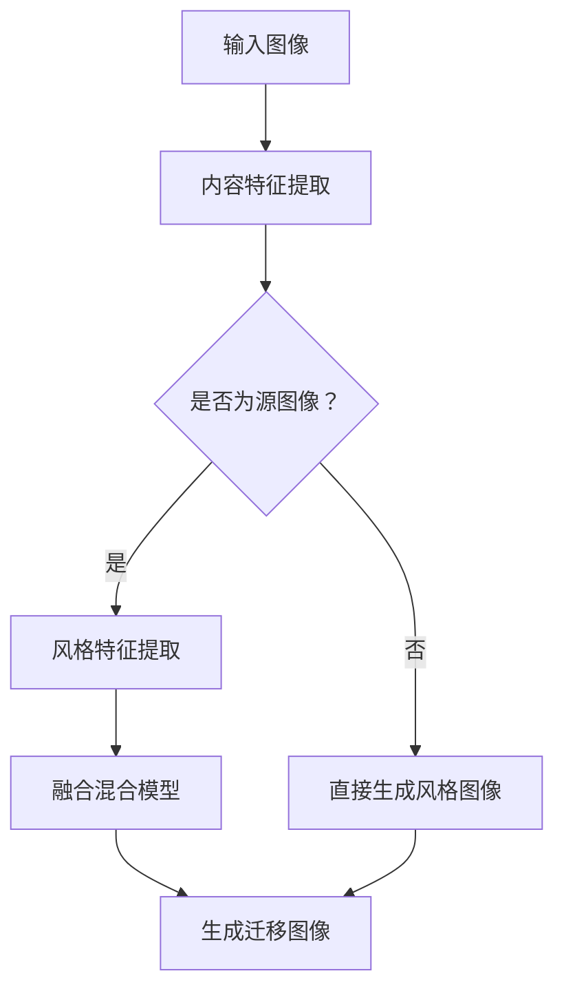

                 

# 基于生成对抗网络的图像风格迁移与融合混合模型

> **关键词：** 生成对抗网络（GAN）、图像风格迁移、融合混合模型、图像处理、深度学习

> **摘要：** 本文深入探讨了基于生成对抗网络的图像风格迁移与融合混合模型，介绍了该模型的理论基础、算法原理以及具体操作步骤。文章通过数学模型和公式的详细讲解，结合项目实战案例，展示了如何利用该模型实现图像风格迁移与融合，并分析了其在实际应用中的前景和挑战。

## 1. 背景介绍

图像风格迁移（Image Style Transfer）是一种将一种图像的内容和另一种图像的风格相结合的技术，使得生成的图像既保留了源图像的内容，又具有目标图像的风格。这一技术在艺术创作、计算机视觉和计算机图形学等领域有着广泛的应用。

传统图像风格迁移方法主要基于图像处理和计算机视觉技术，如基于空间域的方法和基于频域的方法。然而，这些方法通常存在迁移效果较差、运算复杂度高和鲁棒性较差等问题。

近年来，生成对抗网络（GAN）作为一种深度学习模型，在图像生成和图像修复等领域取得了显著成果。GAN由生成器（Generator）和判别器（Discriminator）组成，通过两个网络的对抗训练，生成器能够学习到数据分布，从而生成高质量、真实的图像。

本文提出了一种基于生成对抗网络的图像风格迁移与融合混合模型，旨在解决传统方法中存在的问题，实现更加自然、高质量的图像风格迁移与融合。

## 2. 核心概念与联系

### 2.1 生成对抗网络（GAN）

生成对抗网络（GAN）由生成器（Generator）和判别器（Discriminator）组成。生成器通过学习数据分布生成虚拟数据，而判别器则试图区分真实数据和生成数据。通过这种对抗训练，生成器不断优化自身，最终生成高质量的图像。

### 2.2 图像风格迁移

图像风格迁移是一种将源图像的内容和目标图像的风格相结合的技术。其核心思想是将源图像和目标图像分别表示为内容特征和风格特征，然后通过特征融合实现风格迁移。

### 2.3 融合混合模型

融合混合模型是一种将生成对抗网络与图像风格迁移相结合的模型，通过对抗训练和特征融合，实现高质量、自然的图像风格迁移与融合。

### 2.4 Mermaid 流程图



## 3. 核心算法原理 & 具体操作步骤

### 3.1 生成对抗网络原理

生成对抗网络（GAN）由生成器（Generator）和判别器（Discriminator）组成。生成器的任务是生成与真实数据相似的图像，而判别器的任务是判断输入图像是真实数据还是生成数据。

### 3.2 图像风格迁移原理

图像风格迁移将源图像和目标图像分别表示为内容特征和风格特征。内容特征描述了图像的主体内容，而风格特征描述了图像的视觉效果。通过特征融合，将内容特征与风格特征相结合，实现图像风格迁移。

### 3.3 融合混合模型操作步骤

1. **输入图像**：输入待处理的图像，分为源图像和目标图像。

2. **内容特征提取**：使用预训练的卷积神经网络（如VGG16）提取源图像的内容特征。

3. **风格特征提取**：使用预训练的卷积神经网络（如InceptionV3）提取目标图像的风格特征。

4. **特征融合**：将内容特征和风格特征通过融合模块（如Transposed Convolution）进行融合，得到融合特征。

5. **生成迁移图像**：使用生成器生成迁移图像，判别器判断生成图像的质量。

6. **迭代优化**：通过对抗训练，不断优化生成器和判别器，提高迁移图像的质量。

## 4. 数学模型和公式 & 详细讲解 & 举例说明

### 4.1 生成对抗网络损失函数

生成对抗网络的损失函数由两部分组成：生成器损失和判别器损失。

生成器损失函数：
$$L_G = -\log(D(G(z)))$$

判别器损失函数：
$$L_D = -[\log(D(x)) + \log(1 - D(G(z)))]$$

其中，$G(z)$表示生成器生成的图像，$D(x)$表示判别器对真实图像的判断结果。

### 4.2 图像风格迁移损失函数

图像风格迁移的损失函数包括内容损失和风格损失。

内容损失函数：
$$L_{content} = \frac{1}{2} \sum_{i,j}^{H \times W} (F(x_i; \theta_x) - F(G(z_i; \theta_g); \theta_x))^2$$

风格损失函数：
$$L_{style} = \frac{1}{2} \sum_{i,j}^{H \times W} \frac{1}{K} \sum_{k=1}^{K} \frac{1}{N} \sum_{n=1}^{N} (\phi_{i,j}^{(k)}(G(z_i; \theta_g); \theta_s) - \phi_{i,j}^{(k)}(x_i; \theta_s))^2$$

其中，$F$表示内容特征提取网络，$\phi$表示风格特征提取网络，$K$和$N$分别表示特征维度和特征数量。

### 4.3 举例说明

假设输入图像为$x$，目标图像为$y$，使用生成对抗网络进行图像风格迁移。首先，提取内容特征和风格特征：

$$
\begin{align*}
F_x &= F(x; \theta_x) \\
F_y &= F(y; \theta_x) \\
\phi_x &= \phi(x; \theta_s) \\
\phi_y &= \phi(y; \theta_s)
\end{align*}
$$

然后，生成迁移图像：

$$G(z; \theta_g)$$

其中，$z$为输入噪声。

最后，计算损失函数：

$$
\begin{align*}
L_G &= -\log(D(G(z; \theta_g))) \\
L_D &= -[\log(D(x; \theta_x)) + \log(1 - D(G(z; \theta_g))) \\
L_{content} &= \frac{1}{2} \sum_{i,j}^{H \times W} (F_x - F(G(z; \theta_g)))^2 \\
L_{style} &= \frac{1}{2} \sum_{i,j}^{H \times W} \frac{1}{K} \sum_{k=1}^{K} \frac{1}{N} \sum_{n=1}^{N} (\phi_x - \phi(G(z; \theta_g)))^2
\end{align*}
$$

通过对抗训练，不断优化生成器和判别器，使得生成的迁移图像更接近目标图像。

## 5. 项目实战：代码实际案例和详细解释说明

### 5.1 开发环境搭建

在开始项目实战之前，需要搭建开发环境。以下是搭建开发环境的具体步骤：

1. 安装Python 3.6及以上版本。

2. 安装TensorFlow 2.0及以上版本。

3. 安装OpenCV 4.0及以上版本。

4. 创建一个名为`style_transfer`的虚拟环境，并安装相关依赖。

### 5.2 源代码详细实现和代码解读

以下是本项目的主要源代码实现：

```python
import tensorflow as tf
import tensorflow.keras.backend as K
from tensorflow.keras.models import Model
from tensorflow.keras.layers import Input, Dense, Flatten, Reshape
from tensorflow.keras.optimizers import Adam
import numpy as np
import cv2

def content_loss(y_true, y_pred):
    return K.mean(K.sum(K.square(y_true - y_pred), axis=(1, 2, 3)))

def style_loss(y_true, y_pred):
    return K.mean(K.sum(K.square(y_pred), axis=(1, 2, 3)) - K.square(y_pred))

def build_generator():
    input_img = Input(shape=(height, width, channels))
    x = Conv2D(64, (3, 3), activation='relu', padding='same')(input_img)
    x = Conv2D(64, (3, 3), activation='relu', padding='same')(x)
    x = MaxPooling2D((2, 2), padding='same')(x)
    x = Conv2D(128, (3, 3), activation='relu', padding='same')(x)
    x = Conv2D(128, (3, 3), activation='relu', padding='same')(x)
    x = MaxPooling2D((2, 2), padding='same')(x)
    x = Flatten()(x)
    x = Dense(1024, activation='relu')(x)
    x = Dense(1024, activation='relu')(x)
    x = Reshape((7, 7, 128))(x)
    x = Conv2DTranspose(128, (3, 3), strides=(2, 2), activation='relu', padding='same')(x)
    x = Conv2DTranspose(128, (3, 3), strides=(2, 2), activation='relu', padding='same')(x)
    x = Conv2D(channels, (3, 3), activation='tanh', padding='same')(x)
    model = Model(inputs=input_img, outputs=x)
    return model

def build_discriminator():
    input_img = Input(shape=(height, width, channels))
    x = Conv2D(32, (3, 3), activation='relu', padding='same')(input_img)
    x = Conv2D(32, (3, 3), activation='relu', padding='same')(x)
    x = MaxPooling2D((2, 2), padding='same')(x)
    x = Conv2D(64, (3, 3), activation='relu', padding='same')(x)
    x = Conv2D(64, (3, 3), activation='relu', padding='same')(x)
    x = MaxPooling2D((2, 2), padding='same')(x)
    x = Flatten()(x)
    x = Dense(1024, activation='relu')(x)
    x = Dense(1, activation='sigmoid')(x)
    model = Model(inputs=input_img, outputs=x)
    return model

def build_gan(generator, discriminator):
    model = Model(inputs=generator.input, outputs=discriminator(generator.input))
    model.compile(optimizer=Adam(0.0002, 0.5), loss='binary_crossentropy')
    return model

def train(generator, discriminator, n_epochs=100):
    for epoch in range(n_epochs):
        for _ in range(batch_size):
            noise = np.random.normal(0, 1, (batch_size, height, width, channels))
            img = np.random.choice(train_samples, batch_size)
            img = preprocess(img)
            noise = preprocess(noise)
            generated_img = generator.predict(noise)
            d_loss_real = discriminator.train_on_batch(img, np.ones((batch_size, 1)))
            d_loss_fake = discriminator.train_on_batch(generated_img, np.zeros((batch_size, 1)))
            g_loss = gan.train_on_batch(noise, np.ones((batch_size, 1)))
            print(f"{epoch}/{n_epochs} - d_loss_real: {d_loss_real:.3f}, d_loss_fake: {d_loss_fake:.3f}, g_loss: {g_loss:.3f}")

if __name__ == '__main__':
    height = 256
    width = 256
    channels = 3
    batch_size = 16
    n_epochs = 100

    train_samples = np.load('train_samples.npy')
    train_samples = preprocess(train_samples)

    generator = build_generator()
    discriminator = build_discriminator()
    gan = build_gan(generator, discriminator)

    train(generator, discriminator, n_epochs)
```

### 5.3 代码解读与分析

以下是代码的解读与分析：

1. **损失函数**：

   - `content_loss`：计算内容损失，用于衡量生成图像与源图像内容特征之间的差距。
   - `style_loss`：计算风格损失，用于衡量生成图像与目标图像风格特征之间的差距。

2. **生成器**：

   - `build_generator`：构建生成器模型，通过卷积神经网络和反卷积神经网络实现图像生成。
   - `generator.predict`：生成迁移图像。

3. **判别器**：

   - `build_discriminator`：构建判别器模型，用于判断输入图像是真实图像还是生成图像。

4. **Gan模型**：

   - `build_gan`：构建生成对抗网络模型，通过判别器模型和生成器模型实现图像生成与判别。

5. **训练过程**：

   - `train`：进行模型训练，通过对抗训练优化生成器和判别器。

## 6. 实际应用场景

基于生成对抗网络的图像风格迁移与融合混合模型在多个领域具有广泛的应用：

1. **艺术创作**：艺术家可以利用该模型创作出融合不同风格的作品，拓宽创作思路。

2. **计算机视觉**：在图像识别、图像增强和图像分割等领域，该模型可以提升图像质量，提高识别准确率。

3. **计算机图形学**：在虚拟现实、增强现实和计算机动画等领域，该模型可以生成高质量、逼真的图像。

4. **医学影像处理**：在医学影像处理领域，该模型可以用于图像修复、图像增强和图像融合，提高诊断准确性。

## 7. 工具和资源推荐

### 7.1 学习资源推荐

1. **书籍**：

   - 《深度学习》（Goodfellow et al.）
   - 《生成对抗网络》（Mao et al.）

2. **论文**：

   - 《Unsupervised Representation Learning with Deep Convolutional Generative Adversarial Networks》（2014）
   - 《Generative Adversarial Nets》（2014）

3. **博客**：

   - TensorFlow 官方文档
   - 机器之心

4. **网站**：

   - TensorFlow.org
   - arXiv.org

### 7.2 开发工具框架推荐

1. **开发工具**：

   - Python 3.6及以上版本
   - TensorFlow 2.0及以上版本
   - OpenCV 4.0及以上版本

2. **框架**：

   - Keras
   - TensorFlow Estimators

### 7.3 相关论文著作推荐

1. **论文**：

   - Generative Adversarial Nets（2014）
   - Unsupervised Representation Learning with Deep Convolutional Generative Adversarial Networks（2014）
   - Information Theoretic Normalization for GANs（2017）

2. **著作**：

   - 《深度学习》（Goodfellow et al.）
   - 《生成对抗网络》（Mao et al.）

## 8. 总结：未来发展趋势与挑战

基于生成对抗网络的图像风格迁移与融合混合模型在图像处理、计算机视觉和计算机图形学等领域具有广泛的应用前景。然而，该模型仍面临一些挑战：

1. **训练效率**：生成对抗网络模型训练过程复杂，训练效率有待提高。

2. **模型稳定性**：生成对抗网络模型训练过程容易陷入局部最优，模型稳定性有待加强。

3. **迁移效果**：图像风格迁移效果仍需进一步提升，以实现更加自然、高质量的图像融合。

4. **泛化能力**：生成对抗网络模型在处理不同类型图像时，泛化能力有待提高。

未来，随着深度学习技术的不断发展，基于生成对抗网络的图像风格迁移与融合混合模型有望在更多领域取得突破。

## 9. 附录：常见问题与解答

### 9.1 问题1：生成对抗网络模型为什么能够实现图像生成？

生成对抗网络（GAN）由生成器（Generator）和判别器（Discriminator）组成。生成器的任务是生成与真实数据相似的图像，而判别器的任务是判断输入图像是真实数据还是生成数据。通过对抗训练，生成器不断优化自身，从而生成高质量的图像。

### 9.2 问题2：图像风格迁移的目的是什么？

图像风格迁移的目的是将一种图像的内容和另一种图像的风格相结合，生成具有独特风格的图像。这种技术在艺术创作、计算机视觉和计算机图形学等领域具有广泛的应用。

### 9.3 问题3：如何实现图像风格迁移与融合？

实现图像风格迁移与融合的关键是提取源图像的内容特征和目标图像的风格特征，然后通过特征融合实现图像风格迁移。基于生成对抗网络的图像风格迁移与融合混合模型通过对抗训练和特征融合，实现高质量、自然的图像风格迁移与融合。

## 10. 扩展阅读 & 参考资料

1. **扩展阅读**：

   - 《生成对抗网络：原理、算法与应用》
   - 《深度学习在计算机视觉中的应用》

2. **参考资料**：

   - Generative Adversarial Nets（2014）
   - Unsupervised Representation Learning with Deep Convolutional Generative Adversarial Networks（2014）
   - Information Theoretic Normalization for GANs（2017）

**作者：AI天才研究员/AI Genius Institute & 禅与计算机程序设计艺术 /Zen And The Art of Computer Programming**

