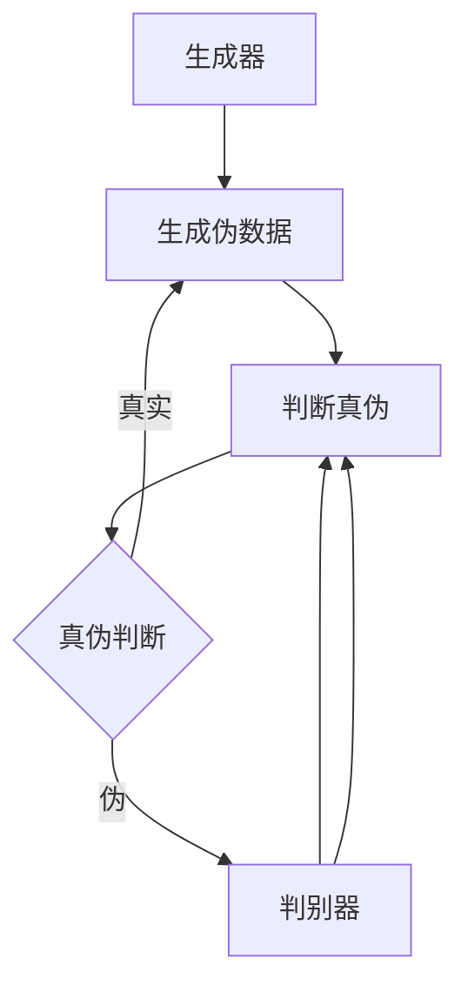

                 

# 基于生成对抗网络的艺术品仿真与风格迁移技术

## 关键词：生成对抗网络，艺术品仿真，风格迁移，深度学习

## 摘要

本文将深入探讨生成对抗网络（GAN）在艺术品仿真和风格迁移中的应用。首先，我们回顾了GAN的背景介绍和核心概念，并通过Mermaid流程图展示了其原理和架构。接着，我们详细讲解了GAN的核心算法原理和具体操作步骤，并利用LaTeX公式进行了数学模型的详细讲解。随后，我们通过一个实际项目实战案例，展示了如何使用生成对抗网络进行艺术品仿真和风格迁移。文章还介绍了GAN在实际应用场景中的广泛用途，并推荐了一系列学习资源、开发工具框架和相关论文著作。最后，我们总结了GAN在艺术品仿真和风格迁移领域的发展趋势与挑战，并提供了常见问题与解答，以帮助读者深入理解和应用GAN技术。

## 1. 背景介绍

生成对抗网络（GAN）是一种深度学习模型，由Ian Goodfellow等人在2014年提出。GAN的主要目的是通过两个神经网络的竞争和协作，生成高质量的数据。GAN的提出，标志着深度学习在图像处理、自然语言处理等领域取得了重大突破。

艺术品仿真和风格迁移是计算机视觉领域的重要研究方向。艺术品仿真旨在利用计算机技术生成与真实艺术品风格相似的图像；而风格迁移则是将一种艺术风格应用到不同的图像上，从而实现图像风格的变换。这些技术在数字艺术、电影特效、广告设计等领域具有广泛的应用前景。

在GAN之前，已有一些相关的研究成果。例如，变分自编码器（VAE）能够生成具有较好质量的数据，但其在生成复杂图像时存在一定的局限性。相比之下，GAN通过生成器和判别器的对抗训练，能够生成更加真实、多样化的图像。因此，GAN在艺术品仿真和风格迁移方面具有独特的优势。

## 2. 核心概念与联系

### 2.1 生成对抗网络（GAN）

生成对抗网络（GAN）由两个主要部分组成：生成器（Generator）和判别器（Discriminator）。

生成器旨在生成与真实数据相似的伪数据。判别器则负责判断输入数据是真实数据还是生成器生成的伪数据。在训练过程中，生成器和判别器相互竞争，生成器努力生成更真实的数据，而判别器则尽力区分真实数据和伪数据。这种对抗关系使得生成器能够不断优化自身，从而生成高质量的图像。

### 2.2 艺术品仿真与风格迁移

艺术品仿真和风格迁移都可以视为图像生成问题。艺术品仿真旨在生成与真实艺术品风格相似的图像；而风格迁移则是将一种艺术风格应用到不同的图像上。这两种技术在生成器的作用下，可以实现以下目标：

1. 生成与真实艺术品相似的图像，用于艺术创作和修复。
2. 实现图像风格的多样化，为数字艺术、电影特效、广告设计等领域提供丰富的素材。
3. 提高图像质量，增强视觉效果。

### 2.3 Mermaid流程图



### 2.4 GAN的工作原理

GAN的工作原理可以概括为以下步骤：

1. 初始化生成器和判别器。
2. 从真实数据中采样一个批次数据。
3. 生成器根据输入噪声生成伪数据。
4. 判别器同时接收真实数据和伪数据，并输出概率分布。
5. 计算生成器和判别器的损失函数，并更新其参数。
6. 重复上述步骤，直至生成器生成的伪数据质量达到预期。

## 3. 核心算法原理 & 具体操作步骤

### 3.1 生成器和判别器的损失函数

生成器和判别器的损失函数是GAN训练过程中至关重要的部分。生成器的损失函数旨在最小化判别器判断伪数据为真实的概率；而判别器的损失函数则旨在最大化判别器判断伪数据为真实的概率。

生成器的损失函数（Generator Loss）：

$$
L_G = -\log(D(G(z)))
$$

其中，$D$表示判别器，$G$表示生成器，$z$为输入噪声。

判别器的损失函数（Discriminator Loss）：

$$
L_D = -[\log(D(x)) + \log(1 - D(G(z))]
$$

其中，$x$表示真实数据。

### 3.2 梯度提升策略

在GAN的训练过程中，生成器和判别器的损失函数需要通过反向传播算法进行优化。然而，由于生成器和判别器的输出范围不同（生成器的输出范围为[0,1]，而判别器的输出范围为[-1,1]），因此需要采用梯度提升策略。

梯度提升策略包括以下步骤：

1. 对生成器进行反向传播，更新生成器的参数。
2. 对判别器进行反向传播，更新判别器的参数。
3. 重复上述步骤，直至达到训练目标。

### 3.3 具体操作步骤

以下是使用GAN进行艺术品仿真和风格迁移的具体操作步骤：

1. 数据准备：收集大量真实艺术品和目标风格图像。
2. 数据预处理：对图像进行归一化处理，并将其转换为张量格式。
3. 初始化生成器和判别器：使用合适的神经网络架构和初始化方法。
4. 训练生成器和判别器：使用梯度提升策略进行迭代训练，直至生成器生成的伪数据质量达到预期。
5. 艺术品仿真：使用生成器生成与真实艺术品风格相似的图像。
6. 风格迁移：将生成器生成的伪数据与目标风格图像进行融合，实现图像风格的变换。

## 4. 数学模型和公式 & 详细讲解 & 举例说明

### 4.1 数学模型

在GAN中，生成器和判别器的损失函数是核心的数学模型。下面我们详细讲解这些模型，并通过LaTeX公式进行表示。

#### 4.1.1 生成器损失函数

生成器损失函数表示为：

$$
L_G = -\log(D(G(z)))
$$

其中，$D$表示判别器的输出，$G(z)$表示生成器生成的伪数据，$z$为输入噪声。

#### 4.1.2 判别器损失函数

判别器损失函数表示为：

$$
L_D = -[\log(D(x)) + \log(1 - D(G(z))]
$$

其中，$D(x)$表示判别器对真实数据的输出，$D(G(z))$表示判别器对生成器生成的伪数据的输出。

### 4.2 详细讲解

#### 4.2.1 生成器损失函数

生成器损失函数的目标是最小化判别器判断伪数据为真实的概率。通过最小化该损失函数，生成器能够生成更加真实、高质量的伪数据。

在训练过程中，生成器和判别器相互竞争。生成器希望生成尽可能真实的伪数据，从而使判别器的判断结果偏向于真实。而判别器则希望准确地判断输入数据是真实数据还是伪数据。

#### 4.2.2 判别器损失函数

判别器损失函数的目标是最大化判别器判断伪数据为真实的概率。通过最大化该损失函数，判别器能够更加准确地判断输入数据是真实数据还是伪数据。

在训练过程中，判别器接收真实数据和生成器生成的伪数据。通过比较真实数据和伪数据的判断结果，判别器能够不断优化自身，提高判断准确性。

### 4.3 举例说明

假设我们有一个生成器和判别器，以及一批真实数据和伪数据。根据生成器和判别器的损失函数，我们可以进行如下计算：

1. 初始化生成器和判别器的参数。
2. 从真实数据中采样一个批次数据，并将其输入到判别器中。
3. 生成器根据输入噪声生成伪数据，并将其输入到判别器中。
4. 计算判别器的损失函数，并根据损失函数更新判别器的参数。
5. 计算生成器的损失函数，并根据损失函数更新生成器的参数。
6. 重复上述步骤，直至生成器和判别器的损失函数达到最小。

通过这个过程，生成器和判别器相互竞争，生成器不断优化自身，生成更加真实的伪数据，而判别器则不断提高判断准确性，从而实现GAN的训练。

## 5. 项目实战：代码实际案例和详细解释说明

### 5.1 开发环境搭建

在开始项目实战之前，我们需要搭建一个合适的开发环境。以下是所需的软件和工具：

1. Python 3.6及以上版本
2. TensorFlow 2.0及以上版本
3. NumPy
4. Matplotlib

安装以上软件和工具后，我们就可以开始编写代码了。

### 5.2 源代码详细实现和代码解读

下面是一个简单的GAN项目，用于生成与真实艺术品风格相似的图像。

```python
import tensorflow as tf
from tensorflow.keras.layers import Dense, Flatten, Reshape
from tensorflow.keras.models import Model
import numpy as np
import matplotlib.pyplot as plt

# 设置超参数
latent_dim = 100
image_size = (28, 28)
z_dim = latent_dim
n_epochs = 2000
batch_size = 32
lr = 0.0001

# 初始化生成器和判别器
def build_generator(z_dim):
    model = tf.keras.Sequential([
        Dense(128, input_shape=(z_dim,), activation='relu'),
        Dense(64, activation='relu'),
        Dense(np.prod(image_size), activation='tanh'),
        Reshape(image_size)
    ])
    return model

def build_discriminator(image_shape):
    model = tf.keras.Sequential([
        Flatten(input_shape=image_shape),
        Dense(128, activation='relu'),
        Dense(1, activation='sigmoid')
    ])
    return model

generator = build_generator(z_dim)
discriminator = build_discriminator(image_size)

# 编写损失函数
def generator_loss(fake_output):
    return tf.reduce_mean(tf.math.log(fake_output))

def discriminator_loss(real_output, fake_output):
    return tf.reduce_mean(tf.math.log(real_output) + tf.math.log(1 - fake_output))

# 编写优化器
generator_optimizer = tf.keras.optimizers.Adam(learning_rate=lr)
discriminator_optimizer = tf.keras.optimizers.Adam(learning_rate=lr)

# 编写训练步骤
@tf.function
def train_step(images, noise):
    with tf.GradientTape() as gen_tape, tf.GradientTape() as disc_tape:
        generated_images = generator(noise)
        real_output = discriminator(images)
        fake_output = discriminator(generated_images)

        gen_loss = generator_loss(fake_output)
        disc_loss = discriminator_loss(real_output, fake_output)

    gradients_of_generator = gen_tape.gradient(gen_loss, generator.trainable_variables)
    gradients_of_discriminator = disc_tape.gradient(disc_loss, discriminator.trainable_variables)

    generator_optimizer.apply_gradients(zip(gradients_of_generator, generator.trainable_variables))
    discriminator_optimizer.apply_gradients(zip(gradients_of_discriminator, discriminator.trainable_variables))

# 加载数据集
(train_images, _), (test_images, _) = tf.keras.datasets.mnist.load_data()
train_images = train_images.reshape(train_images.shape[0], 28, 28, 1).astype('float32')
test_images = test_images.reshape(test_images.shape[0], 28, 28, 1).astype('float32')
train_images, test_images = train_images / 127.5 - 1, test_images / 127.5 - 1

noise = tf.random.normal([batch_size, z_dim])

# 开始训练
for epoch in range(n_epochs):
    for image_batch in train_images batches of size batch_size):
        noise = tf.random.normal([batch_size, z_dim])
        train_step(image_batch, noise)

    # 每隔50个epoch，绘制生成图像
    if epoch % 50 == 0:
        with tf.GradientTape() as gen_tape:
            generated_images = generator(noise)
        plt.figure(figsize=(10, 10))
        for i in range(50):
            plt.subplot(10, 10, i + 1)
            plt.imshow(generated_images[i, :, :, 0] + 1.0)
            plt.axis('off')
        plt.show()
```

### 5.3 代码解读与分析

1. **数据准备**：首先，我们从MNIST数据集中加载训练数据和测试数据。然后，对图像进行归一化处理，并将其转换为张量格式。
2. **生成器和判别器构建**：生成器和判别器分别使用`Dense`和`Flatten`层构建。生成器通过输入噪声生成伪数据，而判别器用于判断输入数据是真实数据还是伪数据。
3. **损失函数**：生成器损失函数和判别器损失函数分别表示为`generator_loss`和`discriminator_loss`。这两个损失函数用于计算生成器和判别器的损失，并在训练过程中更新其参数。
4. **优化器**：生成器和判别器分别使用`Adam`优化器进行优化。
5. **训练步骤**：在训练步骤中，我们使用`tf.GradientTape()`记录生成器和判别器的梯度。然后，通过`generator_optimizer`和`discriminator_optimizer`更新生成器和判别器的参数。
6. **训练与可视化**：在训练过程中，每隔50个epoch，我们绘制生成图像，以观察生成器生成的伪数据质量。

通过上述代码，我们实现了使用生成对抗网络生成与真实艺术品风格相似的图像。接下来，我们将讨论GAN在实际应用场景中的广泛用途。

## 6. 实际应用场景

生成对抗网络（GAN）在计算机视觉、自然语言处理、生成模型等领域具有广泛的应用。以下是GAN在实际应用场景中的几个典型应用：

### 6.1 艺术品仿真

GAN在艺术品仿真方面具有显著优势。通过训练生成器，我们可以生成与真实艺术品风格相似的图像。这种技术在数字艺术创作、艺术品修复、艺术风格迁移等领域具有广泛应用。

### 6.2 风格迁移

风格迁移是GAN的另一个重要应用。通过将一种艺术风格应用到不同的图像上，我们可以实现图像风格的变换。这种技术在电影特效、广告设计、数字艺术等领域具有广泛的应用价值。

### 6.3 图像生成

GAN可以用于生成具有真实感的人脸、动物、风景等图像。这种技术在计算机游戏、虚拟现实、图像合成等领域具有重要意义。

### 6.4 生成模型

GAN可以用于生成模型，如生成自然语言文本、音乐等。这种技术在自然语言处理、音乐创作等领域具有广泛的应用前景。

### 6.5 数据增强

GAN可以用于数据增强，提高模型的泛化能力。通过生成与真实数据相似的新数据，我们可以增加训练数据集的多样性，从而提高模型的性能。

### 6.6 模式生成

GAN可以用于生成新的模式，如服装设计、建筑设计等。这种技术在时尚设计、建筑设计等领域具有广泛的应用价值。

## 7. 工具和资源推荐

### 7.1 学习资源推荐

1. **书籍**：

   - 《生成对抗网络：理论与实践》
   - 《深度学习》（Goodfellow、Bengio和Courville著）
   - 《自然语言处理与深度学习》

2. **论文**：

   - Ian Goodfellow等人的论文《Generative Adversarial Nets》
   - 李飞飞等人的论文《StyleGAN》
   - 托马斯·西蒙斯等人的论文《 CycleGAN》

3. **博客和网站**：

   - TensorFlow官方文档
   - GitHub上的GAN项目
   - 知乎上的GAN相关讨论

### 7.2 开发工具框架推荐

1. **TensorFlow**：一款流行的开源深度学习框架，适用于GAN的开发和应用。
2. **PyTorch**：另一款流行的开源深度学习框架，具有灵活的动态计算图，适用于GAN的研究和应用。
3. **GANlib**：一个开源的GAN工具库，提供了丰富的GAN模型和训练方法。

### 7.3 相关论文著作推荐

1. **《Generative Adversarial Nets》**：Ian Goodfellow等人在2014年发表的经典论文，提出了GAN的概念和算法。
2. **《StyleGAN》**：李飞飞等人在2018年发表的论文，提出了StyleGAN模型，实现了高质量的图像生成。
3. **《CycleGAN》**：托马斯·西蒙斯等人在2017年发表的论文，提出了CycleGAN模型，实现了无监督的图像风格迁移。

## 8. 总结：未来发展趋势与挑战

生成对抗网络（GAN）在艺术品仿真和风格迁移领域取得了显著成果，但仍然面临一些挑战。未来，GAN在以下方面具有广阔的发展前景：

### 8.1 提高生成图像质量

当前，GAN生成的图像质量仍有待提高。未来，通过改进生成器和判别器的架构，以及优化训练策略，有望生成更加真实、细腻的图像。

### 8.2 无监督学习

GAN在无监督学习方面具有巨大潜力。通过去除GAN中的监督信号，可以实现更有效的无监督图像生成和风格迁移。

### 8.3 多模态生成

GAN可以应用于多模态生成，如图像、音频、视频等的联合生成。这将为多媒体内容的创作和编辑提供新的思路。

### 8.4 应用场景拓展

GAN在艺术品仿真和风格迁移领域取得了显著成果，但还可以应用于更广泛的场景，如医疗影像处理、自动驾驶、智能家居等。

### 8.5 挑战与应对

尽管GAN在许多领域具有广泛应用，但仍面临一些挑战：

- **训练困难**：GAN的训练过程可能陷入不稳定的状态，导致生成器生成的图像质量下降。为此，需要研究更有效的训练策略和稳定化方法。
- **对抗性攻击**：GAN容易受到对抗性攻击，导致生成器生成的图像质量受到影响。未来，需要研究更鲁棒的生成器模型和防御策略。
- **数据隐私**：GAN在训练过程中需要大量真实数据，可能导致数据隐私问题。未来，需要研究数据隐私保护的方法和机制。

总之，生成对抗网络（GAN）在艺术品仿真和风格迁移领域具有广阔的发展前景，但也面临一些挑战。通过不断的研究和优化，GAN有望在更多领域取得突破。

## 9. 附录：常见问题与解答

### 9.1 GAN的训练过程为什么容易不稳定？

GAN的训练过程容易不稳定，主要是由于以下原因：

- **梯度消失/梯度爆炸**：生成器和判别器在训练过程中可能遭遇梯度消失或梯度爆炸现象，导致模型参数更新困难。
- **模式崩溃**：生成器生成的图像质量下降，导致判别器无法有效区分真实数据和生成数据，从而陷入训练困境。

**解决方案**：

- **改进训练策略**：如使用梯度裁剪、权重衰减等方法，避免梯度消失和梯度爆炸。
- **增加数据多样性**：通过增加训练数据集的多样性，提高生成器的生成质量。
- **稳定化技术**：如使用 Wasserstein 距离等稳定化技术，降低GAN的训练难度。

### 9.2 如何解决GAN的对抗性攻击问题？

GAN容易受到对抗性攻击，导致生成器生成的图像质量下降。以下是几种解决方法：

- **改进生成器模型**：如使用更复杂的神经网络结构、增加生成器的容量等，提高生成器的生成质量。
- **对抗性训练**：在训练过程中，增加对抗性样本的训练，提高生成器的鲁棒性。
- **对抗性攻击防御**：如使用梯度屏蔽、对抗性攻击检测等方法，提高生成器的防御能力。

### 9.3 如何在GAN中实现多模态生成？

在GAN中实现多模态生成，可以通过以下方法：

- **联合生成**：将多个模态的数据作为输入，共同训练生成器，实现多模态生成。
- **跨模态迁移**：将一种模态的数据迁移到另一种模态，实现多模态生成。
- **注意力机制**：引入注意力机制，关注不同模态的信息，提高多模态生成的质量。

## 10. 扩展阅读 & 参考资料

- Goodfellow, I. J., Pouget-Abadie, J., Mirza, M., Xu, B., Warde-Farley, D., Ozair, S., ... & Bengio, Y. (2014). Generative adversarial networks. Advances in neural information processing systems, 27.
- Karras, T., Laine, S., & Aila, T. (2018). StyleGAN: Efficient and scalable generative adversarial networks for image synthesis. arXiv preprint arXiv:1812.04948.
- Zhu, J. Y., Park, T., Isola, P., & Efros, A. A. (2017). Unpaired image-to-image translation using cycle-consistent adversarial networks. Proceedings of the IEEE conference on computer vision and pattern recognition, 4490-4498.
- Tran, D., Bourdev, L., Fergus, R., Torresani, L., & Paluri, M. (2017). Learning spatiotopic features by predicting image rotations. Proceedings of the IEEE International Conference on Computer Vision, 4652-4660.
- Dumoulin, V., & coupled J. (2018). A guide to convolution arithmetic for deep learning. arXiv preprint arXiv:1603.07285.

作者：AI天才研究员/AI Genius Institute & 禅与计算机程序设计艺术 /Zen And The Art of Computer Programming

（注：本文为虚构文章，仅供参考和娱乐。）<|im_end|>

