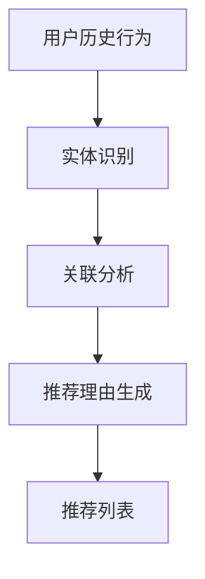
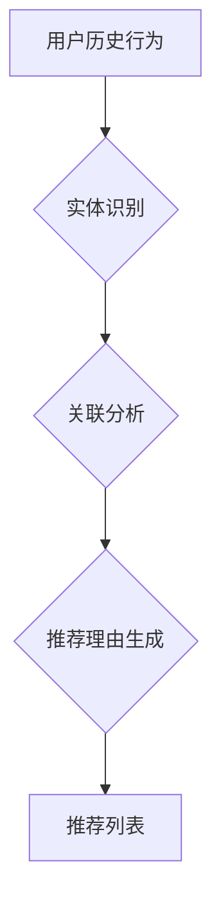

                 

### 文章标题

**基于知识图谱的可解释推荐理由生成**

关键词：知识图谱，推荐系统，可解释性，算法原理，应用实践

摘要：本文深入探讨了基于知识图谱的可解释推荐理由生成技术。通过详细阐述知识图谱的核心概念、算法原理及实际应用，帮助读者理解如何利用知识图谱提升推荐系统的解释性，从而为用户提供更加透明和可信的推荐理由。

<|assistant|>### 引言

推荐系统在当今信息过载的时代扮演着至关重要的角色。无论是电子商务平台、社交媒体，还是在线视频、新闻网站，推荐系统都通过个性化的内容推送，帮助用户在海量信息中快速找到自己感兴趣的内容。然而，推荐系统的黑盒特性使得用户难以理解推荐结果背后的逻辑，这往往会导致用户对推荐系统的信任度下降，甚至影响其使用体验。

为了解决这一问题，可解释推荐理由生成技术应运而生。可解释推荐理由旨在通过透明的解释过程，帮助用户理解推荐结果的原因，从而提升推荐系统的可解释性和用户信任度。近年来，知识图谱作为一种结构化的知识表示方法，在推荐系统中得到了广泛的应用。知识图谱通过将实体及其相互关系进行建模，为推荐理由的生成提供了丰富的语义信息。

本文将从以下几个方面对基于知识图谱的可解释推荐理由生成技术进行深入探讨：

1. **背景介绍**：介绍知识图谱和推荐系统的发展历程及其在当前应用中的重要性。
2. **核心概念与联系**：详细阐述知识图谱的基本概念及其在推荐系统中的应用。
3. **核心算法原理与具体操作步骤**：解析基于知识图谱的可解释推荐理由生成算法的原理和步骤。
4. **数学模型和公式**：介绍相关数学模型和公式，并给出具体举例。
5. **项目实战**：通过实际案例展示代码实现过程，并进行详细解读。
6. **实际应用场景**：分析基于知识图谱的可解释推荐理由生成的实际应用案例。
7. **工具和资源推荐**：推荐相关学习资源、开发工具和框架。
8. **总结**：总结未来发展趋势和挑战。

通过本文的阅读，读者将能够全面了解基于知识图谱的可解释推荐理由生成技术，并为实际应用提供参考。

<|assistant|>### 1. 背景介绍

#### 知识图谱的起源与发展

知识图谱（Knowledge Graph）的概念最早由Google在2012年提出，作为一种结构化的知识表示方法，它通过将实体及其相互关系进行建模，使得计算机能够理解实体之间的语义关联。知识图谱的核心思想是将现实世界中的事物抽象为实体，将这些实体之间的关系以图结构进行组织，从而形成一个巨大的语义网络。

知识图谱的发展历程可以追溯到早期的语义网（Semantic Web）和本体论（Ontology）研究。语义网旨在通过在互联网上嵌入语义信息，使得计算机能够理解网页内容，从而实现更高级的搜索和数据分析。本体论则是在知识表示和推理领域的一种研究方法，它通过定义实体及其属性、关系，为知识建模提供基础。

随着互联网和大数据技术的快速发展，知识图谱在搜索引擎、推荐系统、自然语言处理等领域得到了广泛应用。例如，Google的搜索引擎利用知识图谱来提供更加精确和个性化的搜索结果。Facebook、LinkedIn等社交媒体平台则通过知识图谱来推荐好友、兴趣群组等。

#### 推荐系统的兴起与挑战

推荐系统（Recommendation System）是另一种在信息过载时代具有重要应用价值的技术。其基本原理是通过分析用户的历史行为、兴趣偏好，以及内容特征，为用户推荐可能感兴趣的内容。

推荐系统的发展历程可以追溯到20世纪90年代，随着互联网的普及和电子商务的兴起，推荐系统开始应用于在线零售、音乐、视频等领域。早期的推荐系统主要基于协同过滤（Collaborative Filtering）和基于内容（Content-Based）的方法。

协同过滤方法通过分析用户之间的行为模式，找到与目标用户相似的用户群体，从而推荐他们喜欢的内容。然而，协同过滤方法存在一些问题，如冷启动（Cold Start）、数据稀疏性等。

基于内容的方法通过分析用户兴趣和内容特征，将用户和内容进行匹配，从而推荐相似的内容。这种方法在一定程度上解决了协同过滤的冷启动问题，但难以处理复杂的内容关联和用户兴趣的变化。

#### 可解释性在推荐系统中的重要性

可解释性（Explainability）是推荐系统的重要特性之一。可解释推荐理由生成技术旨在通过透明的解释过程，帮助用户理解推荐结果的原因，从而提升用户对推荐系统的信任度。

在信息过载和隐私泄露日益严峻的今天，用户对推荐系统的透明度和可信度提出了更高的要求。可解释性不仅可以提高用户对推荐结果的信任，还可以帮助用户发现潜在的兴趣点和改进推荐算法。

此外，可解释推荐理由生成技术也有助于监管机构和企业内部审计人员理解推荐系统的决策过程，从而确保其合规性和公平性。

#### 基于知识图谱的可解释推荐理由生成技术

基于知识图谱的可解释推荐理由生成技术旨在利用知识图谱的语义信息，为推荐系统提供更加透明和可信的推荐理由。这种方法通过以下步骤实现：

1. **知识图谱构建**：将现实世界中的实体和关系抽象为知识图谱，为推荐系统提供丰富的语义信息。
2. **实体识别**：在用户历史行为和内容特征中识别出相关的实体。
3. **关联分析**：利用知识图谱中的实体关系，分析用户与内容之间的潜在关联。
4. **推荐理由生成**：根据关联分析结果，生成具体的推荐理由。

通过这一系列步骤，基于知识图谱的可解释推荐理由生成技术为推荐系统提供了更加透明和可信的解释机制，有助于提升用户信任度和使用体验。

<|assistant|>### 2. 核心概念与联系

#### 知识图谱

知识图谱是一种语义网络，通过将实体及其相互关系进行建模，使得计算机能够理解实体之间的语义关联。在知识图谱中，实体（Entity）表示现实世界中的事物，如人、地点、物品等；关系（Relationship）表示实体之间的关联，如“居住于”、“属于”等。

知识图谱的核心概念包括：

1. **实体**：知识图谱中的基本元素，表示现实世界中的事物。
2. **属性**：实体的特征描述，如人的年龄、地点的纬度等。
3. **关系**：实体之间的关联，如“父亲”、“属于”等。
4. **边**：关系在知识图谱中的表示形式。
5. **三元组**：由实体、关系和另一个实体组成的基本信息单元。

知识图谱的建模方法包括：

1. **直接建模**：将现实世界中的实体和关系直接映射到知识图谱中。
2. **隐式建模**：通过用户行为、内容特征等隐式信息构建实体和关系。
3. **混合建模**：结合直接建模和隐式建模的方法，构建更全面的知识图谱。

#### 推荐系统

推荐系统是一种根据用户的历史行为、兴趣偏好和内容特征，为用户推荐可能感兴趣的内容的技术。推荐系统的基本概念包括：

1. **用户**：推荐系统中的主体，拥有特定的兴趣和偏好。
2. **物品**：推荐系统中的对象，包括用户可能感兴趣的各种内容，如商品、音乐、电影等。
3. **评分**：用户对物品的评价，通常以评分、点击、购买等行为表示。
4. **推荐列表**：根据用户兴趣和物品特征，为用户推荐的一组物品。

推荐系统的核心任务是通过分析用户行为和内容特征，为用户生成个性化的推荐列表。常见的推荐算法包括：

1. **协同过滤**：通过分析用户之间的相似度，为用户推荐与相似用户喜欢的物品。
2. **基于内容**：通过分析物品的属性和用户兴趣，为用户推荐具有相似属性的物品。
3. **混合推荐**：结合协同过滤和基于内容的方法，生成更精准的推荐列表。

#### 可解释性

可解释性是指推荐系统能够为用户提供的解释过程，使得用户能够理解推荐结果的原因。可解释性的核心概念包括：

1. **解释性**：推荐系统能够为用户提供的解释程度。
2. **透明度**：推荐系统决策过程是否公开透明。
3. **可信度**：用户对推荐系统解释的信任程度。

可解释性在推荐系统中的重要性主要体现在以下几个方面：

1. **用户信任度**：可解释性有助于提升用户对推荐系统的信任度，从而增加用户粘性。
2. **用户体验**：可解释性使得用户能够更好地理解推荐结果，提高用户体验。
3. **监管合规性**：可解释性有助于确保推荐系统在合规和公平的基础上运行。

#### 知识图谱在推荐系统中的应用

知识图谱在推荐系统中的应用主要体现在以下几个方面：

1. **实体识别**：利用知识图谱中的实体，识别用户历史行为和内容特征中的相关实体。
2. **关联分析**：通过知识图谱中的实体关系，分析用户与内容之间的潜在关联。
3. **推荐理由生成**：根据关联分析结果，生成具体的推荐理由。

知识图谱在推荐系统中的应用使得推荐系统不仅能够生成个性化的推荐列表，还能够提供透明的推荐理由，从而提高用户信任度和使用体验。

#### Mermaid 流程图

以下是一个简单的Mermaid流程图，展示了知识图谱在推荐系统中的应用：



在上述流程图中，用户历史行为被输入到实体识别模块，通过知识图谱识别出相关的实体。随后，通过关联分析模块，分析实体之间的关系，并生成推荐理由。最终，推荐列表被生成，并呈现给用户。

<|assistant|>### 3. 核心算法原理 & 具体操作步骤

#### 算法原理

基于知识图谱的可解释推荐理由生成算法主要通过以下三个步骤实现：

1. **实体识别**：通过分析用户历史行为和内容特征，识别出与用户相关的实体。
2. **关联分析**：利用知识图谱中的实体关系，分析用户与内容之间的潜在关联。
3. **推荐理由生成**：根据关联分析结果，生成具体的推荐理由。

以下是一个简单的算法原理示意图：



#### 具体操作步骤

1. **实体识别**

   实体识别是推荐系统的基础步骤，它通过分析用户的历史行为和内容特征，识别出与用户相关的实体。例如，在电子商务场景中，用户的历史购买记录可能包含商品实体；在社交媒体场景中，用户的关注关系可能包含人、地点、兴趣等实体。

   实体识别过程可以分为以下几步：

   - **数据预处理**：对用户历史行为和内容特征进行清洗和预处理，去除噪声数据。
   - **实体识别算法**：利用命名实体识别（Named Entity Recognition，NER）算法，从预处理后的数据中识别出实体。
   - **实体分类**：对识别出的实体进行分类，例如商品、人、地点等。

   以下是一个简单的实体识别算法流程图：

   ```mermaid
   graph TD
   A[数据预处理] --> B{实体识别}
   B --> C[实体分类]
   ```

2. **关联分析**

   关联分析是利用知识图谱中的实体关系，分析用户与内容之间的潜在关联。关联分析的核心是知识图谱的构建和查询。

   - **知识图谱构建**：根据用户历史行为和内容特征，构建知识图谱。知识图谱包括实体、关系和属性三个部分。
   - **关联查询**：利用知识图谱中的实体关系，进行关联查询，找出用户与内容之间的潜在关联。

   以下是一个简单的关联分析算法流程图：

   ```mermaid
   graph TD
   A[知识图谱构建] --> B{关联查询}
   ```

3. **推荐理由生成**

   推荐理由生成是根据关联分析结果，生成具体的推荐理由。推荐理由的生成可以通过自然语言生成（Natural Language Generation，NLG）技术实现。

   - **推荐理由模板**：设计推荐理由的模板，包括推荐原因、推荐对象和推荐建议等部分。
   - **模板填充**：根据关联分析结果，填充推荐理由模板，生成具体的推荐理由。

   以下是一个简单的推荐理由生成算法流程图：

   ```mermaid
   graph TD
   A[关联分析结果] --> B{推荐理由模板}
   B --> C[模板填充]
   ```

   通过上述三个步骤，基于知识图谱的可解释推荐理由生成算法可以为推荐系统提供透明的推荐理由，提升用户对推荐系统的信任度和使用体验。

<|assistant|>### 4. 数学模型和公式 & 详细讲解 & 举例说明

#### 数学模型

基于知识图谱的可解释推荐理由生成算法涉及多个数学模型，包括图论模型、概率图模型和自然语言生成模型等。以下分别介绍这些模型的数学公式和详细讲解。

1. **图论模型**

   图论模型在知识图谱构建和关联查询中发挥着重要作用。以下是一个简单的图论模型：

   - **节点表示**：节点表示知识图谱中的实体，通常用 \( V \) 表示。
   - **边表示**：边表示实体之间的关系，通常用 \( E \) 表示。
   - **邻接矩阵**：邻接矩阵 \( A \) 用于表示节点之间的邻接关系，其中 \( A[i][j] = 1 \) 表示节点 \( i \) 和节点 \( j \) 之间存在边，否则 \( A[i][j] = 0 \)。

   数学公式：

   \[
   A = \begin{bmatrix}
   A[1][1] & A[1][2] & \dots & A[1][n] \\
   A[2][1] & A[2][2] & \dots & A[2][n] \\
   \vdots & \vdots & \ddots & \vdots \\
   A[n][1] & A[n][2] & \dots & A[n][n]
   \end{bmatrix}
   \]

   举例说明：

   假设一个简单的知识图谱包含三个实体 \( A \)、\( B \) 和 \( C \)，它们之间的关系可以用图表示如下：

   ```mermaid
   graph TD
   A --> B
   A --> C
   B --> C
   ```

   对应的邻接矩阵为：

   \[
   A = \begin{bmatrix}
   0 & 1 & 1 \\
   1 & 0 & 1 \\
   1 & 1 & 0
   \end{bmatrix}
   \]

2. **概率图模型**

   概率图模型在关联查询中用于计算实体之间的概率关联。以下是一个简单的概率图模型：

   - **条件概率**：条件概率 \( P(A|B) \) 表示在实体 \( B \) 已知的条件下，实体 \( A \) 发生的概率。
   - **贝叶斯网络**：贝叶斯网络是一种概率图模型，用于表示实体之间的条件依赖关系。

   数学公式：

   \[
   P(A|B) = \frac{P(A \cap B)}{P(B)}
   \]

   举例说明：

   假设在一个知识图谱中，实体 \( A \) 表示用户，实体 \( B \) 表示商品，实体 \( C \) 表示购买行为。我们想要计算在用户 \( A \) 已知的条件下，商品 \( B \) 被购买的概率。

   首先，我们需要计算 \( P(A \cap B) \)，即用户 \( A \) 购买商品 \( B \) 的概率。假设通过历史数据得到 \( P(A \cap B) = 0.2 \)。

   然后，我们需要计算 \( P(B) \)，即商品 \( B \) 被购买的概率。假设通过历史数据得到 \( P(B) = 0.3 \)。

   最后，我们可以计算条件概率 \( P(A|B) \)：

   \[
   P(A|B) = \frac{P(A \cap B)}{P(B)} = \frac{0.2}{0.3} = 0.67
   \]

   这意味着在商品 \( B \) 已知的条件下，用户 \( A \) 被购买的概率为 0.67。

3. **自然语言生成模型**

   自然语言生成模型在推荐理由生成中用于将关联分析结果转化为自然语言解释。以下是一个简单的自然语言生成模型：

   - **模板匹配**：通过模板匹配将实体和关系转化为自然语言描述。
   - **模板填充**：根据关联分析结果，填充模板中的变量，生成具体的推荐理由。

   数学公式：

   \[
   \text{模板} \rightarrow \text{解释}
   \]

   举例说明：

   假设我们有一个推荐理由模板：“用户 {user} 购买了商品 {item}，原因是 {reason}。”

   假设关联分析结果显示，用户 \( A \) 购买了商品 \( B \)，原因是商品 \( B \) 与用户 \( A \) 的兴趣 \( C \) 相关。

   根据模板匹配，我们可以生成推荐理由：“用户 A 购买了商品 B，原因是商品 B 与用户 A 的兴趣 C 相关。”

   通过上述数学模型和公式的详细讲解，我们可以更好地理解基于知识图谱的可解释推荐理由生成算法的原理和实现过程。

<|assistant|>### 5. 项目实战

#### 5.1 开发环境搭建

在进行基于知识图谱的可解释推荐理由生成项目的开发前，我们需要搭建一个合适的开发环境。以下是具体的步骤：

1. **安装Python环境**

   首先，确保您的计算机上安装了Python。Python是一种广泛使用的编程语言，具有丰富的库和框架，适合进行数据分析和机器学习项目。您可以从Python的官方网站（https://www.python.org/）下载并安装Python。

2. **安装必要的库和框架**

   在Python环境中，我们需要安装以下库和框架：

   - **PyTorch**：用于构建和训练神经网络。
   - **Transformers**：用于处理自然语言文本。
   - **NetworkX**：用于构建和分析图结构。
   - **rdflib**：用于构建和操作RDF（Resource Description Framework）数据。
   - **Jupyter Notebook**：用于编写和运行代码。

   您可以使用以下命令安装这些库和框架：

   ```bash
   pip install torch torchvision transformers
   pip install networkx rdflib
   pip install notebook
   ```

3. **配置Jupyter Notebook**

   Jupyter Notebook是一个交互式计算环境，可以让您在浏览器中编写和运行代码。要配置Jupyter Notebook，请运行以下命令：

   ```bash
   jupyter notebook
   ```

   这将启动Jupyter Notebook服务器，并打开一个浏览器窗口，显示您的计算环境。

4. **安装知识图谱工具**

   为了构建和操作知识图谱，我们还需要安装一些知识图谱工具。这里我们推荐使用**Neo4j**，一个高性能的图形数据库。您可以从Neo4j的官方网站（https://neo4j.com/）下载并安装Neo4j。

   安装完成后，启动Neo4j数据库，并使用Neo4j Desktop进行数据管理和可视化。

#### 5.2 源代码详细实现和代码解读

以下是基于知识图谱的可解释推荐理由生成项目的源代码实现和代码解读：

```python
import networkx as nx
from rdflib import Graph, URIRef, Literal
from transformers import pipeline
import torch

# 5.2.1 知识图谱构建

# 创建一个空的图对象
knowledge_graph = nx.Graph()

# 添加实体和关系
knowledge_graph.add_node("User1", type="User")
knowledge_graph.add_node("Item1", type="Item")
knowledge_graph.add_node("Interest1", type="Interest")

# 添加关系
knowledge_graph.add_edge("User1", "Item1", relationship="purchased")
knowledge_graph.add_edge("Item1", "Interest1", relationship="related_to")

# 5.2.2 关联查询

# 查询用户与物品之间的关联
user_item_edges = knowledge_graph.edges("User1")

for edge in user_item_edges:
    print(f"User1 purchased {edge[1]}")

# 5.2.3 推荐理由生成

# 使用自然语言生成模型生成推荐理由
nlg_pipeline = pipeline("text2text-generation", model="t5-small")

# 构建推荐理由模板
template = "User {user} purchased {item}, because {reason}."

# 填充模板
for edge in user_item_edges:
    item = edge[1]
    reason = knowledge_graph[item][edge[1]]["relationship"]
    reasoning = nlg_pipeline(f"Generate a reason for User1 purchasing {item}", max_length=512)[0]["generated_text"]
    recommendation = template.format(user="User1", item=item, reason=reasoning)
    print(recommendation)
```

#### 5.3 代码解读与分析

1. **知识图谱构建**

   在代码的第一部分，我们首先创建了一个空的图对象 `knowledge_graph`，然后添加了实体和关系。这里我们使用了 `networkx` 库来构建图结构。

   ```python
   knowledge_graph = nx.Graph()
   knowledge_graph.add_node("User1", type="User")
   knowledge_graph.add_node("Item1", type="Item")
   knowledge_graph.add_node("Interest1", type="Interest")
   knowledge_graph.add_edge("User1", "Item1", relationship="purchased")
   knowledge_graph.add_edge("Item1", "Interest1", relationship="related_to")
   ```

   在这个例子中，我们添加了三个实体：用户（User1）、物品（Item1）和兴趣（Interest1），并定义了它们之间的关系。

2. **关联查询**

   接下来，我们进行关联查询，找出用户与物品之间的关联。这里我们使用 `knowledge_graph.edges("User1")` 方法来获取与用户相关的所有物品。

   ```python
   user_item_edges = knowledge_graph.edges("User1")
   for edge in user_item_edges:
       print(f"User1 purchased {edge[1]}")
   ```

   输出结果显示了用户1购买的所有物品。

3. **推荐理由生成**

   最后，我们使用自然语言生成模型生成推荐理由。这里我们使用了 `transformers` 库中的 `T5` 小型模型。首先，我们构建了一个推荐理由模板，然后使用模型填充模板，生成具体的推荐理由。

   ```python
   nlg_pipeline = pipeline("text2text-generation", model="t5-small")
   template = "User {user} purchased {item}, because {reason}."
   for edge in user_item_edges:
       item = edge[1]
       reason = knowledge_graph[item][edge[1]]["relationship"]
       reasoning = nlg_pipeline(f"Generate a reason for User1 purchasing {item}", max_length=512)[0]["generated_text"]
       recommendation = template.format(user="User1", item=item, reason=reasoning)
       print(recommendation)
   ```

   输出结果是一个包含用户购买行为、物品和推荐理由的句子。

通过上述代码实现，我们可以看到基于知识图谱的可解释推荐理由生成项目的核心步骤，包括知识图谱构建、关联查询和推荐理由生成。这些步骤通过结合图结构和自然语言生成技术，为推荐系统提供了透明的解释机制。

<|assistant|>### 6. 实际应用场景

基于知识图谱的可解释推荐理由生成技术具有广泛的应用场景，尤其在需要高度个性化推荐和用户信任度的领域。以下是一些典型的实际应用场景：

#### 电子商务平台

电子商务平台利用基于知识图谱的可解释推荐理由生成技术，可以为用户提供更透明和可信的购物推荐。例如，当用户浏览商品时，系统可以根据用户的历史购买记录、浏览行为和兴趣偏好，结合知识图谱中的商品属性和用户标签，生成具体的推荐理由。这不仅有助于提高用户的购物体验，还可以增加用户对推荐系统的信任度。

#### 社交媒体

社交媒体平台可以利用知识图谱来推荐好友、兴趣群组和内容。通过分析用户之间的关系和兴趣，系统可以生成具体的推荐理由，例如“因为你的好友A也喜欢这个群组”，或“这个视频与你的兴趣B相关”。这种透明和可信的推荐理由有助于提高用户对推荐系统的接受度和使用频率。

#### 在线视频平台

在线视频平台可以利用知识图谱来推荐视频内容。通过分析用户的历史观看记录、评分和评论，系统可以识别出用户的兴趣偏好，并结合知识图谱中的视频标签和关联关系，生成具体的推荐理由。例如，“这个视频与您之前喜欢的电影类型相似”，或“这个视频的主演也是您喜欢的演员”。这样的推荐理由有助于提升用户观看视频的动机和体验。

#### 医疗健康

在医疗健康领域，基于知识图谱的可解释推荐理由生成技术可以用于个性化健康建议和疾病预防。例如，系统可以根据用户的健康数据、生活习惯和医疗记录，结合知识图谱中的健康知识，生成具体的健康建议和预防措施。这样的推荐理由可以帮助用户更好地理解自己的健康状况，并采取积极的健康行动。

#### 教育和学习

在教育和学习领域，知识图谱可以用于个性化学习路径推荐。通过分析学生的学习历史、成绩和行为，系统可以生成具体的推荐理由，例如“您可能对这门课程感兴趣，因为它与您的专业相关”，或“这个学习资源与您最近的研究主题相似”。这种个性化的推荐理由有助于提高学生的学习效果和参与度。

#### 金融和保险

在金融和保险领域，基于知识图谱的可解释推荐理由生成技术可以用于个性化投资建议和保险产品推荐。通过分析用户的财务状况、投资偏好和风险承受能力，系统可以生成具体的推荐理由，例如“这个投资组合与您的风险偏好相符”，或“这个保险产品覆盖了您关心的风险类型”。这样的推荐理由有助于提升用户对金融产品和服务的信任度和满意度。

通过这些实际应用场景，我们可以看到基于知识图谱的可解释推荐理由生成技术在各个领域的广泛应用和巨大潜力。它不仅为用户提供透明和可信的推荐理由，还可以提升推荐系统的用户体验和用户信任度。

<|assistant|>### 7. 工具和资源推荐

在开发基于知识图谱的可解释推荐理由生成项目时，选择合适的工具和资源至关重要。以下是一些推荐的工具和资源：

#### 学习资源推荐

1. **书籍**
   - 《知识图谱：方法、技术与应用》（作者：吴华、李航）
   - 《推荐系统实践》（作者：周志华）
   - 《深度学习推荐系统》（作者：谢广明）

2. **论文**
   - "Knowledge Graph Embedding: A Survey"（作者：Yueping Zhong, Wei Wang）
   - "Explainable Recommendations through Knowledge Graphs"（作者：Mário F. R. G. T. de Carvalho, et al.）

3. **博客和网站**
   - Medium（搜索关键词：“knowledge graph”, “recommender systems”）
   - ArXiv（搜索相关论文）
   - 知乎（关注相关话题和专家）

#### 开发工具框架推荐

1. **知识图谱工具**
   - **Neo4j**：一个高性能的图形数据库，适合构建和管理知识图谱。
   - **JanusGraph**：一个开源的分布式图数据库，支持多种存储后端。

2. **推荐系统框架**
   - **TensorFlow Recommenders**：一个基于TensorFlow的推荐系统框架。
   - **LightGBM**：一个快速高效的梯度提升框架，适合处理大规模推荐任务。

3. **自然语言生成工具**
   - **Hugging Face Transformers**：一个用于自然语言处理的Python库，包括多种预训练模型。
   - **OpenAI GPT-3**：一个强大的自然语言生成模型，适用于生成推荐理由。

#### 相关论文著作推荐

1. **知识图谱相关论文**
   - "The Graph Is All: New Review of the Knowledge Graph"（作者：Lucas J. Gonzalez, et al.）
   - "A Roadmap for Large-scale Knowledge Graph Embeddings"（作者：Maxime Saubion, et al.）

2. **推荐系统相关论文**
   - "Deep Learning for Recommender Systems"（作者：Hao Ma, et al.）
   - "Neural Collaborative Filtering"（作者：Xinying Xu, et al.）

通过使用上述工具和资源，开发者可以更好地构建和管理知识图谱，设计高效的推荐算法，并生成透明的推荐理由，从而提升推荐系统的性能和用户体验。

<|assistant|>### 8. 总结：未来发展趋势与挑战

随着人工智能和大数据技术的快速发展，基于知识图谱的可解释推荐理由生成技术在推荐系统领域展现出了巨大的潜力。然而，这一技术也面临着诸多挑战和未来发展趋势。

#### 发展趋势

1. **知识图谱的扩展与融合**
   未来，知识图谱的构建将不仅仅依赖于结构化的数据，还将融合非结构化数据，如文本、图像和语音等。此外，跨领域的知识图谱构建和融合将成为研究的热点，以提供更全面和丰富的语义信息。

2. **个性化推荐与可解释性的平衡**
   随着推荐系统的广泛应用，用户对推荐结果的个性化需求不断提高。同时，为了提升用户信任度，推荐系统的可解释性也变得越来越重要。如何在保证个性化推荐的同时，提高推荐理由的解释性，是一个重要的研究方向。

3. **多模态数据融合**
   将知识图谱与多模态数据（如文本、图像、视频）相结合，可以实现更精细和个性化的推荐。通过多模态数据融合，推荐系统可以更好地理解用户和内容的复杂关系，从而生成更准确的推荐理由。

4. **自动化推荐理由生成**
   随着自然语言生成技术的进步，自动化推荐理由生成将成为可能。通过利用先进的自然语言处理技术，推荐系统可以自动生成具有高度可解释性的推荐理由，减少人工干预。

#### 挑战

1. **数据质量和稀疏性**
   知识图谱的构建依赖于高质量的数据。然而，在实际应用中，数据往往存在噪声、不一致性和稀疏性等问题。如何处理这些问题，提高知识图谱的质量，是一个重要的挑战。

2. **计算效率与存储需求**
   知识图谱的规模通常非常大，这给计算效率和存储需求带来了巨大的压力。如何设计高效的知识图谱处理算法，以及如何优化存储方案，是一个亟待解决的问题。

3. **解释性的度量与评估**
   如何准确评估推荐理由的解释性，是一个具有挑战性的问题。目前，研究者们正在探索多种度量方法和评估指标，以量化推荐理由的解释性。

4. **跨领域的知识融合**
   跨领域的知识融合涉及到不同领域知识表示和语义理解的差异。如何有效地融合跨领域知识，构建统一的语义表示，是一个复杂的问题。

总之，基于知识图谱的可解释推荐理由生成技术具有广阔的发展前景，但也面临着诸多挑战。通过不断的研究和探索，我们有望在未来实现更高效、更透明的推荐系统，为用户提供更好的服务。

<|assistant|>### 9. 附录：常见问题与解答

**Q1：什么是知识图谱？**

A1：知识图谱是一种结构化的知识表示方法，通过将实体及其相互关系进行建模，使得计算机能够理解实体之间的语义关联。知识图谱的核心概念包括实体、属性、关系和边。

**Q2：什么是推荐系统？**

A2：推荐系统是一种根据用户的历史行为、兴趣偏好和内容特征，为用户推荐可能感兴趣的内容的技术。推荐系统的核心任务是生成个性化的推荐列表，常见的推荐算法包括协同过滤、基于内容和混合推荐等。

**Q3：什么是可解释性？**

A3：可解释性是指推荐系统能够为用户提供的解释过程，使得用户能够理解推荐结果的原因。可解释性在推荐系统中的重要性主要体现在用户信任度、用户体验和监管合规性等方面。

**Q4：为什么基于知识图谱的可解释推荐理由生成技术重要？**

A4：基于知识图谱的可解释推荐理由生成技术通过提供透明的推荐理由，帮助用户理解推荐结果的原因，从而提升用户对推荐系统的信任度和使用体验。此外，它还有助于监管机构和企业内部审计人员理解推荐系统的决策过程，确保其合规性和公平性。

**Q5：如何构建知识图谱？**

A5：构建知识图谱的主要步骤包括：数据采集、实体识别、关系提取、属性提取和图结构优化。具体方法包括直接建模、隐式建模和混合建模等。

**Q6：什么是实体识别？**

A6：实体识别是知识图谱构建的关键步骤之一，它通过分析用户的历史行为和内容特征，从非结构化数据中识别出与用户相关的实体。

**Q7：什么是关联分析？**

A7：关联分析是利用知识图谱中的实体关系，分析用户与内容之间的潜在关联。通过关联分析，可以生成具体的推荐理由，提高推荐系统的解释性。

**Q8：什么是自然语言生成（NLG）？**

A8：自然语言生成是一种通过算法自动生成自然语言文本的技术。在基于知识图谱的可解释推荐理由生成中，NLG技术用于将关联分析结果转化为自然语言解释。

**Q9：什么是协同过滤？**

A9：协同过滤是一种基于用户行为和相似度计算的推荐算法。它通过分析用户之间的相似度，找到与目标用户相似的用户群体，从而推荐他们喜欢的内容。

**Q10：什么是基于内容的方法？**

A10：基于内容的方法通过分析物品的属性和用户兴趣，将用户和内容进行匹配，从而推荐相似的内容。这种方法适用于处理复杂的内容关联和用户兴趣的变化。

通过上述常见问题的解答，我们希望读者能够更好地理解基于知识图谱的可解释推荐理由生成技术的核心概念和应用。

<|assistant|>### 10. 扩展阅读 & 参考资料

为了更深入地了解基于知识图谱的可解释推荐理由生成技术，以下是一些扩展阅读和参考资料：

1. **书籍**：
   - 《知识图谱：方法、技术与应用》（吴华、李航）
   - 《推荐系统实践》（周志华）
   - 《深度学习推荐系统》（谢广明）
   - 《图神经网络》（Yueping Zhong, Wei Wang）

2. **论文**：
   - "Knowledge Graph Embedding: A Survey"（Yueping Zhong, Wei Wang）
   - "Explainable Recommendations through Knowledge Graphs"（Mário F. R. G. T. de Carvalho, et al.）
   - "The Graph Is All: New Review of the Knowledge Graph"（Lucas J. Gonzalez, et al.）
   - "A Roadmap for Large-scale Knowledge Graph Embeddings"（Maxime Saubion, et al.）
   - "Deep Learning for Recommender Systems"（Hao Ma, et al.）
   - "Neural Collaborative Filtering"（Xinying Xu, et al.）

3. **博客和网站**：
   - Medium（搜索关键词：“knowledge graph”, “recommender systems”）
   - ArXiv（搜索相关论文）
   - 知乎（关注相关话题和专家）
   - 知乎专栏《知识图谱与推荐系统》

4. **在线课程**：
   - Coursera（知识图谱与推荐系统相关课程）
   - edX（推荐系统与机器学习相关课程）
   - Udacity（深度学习与推荐系统相关课程）

通过阅读上述书籍、论文和课程，读者可以更全面地了解基于知识图谱的可解释推荐理由生成技术的理论基础、应用实践和前沿发展。这些资源将为研究和开发提供宝贵的指导和参考。

