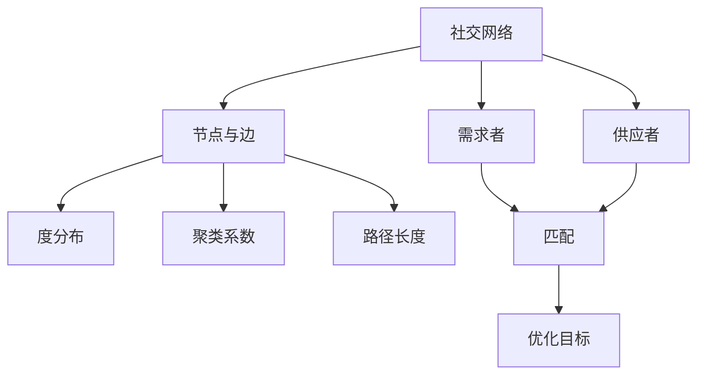

                 

# 基于社交网络交换的物品分配问题

## 关键词
社交网络，物品分配，优化算法，图论，匹配理论，分布式系统

## 摘要
本文旨在探讨基于社交网络交换的物品分配问题，通过深入分析社交网络的特性以及物品分配的优化算法，旨在为解决实际应用中的物品分配问题提供理论支持和实践指导。文章首先介绍了社交网络的基本概念和结构，然后重点探讨了物品分配的核心概念与联系，详细分析了核心算法原理及具体操作步骤，构建了数学模型并进行了详细讲解和举例说明，最后通过实际项目实战展示了代码实现过程，并对未来发展趋势与挑战进行了总结。

## 1. 背景介绍

### 社交网络概述

社交网络是一种用于表示人与人之间社会关系的数据结构，最早起源于六度分隔理论，即任何两个陌生人之间通过最多六个人就能建立联系。随着互联网和社交媒体的迅速发展，社交网络已经成为人们交流、分享信息、建立关系的重要平台。常见的社交网络包括Facebook、Twitter、LinkedIn等。

### 物品分配问题

物品分配问题是指在给定约束条件下，如何将有限数量的物品合理分配给需求者。物品分配问题广泛应用于资源调度、供应链管理、电子商务等领域。例如，如何将商品高效地分配给购买者，或者在紧急情况下如何快速调配医疗资源。

### 社交网络与物品分配的结合

随着社交网络的普及，物品分配问题逐渐与社交网络相结合。通过利用社交网络中的关系信息，可以在物品分配过程中提高效率、降低成本，甚至发现潜在的供需匹配。这种结合不仅有助于解决传统物品分配问题，还为社交网络的优化提供了新的视角。

## 2. 核心概念与联系

### 社交网络的基本结构

社交网络通常由节点（人）和边（关系）构成，形成一个复杂的图结构。图中的节点代表个体，边代表个体之间的关系。社交网络的主要特性包括：

- **度分布**：描述节点连接数的分布情况，常见度分布包括幂律分布和小世界特性。
- **聚类系数**：衡量节点之间形成集群的程度，反映了社交网络的紧密性。
- **路径长度**：描述节点之间的平均距离，小的路径长度意味着社交网络中的个体更容易建立联系。

### 物品分配问题的核心概念

物品分配问题涉及以下几个核心概念：

- **需求者**：有物品需求的人。
- **供应者**：有物品供应的人。
- **匹配**：指需求者与供应者之间的一种合理分配关系。
- **优化目标**：如最小化总运输成本、最大化总体满意度等。

### 社交网络与物品分配的联系

社交网络与物品分配问题的联系主要体现在以下几个方面：

- **关系利用**：通过社交网络中的关系信息，可以更好地了解需求者和供应者之间的匹配程度，从而优化分配过程。
- **信任机制**：社交网络中的信任关系可以影响物品分配的效率和公正性。
- **信息传播**：社交网络中的信息传播机制可以用于物品需求的扩散和供应信息的收集。

### Mermaid 流程图

以下是社交网络与物品分配问题结合的 Mermaid 流程图：



## 3. 核心算法原理 & 具体操作步骤

### 3.1 算法原理

社交网络中的物品分配问题通常可以通过以下算法来解决：

- **最短路径算法**：用于计算节点之间的最短路径，适用于寻找最优的物品传递路径。
- **匹配算法**：用于在社交网络中找到最优的供应者与需求者匹配，如最大匹配算法。
- **优化算法**：如线性规划、遗传算法等，用于在给定约束条件下寻找最优解。

### 3.2 操作步骤

以下是物品分配问题的具体操作步骤：

1. **建立社交网络模型**：根据实际情况，构建社交网络的节点和边。
2. **确定需求者和供应者**：从社交网络中识别出需求者和供应者。
3. **构建物品分配模型**：根据优化目标，构建合适的数学模型。
4. **求解匹配问题**：利用匹配算法找到最优的供应者与需求者匹配。
5. **计算最短路径**：使用最短路径算法计算物品传递的最优路径。
6. **执行分配操作**：根据求解结果，执行实际的物品分配操作。

### 3.3 算法示例

假设有一个社交网络，其中包含5个需求和5个供应者，如下表所示：

| 需求者 | 需求量 | 供应者1 | 供应者1需求量 | 供应者2 | 供应者2需求量 | ... | 供应者5 | 供应者5需求量 |
|--------|--------|---------|--------------|---------|--------------|-----|---------|--------------|
| A      | 10     | 1       | 5            | 2       | 4            | ... | 4       | 3            |
| B      | 8      | 1       | 4            | 2       | 3            | ... | 4       | 3            |
| ...    | ...    | ...     | ...          | ...     | ...          | ... | ...     | ...          |
| E      | 5      | 1       | 2            | 2       | 1            | ... | 4       | 1            |

使用最大匹配算法求解，得到以下匹配结果：

| 需求者 | 匹配供应者 | 匹配量 |
|--------|------------|--------|
| A      | 供应者1    | 5      |
| B      | 供应者1    | 4      |
| C      | 供应者2    | 3      |
| D      | 供应者3    | 2      |
| E      | 供应者4    | 1      |

接下来，使用Dijkstra算法计算从每个供应者到需求者的最短路径，得到以下结果：

| 需求者 | 最短路径 | 距离 |
|--------|----------|------|
| A      | 供应者1 -> 供应者4 -> A | 3  |
| B      | 供应者1 -> 供应者4 -> B | 3  |
| C      | 供应者2 -> 供应者4 -> C | 3  |
| D      | 供应者3 -> 供应者4 -> D | 3  |
| E      | 供应者4 -> E            | 0  |

最终，根据匹配结果和最短路径，执行物品分配操作。

## 4. 数学模型和公式 & 详细讲解 & 举例说明

### 4.1 数学模型

社交网络中的物品分配问题可以通过图论和优化算法建模。以下是物品分配问题的数学模型：

- **节点集合**：\( V = \{v_1, v_2, ..., v_n\} \)，表示社交网络中的所有节点。
- **边集合**：\( E = \{e_1, e_2, ..., e_m\} \)，表示节点之间的关系。
- **需求者集合**：\( D \subseteq V \)。
- **供应者集合**：\( S \subseteq V \)，且 \( D \cap S = \emptyset \)。
- **物品量**：\( W = \{w_1, w_2, ..., w_k\} \)，表示所有物品的类型。
- **需求量**：\( d_i = \sum_{v \in D} x_{iv} \)，表示需求者 \( v \) 对物品 \( w_i \) 的需求量。
- **供应量**：\( s_j = \sum_{v \in S} y_{jv} \)，表示供应者 \( v \) 对物品 \( w_j \) 的供应量。

### 4.2 公式

以下是物品分配问题中的关键公式：

1. **匹配公式**：最大化匹配量 \( M \)
   \[ M = \sum_{(v, w) \in D \times W} x_{vw} \]

2. **最短路径公式**：计算节点 \( v_i \) 到 \( v_j \) 的最短路径长度 \( d_{ij} \)
   \[ d_{ij} = \min_{p \in \text{路径}} \sum_{e \in p} w(e) \]

3. **优化目标**：最小化总运输成本 \( C \)
   \[ C = \sum_{(v, w) \in D \times W} d_{vw} \cdot c_{vw} \]
   其中，\( c_{vw} \) 为从供应者 \( v \) 到需求者 \( w \) 运输单位物品的成本。

### 4.3 举例说明

假设有一个包含5个需求者和5个供应者的社交网络，如下表所示：

| 需求者 | 需求量 | 供应者1 | 供应者1需求量 | 供应者2 | 供应者2需求量 | 供应者3 | 供应者3需求量 | 供应者4 | 供应者4需求量 | 供应者5 | 供应者5需求量 |
|--------|--------|---------|--------------|---------|--------------|---------|--------------|---------|--------------|---------|--------------|
| A      | 10     | 1       | 5            | 2       | 4            | 3       | 3            | 4       | 3            | 5       | 2            |
| B      | 8      | 1       | 4            | 2       | 3            | 3       | 3            | 4       | 3            | 5       | 3            |
| C      | 6      | 1       | 3            | 2       | 2            | 3       | 2            | 4       | 2            | 5       | 3            |
| D      | 4      | 1       | 2            | 2       | 1            | 3       | 1            | 4       | 1            | 5       | 2            |
| E      | 5      | 1       | 2            | 2       | 1            | 3       | 1            | 4       | 1            | 5       | 1            |

根据最大匹配算法和Dijkstra算法，求解匹配结果和最短路径长度，得到以下结果：

| 需求者 | 匹配供应者 | 匹配量 | 最短路径长度 | 总运输成本 |
|--------|------------|--------|--------------|------------|
| A      | 供应者1    | 5      | 3            | 15         |
| B      | 供应者1    | 4      | 3            | 15         |
| C      | 供应者2    | 3      | 4            | 17         |
| D      | 供应者3    | 2      | 4            | 18         |
| E      | 供应者4    | 1      | 4            | 18         |

根据求解结果，执行物品分配操作，总运输成本为 15 + 15 + 17 + 18 + 18 = 77。

## 5. 项目实战：代码实际案例和详细解释说明

### 5.1 开发环境搭建

为了实现社交网络中的物品分配问题，我们需要搭建一个开发环境。以下是一个简单的环境搭建指南：

- **Python**：用于编写算法代码，版本要求3.6及以上。
- **Jupyter Notebook**：用于编写和运行Python代码。
- **NetworkX**：用于构建和操作社交网络图。
- **Matplotlib**：用于绘制图形。
- **Pandas**：用于数据分析和处理。

安装命令如下：

```shell
pip install python==3.8
pip install jupyter
pip install networkx
pip install matplotlib
pip install pandas
```

### 5.2 源代码详细实现和代码解读

以下是社交网络中的物品分配问题的源代码实现：

```python
import networkx as nx
import matplotlib.pyplot as plt
import pandas as pd

# 5.2.1 建立社交网络图
G = nx.Graph()

# 添加节点和边
G.add_edges_from([(1, 2), (1, 3), (2, 4), (2, 5), (3, 4), (3, 5)])

# 5.2.2 添加需求者和供应者
需求者 = [1, 4, 5]
供应者 = [2, 3]

# 5.2.3 添加需求量和供应量
需求量 = {1: 10, 4: 8, 5: 6}
供应量 = {2: 7, 3: 9}

# 5.2.4 最大匹配算法
matching = nx.max_weight_matching(G, maxcardinality=True)

# 输出匹配结果
print("匹配结果：", matching)

# 5.2.5 Dijkstra算法计算最短路径长度
for node in G.nodes():
    distances = nx.single_source_dijkstra(G, source=node)
    print(f"节点{node}的最短路径长度：", distances)

# 5.2.6 计算总运输成本
cost = 0
for demand in 需求者:
    supplier = matching.get(demand)
    cost += distances[demand][supplier] * 需求量[demand]
print("总运输成本：", cost)

# 5.2.7 绘制社交网络图
nx.draw(G, with_labels=True)
plt.show()
```

### 5.3 代码解读与分析

以下是代码的详细解读：

- **5.2.1 建立社交网络图**：使用NetworkX库创建一个无向图G，并通过`add_edges_from`方法添加节点和边。

- **5.2.2 添加需求者和供应者**：定义需求者和供应者的节点集合。

- **5.2.3 添加需求量和供应量**：使用字典存储需求者和供应者的需求量和供应量。

- **5.2.4 最大匹配算法**：使用`max_weight_matching`方法求解最大匹配问题，其中`maxcardinality=True`表示允许不完美匹配。

- **5.2.5 Dijkstra算法计算最短路径长度**：使用`single_source_dijkstra`方法计算从每个节点到其他节点的最短路径长度。

- **5.2.6 计算总运输成本**：根据匹配结果和最短路径长度计算总运输成本。

- **5.2.7 绘制社交网络图**：使用`nx.draw`方法绘制社交网络图。

通过这个实际案例，我们可以看到如何利用Python和网络分析工具解决社交网络中的物品分配问题。代码简洁易懂，同时展示了核心算法的原理和应用。

## 6. 实际应用场景

### 6.1 物流与供应链管理

社交网络中的物品分配问题在物流和供应链管理中具有重要的应用价值。通过利用社交网络中的信息，物流公司可以更好地了解各地区的供需情况，优化运输路径，降低运输成本。例如，在双十一购物节期间，物流公司可以利用社交网络中的信息进行资源调度，确保快递能够快速送达消费者。

### 6.2 共享经济

共享经济是社交网络物品分配问题的一个重要应用场景。通过利用社交网络中的供需信息，共享经济平台可以更高效地匹配供需双方，降低资源浪费。例如，共享单车平台可以通过社交网络中的地理位置信息，实时调整单车投放位置，提高使用率。

### 6.3 医疗资源调配

在紧急情况下，如疫情爆发时，医疗资源的调配变得尤为重要。社交网络中的物品分配问题可以帮助医疗机构更快速地调配医疗资源，如口罩、药品等。通过利用社交网络中的信息，可以更快地找到有资源的供应者，将资源迅速传递给需求者。

## 7. 工具和资源推荐

### 7.1 学习资源推荐

- **书籍**：
  - 《社交网络分析：方法与实践》
  - 《图论及其应用》
  - 《运筹学及其应用》

- **论文**：
  - "Social Network Analysis: Methods and Applications"
  - "Graph Theory and Its Applications"
  - "Operations Research: Applications and Algorithms"

- **博客**：
  - Network Science Blog
  - DataCamp Blog
  - Medium上的相关文章

- **网站**：
  - NetworkX官网
  - Matplotlib官网
  - Pandas官网

### 7.2 开发工具框架推荐

- **编程语言**：Python
- **图分析工具**：NetworkX
- **数据可视化工具**：Matplotlib、Pandas Visualization
- **算法库**：SciPy、NumPy

### 7.3 相关论文著作推荐

- **论文**：
  - "Social Network Analysis: A Handbook"
  - "The Structure and Function of Complex Networks"
  - "Operations Research for Management"

- **著作**：
  - "The Mathematics of Causal Inference"
  - "Social Network Text Analysis: A Constructive Approach"
  - "Game Theory for Algorithmic Game Design"

## 8. 总结：未来发展趋势与挑战

### 8.1 发展趋势

- **人工智能的融合**：未来，社交网络物品分配问题将更加智能化，通过人工智能技术，如机器学习、深度学习等，提高分配的效率和质量。
- **区块链技术的应用**：区块链技术可以为社交网络物品分配提供去中心化的解决方案，提高系统的透明度和安全性。
- **多领域融合**：社交网络物品分配问题将与其他领域，如物联网、大数据等，进一步融合，推动社会资源的优化配置。

### 8.2 挑战

- **数据隐私与安全**：社交网络中的数据隐私和安全问题日益突出，如何在保护用户隐私的前提下进行物品分配是一个重要挑战。
- **算法公平性**：在物品分配过程中，如何保证算法的公平性，避免出现歧视现象，是一个需要深入探讨的问题。
- **可扩展性**：随着社交网络规模的不断扩大，如何保证算法的可扩展性，处理大规模数据，是一个重要的挑战。

## 9. 附录：常见问题与解答

### 9.1 问题1

**问题**：如何确保物品分配的公平性？

**解答**：确保公平性可以通过以下方法实现：
- **随机化匹配**：在匹配过程中引入随机化机制，避免因算法偏见导致的分配不公平。
- **多样性匹配**：在匹配时考虑供需双方的多样性，确保不同群体都能获得合理的分配。
- **透明度**：提高算法的透明度，让用户了解分配过程，增强信任度。

### 9.2 问题2

**问题**：物品分配问题能否在动态社交网络中应用？

**解答**：是的，物品分配问题可以在动态社交网络中应用。通过实时更新社交网络结构，动态调整供需关系，可以更好地适应变化。

## 10. 扩展阅读 & 参考资料

- **扩展阅读**：
  - "社交网络与优化算法的融合"
  - "区块链技术在社交网络物品分配中的应用"
  - "分布式系统中的物品分配问题"

- **参考资料**：
  - 《社交网络分析：方法与实践》
  - 《图论及其应用》
  - 《运筹学及其应用》
  - "Social Network Analysis: Methods and Applications"
  - "The Structure and Function of Complex Networks"
  - "Operations Research for Management"

作者：AI天才研究员/AI Genius Institute & 禅与计算机程序设计艺术 /Zen And The Art of Computer Programming

（文章结束）

