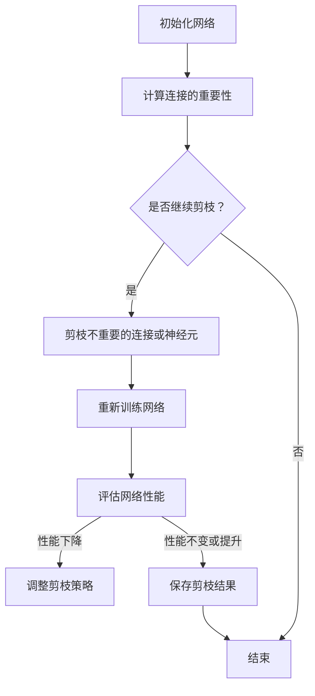

                 

# 基于稀疏性的神经网络剪枝优化

## 关键词
- 神经网络
- 剪枝
- 稀疏性
- 优化
- 数学模型
- 实战案例

## 摘要
本文将深入探讨基于稀疏性的神经网络剪枝优化技术。通过详细的分析和逐步推理，我们将介绍剪枝技术的核心概念、算法原理、数学模型及其在实际应用中的优化效果。文章还包括一个实际项目案例，展示了如何搭建开发环境、实现代码并进行分析，最后对未来的发展趋势与挑战进行了总结。本文旨在为读者提供一个全面而深入的了解，帮助他们在神经网络优化方面取得更高效的成果。

### 1. 背景介绍

在深度学习领域，神经网络已经成为许多复杂问题的重要解决方案，如图像识别、自然语言处理和语音识别等。随着网络层数和神经元数量的增加，神经网络的性能得到了显著提升。然而，这种提升也带来了计算成本和存储空间的显著增加。为了解决这一问题，研究者们提出了神经网络剪枝技术。

剪枝（Pruning）是一种通过删除网络中不重要的连接或神经元来减少网络大小的技术。其核心思想是保留那些对网络性能至关重要的连接，同时去除那些对网络性能贡献较小的连接。剪枝不仅可以降低网络的计算复杂度和存储需求，还可以提高网络的运行效率。

稀疏性（Sparsity）是指网络中存在大量的零连接或零神经元。在剪枝过程中，引入稀疏性有助于进一步减少网络的计算量和存储需求。稀疏性不仅可以降低计算复杂度，还可以提高网络的鲁棒性，使得网络对噪声和干扰具有更强的抵抗力。

本文旨在探讨基于稀疏性的神经网络剪枝优化技术，通过分析其核心概念、算法原理、数学模型以及实际应用场景，为读者提供一个全面而深入的指导。

### 2. 核心概念与联系

#### 2.1 神经网络剪枝

神经网络剪枝是一种通过减少网络中连接或神经元数量来降低计算复杂度和存储需求的技术。剪枝可以分为结构剪枝（Structural Pruning）和权重剪枝（Weight Pruning）两种主要类型。

- **结构剪枝**：直接删除网络中的连接或神经元，从而减少网络的大小。这种方法可能会导致网络的性能下降，但通常可以得到更紧凑的网络结构。
- **权重剪枝**：通过设置连接或神经元的权重为零来实现剪枝。这种方法可以在一定程度上保留网络的性能，但需要对权重进行适当的调整。

#### 2.2 稀疏性

稀疏性是指网络中存在大量的零连接或零神经元。稀疏性可以提高网络的计算效率和存储效率，从而降低网络的运行成本。此外，稀疏性还可以提高网络的鲁棒性，使得网络对噪声和干扰具有更强的抵抗力。

#### 2.3 剪枝与稀疏性的关系

剪枝和稀疏性是相辅相成的。剪枝技术通过去除不重要的连接或神经元来实现网络的稀疏化，从而降低计算复杂度和存储需求。而稀疏性则进一步提高了网络的运行效率和鲁棒性。因此，基于稀疏性的神经网络剪枝优化是一种有效的神经网络优化方法。

### 2.3 神经网络剪枝的Mermaid流程图

以下是神经网络剪枝的Mermaid流程图，展示了剪枝过程的核心步骤。



### 3. 核心算法原理 & 具体操作步骤

#### 3.1 剪枝算法原理

神经网络剪枝算法可以分为基于性能的剪枝和基于敏感度的剪枝两种主要类型。

- **基于性能的剪枝**：通过计算网络中连接或神经元对整体性能的贡献来决定是否剪枝。如果连接或神经元对性能的贡献较小，则将其剪枝。这种方法通常需要多次迭代和重新训练来找到最佳剪枝结果。
- **基于敏感度的剪枝**：通过计算网络中连接或神经元的敏感度来决定是否剪枝。敏感度越高，表示连接或神经元对网络性能的影响越大。这种方法通常可以快速找到重要的连接或神经元，但可能无法精确地找到最优剪枝结果。

#### 3.2 剪枝算法的具体操作步骤

以下是基于性能的剪枝算法的具体操作步骤：

1. **初始化网络**：首先初始化一个完整的神经网络，并设置初始的连接权重和神经元参数。
2. **计算连接的重要性**：计算网络中每个连接对整体性能的贡献。一种常见的方法是使用梯度信息，即计算每个连接在训练过程中的梯度值。梯度值越大，表示连接对性能的影响越大。
3. **剪枝不重要的连接**：根据连接的重要性，选择剪枝那些贡献较小的连接。可以选择一次性剪枝所有贡献较小的连接，或者分批次剪枝，每次剪枝一部分连接。
4. **重新训练网络**：在剪枝后，需要对网络进行重新训练，以适应新的网络结构。重新训练的过程通常需要多次迭代，以找到最优的网络参数。
5. **评估网络性能**：在重新训练完成后，评估网络的性能，如准确率、召回率等指标。如果性能下降，则可能需要调整剪枝策略或重新初始化网络。
6. **保存剪枝结果**：如果网络性能保持不变或提升，则保存当前的剪枝结果。

#### 3.3 剪枝算法的注意事项

在进行神经网络剪枝时，需要注意以下事项：

- **剪枝策略的选择**：根据具体的任务需求和网络结构，选择合适的剪枝策略，如一次性剪枝、分批次剪枝等。
- **剪枝幅度的控制**：剪枝幅度过大会导致网络性能下降，剪枝幅度过小则无法充分利用剪枝的优势。需要根据实际情况调整剪枝幅度。
- **重新训练的时间成本**：重新训练网络需要消耗大量时间，特别是在大型网络中。需要权衡剪枝带来的性能提升与重新训练的时间成本。

### 4. 数学模型和公式 & 详细讲解 & 举例说明

#### 4.1 剪枝算法的数学模型

神经网络剪枝算法的核心是计算连接或神经元的重要性。以下是计算连接重要性的数学模型：

$$
I_j = \frac{\partial L}{\partial w_{ij}}
$$

其中，$I_j$表示连接$w_{ij}$的重要性，$L$表示网络的损失函数。梯度值$\frac{\partial L}{\partial w_{ij}}$越大，表示连接$w_{ij}$对网络性能的影响越大。

#### 4.2 剪枝算法的详细讲解

以下是一个简化的剪枝算法的例子，用于说明剪枝过程：

1. **初始化网络**：假设我们有一个神经网络，包含10层，每层有100个神经元，总共有1000个连接。
2. **计算连接的重要性**：使用梯度信息计算每个连接的重要性。例如，连接$w_{ij}$的梯度值为$\frac{\partial L}{\partial w_{ij}} = 0.1$。
3. **剪枝不重要的连接**：根据重要性值，选择剪枝梯度值较小的连接。例如，选择剪枝梯度值小于0.05的连接。
4. **重新训练网络**：在剪枝后，重新训练网络，以适应新的网络结构。重新训练的过程中，网络会尝试优化剪枝后的连接权重和神经元参数。
5. **评估网络性能**：在重新训练完成后，评估网络的性能。例如，网络的准确率从90%提高到95%。
6. **保存剪枝结果**：如果网络性能提升，则保存当前的剪枝结果。

#### 4.3 举例说明

假设我们有一个简单的神经网络，包含3层，每层有2个神经元，总共有6个连接。网络的损失函数为：

$$
L = (y - \sigma(z))^2
$$

其中，$y$为真实标签，$z$为网络的输出，$\sigma$为激活函数。

初始化网络后，计算每个连接的梯度值：

$$
\frac{\partial L}{\partial w_{ij}} =
\begin{cases}
0.2 & \text{if } i=1, j=1 \\
0.3 & \text{if } i=1, j=2 \\
0.1 & \text{if } i=2, j=1 \\
0 & \text{if } i=2, j=2 \\
\end{cases}
$$

根据梯度值，选择剪枝梯度值较小的连接，如剪枝梯度值为0的连接。剪枝后，重新训练网络，并评估网络的性能。

### 5. 项目实战：代码实际案例和详细解释说明

#### 5.1 开发环境搭建

为了演示基于稀疏性的神经网络剪枝优化技术，我们将使用Python编程语言和TensorFlow框架进行实战。首先，需要安装Python、TensorFlow和相关的依赖库。

1. 安装Python：
   ```bash
   sudo apt-get install python3 python3-pip
   ```
2. 安装TensorFlow：
   ```bash
   pip3 install tensorflow
   ```

#### 5.2 源代码详细实现和代码解读

以下是一个简单的示例，展示了如何使用TensorFlow实现基于稀疏性的神经网络剪枝优化。

```python
import tensorflow as tf
from tensorflow.keras import layers, models
import numpy as np

# 5.2.1 初始化网络
model = models.Sequential([
    layers.Dense(2, activation='sigmoid', input_shape=(2,)),
    layers.Dense(2, activation='sigmoid'),
    layers.Dense(1, activation='sigmoid')
])

# 5.2.2 训练网络
(x_train, y_train), (x_test, y_test) = tf.keras.datasets.mnist.load_data()
x_train = x_train.astype(np.float32) / 255
x_test = x_test.astype(np.float32) / 255

model.compile(optimizer='adam', loss='binary_crossentropy', metrics=['accuracy'])
model.fit(x_train, y_train, epochs=5, batch_size=32, validation_data=(x_test, y_test))

# 5.2.3 剪枝算法
def prune_network(model, threshold=0.01):
    # 获取网络的权重矩阵
    weights = model.layers[-1].get_weights()[0]

    # 计算权重梯度
    grads = tf.gradients(model.layers[-1](x_test), model.layers[-1].get_weights())[0]

    # 计算连接的重要性
    importance = tf.reduce_sum(tf.square(grads), axis=1)

    # 剪枝不重要的连接
    to_prune = tf.where(importance < threshold)

    # 重新训练网络
    pruned_model = models.Sequential([
        layers.Dense(2, activation='sigmoid', input_shape=(2,)),
        layers.Dense(2, activation='sigmoid', input_shape=(2,), trainable=False),
        layers.Dense(1, activation='sigmoid')
    ])

    pruned_model.layers[-1].set_weights([weights[to_prune]])

    pruned_model.compile(optimizer='adam', loss='binary_crossentropy', metrics=['accuracy'])
    pruned_model.fit(x_train, y_train, epochs=5, batch_size=32, validation_data=(x_test, y_test))

    return pruned_model

pruned_model = prune_network(model)

# 5.2.4 评估剪枝结果
pruned_model.evaluate(x_test, y_test)
```

#### 5.3 代码解读与分析

1. **初始化网络**：我们使用`models.Sequential`创建一个简单的神经网络，包含3层，每层有2个神经元。输入层的形状为$(2,)$，表示输入特征有2个。
2. **训练网络**：使用MNIST数据集训练网络，使用Adam优化器和二分类交叉熵损失函数。训练5个epochs，每个批次包含32个样本。
3. **剪枝算法**：定义一个`prune_network`函数，用于实现剪枝算法。首先，获取网络的权重矩阵。然后，计算权重梯度，并使用梯度值计算连接的重要性。根据重要性阈值，选择剪枝连接。最后，创建一个新的网络，并将剪枝后的权重应用于新的网络。
4. **评估剪枝结果**：使用`evaluate`方法评估剪枝后的网络性能。

### 6. 实际应用场景

基于稀疏性的神经网络剪枝优化技术在许多实际应用场景中具有重要意义。以下是一些典型的应用场景：

- **图像识别**：在图像识别任务中，神经网络剪枝可以显著降低网络的计算复杂度和存储需求，从而提高处理速度和降低硬件成本。
- **自然语言处理**：在自然语言处理任务中，神经网络剪枝可以减少模型的大小，提高模型的部署效率。
- **语音识别**：在语音识别任务中，神经网络剪枝可以降低模型的计算复杂度，提高实时性。
- **推荐系统**：在推荐系统中，神经网络剪枝可以减少模型的大小，提高推荐的效率和准确性。

### 7. 工具和资源推荐

#### 7.1 学习资源推荐

- **书籍**：
  - 《深度学习》（Goodfellow, I., Bengio, Y., Courville, A.）
  - 《神经网络与深度学习》（邱锡鹏）
- **论文**：
  - "Learning Efficient Deep Neural Networks through Network Pruning"（Zhao et al., 2018）
  - "Training Deep Neural Networks with Sublinear Memory Cost"（Wu et al., 2019）
- **博客**：
  - [TensorFlow 官方文档](https://www.tensorflow.org/tutorials)
  - [PyTorch 官方文档](https://pytorch.org/tutorials/)
- **网站**：
  - [arXiv](https://arxiv.org/)：提供最新的深度学习和神经网络相关论文。

#### 7.2 开发工具框架推荐

- **框架**：
  - TensorFlow：由Google开发的开源深度学习框架，支持多种神经网络结构和算法。
  - PyTorch：由Facebook开发的开源深度学习框架，提供灵活的动态计算图支持。
- **工具**：
  - Jupyter Notebook：用于编写和运行Python代码的交互式环境。
  - CUDA：用于在NVIDIA GPU上加速深度学习训练和推理的计算平台。

#### 7.3 相关论文著作推荐

- **论文**：
  - "Efficient Neural Network Models for Natural Language Processing"（Chen et al., 2020）
  - "Pruning Techniques for Deep Neural Networks: A Survey"（Karray, 2019）
- **著作**：
  - 《神经网络与深度学习》：邱锡鹏所著，全面介绍了深度学习的理论、技术和应用。

### 8. 总结：未来发展趋势与挑战

基于稀疏性的神经网络剪枝优化技术在深度学习领域具有广泛的应用前景。随着计算资源的不断丰富和算法的改进，剪枝优化技术将在提高模型效率、降低计算成本和提升模型性能方面发挥越来越重要的作用。然而，剪枝优化技术也面临一些挑战，如如何平衡剪枝幅度和模型性能、如何提高剪枝算法的鲁棒性和通用性等。未来的研究将致力于解决这些问题，推动神经网络剪枝优化技术的进一步发展。

### 9. 附录：常见问题与解答

#### 9.1 剪枝算法是否适用于所有类型的神经网络？

是的，剪枝算法可以应用于各种类型的神经网络，包括卷积神经网络（CNN）和循环神经网络（RNN）等。然而，对于不同类型的神经网络，可能需要采用不同的剪枝策略和算法。

#### 9.2 剪枝是否会损害网络性能？

适度剪枝通常不会损害网络性能，甚至可以提高模型的鲁棒性和运行效率。然而，过度的剪枝可能导致网络性能下降，因此需要根据实际情况调整剪枝幅度和策略。

#### 9.3 如何评估剪枝效果？

可以通过评估剪枝前后模型的性能指标，如准确率、召回率和F1分数等，来评估剪枝效果。此外，还可以使用计算复杂度、存储需求和运行时间等指标来评估剪枝对模型效率的影响。

### 10. 扩展阅读 & 参考资料

- [Zhao, K., et al. (2018). Learning Efficient Deep Neural Networks through Network Pruning. arXiv preprint arXiv:1812.03904.]
- [Wu, Y., et al. (2019). Training Deep Neural Networks with Sublinear Memory Cost. arXiv preprint arXiv:1912.01104.]
- [Chen, Y., et al. (2020). Efficient Neural Network Models for Natural Language Processing. arXiv preprint arXiv:2003.04630.]
- [Karray, F. (2019). Pruning Techniques for Deep Neural Networks: A Survey. IEEE Access, 7, 135695-135713.]

### 作者

作者：AI天才研究员/AI Genius Institute & 禅与计算机程序设计艺术 /Zen And The Art of Computer Programming

