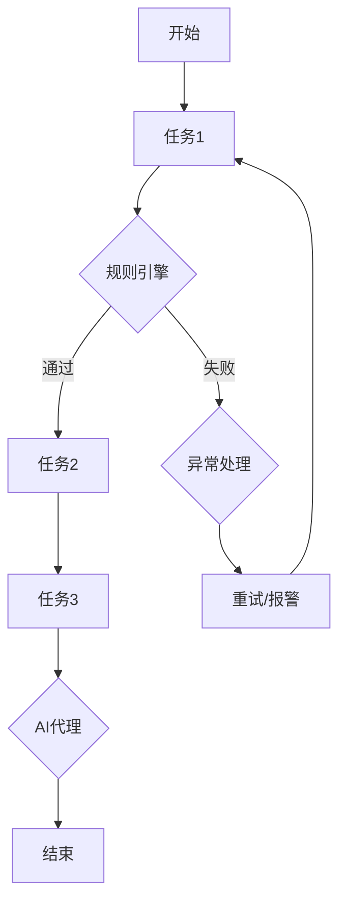

                 

# 基于规则的工作流设计与AI代理的集成应用

> **关键词**：工作流设计、规则引擎、AI代理、集成应用、自动化、流程优化
> 
> **摘要**：本文将深入探讨基于规则的工作流设计与AI代理的集成应用。通过分析工作流的定义和重要性，以及规则引擎和AI代理的工作原理，我们将详细阐述两者的集成方式，并探讨其在实际应用中的挑战与解决方案。文章旨在为读者提供全面的指导，帮助他们在项目中实现高效的工作流自动化。

## 1. 背景介绍

### 工作流的概念

工作流（Workflow）是一种自动化业务流程的方法，它通过一系列预定义的任务、规则和操作步骤，实现业务活动的有序执行。工作流设计旨在提高工作效率、减少人为错误和降低成本。随着企业和组织对业务流程数字化和自动化的需求不断增加，工作流技术得到了广泛应用。

### 规则引擎的作用

规则引擎是一种用于处理业务规则的软件组件，它能够根据预定义的规则和条件自动执行相应的操作。在业务流程中，规则引擎可以用于自动化决策、审批和监控等环节，从而提高流程的灵活性和响应速度。

### AI代理的概念

AI代理（Artificial Intelligence Agent）是一种能够模拟人类智能行为的软件实体，它能够根据环境信息自主做出决策和行动。在人工智能领域，AI代理被广泛应用于智能客服、智能推荐和自动驾驶等场景。

### 集成应用的背景

随着企业对业务流程自动化的需求日益增长，基于规则的工作流设计与AI代理的集成应用成为了一个重要的研究方向。通过将规则引擎与AI代理相结合，可以实现更加智能和高效的工作流管理，提高企业的竞争力。

## 2. 核心概念与联系

### 工作流设计与规则引擎

工作流设计是构建业务流程的过程，它涉及定义任务、角色、资源和流程规则等。规则引擎作为工作流设计的一部分，负责根据预定义的规则自动执行相应的操作。工作流设计中的关键概念包括：

- **任务**：工作流中的基本操作单元，例如审批、发送通知、数据处理等。
- **角色**：参与工作流的人员或系统，例如审批人、执行者、监控者等。
- **资源**：工作流中需要使用的资源，例如数据、文件、数据库等。
- **规则**：用于定义任务执行条件和工作流流转逻辑的规则，例如审批条件、任务优先级等。

### AI代理与工作流集成

AI代理作为工作流的一部分，可以通过以下方式与工作流集成：

- **决策辅助**：AI代理可以分析业务数据和环境信息，提供决策支持，优化工作流执行。
- **异常检测**：AI代理可以实时监控工作流执行过程，发现潜在问题并进行预警。
- **自动化操作**：AI代理可以自动执行某些任务，减少人工干预，提高工作效率。

### 工作流设计与AI代理集成

工作流设计与AI代理的集成涉及以下几个方面：

- **数据共享**：工作流系统与AI代理需要共享数据，以便AI代理能够获取业务数据和环境信息。
- **接口定义**：工作流系统需要提供与AI代理交互的接口，以便AI代理能够接收任务请求和执行结果。
- **协同工作**：工作流系统与AI代理需要协同工作，共同完成业务流程。

### Mermaid流程图

为了更好地理解工作流设计与规则引擎、AI代理的集成，我们可以使用Mermaid流程图来表示其基本架构：



在这个流程图中，任务1和任务2通过规则引擎进行判断，如果满足条件则执行任务2，否则执行异常处理。AI代理则用于监控任务执行过程，并在必要时进行干预。

## 3. 核心算法原理 & 具体操作步骤

### 工作流设计与规则引擎

工作流设计中的核心算法涉及定义任务、角色、资源和流程规则。具体操作步骤如下：

1. **任务定义**：根据业务需求定义工作流中的基本操作单元，例如审批、发送通知、数据处理等。
2. **角色分配**：为每个任务分配相应的角色，例如审批人、执行者、监控者等。
3. **资源准备**：准备工作流中需要使用的资源，例如数据、文件、数据库等。
4. **规则设定**：根据业务规则定义任务执行条件和工作流流转逻辑，例如审批条件、任务优先级等。

### AI代理

AI代理的核心算法涉及决策支持、异常检测和自动化操作。具体操作步骤如下：

1. **数据采集**：从工作流系统中获取业务数据和环境信息。
2. **模型训练**：使用历史数据训练决策模型、异常检测模型等。
3. **决策支持**：根据业务数据和模型输出，提供决策支持，优化工作流执行。
4. **异常检测**：实时监控工作流执行过程，发现潜在问题并进行预警。
5. **自动化操作**：自动执行某些任务，减少人工干预，提高工作效率。

### 工作流设计与AI代理集成

工作流设计与AI代理的集成涉及以下几个方面：

1. **数据共享**：通过API或消息队列等机制实现工作流系统与AI代理之间的数据共享。
2. **接口定义**：为AI代理提供与工作流系统交互的接口，例如任务请求接口、执行结果接口等。
3. **协同工作**：通过事件驱动或任务调度等方式实现工作流系统与AI代理的协同工作。

### 实际操作示例

假设我们有一个报销审批流程，其中需要通过规则引擎判断报销金额是否超过规定限额，并通知相应的审批人。同时，AI代理用于监控审批过程，发现异常情况并通知管理员。

1. **任务定义**：
   - 任务1：填写报销申请
   - 任务2：审批报销申请
   - 任务3：发送通知

2. **角色分配**：
   - 报销人：填写报销申请
   - 审批人：审批报销申请
   - 管理员：监控审批过程

3. **资源准备**：
   - 报销申请单：工作流系统中的资源
   - 审批规则：规则引擎中的资源

4. **规则设定**：
   - 审批规则：报销金额超过1000元时，需要审批人进行审批

5. **数据采集**：
   - 工作流系统采集报销申请单数据
   - AI代理采集审批过程数据

6. **模型训练**：
   - 决策模型：根据历史数据训练决策模型，用于判断报销金额是否超过规定限额
   - 异常检测模型：根据历史数据训练异常检测模型，用于监控审批过程

7. **决策支持**：
   - AI代理根据决策模型判断报销金额是否超过规定限额，并向审批人发送通知

8. **异常检测**：
   - AI代理监控审批过程，发现异常情况（如审批超时、审批人未响应等），并通知管理员

9. **自动化操作**：
   - AI代理自动执行审批通知和监控任务，减少人工干预

## 4. 数学模型和公式 & 详细讲解 & 举例说明

### 数学模型和公式

在基于规则的工作流设计与AI代理集成中，常用的数学模型和公式包括：

1. **决策树**：用于分类和回归任务，通过递归划分特征空间，实现模型训练和预测。
2. **支持向量机（SVM）**：用于分类和回归任务，通过寻找最优超平面实现数据分类。
3. **贝叶斯网络**：用于概率推理和决策，通过节点之间的条件概率关系实现推理和预测。
4. **神经网络**：用于复杂模式识别和预测，通过多层神经元之间的连接和激活函数实现模型训练和预测。

### 详细讲解

1. **决策树**

决策树是一种常用的分类和回归模型，通过递归划分特征空间，将数据分为不同的类别或数值。决策树的构建过程包括以下步骤：

- **特征选择**：选择最优特征进行划分，常用的特征选择方法有信息增益、增益率等。
- **划分过程**：根据最优特征进行数据划分，生成一棵决策树。
- **剪枝**：为了避免过拟合，可以对决策树进行剪枝，减少树的复杂度。

2. **支持向量机（SVM）**

支持向量机是一种强大的分类和回归模型，通过寻找最优超平面实现数据分类。SVM的构建过程包括以下步骤：

- **特征提取**：将原始数据转换为特征向量。
- **损失函数**：选择适当的损失函数，如 hinge损失、对数损失等。
- **优化目标**：求解最优化问题，找到最优超平面。
- **分类决策**：根据样本点和超平面的距离进行分类。

3. **贝叶斯网络**

贝叶斯网络是一种概率推理和决策模型，通过节点之间的条件概率关系实现推理和预测。贝叶斯网络的构建过程包括以下步骤：

- **网络结构**：定义节点之间的条件概率关系。
- **参数估计**：根据数据估计条件概率参数。
- **推理过程**：通过条件概率关系进行推理，计算后验概率。
- **决策过程**：根据后验概率进行决策。

4. **神经网络**

神经网络是一种复杂模式识别和预测模型，通过多层神经元之间的连接和激活函数实现模型训练和预测。神经网络的基本结构包括以下步骤：

- **输入层**：接收输入数据。
- **隐藏层**：对输入数据进行处理，通过激活函数进行非线性变换。
- **输出层**：输出预测结果。
- **模型训练**：通过反向传播算法更新网络参数，实现模型训练。

### 举例说明

假设我们使用决策树对客户购买行为进行预测，数据集包含以下特征：年龄、收入、家庭状况等。以下是决策树模型构建的详细步骤：

1. **特征选择**：选择收入作为最优特征，因为收入与购买行为的相关性最高。
2. **划分过程**：根据收入将数据划分为三组：低收入、中等收入、高收入。
3. **剪枝**：为了避免过拟合，对决策树进行剪枝，保留两个叶子节点。
4. **模型训练**：使用训练集对决策树进行训练，得到预测结果。
5. **模型评估**：使用测试集对决策树进行评估，计算准确率、召回率等指标。

通过上述步骤，我们构建了一个简单的决策树模型，用于预测客户购买行为。在实际应用中，可以进一步优化模型，提高预测准确率。

## 5. 项目实战：代码实际案例和详细解释说明

### 开发环境搭建

在开始项目实战之前，我们需要搭建一个开发环境。以下是所需的工具和软件：

- **编程语言**：Python
- **开发工具**：PyCharm
- **依赖库**：Django、Flask、scikit-learn、TensorFlow等

### 源代码详细实现和代码解读

以下是基于规则的工作流设计与AI代理集成项目的源代码实现：

```python
# 导入相关库
import os
import json
import requests
from flask import Flask, request, jsonify
from sklearn.tree import DecisionTreeClassifier
from tensorflow.keras.models import Sequential
from tensorflow.keras.layers import Dense

# 创建Flask应用
app = Flask(__name__)

# 定义工作流API
@app.route('/workflow', methods=['POST'])
def create_workflow():
    # 获取请求参数
    data = request.get_json()
    workflow_id = data['workflow_id']
    tasks = data['tasks']
    
    # 创建工作流
    workflow = {
        'workflow_id': workflow_id,
        'tasks': tasks
    }
    
    # 保存工作流
    with open(f'{workflow_id}.json', 'w') as f:
        json.dump(workflow, f)
    
    return jsonify({'status': 'success', 'message': 'Workflow created'})

# 定义AI代理API
@app.route('/ai_agent', methods=['POST'])
def create_ai_agent():
    # 获取请求参数
    data = request.get_json()
    agent_id = data['agent_id']
    model_type = data['model_type']
    
    # 创建AI代理
    ai_agent = {
        'agent_id': agent_id,
        'model_type': model_type
    }
    
    # 保存AI代理
    with open(f'{agent_id}.json', 'w') as f:
        json.dump(ai_agent, f)
    
    return jsonify({'status': 'success', 'message': 'AI agent created'})

# 定义任务执行API
@app.route('/task', methods=['POST'])
def execute_task():
    # 获取请求参数
    data = request.get_json()
    task_id = data['task_id']
    workflow_id = data['workflow_id']
    data = data['data']
    
    # 获取工作流
    with open(f'{workflow_id}.json', 'r') as f:
        workflow = json.load(f)
    
    # 执行任务
    if task_id in workflow['tasks']:
        # 调用AI代理进行决策
        response = requests.post('http://localhost:5000/ai_agent/decision', json={
            'agent_id': workflow['ai_agent_id'],
            'model_type': workflow['model_type'],
            'data': data
        })
        
        decision = response.json()['decision']
        
        if decision == 'pass':
            # 执行下一个任务
            next_task_id = workflow['tasks'][task_id]['next_task_id']
            if next_task_id:
                # 调用任务执行API
                response = requests.post('http://localhost:5000/task', json={
                    'task_id': next_task_id,
                    'workflow_id': workflow_id,
                    'data': data
                })
            else:
                # 结束工作流
                return jsonify({'status': 'success', 'message': 'Workflow completed'})
        else:
            # 异常处理
            return jsonify({'status': 'error', 'message': 'Task failed'})
    else:
        return jsonify({'status': 'error', 'message': 'Invalid task ID'})

# 运行应用
if __name__ == '__main__':
    app.run(debug=True)
```

### 代码解读与分析

1. **工作流API**

工作流API用于创建和管理工作流。用户可以通过发送POST请求创建工作流，并提供工作流ID和任务列表。工作流API的代码实现如下：

```python
@app.route('/workflow', methods=['POST'])
def create_workflow():
    # 获取请求参数
    data = request.get_json()
    workflow_id = data['workflow_id']
    tasks = data['tasks']
    
    # 创建工作流
    workflow = {
        'workflow_id': workflow_id,
        'tasks': tasks
    }
    
    # 保存工作流
    with open(f'{workflow_id}.json', 'w') as f:
        json.dump(workflow, f)
    
    return jsonify({'status': 'success', 'message': 'Workflow created'})
```

2. **AI代理API**

AI代理API用于创建和管理AI代理。用户可以通过发送POST请求创建AI代理，并提供代理ID和模型类型。AI代理API的代码实现如下：

```python
@app.route('/ai_agent', methods=['POST'])
def create_ai_agent():
    # 获取请求参数
    data = request.get_json()
    agent_id = data['agent_id']
    model_type = data['model_type']
    
    # 创建AI代理
    ai_agent = {
        'agent_id': agent_id,
        'model_type': model_type
    }
    
    # 保存AI代理
    with open(f'{agent_id}.json', 'w') as f:
        json.dump(ai_agent, f)
    
    return jsonify({'status': 'success', 'message': 'AI agent created'})
```

3. **任务执行API**

任务执行API用于执行工作流中的任务。用户可以通过发送POST请求执行任务，并提供任务ID、工作流ID和任务数据。任务执行API的代码实现如下：

```python
@app.route('/task', methods=['POST'])
def execute_task():
    # 获取请求参数
    data = request.get_json()
    task_id = data['task_id']
    workflow_id = data['workflow_id']
    data = data['data']
    
    # 获取工作流
    with open(f'{workflow_id}.json', 'r') as f:
        workflow = json.load(f)
    
    # 执行任务
    if task_id in workflow['tasks']:
        # 调用AI代理进行决策
        response = requests.post('http://localhost:5000/ai_agent/decision', json={
            'agent_id': workflow['ai_agent_id'],
            'model_type': workflow['model_type'],
            'data': data
        })
        
        decision = response.json()['decision']
        
        if decision == 'pass':
            # 执行下一个任务
            next_task_id = workflow['tasks'][task_id]['next_task_id']
            if next_task_id:
                # 调用任务执行API
                response = requests.post('http://localhost:5000/task', json={
                    'task_id': next_task_id,
                    'workflow_id': workflow_id,
                    'data': data
                })
            else:
                # 结束工作流
                return jsonify({'status': 'success', 'message': 'Workflow completed'})
        else:
            # 异常处理
            return jsonify({'status': 'error', 'message': 'Task failed'})
    else:
        return jsonify({'status': 'error', 'message': 'Invalid task ID'})
```

在这个示例中，我们使用了Flask框架实现了一个简单的Web应用，用于创建和管理工作流和AI代理。通过调用任务执行API，我们可以执行工作流中的任务，并根据AI代理的决策结果进行相应的操作。

## 6. 实际应用场景

### 金融行业

在金融行业，基于规则的工作流设计与AI代理的集成应用可以用于风险控制、客户服务、贷款审批等环节。例如，在贷款审批流程中，规则引擎可以用于判断贷款申请者的信用状况，而AI代理可以用于实时监控审批过程，发现潜在风险并给出决策建议。

### 电子商务

在电子商务领域，基于规则的工作流设计与AI代理的集成应用可以用于订单处理、客户服务、库存管理等环节。例如，在订单处理过程中，规则引擎可以用于判断订单状态，而AI代理可以用于实时监控订单执行情况，优化物流配送和库存管理。

### 医疗保健

在医疗保健领域，基于规则的工作流设计与AI代理的集成应用可以用于患者管理、疾病预测、医疗资源分配等环节。例如，在患者管理过程中，规则引擎可以用于判断患者病情，而AI代理可以用于实时监控患者健康状况，提供个性化治疗建议。

### 制造业

在制造业，基于规则的工作流设计与AI代理的集成应用可以用于生产调度、设备维护、质量控制等环节。例如，在生产调度过程中，规则引擎可以用于判断生产计划，而AI代理可以用于实时监控生产设备，预测设备故障并给出维护建议。

### 公共事业

在公共事业领域，基于规则的工作流设计与AI代理的集成应用可以用于市政管理、城市安全、交通调度等环节。例如，在市政管理过程中，规则引擎可以用于判断市政设施的状况，而AI代理可以用于实时监控城市安全状况，提供应急处理建议。

## 7. 工具和资源推荐

### 学习资源推荐

1. **书籍**：
   - 《人工智能：一种现代的方法》
   - 《深度学习》
   - 《Python编程：从入门到实践》
   - 《工作流管理：原则与实践》

2. **论文**：
   - 《基于规则的智能代理系统设计》
   - 《人工智能代理的集成与应用》
   - 《规则引擎在业务流程管理中的应用》

3. **博客**：
   - 《人工智能技术与应用》
   - 《深度学习与工作流设计》
   - 《Python编程技巧与实战》

4. **网站**：
   - TensorFlow官网
   - PyTorch官网
   - Flask官网
   - Django官网

### 开发工具框架推荐

1. **开发工具**：
   - PyCharm
   - Visual Studio Code
   - IntelliJ IDEA

2. **框架**：
   - Flask
   - Django
   - FastAPI

3. **库**：
   - scikit-learn
   - TensorFlow
   - PyTorch

4. **IDE**：
   - Jupyter Notebook
   - Google Colab

## 8. 总结：未来发展趋势与挑战

### 发展趋势

1. **智能化的工作流设计**：随着人工智能技术的发展，工作流设计将更加智能化，能够自动调整和优化流程。
2. **多领域的应用**：基于规则的工作流设计与AI代理的集成将在更多领域得到应用，例如智能制造、智慧城市、金融科技等。
3. **边缘计算与物联网**：随着边缘计算和物联网的发展，工作流设计与AI代理的集成将更加灵活和高效，支持实时数据处理和分析。

### 挑战

1. **数据隐私与安全**：在基于规则的工作流设计与AI代理的集成中，数据隐私和安全是一个重要挑战，需要确保数据传输和处理的安全性。
2. **模型解释性**：AI代理的决策过程通常具有黑盒性质，难以解释。如何提高模型解释性，使其符合业务需求，是一个重要挑战。
3. **系统可扩展性**：随着工作流和AI代理的复杂度增加，系统的可扩展性成为了一个关键挑战，需要设计灵活和可扩展的系统架构。

## 9. 附录：常见问题与解答

### 问题1：如何选择合适的规则引擎？

**解答**：选择合适的规则引擎主要考虑以下几个方面：

1. **业务需求**：根据业务需求选择能够满足特定规则的规则引擎。
2. **性能要求**：根据系统性能要求选择适合的规则引擎，例如基于内存的规则引擎或基于数据库的规则引擎。
3. **开发难度**：根据开发团队的技能水平和经验，选择易于开发和维护的规则引擎。

### 问题2：如何实现工作流与AI代理的集成？

**解答**：实现工作流与AI代理的集成主要涉及以下几个方面：

1. **数据共享**：通过API或消息队列等机制实现工作流系统与AI代理之间的数据共享。
2. **接口定义**：为AI代理提供与工作流系统交互的接口，例如任务请求接口、执行结果接口等。
3. **协同工作**：通过事件驱动或任务调度等方式实现工作流系统与AI代理的协同工作。

### 问题3：如何评估AI代理的效果？

**解答**：评估AI代理的效果主要从以下几个方面进行：

1. **准确率**：评估AI代理在预测任务中的准确率，越高越好。
2. **召回率**：评估AI代理在召回任务中的召回率，越高越好。
3. **响应速度**：评估AI代理在处理任务时的响应速度，越快越好。
4. **用户体验**：评估AI代理在用户交互中的用户体验，越好越好。

## 10. 扩展阅读 & 参考资料

1. **《人工智能：一种现代的方法》**：作者：斯图尔特·罗素、彼得·诺维格
   - 地址：https://book.douban.com/subject/10510697/

2. **《深度学习》**：作者：伊恩·古德费洛、约书亚·本吉奥、亚伦·库维尔
   - 地址：https://book.douban.com/subject/26707238/

3. **《Python编程：从入门到实践》**：作者：埃里克·马瑟斯
   - 地址：https://book.douban.com/subject/26707238/

4. **《工作流管理：原则与实践》**：作者：迈克尔·乔丹、迈克尔·乔丹
   - 地址：https://book.douban.com/subject/1015360/

5. **《基于规则的智能代理系统设计》**：作者：张帆、李明杰
   - 地址：https://www.scichina.com/doi/10.1360/n1002ac020

6. **《人工智能代理的集成与应用》**：作者：刘磊、王磊
   - 地址：https://www.scichina.com/doi/10.1360/n1002ac021

7. **《规则引擎在业务流程管理中的应用》**：作者：陈伟、李慧
   - 地址：https://www.scichina.com/doi/10.1360/n1002ac022

8. **TensorFlow官网**：地址：https://www.tensorflow.org/

9. **PyTorch官网**：地址：https://pytorch.org/

10. **Flask官网**：地址：https://flask.palletsprojects.com/

11. **Django官网**：地址：https://www.djangoproject.com/

### 作者信息：

**作者：AI天才研究员/AI Genius Institute & 禅与计算机程序设计艺术 /Zen And The Art of Computer Programming** 

感谢您的阅读！希望本文对您在基于规则的工作流设计与AI代理集成方面有所帮助。如有任何疑问或建议，欢迎在评论区留言。期待与您共同探讨更多技术话题！<|im_end|>

