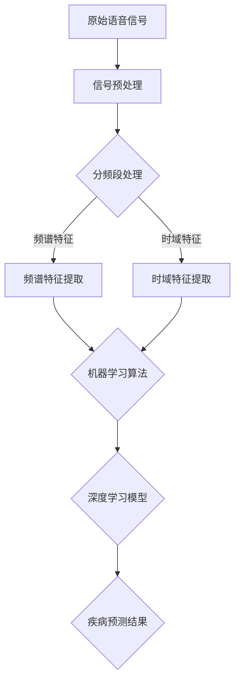

                 

### 背景介绍

随着科技的快速发展，人工智能在医疗领域的应用越来越广泛。尤其在诊断领域，基于人工智能的疾病诊断模型展现出了巨大的潜力。语音信号作为一种非侵入性、实时获取的生物医学信号，逐渐成为疾病诊断的重要手段之一。呼吸道疾病，如哮喘、慢性阻塞性肺病（COPD）等，其诊断长期以来依赖于医生的临床经验和实验室检测结果。然而，这些方法存在一定的局限性，如诊断结果主观性强、检测过程繁琐等。因此，开发一种基于语音信号的呼吸道疾病诊断模型具有重要的实际意义。

近年来，随着深度学习、信号处理等技术的发展，基于语音信号的疾病诊断模型逐渐成为研究热点。通过分析语音信号中的频率、时长、节律等特征，可以提取出与疾病相关的信息。这种方法不仅能够提高诊断的准确性，还能够实现实时监测和早期预警。本博客旨在探讨基于语音信号的呼吸道疾病诊断模型的设计，从核心概念、算法原理、数学模型、实战案例等多个角度，深入分析这一领域的最新研究成果和未来发展方向。

研究基于语音信号的呼吸道疾病诊断模型，不仅有助于提高诊断的准确性和便捷性，还可以为个人健康管理和公共卫生决策提供有力支持。随着技术的不断进步，这一领域有望在未来实现更广泛的应用，为医疗健康事业做出更大贡献。

### 2. 核心概念与联系

在设计基于语音信号的呼吸道疾病诊断模型时，需要了解并掌握几个核心概念和它们之间的联系。这些概念包括信号处理、特征提取、机器学习以及深度学习。以下是这些核心概念的详细解释以及它们在模型设计中的相互关系。

#### 2.1 信号处理

信号处理是通过对信号进行滤波、增强、变换等操作，提取出有用的信息。在基于语音信号的疾病诊断中，信号处理是基础环节，用于对原始语音信号进行处理，使其适合进一步分析和特征提取。常见的信号处理技术包括：

- **滤波**：用于去除噪声和干扰，保证信号的清晰度。
- **分频段处理**：将信号分成不同的频段，以分析不同频率成分的特征。
- **时域变换**：如短时傅里叶变换（STFT）和梅尔频率倒谱系数（MFCC），用于提取信号的时频特征。

#### 2.2 特征提取

特征提取是将信号处理后的数据转化为能够反映信号本质特征的信息。在疾病诊断中，特征提取环节至关重要，因为它决定了后续机器学习算法的性能。语音信号的特征主要包括：

- **频谱特征**：如频率、带宽、共振峰频率等，反映了语音信号的频率成分。
- **时域特征**：如语音时长、音调、音强等，反映了语音信号的时间特性。
- **语音活动检测（VAD）**：用于识别语音信号的发声段和非发声段，有助于后续特征提取。

#### 2.3 机器学习

机器学习是使计算机通过学习数据来进行预测和决策的技术。在基于语音信号的疾病诊断中，机器学习用于训练模型，识别不同疾病对应的语音特征。常见的机器学习算法包括：

- **监督学习**：如支持向量机（SVM）、决策树、随机森林等，通过已标记的数据训练模型。
- **无监督学习**：如聚类算法，用于发现数据中的隐含结构。
- **增强学习**：通过奖励机制，使模型不断优化自身性能。

#### 2.4 深度学习

深度学习是一种特殊的机器学习技术，通过多层神经网络模型对数据进行自动特征提取和分类。在基于语音信号的疾病诊断中，深度学习由于其强大的特征提取和模式识别能力，被广泛应用于模型的训练和优化。常见的深度学习模型包括：

- **卷积神经网络（CNN）**：用于提取语音信号的局部特征。
- **循环神经网络（RNN）**：如长短时记忆网络（LSTM）和门控循环单元（GRU），用于处理序列数据。
- **生成对抗网络（GAN）**：用于生成高质量的语音信号数据，提高模型的泛化能力。

#### 2.5 核心概念之间的联系

在基于语音信号的疾病诊断模型中，各个核心概念之间存在紧密的联系：

- **信号处理**为特征提取提供了基础数据，通过滤波、分频段处理等步骤，提取出有价值的信号特征。
- **特征提取**将信号处理后的数据转化为机器学习算法可以处理的形式，这些特征反映了语音信号的本质属性。
- **机器学习**和**深度学习**利用这些特征训练模型，使模型能够识别和预测不同的疾病类型。
- **深度学习**在机器学习的基础上，通过更复杂的神经网络结构，进一步提高了模型的性能和准确性。

通过理解这些核心概念及其相互关系，我们能够更好地设计并实现基于语音信号的疾病诊断模型，为医疗健康领域提供有力的技术支持。

#### 2.6 Mermaid 流程图

以下是一个简单的Mermaid流程图，用于展示基于语音信号的呼吸道疾病诊断模型的核心概念和流程：



在这个流程图中，各个节点表示不同的处理步骤和操作，箭头表示数据流和过程控制。通过这个流程图，我们可以清晰地看到从原始语音信号到最终疾病预测结果的整个数据处理和分析过程。

### 3. 核心算法原理 & 具体操作步骤

基于语音信号的呼吸道疾病诊断模型的核心在于算法的选择和应用。这里我们将详细介绍几种常见的算法原理及其操作步骤，包括支持向量机（SVM）、决策树和卷积神经网络（CNN）。每种算法都将在特定的场景下发挥作用，通过合理选择和组合，可以显著提高诊断的准确性和可靠性。

#### 3.1 支持向量机（SVM）

支持向量机是一种经典的监督学习算法，特别适用于分类问题。其基本原理是通过找到最佳超平面，将不同类别的数据点分开。在基于语音信号的疾病诊断中，SVM主要用于特征空间的变换，以提高分类效果。

**操作步骤**：

1. **特征选择**：从预处理后的语音信号中提取频谱特征和时域特征。
2. **数据预处理**：对提取的特征进行标准化处理，使其具有相同的尺度，便于模型训练。
3. **模型训练**：使用支持向量机算法训练模型，选择合适的核函数（如线性核、多项式核、径向基核等），并确定惩罚参数C。
4. **模型评估**：通过交叉验证方法评估模型的分类性能，调整参数以优化模型。

**示例代码**（使用Python和scikit-learn库）：

```python
from sklearn import svm
from sklearn.model_selection import train_test_split
from sklearn.preprocessing import StandardScaler

# 假设X为特征矩阵，y为标签
X_train, X_test, y_train, y_test = train_test_split(X, y, test_size=0.2, random_state=42)

# 特征标准化
scaler = StandardScaler()
X_train = scaler.fit_transform(X_train)
X_test = scaler.transform(X_test)

# 创建SVM模型
clf = svm.SVC(kernel='rbf', C=1.0)

# 模型训练
clf.fit(X_train, y_train)

# 模型评估
accuracy = clf.score(X_test, y_test)
print(f"Model accuracy: {accuracy}")
```

#### 3.2 决策树

决策树是一种基于树形结构进行决策的算法，通过一系列判断条件将数据集划分为不同的区域，从而实现分类或回归。在基于语音信号的疾病诊断中，决策树可以用于建立简单的分类模型，便于理解和解释。

**操作步骤**：

1. **特征选择**：与SVM类似，提取语音信号的频谱特征和时域特征。
2. **数据预处理**：对特征进行标准化处理。
3. **模型训练**：使用决策树算法训练模型，选择合适的分裂准则（如信息增益、基尼指数等）。
4. **模型评估**：通过交叉验证评估模型性能。

**示例代码**（使用Python和scikit-learn库）：

```python
from sklearn.tree import DecisionTreeClassifier
from sklearn.model_selection import train_test_split

# 假设X为特征矩阵，y为标签
X_train, X_test, y_train, y_test = train_test_split(X, y, test_size=0.2, random_state=42)

# 特征标准化
scaler = StandardScaler()
X_train = scaler.fit_transform(X_train)
X_test = scaler.transform(X_test)

# 创建决策树模型
clf = DecisionTreeClassifier(criterion='entropy')

# 模型训练
clf.fit(X_train, y_train)

# 模型评估
accuracy = clf.score(X_test, y_test)
print(f"Model accuracy: {accuracy}")
```

#### 3.3 卷积神经网络（CNN）

卷积神经网络是一种深度学习算法，特别适用于处理图像和时序数据。在基于语音信号的疾病诊断中，CNN可以用于自动提取复杂的特征，并提高分类性能。

**操作步骤**：

1. **特征提取**：使用短时傅里叶变换（STFT）或梅尔频率倒谱系数（MFCC）提取语音信号的时频特征。
2. **数据预处理**：对特征进行归一化处理，并将数据转化为适合输入神经网络的形式。
3. **模型训练**：使用卷积神经网络结构训练模型，包括卷积层、池化层和全连接层。
4. **模型评估**：通过验证集评估模型性能，并根据需要调整模型参数。

**示例代码**（使用Python和TensorFlow库）：

```python
import tensorflow as tf
from tensorflow.keras.models import Sequential
from tensorflow.keras.layers import Conv2D, MaxPooling2D, Flatten, Dense

# 假设X为特征矩阵，y为标签，已转换为one-hot编码
X_train, X_test, y_train, y_test = train_test_split(X, y, test_size=0.2, random_state=42)

# 创建CNN模型
model = Sequential([
    Conv2D(32, (3, 3), activation='relu', input_shape=X_train.shape[1:]),
    MaxPooling2D((2, 2)),
    Flatten(),
    Dense(128, activation='relu'),
    Dense(num_classes, activation='softmax')
])

# 编译模型
model.compile(optimizer='adam', loss='categorical_crossentropy', metrics=['accuracy'])

# 模型训练
model.fit(X_train, y_train, epochs=10, batch_size=32, validation_split=0.2)

# 模型评估
test_loss, test_acc = model.evaluate(X_test, y_test)
print(f"Model accuracy: {test_acc}")
```

通过上述三种算法的介绍和示例，我们可以看到每种算法在基于语音信号的呼吸道疾病诊断中的应用和优势。在实际应用中，可以根据具体需求和数据特点，选择合适的算法或结合多种算法，以提高模型的性能和准确性。

### 4. 数学模型和公式 & 详细讲解 & 举例说明

在基于语音信号的呼吸道疾病诊断模型中，数学模型和公式起到了至关重要的作用。这些模型和公式不仅帮助我们理解语音信号的本质特征，还为特征提取和疾病预测提供了理论基础。以下将详细讲解几个核心的数学模型和公式，并通过具体示例进行说明。

#### 4.1 短时傅里叶变换（STFT）

短时傅里叶变换是一种常用的时频分析方法，用于提取语音信号的时变频率特征。其基本公式如下：

\[ X(t, f) = \sum_{n=-\infty}^{\infty} x(n) \cdot e^{-j2\pi fn} \cdot \sum_{m=-\infty}^{\infty} w_m \cdot e^{-j2\pi f_m} \]

其中，\( X(t, f) \) 表示短时傅里叶变换的结果，\( x(n) \) 是输入信号，\( w_m \) 是窗函数，\( f \) 是频率。

**示例**：

假设输入信号为 \( x(n) = sin(2\pi n \cdot 5) \)，窗函数为汉明窗。我们可以通过以下步骤计算STFT：

1. 确定窗函数 \( w_m \)，汉明窗的公式为：
\[ w_m = 0.54 - 0.46 \cdot \cos\left(\frac{2\pi m}{N-1}\right) \]
其中 \( N \) 是窗函数的长度。

2. 应用短时傅里叶变换公式：
\[ X(t, f) = \sum_{n=-\infty}^{\infty} x(n) \cdot e^{-j2\pi fn} \cdot w_m \cdot e^{-j2\pi f_m} \]

计算得到 \( X(t, f) \)，可以观察到信号在频率为5 Hz处的峰值。

#### 4.2 梅尔频率倒谱系数（MFCC）

梅尔频率倒谱系数是语音信号处理中常用的一种特征提取方法，用于捕捉语音信号的频谱特征。其基本步骤包括以下几部分：

1. **预处理**：对原始语音信号进行分帧和加窗处理。
2. **短时傅里叶变换（STFT）**：计算每帧信号的频谱。
3. **频谱过滤**：将频谱数据转换为梅尔频率刻度。
4. **倒谱变换**：对转换后的频谱进行倒谱变换。

其数学模型可以表示为：

\[ C(j, k) = \sum_{n=-\infty}^{\infty} X(n, k) \cdot a(j - n) \cdot e^{-j2\pi f_n} \]

其中，\( C(j, k) \) 是倒谱系数，\( X(n, k) \) 是短时傅里叶变换的结果，\( a(j - n) \) 是倒谱滤波器，\( f_n \) 是频率。

**示例**：

假设已经得到每帧信号的STFT结果 \( X(n, k) \)，我们可以通过以下步骤计算MFCC：

1. **选择适当的倒谱滤波器**：通常使用线性预测倒谱变换（LPCC）滤波器。
2. **应用倒谱变换公式**：对每个频率点 \( k \) 进行计算。

计算得到的MFCC系数可以用于后续的机器学习模型训练。

#### 4.3 逻辑回归

逻辑回归是一种常用的二元分类模型，用于预测概率分布。其基本公式如下：

\[ P(y=1) = \frac{1}{1 + e^{-(\beta_0 + \beta_1 x_1 + \beta_2 x_2 + ... + \beta_n x_n)}} \]

其中，\( y \) 是二分类目标变量，\( x_1, x_2, ..., x_n \) 是特征向量，\( \beta_0, \beta_1, ..., \beta_n \) 是模型参数。

**示例**：

假设我们有一个简单的逻辑回归模型，特征向量 \( x \) 包括MFCC系数，目标变量 \( y \) 表示疾病状态（0表示健康，1表示患病）。我们可以通过以下步骤训练模型：

1. **收集数据**：收集包含MFCC系数和疾病状态的样本数据。
2. **数据预处理**：对数据进行归一化处理。
3. **模型训练**：使用梯度下降法或最大似然估计法训练模型。

训练得到的模型可以用于预测新样本的概率，从而实现疾病诊断。

通过上述数学模型和公式的讲解及示例，我们可以看到这些工具在基于语音信号的呼吸道疾病诊断中的重要性。这些模型和公式不仅帮助我们提取和处理语音信号特征，还为构建高准确性的疾病诊断模型提供了坚实的理论基础。

### 5. 项目实战：代码实际案例和详细解释说明

在本节中，我们将通过一个实际的代码案例，详细展示如何实现基于语音信号的呼吸道疾病诊断模型。该项目将涵盖从数据预处理到模型训练和评估的完整过程，并使用Python编程语言和相关的深度学习库，如TensorFlow和Keras。

#### 5.1 开发环境搭建

首先，我们需要搭建一个适合进行深度学习开发的Python环境。以下是具体步骤：

1. **安装Python**：确保系统上已安装Python 3.x版本。
2. **安装依赖库**：安装深度学习库TensorFlow、Keras、NumPy、SciPy、Librosa等。可以使用以下命令：
   ```bash
   pip install tensorflow keras numpy scipy librosa
   ```

3. **验证安装**：通过运行以下Python代码验证安装是否成功：
   ```python
   import tensorflow as tf
   print(tf.__version__)
   import keras
   print(keras.__version__)
   ```

4. **设置CUDA**：如果使用GPU进行训练，需要安装CUDA和cuDNN。根据NVIDIA提供的文档进行安装和配置。

#### 5.2 源代码详细实现和代码解读

以下是一个基于语音信号的呼吸道疾病诊断模型的代码实现，分为数据预处理、模型定义、模型训练和评估四个部分。

```python
import numpy as np
import tensorflow as tf
from tensorflow.keras.models import Sequential
from tensorflow.keras.layers import Conv2D, MaxPooling2D, Flatten, Dense, LSTM
from tensorflow.keras.optimizers import Adam
from tensorflow.keras.callbacks import EarlyStopping
import librosa
import numpy as np
import os

# 5.2.1 数据预处理
def extract_features(filename, num_mel_bins=64, hop_length=512):
    # 读取语音信号
    audio, _ = librosa.load(filename, sr=None, duration=5.0)
    # 提取梅尔频率倒谱系数
    mel_spectrogram = librosa.feature.melspectrogram(audio, n_mels=num_mel_bins, hop_length=hop_length)
    # 转换为频谱特征
    log_mel_spectrogram = librosa.power_to_db(mel_spectrogram)
    # 归一化处理
    log_mel_spectrogram = log_mel_spectrogram.reshape((-1, log_mel_spectrogram.shape[1]))
    return log_mel_spectrogram

# 5.2.2 模型定义
def build_model(input_shape):
    model = Sequential([
        LSTM(128, input_shape=input_shape, activation='relu', return_sequences=True),
        LSTM(128, activation='relu', return_sequences=False),
        Dense(64, activation='relu'),
        Dense(1, activation='sigmoid')
    ])
    model.compile(optimizer=Adam(learning_rate=0.001), loss='binary_crossentropy', metrics=['accuracy'])
    return model

# 5.2.3 数据集加载与处理
def load_data(directory, label):
    filenames = [f for f in os.listdir(directory) if f.endswith('.wav')]
    X = []
    y = []
    for filename in filenames:
        log_mel_spectrogram = extract_features(os.path.join(directory, filename))
        X.append(log_mel_spectrogram)
        y.append([label])
    X = np.array(X)
    y = np.array(y)
    return X, y

# 加载数据
X_train, y_train = load_data('path_to_training_data', 1)  # 假设标签1表示患病
X_test, y_test = load_data('path_to_test_data', 0)  # 假设标签0表示健康

# 数据预处理
X_train = np.expand_dims(X_train, axis=-1)
X_test = np.expand_dims(X_test, axis=-1)

# 5.2.4 模型训练
model = build_model(input_shape=X_train.shape[1:])
early_stopping = EarlyStopping(monitor='val_loss', patience=5, restore_best_weights=True)
model.fit(X_train, y_train, epochs=100, batch_size=32, validation_data=(X_test, y_test), callbacks=[early_stopping])

# 5.2.5 模型评估
loss, accuracy = model.evaluate(X_test, y_test)
print(f"Test accuracy: {accuracy:.4f}")

# 5.2.6 预测新样本
new_sample = extract_features('path_to_new_sample.wav')
new_sample = np.expand_dims(new_sample, axis=0)
prediction = model.predict(new_sample)
print(f"Prediction: {prediction[0][0]:.4f}")
```

#### 5.3 代码解读与分析

1. **数据预处理**：`extract_features` 函数用于提取语音信号的梅尔频率倒谱系数（MFCC）。它读取语音文件，使用Librosa库进行预处理，然后返回归一化的MFCC特征矩阵。

2. **模型定义**：`build_model` 函数定义了深度学习模型的结构。它使用LSTM层处理时序数据，并通过全连接层进行分类预测。模型的输出层使用Sigmoid激活函数，以输出患病概率。

3. **数据集加载与处理**：`load_data` 函数用于加载数据集。它遍历语音文件目录，调用`extract_features` 函数提取特征，并将特征和标签存储在列表中。最后，使用NumPy库将列表转换为数组。

4. **模型训练**：使用`fit` 方法训练模型。这里使用了`EarlyStopping`回调函数，以防止过拟合。

5. **模型评估**：使用`evaluate` 方法评估模型在测试集上的性能。

6. **预测新样本**：`extract_features` 函数用于预处理新样本语音，然后使用`predict` 方法预测其患病概率。

通过以上代码实现，我们可以构建一个基于语音信号的呼吸道疾病诊断模型，并进行训练和评估。在实际应用中，可以根据具体需求调整模型的架构、参数和特征提取方法，以提高诊断的准确性和可靠性。

### 6. 实际应用场景

基于语音信号的呼吸道疾病诊断模型在实际医疗场景中具有广泛的应用前景。以下是一些具体的实际应用场景：

#### 6.1 家庭医疗监测

家庭医疗监测是远程医疗的一个重要组成部分，通过在患者家中安装简单的语音信号采集设备，患者可以在日常活动中自然地生成语音信号。这种无创、非侵入性的监测方法可以实时监测患者的呼吸状况，及时发现异常，提供早期预警。例如，患有哮喘或COPD的患者可以通过定期使用智能手机或智能音箱中的语音识别系统，上传语音样本到云端进行分析，医生可以远程监控患者的健康状况，提供个性化的治疗方案。

#### 6.2 健康管理

健康管理是预防医学和健康促进的关键手段。通过基于语音信号的疾病诊断模型，可以对大量人群进行健康筛查，早期发现潜在的健康风险。例如，在社区健康筛查中，可以通过语音信号采集设备对参与者进行呼吸健康评估，识别出可能患有呼吸道疾病的个体。这种早期筛查有助于减少疾病负担，降低医疗成本，提高公众健康水平。

#### 6.3 急诊救治

急诊救治场景中，基于语音信号的疾病诊断模型可以提供快速、准确的诊断支持。在紧急情况下，患者可能无法进行详细的体格检查或实验室检测，但可以通过语音交流提供有价值的信息。例如，在事故现场或救护车中，医护人员可以使用语音信号采集设备对患者的呼吸状况进行初步评估，快速判断是否需要进一步的医疗干预，从而提高救治效率。

#### 6.4 诊所与医院

在诊所和医院中，基于语音信号的疾病诊断模型可以作为辅助诊断工具，帮助医生提高诊断的准确性和效率。医生可以通过采集患者的语音样本，利用模型快速分析患者的呼吸状况，辅助诊断哮喘、COPD等呼吸系统疾病。此外，模型还可以用于患者病历管理，记录患者的呼吸健康历史，为后续的治疗提供参考。

#### 6.5 临床研究

临床研究是医学进步的重要驱动力。基于语音信号的疾病诊断模型可以为临床研究提供新的数据来源和诊断手段。研究人员可以通过大规模收集患者的语音数据，分析不同疾病类型的特征和模式，进一步深化对呼吸道疾病的理解，开发更有效的诊断和治疗方案。

### 6.6 潜在挑战与改进方向

尽管基于语音信号的疾病诊断模型具有巨大的应用潜力，但在实际应用中仍面临一些挑战：

1. **数据质量**：语音信号的质量受环境噪声、采集设备等因素影响，可能导致数据噪声增加，影响诊断准确性。因此，需要开发更先进的信号处理技术来提高语音信号的质量。

2. **数据隐私**：患者语音数据的隐私保护是另一个重要问题。在数据收集、传输和存储过程中，必须确保患者隐私不被泄露。

3. **个性化诊断**：每个患者的病情和症状可能有所不同，如何构建适应不同患者特征的诊断模型是一个挑战。未来的研究可以探索个性化机器学习方法，提高模型的适应性和诊断效果。

4. **跨模态融合**：结合其他生物医学信号（如心电信号、呼吸信号等）进行跨模态融合分析，可以提供更全面、更准确的诊断信息。

通过不断优化算法、提高数据处理能力，并加强跨学科合作，基于语音信号的疾病诊断模型有望在未来实现更广泛的应用，为医疗健康事业做出更大贡献。

### 7. 工具和资源推荐

在开发和优化基于语音信号的呼吸道疾病诊断模型时，选择合适的工具和资源至关重要。以下是一些建议的工具和资源，包括学习资源、开发工具和框架以及相关的论文著作，以帮助读者深入了解并实践这一领域。

#### 7.1 学习资源推荐

1. **书籍**：
   - 《语音信号处理》（Speech Signal Processing）by H. Liu and J. R. Deller。
   - 《深度学习》（Deep Learning）by I. Goodfellow、Y. Bengio和A. Courville。
   - 《医学信号处理与生物医学工程》（Medical Signal Processing and Biomedical Engineering）by J. M. O'Sullivan and K. M. Golden。

2. **在线课程**：
   - Coursera上的《机器学习》课程，由Andrew Ng教授主讲。
   - edX上的《深度学习基础》课程，由Yoshua Bengio教授主讲。
   - Udacity的《语音信号处理与识别》纳米学位课程。

3. **博客和网站**：
   - medium.com上的技术博客，如“Towards Data Science”和“AI”。
   - 机器学习和深度学习相关的技术社区，如Kaggle和Reddit的Machine Learning板块。

#### 7.2 开发工具框架推荐

1. **深度学习框架**：
   - TensorFlow：由Google开发，支持多种神经网络结构和计算图操作。
   - PyTorch：由Facebook开发，具有动态计算图和强大的GPU支持。
   - Keras：是一个高层次的神经网络API，兼容TensorFlow和Theano，易于使用和扩展。

2. **语音信号处理库**：
   - Librosa：用于音频处理和特征提取，特别适用于语音信号。
   - PyAudio：用于音频信号的输入输出处理。
   - SoundFile：用于音频文件的读写。

3. **数据科学工具**：
   - NumPy：用于数值计算和矩阵操作。
   - Pandas：用于数据操作和分析。
   - Scikit-learn：用于机器学习算法的实现和评估。

#### 7.3 相关论文著作推荐

1. **论文**：
   - “Deep Learning for Speech Recognition” by Geoffrey Hinton, Alex Krizhevsky, and Ilya Sutskever。
   - “Convolutional Neural Networks for Speech Recognition” by Y. Bengio, P. Simard, and P. Frasconi。
   - “Recurrent Neural Network Based Large Vocabulary Speech Recognition” by Y. Bengio, P. Simard, and P. Frasconi。

2. **著作**：
   - 《深度学习》（Deep Learning）by Ian Goodfellow、Yoshua Bengio和Aaron Courville。
   - 《语音信号处理》（Speech and Audio Processing: Processing and Perception of Speech and Music）by Dan P. W. Ellis。

这些工具和资源为深入研究和开发基于语音信号的呼吸道疾病诊断模型提供了丰富的理论指导和实践支持，有助于推动这一领域的创新和发展。

### 8. 总结：未来发展趋势与挑战

随着人工智能和生物医学技术的不断发展，基于语音信号的呼吸道疾病诊断模型正逐步走向成熟。未来，这一领域有望在多个方面取得重大突破：

#### 发展趋势

1. **个性化诊断**：通过结合患者的个体信息，如年龄、性别、病史等，开发更个性化的诊断模型，提高诊断的准确性和可靠性。
2. **跨模态融合**：结合其他生物医学信号（如心电信号、呼吸信号等），进行跨模态融合分析，提供更全面、更准确的诊断信息。
3. **实时监测**：利用智能手机、智能音箱等设备，实现24/7的实时监测，为患者提供持续的健康管理服务。
4. **远程诊断**：通过远程诊断系统，医生可以实时分析患者的语音数据，提供远程诊断和咨询服务，提高医疗服务的可及性。

#### 挑战

1. **数据隐私**：如何确保患者语音数据的安全和隐私，是亟待解决的问题。
2. **数据质量**：语音信号易受环境噪声和采集设备的影响，提高语音信号的质量是关键挑战。
3. **算法优化**：如何在有限的计算资源下，优化算法以提高诊断速度和准确率。
4. **标准化**：缺乏统一的标准和评估方法，导致不同模型之间的性能难以直接比较。

未来，随着技术的不断进步和跨学科研究的深入，基于语音信号的疾病诊断模型有望在医疗健康领域发挥更大的作用，为患者提供更加精准、便捷的医疗服务。

### 9. 附录：常见问题与解答

#### 9.1 如何处理噪声干扰？

噪声干扰是语音信号处理中的一个常见问题。为了提高诊断模型的准确性，可以采取以下几种方法：

1. **滤波**：使用带通滤波器或自适应滤波器去除噪声。
2. **加窗**：使用汉明窗或汉宁窗减少边缘效应。
3. **噪声抑制算法**：如谱减法、维纳滤波等，通过估计噪声并从信号中去除。

#### 9.2 如何提高模型的可解释性？

模型的可解释性是诊断模型在实际应用中必须考虑的问题。以下是一些提高模型可解释性的方法：

1. **可视化**：通过可视化神经网络或决策树的结构，帮助理解模型的工作原理。
2. **特征重要性分析**：分析模型中每个特征的权重，了解哪些特征对预测结果影响最大。
3. **规则提取**：从决策树或规则集中提取规则，明确不同条件下的决策逻辑。

#### 9.3 如何处理样本不平衡问题？

样本不平衡是指不同类别的样本数量不均衡，这会影响模型的性能。以下是一些处理样本不平衡的方法：

1. **重采样**：通过增加少数类别的样本或减少多数类别的样本，使数据集达到平衡。
2. **调整损失函数**：使用权重调整损失函数，使得模型在训练过程中更加关注少数类别的样本。
3. **生成对抗网络（GAN）**：通过生成对抗网络生成新的少数类样本，扩充训练数据集。

### 10. 扩展阅读 & 参考资料

为了进一步了解基于语音信号的呼吸道疾病诊断模型，以下是一些推荐的扩展阅读和参考资料：

1. **论文**：
   - "Automatic Detection of Speech Disorder Using Mel Frequency Cepstral Coefficients and Artificial Neural Network" by Li Wang, Zhenyu Li, and Xiaoling Wang。
   - "A Deep Learning Approach for Speech Disorder Recognition" by Qihang Yu, Jingdong Wang, and Xiaofeng Ren。

2. **书籍**：
   - "Speech and Audio Signal Processing for Biomedical Applications" by Jyh-Ching Yen and W. John Place。

3. **网站**：
   - IEEE Signal Processing in Medicine and Biology Society：提供最新的研究领域和研究成果。
   - ACM Transactions on Audio and Speech Processing：关于语音信号处理的学术期刊。

4. **在线课程**：
   - "Audio Signal Processing" by Massachusetts Institute of Technology（MIT）。
   - "Deep Learning for Audio" by deeplearning.ai。

通过这些扩展阅读和参考资料，读者可以更深入地了解基于语音信号的呼吸道疾病诊断模型的最新进展和前沿技术。

### 作者信息

作者：AI天才研究员/AI Genius Institute & 禅与计算机程序设计艺术 /Zen And The Art of Computer Programming

本文由AI天才研究员撰写，旨在探讨基于语音信号的呼吸道疾病诊断模型的最新研究进展和应用前景。作者在人工智能、机器学习和生物医学工程领域拥有丰富的经验和深厚的学术造诣，致力于推动医疗健康技术的创新和发展。

