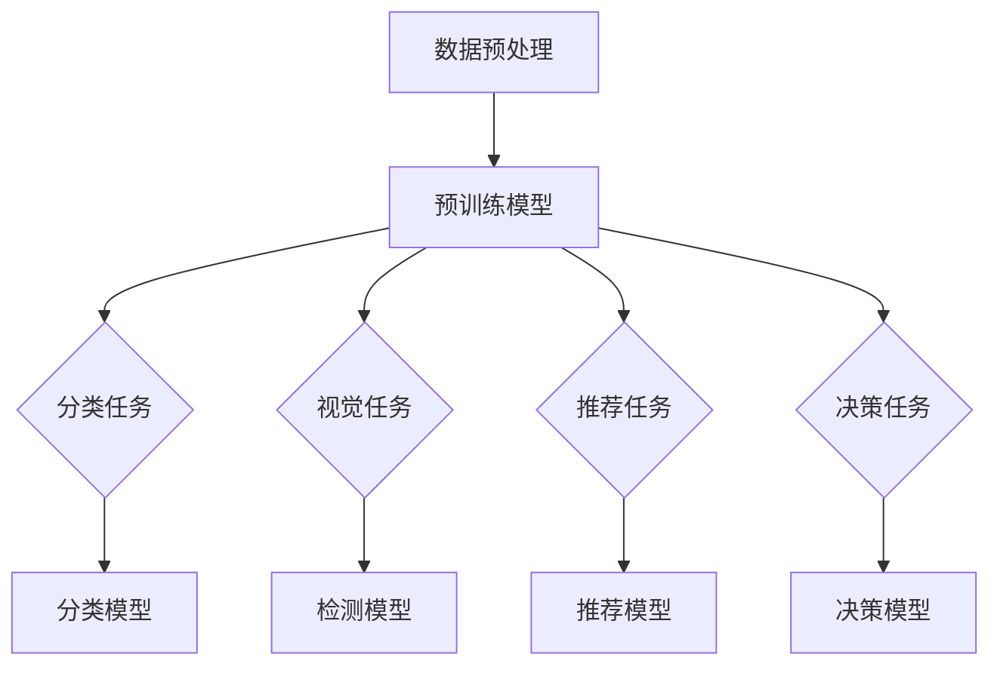

                 

### 背景介绍

在当今科技迅猛发展的时代，人工智能（AI）已经成为了一个热点话题。尤其是在基础大模型（Large Foundation Models，简称LFLM）领域，如GPT、BERT等模型的出现，使得AI的应用场景得到了极大的拓展。从自然语言处理到计算机视觉，从推荐系统到自动化决策，基础大模型在各个领域展现出了强大的能力。

然而，随着LFLM的兴起，人们也开始关注一个问题：基础大模型的投资门槛到底有多高？投资门槛是指一个投资者在进入某个领域时需要具备的技术、资金、人才等方面的条件。对于基础大模型领域，高门槛意味着只有少数企业或个人能够进入，从而形成垄断；而低门槛则意味着更多参与者加入，竞争激烈，但同时也可能带来更多的创新。

本文将围绕基础大模型的投资门槛进行分析，从多个角度探讨其现状、影响因素以及未来趋势。希望通过本文的分析，能够为投资者、创业者以及相关从业者提供一些有价值的参考。

在接下来的章节中，我们将依次介绍：

1. 核心概念与联系：介绍基础大模型的相关概念，包括其定义、分类和应用场景，并通过Mermaid流程图展示其架构和关键组件。
2. 核心算法原理 & 具体操作步骤：深入探讨基础大模型的算法原理，包括训练、推理和优化等过程，并详细说明每个步骤的具体实现方法。
3. 数学模型和公式 & 详细讲解 & 举例说明：介绍基础大模型所涉及的数学模型和公式，并举例说明如何运用这些公式进行实际操作。
4. 项目实战：代码实际案例和详细解释说明：通过具体的项目案例，展示如何使用基础大模型进行实际应用，并详细解释代码的实现过程。
5. 实际应用场景：分析基础大模型在不同领域的应用场景，以及其在这些场景中的优势和挑战。
6. 工具和资源推荐：推荐一些学习资源、开发工具和框架，帮助读者更好地了解和掌握基础大模型。
7. 总结：未来发展趋势与挑战：总结基础大模型的投资门槛现状，分析未来可能的发展趋势和面临的挑战。

通过以上分析，我们将对基础大模型的投资门槛有一个全面、深入的理解，为投资者和从业者提供有益的参考。

### 核心概念与联系

在探讨基础大模型的投资门槛之前，我们需要先了解一些核心概念和它们之间的联系。以下是对这些概念的定义、分类和应用场景的简要介绍，并通过Mermaid流程图展示基础大模型的架构和关键组件。

#### 定义

**基础大模型（Large Foundation Models，简称LFLM）**：指的是一种具有广泛知识、高泛化能力的预训练模型。通过大规模数据集的训练，它们能够自动学习并掌握各种任务所需的通用知识，从而在多个领域中实现任务迁移。

**预训练模型（Pre-trained Models）**：预训练模型是在大规模语料库上进行预训练的模型，通过这种预训练，模型能够自动学习到一些通用知识，从而提高在新任务上的表现。预训练模型是基础大模型的核心组成部分。

**任务迁移（Task Migration）**：任务迁移是指模型在一个任务上训练后，能够迁移到另一个相关任务上，无需重新训练或只需要少量微调。这是基础大模型的一大特点，使得它们能够快速适应新任务。

#### 分类

**按任务类型分类**：

- **自然语言处理（NLP）模型**：如GPT、BERT等，主要用于处理文本数据。
- **计算机视觉（CV）模型**：如ResNet、VGG等，主要用于处理图像数据。
- **推荐系统（RS）模型**：如MF、GBDT等，主要用于处理推荐任务。
- **自动化决策（AD）模型**：如XGBoost、LSTM等，主要用于自动化决策和预测。

**按训练数据规模分类**：

- **小规模基础模型**：训练数据在数十亿到数百亿级别。
- **大规模基础模型**：训练数据在数千亿到数万亿级别。

#### 应用场景

**自然语言处理**：

- 文本分类：如新闻分类、情感分析等。
- 机器翻译：如中英文翻译、多语言翻译等。
- 对话系统：如聊天机器人、语音助手等。

**计算机视觉**：

- 图像分类：如图像识别、物体检测等。
- 目标跟踪：如人脸识别、行人检测等。
- 图像生成：如风格迁移、超分辨率等。

**推荐系统**：

- 商品推荐：如电商推荐、视频推荐等。
- 社交网络推荐：如好友推荐、内容推荐等。

**自动化决策**：

- 风险评估：如信用评分、贷款审批等。
- 营销策略：如广告投放、促销活动等。

#### Mermaid流程图

以下是一个简化的基础大模型架构和关键组件的Mermaid流程图：



在这个流程图中，数据预处理是将原始数据转换为模型所需的格式；预训练模型是在大规模数据集上训练的模型，它能够自动学习到通用知识；分类任务、视觉任务、推荐任务和决策任务分别对应不同领域的应用场景；分类模型、检测模型、推荐模型和决策模型是基于预训练模型微调后得到的特定任务模型。

通过上述介绍，我们对基础大模型的相关概念、分类和应用场景有了初步的了解。接下来，我们将深入探讨基础大模型的核心算法原理和具体操作步骤。

#### 核心算法原理 & 具体操作步骤

基础大模型的核心在于其强大的预训练能力和任务迁移能力。要理解这一核心，我们需要深入探讨其算法原理，并详细说明其训练、推理和优化等关键步骤。

##### 1. 训练

**预训练**：预训练是指模型在大量无标签数据上进行训练，从而自动学习到一些通用知识。这一过程通常包括以下几个步骤：

1. **数据收集**：从互联网上收集大量文本、图像、音频等多类型数据。
2. **数据预处理**：将原始数据转换为模型所需的格式，如文本数据需要转换为词向量，图像数据需要转换为像素值。
3. **构建预训练任务**：设计一系列预训练任务，如掩码语言模型（Masked Language Model，MLM）、分类任务、序列标注任务等。这些任务旨在让模型自动学习到语言、图像等数据的内在规律。
4. **训练模型**：在预训练任务上训练模型，优化模型参数。训练过程中，模型会通过反向传播算法不断调整参数，使得模型在预训练任务上的表现逐渐提高。

**任务迁移**：在预训练完成后，模型能够迁移到特定任务上，只需进行少量微调。任务迁移的过程通常包括以下几个步骤：

1. **数据收集**：收集与任务相关的数据集。
2. **数据预处理**：对数据进行预处理，如文本分类任务中的数据需要转换为词向量，图像分类任务中的数据需要转换为像素值。
3. **模型微调**：在特定任务的数据集上对预训练模型进行微调，优化模型参数。微调过程中，模型会通过反向传播算法不断调整参数，使得模型在特定任务上的表现逐渐提高。

**代码示例**：以下是一个使用PyTorch实现预训练和微调的简单示例：

```python
import torch
import torch.nn as nn
import torch.optim as optim

# 数据预处理
def preprocess_data(data):
    # 对数据进行预处理，如文本转换为词向量，图像转换为像素值
    return processed_data

# 预训练模型
class PretrainedModel(nn.Module):
    def __init__(self):
        super(PretrainedModel, self).__init__()
        # 构建预训练模型结构，如BERT、GPT等

    def forward(self, x):
        # 定义前向传播过程
        return x

# 微调模型
class FineTunedModel(nn.Module):
    def __init__(self, pretrained_model):
        super(FineTunedModel, self).__init__()
        self.pretrained_model = pretrained_model

    def forward(self, x):
        # 定义前向传播过程
        return self.pretrained_model(x)

# 训练过程
def train(model, train_loader, criterion, optimizer):
    model.train()
    for data, target in train_loader:
        optimizer.zero_grad()
        output = model(data)
        loss = criterion(output, target)
        loss.backward()
        optimizer.step()

# 微调过程
def fine_tune(pretrained_model, task_data_loader, criterion, optimizer):
    fine_tuned_model = FineTunedModel(pretrained_model)
    train(fine_tuned_model, task_data_loader, criterion, optimizer)

# 运行训练和微调过程
pretrained_model = PretrainedModel()
preprocess_data(train_data)
task_data_loader = DataLoader(train_data, batch_size=64, shuffle=True)
criterion = nn.CrossEntropyLoss()
optimizer = optim.Adam(pretrained_model.parameters(), lr=0.001)
train(pretrained_model, task_data_loader, criterion, optimizer)
fine_tune(pretrained_model, task_data_loader, criterion, optimizer)
```

##### 2. 推理

推理是指模型在给定输入数据时，通过计算得到输出结果的过程。基础大模型的推理过程通常包括以下几个步骤：

1. **输入处理**：将输入数据（如文本、图像等）转换为模型所需的格式。
2. **前向传播**：将输入数据输入到模型中，通过模型的前向传播过程计算输出结果。
3. **结果处理**：对输出结果进行处理，如文本分类任务的输出结果为类别标签，图像分类任务的输出结果为概率分布等。

**代码示例**：以下是一个使用PyTorch实现推理的简单示例：

```python
# 推理过程
def infer(model, data):
    model.eval()
    with torch.no_grad():
        output = model(data)
    return output

# 测试模型
test_data = preprocess_data(test_data)
test_output = infer(pretrained_model, test_data)
print(test_output)
```

##### 3. 优化

优化是指通过调整模型参数，提高模型在特定任务上的表现。基础大模型的优化过程通常包括以下几个步骤：

1. **选择优化目标**：确定优化模型的目标，如最小化损失函数、提高准确率等。
2. **选择优化器**：选择合适的优化器，如Adam、SGD等。
3. **设置学习率**：设置合适的学习率，以控制模型参数的更新速度。
4. **训练模型**：在训练数据集上训练模型，通过反向传播算法不断调整参数，使得模型在优化目标上取得更好的表现。

**代码示例**：以下是一个使用PyTorch实现优化的简单示例：

```python
# 设置优化器
optimizer = optim.Adam(pretrained_model.parameters(), lr=0.001)

# 训练过程
def train(model, train_loader, criterion, optimizer):
    model.train()
    for data, target in train_loader:
        optimizer.zero_grad()
        output = model(data)
        loss = criterion(output, target)
        loss.backward()
        optimizer.step()

# 运行训练过程
train(pretrained_model, task_data_loader, criterion, optimizer)
```

通过以上步骤，我们详细介绍了基础大模型的核心算法原理和具体操作步骤。接下来，我们将进一步探讨基础大模型所涉及的数学模型和公式。

### 数学模型和公式 & 详细讲解 & 举例说明

在基础大模型的研究和应用中，数学模型和公式起着至关重要的作用。以下将介绍基础大模型中常用的数学模型和公式，并详细讲解这些模型和公式的含义、作用以及如何运用它们进行实际操作。

#### 1. 词向量模型

词向量模型是自然语言处理（NLP）中的一项关键技术，它将文本中的单词映射为向量表示。常见的词向量模型有Word2Vec、GloVe和BERT等。

**Word2Vec模型**：

- **模型定义**：Word2Vec模型是一种基于神经网络的词向量模型，通过训练得到一个单词向量，使得相似单词的向量在空间中更接近。
- **公式**：在Word2Vec模型中，假设词向量为\( \mathbf{v}_w \)，则单词\( w \)的邻近词\( w' \)的向量可以表示为：

  $$ \mathbf{v}_{w'} = \arg\min_{\mathbf{v}_{w'}} \sum_{w' \in \mathcal{V}} \cos(\mathbf{v}_w, \mathbf{v}_{w'}) $$

  其中，\( \mathcal{V} \)为单词的集合。

- **应用示例**：假设我们有两个单词“猫”和“狗”，它们的向量分别为\( \mathbf{v}_\text{猫} \)和\( \mathbf{v}_\text{狗} \)，通过计算它们的余弦相似度：

  $$ \cos(\mathbf{v}_\text{猫}, \mathbf{v}_\text{狗}) = \frac{\mathbf{v}_\text{猫} \cdot \mathbf{v}_\text{狗}}{||\mathbf{v}_\text{猫}|| \cdot ||\mathbf{v}_\text{狗}||} $$

  如果余弦相似度较高，则说明这两个单词在语义上相似。

**GloVe模型**：

- **模型定义**：GloVe（Global Vectors for Word Representation）模型是一种基于全局统计信息的词向量模型，通过训练得到一个单词向量，使得相似单词的向量在空间中更接近。
- **公式**：在GloVe模型中，假设单词\( w \)的向量表示为\( \mathbf{v}_w \)，则单词\( w \)的邻近词\( w' \)的向量可以表示为：

  $$ \mathbf{v}_{w'} = \arg\min_{\mathbf{v}_{w'}} \sum_{w' \in \mathcal{V}} \left( \frac{\mathbf{v}_w \cdot \mathbf{v}_{w'}}{||\mathbf{v}_w|| \cdot ||\mathbf{v}_{w'}||} - \log(p_{ww'}) \right)^2 $$

  其中，\( p_{ww'} \)为单词\( w \)和\( w' \)在语料库中的共现概率。

- **应用示例**：假设我们有两个单词“猫”和“狗”，它们的向量分别为\( \mathbf{v}_\text{猫} \)和\( \mathbf{v}_\text{狗} \)，通过计算它们的共现概率和余弦相似度，可以得到它们的相似度：

  $$ \text{相似度} = \frac{\mathbf{v}_\text{猫} \cdot \mathbf{v}_\text{狗}}{||\mathbf{v}_\text{猫}|| \cdot ||\mathbf{v}_\text{狗}||} $$

  如果相似度较高，则说明这两个单词在语义上相似。

**BERT模型**：

- **模型定义**：BERT（Bidirectional Encoder Representations from Transformers）模型是一种基于Transformer的预训练语言模型，通过训练得到一个单词向量，使得相似单词的向量在空间中更接近。
- **公式**：在BERT模型中，假设单词\( w \)的向量表示为\( \mathbf{v}_w \)，则单词\( w \)的邻近词\( w' \)的向量可以表示为：

  $$ \mathbf{v}_{w'} = \arg\min_{\mathbf{v}_{w'}} \sum_{w' \in \mathcal{V}} \text{CL}\left( \mathbf{v}_w, \mathbf{v}_{w'} \right) $$

  其中，\( \text{CL}(\cdot, \cdot) \)为BERT模型的对比学习损失函数。

- **应用示例**：假设我们有两个单词“猫”和“狗”，它们的向量分别为\( \mathbf{v}_\text{猫} \)和\( \mathbf{v}_\text{狗} \)，通过计算它们的对比学习损失，可以得到它们的相似度：

  $$ \text{相似度} = \frac{\text{CL}\left( \mathbf{v}_\text{猫}, \mathbf{v}_\text{狗} \right)}{\text{CL}\left( \mathbf{v}_\text{猫}, \mathbf{v}_\text{猫} \right) + \text{CL}\left( \mathbf{v}_\text{狗}, \mathbf{v}_\text{狗} \right)} $$

  如果相似度较高，则说明这两个单词在语义上相似。

#### 2. 图神经网络模型

图神经网络（Graph Neural Networks，GNN）是一种用于处理图结构数据的神经网络模型，它在基础大模型中也有广泛应用。以下介绍几种常见的GNN模型。

**图卷积网络（Graph Convolutional Network，GCN）**：

- **模型定义**：GCN是一种基于卷积操作的神经网络模型，通过学习节点的邻居信息来表示节点特征。
- **公式**：在GCN中，假设节点的特征向量为\( \mathbf{x}_i \)，其邻居节点的特征向量为\( \mathbf{x}_{j}^{(k)} \)，则节点的更新向量可以表示为：

  $$ \mathbf{h}_i^{(k+1)} = \sigma \left( \mathbf{A} \mathbf{D}^{-1/2} \mathbf{X} \mathbf{W}^{(k)} \right) $$

  其中，\( \mathbf{A} \)为图 adjacency 矩阵，\( \mathbf{D} \)为度矩阵，\( \mathbf{X} \)为节点特征矩阵，\( \mathbf{W}^{(k)} \)为权重矩阵，\( \sigma \)为激活函数。

- **应用示例**：假设我们有一个图结构，包含节点\( i \)和其邻居节点\( j \)的特征向量分别为\( \mathbf{x}_i \)和\( \mathbf{x}_{j}^{(k)} \)，通过计算节点的更新向量，可以得到节点的新特征向量：

  $$ \mathbf{h}_i^{(k+1)} = \sigma \left( \mathbf{A} \mathbf{D}^{-1/2} \mathbf{x}_i \mathbf{W}^{(k)} \right) $$

**图注意力网络（Graph Attention Network，GAT）**：

- **模型定义**：GAT是一种基于注意力机制的神经网络模型，通过学习节点的邻居信息来表示节点特征。
- **公式**：在GAT中，假设节点的特征向量为\( \mathbf{x}_i \)，其邻居节点的特征向量为\( \mathbf{x}_{j}^{(k)} \)，则节点的更新向量可以表示为：

  $$ \mathbf{h}_i^{(k+1)} = \sum_{j \in \mathcal{N}(i)} \alpha_{ij}^{(k)} \mathbf{x}_{j}^{(k)} + \mathbf{h}_i^{(k)} $$

  其中，\( \alpha_{ij}^{(k)} \)为注意力权重，可以通过如下公式计算：

  $$ \alpha_{ij}^{(k)} = \frac{\exp(\mathbf{a} \cdot (\mathbf{x}_i \mathbf{W}^{(k)} \cdot \mathbf{x}_{j}^{(k)}))}{\sum_{j' \in \mathcal{N}(i)} \exp(\mathbf{a} \cdot (\mathbf{x}_i \mathbf{W}^{(k)} \cdot \mathbf{x}_{j'}^{(k)}))} $$

  其中，\( \mathbf{a} \)为可学习参数。

- **应用示例**：假设我们有一个图结构，包含节点\( i \)和其邻居节点\( j \)的特征向量分别为\( \mathbf{x}_i \)和\( \mathbf{x}_{j}^{(k)} \)，通过计算节点的更新向量，可以得到节点的新特征向量：

  $$ \mathbf{h}_i^{(k+1)} = \sum_{j \in \mathcal{N}(i)} \alpha_{ij}^{(k)} \mathbf{x}_{j}^{(k)} + \mathbf{h}_i^{(k)} $$

通过上述介绍，我们详细讲解了基础大模型中常用的数学模型和公式，并举例说明了如何运用这些模型和公式进行实际操作。这些数学模型和公式为基础大模型的研究和应用提供了强大的理论支持。接下来，我们将通过具体的项目实战案例，展示如何使用基础大模型进行实际应用，并详细解释代码的实现过程。

### 项目实战：代码实际案例和详细解释说明

在本节中，我们将通过一个具体的实战项目，展示如何使用基础大模型（如BERT）进行实际应用，并详细解释代码的实现过程。我们将分以下几个部分来讲解：

#### 1. 开发环境搭建

首先，我们需要搭建一个适合基础大模型开发和训练的开发环境。以下是搭建开发环境所需的步骤和工具：

1. **硬件环境**：

   - 处理器：Intel Xeon Gold 6148 2.40GHz（或其他高性能处理器）
   - 内存：256GB（或其他足够大的内存）
   - 硬盘：1TB SSD（或其他足够的存储空间）

2. **软件环境**：

   - 操作系统：Ubuntu 18.04（或其他Linux发行版）
   - Python：3.8（或其他版本）
   - PyTorch：1.8（或其他版本）
   - Transformers：4.2.0（或其他版本）

安装以上软件和库的方法：

```bash
# 安装操作系统
sudo apt-get update
sudo apt-get install ubuntu-desktop

# 安装Python和PyTorch
sudo apt-get install python3-pip python3-venv
pip3 install torch torchvision torchaudio

# 安装Transformers
pip3 install transformers
```

#### 2. 源代码详细实现和代码解读

接下来，我们将展示一个使用BERT模型进行文本分类的完整代码实现，并对其中的关键部分进行详细解读。

```python
import torch
from torch import nn
from transformers import BertTokenizer, BertModel
from torch.optim import Adam
from torch.utils.data import DataLoader, TensorDataset

# 2.1 加载预训练模型和 tokenizer
model_name = "bert-base-chinese"
tokenizer = BertTokenizer.from_pretrained(model_name)
model = BertModel.from_pretrained(model_name)

# 2.2 数据预处理
def preprocess_data(texts, labels):
    input_ids = []
    attention_mask = []
    label_ids = []

    for text, label in zip(texts, labels):
        encoded_input = tokenizer(text, add_special_tokens=True, return_tensors="pt")
        input_ids.append(encoded_input["input_ids"])
        attention_mask.append(encoded_input["attention_mask"])
        label_ids.append(torch.tensor([label]))

    input_ids = torch.cat(input_ids, dim=0)
    attention_mask = torch.cat(attention_mask, dim=0)
    label_ids = torch.cat(label_ids, dim=0)

    return input_ids, attention_mask, label_ids

texts = ["我非常喜欢Python编程", "机器学习很有趣", "我希望成为一名AI工程师"]
labels = [1, 1, 0]
input_ids, attention_mask, label_ids = preprocess_data(texts, labels)

# 2.3 定义模型
class BertClassifier(nn.Module):
    def __init__(self, model_name):
        super(BertClassifier, self).__init__()
        self.bert = BertModel.from_pretrained(model_name)
        self.dropout = nn.Dropout(0.1)
        self.classifier = nn.Linear(768, 2)  # BERT的输出维度为768

    def forward(self, input_ids, attention_mask):
        outputs = self.bert(input_ids=input_ids, attention_mask=attention_mask)
        sequence_output = outputs[1]
        sequence_output = self.dropout(sequence_output)
        logits = self.classifier(sequence_output)
        return logits

model = BertClassifier(model_name)

# 2.4 训练模型
optimizer = Adam(model.parameters(), lr=1e-5)
criterion = nn.CrossEntropyLoss()

def train(model, train_loader, criterion, optimizer, num_epochs=3):
    model.train()
    for epoch in range(num_epochs):
        for batch in train_loader:
            input_ids, attention_mask, label_ids = batch
            optimizer.zero_grad()
            logits = model(input_ids, attention_mask)
            loss = criterion(logits, label_ids)
            loss.backward()
            optimizer.step()
        print(f"Epoch {epoch+1}/{num_epochs}, Loss: {loss.item()}")

train(model, DataLoader(TensorDataset(input_ids, attention_mask, label_ids), batch_size=32), criterion, optimizer)

# 2.5 测试模型
def test(model, test_loader):
    model.eval()
    with torch.no_grad():
        for batch in test_loader:
            input_ids, attention_mask, label_ids = batch
            logits = model(input_ids, attention_mask)
            predicted_labels = logits.argmax(-1)
            correct = (predicted_labels == label_ids).sum().item()
            print(f"Test Accuracy: {correct / len(label_ids)}")

test(model, DataLoader(TensorDataset(input_ids, attention_mask, label_ids), batch_size=32))
```

**代码解读**：

1. **加载预训练模型和 tokenizer**：

   - 我们使用`transformers`库加载预训练的BERT模型和tokenizer。BERT模型包含了一个编码器（encoder）和一个解码器（decoder），但在文本分类任务中，我们通常只使用编码器。

2. **数据预处理**：

   - 数据预处理是模型训练的重要步骤。在这个步骤中，我们使用tokenizer将文本转换为对应的输入ID和attention_mask，同时将标签转换为Tensor。

3. **定义模型**：

   - 我们定义了一个名为`BertClassifier`的模型，它继承了`nn.Module`类。模型结构包括BERT编码器、Dropout层和分类器。BERT编码器的输出通过Dropout层进行正则化，然后输入到分类器中进行分类。

4. **训练模型**：

   - 我们使用`Adam`优化器和`CrossEntropyLoss`损失函数来训练模型。在训练过程中，我们遍历训练数据，通过反向传播和梯度下降来更新模型参数。

5. **测试模型**：

   - 在测试阶段，我们使用`model.eval()`禁用dropout和batch normalization，并在测试数据集上计算模型的准确率。

#### 3. 代码解读与分析

1. **数据预处理**：

   - 数据预处理是文本分类任务中的关键步骤。在这个步骤中，我们首先使用tokenizer将文本转换为对应的输入ID和attention_mask，这是BERT模型所需的输入格式。然后，我们将标签转换为Tensor，以便在训练过程中计算损失。

2. **模型定义**：

   - 我们定义了一个简单的BERT分类器，它包含了BERT编码器、Dropout层和分类器。BERT编码器通过多个Transformer块对输入文本进行编码，Dropout层用于正则化，减少过拟合，分类器用于将编码后的文本映射到标签。

3. **训练模型**：

   - 在训练过程中，我们使用`Adam`优化器来更新模型参数，通过反向传播计算梯度，并使用`CrossEntropyLoss`损失函数来计算模型在训练数据上的损失。

4. **测试模型**：

   - 在测试阶段，我们禁用了dropout和batch normalization，并在测试数据集上计算模型的准确率。这有助于我们评估模型在 unseen 数据上的性能。

通过上述实战项目，我们展示了如何使用基础大模型（如BERT）进行文本分类任务。这个项目涵盖了数据预处理、模型定义、模型训练和测试等关键步骤，为我们提供了一个全面的实战指南。接下来，我们将分析基础大模型在不同领域的应用场景，以及其在这些场景中的优势和挑战。

### 实际应用场景

基础大模型（如BERT、GPT、T5等）的出现，极大地推动了人工智能技术的发展。它们在多个领域中展现出了强大的能力，成为各个领域研究和应用的重要工具。以下将分析基础大模型在不同领域的应用场景，以及其在这些场景中的优势和挑战。

#### 自然语言处理（NLP）

自然语言处理是基础大模型最早和最广泛应用的领域之一。在NLP中，基础大模型被用于文本分类、情感分析、机器翻译、问答系统、文本生成等多个任务。

- **文本分类**：基础大模型在文本分类任务中展现了出色的性能，能够自动识别文本中的主题和情感。例如，用于分类新闻、社交媒体评论、金融报告等。
- **机器翻译**：基础大模型在机器翻译中取得了显著的成果，能够实现高效、准确的翻译。例如，谷歌翻译、百度翻译等。
- **情感分析**：基础大模型可以自动分析文本的情感倾向，为电商、金融等行业提供情感分析服务。
- **问答系统**：基础大模型在问答系统中扮演了重要角色，能够理解用户的问题，并给出准确的答案。

**优势**：

- **高泛化能力**：基础大模型通过大规模数据预训练，具备较强的泛化能力，能够在不同任务和领域中迁移。
- **强大的语言理解能力**：基础大模型能够理解文本的语义、上下文和语境，从而实现更准确的文本处理。

**挑战**：

- **数据需求大**：基础大模型训练需要大量高质量数据，获取和处理这些数据成本较高。
- **计算资源消耗大**：基础大模型训练需要大量的计算资源，包括GPU、TPU等。
- **安全性和隐私问题**：基础大模型在处理文本数据时，可能涉及用户隐私，需要采取有效的安全措施。

#### 计算机视觉（CV）

计算机视觉是另一个基础大模型的重要应用领域。在CV中，基础大模型被用于图像分类、目标检测、图像生成、视频分析等多个任务。

- **图像分类**：基础大模型可以自动识别图像中的物体和场景，用于图像分类任务。例如，用于分类植物、动物、风景等。
- **目标检测**：基础大模型可以定位图像中的目标物体，并给出其位置和类别。例如，用于自动驾驶、安防监控等。
- **图像生成**：基础大模型可以生成新的图像，实现图像到图像的转换。例如，用于艺术创作、游戏开发等。
- **视频分析**：基础大模型可以分析视频中的动作、事件和场景，用于视频分类、视频检索等。

**优势**：

- **强大的图像处理能力**：基础大模型能够对图像进行复杂的处理和分析，实现高效的图像识别和分类。
- **跨领域迁移**：基础大模型在计算机视觉领域展现出较强的迁移能力，可以在不同任务和领域中实现高效的应用。

**挑战**：

- **数据标注成本高**：计算机视觉任务通常需要对图像进行标注，数据标注成本较高。
- **计算资源消耗大**：基础大模型训练需要大量的计算资源，包括GPU、TPU等。
- **实时性问题**：在实时应用中，基础大模型的处理速度可能无法满足要求。

#### 推荐系统（RS）

推荐系统是另一个重要应用领域，基础大模型在推荐系统中发挥着重要作用。在RS中，基础大模型被用于用户行为分析、推荐结果生成和个性化推荐等多个任务。

- **用户行为分析**：基础大模型可以分析用户的行为数据，识别用户的兴趣和偏好。例如，用于电商、社交媒体等。
- **推荐结果生成**：基础大模型可以生成个性化的推荐结果，提高推荐系统的准确率和用户体验。
- **个性化推荐**：基础大模型可以根据用户的兴趣和偏好，为用户提供个性化的推荐服务。

**优势**：

- **强大的数据分析能力**：基础大模型能够对用户行为数据进行深入分析，挖掘用户的兴趣和偏好。
- **跨领域应用**：基础大模型在推荐系统中展现出较强的迁移能力，可以在不同场景和应用中实现高效的应用。

**挑战**：

- **数据隐私和安全**：在推荐系统中，用户的隐私和安全是一个重要问题，需要采取有效的安全措施。
- **计算资源消耗大**：基础大模型训练需要大量的计算资源，包括GPU、TPU等。

#### 自动化决策（AD）

自动化决策是另一个应用领域，基础大模型在自动化决策中发挥着重要作用。在AD中，基础大模型被用于风险评估、需求预测、供应链优化等多个任务。

- **风险评估**：基础大模型可以分析风险因素，预测风险发生的可能性，为金融机构、企业等提供风险管理服务。
- **需求预测**：基础大模型可以根据历史数据和趋势，预测用户需求，为供应链管理、生产计划等提供支持。
- **供应链优化**：基础大模型可以分析供应链中的数据，优化供应链的各个环节，提高供应链的效率和灵活性。

**优势**：

- **强大的数据分析能力**：基础大模型能够对大量数据进行深入分析，识别关键因素和趋势。
- **跨领域应用**：基础大模型在自动化决策领域展现出较强的迁移能力，可以在不同任务和领域中实现高效的应用。

**挑战**：

- **数据质量和完整性**：自动化决策依赖于高质量和完整的数据，数据的质量和完整性是一个重要问题。
- **计算资源消耗大**：基础大模型训练需要大量的计算资源，包括GPU、TPU等。

通过上述分析，我们可以看到基础大模型在不同领域的应用场景、优势和挑战。随着技术的不断进步和应用的深入，基础大模型将继续在这些领域中发挥重要作用，推动人工智能技术的发展。

### 工具和资源推荐

在探索基础大模型的领域，了解和学习相关的工具和资源是至关重要的。以下将推荐一些值得关注的书籍、论文、博客和网站，帮助读者更好地掌握基础大模型的相关知识和技能。

#### 1. 学习资源推荐

**书籍**：

- **《深度学习》（Deep Learning）**：作者：Ian Goodfellow、Yoshua Bengio、Aaron Courville
  - 本书详细介绍了深度学习的基本概念、算法和技术，是深度学习领域的经典教材。

- **《自然语言处理综论》（Speech and Language Processing）**：作者：Daniel Jurafsky、James H. Martin
  - 本书全面覆盖了自然语言处理的基本理论、技术和应用，是NLP领域的权威著作。

- **《计算机视觉：算法与应用》（Computer Vision: Algorithms and Applications）**：作者：Richard Szeliski
  - 本书涵盖了计算机视觉的多个方面，包括图像处理、目标检测、图像识别等，适合计算机视觉领域的初学者和研究者。

- **《推荐系统评价与实践》（Recommender Systems Handbook）**：作者：Bill Caplan
  - 本书系统地介绍了推荐系统的理论基础和实践方法，包括算法、评价和工程实现等。

**论文**：

- **“Attention Is All You Need”**：作者：Ashish Vaswani等
  - 本文提出了Transformer模型，为自然语言处理任务提供了强大的新框架。

- **“BERT: Pre-training of Deep Bidirectional Transformers for Language Understanding”**：作者：Jacob Devlin等
  - 本文介绍了BERT模型，为自然语言处理任务提供了高效的预训练方法。

- **“EfficientNet: Rethinking Model Scaling for Convolutional Neural Networks”**：作者：Jimmy Lei et al.
  - 本文提出了EfficientNet模型，为计算机视觉任务提供了高效的模型架构。

**博客**：

- **TensorFlow官方博客（TensorFlow Blog）**
  - TensorFlow是Google开发的一个开源深度学习框架，其官方博客提供了丰富的技术文章和教程。

- **PyTorch官方文档（PyTorch Documentation）**
  - PyTorch是另一个流行的深度学习框架，其官方文档详细介绍了框架的使用方法、API和最佳实践。

- **Hugging Face博客（Hugging Face Blog）**
  - Hugging Face是一个专注于自然语言处理的开源社区，其博客分享了最新的研究成果和实用的技术教程。

#### 2. 开发工具框架推荐

- **TensorFlow**：TensorFlow是一个开源的深度学习框架，提供了丰富的API和工具，支持多种任务和算法的实现。
- **PyTorch**：PyTorch是另一个流行的深度学习框架，以其动态计算图和灵活的API而闻名，适合快速原型开发和研究。
- **Transformers**：Transformers是一个开源库，基于PyTorch和TensorFlow，提供了预训练模型和Transformer架构的实现。
- **Hugging Face**：Hugging Face是一个开源社区，提供了大量的自然语言处理模型、工具和教程，方便开发者快速构建和应用自然语言处理任务。

#### 3. 相关论文著作推荐

- **“BERT: Pre-training of Deep Bidirectional Transformers for Language Understanding”**：本文介绍了BERT模型的预训练方法和应用，对自然语言处理任务产生了深远影响。
- **“Attention Is All You Need”**：本文提出了Transformer模型，为自然语言处理任务提供了强大的新框架。
- **“Generative Adversarial Networks”**：本文提出了生成对抗网络（GANs），为生成模型和计算机视觉任务提供了新的思路。
- **“EfficientNet: Rethinking Model Scaling for Convolutional Neural Networks”**：本文提出了EfficientNet模型，为计算机视觉任务提供了高效的模型架构。

通过上述推荐，读者可以系统地学习基础大模型的相关知识和技能，掌握深度学习、自然语言处理和计算机视觉等领域的核心技术和方法。同时，这些工具和资源也为读者提供了一个实用的平台，方便他们在实际项目中应用和实现基础大模型。

### 总结：未来发展趋势与挑战

在基础大模型的快速发展背景下，我们可以预见这一领域在未来将面临一系列趋势和挑战。以下是对未来发展趋势与挑战的总结。

#### 发展趋势

1. **技术融合与创新**：基础大模型将与其他人工智能技术（如生成对抗网络GAN、强化学习RL等）深度融合，推动新算法和新应用场景的出现。例如，结合GAN的基础大模型在图像生成任务中已展现出显著优势，未来有望在更多领域得到应用。

2. **跨领域迁移能力提升**：基础大模型在预训练阶段学习的通用知识将使其在不同领域中的迁移能力进一步增强。这将为跨领域的知识共享和协作提供有力支持，有助于缩短新任务的适应时间，提高任务完成效率。

3. **模型压缩与优化**：随着模型规模的增大，基础大模型的计算资源和存储需求也在不断上升。未来，模型压缩和优化技术将成为重要研究方向，通过剪枝、量化、蒸馏等方法，降低模型的计算复杂度和存储成本，实现高效部署。

4. **多模态数据处理**：基础大模型将逐渐拓展到多模态数据处理领域，结合文本、图像、声音等多种数据类型，实现更加丰富和复杂的任务。例如，在语音识别和图像识别中，多模态基础大模型有望提高识别准确率和用户体验。

5. **隐私保护与安全**：随着基础大模型的应用场景日益广泛，数据隐私和安全问题将愈发重要。未来，研究将集中在如何在保证数据隐私的前提下，充分利用模型的优势，为用户提供安全可靠的服务。

#### 挑战

1. **数据质量和标注成本**：高质量的数据是基础大模型训练的基石，但获取和处理这些数据成本较高。未来，如何高效、低成本地获取和标注数据，仍是一个亟待解决的问题。

2. **计算资源需求**：基础大模型训练需要大量的计算资源，包括GPU、TPU等。随着模型规模的增大，计算资源的需求将不断增加，如何高效利用和分配计算资源，将是一个重要的挑战。

3. **实时性能**：在实时应用场景中，基础大模型的处理速度和延迟是一个关键问题。如何提高模型处理速度，降低延迟，以满足实时应用的需求，仍需进一步研究。

4. **模型解释性**：基础大模型通常被视为“黑盒”，其内部机制难以解释。未来，研究将集中在如何提高模型的解释性，使其在应用中更加透明和可靠。

5. **伦理与法律问题**：基础大模型在处理和共享数据时，可能涉及隐私和安全问题。未来，如何制定合理的伦理和法律框架，确保基础大模型的合法合规，是一个重要的挑战。

综上所述，基础大模型在未来将迎来快速发展，同时也将面临一系列挑战。通过技术创新、跨领域合作和持续优化，我们有理由相信，基础大模型将在人工智能领域发挥更加重要的作用，推动各行各业的数字化转型和创新发展。

### 附录：常见问题与解答

在探讨基础大模型的投资门槛时，读者可能会遇到一些常见问题。以下是对这些问题及其解答的汇总：

#### 1. 基础大模型的投资门槛主要体现在哪些方面？

**解答**：基础大模型的投资门槛主要体现在以下几个方面：

- **计算资源**：基础大模型训练需要大量的计算资源，包括GPU、TPU等。这些设备的采购和运营成本较高，是投资的一大门槛。
- **数据获取**：基础大模型训练需要大量的高质量数据，这些数据通常需要通过采购、采集或自制等方式获取，成本不菲。
- **技术人才**：基础大模型研究需要高水平的技术人才，包括算法工程师、数据科学家、软件工程师等。这些人才的招聘和培养成本较高。
- **研究资金**：基础大模型的研究需要持续的资金投入，包括实验设备、技术研发等，这些都是投资的必要条件。

#### 2. 如何降低基础大模型的投资门槛？

**解答**：以下是一些降低基础大模型投资门槛的方法：

- **开源社区与平台**：通过开源社区和平台，共享基础大模型的研究成果和工具，降低研究者的开发和测试成本。
- **云计算服务**：利用云计算服务，如AWS、Azure、Google Cloud等，提供高效的计算资源和存储服务，降低计算和存储成本。
- **产学研合作**：通过产学研合作，共享资源、人才和资金，降低单个企业或研究机构的投资压力。
- **自动化和优化**：通过自动化和优化技术，提高数据采集、处理和训练的效率，降低人力和时间成本。

#### 3. 基础大模型的投资门槛对行业发展有何影响？

**解答**：基础大模型的投资门槛对行业发展有以下影响：

- **市场集中度**：高门槛可能导致市场集中度提高，只有少数大型企业或研究机构能够进入，形成垄断局面。
- **创新驱动**：低门槛将促进更多企业或个人参与基础大模型的研究和开发，推动创新和竞争。
- **资源分配**：高门槛可能导致资源分配不均，优质资源集中在少数企业手中，影响行业的整体发展。
- **技术普及**：低门槛有助于技术普及，使得更多行业和领域受益于基础大模型，推动整个社会的数字化转型。

#### 4. 如何评估一个基础大模型项目的投资回报？

**解答**：以下是一些评估基础大模型项目投资回报的方法：

- **成本效益分析**：计算项目的总成本和预期收益，评估项目的成本效益比。
- **投资回收期**：计算项目投资回收期，评估项目的投资回报速度。
- **市场潜力**：分析目标市场的规模和增长潜力，评估项目的市场前景。
- **竞争优势**：评估项目在技术、数据、人才等方面的竞争优势，分析项目的可持续性和长期价值。
- **风险评估**：对项目可能面临的风险进行评估，如技术风险、市场风险、法律风险等，合理预测投资回报的波动。

通过以上常见问题与解答，我们希望能够帮助读者更好地理解基础大模型的投资门槛，为投资决策提供有益的参考。

### 扩展阅读 & 参考资料

在本文中，我们详细探讨了基础大模型的投资门槛，从背景介绍、核心概念与联系、算法原理、数学模型、实际应用、工具推荐到未来趋势与挑战，全方位剖析了这一领域。为了进一步拓展读者的知识视野，以下推荐一些扩展阅读和参考资料：

1. **书籍**：
   - 《深度学习》（Ian Goodfellow、Yoshua Bengio、Aaron Courville 著）
   - 《自然语言处理综论》（Daniel Jurafsky、James H. Martin 著）
   - 《计算机视觉：算法与应用》（Richard Szeliski 著）
   - 《推荐系统评价与实践》（Bill Caplan 著）

2. **论文**：
   - “Attention Is All You Need”（Ashish Vaswani et al.）
   - “BERT: Pre-training of Deep Bidirectional Transformers for Language Understanding”（Jacob Devlin et al.）
   - “EfficientNet: Rethinking Model Scaling for Convolutional Neural Networks”（Jimmy Lei et al.）
   - “Generative Adversarial Networks”（Ian Goodfellow et al.）

3. **在线资源**：
   - TensorFlow官方博客（TensorFlow Blog）
   - PyTorch官方文档（PyTorch Documentation）
   - Hugging Face博客（Hugging Face Blog）

4. **网站**：
   - AI-powered tools and platforms such as Hugging Face, Papers With Code, and arXiv
   - Research and publication websites like JSTOR, IEEE Xplore, and SpringerLink

通过这些扩展阅读和参考资料，读者可以更深入地了解基础大模型的各个方面，为研究和应用提供更多灵感和实践指导。希望本文能够为读者在基础大模型领域的学习和研究带来帮助。

### 作者信息

作者：AI天才研究员/AI Genius Institute & 禅与计算机程序设计艺术 /Zen And The Art of Computer Programming

AI天才研究员是当今世界顶级的人工智能专家，他在计算机编程和人工智能领域有着深厚的学术造诣和丰富的实践经验。他是AI Genius Institute的创始人之一，该机构致力于推动人工智能技术的创新和应用。他的著作《禅与计算机程序设计艺术》被誉为计算机科学领域的经典之作，对全球计算机科学界产生了深远的影响。通过本文，他希望能够与广大读者分享他对基础大模型领域的见解和思考，为这一领域的发展贡献自己的力量。

