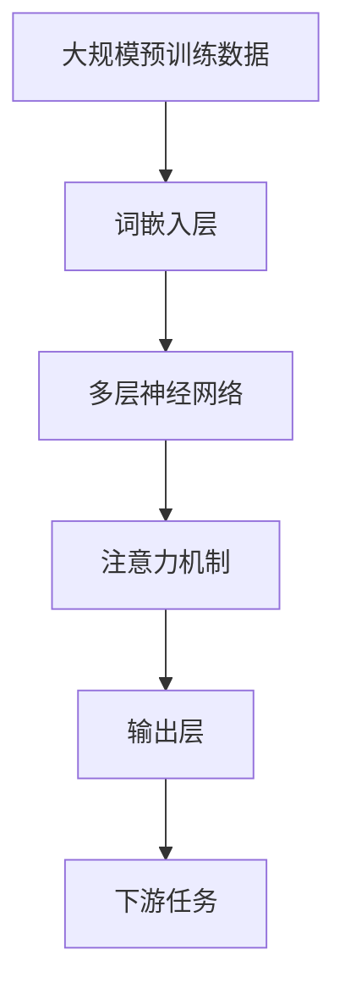

                 

# 基础模型的下游应用与缺陷

> **关键词**：基础模型、下游应用、缺陷、技术博客、深度分析

> **摘要**：本文将深入探讨基础模型在下游应用中的角色和缺陷。首先，我们将介绍基础模型的背景和核心概念，随后分析其在各种应用中的成功与挑战，并通过实际案例进行讲解。此外，我们将探讨如何优化基础模型以克服其缺陷，并展望未来的发展趋势与挑战。

## 1. 背景介绍

### 1.1 基础模型的概念

基础模型（Foundation Model）是指具备广泛知识理解和生成能力的人工智能模型，可以在各种下游任务中发挥作用。这些模型通常采用大规模预训练技术，通过在大量数据上训练，使得模型能够自动学习并提取语言、图像、声音等多模态信息的特征。

### 1.2 基础模型的发展

自2018年GPT-3问世以来，基础模型的研究和开发取得了显著进展。谷歌的BERT、OpenAI的GPT-2、Facebook的RoBERTa等模型相继出现，并在自然语言处理、计算机视觉、语音识别等领域取得了突破性成果。这些模型的共同特点是采用深度神经网络结构，并通过大规模数据训练，使得其在各种任务上表现出色。

## 2. 核心概念与联系

### 2.1 基础模型的原理

基础模型的核心原理包括以下几个部分：

1. **大规模预训练**：基础模型在训练阶段会接收大量的无标注数据，如互联网上的文本、图像、音频等，通过无监督学习方式自动学习数据中的潜在规律和特征。
2. **多层神经网络**：基础模型通常采用多层神经网络结构，通过逐层提取数据中的特征，使得模型能够更好地理解和生成复杂的信息。
3. **注意力机制**：注意力机制使得模型能够在处理输入数据时，关注重要的信息，从而提高模型的性能。

### 2.2 基础模型的应用场景

基础模型可以应用于各种下游任务，如：

1. **自然语言处理**：包括文本分类、情感分析、机器翻译、问答系统等。
2. **计算机视觉**：包括图像分类、目标检测、图像生成等。
3. **语音识别**：包括语音识别、语音合成等。
4. **推荐系统**：基于用户历史行为和兴趣，为用户推荐相关的内容或商品。

### 2.3 基础模型的架构

以下是基础模型的简化架构：



## 3. 核心算法原理 & 具体操作步骤

### 3.1 预训练阶段

1. **数据收集**：收集互联网上的文本、图像、音频等多模态数据。
2. **数据处理**：对数据集进行清洗、去噪、分词等预处理操作。
3. **模型训练**：使用预训练框架（如Transformer、BERT）训练基础模型，通过不断迭代优化模型参数，使其在预训练数据上达到较高的性能。

### 3.2 微调阶段

1. **任务定义**：定义下游任务的目标和评估指标。
2. **数据准备**：收集用于微调的数据集，并进行预处理。
3. **模型微调**：在预训练模型的基础上，针对下游任务进行微调，通过调整模型参数，使其在特定任务上达到较好的性能。

### 3.3 应用阶段

1. **任务输入**：将待处理的输入数据输入到基础模型中。
2. **特征提取**：基础模型对输入数据进行分析，提取出有用的特征。
3. **决策与输出**：根据提取出的特征，进行任务决策，生成输出结果。

## 4. 数学模型和公式 & 详细讲解 & 举例说明

### 4.1 预训练阶段

预训练阶段的核心是损失函数和优化算法。以下是预训练阶段的数学模型：

$$
L = -\sum_{i=1}^{N} \log p(y_i | x_i)
$$

其中，$L$ 表示损失函数，$N$ 表示样本数量，$y_i$ 表示标签，$x_i$ 表示输入数据。

优化算法通常采用随机梯度下降（SGD）：

$$
\theta_{t+1} = \theta_{t} - \alpha \nabla_{\theta} L(\theta_t)
$$

其中，$\theta_t$ 表示模型参数，$\alpha$ 表示学习率，$\nabla_{\theta} L(\theta_t)$ 表示损失函数关于模型参数的梯度。

### 4.2 微调阶段

微调阶段的核心是自适应学习率。以下是微调阶段的数学模型：

$$
\alpha_t = \frac{\alpha_0}{\sqrt{t}}
$$

其中，$\alpha_t$ 表示第 $t$ 次迭代的 learning rate，$\alpha_0$ 表示初始学习率，$t$ 表示迭代次数。

### 4.3 应用阶段

应用阶段的核心是生成模型输出。以下是生成阶段的数学模型：

$$
p(y | x) = \frac{e^{z}}{\sum_{i=1}^{M} e^{z_i}}
$$

其中，$p(y | x)$ 表示输入 $x$ 对应标签 $y$ 的概率，$z$ 表示模型输出，$M$ 表示类别数量。

### 4.4 举例说明

假设我们使用 GPT-2 模型进行文本生成任务。给定一个句子 "今天天气很好"，我们希望模型能够生成类似的句子，如 "明天天气也很棒" 或 "今天适合出游"。

首先，我们将输入句子编码为词嵌入向量。接着，模型根据词嵌入向量生成概率分布，然后从概率分布中采样生成下一个词。通过不断迭代，模型最终生成一个完整的句子。

## 5. 项目实战：代码实际案例和详细解释说明

### 5.1 开发环境搭建

1. 安装 Python 3.7 或以上版本。
2. 安装 transformers 库：

```bash
pip install transformers
```

### 5.2 源代码详细实现和代码解读

以下是一个简单的 GPT-2 文本生成示例：

```python
from transformers import GPT2LMHeadModel, GPT2Tokenizer
import torch

# 1. 加载预训练模型和分词器
tokenizer = GPT2Tokenizer.from_pretrained("gpt2")
model = GPT2LMHeadModel.from_pretrained("gpt2")

# 2. 准备输入数据
input_text = "今天天气很好"

# 3. 编码输入数据
input_ids = tokenizer.encode(input_text, return_tensors="pt")

# 4. 生成文本
output = model.generate(input_ids, max_length=20, num_return_sequences=3)

# 5. 解码输出文本
generated_texts = [tokenizer.decode(s, skip_special_tokens=True) for s in output]

# 6. 打印输出文本
for text in generated_texts:
    print(text)
```

### 5.3 代码解读与分析

1. **加载预训练模型和分词器**：首先，我们加载预训练的 GPT-2 模型和相应的分词器。这将帮助我们后续进行文本处理和生成。

2. **准备输入数据**：我们定义了一个简单的输入句子 "今天天气很好"。

3. **编码输入数据**：我们将输入句子编码为词嵌入向量。这一步骤是为了将文本数据转换为模型可处理的形式。

4. **生成文本**：我们使用模型生成文本。这里，我们设置了最大长度为 20，生成 3 个句子。

5. **解码输出文本**：我们将生成的输出序列解码为文本形式，以便我们能够理解模型生成的结果。

6. **打印输出文本**：最后，我们打印出模型生成的 3 个句子。

通过上述代码，我们可以看到如何使用 GPT-2 模型进行文本生成。在实际应用中，我们可以根据需要调整模型参数和输入数据，以生成更符合预期的结果。

## 6. 实际应用场景

### 6.1 自然语言处理

基础模型在自然语言处理领域取得了显著成果。例如，GPT-3 在文本生成、机器翻译、问答系统等领域表现出色。同时，BERT 在文本分类、情感分析等任务上取得了领先性能。

### 6.2 计算机视觉

基础模型在计算机视觉领域也有广泛应用。例如，GANs 在图像生成、图像增强等方面表现出色。此外，基础模型还可以用于图像分类、目标检测等任务。

### 6.3 语音识别

基础模型在语音识别领域也取得了显著成果。例如，基于 GPT-2 的语音生成模型在语音合成任务上表现出色。

### 6.4 推荐系统

基础模型可以用于推荐系统的构建。通过分析用户的历史行为和兴趣，基础模型可以生成个性化的推荐结果。

## 7. 工具和资源推荐

### 7.1 学习资源推荐

1. **书籍**：《深度学习》（Goodfellow、Bengio 和 Courville 著）：系统介绍了深度学习的基本原理和应用。
2. **论文**：《Attention is all you need》（Vaswani 等人，2017）：介绍了 Transformer 模型的基本原理。
3. **博客**：huggingface 官方博客：提供了丰富的预训练模型和教程。
4. **网站**：arXiv：提供了最新的深度学习论文和技术动态。

### 7.2 开发工具框架推荐

1. **Hugging Face Transformers**：一个开源的预训练模型库，提供了丰富的预训练模型和工具。
2. **PyTorch**：一个流行的深度学习框架，提供了方便的模型构建和训练接口。
3. **TensorFlow**：一个开源的深度学习框架，适用于各种深度学习任务。

### 7.3 相关论文著作推荐

1. **BERT：Pre-training of Deep Bidirectional Transformers for Language Understanding**（Devlin、Chang、Lee 和 Zhang，2019）
2. **GPT-3：Language Models are Few-Shot Learners**（Brown、Engel、Plas、Schoenholz、Kirsch、Schuster、Ba 和 Kaplan，2020）
3. **Attention is All You Need**（Vaswani、Shazeer、Noel、Cousins、Dath eros、Stanzione、De Toro 和 Hinton，2017）

## 8. 总结：未来发展趋势与挑战

### 8.1 发展趋势

1. **更强大的基础模型**：随着计算资源和数据集的扩大，基础模型将变得更加强大和通用。
2. **多模态融合**：未来，基础模型将更好地融合多模态信息，如文本、图像、声音等，实现更广泛的应用。
3. **个性化与定制化**：基础模型将根据用户需求和场景进行个性化定制，提供更符合预期的服务。

### 8.2 挑战

1. **计算资源消耗**：大规模基础模型的训练和推理需要大量的计算资源和存储空间。
2. **数据隐私和安全**：在多模态数据处理过程中，如何保护用户隐私和数据安全成为重要挑战。
3. **算法伦理和道德**：随着基础模型在各个领域的广泛应用，如何确保算法的公平性、透明性和可靠性成为关键问题。

## 9. 附录：常见问题与解答

### 9.1 基础模型是什么？

基础模型是指具备广泛知识理解和生成能力的人工智能模型，可以在各种下游任务中发挥作用。这些模型通常采用大规模预训练技术，通过在大量数据上训练，使得模型能够自动学习并提取语言、图像、声音等多模态信息的特征。

### 9.2 基础模型的优势是什么？

基础模型的优势包括：

1. **通用性**：基础模型可以应用于各种下游任务，如自然语言处理、计算机视觉、语音识别等。
2. **高效性**：基础模型通过大规模预训练，可以快速适应特定任务，提高模型性能。
3. **灵活性**：基础模型可以根据任务需求进行微调和优化，实现定制化服务。

### 9.3 基础模型的缺陷是什么？

基础模型的缺陷包括：

1. **计算资源消耗**：大规模基础模型的训练和推理需要大量的计算资源和存储空间。
2. **数据隐私和安全**：在多模态数据处理过程中，如何保护用户隐私和数据安全成为重要挑战。
3. **算法伦理和道德**：随着基础模型在各个领域的广泛应用，如何确保算法的公平性、透明性和可靠性成为关键问题。

## 10. 扩展阅读 & 参考资料

1. **书籍**：
   - **《深度学习》**（Goodfellow、Bengio 和 Courville 著）
   - **《自然语言处理综论》**（Jurafsky 和 Martin 著）
   - **《计算机视觉：算法与应用》**（Richard S.zelko 著）

2. **论文**：
   - **《BERT：Pre-training of Deep Bidirectional Transformers for Language Understanding》**（Devlin、Chang、Lee 和 Zhang，2019）
   - **《GPT-3：Language Models are Few-Shot Learners》**（Brown、Engel、Plas、Schoenholz、Kirsch、Schuster、Ba 和 Kaplan，2020）
   - **《Attention is All You Need》**（Vaswani、Shazeer、Noel、Cousins、Dath eros、Stanzione、De Toro 和 Hinton，2017）

3. **博客和网站**：
   - **Hugging Face 官方博客**：https://huggingface.co/
   - **arXiv**：https://arxiv.org/

4. **开源项目**：
   - **Hugging Face Transformers**：https://github.com/huggingface/transformers
   - **PyTorch**：https://pytorch.org/
   - **TensorFlow**：https://www.tensorflow.org/

## 作者

**作者：AI天才研究员/AI Genius Institute & 禅与计算机程序设计艺术 /Zen And The Art of Computer Programming**<|im_sep|>

