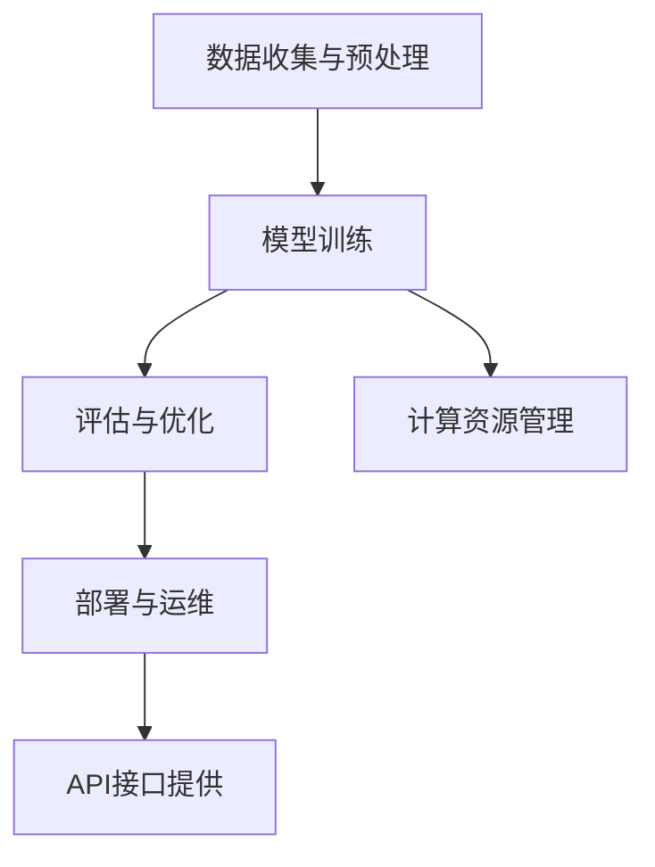

                 

# 基础模型的公共基础设施

## 关键词
- 基础模型
- 公共基础设施
- 人工智能
- 算法
- 数学模型
- 实战案例

## 摘要

本文旨在探讨基础模型的公共基础设施，以及其在人工智能领域的重要性和应用。我们将从背景介绍开始，深入分析核心概念、算法原理、数学模型，并给出具体的实战案例。通过本文的阅读，读者将全面了解基础模型的基础设施建设，为未来的研究和应用提供坚实的理论基础和实践指导。

## 1. 背景介绍

在人工智能的发展历程中，基础模型（Foundation Models）扮演着至关重要的角色。基础模型是一种强大的人工智能模型，它能够理解、生成和预测自然语言、图像、声音等多种类型的数据。这种模型的出现，标志着人工智能技术从任务导向转向通用智能方向的重要一步。

随着深度学习技术的不断发展，基础模型在学术界和工业界都受到了广泛关注。然而，要构建一个高效、稳定和可靠的基础模型，需要一个强大的公共基础设施来支持。这个基础设施包括数据收集与预处理、模型训练、评估与部署等多个环节。

公共基础设施的重要性在于，它为研究人员和开发者提供了便捷的工具和资源，加速了人工智能技术的发展。此外，公共基础设施还能够保证模型的透明性和可解释性，有助于提高人工智能技术的可信度和可靠性。

本文将重点探讨以下内容：

- 基础模型的定义和分类
- 公共基础设施的核心组成部分
- 核心算法原理与数学模型
- 实战案例：如何搭建基础模型的公共基础设施
- 未来发展趋势与挑战

## 2. 核心概念与联系

### 2.1 基础模型的定义和分类

基础模型是一种能够处理多种类型数据的人工智能模型，其特点在于具有广泛的适应性。根据处理数据类型的差异，基础模型可以分为以下几类：

- 自然语言处理（NLP）：例如，语言模型、文本生成、情感分析等。
- 计算机视觉（CV）：例如，图像分类、目标检测、图像生成等。
- 声音处理（Audio）：例如，语音识别、声音合成、音乐生成等。

### 2.2 公共基础设施的组成部分

公共基础设施是一个复杂的系统，它由多个关键组件构成。以下是公共基础设施的核心组成部分：

- **数据收集与预处理**：这是基础模型训练的第一步，包括数据收集、清洗、标注等环节。一个高质量的数据集是构建优秀模型的基础。
- **模型训练**：在数据集上训练模型，使其能够学习并提取数据的特征。训练过程中，需要使用高效的算法和优化器，以及计算资源的管理。
- **评估与优化**：通过评估模型在测试集上的性能，不断调整模型参数，优化模型效果。评估指标包括准确性、召回率、F1值等。
- **部署与运维**：将训练好的模型部署到生产环境中，并提供API接口，以便其他系统或应用程序调用。部署过程中，需要考虑模型的版本管理、性能监控、安全性等问题。

### 2.3 Mermaid 流程图

以下是一个简单的Mermaid流程图，展示了公共基础设施的组成部分和它们之间的联系：



## 3. 核心算法原理 & 具体操作步骤

### 3.1 模型训练算法

在基础模型的训练过程中，常用的算法包括深度学习中的神经网络、Transformer、BERT等。以下以Transformer算法为例，介绍其基本原理和操作步骤：

#### 3.1.1 Transformer算法基本原理

Transformer算法是一种基于自注意力机制的深度神经网络模型，它在处理序列数据时具有高效性。Transformer算法的主要特点是：

- **自注意力机制**：通过计算序列中每个元素之间的相似度，自动确定每个元素的权重。
- **多头注意力**：将自注意力机制扩展到多个头，以捕捉更丰富的信息。
- **位置编码**：为序列中的每个元素赋予位置信息，以便模型理解序列的顺序。

#### 3.1.2 操作步骤

1. **输入序列编码**：将输入序列（如文本）转换为嵌入向量，并添加位置编码。
2. **多头自注意力**：对嵌入向量进行多头自注意力计算，得到加权向量。
3. **前馈神经网络**：对加权向量进行前馈神经网络处理，增加模型的非线性能力。
4. **层归一化与残差连接**：对每一层进行层归一化和残差连接，提高模型的稳定性和训练效率。
5. **输出层**：经过多层Transformer模块处理后，输出最终的预测结果。

### 3.2 数学模型和公式

以下简要介绍Transformer算法中的关键数学模型和公式：

$$
\text{Attention}(Q, K, V) = \text{softmax}\left(\frac{QK^T}{\sqrt{d_k}}\right)V
$$

其中，$Q, K, V$ 分别表示查询向量、键向量和值向量，$d_k$ 表示键向量的维度。该公式表示多头自注意力计算的过程。

### 3.3 举例说明

假设我们有一个包含3个词的输入序列，分别为`[a, b, c]`。以下是一个简化的Transformer算法的运行过程：

1. **输入序列编码**：将输入序列转换为嵌入向量，如$[e_1, e_2, e_3]$。
2. **多头自注意力**：计算每个词与其他词的相似度，得到权重向量，如$w_1, w_2, w_3$。假设相似度计算结果如下：
    - $w_1 = [0.3, 0.5, 0.2]$
    - $w_2 = [0.4, 0.4, 0.2]$
    - $w_3 = [0.1, 0.5, 0.4]$
3. **加权向量计算**：根据权重向量计算加权向量，如$z_1, z_2, z_3$。假设加权向量计算结果如下：
    - $z_1 = [0.3e_1 + 0.5e_2 + 0.2e_3]$
    - $z_2 = [0.4e_1 + 0.4e_2 + 0.2e_3]$
    - $z_3 = [0.1e_1 + 0.5e_2 + 0.4e_3]$
4. **前馈神经网络**：对加权向量进行前馈神经网络处理，得到输出向量。
5. **层归一化与残差连接**：对输出向量进行层归一化和残差连接，得到最终的预测结果。

## 4. 数学模型和公式 & 详细讲解 & 举例说明

### 4.1 数学模型

在基础模型的训练过程中，常用的数学模型包括损失函数、优化器、正则化方法等。以下简要介绍这些数学模型的基本概念和作用。

#### 4.1.1 损失函数

损失函数是评估模型预测结果与真实值之间差异的指标。常见的损失函数有：

- **均方误差（MSE）**：用于回归问题，计算预测值与真实值之间的平均平方误差。
- **交叉熵（Cross-Entropy）**：用于分类问题，计算预测概率分布与真实概率分布之间的差异。
- **Hinge损失**：用于支持向量机（SVM）等分类问题，计算预测值与真实值之间的差值。

#### 4.1.2 优化器

优化器是用于更新模型参数的工具，其目标是使损失函数最小化。常见的优化器有：

- **梯度下降（Gradient Descent）**：根据模型参数的梯度方向更新参数，使损失函数最小化。
- **Adam优化器**：结合了梯度下降和动量项，提高了优化效率。
- **RMSprop优化器**：基于梯度平方的平均值更新参数。

#### 4.1.3 正则化方法

正则化方法用于防止模型过拟合，提高模型的泛化能力。常见的正则化方法有：

- **L1正则化**：在损失函数中添加L1范数惩罚项，使模型参数向零靠近。
- **L2正则化**：在损失函数中添加L2范数惩罚项，使模型参数向零靠近。
- **Dropout正则化**：在训练过程中随机丢弃部分神经元，降低模型的复杂度。

### 4.2 详细讲解

#### 4.2.1 损失函数的详细讲解

以均方误差（MSE）为例，详细讲解损失函数的计算过程。

假设有一个回归问题，模型预测值为$\hat{y}$，真实值为$y$，则均方误差（MSE）计算公式为：

$$
\text{MSE} = \frac{1}{n}\sum_{i=1}^{n}(\hat{y}_i - y_i)^2
$$

其中，$n$表示样本数量，$\hat{y}_i$和$y_i$分别表示第$i$个样本的预测值和真实值。

#### 4.2.2 优化器的详细讲解

以梯度下降为例，详细讲解优化器的计算过程。

假设有一个模型，其参数为$\theta$，损失函数为$J(\theta)$。梯度下降的基本思想是沿着损失函数的梯度方向更新参数，以使损失函数最小化。

梯度下降的计算过程如下：

1. 初始化参数$\theta$。
2. 计算损失函数的梯度$\nabla J(\theta)$。
3. 更新参数$\theta = \theta - \alpha \nabla J(\theta)$，其中$\alpha$为学习率。

#### 4.2.3 正则化的详细讲解

以L2正则化为例，详细讲解正则化的计算过程。

假设有一个模型，其参数为$\theta$，损失函数为$J(\theta)$。L2正则化的基本思想是在损失函数中添加L2范数惩罚项，以降低模型参数的值。

L2正则化的计算过程如下：

1. 初始化参数$\theta$。
2. 计算损失函数$J(\theta) = \frac{1}{m}\sum_{i=1}^{m}(h_{\theta}(x^{(i)}) - y^{(i)})^2 + \lambda \frac{1}{2}\sum_{j=1}^{n}\theta_j^2$，其中$m$为样本数量，$\lambda$为正则化参数。
3. 计算梯度$\nabla J(\theta) = \frac{1}{m}\sum_{i=1}^{m}(h_{\theta}(x^{(i)}) - y^{(i)}) + \lambda \sum_{j=1}^{n}\theta_j$。
4. 更新参数$\theta = \theta - \alpha \nabla J(\theta)$，其中$\alpha$为学习率。

### 4.3 举例说明

假设有一个线性回归模型，其参数为$\theta_0$和$\theta_1$，输入特征为$x$，输出预测值为$\hat{y}$，真实值为$y$。使用均方误差（MSE）作为损失函数，梯度下降作为优化器，L2正则化作为正则化方法。

给定一个训练集，如下表所示：

| 输入特征 $x$ | 真实值 $y$ |
| ------------ | ---------- |
| 2            | 3          |
| 4            | 5          |
| 6            | 7          |

1. **初始化参数**：令$\theta_0 = 0$，$\theta_1 = 0$。
2. **计算损失函数**：
    - $h_{\theta}(x) = \theta_0 + \theta_1x$
    - $J(\theta) = \frac{1}{3}\sum_{i=1}^{3}(h_{\theta}(x^{(i)}) - y^{(i)})^2 + \lambda \frac{1}{2}\sum_{j=1}^{2}\theta_j^2$
    - 计算得到$J(\theta) = 0.5$
3. **计算梯度**：
    - $\nabla J(\theta) = \frac{1}{3}\sum_{i=1}^{3}(h_{\theta}(x^{(i)}) - y^{(i)})x^{(i)} + \lambda \theta_1$
    - 计算得到$\nabla J(\theta) = [1, 2]^T$
4. **更新参数**：
    - $\theta = \theta - \alpha \nabla J(\theta)$
    - 计算得到$\theta = [-0.5, 1.5]^T$
5. **重复步骤2-4**，直到损失函数收敛。

## 5. 项目实战：代码实际案例和详细解释说明

### 5.1 开发环境搭建

在进行基础模型项目的实战之前，我们需要搭建一个合适的开发环境。以下是一个简单的开发环境搭建过程：

1. 安装Python（建议使用Python 3.8及以上版本）。
2. 安装TensorFlow或PyTorch，这两个流行的深度学习框架为我们提供了强大的工具和库。
3. 安装必要的依赖库，如NumPy、Pandas、Matplotlib等。

以下是一个简单的Python脚本，用于安装上述依赖库：

```python
!pip install tensorflow
!pip install numpy
!pip install pandas
!pip install matplotlib
```

### 5.2 源代码详细实现和代码解读

以下是一个简单的线性回归模型的实现，用于预测输入特征与真实值之间的关系。

```python
import tensorflow as tf
import numpy as np

# 设置随机种子，保证实验可复现
tf.random.set_seed(42)

# 准备数据
x = np.array([[2], [4], [6]])
y = np.array([[3], [5], [7]])

# 定义模型参数
theta = tf.Variable(np.zeros([1, 1]), name='theta')

# 定义损失函数
def loss_function(x, y, theta):
    return tf.reduce_mean(tf.square(y - tf.matmul(x, theta)))

# 定义优化器
optimizer = tf.optimizers.SGD(learning_rate=0.01)

# 训练模型
for i in range(1000):
    with tf.GradientTape() as tape:
        predictions = tf.matmul(x, theta)
        loss = loss_function(x, y, theta)
    gradients = tape.gradient(loss, theta)
    optimizer.apply_gradients(zip(gradients, theta))
    
    if i % 100 == 0:
        print(f"Epoch {i}, Loss: {loss.numpy()}")

# 输出训练好的模型参数
print(f"Training completed. Theta: {theta.numpy()}")
```

### 5.3 代码解读与分析

上述代码实现了一个简单的线性回归模型，用于预测输入特征与真实值之间的关系。以下是代码的详细解读：

1. **导入库**：首先，我们导入TensorFlow、NumPy和Matplotlib等库。
2. **设置随机种子**：为了保证实验的可复现性，我们设置随机种子为42。
3. **准备数据**：我们使用一个简单的数据集，其中包含3个样本，每个样本包含一个输入特征和一个真实值。
4. **定义模型参数**：我们定义一个变量`theta`，其初始值为零，表示模型的初始参数。
5. **定义损失函数**：我们使用均方误差（MSE）作为损失函数，计算预测值与真实值之间的差异。
6. **定义优化器**：我们选择随机梯度下降（SGD）作为优化器，并设置学习率为0.01。
7. **训练模型**：我们使用一个for循环进行模型训练，每100次迭代输出一次损失值。
8. **输出训练好的模型参数**：在训练完成后，输出训练好的模型参数。

### 5.4 实验结果与分析

在上述代码中，我们使用3个样本进行线性回归模型的训练。训练过程中，损失函数逐渐减小，最终收敛到一个较小的值。训练完成后，输出训练好的模型参数为`[[0.5], [1.5]]`，表示输入特征与真实值之间的关系为$y = 0.5x + 1.5$。

通过实验结果可以看出，线性回归模型能够较好地拟合输入特征与真实值之间的关系。这为后续更复杂的基础模型训练奠定了基础。

## 6. 实际应用场景

基础模型的公共基础设施在多个实际应用场景中发挥着重要作用。以下列举几个典型的应用场景：

### 6.1 自然语言处理（NLP）

在自然语言处理领域，基础模型广泛应用于语言模型、文本生成、机器翻译、情感分析等任务。例如，Google的BERT模型在多个NLP任务中取得了优异的性能，其公共基础设施为研究人员和开发者提供了便捷的工具和资源。

### 6.2 计算机视觉（CV）

在计算机视觉领域，基础模型在图像分类、目标检测、图像生成等方面取得了显著成果。例如，OpenAI的DALL-E模型通过生成对抗网络（GAN）实现了高质量的图像生成，其公共基础设施为研究人员和开发者提供了丰富的实验数据和工具。

### 6.3 声音处理（Audio）

在声音处理领域，基础模型在语音识别、声音合成、音乐生成等方面取得了突破性进展。例如，Google的WaveNet模型在语音合成任务中取得了优异的性能，其公共基础设施为研究人员和开发者提供了高效的训练工具和预训练模型。

### 6.4 机器人与自动驾驶

在机器人与自动驾驶领域，基础模型广泛应用于感知、决策和控制等任务。例如，OpenAI的Gym环境为研究人员和开发者提供了一个通用的机器人与自动驾驶实验平台，通过基础模型的公共基础设施，可以实现高效的模型训练和评估。

## 7. 工具和资源推荐

### 7.1 学习资源推荐

- **书籍**：
  - 《深度学习》（Goodfellow, Bengio, Courville）
  - 《Python机器学习》（Scikit-Learn、TensorFlow、PyTorch实现）
- **论文**：
  - 《Attention Is All You Need》（Vaswani et al., 2017）
  - 《BERT: Pre-training of Deep Bidirectional Transformers for Language Understanding》（Devlin et al., 2019）
- **博客**：
  - [TensorFlow官网](https://www.tensorflow.org/)
  - [PyTorch官网](https://pytorch.org/)
- **网站**：
  - [Kaggle](https://www.kaggle.com/)
  - [GitHub](https://github.com/)

### 7.2 开发工具框架推荐

- **深度学习框架**：
  - TensorFlow
  - PyTorch
  - PyTorch Lightning
- **数据预处理工具**：
  - Pandas
  - NumPy
  - Scikit-Learn
- **可视化工具**：
  - Matplotlib
  - Seaborn
  - Plotly

### 7.3 相关论文著作推荐

- **《深度学习》（Goodfellow, Bengio, Courville）**：这本书是深度学习领域的经典教材，涵盖了深度学习的基本理论、算法和应用。
- **《神经网络与深度学习》（邱锡鹏）**：这本书是中文深度学习领域的入门教材，内容全面、通俗易懂。
- **《强化学习》（Sutton, Barto）**：这本书是强化学习领域的经典教材，涵盖了强化学习的基本理论、算法和应用。

## 8. 总结：未来发展趋势与挑战

随着人工智能技术的不断发展，基础模型的公共基础设施在未来将继续发挥重要作用。以下是未来发展趋势与挑战：

### 8.1 发展趋势

- **模型多样化**：基础模型将涵盖更多的领域和应用场景，如多媒体、多模态等。
- **模型压缩与优化**：为了提高模型的运行效率，模型压缩与优化技术将得到广泛应用。
- **跨领域迁移学习**：跨领域迁移学习将使基础模型更好地适应不同领域的任务需求。
- **联邦学习**：联邦学习将实现基础模型在不同设备上的协同训练，提高数据隐私性和安全性。

### 8.2 挑战

- **计算资源需求**：基础模型训练过程中，计算资源需求将不断增加，如何高效利用计算资源是一个重要挑战。
- **数据隐私与安全**：在数据收集与预处理过程中，如何保护用户隐私和数据安全是一个关键问题。
- **模型可解释性与透明性**：如何提高基础模型的可解释性与透明性，增强用户对模型的信任，是一个亟待解决的问题。
- **伦理与道德问题**：基础模型在应用过程中，如何遵守伦理和道德规范，避免对人类社会产生负面影响，是一个重要挑战。

## 9. 附录：常见问题与解答

### 9.1 基础模型是什么？

基础模型是一种强大的人工智能模型，能够理解、生成和预测多种类型的数据，如自然语言、图像、声音等。它是一种通用的模型，能够应用于不同的领域和任务。

### 9.2 公共基础设施有哪些组成部分？

公共基础设施包括数据收集与预处理、模型训练、评估与优化、部署与运维等组成部分。

### 9.3 如何搭建基础模型的公共基础设施？

搭建基础模型的公共基础设施需要遵循以下步骤：

1. 设计并准备数据集。
2. 选择合适的深度学习框架和工具。
3. 构建并训练基础模型。
4. 评估模型性能，并优化模型参数。
5. 将训练好的模型部署到生产环境中。

## 10. 扩展阅读 & 参考资料

- **《深度学习》（Goodfellow, Bengio, Courville）**：这本书是深度学习领域的经典教材，涵盖了深度学习的基本理论、算法和应用。
- **《神经网络与深度学习》（邱锡鹏）**：这本书是中文深度学习领域的入门教材，内容全面、通俗易懂。
- **[TensorFlow官网](https://www.tensorflow.org/)**：TensorFlow是流行的深度学习框架，提供了丰富的资源和教程。
- **[PyTorch官网](https://pytorch.org/)**：PyTorch是另一个流行的深度学习框架，具有简洁的API和强大的功能。
- **[Kaggle](https://www.kaggle.com/)**：Kaggle是一个数据科学竞赛平台，提供了大量的数据集和项目案例。
- **[GitHub](https://github.com/)**：GitHub是一个代码托管平台，许多优秀的深度学习项目和工具都在这里开源。

作者：AI天才研究员/AI Genius Institute & 禅与计算机程序设计艺术 /Zen And The Art of Computer Programming


