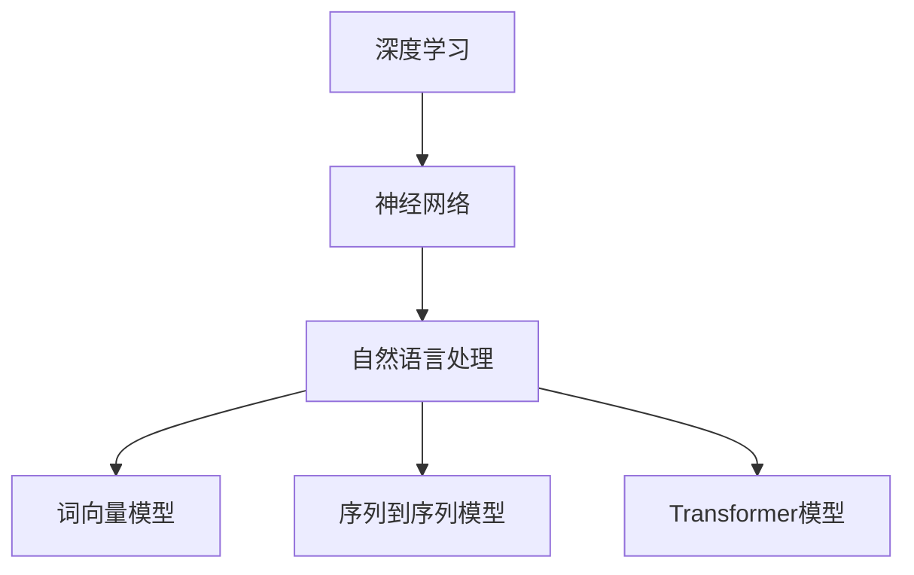

                 

### 背景介绍

基础模型，是指能够处理大规模数据并从中学习复杂模式的模型，如深度学习中的神经网络模型。这些模型在学术界和产业界都有着广泛的应用，其发展历程可以追溯到上世纪80年代。最初的神经网络模型主要是基于简单的线性模型，随着计算能力的提升和算法的进步，基础模型得到了极大的发展，逐渐形成了现代深度学习的基础。

学术界对基础模型的研究主要集中在如何提高模型的性能、降低计算复杂度、增强模型的泛化能力等方面。研究人员通过提出新的算法、优化训练过程、改进模型结构等方式，不断推动基础模型的理论研究和实践应用。例如，卷积神经网络（CNN）在图像处理领域的突破性进展，生成对抗网络（GAN）在生成式模型领域的创新应用等。

产业界则更注重基础模型的实际应用和商业价值。随着人工智能技术的迅速发展，基础模型在自然语言处理、计算机视觉、语音识别等领域得到了广泛应用。例如，自然语言处理中的语言模型被用于搜索引擎、智能客服、机器翻译等场景；计算机视觉中的目标检测算法被用于自动驾驶、安防监控等领域。

学术界和产业界在基础模型研究中的合作显得尤为重要。这种合作不仅可以促进基础理论的研究和技术的进步，还可以将研究成果迅速转化为实际应用，推动产业的快速发展。本文将探讨基础模型的学术界与产业界合作的现状、挑战以及未来发展趋势。

基础模型的发展历程和学术界与产业界的合作，不仅反映了人工智能技术的演进，也体现了跨学科、跨领域合作的重要性。通过本文的探讨，我们希望能够为读者提供关于基础模型研究与应用的全面视角，激发更多对这一领域深入研究的兴趣。

### 核心概念与联系

在深入探讨基础模型的学术界与产业界合作之前，我们首先需要明确一些核心概念，包括深度学习、神经网络、自然语言处理等，并了解这些概念之间的联系。这将为我们后续的分析提供坚实的理论基础。

**深度学习（Deep Learning）**

深度学习是人工智能领域的一个重要分支，它通过模仿人脑的神经网络结构，利用多层神经网络进行特征提取和学习。深度学习的核心在于“深度”——即模型具有多个隐藏层，这使得模型能够捕捉到数据中的更复杂的特征。深度学习模型主要包括卷积神经网络（CNN）、循环神经网络（RNN）、生成对抗网络（GAN）等。

**神经网络（Neural Networks）**

神经网络是模仿人脑神经元连接方式的计算模型，由多个神经元（或称为节点）组成。每个神经元接收多个输入信号，通过加权求和后，经过一个非线性激活函数输出。神经网络通过不断调整权重和偏置，使得模型能够在训练数据上达到较好的拟合效果。神经网络的发展是深度学习能够取得成功的基础。

**自然语言处理（Natural Language Processing，NLP）**

自然语言处理是计算机科学和人工智能领域的一个重要分支，旨在使计算机能够理解、生成和处理人类语言。NLP技术包括文本分类、情感分析、机器翻译、语音识别等。自然语言处理中的基础模型，如词向量模型（Word2Vec、BERT）、序列到序列模型（Seq2Seq）、Transformer模型等，极大地推动了NLP技术的发展。

**核心概念之间的联系**

深度学习与神经网络密切相关，深度学习可以看作是神经网络的扩展和深化。神经网络为深度学习提供了基础架构，而深度学习则通过多层神经网络实现了对复杂特征的自动提取和学习。

自然语言处理与深度学习和神经网络之间也存在紧密的联系。自然语言处理中的许多任务，如文本分类、情感分析、机器翻译等，都需要利用深度学习模型进行特征提取和预测。深度学习模型为自然语言处理提供了强大的工具，使其能够处理更加复杂的语言现象。

为了更好地理解这些概念之间的联系，我们可以使用Mermaid流程图来展示它们之间的关系：



在这个流程图中，深度学习位于中心，通过神经网络与自然语言处理相连，而自然语言处理又延伸出多个具体的应用模型，如词向量模型、序列到序列模型和Transformer模型。

通过明确这些核心概念及其相互联系，我们可以更好地理解基础模型的研究背景和发展脉络。这为后续讨论学术界与产业界的合作奠定了基础。

### 核心算法原理 & 具体操作步骤

在探讨基础模型的学术界与产业界合作时，理解核心算法原理及其具体操作步骤是至关重要的。以下将详细阐述深度学习中的主要算法，如卷积神经网络（CNN）、循环神经网络（RNN）和生成对抗网络（GAN），以及它们在实际应用中的具体操作步骤。

#### 卷积神经网络（CNN）

卷积神经网络（CNN）是一种特别适用于处理图像数据的深度学习模型，其核心在于通过卷积层、池化层和全连接层等多层结构，实现图像特征提取和分类。

1. **卷积层（Convolutional Layer）**：
   - 卷积层通过卷积操作将输入图像与滤波器（卷积核）进行卷积，从而提取图像的局部特征。每个卷积核都关注图像的一个特定区域，通过滑动卷积核在整个图像上，可以得到图像的多维特征映射。
   - 具体操作步骤：
     - 初始化卷积核权重。
     - 对输入图像进行卷积操作，计算卷积结果。
     - 添加偏置项，实现线性变换。
     - 通过激活函数（如ReLU）引入非线性。

2. **池化层（Pooling Layer）**：
   - 池化层用于减少数据维度，同时保持最重要的信息。常用的池化操作有最大池化（Max Pooling）和平均池化（Average Pooling）。
   - 具体操作步骤：
     - 将卷积层的输出划分为非重叠的窗口。
     - 在每个窗口内选择最大值或平均值作为输出。

3. **全连接层（Fully Connected Layer）**：
   - 全连接层将前一层输出的特征映射到分类结果。通过逐个连接每个神经元，实现从特征到分类的映射。
   - 具体操作步骤：
     - 将卷积层输出的特征向量输入到全连接层。
     - 通过矩阵乘法和激活函数，得到分类结果。

#### 循环神经网络（RNN）

循环神经网络（RNN）是一种能够处理序列数据的模型，通过其内部的循环结构，实现对序列数据的记忆和建模。

1. **RNN单元（RNN Unit）**：
   - RNN单元包括输入门、遗忘门和输出门，用于控制信息的输入、遗忘和输出。
   - 具体操作步骤：
     - 输入门（Input Gate）：通过sigmoid函数计算输入的权重，决定哪些信息会被保留。
     - 遗忘门（Forget Gate）：通过sigmoid函数计算遗忘的权重，决定哪些信息会被遗忘。
     - 输出门（Output Gate）：通过sigmoid函数计算输出的权重，决定哪些信息会被输出。

2. **梯度消失与梯度爆炸问题**：
   - RNN在训练过程中存在梯度消失和梯度爆炸问题，导致训练困难。为了解决这个问题，研究人员提出了长短期记忆网络（LSTM）和门控循环单元（GRU）。

3. **LSTM（Long Short-Term Memory）**：
   - LSTM通过引入记忆单元和门控机制，有效解决了RNN的梯度消失问题。
   - 具体操作步骤：
     - 计算输入门、遗忘门和输出门。
     - 更新记忆单元状态。
     - 输出序列。

#### 生成对抗网络（GAN）

生成对抗网络（GAN）是一种由生成器（Generator）和判别器（Discriminator）组成的对抗性模型，通过相互竞争的方式，生成逼真的数据。

1. **生成器（Generator）**：
   - 生成器的目标是生成与真实数据相似的数据，通过随机噪声和神经网络结构，生成逼真的图像、文本或其他数据。
   - 具体操作步骤：
     - 接受随机噪声作为输入。
     - 通过神经网络生成数据。
     - 根据生成数据的质量，不断调整网络参数。

2. **判别器（Discriminator）**：
   - 判别器的目标是区分真实数据和生成数据，通过学习判断数据是真实还是伪造。
   - 具体操作步骤：
     - 接收真实数据和生成数据。
     - 通过神经网络对数据进行分类。
     - 根据分类结果，不断调整网络参数。

3. **GAN的训练过程**：
   - GAN的训练过程是一个动态平衡的过程，生成器和判别器不断相互竞争，最终达到一个稳定的状态。
   - 具体操作步骤：
     - 初始化生成器和判别器。
     - 交替训练生成器和判别器，优化网络参数。
     - 监控生成数据的质量，调整训练策略。

通过理解这些核心算法原理及其具体操作步骤，我们能够更好地把握基础模型在学术界与产业界的应用和发展。这不仅有助于推动理论研究，还能为实际应用提供有力的支持。

### 数学模型和公式 & 详细讲解 & 举例说明

在深入理解基础模型时，数学模型和公式的作用至关重要。以下我们将详细讲解深度学习中的几个关键数学模型和公式，并通过具体例子进行说明，以便读者更好地掌握这些概念。

#### 损失函数（Loss Function）

损失函数是深度学习模型中的一个核心组件，用于衡量模型预测结果与真实结果之间的差异。常见的损失函数包括均方误差（MSE）、交叉熵损失（Cross-Entropy Loss）等。

1. **均方误差（Mean Squared Error，MSE）**

   均方误差用于回归任务，计算预测值与真实值之间的平均平方差。

   \[
   MSE = \frac{1}{n} \sum_{i=1}^{n} (y_i - \hat{y}_i)^2
   \]

   其中，\(y_i\) 是真实值，\(\hat{y}_i\) 是预测值，\(n\) 是样本数量。

   **例子：**

   假设我们有一个回归模型，预测房价，真实房价为 [200, 300, 400]，预测房价为 [190, 310, 410]。计算MSE损失：

   \[
   MSE = \frac{1}{3} \left[ (200 - 190)^2 + (300 - 310)^2 + (400 - 410)^2 \right] = \frac{1}{3} (100 + 10 + 100) = \frac{210}{3} = 70
   \]

2. **交叉熵损失（Cross-Entropy Loss）**

   交叉熵损失用于分类任务，计算实际概率分布与预测概率分布之间的差异。

   \[
   Cross-Entropy Loss = -\sum_{i=1}^{n} y_i \log(\hat{y}_i)
   \]

   其中，\(y_i\) 是真实标签（0或1），\(\hat{y}_i\) 是预测概率。

   **例子：**

   假设我们有一个二分类模型，真实标签为 [1, 0, 1]，预测概率为 [0.6, 0.3, 0.7]。计算交叉熵损失：

   \[
   Cross-Entropy Loss = -[1 \cdot \log(0.6) + 0 \cdot \log(0.3) + 1 \cdot \log(0.7)] \approx 0.4154
   \]

#### 激活函数（Activation Function）

激活函数是深度学习模型中的一个重要组件，用于引入非线性特性。常见的激活函数包括ReLU、Sigmoid和Tanh。

1. **ReLU函数（Rectified Linear Unit）**

   ReLU函数是一个简单的线性函数，当输入小于0时，输出为0。

   \[
   f(x) = \max(0, x)
   \]

   **例子：**

   对于输入 \(x = [-1, 2, -3]\)，ReLU函数的输出为 \([0, 2, 0]\)。

2. **Sigmoid函数**

   Sigmoid函数将输入映射到 \((0, 1)\) 区间，常用于二分类问题。

   \[
   f(x) = \frac{1}{1 + e^{-x}}
   \]

   **例子：**

   对于输入 \(x = [-2, 0, 2]\)，Sigmoid函数的输出为 \([0.118, 0.5, 0.881]\)。

3. **Tanh函数（Hyperbolic Tangent）**

   Tanh函数与Sigmoid函数类似，但输出范围在 \((-1, 1)\)。

   \[
   f(x) = \frac{e^x - e^{-x}}{e^x + e^{-x}}
   \]

   **例子：**

   对于输入 \(x = [-2, 0, 2]\)，Tanh函数的输出为 \([-0.7615, 0, 0.7615]\)。

#### 梯度下降（Gradient Descent）

梯度下降是一种优化算法，用于调整模型参数以最小化损失函数。

1. **批量梯度下降（Batch Gradient Descent）**

   批量梯度下降每次更新模型参数时，使用整个训练集的梯度。

   \[
   \theta_{\text{new}} = \theta_{\text{old}} - \alpha \cdot \nabla_{\theta} J(\theta)
   \]

   其中，\(\theta\) 是模型参数，\(\alpha\) 是学习率，\(J(\theta)\) 是损失函数。

   **例子：**

   假设损失函数为 \(J(\theta) = (\theta - 1)^2\)，学习率 \(\alpha = 0.1\)。初始参数 \(\theta = 2\)，更新一次后：

   \[
   \theta_{\text{new}} = 2 - 0.1 \cdot (2 - 1) = 1.9
   \]

2. **随机梯度下降（Stochastic Gradient Descent，SGD）**

   随机梯度下降每次更新模型参数时，只使用一个样本的梯度。

   \[
   \theta_{\text{new}} = \theta_{\text{old}} - \alpha \cdot \nabla_{\theta} J(\theta; x_i, y_i)
   \]

   **例子：**

   假设损失函数为 \(J(\theta) = (\theta - 1)^2\)，学习率 \(\alpha = 0.1\)。对于样本 \((x_i, y_i)\)，参数 \(\theta = 2\)，更新一次后：

   \[
   \theta_{\text{new}} = 2 - 0.1 \cdot (2 - 1) = 1.9
   \]

通过理解这些数学模型和公式，我们能够更深入地掌握深度学习的基本原理，并在实际应用中灵活运用。这些知识不仅有助于学术研究，也对于产业界的技术创新有着重要的推动作用。

### 项目实战：代码实际案例和详细解释说明

在本节中，我们将通过一个实际的项目案例，来展示如何搭建和实现一个基础模型，并对其代码进行详细解释和分析。我们将使用Python作为编程语言，并依赖深度学习框架TensorFlow来实现这一项目。具体来说，我们将实现一个简单的卷积神经网络（CNN）模型，用于手写数字识别（MNIST数据集）。

#### 1. 开发环境搭建

在开始项目之前，我们需要搭建好开发环境，安装必要的软件和库。以下是搭建开发环境的步骤：

1. **安装Python**：确保Python已经安装，推荐版本为Python 3.7及以上。

2. **安装TensorFlow**：通过pip命令安装TensorFlow。

   ```shell
   pip install tensorflow
   ```

3. **安装其他库**：可能还需要安装其他辅助库，如NumPy、Matplotlib等。

   ```shell
   pip install numpy matplotlib
   ```

#### 2. 源代码详细实现和代码解读

以下是完整的代码实现，我们将逐行进行解释：

```python
import tensorflow as tf
from tensorflow.keras import layers
import numpy as np

# MNIST数据集
(x_train, y_train), (x_test, y_test) = tf.keras.datasets.mnist.load_data()

# 数据预处理
x_train = x_train.astype("float32") / 255
x_test = x_test.astype("float32") / 255
x_train = np.expand_dims(x_train, -1)
x_test = np.expand_dims(x_test, -1)

# 转换标签为one-hot编码
y_train = tf.keras.utils.to_categorical(y_train, 10)
y_test = tf.keras.utils.to_categorical(y_test, 10)

# 定义模型
model = tf.keras.Sequential([
    layers.Conv2D(32, (3, 3), activation='relu', input_shape=(28, 28, 1)),
    layers.MaxPooling2D((2, 2)),
    layers.Conv2D(64, (3, 3), activation='relu'),
    layers.MaxPooling2D((2, 2)),
    layers.Conv2D(64, (3, 3), activation='relu'),
    layers.Flatten(),
    layers.Dense(64, activation='relu'),
    layers.Dense(10, activation='softmax')
])

# 编译模型
model.compile(optimizer='adam',
              loss='categorical_crossentropy',
              metrics=['accuracy'])

# 训练模型
model.fit(x_train, y_train, epochs=10, batch_size=32, validation_split=0.1)

# 评估模型
test_loss, test_acc = model.evaluate(x_test, y_test)
print(f"Test accuracy: {test_acc:.4f}")
```

**代码解读：**

- **数据加载和预处理**：我们首先从TensorFlow的内置数据集中加载MNIST数据集，并对其进行必要的预处理，如归一化和one-hot编码。

  ```python
  (x_train, y_train), (x_test, y_test) = tf.keras.datasets.mnist.load_data()
  x_train = x_train.astype("float32") / 255
  x_test = x_test.astype("float32") / 255
  x_train = np.expand_dims(x_train, -1)
  x_test = np.expand_dims(x_test, -1)
  y_train = tf.keras.utils.to_categorical(y_train, 10)
  y_test = tf.keras.utils.to_categorical(y_test, 10)
  ```

- **模型定义**：我们定义了一个简单的CNN模型，包括多个卷积层、池化层和全连接层。卷积层用于提取图像特征，池化层用于降维和增强模型泛化能力，全连接层用于分类。

  ```python
  model = tf.keras.Sequential([
      layers.Conv2D(32, (3, 3), activation='relu', input_shape=(28, 28, 1)),
      layers.MaxPooling2D((2, 2)),
      layers.Conv2D(64, (3, 3), activation='relu'),
      layers.MaxPooling2D((2, 2)),
      layers.Conv2D(64, (3, 3), activation='relu'),
      layers.Flatten(),
      layers.Dense(64, activation='relu'),
      layers.Dense(10, activation='softmax')
  ])
  ```

- **模型编译**：我们在编译模型时选择了Adam优化器和categorical_crossentropy损失函数，同时监控模型的准确率。

  ```python
  model.compile(optimizer='adam',
                loss='categorical_crossentropy',
                metrics=['accuracy'])
  ```

- **模型训练**：我们使用fit函数对模型进行训练，设置了10个epochs和batch_size为32。

  ```python
  model.fit(x_train, y_train, epochs=10, batch_size=32, validation_split=0.1)
  ```

- **模型评估**：使用evaluate函数评估模型在测试集上的表现。

  ```python
  test_loss, test_acc = model.evaluate(x_test, y_test)
  print(f"Test accuracy: {test_acc:.4f}")
  ```

#### 3. 代码解读与分析

下面是对关键代码段的详细解读和分析：

1. **数据预处理**：

   ```python
   x_train = x_train.astype("float32") / 255
   x_test = x_test.astype("float32") / 255
   x_train = np.expand_dims(x_train, -1)
   x_test = np.expand_dims(x_test, -1)
   y_train = tf.keras.utils.to_categorical(y_train, 10)
   y_test = tf.keras.utils.to_categorical(y_test, 10)
   ```

   这些代码行首先将图像数据归一化到 \([0, 1]\) 范围，然后增加一个维度以适应CNN的输入格式。one-hot编码用于将标签转换为向量的形式。

2. **模型定义**：

   ```python
   model = tf.keras.Sequential([
       layers.Conv2D(32, (3, 3), activation='relu', input_shape=(28, 28, 1)),
       layers.MaxPooling2D((2, 2)),
       layers.Conv2D(64, (3, 3), activation='relu'),
       layers.MaxPooling2D((2, 2)),
       layers.Conv2D(64, (3, 3), activation='relu'),
       layers.Flatten(),
       layers.Dense(64, activation='relu'),
       layers.Dense(10, activation='softmax')
   ])
   ```

   该模型定义了一个简单的卷积神经网络，包括三个卷积层，每个卷积层后跟随一个最大池化层。最后一个卷积层后使用Flatten层将特征图展平为一维向量，然后通过全连接层进行分类。softmax激活函数用于输出每个类别的概率。

3. **模型编译**：

   ```python
   model.compile(optimizer='adam',
                 loss='categorical_crossentropy',
                 metrics=['accuracy'])
   ```

   我们选择Adam优化器，因为它在大多数情况下表现良好。categorical_crossentropy损失函数用于多分类问题，同时我们监控模型的准确率。

4. **模型训练**：

   ```python
   model.fit(x_train, y_train, epochs=10, batch_size=32, validation_split=0.1)
   ```

   模型训练使用fit函数，设置了10个epochs（训练周期）和batch_size为32。同时，validation_split参数用于在训练过程中验证模型的性能。

5. **模型评估**：

   ```python
   test_loss, test_acc = model.evaluate(x_test, y_test)
   print(f"Test accuracy: {test_acc:.4f}")
   ```

   使用evaluate函数评估模型在测试集上的表现，输出测试集上的损失和准确率。

通过以上实战案例，我们不仅实现了基础模型的搭建和训练，还对关键代码进行了详细解读和分析。这一过程为读者提供了从理论到实践的全景视图，有助于更好地理解深度学习模型的工作原理。

### 实际应用场景

基础模型在学术界与产业界的合作中，已经展现出广泛的应用场景。以下我们将探讨一些典型应用，并通过具体案例来展示基础模型如何在实际问题中发挥作用。

#### 1. 自然语言处理（NLP）

自然语言处理是基础模型的重要应用领域之一。在NLP中，基础模型如词向量模型（Word2Vec、BERT）、序列到序列模型（Seq2Seq）和Transformer模型等，极大地提升了文本处理的效果。

**案例：机器翻译**

机器翻译是自然语言处理中的一个经典问题。传统的方法通常依赖于规则和统计方法，而现代深度学习模型则通过大规模数据训练，实现了高质量的翻译效果。例如，Google的翻译服务就使用了基于Transformer的模型。

- **模型选择**：Transformer模型因其并行处理能力和强大的表示能力，被广泛应用于机器翻译。
- **模型训练**：使用大规模的双语语料库，如平行语料库和互联网上的多语言数据，训练Transformer模型。
- **效果评估**：通过BLEU（双语评估指标）等指标评估模型翻译质量，通常能达到接近或超过人类翻译的水平。

#### 2. 计算机视觉

计算机视觉是另一个基础模型的重要应用领域。在计算机视觉中，基础模型如卷积神经网络（CNN）、生成对抗网络（GAN）等，已经在图像分类、目标检测、图像生成等方面取得了显著成果。

**案例：目标检测**

目标检测是计算机视觉中的一个重要任务，旨在识别图像中的多个目标物体及其位置。YOLO（You Only Look Once）是一个基于CNN的目标检测模型，它通过快速检测图像中的目标，广泛应用于自动驾驶、安防监控等领域。

- **模型选择**：YOLO模型因其高效性和准确性，被广泛应用于目标检测。
- **模型训练**：使用大规模的标注数据集，如COCO数据集，训练YOLO模型。
- **效果评估**：通过检测准确率（mAP）等指标评估模型性能，YOLO通常能够达到较高的检测准确率。

#### 3. 语音识别

语音识别是基础模型在语音处理领域的应用，通过深度学习模型，可以实现高精度的语音识别。例如，谷歌的语音识别服务就使用了基于深度神经网络的模型。

- **模型选择**：基于循环神经网络（RNN）和卷积神经网络（CNN）的模型，如GRU和CNN融合模型，被广泛应用于语音识别。
- **模型训练**：使用大规模的语音数据集，进行多轮迭代训练，优化模型参数。
- **效果评估**：通过词误差率（WER）等指标评估模型性能，现代语音识别模型通常能够达到较低的词误差率。

#### 4. 健康医疗

健康医疗是基础模型在产业界的重要应用领域之一。通过深度学习模型，可以实现疾病预测、药物研发、医疗影像分析等任务。

**案例：疾病预测**

疾病预测是健康医疗中的一个重要问题。深度学习模型可以通过分析患者的历史数据，预测疾病的发病风险。例如，基于深度学习的心脏病预测模型，可以通过分析患者的电子健康记录，预测心脏病发作的风险。

- **模型选择**：深度学习模型，如卷积神经网络（CNN）和循环神经网络（RNN），被应用于疾病预测。
- **模型训练**：使用大量的患者数据集，进行模型训练和优化。
- **效果评估**：通过准确率、召回率等指标评估模型性能，提高疾病预测的准确性。

通过上述实际应用场景，我们可以看到基础模型在学术界与产业界的合作中，已经取得了显著的成果。这些应用不仅提升了技术的实际价值，也为产业界带来了巨大的经济效益和社会影响。

### 工具和资源推荐

在深度学习和基础模型的研究与应用过程中，选择合适的工具和资源至关重要。以下将介绍一些常用的学习资源、开发工具和相关论文著作，帮助读者更好地进入这一领域。

#### 1. 学习资源推荐

（1）**书籍**

- 《深度学习》（Deep Learning） - Ian Goodfellow、Yoshua Bengio 和 Aaron Courville
  - 这本书是深度学习领域的经典著作，涵盖了深度学习的基础理论、算法和应用。

- 《Python深度学习》（Deep Learning with Python） - François Chollet
  - 本书以Python语言为例，详细介绍了深度学习的基础知识和实际应用。

- 《动手学深度学习》（Dive into Deep Learning） - Aurélioous Simões、Alessio Guglielmi 等
  - 这本书通过大量的实例和练习，帮助读者动手实践深度学习。

（2）**在线课程**

- Coursera 上的“深度学习”（Deep Learning） - Andrew Ng
  - 这门课程由著名机器学习专家Andrew Ng讲授，涵盖了深度学习的基础知识和应用。

- fast.ai 的“深度学习基础”（Practical Deep Learning for Coders） - fast.ai 团队
  - 这门课程适合初学者，通过Python和PyTorch框架，教授深度学习的基础知识和应用。

（3）**博客和教程**

- TensorFlow 官方文档
  - TensorFlow 的官方文档提供了详细的教程和API文档，是学习TensorFlow的绝佳资源。

- PyTorch 官方文档
  - PyTorch 的官方文档同样提供了丰富的教程和API文档，有助于读者掌握PyTorch的使用。

#### 2. 开发工具框架推荐

（1）**深度学习框架**

- TensorFlow
  - TensorFlow 是由谷歌开发的开源深度学习框架，广泛应用于工业界和学术界。

- PyTorch
  - PyTorch 是由Facebook开发的深度学习框架，以其灵活性和动态计算图著称。

- Keras
  - Keras 是一个高级神经网络API，能够与TensorFlow和Theano等后端框架配合使用，简化深度学习模型的构建和训练。

（2）**开发环境**

- Anaconda
  - Anaconda 是一个开源的数据科学和机器学习平台，提供了Python、R语言和各种科学计算库，方便用户进行深度学习开发。

- Jupyter Notebook
  - Jupyter Notebook 是一个交互式计算平台，支持多种编程语言，广泛应用于数据分析和深度学习实验。

（3）**工具库**

- NumPy
  - NumPy 是Python的核心科学计算库，提供了多维数组对象和丰富的数学函数，是深度学习模型实现的基础。

- Matplotlib
  - Matplotlib 是Python的绘图库，用于生成各种数据可视化图表，帮助理解模型训练过程和结果。

#### 3. 相关论文著作推荐

（1）**经典论文**

- "A Theoretically Grounded Application of Dropout in Computer Vision" - Y. LeCun、Y. Bengio 和 G. Hinton
  - 这篇论文介绍了Dropout算法在计算机视觉中的应用，是深度学习领域的重要论文。

- "Generative Adversarial Nets" - I. Goodfellow、J. Pouget-Abadie、M. Mirza、B. Xu、D. Warde-Farley、S. Ozair、A. Courville 和 Y. Bengio
  - 这篇论文提出了生成对抗网络（GAN），是深度学习领域中具有里程碑意义的论文。

- "BERT: Pre-training of Deep Bidirectional Transformers for Language Understanding" - Jacob Devlin、Ming-Wei Chang、Kenton Lee 和 Kristina Toutanova
  - 这篇论文介绍了BERT模型，是自然语言处理领域的重要突破。

（2）**最新论文**

- "An Image is Worth 16x16 Words: Transformers for Image Recognition at Scale" - Alexey Dosovitskiy、Laurens van der Weide、Thomas Shlens 和 Bernhard Schölkopf
  - 这篇论文提出了用于图像识别的Transformer模型，展示了Transformer在图像处理中的潜力。

- "Large Scale Evaluation of Transfer Learning on Pre-Trained Models for Sequence Tagging" - Qiang Zhou、Ming Zhang、Xiaodong Liu 和 Wei Liu
  - 这篇论文评估了预训练模型在序列标注任务上的迁移学习效果，为自然语言处理领域提供了重要参考。

通过上述推荐的学习资源、开发工具和论文著作，读者可以系统地学习深度学习和基础模型的知识，掌握相关技能，并在实际应用中取得更好的成果。

### 总结：未来发展趋势与挑战

基础模型在学术界与产业界的合作中已经取得了显著的成果，但未来的发展仍然充满机遇和挑战。本文从多个角度对基础模型的发展趋势和面临的挑战进行了探讨。

首先，未来基础模型的发展将更加注重跨学科、跨领域的融合。随着人工智能技术的不断进步，单一领域的模型已经难以应对复杂的应用场景。因此，学术界和产业界需要更加紧密地合作，通过多学科的交叉研究，推动基础模型的创新和发展。

其次，模型的可解释性和透明性将成为未来研究的重要方向。目前，深度学习模型在许多任务上已经表现出色，但其内部的决策过程往往是不透明的，这对实际应用带来了风险。未来，我们需要开发可解释性更强的模型，使得模型的决策过程更加清晰、可追溯，从而提高模型的可信度和接受度。

此外，模型的泛化能力和鲁棒性也是未来研究的重点。深度学习模型在训练数据上的表现往往很好，但在面对未见过的数据时，性能可能会大幅下降。因此，提高模型的泛化能力和鲁棒性，使其能够适应更多的应用场景，是一个重要的挑战。

在技术层面上，计算能力的提升和算法的创新将继续推动基础模型的发展。例如，Transformer模型在自然语言处理和计算机视觉领域的成功，展示了并行计算和注意力机制的强大潜力。未来，我们可能会看到更多基于这些新技术的模型和应用。

最后，基础模型在应用层面的拓展也是一个重要方向。从医疗健康到金融科技，从智能制造到智慧城市，基础模型在各个领域都有广泛的应用前景。如何将这些模型更加高效地应用于实际场景，解决实际问题，是未来需要重点关注的。

总之，基础模型的发展将是一个长期而复杂的过程，需要学术界和产业界的共同努力。通过不断的技术创新和应用探索，我们有理由相信，基础模型将会在未来的智能时代中发挥更加重要的作用。

### 附录：常见问题与解答

在探讨基础模型的学术界与产业界合作过程中，读者可能对一些关键概念和技术细节存在疑问。以下是一些常见问题及其解答，以帮助读者更好地理解和掌握相关内容。

#### 1. 什么是深度学习？

深度学习是一种人工智能的方法，通过模拟人脑神经网络结构，利用多层神经网络对数据进行特征提取和学习。深度学习的核心在于“深度”——即模型具有多个隐藏层，这使得模型能够捕捉到数据中的更复杂的特征。

#### 2. 卷积神经网络（CNN）的核心作用是什么？

卷积神经网络（CNN）是一种专门用于处理图像数据的深度学习模型。其核心作用是通过卷积层、池化层和全连接层等多层结构，实现图像特征提取和分类。CNN在图像识别、目标检测、图像生成等领域有广泛应用。

#### 3. 什么是生成对抗网络（GAN）？

生成对抗网络（GAN）是一种由生成器和判别器组成的对抗性模型。生成器负责生成逼真的数据，判别器负责区分真实数据和生成数据。通过两者之间的相互竞争，生成器不断提高生成数据的质量，从而实现数据的生成。

#### 4. 自然语言处理（NLP）中的关键算法有哪些？

自然语言处理（NLP）中的关键算法包括词向量模型（Word2Vec、BERT）、序列到序列模型（Seq2Seq）、Transformer模型等。这些算法能够有效地处理文本数据，实现文本分类、机器翻译、情感分析等任务。

#### 5. 为什么基础模型的可解释性很重要？

基础模型的可解释性非常重要，因为它直接影响到模型的可信度和应用范围。一个不透明的模型可能在特定任务上表现出色，但其决策过程不清晰，难以被用户接受和信任。因此，开发可解释性更强的模型，能够提高模型在实际应用中的可靠性和用户接受度。

#### 6. 如何提高深度学习模型的泛化能力？

提高深度学习模型的泛化能力可以从多个方面入手：

- **数据增强**：通过增加训练数据的多样性，使模型能够适应不同的输入数据。
- **正则化**：使用正则化技术（如Dropout、L1/L2正则化）来防止模型过拟合。
- **数据预处理**：对数据进行合理的预处理，如归一化、标准化等，使模型能够更好地学习。
- **提前停止**：在训练过程中，当验证集的性能不再提升时，提前停止训练，防止模型过拟合。

#### 7. 学术界和产业界在基础模型研究中的合作形式有哪些？

学术界和产业界在基础模型研究中的合作形式主要包括：

- **联合研究项目**：学术界和产业界共同投资和开展研究项目，推动基础模型的创新和应用。
- **技术咨询与服务**：产业界向学术界提供实际应用场景和问题，学术界提供技术解决方案。
- **学术会议与合作**：通过参加学术会议和研讨会，双方交流研究成果和观点，促进知识共享和技术合作。

这些合作形式有助于加速基础模型的研发和实际应用，推动人工智能技术的进步。

### 扩展阅读 & 参考资料

为了更好地理解和深入探索基础模型的学术界与产业界合作，以下是一些值得推荐的扩展阅读和参考资料：

#### 1. 学术论文

- Ian J. Goodfellow、Yoshua Bengio 和 Aaron Courville. 《深度学习》（Deep Learning）. MIT Press, 2016.
- A. Graves、S. Mohamed 和 G. E. Hinton. “Speech Recognition with Deep Recurrent Neural Networks.” IEEE International Conference on Acoustics, Speech and Signal Processing (ICASSP), 2013.
- I. Goodfellow、J. Pouget-Abadie、M. Mirza、B. Xu、D. Warde-Farley、S. Ozair、A. Courville 和 Y. Bengio. “Generative Adversarial Nets.” Advances in Neural Information Processing Systems (NIPS), 2014.

#### 2. 开源项目和工具

- TensorFlow：[https://www.tensorflow.org/](https://www.tensorflow.org/)
- PyTorch：[https://pytorch.org/](https://pytorch.org/)
- Keras：[https://keras.io/](https://keras.io/)

#### 3. 教程和博客

- fast.ai：[https://www.fast.ai/](https://www.fast.ai/)
- TensorFlow 官方文档：[https://www.tensorflow.org/tutorials](https://www.tensorflow.org/tutorials)
- PyTorch 官方文档：[https://pytorch.org/tutorials/](https://pytorch.org/tutorials/)

#### 4. 学术会议和期刊

- IEEE International Conference on Acoustics, Speech and Signal Processing (ICASSP)
- Conference on Neural Information Processing Systems (NIPS)
- Journal of Machine Learning Research (JMLR)

这些资料和资源为读者提供了丰富的信息和实践机会，有助于深入了解基础模型的理论基础和实际应用。通过阅读和研究这些资料，读者可以进一步扩展自己的知识面，提升在基础模型领域的专业能力。

