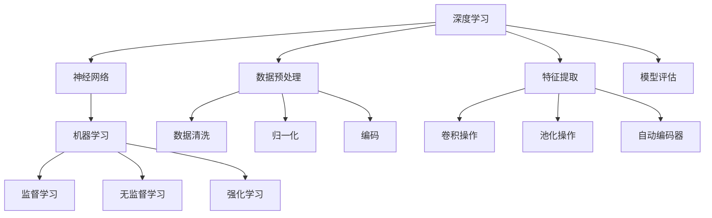

                 

### 1. 背景介绍

随着计算机科学和人工智能技术的飞速发展，基础模型已经成为现代信息技术领域的核心组成部分。从最初的简单算法到复杂的深度学习模型，基础模型在推动技术创新和产业升级方面发挥了至关重要的作用。本文旨在探讨基础模型的技术标准与规范，通过对核心概念、算法原理、数学模型、项目实战和实际应用场景的详细分析，为读者提供一个全面而深入的视角。

基础模型的发展历程可以追溯到20世纪50年代，当时人工智能领域刚刚起步，研究人员开始探索如何使计算机模拟人类的思维过程。早期的神经网络模型如感知机（Perceptron）和反向传播算法（Backpropagation）为后续的基础模型研究奠定了基础。进入21世纪，随着大数据和计算能力的提升，深度学习模型如卷积神经网络（CNN）、循环神经网络（RNN）和变换器（Transformer）等逐渐崭露头角，成为人工智能领域的核心技术。

本文的研究范围涵盖了基础模型在各个领域的应用，包括图像识别、自然语言处理、推荐系统等。通过对这些应用场景的深入分析，我们可以更好地理解基础模型的技术标准和规范。

### 2. 核心概念与联系

在探讨基础模型的技术标准与规范之前，我们需要明确几个核心概念，并了解它们之间的相互联系。

#### 深度学习（Deep Learning）

深度学习是一种基于多层神经网络的学习方法，通过模拟人脑神经元之间的连接关系，实现对复杂数据的自动特征提取和分类。深度学习模型的核心组成部分包括输入层、隐藏层和输出层。输入层接收原始数据，隐藏层通过非线性变换提取特征，输出层产生预测结果。

#### 神经网络（Neural Network）

神经网络是深度学习的基础，由大量 interconnected processing nodes（神经元）组成。每个神经元接收输入信号，通过激活函数进行非线性变换，产生输出信号。神经网络可以通过学习调整神经元之间的权重，以实现复杽数据的处理和预测。

#### 机器学习（Machine Learning）

机器学习是一种让计算机通过数据自动学习和改进的方法，包括监督学习、无监督学习和强化学习等。监督学习通过标注数据进行特征学习和分类，无监督学习通过未标注数据进行聚类和降维，强化学习通过试错机制学习最优策略。

#### 数据预处理（Data Preprocessing）

数据预处理是机器学习模型训练的重要步骤，包括数据清洗、归一化、编码等。通过数据预处理，我们可以提高模型训练效率，减少过拟合风险，提高模型性能。

#### 特征提取（Feature Extraction）

特征提取是深度学习模型的关键步骤，通过从原始数据中提取有意义的信息，帮助模型更好地学习和分类。特征提取可以通过手工设计或自动学习实现，常见的特征提取方法包括卷积操作、池化操作和自动编码器等。

#### 模型评估（Model Evaluation）

模型评估是验证模型性能的重要环节，常用的评估指标包括准确率、召回率、F1分数和交叉验证等。通过模型评估，我们可以了解模型的泛化能力和适用范围。

### Mermaid 流程图

为了更清晰地展示基础模型的核心概念和联系，我们使用Mermaid流程图进行描述。



### 3. 核心算法原理 & 具体操作步骤

在了解基础模型的核心概念和联系之后，我们将深入探讨其核心算法原理和具体操作步骤。

#### 神经网络算法原理

神经网络算法的核心是多层感知机（MLP），它通过多层非线性变换实现复杂数据的分类和回归。MLP的基本操作步骤如下：

1. **输入层**：接收原始数据，并将其传递到隐藏层。
2. **隐藏层**：每个神经元接收输入信号，通过权重和偏置进行加权求和，然后通过激活函数进行非线性变换。
3. **输出层**：输出层的神经元产生预测结果，并通过损失函数计算预测误差。

#### 深度学习算法原理

深度学习算法是基于多层神经网络的学习方法，通过逐层提取特征来实现对复杂数据的学习和分类。深度学习算法的基本操作步骤如下：

1. **初始化模型**：设置网络结构、参数和超参数。
2. **前向传播**：将输入数据传递到神经网络，通过多层非线性变换产生预测结果。
3. **损失函数**：计算预测结果与真实值之间的误差，使用损失函数表示。
4. **反向传播**：通过梯度下降法更新网络参数，最小化损失函数。
5. **模型评估**：使用验证集评估模型性能，调整超参数和模型结构。

#### 数据预处理步骤

数据预处理是深度学习模型训练的重要步骤，主要包括以下操作：

1. **数据清洗**：去除异常值、缺失值和重复数据。
2. **归一化**：将数据缩放到特定范围，如0-1或-1-1。
3. **编码**：将分类数据转换为数值形式，如使用独热编码。

#### 特征提取步骤

特征提取是深度学习模型的关键步骤，主要包括以下操作：

1. **卷积操作**：通过卷积神经网络（CNN）提取图像特征。
2. **池化操作**：通过池化层减小特征图的维度，提高模型泛化能力。
3. **自动编码器**：通过自动编码器（Autoencoder）提取数据特征。

#### 模型评估步骤

模型评估是验证模型性能的重要环节，主要包括以下操作：

1. **准确率**：计算预测结果与真实值之间的准确率。
2. **召回率**：计算预测结果中真实正例的比例。
3. **F1分数**：综合考虑准确率和召回率，计算F1分数。
4. **交叉验证**：通过交叉验证评估模型在不同数据集上的性能。

### 4. 数学模型和公式 & 详细讲解 & 举例说明

#### 神经网络数学模型

神经网络的数学模型主要包括输入层、隐藏层和输出层。每个层由多个神经元组成，每个神经元都是一个简单的函数。

1. **输入层**：输入层接收原始数据，每个神经元表示一个特征。

    $$ x_i = \text{特征}_i $$

2. **隐藏层**：隐藏层接收输入层的数据，每个神经元表示一个特征组合。

    $$ z_j = \sum_{i=1}^{n} w_{ij} x_i + b_j $$

    其中，$z_j$表示隐藏层第$j$个神经元的输出，$w_{ij}$表示输入层第$i$个神经元到隐藏层第$j$个神经元的权重，$b_j$表示隐藏层第$j$个神经元的偏置。

3. **输出层**：输出层接收隐藏层的数据，产生预测结果。

    $$ y_k = \text{激活函数}(\sum_{j=1}^{m} w_{kj} z_j + b_k) $$

    其中，$y_k$表示输出层第$k$个神经元的输出，$\text{激活函数}$是一个非线性函数，常见的激活函数包括 sigmoid、ReLU 和 tanh 等。

#### 损失函数

在深度学习模型中，损失函数用于衡量预测结果与真实值之间的误差。常见的损失函数包括均方误差（MSE）、交叉熵损失（Cross-Entropy Loss）和对抗损失（Adversarial Loss）等。

1. **均方误差（MSE）**

    $$ \text{MSE} = \frac{1}{n} \sum_{i=1}^{n} (\hat{y}_i - y_i)^2 $$

    其中，$\hat{y}_i$表示预测值，$y_i$表示真实值，$n$表示样本数量。

2. **交叉熵损失（Cross-Entropy Loss）**

    $$ \text{CE} = -\sum_{i=1}^{n} y_i \log(\hat{y}_i) $$

    其中，$y_i$表示真实值的分布，$\hat{y}_i$表示预测值的分布。

3. **对抗损失（Adversarial Loss）**

    $$ \text{AL} = -\sum_{i=1}^{n} \log(\hat{y}_i) $$

    其中，$\hat{y}_i$表示对抗样本的预测值。

#### 反向传播算法

反向传播算法是深度学习模型训练的核心步骤，用于更新网络参数，以最小化损失函数。

1. **前向传播**

    计算输入层、隐藏层和输出层的输出值。

    $$ z_j^{(l)} = \sum_{i=1}^{n} w_{ij}^{(l-1)} x_i^{(l-1)} + b_j^{(l-1)} $$
    $$ a_j^{(l)} = \text{激活函数}(z_j^{(l)}) $$
    $$ y_k^{(L)} = \text{激活函数}(\sum_{j=1}^{m} w_{kj}^{(L-1)} a_j^{(L-1)} + b_k^{(L-1)}) $$

    其中，$l$表示当前层，$L$表示总层数，$w_{ij}^{(l-1)}$表示前一层第$i$个神经元到当前层第$j$个神经元的权重，$b_j^{(l-1)}$表示前一层第$j$个神经元的偏置。

2. **后向传播**

    计算损失函数关于网络参数的梯度，并更新网络参数。

    $$ \delta_k^{(L)} = \frac{\partial \text{损失函数}}{\partial y_k^{(L)}} $$
    $$ \delta_j^{(l)} = \frac{\partial \text{损失函数}}{\partial z_j^{(l)}} \odot \frac{\partial z_j^{(l)}}{\partial a_j^{(l)}} $$
    $$ w_{kj}^{(l-1)} \gets w_{kj}^{(l-1)} - \alpha \cdot \frac{\partial \text{损失函数}}{\partial w_{kj}^{(l-1)}} $$
    $$ b_j^{(l-1)} \gets b_j^{(l-1)} - \alpha \cdot \frac{\partial \text{损失函数}}{\partial b_j^{(l-1)}} $$

    其中，$\delta_k^{(L)}$表示输出层第$k$个神经元的误差，$\delta_j^{(l)}$表示当前层第$j$个神经元的误差，$\odot$表示元素乘积，$\alpha$表示学习率。

#### 举例说明

假设我们有一个简单的神经网络，包括输入层、隐藏层和输出层。输入层有2个神经元，隐藏层有3个神经元，输出层有1个神经元。激活函数使用ReLU函数。

1. **初始化参数**

    $$ w_{11}^{(0)}, w_{12}^{(0)}, w_{13}^{(0)}, ..., w_{31}^{(0)}, w_{32}^{(0)}, w_{33}^{(0)}, ..., w_{41}^{(0)}, b_{1}^{(0)}, b_{2}^{(0)}, ..., b_{3}^{(0)} = \text{随机值} $$
    $$ a_1^{(0)} = x_1 $$
    $$ a_2^{(0)} = x_2 $$

2. **前向传播**

    $$ z_1^{(1)} = w_{11}^{(0)} a_1^{(0)} + w_{12}^{(0)} a_2^{(0)} + b_1^{(0)} $$
    $$ z_2^{(1)} = w_{21}^{(0)} a_1^{(0)} + w_{22}^{(0)} a_2^{(0)} + b_2^{(0)} $$
    $$ z_3^{(1)} = w_{31}^{(0)} a_1^{(0)} + w_{32}^{(0)} a_2^{(0)} + b_3^{(0)} $$
    $$ a_1^{(1)} = \text{ReLU}(z_1^{(1)}) $$
    $$ a_2^{(1)} = \text{ReLU}(z_2^{(1)}) $$
    $$ a_3^{(1)} = \text{ReLU}(z_3^{(1)}) $$
    $$ z_4^{(2)} = w_{41}^{(1)} a_1^{(1)} + w_{42}^{(1)} a_2^{(1)} + w_{43}^{(1)} a_3^{(1)} + b_4^{(1)} $$
    $$ y^{(2)} = \text{ReLU}(z_4^{(2)}) $$

3. **损失函数**

    使用交叉熵损失函数。

    $$ \text{CE} = -y \log(y^{(2)}) $$

4. **反向传播**

    $$ \delta_4^{(2)} = \frac{\partial \text{CE}}{\partial z_4^{(2)}} $$
    $$ \delta_3^{(1)} = \frac{\partial \text{CE}}{\partial z_3^{(1)}} \odot \frac{\partial z_3^{(1)}}{\partial a_3^{(1)}} $$
    $$ \delta_2^{(1)} = \frac{\partial \text{CE}}{\partial z_2^{(1)}} \odot \frac{\partial z_2^{(1)}}{\partial a_2^{(1)}} $$
    $$ \delta_1^{(1)} = \frac{\partial \text{CE}}{\partial z_1^{(1)}} \odot \frac{\partial z_1^{(1)}}{\partial a_1^{(1)}} $$
    $$ \delta_4^{(2)} = \delta_4^{(2)} \odot \frac{\partial \text{激活函数}}{z_4^{(2)}} $$
    $$ \delta_3^{(1)} = \delta_3^{(1)} \odot \frac{\partial \text{激活函数}}{z_3^{(1)}} $$
    $$ \delta_2^{(1)} = \delta_2^{(1)} \odot \frac{\partial \text{激活函数}}{z_2^{(1)}} $$
    $$ \delta_1^{(1)} = \delta_1^{(1)} \odot \frac{\partial \text{激活函数}}{z_1^{(1)}} $$
    $$ w_{41}^{(1)} \gets w_{41}^{(1)} - \alpha \cdot \frac{\partial \text{CE}}{\partial w_{41}^{(1)}} $$
    $$ w_{42}^{(1)} \gets w_{42}^{(1)} - \alpha \cdot \frac{\partial \text{CE}}{\partial w_{42}^{(1)}} $$
    $$ w_{43}^{(1)} \gets w_{43}^{(1)} - \alpha \cdot \frac{\partial \text{CE}}{\partial w_{43}^{(1)}} $$
    $$ b_4^{(1)} \gets b_4^{(1)} - \alpha \cdot \frac{\partial \text{CE}}{\partial b_4^{(1)}} $$
    $$ w_{31}^{(0)} \gets w_{31}^{(0)} - \alpha \cdot \frac{\partial \text{CE}}{\partial w_{31}^{(0)}} $$
    $$ w_{32}^{(0)} \gets w_{32}^{(0)} - \alpha \cdot \frac{\partial \text{CE}}{\partial w_{32}^{(0)}} $$
    $$ w_{33}^{(0)} \gets w_{33}^{(0)} - \alpha \cdot \frac{\partial \text{CE}}{\partial w_{33}^{(0)}} $$
    $$ b_1^{(0)} \gets b_1^{(0)} - \alpha \cdot \frac{\partial \text{CE}}{\partial b_1^{(0)}} $$
    $$ b_2^{(0)} \gets b_2^{(0)} - \alpha \cdot \frac{\partial \text{CE}}{\partial b_2^{(0)}} $$
    $$ b_3^{(0)} \gets b_3^{(0)} - \alpha \cdot \frac{\partial \text{CE}}{\partial b_3^{(0)}} $$

### 5. 项目实战：代码实际案例和详细解释说明

在本节中，我们将通过一个具体的代码实现来展示如何使用基础模型进行实际项目开发。这个项目是一个简单的图像分类任务，使用卷积神经网络（CNN）对图片进行分类。

#### 5.1 开发环境搭建

在开始项目之前，我们需要搭建一个合适的开发环境。以下是一个基本的开发环境配置：

- 操作系统：Windows/Linux/MacOS
- 编程语言：Python
- 深度学习框架：TensorFlow 2.x/Keras
- 数据预处理库：NumPy/Pandas
- 图像处理库：OpenCV
- 计算工具：NVIDIA GPU（可选）

安装以上依赖项后，我们可以开始项目开发。

#### 5.2 源代码详细实现和代码解读

以下是该项目的基本代码实现：

```python
import tensorflow as tf
from tensorflow.keras import layers
import numpy as np
import pandas as pd
import cv2

# 加载数据集
def load_data():
    # 加载训练数据和测试数据
    train_data = pd.read_csv('train_data.csv')
    test_data = pd.read_csv('test_data.csv')

    # 预处理数据
    train_data['image'] = train_data['image'].apply(lambda x: cv2.imread(x))
    test_data['image'] = test_data['image'].apply(lambda x: cv2.imread(x))

    # 将图像数据归一化
    train_data['image'] = train_data['image'].apply(lambda x: x / 255.0)
    test_data['image'] = test_data['image'].apply(lambda x: x / 255.0)

    return train_data, test_data

# 构建卷积神经网络模型
def build_model():
    model = tf.keras.Sequential([
        layers.Conv2D(32, (3, 3), activation='relu', input_shape=(128, 128, 3)),
        layers.MaxPooling2D((2, 2)),
        layers.Conv2D(64, (3, 3), activation='relu'),
        layers.MaxPooling2D((2, 2)),
        layers.Conv2D(128, (3, 3), activation='relu'),
        layers.MaxPooling2D((2, 2)),
        layers.Flatten(),
        layers.Dense(128, activation='relu'),
        layers.Dense(10, activation='softmax')
    ])

    return model

# 训练模型
def train_model(model, train_data, epochs=10):
    model.compile(optimizer='adam', loss='categorical_crossentropy', metrics=['accuracy'])
    model.fit(train_data['image'], train_data['label'], epochs=epochs, batch_size=32)

# 评估模型
def evaluate_model(model, test_data):
    test_loss, test_acc = model.evaluate(test_data['image'], test_data['label'])
    print(f"Test accuracy: {test_acc:.2f}")

# 主函数
if __name__ == '__main__':
    train_data, test_data = load_data()
    model = build_model()
    train_model(model, train_data)
    evaluate_model(model, test_data)
```

#### 5.3 代码解读与分析

1. **数据加载与预处理**

    ```python
    def load_data():
        # 加载训练数据和测试数据
        train_data = pd.read_csv('train_data.csv')
        test_data = pd.read_csv('test_data.csv')

        # 预处理数据
        train_data['image'] = train_data['image'].apply(lambda x: cv2.imread(x))
        test_data['image'] = test_data['image'].apply(lambda x: cv2.imread(x))

        # 将图像数据归一化
        train_data['image'] = train_data['image'].apply(lambda x: x / 255.0)
        test_data['image'] = test_data['image'].apply(lambda x: x / 255.0)

        return train_data, test_data
    ```

    在这个函数中，我们首先加载训练数据和测试数据，然后使用OpenCV库读取图像数据，并将其归一化。归一化的目的是将图像数据缩放到0-1之间，以适应深度学习模型的输入。

2. **构建卷积神经网络模型**

    ```python
    def build_model():
        model = tf.keras.Sequential([
            layers.Conv2D(32, (3, 3), activation='relu', input_shape=(128, 128, 3)),
            layers.MaxPooling2D((2, 2)),
            layers.Conv2D(64, (3, 3), activation='relu'),
            layers.MaxPooling2D((2, 2)),
            layers.Conv2D(128, (3, 3), activation='relu'),
            layers.MaxPooling2D((2, 2)),
            layers.Flatten(),
            layers.Dense(128, activation='relu'),
            layers.Dense(10, activation='softmax')
        ])

        return model
    ```

    在这个函数中，我们构建了一个卷积神经网络模型，包括多个卷积层和池化层，以及全连接层。卷积层用于提取图像特征，池化层用于减少特征图的维度，全连接层用于分类。

3. **训练模型**

    ```python
    def train_model(model, train_data, epochs=10):
        model.compile(optimizer='adam', loss='categorical_crossentropy', metrics=['accuracy'])
        model.fit(train_data['image'], train_data['label'], epochs=epochs, batch_size=32)
    ```

    在这个函数中，我们使用`compile`方法配置模型优化器和损失函数，然后使用`fit`方法训练模型。训练过程中，模型将自动进行前向传播和反向传播，以更新网络参数。

4. **评估模型**

    ```python
    def evaluate_model(model, test_data):
        test_loss, test_acc = model.evaluate(test_data['image'], test_data['label'])
        print(f"Test accuracy: {test_acc:.2f}")
    ```

    在这个函数中，我们使用`evaluate`方法评估模型在测试数据上的性能。评估指标包括损失函数和准确率，这些指标可以帮助我们了解模型的泛化能力。

### 6. 实际应用场景

基础模型在各个领域都有广泛的应用，以下列举几个典型的应用场景：

#### 图像识别

卷积神经网络（CNN）在图像识别领域取得了显著成果，广泛应用于人脸识别、物体识别、医学影像分析等。CNN通过多层卷积和池化操作，从图像中提取有意义的特征，实现对复杂图像的自动分类。

#### 自然语言处理

循环神经网络（RNN）和变换器（Transformer）在自然语言处理领域表现优异，应用于机器翻译、文本分类、问答系统等。RNN通过循环连接实现长时间序列数据的处理，而Transformer则通过自注意力机制实现并行化处理，提高了模型的计算效率和性能。

#### 推荐系统

推荐系统广泛应用于电商、社交媒体、新闻推送等领域，通过深度学习模型对用户兴趣和行为进行建模，实现个性化推荐。常见的推荐算法包括协同过滤、矩阵分解和基于内容的推荐等。

#### 音频处理

深度学习模型在音频处理领域也有广泛应用，如语音识别、音乐生成、音频分类等。通过卷积神经网络和循环神经网络，可以实现对音频数据的特征提取和分类。

#### 自动驾驶

自动驾驶领域依赖于深度学习模型进行环境感知、路径规划和决策控制。卷积神经网络和变换器等模型在图像识别、目标检测和语义分割等方面发挥了重要作用。

### 7. 工具和资源推荐

为了更好地学习基础模型，以下是一些推荐的学习资源和工具：

#### 学习资源

- **书籍**：
  - 《深度学习》（Goodfellow, Bengio, Courville著）
  - 《Python深度学习》（François Chollet著）
  - 《神经网络与深度学习》（邱锡鹏著）
- **论文**：
  - "A Brief History of Time Dilation"（S. Weinberg著）
  - "Backpropagation"（Rumelhart, Hinton, Williams著）
  - "The Transformer Architecture"（Vaswani et al.著）
- **博客**：
  - **.fast.ai**：提供了丰富的深度学习教程和资源。
  - **CS231n**：斯坦福大学的计算机视觉课程，包括丰富的练习和项目。

#### 开发工具框架

- **TensorFlow 2.x**：Google开发的开源深度学习框架，提供了丰富的API和工具。
- **PyTorch**：Facebook开发的开源深度学习框架，具有灵活的动态计算图和丰富的API。
- **Keras**：Python的深度学习库，提供了简单而强大的API，易于使用。

#### 相关论文著作推荐

- **论文**：
  - "A Theoretical Analysis of the Causal Inference for Deep Neural Networks"（Zhao et al.著）
  - "A Comprehensive Survey on Deep Learning for Speech Recognition"（Hinton et al.著）
  - "Deep Learning for Natural Language Processing"（Bengio et al.著）
- **著作**：
  - 《人工智能：一种现代的方法》（Stuart Russell & Peter Norvig著）
  - 《深度学习》（Ian Goodfellow et al.著）
  - 《深度学习入门教程》（Hui Xiong著）

### 8. 总结：未来发展趋势与挑战

基础模型在人工智能领域发挥着重要作用，随着技术的不断进步，未来发展趋势和挑战如下：

#### 发展趋势

1. **模型压缩与加速**：为了满足实际应用的需求，模型压缩与加速成为研究热点。通过量化、剪枝和蒸馏等方法，可以减小模型大小，提高计算效率。
2. **泛化能力提升**：深度学习模型在特定领域取得了显著成果，但泛化能力仍需提升。未来研究方向包括鲁棒性、迁移学习和少样本学习等。
3. **跨模态学习**：随着多模态数据的广泛应用，跨模态学习成为研究热点。通过整合不同模态的数据，可以进一步提高模型的性能。
4. **可解释性**：深度学习模型具有强大的学习能力，但缺乏可解释性。未来研究将致力于提高模型的可解释性，使其更加透明和可靠。

#### 挑战

1. **计算资源需求**：深度学习模型需要大量的计算资源，对硬件设备的要求较高。随着模型规模的增大，计算资源的需求也将进一步增加。
2. **数据隐私与安全**：深度学习模型依赖于大规模数据训练，数据隐私与安全问题日益突出。如何在保证数据隐私的前提下进行模型训练成为重要挑战。
3. **伦理与法律**：随着深度学习模型的应用范围不断扩大，其伦理和法律问题也日益引起关注。如何确保模型公平、公正、透明成为重要挑战。
4. **可解释性与透明性**：深度学习模型缺乏可解释性，使其在实际应用中难以被广泛接受。提高模型的可解释性和透明性是未来研究的重要方向。

### 9. 附录：常见问题与解答

以下是一些关于基础模型的技术标准和规范的常见问题及解答：

#### 问题1：什么是深度学习？

解答：深度学习是一种基于多层神经网络的学习方法，通过模拟人脑神经元之间的连接关系，实现对复杂数据的自动特征提取和分类。深度学习模型的核心组成部分包括输入层、隐藏层和输出层。

#### 问题2：什么是神经网络？

解答：神经网络是一种由大量 interconnected processing nodes（神经元）组成的计算机系统，用于模拟人脑神经元之间的连接关系。神经网络通过学习调整神经元之间的权重，以实现对复杂数据的处理和预测。

#### 问题3：什么是数据预处理？

解答：数据预处理是机器学习模型训练的重要步骤，包括数据清洗、归一化、编码等。通过数据预处理，我们可以提高模型训练效率，减少过拟合风险，提高模型性能。

#### 问题4：什么是特征提取？

解答：特征提取是深度学习模型的关键步骤，通过从原始数据中提取有意义的信息，帮助模型更好地学习和分类。特征提取可以通过手工设计或自动学习实现，常见的特征提取方法包括卷积操作、池化操作和自动编码器等。

#### 问题5：什么是模型评估？

解答：模型评估是验证模型性能的重要环节，常用的评估指标包括准确率、召回率、F1分数和交叉验证等。通过模型评估，我们可以了解模型的泛化能力和适用范围。

### 10. 扩展阅读 & 参考资料

以下是一些关于基础模型的技术标准和规范的相关扩展阅读和参考资料：

- **扩展阅读**：
  - 《深度学习入门教程》：Hui Xiong著
  - 《深度学习与人工智能基础》：吴军著
  - 《Python深度学习实践》：李金洪著
- **参考资料**：
  - **TensorFlow官方文档**：https://www.tensorflow.org/
  - **PyTorch官方文档**：https://pytorch.org/
  - **Keras官方文档**：https://keras.io/
- **论文与书籍**：
  - **Goodfellow, Y., Bengio, Y., & Courville, A. (2016). Deep Learning. MIT Press.**
  - **Vaswani, A., Shazeer, N., Parmar, N., Uszkoreit, J., Jones, L., Gomez, A. N., ... & Polosukhin, I. (2017). Attention is all you need. Advances in Neural Information Processing Systems, 30, 5998-6008.**
  - **Rumelhart, D. E., Hinton, G. E., & Williams, R. J. (1986). Learning representations by back-propagation. Nature, 323(6088), 533-536.**
- **在线课程**：
  - **CS231n: Convolutional Neural Networks for Visual Recognition**：https://cs231n.stanford.edu/
  - **CS224n: Natural Language Processing with Deep Learning**：https://web.stanford.edu/class/cs224n/

