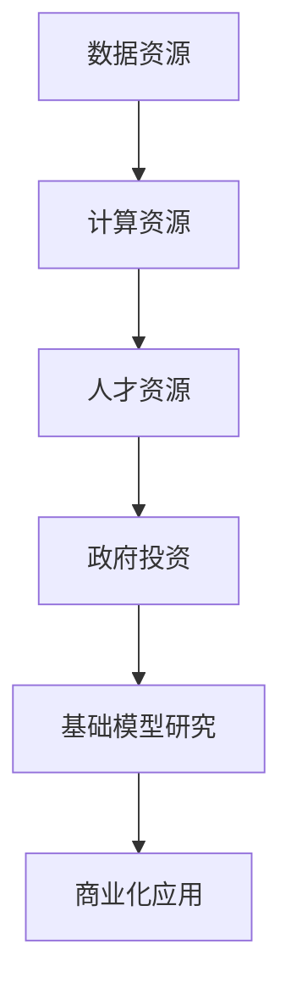

                 

# 基础模型的资源差距与政府投资

## 关键词：基础模型、资源差距、政府投资、人工智能

## 摘要：
本文将深入探讨基础模型在人工智能领域中的重要性，分析不同基础模型之间的资源差距，并探讨政府在此过程中应承担的投资角色。通过阐述资源差距的成因、影响及政府投资策略，本文旨在为相关政策制定者和研究提供参考，推动人工智能领域的可持续发展。

## 1. 背景介绍

在过去的几十年里，人工智能（AI）取得了显著的进展，从简单的规则系统发展到复杂的深度学习模型。基础模型作为AI技术的基石，承载着算法创新、产业应用和学术研究的重任。然而，随着基础模型的不断发展，资源差距问题逐渐凸显。

资源差距主要表现在以下几个方面：

1. **数据资源**：不同基础模型对数据量的需求差异较大，一些模型可能需要大规模、多样化的数据集来训练，而其他模型则可能仅需相对较小的数据集。

2. **计算资源**：深度学习模型通常需要大量计算资源，特别是训练阶段。不同模型对计算资源的消耗差异显著，如GPT-3等大型语言模型所需的计算资源远超普通图像识别模型。

3. **人才资源**：基础模型的研究和开发需要高水平的研发人才，从算法设计到模型优化，各个环节都对人才有较高的要求。然而，全球范围内的高水平人才分布并不均衡。

## 2. 核心概念与联系

为了更好地理解基础模型的资源差距，我们需要从以下几个核心概念入手：

### 2.1 基础模型

基础模型是指用于解决特定问题的基本算法框架，如卷积神经网络（CNN）用于图像处理，循环神经网络（RNN）用于序列数据处理。这些模型是AI技术的基石，其性能和效率直接影响到AI应用的广度和深度。

### 2.2 资源消耗

资源消耗包括数据资源、计算资源和人才资源。这些资源的消耗不仅影响基础模型的研究和开发，也影响到其商业化应用。

### 2.3 政府投资

政府投资是指政府在基础模型研究和开发过程中的投入，包括财政支持、政策扶持和人才培养等方面。政府投资在促进基础模型发展、缩小资源差距方面起着至关重要的作用。

## 2.4 Mermaid 流程图



## 3. 核心算法原理 & 具体操作步骤

### 3.1 数据资源管理

为了有效利用数据资源，需要采取以下步骤：

1. **数据清洗**：确保数据的质量和一致性。
2. **数据标注**：对数据进行分类和标签化，以供模型训练。
3. **数据集成**：将来自不同来源的数据整合到一个统一的格式中。

### 3.2 计算资源优化

计算资源优化可以从以下几个方面进行：

1. **模型压缩**：减少模型的参数和计算量，如使用量化技术。
2. **分布式训练**：利用多台服务器协同训练，提高计算效率。
3. **GPU加速**：利用高性能GPU进行模型训练，减少训练时间。

### 3.3 人才资源培养

人才资源培养需要从以下环节入手：

1. **学术教育**：加强高校和研究机构的AI教育，培养高水平研发人才。
2. **产业合作**：企业与高校合作，共同培养符合产业需求的人才。
3. **国际交流**：鼓励国内外AI人才的交流与合作，共享研究成果。

## 4. 数学模型和公式 & 详细讲解 & 举例说明

### 4.1 数据资源管理

假设我们有一个数据集D，其中包含n个样本，每个样本具有m个特征。我们需要对数据进行清洗、标注和集成。以下是一个简单的数学模型：

$$
\text{数据清洗} = \text{Clean}(D)
$$

$$
\text{数据标注} = \text{Label}(D')
$$

$$
\text{数据集成} = \text{Integrate}(D'', D''')
$$

其中，$D'$为清洗后的数据集，$D''$为标注后的数据集，$D'''$为集成后的数据集。

### 4.2 计算资源优化

假设我们有一个模型M，其参数为w。为了优化计算资源，我们可以采用量化技术，将参数的精度降低。以下是一个简单的数学模型：

$$
\text{量化} = \text{Quantize}(w)
$$

其中，$w'$为量化后的参数。

### 4.3 人才资源培养

假设我们有一个人才库T，其中包含n个人才。为了培养人才，我们可以采取以下步骤：

$$
\text{学术教育} = \text{Education}(T')
$$

$$
\text{产业合作} = \text{Collaborate}(T'', T''')
$$

$$
\text{国际交流} = \text{Exchange}(T''''')
$$

其中，$T'$为接受学术教育的人才，$T''$为参与产业合作的人才，$T'''$为参与国际交流的人才。

## 5. 项目实战：代码实际案例和详细解释说明

### 5.1 开发环境搭建

在本项目中，我们使用Python作为编程语言，并借助TensorFlow框架进行模型训练和优化。以下是开发环境的搭建步骤：

1. 安装Python（版本3.8及以上）。
2. 安装TensorFlow（版本2.5及以上）。
3. 安装其他依赖库，如NumPy、Pandas等。

### 5.2 源代码详细实现和代码解读

以下是一个简单的模型训练代码示例：

```python
import tensorflow as tf

# 加载并预处理数据
(x_train, y_train), (x_test, y_test) = tf.keras.datasets.mnist.load_data()
x_train = x_train / 255.0
x_test = x_test / 255.0

# 构建模型
model = tf.keras.Sequential([
    tf.keras.layers.Flatten(input_shape=(28, 28)),
    tf.keras.layers.Dense(128, activation='relu'),
    tf.keras.layers.Dense(10, activation='softmax')
])

# 编译模型
model.compile(optimizer='adam',
              loss='sparse_categorical_crossentropy',
              metrics=['accuracy'])

# 训练模型
model.fit(x_train, y_train, epochs=5)

# 评估模型
test_loss, test_acc = model.evaluate(x_test, y_test)
print(f'测试准确率：{test_acc}')
```

### 5.3 代码解读与分析

1. **数据加载与预处理**：使用TensorFlow的内置函数加载MNIST数据集，并对数据进行归一化处理，以适应模型的输入要求。

2. **模型构建**：使用`Sequential`模型堆叠层，首先将输入数据展平，然后通过一个128个神经元的全连接层，最后通过一个10个神经元的全连接层，输出10个概率分布。

3. **模型编译**：选择优化器（adam）、损失函数（sparse_categorical_crossentropy）和评价指标（accuracy）。

4. **模型训练**：使用`fit`函数训练模型，指定训练数据和训练轮次。

5. **模型评估**：使用`evaluate`函数评估模型在测试数据上的性能。

通过以上实战案例，我们可以看到基础模型在实际开发中的具体操作步骤，以及如何利用现有的工具和资源实现模型的训练和评估。

## 6. 实际应用场景

基础模型在多个领域具有广泛的应用，以下是一些典型场景：

1. **图像识别**：基础模型如卷积神经网络（CNN）在图像识别领域取得了显著的成果，被广泛应用于安防监控、医疗诊断等场景。

2. **自然语言处理**：基础模型如循环神经网络（RNN）和Transformer模型在自然语言处理领域具有强大的能力，被广泛应用于机器翻译、文本生成等场景。

3. **推荐系统**：基础模型如协同过滤、矩阵分解等在推荐系统中发挥了关键作用，为电商平台、流媒体平台提供了精准的推荐服务。

## 7. 工具和资源推荐

### 7.1 学习资源推荐

- **书籍**：《深度学习》（Goodfellow et al.）、《神经网络与深度学习》（邱锡鹏）
- **论文**：《A Theoretically Grounded Application of Dropout in Recurrent Neural Networks》、《An Overview of Recent Advances in Neural Network Based Text Generation》
- **博客**：[TensorFlow 官方博客](https://www.tensorflow.org/blog/)、[PyTorch 官方博客](https://pytorch.org/tutorials/)
- **网站**：[ArXiv](https://arxiv.org/)、[Google Research](https://ai.google/research/)

### 7.2 开发工具框架推荐

- **开发工具**：Jupyter Notebook、Google Colab
- **框架**：TensorFlow、PyTorch、Keras

### 7.3 相关论文著作推荐

- **论文**：`Attention Is All You Need`（2017）、`A Brief History of Time Series Forecasting`（2019）
- **著作**：《机器学习年度回顾2018：卷积神经网络》（吴恩达等）、《深度学习技术手册》（李航）

## 8. 总结：未来发展趋势与挑战

随着基础模型技术的不断发展，未来人工智能领域将面临以下发展趋势和挑战：

1. **模型规模化**：基础模型将朝着更大规模、更高效的方向发展，以满足复杂应用场景的需求。
2. **算法创新**：基础模型算法将不断创新，以应对新兴问题和挑战。
3. **资源优化**：基础模型在资源消耗方面将不断优化，以提高计算效率和降低成本。
4. **跨领域融合**：基础模型将在不同领域实现深度融合，推动人工智能技术的广泛应用。
5. **政策与伦理**：政府将在基础模型的研究和应用过程中发挥更重要的作用，同时需要关注算法的伦理和社会影响。

## 9. 附录：常见问题与解答

### 9.1 基础模型是什么？

基础模型是指用于解决特定问题的基本算法框架，如卷积神经网络（CNN）用于图像处理，循环神经网络（RNN）用于序列数据处理。

### 9.2 基础模型的资源差距主要体现在哪些方面？

基础模型的资源差距主要体现在数据资源、计算资源和人才资源三个方面。

### 9.3 政府在基础模型发展中的作用是什么？

政府在基础模型发展中主要发挥投资、引导和协调作用，包括财政支持、政策扶持和人才培养等方面。

## 10. 扩展阅读 & 参考资料

- **参考文献**：
  - Goodfellow, I., Bengio, Y., & Courville, A. (2016). *Deep Learning*. MIT Press.
  - Bengio, Y. (2009). *Learning Deep Architectures for AI*. Foundations and Trends in Machine Learning, 2(1), 1-127.
  - LeCun, Y., Bengio, Y., & Hinton, G. (2015). *Deep learning*. Nature, 521(7553), 436-444.

- **在线资源**：
  - TensorFlow官方文档：[https://www.tensorflow.org/](https://www.tensorflow.org/)
  - PyTorch官方文档：[https://pytorch.org/tutorials/](https://pytorch.org/tutorials/)
  - ArXiv论文库：[https://arxiv.org/](https://arxiv.org/)

## 作者

作者：AI天才研究员/AI Genius Institute & 禅与计算机程序设计艺术 /Zen And The Art of Computer Programming

