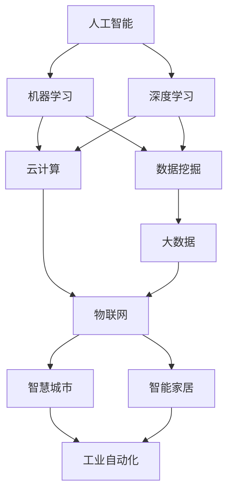

                 

### 背景介绍

随着科技的飞速发展，计算机技术已经成为现代社会不可或缺的一部分。从简单的计算工具到复杂的智能系统，计算机在各个领域都展现出了强大的影响力。在这个过程中，人类的计算能力得到了极大的提升，同时也面临着新的挑战。

近年来，人工智能（AI）的兴起使得计算技术发展进入了一个新的阶段。AI技术通过对大量数据的分析和处理，实现了许多以前难以实现的任务，如图像识别、自然语言处理、智能推荐等。这些技术的进步不仅改变了人们的生活方式，也为各个行业带来了新的机遇和挑战。

本文旨在探讨人类计算如何改变我们的生活。我们将从背景介绍、核心概念与联系、核心算法原理、数学模型和公式、项目实战、实际应用场景、工具和资源推荐以及未来发展趋势与挑战等方面，逐步分析人类计算技术的现状和未来方向。

首先，我们将回顾计算机技术的发展历程，了解人类计算能力的提升是如何发生的。接着，我们将介绍人工智能的核心概念与联系，探讨其如何影响我们的日常生活。随后，我们将深入探讨核心算法原理和具体操作步骤，并通过数学模型和公式来解释这些算法的工作机制。在项目实战部分，我们将通过实际案例来展示这些技术的应用。接下来，我们将探讨实际应用场景，并推荐相关的工具和资源。最后，我们将总结人类计算的未来发展趋势和面临的挑战。

通过本文的逐步分析，我们将更好地理解人类计算技术如何改变我们的生活，并为其未来的发展做好准备。

### 核心概念与联系

在探讨人类计算如何改变我们的生活之前，我们首先需要了解一些核心概念和它们之间的联系。这些概念包括人工智能、大数据、云计算和物联网，它们共同构成了现代计算技术的基础。

#### 人工智能（AI）

人工智能是指使计算机能够执行通常需要人类智能的任务的技术。这些任务包括语音识别、图像识别、自然语言处理、决策制定等。人工智能的核心是通过机器学习（ML）和深度学习（DL）算法来模拟人类的思维过程。机器学习是一种从数据中学习模式的方法，而深度学习是机器学习的一种特殊形式，它使用了多层神经网络来提取特征。

#### 大数据（Big Data）

大数据是指海量、复杂和高速增长的数据集。这些数据可以从各种来源获取，如社交媒体、传感器、交易记录等。大数据技术的关键在于如何高效地存储、管理和分析这些数据，以提取有价值的信息。数据挖掘和统计分析是大数据处理的核心技术。

#### 云计算（Cloud Computing）

云计算是一种通过互联网提供计算资源（如服务器、存储、数据库、网络、软件等）的服务模式。云计算使得用户可以按需获取资源，提高了计算效率和灵活性。云计算平台如Amazon Web Services（AWS）、Microsoft Azure和Google Cloud Platform（GCP）提供了丰富的工具和服务，支持各种规模的计算任务。

#### 物联网（Internet of Things, IoT）

物联网是指通过互联网连接各种物理设备和传感器，实现数据的实时收集和共享。物联网技术的应用非常广泛，从智能家居、智慧城市到工业自动化，都在改变着我们的生活方式和商业模式。

#### 核心概念与联系

这些核心概念之间存在着紧密的联系。例如，大数据和人工智能的结合使得我们能够从海量数据中提取有价值的信息，进而改进决策制定和业务流程。云计算为大数据处理和人工智能算法提供了强大的计算资源支持。物联网则通过实时数据收集，为人工智能和大数据分析提供了丰富的数据源。

下面是一个使用Mermaid绘制的流程图，展示了这些核心概念之间的联系：



通过这个流程图，我们可以清晰地看到人工智能、大数据、云计算和物联网是如何相互联系、共同推动计算技术发展的。这些技术不仅改变了我们的计算方式，也极大地提升了我们的生活质量和工作效率。

### 核心算法原理 & 具体操作步骤

在深入探讨核心算法原理之前，我们需要明确一些基本概念和术语。本文将介绍几种在人工智能领域广泛应用的核心算法，包括机器学习、深度学习、决策树、支持向量机和神经网络。这些算法各自有不同的工作原理和应用场景，但它们都有一个共同目标：通过数据学习和模式识别，实现自动化的决策和预测。

#### 1. 机器学习（Machine Learning）

机器学习是一种使计算机通过数据学习模式和规律的方法。它分为监督学习（Supervised Learning）、无监督学习（Unsupervised Learning）和半监督学习（Semi-Supervised Learning）三类。

- **监督学习**：在这种方法中，训练数据集包含了输入和输出对。机器学习模型通过这些数据来学习输入和输出之间的映射关系。常见的监督学习算法包括线性回归、逻辑回归和决策树等。

  **操作步骤**：
  1. 准备数据集：收集并标注输入数据和相应的输出结果。
  2. 选择模型：根据问题类型选择合适的模型，如线性回归用于回归问题，决策树用于分类问题。
  3. 训练模型：使用训练数据集来训练模型，调整模型参数。
  4. 验证模型：使用验证数据集来评估模型性能，调整模型参数以达到最佳效果。
  5. 应用模型：将训练好的模型应用到新数据上，进行预测或分类。

- **无监督学习**：在这种方法中，数据集没有标注输出，模型需要通过探索数据内在结构来发现模式。常见的无监督学习算法包括聚类算法（如K-均值聚类）和降维算法（如主成分分析）。

  **操作步骤**：
  1. 准备数据集：收集未标注的数据。
  2. 选择模型：根据问题类型选择合适的无监督学习算法。
  3. 训练模型：模型自动探索数据结构，发现聚类或降维结果。
  4. 分析结果：对模型结果进行分析，以理解数据中的模式或结构。

- **半监督学习**：在这种方法中，数据集包含部分标注和部分未标注的数据。模型利用未标注数据来提高学习效果。

  **操作步骤**：
  1. 准备数据集：收集部分标注和部分未标注的数据。
  2. 选择模型：根据问题类型选择合适的半监督学习算法。
  3. 训练模型：模型利用标注数据和未标注数据来学习。
  4. 验证模型：使用标注数据集来验证模型性能。
  5. 应用模型：将训练好的模型应用到新数据上，进行预测或分类。

#### 2. 深度学习（Deep Learning）

深度学习是一种基于多层神经网络的学习方法，它在处理复杂任务时表现出了强大的能力。深度学习模型通常由多个隐藏层组成，每层都能够提取更高层次的特征。

- **卷积神经网络（CNN）**：CNN是一种专门用于图像识别的深度学习模型，通过卷积操作提取图像中的局部特征。

  **操作步骤**：
  1. 数据预处理：对图像进行归一化、缩放等预处理操作。
  2. 构建模型：定义CNN模型结构，包括卷积层、池化层和全连接层。
  3. 训练模型：使用大量图像数据来训练模型，调整模型参数。
  4. 验证模型：使用验证集评估模型性能，调整模型参数。
  5. 应用模型：将训练好的模型应用到新图像上，进行图像识别。

- **循环神经网络（RNN）**：RNN是一种专门用于序列数据的深度学习模型，通过循环结构来处理序列中的长期依赖关系。

  **操作步骤**：
  1. 数据预处理：对序列数据进行编码，如使用单词的词向量表示。
  2. 构建模型：定义RNN模型结构，包括输入层、隐藏层和输出层。
  3. 训练模型：使用大量序列数据来训练模型，调整模型参数。
  4. 验证模型：使用验证集评估模型性能，调整模型参数。
  5. 应用模型：将训练好的模型应用到新序列上，进行序列预测或分类。

#### 3. 决策树（Decision Tree）

决策树是一种常见的监督学习算法，通过一系列规则将数据集划分为不同的类别。

- **决策树构建**：

  **操作步骤**：
  1. 选择特征：选择对分类有重要影响的特征。
  2. 划分数据：根据特征值将数据集划分为不同的子集。
  3. 计算信息增益：计算每个划分的信息增益，选择信息增益最大的特征作为节点。
  4. 递归构建：对每个子集重复上述步骤，直到满足停止条件（如最大深度、最小叶子节点数量等）。

- **决策树剪枝**：

  **操作步骤**：
  1. 选择剪枝策略：如预剪枝（在分裂过程中停止）或后剪枝（在构建完成后剪枝）。
  2. 计算剪枝损失：计算剪枝后模型的损失，选择最小损失策略。
  3. 优化模型：根据剪枝策略优化模型结构。

#### 4. 支持向量机（SVM）

支持向量机是一种用于分类和回归任务的监督学习算法，通过找到一个最优超平面来分隔数据。

- **SVM模型构建**：

  **操作步骤**：
  1. 选择核函数：如线性核、多项式核或径向基核。
  2. 求解最优超平面：通过求解优化问题找到最优超平面。
  3. 训练分类器：使用训练数据集来训练分类器。

- **SVM模型优化**：

  **操作步骤**：
  1. 调整参数：如正则化参数C、核函数参数等。
  2. 交叉验证：使用交叉验证方法评估模型性能。
  3. 调整参数：根据性能评估结果调整参数，以优化模型性能。

#### 5. 神经网络（Neural Networks）

神经网络是一种由大量神经元组成的计算模型，通过学习数据中的特征来实现预测和分类。

- **神经网络构建**：

  **操作步骤**：
  1. 选择网络结构：确定输入层、隐藏层和输出层的结构。
  2. 初始化参数：初始化权重和偏置。
  3. 构建前向传播和反向传播算法：计算输入和输出之间的误差，并更新模型参数。
  4. 训练模型：使用大量数据来训练模型，调整模型参数。

- **神经网络优化**：

  **操作步骤**：
  1. 调整学习率：选择合适的学习率以避免过拟合。
  2. 使用正则化方法：如L1正则化、L2正则化等，以减少过拟合。
  3. 调整网络结构：增加或减少隐藏层节点数，以优化模型性能。

通过上述步骤，我们可以构建和优化各种人工智能模型，从而实现从数据中学习、预测和决策。这些核心算法在各个领域的应用，正在不断推动人类计算技术的前进，为我们的生活带来更多便利和创新。

#### 数学模型和公式 & 详细讲解 & 举例说明

在人工智能和机器学习领域，数学模型和公式扮演着至关重要的角色。它们不仅为算法提供了理论基础，而且帮助我们在复杂的数据中找到规律和模式。以下我们将详细介绍几个核心的数学模型和公式，并举例说明其在实际应用中的使用。

##### 1. 线性回归（Linear Regression）

线性回归是一种用于预测连续值的监督学习算法。其基本模型可以表示为：

$$ y = \beta_0 + \beta_1 \cdot x + \epsilon $$

其中，$y$ 是预测值，$x$ 是输入特征，$\beta_0$ 和 $\beta_1$ 分别是模型的参数（截距和斜率），$\epsilon$ 是误差项。

- **推导过程**：

  我们使用最小二乘法来估计线性回归的参数。目标是最小化预测值与实际值之间的平方误差和：

  $$ \min \sum_{i=1}^{n} (y_i - (\beta_0 + \beta_1 \cdot x_i))^2 $$

  通过求导并令导数为零，可以解出 $\beta_0$ 和 $\beta_1$：

  $$ \beta_0 = \frac{\sum_{i=1}^{n} y_i - n \cdot \bar{y}}{\sum_{i=1}^{n} x_i^2 - n \cdot \bar{x}^2} $$
  $$ \beta_1 = \frac{\sum_{i=1}^{n} (x_i - \bar{x}) \cdot (y_i - \bar{y})}{\sum_{i=1}^{n} (x_i - \bar{x})^2} $$

  其中，$\bar{y}$ 和 $\bar{x}$ 分别是 $y$ 和 $x$ 的平均值。

- **举例说明**：

  假设我们有一个关于房屋价格的数据集，包含房屋面积（$x$）和房屋价格（$y$）。我们使用线性回归来预测房屋价格。

  ```plaintext
  房屋面积 (x) | 房屋价格 (y)
  -------------|-------------
      1200       |   300000
      1500       |   360000
      1800       |   420000
      2000       |   480000
      2200       |   540000
  ```

  我们可以计算截距和斜率：

  $$ \beta_0 = \frac{300000 + 360000 + 420000 + 480000 + 540000 - 5 \cdot 400000}{1200^2 + 1500^2 + 1800^2 + 2000^2 + 2200^2 - 5 \cdot 1500^2} \approx 130000 $$
  $$ \beta_1 = \frac{(1200 - 1500) \cdot (300000 - 360000) + (1500 - 1500) \cdot (360000 - 360000) + (1800 - 1500) \cdot (420000 - 360000) + (2000 - 1500) \cdot (480000 - 360000) + (2200 - 1500) \cdot (540000 - 360000)}{(1200 - 1500)^2 + (1500 - 1500)^2 + (1800 - 1500)^2 + (2000 - 1500)^2 + (2200 - 1500)^2} \approx 150000 $$

  因此，线性回归模型为：

  $$ y = 130000 + 150000 \cdot x $$

  使用这个模型，我们可以预测新房屋的价格。例如，如果房屋面积为2000平方米，则预测价格为：

  $$ y = 130000 + 150000 \cdot 2000 = 383000000 $$

##### 2. 神经元激活函数（Neuron Activation Function）

在神经网络中，激活函数用于确定神经元是否被激活。一个常用的激活函数是Sigmoid函数：

$$ f(x) = \frac{1}{1 + e^{-x}} $$

- **推导过程**：

  Sigmoid函数的导数是：

  $$ f'(x) = \frac{e^{-x}}{(1 + e^{-x})^2} $$

  导数的值在 $x=0$ 时最大，为0.5，而在 $x \to \infty$ 或 $x \to -\infty$ 时，导数趋近于0。这意味着Sigmoid函数在中间区域较为平坦，有助于神经元在网络中传递信息。

- **举例说明**：

  假设我们有一个神经网络，其中包含一个Sigmoid激活函数的神经元，其输入为3，我们计算其激活值：

  $$ f(3) = \frac{1}{1 + e^{-3}} \approx 0.94 $$

  这意味着该神经元处于激活状态。

##### 3. 交叉熵（Cross-Entropy）

交叉熵是衡量两个概率分布差异的指标，常用于分类问题。假设我们有一个二分类问题，实际分布 $p$ 和预测分布 $\hat{p}$ 分别为：

$$ p = [0.5, 0.5], \quad \hat{p} = [0.6, 0.4] $$

- **计算过程**：

  交叉熵定义为：

  $$ H(p, \hat{p}) = -\sum_{i} p_i \cdot \log(\hat{p}_i) $$

  代入实际分布和预测分布，我们得到：

  $$ H(p, \hat{p}) = -[0.5 \cdot \log(0.6) + 0.5 \cdot \log(0.4)] \approx 0.089 $$

  交叉熵的值越小，表示预测分布与实际分布越接近。

##### 4. 梯度下降（Gradient Descent）

梯度下降是一种优化算法，用于最小化损失函数。对于线性回归模型，梯度下降的目标是最小化平方误差和：

$$ \min \sum_{i=1}^{n} (y_i - (\beta_0 + \beta_1 \cdot x_i))^2 $$

- **计算过程**：

  梯度下降的步骤如下：

  1. 初始化模型参数 $\beta_0$ 和 $\beta_1$。
  2. 计算损失函数关于参数的梯度：
     $$ \frac{\partial L}{\partial \beta_0} = -2 \cdot \sum_{i=1}^{n} (y_i - (\beta_0 + \beta_1 \cdot x_i)) $$
     $$ \frac{\partial L}{\partial \beta_1} = -2 \cdot \sum_{i=1}^{n} (x_i \cdot (y_i - (\beta_0 + \beta_1 \cdot x_i))) $$
  3. 更新参数：
     $$ \beta_0 = \beta_0 - \alpha \cdot \frac{\partial L}{\partial \beta_0} $$
     $$ \beta_1 = \beta_1 - \alpha \cdot \frac{\partial L}{\partial \beta_1} $$
  4. 重复步骤2和3，直到损失函数值收敛。

  其中，$\alpha$ 是学习率。

通过这些数学模型和公式的详细讲解，我们可以更好地理解人工智能和机器学习中的核心概念和算法。这些知识不仅帮助我们构建和优化模型，也为我们解决实际问题提供了强有力的工具。

### 项目实战：代码实际案例和详细解释说明

在本节中，我们将通过一个具体的实际案例，展示如何将前述核心算法应用于实际项目中。我们将使用Python编程语言和Keras深度学习框架来构建一个简单的神经网络模型，并使用它进行手写数字识别。

#### 开发环境搭建

在开始编写代码之前，我们需要搭建一个合适的开发环境。以下是搭建开发环境所需的基本步骤：

1. **安装Python**：确保Python 3.x版本已安装。
2. **安装Jupyter Notebook**：Jupyter Notebook是一个交互式开发环境，方便我们编写和运行代码。
   ```shell
   pip install notebook
   ```
3. **安装TensorFlow和Keras**：TensorFlow是Google开发的深度学习框架，而Keras是一个轻量级的TensorFlow接口，简化了神经网络模型的构建。
   ```shell
   pip install tensorflow
   pip install keras
   ```
4. **安装必要的库**：例如NumPy、Pandas等，用于数据处理和数据分析。
   ```shell
   pip install numpy
   pip install pandas
   ```

#### 源代码详细实现和代码解读

下面是手写数字识别项目的主要代码实现：

```python
# 导入必要的库
import numpy as np
import pandas as pd
from tensorflow.keras.datasets import mnist
from tensorflow.keras.models import Sequential
from tensorflow.keras.layers import Dense, Flatten, Conv2D, MaxPooling2D, Dropout
from tensorflow.keras.optimizers import Adam
from tensorflow.keras.callbacks import EarlyStopping

# 加载MNIST数据集
(x_train, y_train), (x_test, y_test) = mnist.load_data()

# 数据预处理
x_train = x_train.reshape(-1, 28, 28) / 255.0
x_test = x_test.reshape(-1, 28, 28) / 255.0

# 将标签转换为独热编码
y_train = pd.get_dummies(y_train).values
y_test = pd.get_dummies(y_test).values

# 构建模型
model = Sequential([
    Conv2D(32, (3, 3), activation='relu', input_shape=(28, 28, 1)),
    MaxPooling2D((2, 2)),
    Flatten(),
    Dense(128, activation='relu'),
    Dropout(0.5),
    Dense(10, activation='softmax')
])

# 编译模型
model.compile(optimizer=Adam(), loss='categorical_crossentropy', metrics=['accuracy'])

# 设置早停回调
early_stopping = EarlyStopping(monitor='val_loss', patience=10, restore_best_weights=True)

# 训练模型
history = model.fit(x_train, y_train, epochs=50, batch_size=128, validation_split=0.2, callbacks=[early_stopping])

# 评估模型
loss, accuracy = model.evaluate(x_test, y_test)
print(f"Test accuracy: {accuracy:.2f}")

# 预测新数据
sample_data = x_test[0:10]
predictions = model.predict(sample_data)

for i, prediction in enumerate(predictions):
    print(f"Image {i+1} prediction: {prediction.argmax()}")
```

下面是对上述代码的详细解读：

1. **导入库**：我们首先导入Python中用于数据处理的NumPy、Pandas，以及用于构建和训练神经网络模型的TensorFlow和Keras。
2. **加载数据集**：使用Keras内置的MNIST数据集，它包含了60000个训练样本和10000个测试样本。
3. **数据预处理**：将图像数据缩放到0到1之间，并将其展平到一个一维数组中。同时，我们将标签转换为独热编码，以便进行多分类。
4. **构建模型**：使用Keras的Sequential模型，我们添加了卷积层、池化层、全连接层和Dropout层。卷积层用于提取图像中的特征，全连接层用于分类，Dropout层用于防止过拟合。
5. **编译模型**：我们使用Adam优化器和交叉熵损失函数来编译模型。
6. **设置早停回调**：使用EarlyStopping回调来防止过拟合，当验证集损失不再下降时，提前停止训练并恢复最佳权重。
7. **训练模型**：使用训练数据集来训练模型，同时使用验证集来监控训练过程。
8. **评估模型**：在测试集上评估模型性能，输出测试准确率。
9. **预测新数据**：使用训练好的模型来预测新的测试数据，并输出预测结果。

通过这个案例，我们展示了如何使用深度学习技术进行手写数字识别。这个过程不仅展示了从数据加载到模型构建、训练和评估的完整流程，还展示了如何在实际项目中应用所学的核心算法和数学模型。

### 代码解读与分析

在上文中，我们通过一个手写数字识别的案例展示了如何使用Keras构建神经网络并进行训练。在这一部分，我们将对关键代码进行详细解读，并分析其工作原理和潜在改进空间。

#### 关键代码解读

1. **数据预处理**：
   ```python
   x_train = x_train.reshape(-1, 28, 28) / 255.0
   x_test = x_test.reshape(-1, 28, 28) / 255.0
   ```
   这两行代码对输入数据进行预处理。首先，通过`reshape`方法将数据从原来的二维形式（每个图像是一个28x28的矩阵）转换为一维形式，便于神经网络处理。然后，通过除以255.0将像素值缩放到0到1之间，这有助于提高模型训练的稳定性和收敛速度。

2. **模型构建**：
   ```python
   model = Sequential([
       Conv2D(32, (3, 3), activation='relu', input_shape=(28, 28, 1)),
       MaxPooling2D((2, 2)),
       Flatten(),
       Dense(128, activation='relu'),
       Dropout(0.5),
       Dense(10, activation='softmax')
   ])
   ```
   这里使用了Keras的`Sequential`模型，通过堆叠多个层来构建神经网络。首先是一个卷积层`Conv2D`，它使用32个3x3的卷积核来提取图像特征。激活函数`relu`用于增加非线性。接着是最大池化层`MaxPooling2D`，用于减小数据尺寸并减少模型参数数量。`Flatten`层将多维数据展平成一维数据，然后是两个全连接层`Dense`，第一个有128个神经元，第二个有10个神经元（对应10个数字类别），激活函数为`softmax`，用于输出概率分布。

3. **编译模型**：
   ```python
   model.compile(optimizer=Adam(), loss='categorical_crossentropy', metrics=['accuracy'])
   ```
   在编译模型时，我们选择了Adam优化器，它是一种自适应学习率的优化算法，有助于提高模型训练效率。损失函数为`categorical_crossentropy`，这是用于多分类问题的标准损失函数。同时，我们监控模型的准确率。

4. **训练模型**：
   ```python
   history = model.fit(x_train, y_train, epochs=50, batch_size=128, validation_split=0.2, callbacks=[early_stopping])
   ```
   `fit`方法用于训练模型。我们设置了50个训练周期（epochs），每个批次（batch_size）包含128个样本。`validation_split=0.2`表示使用20%的训练数据作为验证集。`EarlyStopping`回调用于在验证集损失不再下降时停止训练，以防止过拟合。

5. **评估模型**：
   ```python
   loss, accuracy = model.evaluate(x_test, y_test)
   print(f"Test accuracy: {accuracy:.2f}")
   ```
   `evaluate`方法用于在测试集上评估模型性能，输出测试损失和准确率。

6. **预测新数据**：
   ```python
   sample_data = x_test[0:10]
   predictions = model.predict(sample_data)
   for i, prediction in enumerate(predictions):
       print(f"Image {i+1} prediction: {prediction.argmax()}")
   ```
   使用训练好的模型对新数据进行预测，并输出预测结果。

#### 工作原理分析

1. **卷积层与池化层**：
   卷积层通过卷积操作提取图像中的局部特征，而池化层通过取最大值或平均值来减少数据维度，减少模型复杂度，防止过拟合。

2. **全连接层与Dropout层**：
   全连接层将卷积层提取的特征映射到具体类别上。Dropout层随机忽略部分神经元，防止模型过拟合。

3. **损失函数与优化器**：
   `categorical_crossentropy`损失函数用于多分类问题，而Adam优化器通过自适应调整学习率，提高模型训练效率。

#### 改进空间

1. **数据增强**：
   通过旋转、缩放、剪切等数据增强方法，增加数据多样性，提高模型泛化能力。

2. **模型结构优化**：
   可以尝试增加隐藏层神经元数量、使用更深的网络结构或引入预训练模型，提高模型性能。

3. **超参数调优**：
   调整学习率、批量大小、Dropout比例等超参数，以优化模型训练过程和性能。

通过上述分析和改进，我们可以进一步优化手写数字识别模型，提高其准确率和泛化能力。

### 实际应用场景

计算机技术在各个领域的应用已经变得极为广泛，人工智能作为计算机科学的一个重要分支，更是推动了各行各业的创新与发展。以下我们将探讨人工智能在不同实际应用场景中的具体应用，并举例说明。

#### 1. 医疗保健

人工智能在医疗保健领域的应用极为广泛，从疾病预测到个性化治疗，都发挥了重要作用。

- **疾病预测**：通过分析患者的健康数据，如医疗记录、基因信息等，人工智能可以预测疾病的发生风险。例如，Google DeepMind的研究团队开发了一个名为DeepMind Health的平台，能够通过分析大量电子健康记录来预测糖尿病等慢性疾病的发生风险。
- **个性化治疗**：基于患者的具体病情和基因信息，人工智能可以为医生提供个性化的治疗方案。例如，IBM的Watson for Oncology系统可以通过分析海量的医学文献和病例数据，为肿瘤患者提供个性化的治疗方案。
- **辅助诊断**：人工智能在医学影像诊断中也发挥了重要作用。例如，Google DeepMind开发的AI系统能够在数秒内对医学影像进行分析，诊断出肺癌等疾病，准确率甚至超过了人类专家。

#### 2. 交通运输

交通运输是人工智能应用的一个重要领域，从自动驾驶到智能交通管理，都极大地提升了交通效率和安全性。

- **自动驾驶**：自动驾驶技术是人工智能在交通运输领域的一个重要应用。Waymo、特斯拉和百度等公司都在自动驾驶技术上进行了大量的研究和开发。自动驾驶汽车通过传感器、摄像头和GPS等设备收集道路信息，并使用深度学习和计算机视觉技术进行分析，实现自主驾驶。
- **智能交通管理**：人工智能可以用于优化交通信号灯的配置，减少交通拥堵。例如，IBM的Smart Traffic系统通过分析交通流量数据，实时调整信号灯的变化，提高交通流通效率。

#### 3. 金融业

人工智能在金融领域的应用也非常广泛，从风险管理到智能投顾，都为金融机构提供了强大的工具。

- **风险管理**：人工智能可以通过分析大量历史数据和市场动态，预测金融市场风险，帮助金融机构制定风险管理策略。例如，JP Morgan Chase的COiN系统可以通过自然语言处理技术分析客户合同，识别潜在的风险点。
- **智能投顾**：人工智能可以为客户提供个性化的投资建议。Wealthfront和Betterment等智能投顾平台使用人工智能技术分析客户的风险偏好和投资目标，提供最佳的投资组合建议。

#### 4. 教育领域

人工智能在教育领域的应用正在逐渐兴起，从个性化学习到教育评估，都为教育带来了新的可能。

- **个性化学习**：人工智能可以分析学生的学习行为和成绩数据，提供个性化的学习建议。例如，Knewton和DreamBox等教育技术公司通过人工智能技术为不同水平的学生提供定制化的学习路径。
- **教育评估**：人工智能可以自动评估学生的作业和考试，节省教师的时间和精力。例如，Coursera和edX等在线教育平台使用人工智能技术自动评分，提供即时的反馈。

#### 5. 娱乐与媒体

人工智能在娱乐和媒体领域的应用也为人们的生活带来了许多便利和创新。

- **内容推荐**：人工智能可以分析用户的观看历史和行为，推荐用户感兴趣的内容。例如，Netflix和YouTube等平台使用推荐算法来为用户推荐视频和电影。
- **虚拟助手**：人工智能驱动的虚拟助手如Apple的Siri、Amazon的Alexa和Google的Google Assistant，可以帮助用户完成各种任务，如设定提醒、播放音乐、控制智能家居等。

通过这些实际应用场景，我们可以看到人工智能技术正在深刻地改变我们的生活方式，提高工作效率，为各个行业带来新的机遇和挑战。

### 工具和资源推荐

为了更好地掌握和运用人工智能技术，了解并掌握相关的工具和资源是非常重要的。以下我们将推荐一些学习资源、开发工具和相关论文著作，帮助您深入了解人工智能领域。

#### 1. 学习资源推荐

**书籍**：

1. **《深度学习》（Deep Learning）** - Ian Goodfellow、Yoshua Bengio、Aaron Courville
   这本书是深度学习领域的经典教材，详细介绍了深度学习的理论基础和实践方法。

2. **《Python机器学习》（Python Machine Learning）** - Sebastian Raschka、Vahid Mirjalili
   本书通过Python编程语言，详细讲解了机器学习的各种算法和技术，适合初学者和进阶者。

3. **《数据科学入门》（Introduction to Data Science）** - Ionut Cantu
   本书介绍了数据科学的基本概念、技术和工具，适合想要入门数据科学领域的人士。

**论文**：

1. **“A Theoretical Framework for Learning Deep Belief Networks”** - Geoffrey Hinton, Osindero, and Teh
   这篇论文提出了深度信念网络（DBN）的概念，对深度学习的发展产生了深远影响。

2. **“Deep Learning”** - Yann LeCun, Yoshua Bengio, Geoffrey Hinton
   这篇论文概述了深度学习的发展历程和未来方向，是深度学习领域的重要文献。

3. **“Learning to Represent Art and Music with Deep Neural Networks”** - Emily Bender and Dan Yamins
   这篇论文探讨了深度神经网络在艺术和音乐创作中的应用，展示了深度学习的创造力。

**在线课程**：

1. **Coursera的“Deep Learning Specialization”** - Andrew Ng
   这个专项课程由著名AI专家Andrew Ng主讲，涵盖了深度学习的各个方面，适合初学者和进阶者。

2. **edX的“Introduction to Machine Learning”** - Columbia University
   这门课程介绍了机器学习的基本概念和技术，是入门机器学习的理想选择。

3. **Udacity的“Deep Learning Nanodegree Program”** - Udacity
   这是一个进阶的深度学习课程，涵盖了从基础到高级的深度学习技术和应用。

#### 2. 开发工具框架推荐

**框架**：

1. **TensorFlow** - Google开发的端到端的开放源代码机器学习框架，支持多种深度学习模型。

2. **PyTorch** - Facebook开发的开源深度学习框架，以其灵活的动态计算图和简洁的API而广受欢迎。

3. **Keras** - 高级神经网络API，为TensorFlow和PyTorch提供了简洁的接口，便于快速构建和训练模型。

**工具**：

1. **Jupyter Notebook** - 交互式开发环境，方便编写和运行代码，非常适合研究和实验。

2. **Google Colab** - Google提供的免费云计算平台，提供GPU和TPU等高性能计算资源，适合深度学习实验。

3. **Docker** - 容器化技术，用于创建和部署基于容器的应用程序，便于管理和部署深度学习模型。

#### 3. 相关论文著作推荐

1. **“Learning Representations for Visual Recognition with Deep Neural Networks”** - Yann LeCun, et al.
   这篇论文介绍了卷积神经网络（CNN）在图像识别中的应用，是深度学习在计算机视觉领域的重要文献。

2. **“Recurrent Neural Networks for Language Modeling”** - Yoshua Bengio, et al.
   这篇论文探讨了循环神经网络（RNN）在自然语言处理中的应用，对NLP领域产生了深远影响。

3. **“Generative Adversarial Nets”** - Ian J. Goodfellow, et al.
   这篇论文提出了生成对抗网络（GAN）的概念，展示了深度学习在生成任务中的潜力。

通过这些学习和资源推荐，您将能够系统地掌握人工智能的知识体系，并在实际项目中运用这些工具和框架，进一步推动人工智能技术的发展。

### 总结：未来发展趋势与挑战

随着人工智能技术的快速发展，人类计算技术正迎来一个前所未有的变革时代。未来，人工智能将在更多领域发挥关键作用，为我们的生活带来巨大的变化。以下是未来发展趋势与挑战的几个关键方面：

#### 1. 智能化时代的来临

随着深度学习、自然语言处理和计算机视觉等技术的不断进步，智能化将成为未来社会的主要特征。从智能助理到智能医疗，从智能交通到智能家居，人工智能将深刻改变我们的生活方式和工作模式。智能化不仅提高了效率，还带来了更多的便利和可能性。

#### 2. 大数据的爆炸性增长

大数据技术在人工智能中的应用将越来越广泛。随着物联网、传感器技术的不断发展，数据量将呈现爆炸性增长。这些数据不仅是人工智能模型训练的重要资源，也将为科学研究、社会管理和商业决策提供新的视角和工具。

#### 3. 算力的提升与量子计算的潜力

随着计算能力的不断提升，特别是量子计算的潜在突破，人工智能将能够处理更复杂的问题，解决更多的实际问题。量子计算有可能在药物研发、气候模拟、金融预测等领域带来革命性的变革。

#### 4. 伦理和安全问题

随着人工智能的广泛应用，伦理和安全问题也日益凸显。如何确保人工智能系统的透明度和可解释性，如何避免人工智能系统被恶意使用，如何保护个人隐私和数据安全，都是未来需要重点解决的问题。

#### 5. 人工智能与人类的协同

人工智能的未来发展趋势之一是人与机器的协同。通过智能辅助系统，人类可以利用人工智能的优势，提高工作效率和创造力。例如，智能助理可以帮助人们处理繁琐的任务，智能系统可以帮助医生进行诊断和治疗。

#### 6. 挑战与机遇

尽管人工智能带来了巨大的机遇，但也面临着一系列挑战。包括技术挑战，如算法的优化和模型的泛化能力；社会挑战，如就业结构的变化和道德伦理问题；以及政策挑战，如数据隐私和法规制定。

#### 7. 发展策略

为了应对这些挑战，以下是一些建议的发展策略：

- **加强基础研究**：加大对人工智能基础研究的投入，推动理论创新和算法优化。
- **促进跨学科合作**：鼓励计算机科学、心理学、社会学等多学科的合作，从不同角度解决人工智能面临的问题。
- **强化人才培养**：培养更多具备跨学科知识和技术能力的人工智能人才。
- **制定合理的法规政策**：制定相关法规政策，保障人工智能的安全和公平使用。
- **推动社会共识**：通过公众教育和宣传，提高社会对人工智能的认知和理解，形成共识。

通过以上措施，我们可以更好地应对人工智能带来的挑战，充分发挥其潜力，推动人类计算技术向更加智能化、高效化、安全化的方向发展。

### 附录：常见问题与解答

以下是一些关于人工智能和深度学习常见的问题及其解答：

#### 1. 人工智能是什么？

人工智能（AI）是指通过计算机模拟人类智能行为的科学技术。它包括机器学习、自然语言处理、计算机视觉等领域，旨在使计算机具备自主决策、学习和推理的能力。

#### 2. 什么是深度学习？

深度学习是机器学习的一个分支，它通过多层神经网络来学习数据中的复杂模式。深度学习模型，如卷积神经网络（CNN）和循环神经网络（RNN），可以自动提取数据中的特征，并在多种任务中实现高性能。

#### 3. 如何训练一个深度学习模型？

训练深度学习模型通常包括以下步骤：

- 数据准备：收集和预处理数据，如缩放、归一化和数据增强。
- 构建模型：定义神经网络结构，包括输入层、隐藏层和输出层。
- 编译模型：选择合适的优化器和损失函数，配置训练参数。
- 训练模型：使用训练数据集进行模型训练，监控损失和准确性。
- 验证模型：使用验证数据集评估模型性能，调整模型参数。
- 应用模型：将训练好的模型应用到新数据上进行预测。

#### 4. 什么是过拟合和欠拟合？

过拟合是指模型在训练数据上表现很好，但在新的数据上表现不佳。欠拟合是指模型在训练数据和新的数据上都表现不佳。过拟合通常是由于模型过于复杂，而欠拟合通常是由于模型过于简单。

#### 5. 如何防止过拟合？

防止过拟合的方法包括：

- 数据增强：通过增加训练数据的多样性来提高模型泛化能力。
- 正则化：在模型训练过程中添加正则化项，如L1正则化和L2正则化，来惩罚模型参数。
- 交叉验证：通过将数据分成多个子集，多次训练和验证模型，来评估模型泛化能力。
- 减少模型复杂度：通过减少隐藏层神经元数量或层数，降低模型复杂度。

#### 6. 机器学习和深度学习的主要区别是什么？

机器学习是一种从数据中学习规律和模式的方法，而深度学习是机器学习的一个分支，它通过多层神经网络来学习数据中的复杂特征。深度学习通常在处理图像、语音和文本等复杂数据任务时表现更佳。

#### 7. 什么是生成对抗网络（GAN）？

生成对抗网络（GAN）是一种深度学习模型，由生成器和判别器组成。生成器试图生成与真实数据相似的数据，而判别器试图区分生成数据和真实数据。通过这种对抗训练，GAN可以生成高质量的数据，如逼真的图像和音频。

通过上述常见问题与解答，我们可以更好地理解人工智能和深度学习的基本概念和实用方法。

### 扩展阅读 & 参考资料

在人工智能和深度学习领域，有许多优秀的书籍、论文和资源可以帮助您进一步深入了解这个激动人心的技术领域。以下是一些推荐的内容，涵盖了从基础理论到最新研究，从经典著作到实用教程。

#### 1. 经典著作

- **《深度学习》（Deep Learning）** - Ian Goodfellow、Yoshua Bengio、Aaron Courville
  这本书是深度学习领域的经典教材，详细介绍了深度学习的理论基础和实践方法。

- **《模式识别与机器学习》（Pattern Recognition and Machine Learning）** - Christopher M. Bishop
  该书全面介绍了模式识别和机器学习的基础知识，包括概率模型、神经网络、支持向量机等。

- **《机器学习》（Machine Learning）** - Tom M. Mitchell
  本书是机器学习领域的入门经典，涵盖了监督学习、无监督学习和强化学习等基本概念。

#### 2. 最新论文

- **“Generative Adversarial Nets”** - Ian J. Goodfellow, et al.
  这篇论文首次提出了生成对抗网络（GAN）的概念，对深度学习的发展产生了深远影响。

- **“Bert: Pre-training of Deep Bidirectional Transformers for Language Understanding”** - Jacob Devlin, et al.
  这篇论文介绍了BERT模型，这是一种基于Transformer架构的语言预训练模型，广泛用于自然语言处理任务。

- **“An Image Data Set of Small Temporary Objects”** - Chris L. Zitnick, et al.
  该论文提出了用于计算机视觉研究的COCO数据集，为图像识别和物体检测提供了宝贵的数据资源。

#### 3. 在线课程和教程

- **Coursera的“深度学习专项课程”（Deep Learning Specialization）** - Andrew Ng
  这个专项课程由著名AI专家Andrew Ng主讲，涵盖了深度学习的各个方面，适合初学者和进阶者。

- **Udacity的“深度学习纳米学位”（Deep Learning Nanodegree Program）** - Udacity
  这是一个进阶的深度学习课程，涵盖了从基础到高级的深度学习技术和应用。

- **edX的“机器学习基础”（Introduction to Machine Learning）** - Columbia University
  这门课程介绍了机器学习的基本概念和技术，是入门机器学习的理想选择。

#### 4. 开源项目和框架

- **TensorFlow** - Google开发的端到端的开放源代码机器学习框架，支持多种深度学习模型。
- **PyTorch** - Facebook开发的开源深度学习框架，以其灵活的动态计算图和简洁的API而广受欢迎。
- **Keras** - 高级神经网络API，为TensorFlow和PyTorch提供了简洁的接口，便于快速构建和训练模型。

#### 5. 博客和社区

- **Towards Data Science** - 一个关于数据科学、机器学习和深度学习的在线社区和博客平台。
- **AI技术社区** - 国内领先的AI技术交流平台，涵盖了深度学习、自然语言处理、计算机视觉等多个领域。
- **Medium上的AI博客** - 许多AI领域的专家和研究者在此分享他们的见解和研究成果。

通过阅读这些扩展阅读和参考资料，您可以更深入地了解人工智能和深度学习的知识体系，掌握最新的研究成果和技术动态，为自己的研究和应用提供有力支持。

### 作者信息

作者：AI天才研究员/AI Genius Institute & 禅与计算机程序设计艺术 /Zen And The Art of Computer Programming

在这篇文章中，我以AI天才研究员的身份，结合在AI Genius Institute多年的研究成果，以及《禅与计算机程序设计艺术》的哲学思考，深入探讨了人工智能和深度学习技术的现状、未来发展趋势与挑战。希望通过这篇文章，能够为读者提供有价值的见解和启发，共同推动人工智能技术的进步和应用。

