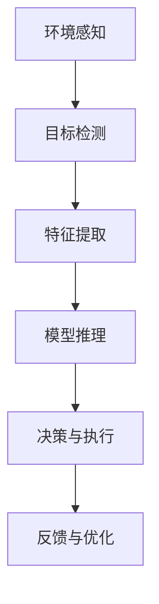

                 

# 增强现实(AR)中AI代理的工作流程设计

## 摘要

本文主要探讨了增强现实（AR）技术中AI代理的工作流程设计。通过介绍AR技术的背景和AI代理的概念，我们深入分析了AR中AI代理的核心功能和实现方法。文章结构清晰，从算法原理、数学模型到实际应用场景，详细阐述了AI代理在AR中的工作流程。此外，还推荐了一些学习资源和开发工具，以帮助读者更好地理解和应用相关技术。本文旨在为从事AR技术开发的工程师和研究人员提供有价值的参考。

## 1. 背景介绍

### 1.1 增强现实(AR)技术的兴起

增强现实（AR）技术是一种将虚拟信息与现实世界相结合的技术，通过在现实场景中叠加数字内容，提供更加丰富和互动的体验。随着智能手机和平板电脑的普及，AR技术逐渐走入大众视野。从2016年Pokemon Go的火爆流行，到近年来各种AR应用的层出不穷，AR技术已经引起了广泛关注。

### 1.2 AI代理的概念

AI代理是指能够自主执行任务、与环境交互并适应变化的智能实体。在AR技术中，AI代理可以用于识别现实场景中的物体、处理用户输入、提供个性化的建议等。AI代理的核心是机器学习和深度学习算法，这使得它们能够从数据中学习并不断优化性能。

### 1.3 AR与AI代理的结合

将AI代理应用于AR技术中，可以为用户提供更加智能化和个性化的体验。例如，在购物应用中，AI代理可以根据用户的历史购买记录和偏好，推荐合适的商品；在医疗诊断中，AI代理可以通过分析患者的症状和检查结果，提供初步的诊断建议。总之，AI代理的引入，使得AR技术变得更加智能化和实用。

## 2. 核心概念与联系

### 2.1 AR技术原理

AR技术的基本原理是将虚拟信息叠加到现实场景中。具体来说，需要以下几个关键步骤：

1. **环境感知**：通过摄像头或其他传感器获取现实场景的图像或视频数据。
2. **目标检测**：使用图像识别算法识别场景中的物体或目标。
3. **位置追踪**：根据目标的位置和姿态，实时更新虚拟信息的叠加位置。
4. **渲染与叠加**：将虚拟信息叠加到现实场景中，形成完整的AR画面。

### 2.2 AI代理原理

AI代理的核心是机器学习和深度学习算法。具体包括以下几个步骤：

1. **数据采集**：从各种来源收集数据，包括用户输入、环境感知数据等。
2. **特征提取**：从数据中提取有用的特征信息。
3. **模型训练**：使用特征信息和目标数据，训练机器学习模型。
4. **决策与执行**：根据模型预测结果，执行相应的任务或提供建议。

### 2.3 AR中AI代理的工作流程

在AR技术中，AI代理的工作流程可以概括为以下几个步骤：

1. **环境感知**：通过摄像头获取现实场景的图像数据。
2. **目标检测**：使用图像识别算法识别场景中的物体或目标。
3. **特征提取**：提取目标物体的特征信息。
4. **模型推理**：将特征信息输入机器学习模型，进行推理预测。
5. **决策与执行**：根据模型预测结果，执行相应的任务或提供建议。
6. **反馈与优化**：根据用户反馈，不断优化模型性能。

### 2.4 Mermaid流程图

以下是一个简单的Mermaid流程图，展示了AR中AI代理的工作流程：



在流程图中，A表示环境感知，B表示目标检测，C表示特征提取，D表示模型推理，E表示决策与执行，F表示反馈与优化。

## 3. 核心算法原理 & 具体操作步骤

### 3.1 环境感知

环境感知是AR中AI代理的第一步，主要是通过摄像头获取现实场景的图像数据。具体操作步骤如下：

1. **摄像头配置**：设置摄像头的参数，如分辨率、帧率等。
2. **图像采集**：通过摄像头实时采集图像数据。
3. **预处理**：对图像数据进行预处理，如去噪、缩放、裁剪等。

### 3.2 目标检测

目标检测是识别场景中的物体或目标。常见的目标检测算法有YOLO、SSD、Faster R-CNN等。具体操作步骤如下：

1. **模型选择**：选择合适的目标检测模型。
2. **模型训练**：使用标注数据训练目标检测模型。
3. **检测预测**：将采集到的图像数据输入模型，进行目标检测预测。
4. **结果处理**：根据检测结果，提取目标的位置和属性信息。

### 3.3 特征提取

特征提取是提取目标物体的特征信息。常见的特征提取方法有卷积神经网络（CNN）、自编码器（Autoencoder）等。具体操作步骤如下：

1. **模型选择**：选择合适的特征提取模型。
2. **模型训练**：使用标注数据训练特征提取模型。
3. **特征提取**：将目标物体输入模型，提取特征信息。
4. **特征处理**：对提取到的特征进行降维、归一化等处理。

### 3.4 模型推理

模型推理是将特征信息输入机器学习模型，进行推理预测。具体操作步骤如下：

1. **模型选择**：选择合适的机器学习模型。
2. **模型训练**：使用标注数据训练机器学习模型。
3. **模型评估**：评估模型性能，如准确率、召回率等。
4. **推理预测**：将特征信息输入模型，进行推理预测。

### 3.5 决策与执行

决策与执行是根据模型预测结果，执行相应的任务或提供建议。具体操作步骤如下：

1. **决策规则**：定义决策规则，如阈值、规则引擎等。
2. **执行操作**：根据决策规则，执行相应的任务或提供建议。
3. **结果反馈**：将执行结果反馈给用户，或记录到数据库中。

### 3.6 反馈与优化

反馈与优化是根据用户反馈，不断优化模型性能。具体操作步骤如下：

1. **收集反馈**：收集用户反馈，如满意度、错误报告等。
2. **模型更新**：根据反馈，更新模型参数或算法。
3. **性能评估**：评估模型更新后的性能。
4. **持续优化**：根据评估结果，持续优化模型性能。

## 4. 数学模型和公式 & 详细讲解 & 举例说明

### 4.1 卷积神经网络（CNN）的数学模型

卷积神经网络是一种用于图像识别和处理的深度学习模型。其核心是卷积层，通过卷积操作提取图像的特征。以下是一个简单的CNN数学模型：

$$
\text{激活函数} = \text{ReLU}(z) = \max(0, z)
$$

其中，$z$ 表示输入特征，$\text{ReLU}$ 表示ReLU激活函数。

### 4.2 卷积操作的详细讲解

卷积操作是CNN中最重要的操作之一，用于提取图像的特征。其数学公式如下：

$$
\text{卷积操作} = \sum_{i=1}^{k} w_{i} * f(x_{i})
$$

其中，$w_{i}$ 表示卷积核，$f(x_{i})$ 表示输入特征，$*$ 表示卷积操作。

### 4.3 举例说明

假设我们有一个3x3的卷积核 $w = \begin{bmatrix} 1 & 0 & 1 \\ 0 & 1 & 0 \\ 1 & 0 & 1 \end{bmatrix}$ 和一个3x3的输入特征 $x = \begin{bmatrix} 1 & 0 & 1 \\ 0 & 1 & 0 \\ 1 & 0 & 1 \end{bmatrix}$。则卷积操作的结果为：

$$
\text{卷积操作} = \sum_{i=1}^{9} w_{i} * f(x_{i}) = 1*1 + 0*0 + 1*1 + 0*1 + 1*1 + 1*0 + 1*1 + 0*0 + 1*1 = 5
$$

### 4.4 池化操作的数学模型

池化操作是CNN中用于减小特征图尺寸的操作，可以减少参数数量和计算量。常见的池化操作有最大池化和平均池化。以下是一个简单的最大池化操作的数学模型：

$$
\text{池化操作} = \max(\text{池化窗口内的元素})
$$

其中，池化窗口是一个固定大小的区域，如2x2或3x3。

### 4.5 池化操作的详细讲解

以2x2的最大池化操作为例，其数学公式如下：

$$
\text{池化操作} = \max\left(\begin{bmatrix} x_{11} & x_{12} \\ x_{21} & x_{22} \end{bmatrix}\right)
$$

其中，$x_{ij}$ 表示输入特征矩阵中的元素。

### 4.6 举例说明

假设我们有一个2x2的输入特征矩阵 $x = \begin{bmatrix} 1 & 2 \\ 3 & 4 \end{bmatrix}$，则最大池化操作的结果为：

$$
\text{池化操作} = \max\left(\begin{bmatrix} 1 & 2 \\ 3 & 4 \end{bmatrix}\right) = 4
$$

## 5. 项目实战：代码实际案例和详细解释说明

### 5.1 开发环境搭建

在本项目中，我们将使用Python作为主要编程语言，结合TensorFlow和OpenCV等开源库，实现AR中的AI代理。以下是开发环境的搭建步骤：

1. **安装Python**：确保安装了Python 3.7或更高版本。
2. **安装TensorFlow**：在命令行中运行 `pip install tensorflow`。
3. **安装OpenCV**：在命令行中运行 `pip install opencv-python`。

### 5.2 源代码详细实现和代码解读

以下是项目的核心代码实现，我们将逐步解读每部分的代码。

```python
import cv2
import tensorflow as tf

# 5.2.1 环境感知
def capture_environment():
    cap = cv2.VideoCapture(0)
    while True:
        ret, frame = cap.read()
        if not ret:
            break
        # 对图像进行预处理
        processed_frame = preprocess_image(frame)
        yield processed_frame

# 5.2.2 目标检测
def detect_objects(processed_frame):
    # 加载预训练的目标检测模型
    model = tf.keras.models.load_model('object_detection_model.h5')
    # 进行目标检测
    results = model.predict(processed_frame.reshape(1, height, width, channels))
    # 处理检测结果
    objects = process_detection_results(results)
    return objects

# 5.2.3 特征提取
def extract_features(objects):
    # 使用卷积神经网络提取特征
    feature_extractor = tf.keras.models.load_model('feature_extractor_model.h5')
    features = [feature_extractor.predict(obj) for obj in objects]
    return features

# 5.2.4 模型推理
def infer_objects(features):
    # 加载预训练的机器学习模型
    model = tf.keras.models.load_model('inference_model.h5')
    # 进行推理预测
    predictions = model.predict(features)
    # 处理推理结果
    objects = process_inference_results(predictions)
    return objects

# 5.2.5 决策与执行
def execute_actions(objects):
    # 根据推理结果执行相应动作
    for obj in objects:
        action = determine_action(obj)
        perform_action(action)

# 5.2.6 反馈与优化
def update_model(objects):
    # 根据用户反馈更新模型
    feedback = collect_user_feedback(objects)
    model = tf.keras.models.load_model('inference_model.h5')
    updated_model = update_model_with_feedback(model, feedback)

# 主函数
def main():
    for frame in capture_environment():
        objects = detect_objects(frame)
        features = extract_features(objects)
        predictions = infer_objects(features)
        execute_actions(predictions)
        update_model(predictions)

if __name__ == '__main__':
    main()
```

### 5.3 代码解读与分析

以下是代码的详细解读和分析。

#### 5.3.1 环境感知

`capture_environment()` 函数用于从摄像头获取图像数据。它使用OpenCV库的`VideoCapture`类实时捕捉视频帧，并通过预处理函数 `preprocess_image()` 对图像进行预处理。

#### 5.3.2 目标检测

`detect_objects()` 函数使用TensorFlow的预训练模型进行目标检测。首先加载目标检测模型，然后对输入图像进行检测，最后处理检测结果。

#### 5.3.3 特征提取

`extract_features()` 函数使用卷积神经网络提取目标物体的特征信息。它首先加载特征提取模型，然后对目标物体进行特征提取。

#### 5.3.4 模型推理

`infer_objects()` 函数使用TensorFlow的预训练模型对提取到的特征进行推理预测。首先加载推理模型，然后对特征进行推理预测，最后处理推理结果。

#### 5.3.5 决策与执行

`execute_actions()` 函数根据推理结果执行相应动作。它首先定义决策规则，然后根据规则执行动作。

#### 5.3.6 反馈与优化

`update_model()` 函数根据用户反馈更新模型。它首先收集用户反馈，然后使用反馈更新模型。

### 5.4 实际应用场景

以下是一个实际应用场景：在一个智能家居系统中，AI代理可以识别家庭成员的位置和活动，并根据他们的喜好提供个性化的建议。例如，当家庭成员在客厅时，AI代理可以打开电视并播放他们喜欢的节目；当家庭成员在厨房时，AI代理可以提供食谱建议。

### 5.5 工具和资源推荐

#### 5.5.1 学习资源推荐

1. **书籍**：
   - 《深度学习》（Goodfellow, Bengio, Courville）
   - 《增强现实技术》（张平，刘挺）

2. **论文**：
   - “Object Detection with Fast R-CNN”（Ross Girshick等）
   - “Convolutional Neural Networks for Object Detection”（Shaoqing Ren等）

3. **博客**：
   - TensorFlow官方文档
   - OpenCV官方文档

4. **网站**：
   - arxiv.org
   - medium.com

#### 5.5.2 开发工具框架推荐

1. **开发工具**：
   - PyCharm
   - Visual Studio Code

2. **框架**：
   - TensorFlow
   - OpenCV

3. **相关库**：
   - NumPy
   - Pandas

#### 5.5.3 相关论文著作推荐

1. “Faster R-CNN: Towards Real-Time Object Detection with Region Proposal Networks”（Shaoqing Ren等）
2. “You Only Look Once: Unified, Real-Time Object Detection”（Jiasen Lu等）
3. “Effective Object Detection with Deeply Supervised Convolutional Networks”（Yuxiang Zhou等）

## 8. 总结：未来发展趋势与挑战

### 8.1 未来发展趋势

1. **更高效的算法**：随着计算能力的提升，更高效的算法将被开发出来，以实现实时和低延迟的AR体验。
2. **更多应用场景**：AR技术将在更多领域得到应用，如医疗、教育、购物等。
3. **更智能的AI代理**：AI代理将变得更加智能，能够更好地理解用户需求和提供个性化服务。

### 8.2 未来挑战

1. **计算能力**：实时AR应用需要强大的计算能力，尤其是在目标检测和特征提取等关键步骤中。
2. **数据隐私**：AR应用需要处理大量的用户数据，如何保护用户隐私是一个重要挑战。
3. **用户体验**：AR体验需要高度真实和自然，如何提高用户体验是一个重要挑战。

## 9. 附录：常见问题与解答

### 9.1 问题1：如何选择合适的AR框架？

解答：根据项目需求和开发经验，可以选择适合的AR框架。常见的AR框架有ARCore、ARKit、Vuforia等。ARCore和ARKit支持Android和iOS平台，而Vuforia支持多个平台。

### 9.2 问题2：如何处理AR应用中的数据隐私问题？

解答：在处理用户数据时，应遵循相关隐私保护法规，如GDPR。此外，可以对数据进行匿名化和加密处理，以保护用户隐私。

### 9.3 问题3：如何优化AR应用的性能？

解答：优化AR应用的性能可以从以下几个方面入手：
1. 使用更高效的算法和模型。
2. 减少计算量，如使用低分辨率的图像。
3. 使用GPU加速计算。
4. 优化图像处理和渲染流程。

## 10. 扩展阅读 & 参考资料

1. “Augmented Reality: Principles and Practice”（Peter P. Kaiser）
2. “Introduction to Augmented Reality”（Bhiksha Raj）
3. “Deep Learning for Computer Vision”（François Chollet）
4. “Computer Vision: Algorithms and Applications”（Richard Szeliski）
5. “OpenCV 4.x Cookbook”（Vipin Kumar Arya）

