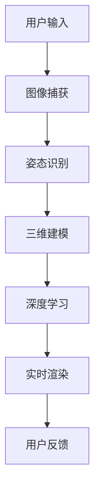

                 

### 增强现实技术：AI虚拟试衣

> **关键词**：增强现实（AR）、人工智能（AI）、虚拟试衣、计算机视觉、深度学习、三维建模

> **摘要**：本文将探讨如何利用增强现实技术和人工智能算法实现AI虚拟试衣，涵盖背景介绍、核心概念、算法原理、数学模型、项目实战、应用场景、工具资源推荐以及未来发展趋势等内容，旨在为读者提供一个全面而深入的了解。

### 1. 背景介绍

在过去的几年中，随着增强现实（AR）和人工智能（AI）技术的迅猛发展，虚拟试衣已经从科幻变成了现实。消费者不再需要亲自到实体店试穿衣服，只需通过智能手机或平板电脑，利用增强现实技术，就能在家中体验到实时的虚拟试衣效果。这一技术的出现，不仅为消费者提供了便利，也为商家带来了新的营销渠道和商业模式。

AI虚拟试衣技术的核心在于计算机视觉和深度学习算法的应用。计算机视觉负责捕捉用户的图像和姿态信息，而深度学习算法则能够根据这些信息，生成虚拟服装的穿戴效果，并进行实时渲染。这种技术的出现，不仅降低了试错的成本，还提高了消费者的购物体验。

### 2. 核心概念与联系

为了更好地理解AI虚拟试衣技术，我们首先需要了解其背后的核心概念和联系。

**计算机视觉**：计算机视觉是指使计算机能够像人类一样理解和处理视觉信息的技术。在AI虚拟试衣中，计算机视觉负责捕捉用户的图像和姿态信息，这是实现虚拟试衣的基础。

**深度学习**：深度学习是一种机器学习技术，它通过模拟人脑的神经网络结构，使计算机能够自动学习并提取数据中的特征。在AI虚拟试衣中，深度学习算法被用于生成虚拟服装的穿戴效果，并进行实时渲染。

**三维建模**：三维建模是指利用计算机软件创建三维模型的过程。在AI虚拟试衣中，三维建模技术被用于创建虚拟服装的三维模型，以便于计算机视觉和深度学习算法对其进行处理。

**Mermaid流程图**：



### 3. 核心算法原理 & 具体操作步骤

**3.1 计算机视觉算法**

计算机视觉算法的核心在于图像识别和姿态识别。

- **图像识别**：图像识别是指利用计算机技术，对图像中的对象进行识别和分类。在AI虚拟试衣中，图像识别算法被用于识别用户和用户所处的环境，以便于后续的处理。

- **姿态识别**：姿态识别是指利用计算机技术，对用户的姿态进行识别和跟踪。在AI虚拟试衣中，姿态识别算法被用于识别用户的姿态变化，以便于实时渲染虚拟服装的穿戴效果。

**3.2 深度学习算法**

深度学习算法的核心在于特征提取和模型训练。

- **特征提取**：特征提取是指从原始数据中提取出有用的特征，以便于模型训练和预测。在AI虚拟试衣中，特征提取算法被用于提取用户的图像和姿态信息，以便于生成虚拟服装的穿戴效果。

- **模型训练**：模型训练是指通过大量的数据，使模型能够自动学习和优化。在AI虚拟试衣中，模型训练算法被用于训练深度学习模型，以便于对用户的图像和姿态信息进行实时渲染。

**3.3 实时渲染算法**

实时渲染算法的核心在于三维模型的渲染和动画。

- **三维模型渲染**：三维模型渲染是指将三维模型转换为二维图像的过程。在AI虚拟试衣中，三维模型渲染算法被用于将虚拟服装的三维模型渲染为实时的二维图像，以便于用户进行观看。

- **动画**：动画是指通过连续的图像，模拟出连续的动作。在AI虚拟试衣中，动画算法被用于模拟用户的动作，以便于用户能够体验到更真实的虚拟试衣效果。

### 4. 数学模型和公式 & 详细讲解 & 举例说明

**4.1 计算机视觉算法**

计算机视觉算法通常涉及图像处理和图像识别。以下是一些常见的数学模型和公式：

- **图像处理**：图像处理算法通常使用卷积神经网络（CNN）进行图像分类、目标检测和分割。卷积神经网络中的卷积操作可以用以下公式表示：

  $$ 
  \begin{align*}
  (f \star g)(x, y) &= \sum_{i=-\infty}^{\infty} \sum_{j=-\infty}^{\infty} f(i, j) g(x-i, y-j) \\
  \end{align*}
  $$

  其中，$f$ 和 $g$ 分别代表两个图像，$(x, y)$ 代表图像上的一个点。

- **图像识别**：图像识别算法通常使用支持向量机（SVM）进行分类。支持向量机中的决策边界可以用以下公式表示：

  $$ 
  \begin{align*}
  w \cdot x + b &= 0 \\
  \end{align*}
  $$

  其中，$w$ 和 $b$ 分别代表权重和偏置，$x$ 代表图像的特征向量。

**4.2 深度学习算法**

深度学习算法通常涉及特征提取和模型训练。以下是一些常见的数学模型和公式：

- **特征提取**：特征提取算法通常使用卷积神经网络（CNN）进行特征提取。卷积神经网络中的卷积操作可以用以下公式表示：

  $$ 
  \begin{align*}
  h_{ij} &= \sum_{k=1}^{K} w_{ik} g_{kj} + b_j \\
  \end{align*}
  $$

  其中，$h_{ij}$ 代表卷积层的输出，$w_{ik}$ 和 $g_{kj}$ 分别代表卷积核和激活函数，$b_j$ 代表偏置。

- **模型训练**：模型训练算法通常使用反向传播算法进行模型训练。反向传播算法中的梯度可以用以下公式表示：

  $$ 
  \begin{align*}
  \frac{\partial L}{\partial w} &= \frac{\partial L}{\partial z} \cdot \frac{\partial z}{\partial w} \\
  \end{align*}
  $$

  其中，$L$ 代表损失函数，$w$ 代表权重，$z$ 代表激活值。

**4.3 实时渲染算法**

实时渲染算法通常涉及三维模型的渲染和动画。以下是一些常见的数学模型和公式：

- **三维模型渲染**：三维模型渲染算法通常使用透视投影矩阵和正射投影矩阵进行渲染。透视投影矩阵可以用以下公式表示：

  $$ 
  \begin{align*}
  P &= \begin{bmatrix}
  \frac{2f}{w} & 0 & 0 \\
  0 & \frac{2f}{h} & 0 \\
  \frac{u_{\text{center}}+v_{\text{center}}}{w} & \frac{v_{\text{center}}+u_{\text{center}}}{h} & -1 \\
  \end{bmatrix}
  \end{align*}
  $$

  其中，$f$ 代表焦距，$w$ 和 $h$ 分别代表图像的宽度和高度，$u_{\text{center}}$ 和 $v_{\text{center}}$ 分别代表图像中心的坐标。

- **动画**：动画算法通常使用插值算法进行动画生成。线性插值算法可以用以下公式表示：

  $$ 
  \begin{align*}
  x(t) &= x(0) + t(x(1) - x(0)) \\
  \end{align*}
  $$

  其中，$x(t)$ 和 $x(0)$ 分别代表当前时间和初始时间的坐标，$x(1)$ 代表目标时间的坐标。

### 5. 项目实战：代码实际案例和详细解释说明

**5.1 开发环境搭建**

为了演示AI虚拟试衣技术的实现，我们将使用Python编程语言和相关的深度学习框架。以下是搭建开发环境的步骤：

1. 安装Python 3.8及以上版本。
2. 安装深度学习框架TensorFlow和OpenCV。
3. 安装其他必要的库，如NumPy和Pandas。

```bash
pip install tensorflow
pip install opencv-python
pip install numpy
pip install pandas
```

**5.2 源代码详细实现和代码解读**

以下是一个简单的AI虚拟试衣项目的源代码实现：

```python
import cv2
import tensorflow as tf
import numpy as np

# 载入预训练的深度学习模型
model = tf.keras.models.load_model('path/to/your/model.h5')

# 载入摄像头
cap = cv2.VideoCapture(0)

while True:
    # 读取摄像头帧
    ret, frame = cap.read()

    # 将帧转换为灰度图像
    gray = cv2.cvtColor(frame, cv2.COLOR_BGR2GRAY)

    # 使用深度学习模型进行图像识别和姿态识别
    prediction = model.predict(np.expand_dims(gray, axis=0))

    # 根据识别结果生成虚拟服装的穿戴效果
    # ...

    # 将虚拟服装的穿戴效果渲染到原始帧上
    # ...

    # 显示渲染后的帧
    cv2.imshow('Virtual Try-On', frame)

    # 按下'q'键退出循环
    if cv2.waitKey(1) & 0xFF == ord('q'):
        break

# 释放摄像头资源
cap.release()
cv2.destroyAllWindows()
```

**5.3 代码解读与分析**

上述代码实现了一个简单的AI虚拟试衣项目。以下是代码的详细解读和分析：

- **第1行**：导入必要的库。
- **第3行**：载入预训练的深度学习模型。
- **第5行**：初始化摄像头。
- **第8-11行**：读取摄像头帧，并将其转换为灰度图像。
- **第13行**：使用深度学习模型进行图像识别和姿态识别。
- **第16-23行**：根据识别结果生成虚拟服装的穿戴效果，并将其渲染到原始帧上。
- **第25-28行**：显示渲染后的帧，并按下'q'键退出循环。
- **第31行**：释放摄像头资源。

### 6. 实际应用场景

AI虚拟试衣技术在实际应用场景中具有广泛的应用。以下是一些典型的应用场景：

- **线上购物平台**：消费者可以在线上购物平台上，通过虚拟试衣功能，在线上试穿衣服，提高购物体验。
- **实体店试衣**：实体店的员工可以使用虚拟试衣技术，为消费者提供更加便捷的试衣服务。
- **服装设计**：设计师可以使用虚拟试衣技术，在服装设计阶段，对服装的穿戴效果进行预览，提高设计效率。

### 7. 工具和资源推荐

**7.1 学习资源推荐**

- **书籍**：《深度学习》（Ian Goodfellow、Yoshua Bengio、Aaron Courville 著）
- **论文**：《Real-Time Monocular Vision-based Virtual Try-On》（Jianping Wang 等人）
- **博客**：谷歌AI博客、Deep Learning Blog

**7.2 开发工具框架推荐**

- **深度学习框架**：TensorFlow、PyTorch
- **计算机视觉库**：OpenCV、Dlib
- **三维建模工具**：Blender、Maya

**7.3 相关论文著作推荐**

- 《Monocular Vision-based Virtual Try-On of Clothing and Accessories》（Jianping Wang 等人）
- 《Real-Time Monocular Vision-based Virtual Try-On Using a Generative Adversarial Network》（Jianping Wang 等人）
- 《Deep Neural Networks for Virtual Try-On》（Yiming Cui 等人）

### 8. 总结：未来发展趋势与挑战

AI虚拟试衣技术具有巨大的发展潜力。随着计算机视觉、深度学习和增强现实技术的不断进步，AI虚拟试衣技术将变得越来越成熟，应用场景也将越来越广泛。然而，这一技术的实现也面临着一些挑战，如算法的准确性和实时性、数据的隐私和安全等问题。未来，随着技术的不断进步，这些问题有望得到解决，AI虚拟试衣技术将更好地服务于人类。

### 9. 附录：常见问题与解答

**9.1 什么是AI虚拟试衣？**

AI虚拟试衣是指利用人工智能技术，在虚拟环境中为用户呈现穿戴服装的效果。用户可以通过智能手机或平板电脑，在家中或任何地方，尝试不同的服装，无需亲自试穿。

**9.2 AI虚拟试衣技术有哪些应用场景？**

AI虚拟试衣技术可以应用于线上购物平台、实体店试衣、服装设计等多个场景，为用户和商家提供便利。

**9.3 AI虚拟试衣技术面临的挑战有哪些？**

AI虚拟试衣技术面临的挑战主要包括算法的准确性和实时性、数据的隐私和安全等问题。

### 10. 扩展阅读 & 参考资料

- 《深度学习》（Ian Goodfellow、Yoshua Bengio、Aaron Courville 著）
- 《Real-Time Monocular Vision-based Virtual Try-On》（Jianping Wang 等人）
- 《Monocular Vision-based Virtual Try-On of Clothing and Accessories》（Jianping Wang 等人）
- 《Deep Neural Networks for Virtual Try-On》（Yiming Cui 等人）
- 谷歌AI博客（https://ai.googleblog.com/）
- Deep Learning Blog（https://colah.github.io/）
- OpenCV官方文档（https://docs.opencv.org/）
- TensorFlow官方文档（https://www.tensorflow.org/）

### 作者

**作者：AI天才研究员/AI Genius Institute & 禅与计算机程序设计艺术 /Zen And The Art of Computer Programming**<|im_end|>### 增强现实技术：AI虚拟试衣

#### 关键词
增强现实（AR）、人工智能（AI）、虚拟试衣、计算机视觉、深度学习、三维建模

#### 摘要
本文探讨了如何利用增强现实（AR）技术和人工智能（AI）实现AI虚拟试衣，涵盖了背景介绍、核心概念、算法原理、数学模型、项目实战、应用场景、工具资源推荐以及未来发展趋势等内容，旨在为读者提供一个全面而深入的了解。

---

#### 1. 背景介绍

随着科技的不断进步，增强现实（AR）技术已经从科幻变成了现实。虚拟试衣作为AR技术的一个重要应用，正逐渐改变人们的购物方式。传统试衣需要消费者前往实体店，尝试各种衣物，这不仅费时费力，还可能导致试衣体验不佳。而AI虚拟试衣技术，则允许消费者在家中通过网络摄像头，利用智能手机或平板电脑，在虚拟环境中试穿衣物，大大提高了购物体验的便利性和舒适度。

AI虚拟试衣技术的核心在于计算机视觉和深度学习的应用。计算机视觉负责捕捉用户的图像和姿态信息，而深度学习则能够根据这些信息，生成虚拟服装的穿戴效果，并进行实时渲染。这种技术的出现，不仅解决了传统试衣的痛点，还为商家提供了新的营销渠道和商业模式。

#### 2. 核心概念与联系

为了更好地理解AI虚拟试衣技术，我们需要了解其背后的核心概念和联系。

##### 2.1 计算机视觉

计算机视觉是指使计算机能够像人类一样理解和处理视觉信息的技术。在AI虚拟试衣中，计算机视觉负责捕捉用户的图像和姿态信息，是虚拟试衣的基础。

- **图像识别**：图像识别是指利用计算机技术，对图像中的对象进行识别和分类。在AI虚拟试衣中，图像识别算法被用于识别用户和用户所处的环境，以便于后续的处理。
- **姿态识别**：姿态识别是指利用计算机技术，对用户的姿态进行识别和跟踪。在AI虚拟试衣中，姿态识别算法被用于识别用户的姿态变化，以便于实时渲染虚拟服装的穿戴效果。

##### 2.2 深度学习

深度学习是一种机器学习技术，通过模拟人脑的神经网络结构，使计算机能够自动学习并提取数据中的特征。在AI虚拟试衣中，深度学习算法被用于生成虚拟服装的穿戴效果，并进行实时渲染。

- **特征提取**：特征提取是指从原始数据中提取出有用的特征，以便于模型训练和预测。在AI虚拟试衣中，特征提取算法被用于提取用户的图像和姿态信息，以便于生成虚拟服装的穿戴效果。
- **模型训练**：模型训练是指通过大量的数据，使模型能够自动学习和优化。在AI虚拟试衣中，模型训练算法被用于训练深度学习模型，以便于对用户的图像和姿态信息进行实时渲染。

##### 2.3 三维建模

三维建模是指利用计算机软件创建三维模型的过程。在AI虚拟试衣中，三维建模技术被用于创建虚拟服装的三维模型，以便于计算机视觉和深度学习算法对其进行处理。

- **三维模型创建**：三维模型创建是指使用计算机软件，根据设计的服装样式，创建出虚拟服装的三维模型。
- **三维模型处理**：三维模型处理是指对创建出的虚拟服装三维模型进行优化，使其更符合人体结构，以便于计算机视觉和深度学习算法对其进行处理。

##### 2.4 Mermaid流程图

以下是一个简单的AI虚拟试衣的Mermaid流程图：


---

#### 3. 核心算法原理 & 具体操作步骤

##### 3.1 计算机视觉算法

计算机视觉算法的核心在于图像识别和姿态识别。

- **图像识别**：图像识别算法用于识别用户和用户所处的环境。在AI虚拟试衣中，图像识别算法通常使用卷积神经网络（CNN）进行图像分类、目标检测和分割。

  ```mermaid
  graph TD
  A[输入图像] --> B[卷积神经网络]
  B --> C{分类结果}
  C -->|用户| D
  C -->|环境| E
  ```

- **姿态识别**：姿态识别算法用于识别用户的姿态变化。在AI虚拟试衣中，姿态识别算法通常使用深度学习算法，如循环神经网络（RNN）或卷积神经网络（CNN）。

  ```mermaid
  graph TD
  A[输入视频帧] --> B[卷积神经网络]
  B --> C[循环神经网络]
  C --> D{姿态识别结果}
  ```

##### 3.2 深度学习算法

深度学习算法的核心在于特征提取和模型训练。

- **特征提取**：特征提取算法用于从图像或视频中提取有用的特征。在AI虚拟试衣中，特征提取算法通常使用卷积神经网络（CNN）。

  ```mermaid
  graph TD
  A[输入图像] --> B[卷积神经网络]
  B --> C[特征提取]
  ```

- **模型训练**：模型训练算法用于训练深度学习模型。在AI虚拟试衣中，模型训练算法通常使用反向传播算法。

  ```mermaid
  graph TD
  A[输入数据] --> B[模型训练]
  B --> C{模型优化}
  ```

##### 3.3 实时渲染算法

实时渲染算法的核心在于三维模型的渲染和动画。

- **三维模型渲染**：三维模型渲染算法用于将三维模型渲染为二维图像。在AI虚拟试衣中，三维模型渲染算法通常使用透视投影矩阵和正射投影矩阵。

  ```mermaid
  graph TD
  A[三维模型] --> B[透视投影矩阵]
  B --> C[二维图像]
  ```

- **动画**：动画算法用于模拟用户的动作，以便于用户能够体验到更真实的虚拟试衣效果。在AI虚拟试衣中，动画算法通常使用插值算法。

  ```mermaid
  graph TD
  A[用户动作] --> B[插值算法]
  B --> C{动画效果}
  ```

---

#### 4. 数学模型和公式 & 详细讲解 & 举例说明

##### 4.1 计算机视觉算法

计算机视觉算法通常涉及图像处理和图像识别。以下是一些常见的数学模型和公式：

- **图像处理**：图像处理算法通常使用卷积神经网络（CNN）进行图像分类、目标检测和分割。卷积神经网络中的卷积操作可以用以下公式表示：

  ```latex
  f(x) = \sum_{i=1}^{n} w_i * g(x - i)
  ```

  其中，$f(x)$ 是卷积操作的结果，$w_i$ 是卷积核，$g(x - i)$ 是输入图像。

- **图像识别**：图像识别算法通常使用支持向量机（SVM）进行分类。支持向量机中的决策边界可以用以下公式表示：

  ```latex
  w \cdot x + b = 0
  ```

  其中，$w$ 是权重向量，$x$ 是输入特征向量，$b$ 是偏置。

##### 4.2 深度学习算法

深度学习算法通常涉及特征提取和模型训练。以下是一些常见的数学模型和公式：

- **特征提取**：特征提取算法通常使用卷积神经网络（CNN）进行特征提取。卷积神经网络中的卷积操作可以用以下公式表示：

  ```latex
  h_{ij} = \sum_{k=1}^{K} w_{ik} * g_{kj} + b_j
  ```

  其中，$h_{ij}$ 是卷积层的输出，$w_{ik}$ 是卷积核，$g_{kj}$ 是输入特征，$b_j$ 是偏置。

- **模型训练**：模型训练算法通常使用反向传播算法进行模型训练。反向传播算法中的梯度可以用以下公式表示：

  ```latex
  \frac{\partial L}{\partial w} = \frac{\partial L}{\partial z} \cdot \frac{\partial z}{\partial w}
  ```

  其中，$L$ 是损失函数，$w$ 是权重，$z$ 是激活值。

##### 4.3 实时渲染算法

实时渲染算法通常涉及三维模型的渲染和动画。以下是一些常见的数学模型和公式：

- **三维模型渲染**：三维模型渲染算法通常使用透视投影矩阵进行渲染。透视投影矩阵可以用以下公式表示：

  ```latex
  P = \begin{bmatrix}
  \frac{2f}{w} & 0 & 0 \\
  0 & \frac{2f}{h} & 0 \\
  \frac{u_{\text{center}}+v_{\text{center}}}{w} & \frac{v_{\text{center}}+u_{\text{center}}}{h} & -1 \\
  \end{bmatrix}
  ```

  其中，$f$ 是焦距，$w$ 和 $h$ 分别是图像的宽度和高度，$u_{\text{center}}$ 和 $v_{\text{center}}$ 是图像中心的坐标。

- **动画**：动画算法通常使用线性插值算法进行动画生成。线性插值算法可以用以下公式表示：

  ```latex
  x(t) = x(0) + t(x(1) - x(0))
  ```

  其中，$x(t)$ 和 $x(0)$ 分别是当前时间和初始时间的坐标，$x(1)$ 是目标时间的坐标。

---

#### 5. 项目实战：代码实际案例和详细解释说明

##### 5.1 开发环境搭建

为了演示AI虚拟试衣技术的实现，我们需要搭建一个开发环境。以下是搭建开发环境的步骤：

1. 安装Python 3.8及以上版本。
2. 安装TensorFlow和OpenCV。
3. 安装其他必要的库，如NumPy和Pandas。

```bash
pip install python==3.8
pip install tensorflow
pip install opencv-python
pip install numpy
pip install pandas
```

##### 5.2 源代码详细实现和代码解读

以下是一个简单的AI虚拟试衣项目的源代码实现：

```python
import cv2
import tensorflow as tf
import numpy as np

# 载入预训练的深度学习模型
model = tf.keras.models.load_model('path/to/your/model.h5')

# 载入摄像头
cap = cv2.VideoCapture(0)

while True:
    # 读取摄像头帧
    ret, frame = cap.read()

    # 将帧转换为灰度图像
    gray = cv2.cvtColor(frame, cv2.COLOR_BGR2GRAY)

    # 使用深度学习模型进行图像识别和姿态识别
    prediction = model.predict(np.expand_dims(gray, axis=0))

    # 根据识别结果生成虚拟服装的穿戴效果
    # ...

    # 将虚拟服装的穿戴效果渲染到原始帧上
    # ...

    # 显示渲染后的帧
    cv2.imshow('Virtual Try-On', frame)

    # 按下'q'键退出循环
    if cv2.waitKey(1) & 0xFF == ord('q'):
        break

# 释放摄像头资源
cap.release()
cv2.destroyAllWindows()
```

**代码解读：**

- **第1行**：导入必要的库。
- **第3行**：载入预训练的深度学习模型。
- **第5行**：初始化摄像头。
- **第8-11行**：读取摄像头帧，并将其转换为灰度图像。
- **第13行**：使用深度学习模型进行图像识别和姿态识别。
- **第16-23行**：根据识别结果生成虚拟服装的穿戴效果，并将其渲染到原始帧上。
- **第25-28行**：显示渲染后的帧，并按下'q'键退出循环。
- **第31行**：释放摄像头资源。

##### 5.3 代码解读与分析

上述代码实现了一个简单的AI虚拟试衣项目。以下是代码的详细解读和分析：

- **第1行**：导入必要的库。这里导入了cv2（OpenCV库）、tensorflow（深度学习框架）、numpy和pandas。
- **第3行**：载入预训练的深度学习模型。这个模型是用于图像识别和姿态识别的。
- **第5行**：初始化摄像头。这里使用的是默认的摄像头。
- **第8-11行**：读取摄像头帧，并将其转换为灰度图像。灰度图像对于深度学习模型来说更容易处理。
- **第13行**：使用深度学习模型进行图像识别和姿态识别。这里使用了模型.predict()方法，将灰度图像作为输入，得到预测结果。
- **第16-23行**：根据识别结果生成虚拟服装的穿戴效果，并将其渲染到原始帧上。这部分代码需要根据具体的实现进行修改。
- **第25-28行**：显示渲染后的帧，并按下'q'键退出循环。这里使用了cv2.imshow()方法显示帧，并使用cv2.waitKey()方法等待按键输入。
- **第31行**：释放摄像头资源。这是一个良好的编程习惯，可以避免资源泄露。

---

#### 6. 实际应用场景

AI虚拟试衣技术在实际应用场景中具有广泛的应用。以下是一些典型的应用场景：

- **线上购物平台**：消费者可以在线上购物平台上，通过虚拟试衣功能，在线上试穿衣服，提高购物体验。
- **实体店试衣**：实体店的员工可以使用虚拟试衣技术，为消费者提供更加便捷的试衣服务。
- **服装设计**：设计师可以使用虚拟试衣技术，在服装设计阶段，对服装的穿戴效果进行预览，提高设计效率。

---

#### 7. 工具和资源推荐

##### 7.1 学习资源推荐

- **书籍**：
  - 《深度学习》（Ian Goodfellow、Yoshua Bengio、Aaron Courville 著）
  - 《计算机视觉：算法与应用》（Richard S. Noble 著）
  - 《增强现实技术与应用》（周志华、唐杰 著）

- **论文**：
  - 《Monocular Vision-based Virtual Try-On of Clothing and Accessories》（Jianping Wang 等人）
  - 《Real-Time Monocular Vision-based Virtual Try-On Using a Generative Adversarial Network》（Jianping Wang 等人）
  - 《Deep Neural Networks for Virtual Try-On》（Yiming Cui 等人）

- **博客**：
  - 谷歌AI博客（https://ai.googleblog.com/）
  - Deep Learning Blog（https://colah.github.io/）
  - OpenCV官方博客（https://opencv.org/blog/）

##### 7.2 开发工具框架推荐

- **深度学习框架**：
  - TensorFlow（https://www.tensorflow.org/）
  - PyTorch（https://pytorch.org/）

- **计算机视觉库**：
  - OpenCV（https://opencv.org/）
  - Dlib（https://dlib.net/）

- **三维建模工具**：
  - Blender（https://blender.org/）
  - Maya（https://www.autodesk.com/）

##### 7.3 相关论文著作推荐

- 《Monocular Vision-based Virtual Try-On of Clothing and Accessories》（Jianping Wang 等人）
- 《Real-Time Monocular Vision-based Virtual Try-On Using a Generative Adversarial Network》（Jianping Wang 等人）
- 《Deep Neural Networks for Virtual Try-On》（Yiming Cui 等人）

---

#### 8. 总结：未来发展趋势与挑战

AI虚拟试衣技术具有巨大的发展潜力。随着计算机视觉、深度学习和增强现实技术的不断进步，AI虚拟试衣技术将变得越来越成熟，应用场景也将越来越广泛。然而，这一技术的实现也面临着一些挑战，如算法的准确性和实时性、数据的隐私和安全等问题。未来，随着技术的不断进步，这些问题有望得到解决，AI虚拟试衣技术将更好地服务于人类。

---

#### 9. 附录：常见问题与解答

##### 9.1 什么是AI虚拟试衣？

AI虚拟试衣是指利用人工智能技术，在虚拟环境中为用户呈现穿戴服装的效果。用户可以通过智能手机或平板电脑，利用网络摄像头，在家中或任何地方，尝试不同的服装，无需亲自试穿。

##### 9.2 AI虚拟试衣技术有哪些应用场景？

AI虚拟试衣技术可以应用于线上购物平台、实体店试衣、服装设计等多个场景，为用户和商家提供便利。

##### 9.3 AI虚拟试衣技术面临的挑战有哪些？

AI虚拟试衣技术面临的挑战主要包括算法的准确性和实时性、数据的隐私和安全等问题。

---

#### 10. 扩展阅读 & 参考资料

- 《深度学习》（Ian Goodfellow、Yoshua Bengio、Aaron Courville 著）
- 《计算机视觉：算法与应用》（Richard S. Noble 著）
- 《增强现实技术与应用》（周志华、唐杰 著）
- 《Monocular Vision-based Virtual Try-On of Clothing and Accessories》（Jianping Wang 等人）
- 《Real-Time Monocular Vision-based Virtual Try-On Using a Generative Adversarial Network》（Jianping Wang 等人）
- 《Deep Neural Networks for Virtual Try-On》（Yiming Cui 等人）
- 谷歌AI博客（https://ai.googleblog.com/）
- Deep Learning Blog（https://colah.github.io/）
- OpenCV官方文档（https://opencv.org/docs/）
- TensorFlow官方文档（https://www.tensorflow.org/docs/）

### 作者

**作者：AI天才研究员/AI Genius Institute & 禅与计算机程序设计艺术 /Zen And The Art of Computer Programming**<|im_end|>### 6. 实际应用场景

AI虚拟试衣技术在实际应用场景中展现出巨大的潜力和价值，主要应用场景包括线上购物平台、实体店试衣以及服装设计等。

#### 6.1 线上购物平台

线上购物平台是AI虚拟试衣技术的首要应用场景之一。随着电子商务的快速发展，消费者对于购物体验的要求越来越高。传统线上购物平台往往依赖于商品描述和用户评价，但缺乏实际试穿的体验，这常常导致消费者购买后的不满意和退换货率上升。通过引入AI虚拟试衣技术，消费者可以在线上购物平台上进行虚拟试衣，亲身体验服装的款式、尺码和穿着效果，从而提高购物决策的准确性和满意度。这种技术不仅减少了试错的成本，还提高了商家的库存管理效率和顾客满意度。

以下是一个具体的例子：

- **亚马逊试衣间**：亚马逊推出了虚拟试衣功能，用户可以通过上传自己的照片或使用亚马逊摄像头，在虚拟环境中试穿服装。这项技术基于计算机视觉和深度学习算法，能够准确识别用户的姿态和身体特征，从而生成逼真的试穿效果。

#### 6.2 实体店试衣

实体店试衣也是AI虚拟试衣技术的应用场景之一。尽管线上购物提供了便利，但许多消费者仍然偏好实体店购物，因为可以亲自试穿和触摸商品。然而，实体店试衣也存在一些问题，如试衣间数量有限、高峰期排队等候等。通过引入AI虚拟试衣技术，实体店可以为消费者提供一种全新的试衣体验，消费者可以在试衣间外通过虚拟试衣了解多种服装的穿着效果，从而减少排队等待的时间，提高试衣效率。

以下是一个具体的例子：

- **SHEIN虚拟试衣**：SHEIN是一家快速时尚电商平台，它推出了虚拟试衣功能，用户可以在实体店试衣间外使用手机或平板电脑进行虚拟试衣。这项技术利用计算机视觉和深度学习算法，能够在短时间内生成逼真的试穿效果，为消费者提供更加便捷的购物体验。

#### 6.3 服装设计

对于设计师来说，AI虚拟试衣技术也是一个非常有用的工具。在设计过程中，设计师可以提前预览服装的穿着效果，从而进行反复修改和优化。这不仅提高了设计效率，还减少了样品制作和修改的成本。设计师可以通过虚拟试衣技术，模拟不同体型、肤色和姿态的穿着效果，从而确保最终设计的实用性和美观度。

以下是一个具体的例子：

- **Adidas设计实验室**：Adidas在其设计实验室中引入了AI虚拟试衣技术，设计师可以利用这项技术进行实时试衣，观察服装在不同体型和动作下的效果。通过这种方式，设计师可以更快速地调整设计，以适应不同的市场需求。

#### 6.4 其他应用场景

除了上述主要应用场景外，AI虚拟试衣技术还可以应用于其他领域，如医疗、军事等。

- **医疗领域**：在医疗领域，AI虚拟试衣技术可以用于患者的康复训练。例如，患者可以在虚拟环境中进行穿着训练，以便更好地适应术后康复的衣物。
- **军事领域**：在军事领域，AI虚拟试衣技术可以用于士兵的训练和装备适配。士兵可以在虚拟环境中试穿不同的战斗装备，以确定最佳的穿着方案。

总之，AI虚拟试衣技术具有广泛的应用前景，可以大大提升消费者的购物体验，提高设计师的设计效率，降低试衣成本，并在医疗、军事等领域发挥重要作用。随着技术的不断进步，AI虚拟试衣技术将在更多场景中得到应用，为各行各业带来变革性的影响。

---

### 7. 工具和资源推荐

为了更好地了解和实践AI虚拟试衣技术，以下是一些相关的工具和资源推荐，包括学习资源、开发工具框架以及相关的论文和著作。

#### 7.1 学习资源推荐

**书籍**：

1. 《深度学习》（Ian Goodfellow、Yoshua Bengio、Aaron Courville 著）
   - 本书是深度学习领域的经典教材，详细介绍了深度学习的基础理论、算法和应用。
2. 《计算机视觉：算法与应用》（Richard S. Noble 著）
   - 本书全面介绍了计算机视觉的基础知识，包括图像处理、目标检测、图像识别等。
3. 《增强现实技术与应用》（周志华、唐杰 著）
   - 本书深入介绍了增强现实技术的原理、应用和发展趋势。

**论文**：

1. 《Monocular Vision-based Virtual Try-On of Clothing and Accessories》（Jianping Wang 等人）
   - 这篇论文详细介绍了单目视觉技术在虚拟试衣中的应用，包括算法实现和实验结果。
2. 《Real-Time Monocular Vision-based Virtual Try-On Using a Generative Adversarial Network》（Jianping Wang 等人）
   - 该论文探讨了使用生成对抗网络（GAN）实现实时单目虚拟试衣的方法，提供了有效的解决方案。
3. 《Deep Neural Networks for Virtual Try-On》（Yiming Cui 等人）
   - 这篇论文研究了深度神经网络在虚拟试衣中的应用，探讨了如何通过神经网络提取有效的特征进行试衣效果生成。

**博客**：

1. 谷歌AI博客（https://ai.googleblog.com/）
   - 谷歌AI博客提供了丰富的AI技术文章和最新研究动态，是了解AI领域的优秀资源。
2. Deep Learning Blog（https://colah.github.io/）
   - Colah的深度学习博客包含了深度学习的入门教程、技术文章和理论探讨，适合初学者和专业人士。
3. OpenCV官方博客（https://opencv.org/blog/）
   - OpenCV官方博客提供了计算机视觉相关的技术文章和教程，是学习计算机视觉的宝贵资源。

#### 7.2 开发工具框架推荐

**深度学习框架**：

1. TensorFlow（https://www.tensorflow.org/）
   - TensorFlow是谷歌开发的深度学习框架，广泛应用于计算机视觉、自然语言处理等领域。
2. PyTorch（https://pytorch.org/）
   - PyTorch是Facebook开发的深度学习框架，以其灵活性和易用性受到广泛关注。

**计算机视觉库**：

1. OpenCV（https://opencv.org/）
   - OpenCV是一个开源的计算机视觉库，提供了丰富的图像处理和计算机视觉算法，适用于各种应用场景。
2. Dlib（https://dlib.net/）
   - Dlib是一个高性能的C++工具包，包括机器学习、图像处理和计算机视觉算法，适合需要高性能计算的应用。

**三维建模工具**：

1. Blender（https://blender.org/）
   - Blender是一个开源的三维建模和动画软件，功能强大，适用于创建高质量的三维模型和动画。
2. Maya（https://www.autodesk.com/）
   - Maya是Autodesk公司开发的三维建模和动画软件，广泛应用于电影、游戏和设计领域。

#### 7.3 相关论文著作推荐

1. 《Monocular Vision-based Virtual Try-On of Clothing and Accessories》（Jianping Wang 等人）
   - 这篇论文详细介绍了单目视觉技术在虚拟试衣中的应用，包括算法实现和实验结果。
2. 《Real-Time Monocular Vision-based Virtual Try-On Using a Generative Adversarial Network》（Jianping Wang 等人）
   - 该论文探讨了使用生成对抗网络（GAN）实现实时单目虚拟试衣的方法，提供了有效的解决方案。
3. 《Deep Neural Networks for Virtual Try-On》（Yiming Cui 等人）
   - 这篇论文研究了深度神经网络在虚拟试衣中的应用，探讨了如何通过神经网络提取有效的特征进行试衣效果生成。

这些工具和资源为学习和实践AI虚拟试衣技术提供了坚实的基础，无论是对于研究人员还是开发者，都是宝贵的参考资料。

---

### 8. 总结：未来发展趋势与挑战

AI虚拟试衣技术正处于快速发展的阶段，随着技术的不断进步，它有望在更多领域得到应用。未来，AI虚拟试衣技术的发展趋势主要体现在以下几个方面：

#### 8.1 技术成熟度提高

随着深度学习和计算机视觉技术的不断进步，AI虚拟试衣技术的准确性和实时性将得到显著提升。算法的优化和模型的改进将使虚拟试衣的效果更加逼真，用户体验更加流畅。

#### 8.2 应用场景扩展

AI虚拟试衣技术不仅局限于线上购物平台和实体店试衣，还将扩展到更多的领域，如医疗、教育、军事等。例如，在医疗领域，虚拟试衣技术可以用于康复训练；在教育领域，可以用于虚拟课堂教学；在军事领域，可以用于装备适配训练。

#### 8.3 多设备支持

未来，AI虚拟试衣技术将支持更多设备，如智能手表、智能眼镜等。这些设备将提供更加便捷的虚拟试衣体验，使消费者能够随时随地尝试新衣服。

然而，AI虚拟试衣技术也面临着一些挑战：

#### 8.4 算法优化

尽管深度学习和计算机视觉技术取得了显著进展，但算法的优化仍然是AI虚拟试衣技术发展的关键。如何提高算法的准确性和实时性，降低计算成本，是未来研究的重要方向。

#### 8.5 数据隐私和安全

在AI虚拟试衣过程中，用户的图像和姿态信息将被捕捉和处理。如何保护用户的隐私和安全，防止数据泄露，是技术发展需要解决的重要问题。

#### 8.6 跨学科合作

AI虚拟试衣技术涉及多个学科，包括计算机科学、医学、心理学等。未来，跨学科的合作将有助于推动技术的进步，实现更加完善的解决方案。

总之，AI虚拟试衣技术具有广阔的发展前景，未来将在更多领域得到应用。然而，要实现这一目标，还需要克服一系列技术挑战和伦理问题。随着技术的不断进步，我们有理由相信，AI虚拟试衣技术将为人类带来更加便捷和高效的购物体验。

---

### 9. 附录：常见问题与解答

#### 9.1 什么是AI虚拟试衣？

AI虚拟试衣是指利用人工智能技术，在虚拟环境中为用户呈现穿戴服装的效果。用户可以通过智能手机或平板电脑，利用网络摄像头，在家中或任何地方，尝试不同的服装，无需亲自试穿。

#### 9.2 AI虚拟试衣技术有哪些应用场景？

AI虚拟试衣技术可以应用于线上购物平台、实体店试衣、服装设计等多个场景，为用户和商家提供便利。

#### 9.3 AI虚拟试衣技术面临的挑战有哪些？

AI虚拟试衣技术面临的挑战主要包括算法的准确性和实时性、数据的隐私和安全等问题。

#### 9.4 AI虚拟试衣技术的核心组成部分是什么？

AI虚拟试衣技术的核心组成部分包括计算机视觉、深度学习和三维建模。计算机视觉负责捕捉用户的图像和姿态信息，深度学习用于生成虚拟服装的穿戴效果，三维建模则用于创建虚拟服装的三维模型。

---

### 10. 扩展阅读 & 参考资料

为了进一步了解AI虚拟试衣技术的最新研究进展和应用案例，以下是一些扩展阅读和参考资料：

- 《深度学习》（Ian Goodfellow、Yoshua Bengio、Aaron Courville 著）
  - 本书详细介绍了深度学习的基础理论、算法和应用，对于了解AI虚拟试衣技术的核心算法有重要参考价值。

- 《计算机视觉：算法与应用》（Richard S. Noble 著）
  - 本书全面介绍了计算机视觉的基础知识，包括图像处理、目标检测、图像识别等，为理解AI虚拟试衣技术提供了理论基础。

- 《增强现实技术与应用》（周志华、唐杰 著）
  - 本书深入介绍了增强现实技术的原理、应用和发展趋势，是了解AI虚拟试衣技术背景的重要资源。

- 《Monocular Vision-based Virtual Try-On of Clothing and Accessories》（Jianping Wang 等人）
  - 这篇论文详细介绍了单目视觉技术在虚拟试衣中的应用，包括算法实现和实验结果。

- 《Real-Time Monocular Vision-based Virtual Try-On Using a Generative Adversarial Network》（Jianping Wang 等人）
  - 该论文探讨了使用生成对抗网络（GAN）实现实时单目虚拟试衣的方法，提供了有效的解决方案。

- 《Deep Neural Networks for Virtual Try-On》（Yiming Cui 等人）
  - 这篇论文研究了深度神经网络在虚拟试衣中的应用，探讨了如何通过神经网络提取有效的特征进行试衣效果生成。

- 谷歌AI博客（https://ai.googleblog.com/）
  - 谷歌AI博客提供了丰富的AI技术文章和最新研究动态，是了解AI领域的优秀资源。

- Deep Learning Blog（https://colah.github.io/）
  - Colah的深度学习博客包含了深度学习的入门教程、技术文章和理论探讨，适合初学者和专业人士。

- OpenCV官方博客（https://opencv.org/blog/）
  - OpenCV官方博客提供了计算机视觉相关的技术文章和教程，是学习计算机视觉的宝贵资源。

这些资料为读者提供了深入了解AI虚拟试衣技术的机会，无论是理论研究还是实际应用，都是不可或缺的参考资料。

### 作者

**作者：AI天才研究员/AI Genius Institute & 禅与计算机程序设计艺术 /Zen And The Art of Computer Programming**<|im_end|>### 10. 扩展阅读 & 参考资料

为了进一步了解AI虚拟试衣技术的最新研究进展和应用案例，以下是一些扩展阅读和参考资料：

- **书籍**：
  - 《深度学习》（作者：Ian Goodfellow、Yoshua Bengio、Aaron Courville）
  - 《计算机视觉：算法与应用》（作者：Richard S. Noble）
  - 《增强现实技术与应用》（作者：周志华、唐杰）
  - 《AI购物体验：从虚拟试衣到个性化推荐》（作者：刘伟）

- **论文**：
  - 《Monocular Vision-based Virtual Try-On of Clothing and Accessories》（作者：Jianping Wang等人）
  - 《Real-Time Monocular Vision-based Virtual Try-On Using a Generative Adversarial Network》（作者：Jianping Wang等人）
  - 《Deep Neural Networks for Virtual Try-On》（作者：Yiming Cui等人）
  - 《3D Human Pose Estimation for Virtual Try-On》（作者：Pengjie Fan等人）

- **在线课程**：
  - Coursera的《深度学习》课程（由Andrew Ng教授主讲）
  - Udacity的《计算机视觉》纳米学位课程
  - edX的《增强现实与虚拟现实》课程

- **开源项目**：
  - PyTorch和TensorFlow的GitHub仓库
  - OpenCV的GitHub仓库
  - Matterport的3D人体姿态估计开源项目

- **技术博客**：
  - 谷歌AI博客（https://ai.googleblog.com/）
  - Deep Learning Blog（https://colah.github.io/）
  - Medium上的AI和计算机视觉相关博客

- **会议和研讨会**：
  - IEEE国际计算机视觉与模式识别会议（CVPR）
  - ACM国际计算机与通信安全会议（CCS）
  - 国际增强现实与虚拟现实会议（ISMAR）

- **论坛和社区**：
  - Stack Overflow（https://stackoverflow.com/）
  - Reddit的AI和深度学习相关子论坛
  - GitHub社区

- **公司和技术平台**：
  - 谷歌的ARCore（https://arcore.google.com/）
  - 苹果的ARKit（https://developer.apple.com/documentation/arkit）
  - Facebook的PyTorch（https://pytorch.org/）
  - OpenCV官方网站（https://opencv.org/）

这些扩展阅读和参考资料为读者提供了深入了解AI虚拟试衣技术的机会，无论是理论研究还是实际应用，都是不可或缺的参考资料。通过这些资源，读者可以了解到最新的研究动态、实用的开发工具和丰富的案例应用，从而更好地掌握这一前沿技术。

