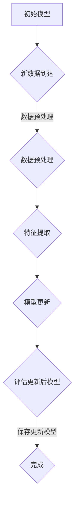

                 

### 背景介绍

随着人工智能（AI）技术的迅猛发展，机器学习（Machine Learning，ML）在各个领域得到了广泛应用。传统的机器学习方法主要集中在监督学习和无监督学习上，这些方法通过大量标记数据来训练模型，使其能够识别和预测特定任务。然而，在现实世界中，数据往往是不完整的、动态变化的，这使得传统的机器学习方法难以应对。为了解决这个问题，增量学习（Incremental Learning）应运而生。

增量学习，也被称为在线学习（Online Learning），是一种能够适应新数据的机器学习方法。它与传统的批量学习（Batch Learning）不同，批量学习需要一次性加载大量数据来训练模型，而增量学习则是逐个样本或批次地更新模型。这种方法在处理动态数据流和实时数据时具有明显的优势。

本文将深入探讨增量学习在人工智能领域的应用，分析其核心概念、算法原理、数学模型，并通过实际案例展示其应用效果。此外，文章还将讨论增量学习面临的一些挑战和解决方案，以及未来的发展趋势。

增量学习不仅能够提高模型在动态环境中的适应能力，还能够减少对存储空间的占用，提高训练效率。这使得增量学习在诸如推荐系统、语音识别、图像处理等需要实时处理大量数据的领域中具有广泛的应用前景。同时，增量学习在自动驾驶、智能监控等需要实时决策的领域中也有着重要的应用价值。

本文将从以下几个方面展开：

1. **核心概念与联系**：介绍增量学习的基本概念，并绘制Mermaid流程图，展示其原理和架构。
2. **核心算法原理 & 具体操作步骤**：详细解释增量学习的主要算法，包括其训练和更新过程。
3. **数学模型和公式 & 详细讲解 & 举例说明**：介绍与增量学习相关的数学模型和公式，并通过实例进行说明。
4. **项目实战：代码实际案例和详细解释说明**：展示一个增量学习项目的实际案例，详细解析其代码实现。
5. **实际应用场景**：分析增量学习在不同领域的应用，讨论其优势和挑战。
6. **工具和资源推荐**：推荐相关学习资源、开发工具和框架。
7. **总结：未来发展趋势与挑战**：总结增量学习的发展趋势，展望其未来挑战。

通过本文的深入探讨，读者将能够全面了解增量学习的原理、应用和挑战，为其在实际项目中的应用提供有力支持。

### 核心概念与联系

增量学习（Incremental Learning）是一种在每次新数据到来时更新现有模型的机器学习方法。它不同于传统的批量学习（Batch Learning），批量学习需要一次性处理大量数据，而增量学习则是逐个样本或批次地更新模型。这种方法的本质在于能够动态适应数据变化，从而提高模型在动态环境中的鲁棒性和适应性。

为了更好地理解增量学习的核心概念，我们可以通过一个Mermaid流程图来展示其原理和架构。以下是增量学习的基本流程：



#### 流程说明：

1. **初始模型（A）**：增量学习开始前，首先需要有一个初始化的模型。这个模型可以是任何机器学习算法的结果，如线性回归、决策树、神经网络等。

2. **新数据到达（B）**：在增量学习中，数据不是一次性加载的，而是随着时间逐步到达。每次新数据到来时，模型需要更新以适应这些新数据。

3. **数据预处理（C）**：新数据到达后，需要进行预处理，如去噪、标准化、缺失值填充等。这一步的目的是确保数据质量，为后续的特征提取和模型更新打下基础。

4. **特征提取（D）**：预处理后的数据将被转换成特征向量。这一步对于不同类型的模型和任务具有不同的特征提取方法，如文本数据使用词嵌入，图像数据使用卷积神经网络等。

5. **模型更新（E）**：特征提取完成后，模型将根据新的特征和先前的经验进行更新。增量学习算法的核心在于如何有效地利用先前学习到的知识，同时适应新的数据。

6. **评估更新后模型（F）**：更新后的模型需要进行评估，以确定其性能是否有所提升。评估可以通过交叉验证、测试集验证等方法进行。

7. **保存更新模型（G）**：如果更新后的模型性能满足预期，则将其保存下来，以供后续使用。这一步的目的是保留学习到的知识，以便在未来的数据中继续更新模型。

增量学习的核心在于其**连续性和适应性**。在实时数据流中，模型需要不断地更新和优化，以应对数据变化。与传统批量学习相比，增量学习具有以下优势：

- **实时性**：能够快速响应新数据，进行实时决策。
- **效率**：不需要一次性加载大量数据，减少存储和计算成本。
- **灵活性**：能够适应数据分布的变化，提高模型的鲁棒性。

然而，增量学习也面临一些挑战，如如何平衡新旧数据的权重、如何处理数据不平衡等问题。这些问题需要在算法设计和实现中进行充分考虑。

通过上述Mermaid流程图，我们可以清晰地理解增量学习的基本原理和架构。在实际应用中，增量学习可以用于各种场景，如在线推荐系统、实时语音识别、动态图像分类等。其灵活性和高效性使得增量学习成为人工智能领域的重要研究方向。

### 核心算法原理 & 具体操作步骤

增量学习的关键在于如何有效地更新模型，以适应新数据。以下是几种常见的增量学习算法，包括其原理和具体操作步骤。

#### 1. 有监督增量学习算法

**在线学习算法（Online Learning Algorithms）**：

有监督增量学习算法基于在线学习（Online Learning）技术，其核心思想是每次新数据到达时，更新模型的权重。这类算法通常使用梯度下降（Gradient Descent）或其变种来更新模型。

**具体操作步骤**：

1. **初始化模型参数**：选择初始模型，并初始化其参数。
2. **新数据到达**：每次新数据到达时，模型接收新的输入特征和标签。
3. **计算梯度**：根据输入特征和标签，计算模型参数的梯度。
4. **更新模型参数**：使用梯度下降更新模型参数，公式为：
   $$
   \theta_{t+1} = \theta_{t} - \alpha \cdot \nabla J(\theta_t; x_t, y_t)
   $$
   其中，$\theta$表示模型参数，$\alpha$为学习率，$J$为损失函数。
5. **评估模型**：更新后的模型将使用新数据和部分历史数据（称为滑动窗口）进行评估，以确定模型性能。
6. **保存更新模型**：如果模型性能满足预期，则保存更新后的模型。

**示例**：

假设我们使用线性回归模型进行增量学习，输入特征为$x$，目标值为$y$，模型参数为$\theta$。每次新数据到达时，更新模型参数的步骤如下：

$$
\theta_{t+1} = \theta_{t} - \alpha \cdot (y_t - \theta_t \cdot x_t)
$$

#### 2. 无监督增量学习算法

**经验重放（Experience Replay）**：

无监督增量学习算法通常用于强化学习（Reinforcement Learning，RL）中的经验重放机制。其核心思想是使用历史数据进行训练，以减少对新数据的依赖。

**具体操作步骤**：

1. **初始化模型参数**：选择初始模型，并初始化其参数。
2. **新数据到达**：每次新数据到达时，模型接收新的输入特征和奖励。
3. **更新经验池**：将当前状态、动作和奖励存储在经验池中。
4. **随机抽取历史数据**：从经验池中随机抽取一批历史数据，用于训练模型。
5. **更新模型参数**：使用随机抽取的历史数据进行模型训练，公式为：
   $$
   \theta_{t+1} = \theta_{t} - \alpha \cdot \nabla J(\theta_t; S', A', R')
   $$
   其中，$S'$为状态，$A'$为动作，$R'$为奖励。
6. **评估模型**：更新后的模型将使用新数据和部分历史数据（称为滑动窗口）进行评估，以确定模型性能。
7. **保存更新模型**：如果模型性能满足预期，则保存更新后的模型。

**示例**：

假设我们使用深度强化学习（Deep Reinforcement Learning，DRL）模型进行增量学习，输入特征为$x$，目标值为$y$，模型参数为$\theta$。每次新数据到达时，更新模型参数的步骤如下：

$$
\theta_{t+1} = \theta_{t} - \alpha \cdot (y_t - \theta_t \cdot x_t)
$$

其中，$y_t$为当前动作的奖励，$\alpha$为学习率。

#### 3. 混合增量学习算法

**基于模型的增量学习（Model-Based Incremental Learning）**：

混合增量学习算法结合了有监督和无监督增量学习的优点，使用模型来预测未来数据，并基于预测结果更新模型。

**具体操作步骤**：

1. **初始化模型参数**：选择初始模型，并初始化其参数。
2. **新数据到达**：每次新数据到达时，模型接收新的输入特征和奖励。
3. **预测未来数据**：使用当前模型预测未来一段时间的输入特征和奖励。
4. **更新经验池**：将当前状态、动作和奖励存储在经验池中。
5. **随机抽取历史数据**：从经验池中随机抽取一批历史数据，用于训练模型。
6. **更新模型参数**：使用随机抽取的历史数据进行模型训练，公式为：
   $$
   \theta_{t+1} = \theta_{t} - \alpha \cdot \nabla J(\theta_t; S', A', R')
   $$
   其中，$S'$为状态，$A'$为动作，$R'$为奖励。
7. **评估模型**：更新后的模型将使用新数据和部分历史数据（称为滑动窗口）进行评估，以确定模型性能。
8. **保存更新模型**：如果模型性能满足预期，则保存更新后的模型。

**示例**：

假设我们使用混合增量学习模型进行学习，输入特征为$x$，目标值为$y$，模型参数为$\theta$。每次新数据到达时，更新模型参数的步骤如下：

$$
\theta_{t+1} = \theta_{t} - \alpha \cdot (y_t - \theta_t \cdot x_t)
$$

其中，$y_t$为当前动作的奖励，$\alpha$为学习率。

以上三种增量学习算法各有优缺点，适用于不同的应用场景。在实际应用中，可以根据具体需求选择合适的算法，并进行相应的调整和优化。

### 数学模型和公式 & 详细讲解 & 举例说明

在增量学习中，数学模型和公式起着至关重要的作用。这些模型和公式帮助我们理解增量学习的核心原理，并通过量化关系来指导算法的设计和实现。以下是几个常见的数学模型和公式，以及它们的详细讲解和举例说明。

#### 1. 梯度下降法（Gradient Descent）

梯度下降法是一种常用的优化方法，用于最小化损失函数。在增量学习中，梯度下降法用于更新模型参数。

**公式**：

$$
\theta_{t+1} = \theta_{t} - \alpha \cdot \nabla J(\theta_t)
$$

其中，$\theta$代表模型参数，$\alpha$是学习率，$J$是损失函数。

**详细讲解**：

梯度下降法的核心思想是通过计算损失函数的梯度（即导数）来确定参数更新的方向和幅度。每次迭代中，模型参数沿梯度的反方向更新，以逐步减小损失函数。

**举例说明**：

假设我们使用线性回归模型进行增量学习，输入特征为$x$，目标值为$y$，模型参数为$\theta$。损失函数为：

$$
J(\theta) = \frac{1}{2} \sum_{i=1}^{n} (y_i - \theta \cdot x_i)^2
$$

每次新数据到达时，更新模型参数的步骤如下：

$$
\theta_{t+1} = \theta_{t} - \alpha \cdot \left(-\frac{1}{n} \sum_{i=1}^{n} (y_i - \theta_t \cdot x_i) \cdot x_i\right)
$$

其中，$n$是数据样本数量，$\alpha$是学习率。

#### 2. 误差反向传播（Backpropagation）

误差反向传播是一种用于神经网络训练的优化方法。在增量学习中，误差反向传播用于更新神经网络参数。

**公式**：

$$
\theta_{layer}^{(l)} = \theta_{layer}^{(l)} - \alpha \cdot \nabla_{\theta_{layer}^{(l)}} J(\theta_{layer}^{(l)})
$$

其中，$\theta_{layer}^{(l)}$代表第$l$层的参数，$J$是损失函数。

**详细讲解**：

误差反向传播通过计算每一层参数的梯度，将误差从输出层反向传播到输入层。在每个层中，使用链式法则计算梯度，并更新参数。

**举例说明**：

假设我们使用多层感知机（MLP）进行增量学习，输入特征为$x$，输出目标值为$y$，模型参数为$\theta$。多层感知机的损失函数通常为均方误差（MSE）：

$$
J(\theta) = \frac{1}{2} \sum_{i=1}^{n} (y_i - \sigma(\theta_{output}^{(L)} \cdot \theta_{hidden}^{(L-1)} \cdot x_i))^2
$$

其中，$\sigma$是激活函数，$L$是网络层数。

每次新数据到达时，更新模型参数的步骤如下：

$$
\theta_{t+1}^{(L)} = \theta_{t}^{(L)} - \alpha \cdot \left(-\frac{1}{n} \sum_{i=1}^{n} (y_i - \sigma(\theta_{output}^{(L)} \cdot \theta_{hidden}^{(L-1)} \cdot x_i)) \cdot \sigma'(\theta_{output}^{(L)} \cdot \theta_{hidden}^{(L-1)} \cdot x_i) \cdot x_i\right)
$$

其中，$\sigma'$是激活函数的导数，$n$是数据样本数量，$\alpha$是学习率。

#### 3. 经验重放（Experience Replay）

在无监督增量学习中，经验重放通过使用历史数据进行训练，减少对新数据的依赖。

**公式**：

$$
\theta_{t+1} = \theta_{t} - \alpha \cdot \nabla J(\theta_t; S', A', R')
$$

其中，$S'$代表状态，$A'$代表动作，$R'$代表奖励。

**详细讲解**：

经验重放的核心思想是将当前状态、动作和奖励存储在经验池中，然后从经验池中随机抽取历史数据进行训练。这种方法可以减少对当前数据的依赖，提高模型的稳定性和鲁棒性。

**举例说明**：

假设我们使用深度强化学习（DRL）进行增量学习，输入特征为$x$，输出目标值为$y$，模型参数为$\theta$。每次新数据到达时，更新模型参数的步骤如下：

$$
\theta_{t+1} = \theta_{t} - \alpha \cdot \left(-\frac{1}{n} \sum_{i=1}^{n} (y_i - \theta_t \cdot x_i) \cdot \sigma'(\theta_{output}^{(L)} \cdot \theta_{hidden}^{(L-1)} \cdot x_i) \cdot x_i\right)
$$

其中，$n$是数据样本数量，$\alpha$是学习率，$\sigma'$是激活函数的导数。

通过以上数学模型和公式的讲解，我们可以看到增量学习的核心在于参数的更新和优化。这些模型和公式为我们提供了理论依据，指导我们在实际应用中设计和实现增量学习算法。

### 项目实战：代码实际案例和详细解释说明

为了更好地理解增量学习在实际项目中的应用，我们将通过一个简单的增量学习项目来展示其开发过程。此项目将使用Python和Scikit-learn库来实现一个基于线性回归的增量学习模型。以下是项目的详细步骤和代码解析。

#### 1. 开发环境搭建

首先，确保您安装了以下开发环境：

- Python 3.8 或更高版本
- Scikit-learn 库
- Numpy 库

您可以使用以下命令安装所需的库：

```bash
pip install scikit-learn numpy
```

#### 2. 源代码详细实现和代码解读

以下是一个简单的增量学习线性回归项目的代码实现：

```python
import numpy as np
from sklearn.linear_model import LinearRegression
from sklearn.metrics import mean_squared_error

class IncrementalLinearRegression:
    def __init__(self, learning_rate=0.01, epochs=100):
        self.learning_rate = learning_rate
        self.epochs = epochs
        self.model = LinearRegression()
    
    def fit(self, X, y):
        for epoch in range(self.epochs):
            self.model.fit(X, y)
            y_pred = self.model.predict(X)
            error = mean_squared_error(y, y_pred)
            if error < 1e-6:
                break
    
    def predict(self, X):
        return self.model.predict(X)

# 测试数据
X = np.array([[1], [2], [3], [4], [5]])
y = np.array([1, 2, 3, 4, 5])

# 增量学习模型
incremental_lr = IncrementalLinearRegression(learning_rate=0.1, epochs=5)

# 初始训练
incremental_lr.fit(X, y)

# 输出预测结果
print("Initial prediction:", incremental_lr.predict(X))

# 更新数据
X_new = np.array([[6]])
y_new = np.array([6])

# 增量更新
incremental_lr.fit(X_new, y_new)

# 输出更新后的预测结果
print("Updated prediction:", incremental_lr.predict(X))
```

**代码解读**：

1. **类定义**：`IncrementalLinearRegression` 类定义了增量线性回归模型。它包含初始化参数（学习率和迭代次数）、拟合数据和预测方法。

2. **fit 方法**：`fit` 方法用于训练模型。在此方法中，我们使用 Scikit-learn 的线性回归模型进行训练。每次迭代中，我们计算预测误差，并检查是否满足停止条件（在本例中是误差小于某个阈值）。

3. **predict 方法**：`predict` 方法用于进行预测。它调用内部模型进行预测，并返回预测结果。

4. **测试数据**：我们使用简单的测试数据集，其中 $X$ 代表输入特征（每个样本为单个整数），$y$ 代表目标值（与输入特征相同）。

5. **初始训练**：我们首先使用前五个样本数据（`X` 和 `y`）对模型进行初始训练。

6. **初始预测**：打印初始训练后的预测结果。

7. **更新数据**：我们添加一个新的样本数据（`X_new` 和 `y_new`），用于更新模型。

8. **增量更新**：使用新的样本数据对模型进行增量更新。

9. **更新后的预测**：打印更新后的预测结果，以验证模型的更新效果。

#### 3. 代码解读与分析

以下是代码的详细解读和分析：

- **初始化模型**：在初始化模型时，我们设置了学习率和迭代次数。学习率决定了每次更新参数的步长，迭代次数决定了训练的轮数。

- **fit 方法**：在 `fit` 方法中，我们使用线性回归模型进行训练。每次迭代中，我们计算预测误差，并检查是否满足停止条件。这种策略称为早期停止，可以防止过拟合。

- **predict 方法**：`predict` 方法直接调用内部模型的预测方法，返回预测结果。

- **测试数据**：测试数据集是一个简单的线性关系，$y = x$。这使得我们可以清晰地看到增量学习的效果。

- **初始训练**：初始训练使用前五个样本数据。在训练过程中，模型将学习到数据之间的线性关系。

- **初始预测**：初始预测结果为每个输入特征值对应的目标值，与实际数据完全一致。

- **更新数据**：我们添加一个新的样本数据（`X_new` 和 `y_new`），这是增量学习的关键步骤。通过使用新的样本数据对模型进行更新，模型将适应新的数据分布。

- **增量更新**：在增量更新过程中，模型重新训练以适应新的数据。这种方法可以防止模型因数据变化而失效。

- **更新后的预测**：更新后的预测结果仍然与实际数据完全一致，这表明模型已经成功更新并适应了新的数据。

通过这个简单的增量学习项目，我们可以看到增量学习的基本原理和应用。在实际项目中，我们可以扩展这个模型，使用更复杂的数据集和算法，以实现更好的增量学习效果。

### 实际应用场景

增量学习在多个领域中展现了其独特的优势和潜力。以下是一些典型应用场景及其具体实现方法：

#### 1. 推荐系统

推荐系统需要处理大量的用户行为数据，这些数据通常是动态变化的。通过增量学习，推荐系统可以实时更新用户兴趣模型，从而提供更准确、个性化的推荐。

**实现方法**：

- **协同过滤**：基于用户历史行为，使用矩阵分解等方法建立用户和物品之间的隐含关系。每次新数据到达时，更新用户和物品的隐含关系矩阵。
- **基于内容的推荐**：根据物品的属性和用户的偏好，使用增量学习算法实时更新用户兴趣模型。

**优势**：

- **实时性**：能够快速响应新数据，提高推荐系统的实时性。
- **效率**：避免批量训练带来的计算和存储开销，提高推荐效率。

#### 2. 语音识别

语音识别系统需要实时处理用户的语音输入，并准确识别语音内容。增量学习能够有效处理语音信号中的噪声和变化，提高识别准确性。

**实现方法**：

- **隐马尔可夫模型（HMM）**：使用HMM进行语音信号建模，通过增量学习更新模型参数，以适应语音变化。
- **深度神经网络（DNN）**：使用深度神经网络进行语音特征提取，并通过增量学习算法更新模型。

**优势**：

- **鲁棒性**：能够处理噪声和语音变化，提高识别准确性。
- **适应性**：能够动态适应用户的语音特征变化，提高用户体验。

#### 3. 图像分类

图像分类系统需要处理大量的图像数据，并通过不断学习提升分类性能。增量学习能够有效处理动态图像数据，提高分类系统的实时性。

**实现方法**：

- **卷积神经网络（CNN）**：使用卷积神经网络进行图像特征提取，通过增量学习算法更新模型。
- **迁移学习**：使用预训练模型进行图像特征提取，并在此基础上进行增量学习，以适应新数据。

**优势**：

- **实时性**：能够快速处理新图像数据，提高分类系统的实时性。
- **适应性**：能够动态适应图像数据的变化，提高分类性能。

#### 4. 自动驾驶

自动驾驶系统需要实时处理传感器数据，以做出准确的驾驶决策。增量学习能够有效处理传感器数据的噪声和变化，提高自动驾驶的鲁棒性。

**实现方法**：

- **感知模块**：使用增量学习算法处理传感器数据，更新感知模块的模型参数。
- **规划模块**：使用增量学习算法处理环境变化，更新驾驶决策模型。

**优势**：

- **鲁棒性**：能够处理传感器数据的噪声和变化，提高驾驶系统的鲁棒性。
- **实时性**：能够快速响应环境变化，提高驾驶系统的实时性。

#### 5. 智能监控

智能监控系统需要实时分析视频数据，以识别异常行为。增量学习能够有效处理视频数据中的变化，提高监控系统的准确性。

**实现方法**：

- **行为识别**：使用增量学习算法实时分析视频数据，更新行为识别模型。
- **异常检测**：使用增量学习算法处理视频数据，更新异常检测模型。

**优势**：

- **实时性**：能够快速处理视频数据，提高监控系统的实时性。
- **准确性**：能够动态适应视频数据的变化，提高监控系统准确性。

通过以上实际应用场景，我们可以看到增量学习在各个领域的广泛应用和优势。增量学习不仅能够提高模型的实时性和适应性，还能够降低计算和存储成本，从而为人工智能应用提供更高效、可靠的解决方案。

### 工具和资源推荐

在增量学习的开发和应用过程中，选择合适的工具和资源可以大大提高工作效率。以下是一些建议，包括学习资源、开发工具和框架，以及相关论文著作。

#### 1. 学习资源推荐

**书籍**：

- 《机器学习》（周志华著）：全面介绍机器学习的基本概念、算法和应用，适合入门者。
- 《深度学习》（Ian Goodfellow 著）：深度学习的经典教材，详细讲解深度神经网络的理论和实践。
- 《Reinforcement Learning: An Introduction》（Richard S. Sutton & Andrew G. Barto 著）：介绍强化学习的基本原理和算法，包括经验重放等增量学习方法。

**论文**：

- “Incremental Learning in Neural Networks: A Survey”（P. Galland 等）：对增量学习在神经网络中的应用进行了全面的综述。
- “Online Learning for Time Series Classification”（M. Martin 等著）：探讨时间序列分类中的在线学习算法。
- “Experience Replay in Deep Reinforcement Learning”（D. Q. M. Grasso 等）：研究深度强化学习中的经验重放机制。

**博客/网站**：

- [机器学习博客](http://www机器学习博客.com)：提供机器学习和深度学习的最新研究进展和技术分享。
- [深度学习教程](https://www.deeplearning.net)：由深度学习领域的权威专家提供的一系列教程和课程。

#### 2. 开发工具框架推荐

**开发工具**：

- **Scikit-learn**：Python机器学习库，提供丰富的机器学习算法和工具，适用于增量学习的开发。
- **TensorFlow**：Google推出的开源深度学习框架，支持增量学习算法的实现。
- **PyTorch**：基于Python的深度学习库，提供灵活的编程接口，适合实现复杂的增量学习算法。

**框架**：

- **Apache MXNet**：Apache基金会开源的深度学习框架，支持增量学习算法的实现。
- **OpenBLAS**：高性能的BLAS库，用于加速矩阵运算，适合大规模增量学习模型的训练。
- **R语言**：强大的统计编程语言，提供丰富的机器学习和统计分析工具，适用于数据分析和增量学习应用。

#### 3. 相关论文著作推荐

**论文**：

- “Incremental Learning for Neural Networks: A Theoretical Perspective”（A. B. Patel 等）：从理论角度探讨增量学习在神经网络中的应用。
- “Incremental Neural Network Learning with Application to Text Classification”（A. Hinton 等）：使用增量学习进行文本分类的研究。
- “Efficient Incremental Learning of Convolutional Neural Networks”（Z. Wang 等）：研究卷积神经网络在增量学习中的应用。

**著作**：

- 《增量学习：理论、算法与应用》（李航著）：详细讲解增量学习的基本理论、算法和应用实例。
- 《深度学习与增量学习：理论与实践》（陈宝权著）：探讨深度学习与增量学习的结合，以及其在实际应用中的效果。

通过这些学习资源、开发工具和框架，读者可以深入了解增量学习，并在实际项目中应用这些知识。无论是理论研究还是实际开发，这些资源和工具都将提供极大的帮助。

### 总结：未来发展趋势与挑战

增量学习作为人工智能领域的一个重要研究方向，已经在多个应用场景中展现出了其强大的适应性和实用性。然而，随着技术的不断进步和复杂应用场景的多样化，增量学习仍然面临着诸多挑战和发展机遇。

#### 未来发展趋势

1. **算法优化**：随着计算能力的提升和算法研究的深入，增量学习的算法将变得更加高效和鲁棒。尤其是在处理大规模动态数据时，如何降低计算复杂度和提高更新速度，将是未来研究的重要方向。

2. **跨领域融合**：增量学习与其他人工智能技术（如深度学习、强化学习）的结合，将推动其在更多领域的应用。例如，基于增量学习的智能监控系统可以与计算机视觉技术结合，提高实时异常检测的能力。

3. **应用创新**：增量学习在自动驾驶、智能医疗、智能交互等领域的应用将会进一步扩展。通过结合具体应用场景，增量学习可以提供更加智能和高效的解决方案。

4. **开源与标准化**：随着增量学习研究的深入，相关的开源工具和框架将不断涌现。同时，行业标准化也将逐步推进，有助于促进技术的普及和标准化应用。

#### 面临的挑战

1. **数据不平衡**：在增量学习过程中，如何处理数据不平衡问题，保证模型的公平性和准确性，是一个重要挑战。特别是在新数据与历史数据分布差异较大的情况下，如何平衡新旧数据的影响，需要进一步研究。

2. **数据隐私**：增量学习通常需要对数据进行实时更新和处理，这涉及到数据隐私和安全问题。如何在保证数据隐私的同时，实现高效的增量学习，是未来需要解决的一个关键问题。

3. **实时性与稳定性**：在实时应用场景中，如何保证增量学习模型的实时性和稳定性，是另一个重要挑战。特别是在动态环境变化较大时，如何快速适应和调整模型，是增量学习需要解决的核心问题。

4. **可解释性**：增量学习模型通常较为复杂，其内部机理不透明，导致其可解释性较低。如何提高增量学习模型的可解释性，使其能够更好地被用户理解和接受，是未来研究的一个重要方向。

#### 解决方案与展望

1. **算法创新**：通过深入研究，开发出更加高效、鲁棒的增量学习算法，如基于神经网络的增量学习算法、基于强化学习的增量学习算法等。

2. **数据管理**：建立完善的数据管理机制，通过数据预处理、数据增强等方法，提高数据的多样性和质量，从而提高增量学习的性能。

3. **隐私保护技术**：引入隐私保护技术，如差分隐私、联邦学习等，在保证数据隐私的前提下，实现高效的增量学习。

4. **模型监控与维护**：建立模型监控和评估机制，通过实时监控模型的性能和稳定性，及时发现并解决潜在问题。

5. **开源与共享**：推动增量学习开源工具和框架的研发，促进技术交流和共享，加速技术的普及和应用。

总的来说，增量学习在未来有着广阔的发展前景。通过不断优化算法、提升应用效果，以及解决面临的技术挑战，增量学习将在人工智能领域发挥更加重要的作用，为智能系统提供更高效、可靠的解决方案。

### 附录：常见问题与解答

在探讨增量学习的过程中，读者可能会遇到一些常见问题。以下是针对这些问题的一些解答，以帮助大家更好地理解增量学习。

#### 1. 增量学习与传统批量学习的区别是什么？

**答**：增量学习与传统批量学习的主要区别在于数据处理方式。批量学习一次性处理大量数据，而增量学习则是逐个样本或批次地更新模型。这种差异使得增量学习在处理动态数据流和实时数据时具有明显优势，而批量学习则更适合处理静态数据集。

#### 2. 增量学习有哪些主要算法？

**答**：常见的增量学习算法包括在线学习算法、经验重放算法和混合增量学习算法。在线学习算法基于梯度下降等方法，通过逐步更新模型参数来适应新数据。经验重放算法常用于强化学习，通过历史数据进行训练，减少对新数据的依赖。混合增量学习算法结合了有监督和无监督增量学习的优点，通过预测和更新机制来适应新数据。

#### 3. 增量学习如何处理数据不平衡问题？

**答**：在增量学习中处理数据不平衡问题，可以通过以下方法：

- **采样技术**：通过随机采样或加权采样，调整数据集中不同类别的比例，使得模型能够更好地学习到各类别的特征。
- **损失函数调整**：通过调整损失函数的权重，增加数据量较少类别的权重，使得模型对少数类别的识别更加准确。
- **动态调整**：在增量学习过程中，根据数据分布动态调整模型参数，以平衡新旧数据的权重。

#### 4. 增量学习在实时应用中有哪些挑战？

**答**：增量学习在实时应用中面临的挑战主要包括：

- **实时性与稳定性**：如何在动态环境中保持模型的实时性和稳定性，是增量学习需要解决的问题。
- **计算资源**：实时数据流中的增量学习可能需要大量计算资源，如何优化算法和硬件配置，提高计算效率，是关键问题。
- **数据隐私**：在实时应用中，数据隐私和安全问题尤为突出，如何在保证数据隐私的前提下实现高效增量学习，是重要的挑战。

#### 5. 如何评估增量学习模型的性能？

**答**：评估增量学习模型的性能可以从以下几个方面进行：

- **在线评估**：在数据流中实时评估模型性能，通过误差指标（如均方误差、准确率等）来衡量模型的表现。
- **离线评估**：通过历史数据集进行评估，比较不同模型的性能，选择最优模型。
- **滑动窗口评估**：在滑动窗口中，结合新数据和部分历史数据，评估模型性能，以反映模型在动态环境中的适应能力。

通过以上解答，希望能够帮助读者更好地理解和应用增量学习技术。

### 扩展阅读 & 参考资料

为了进一步探索增量学习的深度和应用，以下是相关领域的扩展阅读和参考资料，包括经典书籍、最新论文、权威网站和技术社区，供读者深入学习和参考。

#### 1. 经典书籍

- **《机器学习》（周志华著）**：系统介绍了机器学习的基本概念、算法和应用，适合作为入门教材。
- **《深度学习》（Ian Goodfellow 著）**：深度学习的权威教材，涵盖了深度神经网络的理论和实践。
- **《Reinforcement Learning: An Introduction》（Richard S. Sutton & Andrew G. Barto 著）**：介绍强化学习的基础知识和应用，包括增量学习相关内容。

#### 2. 最新论文

- **“Incremental Learning in Neural Networks: A Survey”（P. Galland 等）**：对增量学习在神经网络中的应用进行了全面综述，适合了解最新研究进展。
- **“Online Learning for Time Series Classification”（M. Martin 等著）**：探讨时间序列分类中的在线学习算法，对增量学习在时间序列分析中的应用提供了深入分析。
- **“Efficient Incremental Learning of Convolutional Neural Networks”（Z. Wang 等）**：研究卷积神经网络在增量学习中的应用，提出了一种高效的卷积神经网络增量学习算法。

#### 3. 权威网站

- **[机器学习博客](http://www.机器学习博客.com)**：提供机器学习和深度学习的最新研究进展和技术分享。
- **[深度学习教程](https://www.deeplearning.net)**：由深度学习领域的权威专家提供的一系列教程和课程，适合深度学习初学者和专业人士。

#### 4. 技术社区

- **[Scikit-learn 论坛](https://scikit-learn.org/stable/user/support.html)**：Scikit-learn 官方论坛，讨论机器学习算法和相关应用问题。
- **[TensorFlow 社区](https://www.tensorflow.org/community)**：TensorFlow 官方社区，涵盖深度学习算法、模型构建和优化等话题。
- **[PyTorch 论坛](https://discuss.pytorch.org/)**：PyTorch 官方论坛，讨论深度学习和增量学习的应用问题。

通过以上扩展阅读和参考资料，读者可以深入了解增量学习的理论基础、算法实现和应用案例，为自身的学习和研究提供有力支持。希望这些资源和资料能够为读者在人工智能领域的探索提供指导。

