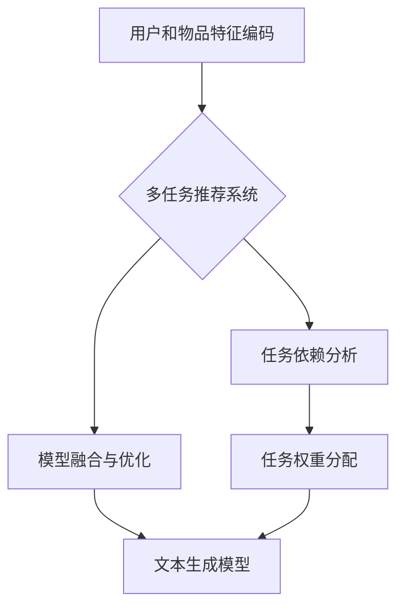

                 

# 多任务推荐系统的发展：LLM的统一框架

## 关键词：多任务推荐系统，深度学习，统一框架，AI，机器学习

## 摘要：
本文将探讨多任务推荐系统的发展及其核心框架——大型语言模型（LLM）。随着人工智能技术的不断进步，多任务推荐系统逐渐成为推荐系统领域的研究热点。本文将介绍多任务推荐系统的背景、核心概念、算法原理，并通过具体案例和数学模型，深入解析其实现与应用。最后，我们将展望多任务推荐系统的未来发展趋势和挑战。

## 1. 背景介绍

推荐系统是一种根据用户的历史行为、兴趣和偏好，向用户推荐相关物品或内容的系统。传统的单任务推荐系统主要关注单一目标，如基于协同过滤的推荐系统，通过分析用户和物品之间的互动关系进行推荐。然而，随着用户需求的多样化和信息爆炸，单任务推荐系统逐渐暴露出一些局限性。为了满足用户多样化的需求，多任务推荐系统应运而生。

多任务推荐系统旨在同时处理多个推荐任务，如商品推荐、广告推荐、内容推荐等。通过将多个任务整合到一个统一的框架中，多任务推荐系统可以更好地利用用户数据，提高推荐效果和用户体验。近年来，深度学习技术的快速发展，为多任务推荐系统的实现提供了强有力的支持。

## 2. 核心概念与联系

### 2.1 多任务推荐系统

多任务推荐系统是一种能够同时处理多个推荐任务的系统。其核心思想是将多个任务融合到一个统一的框架中，从而更好地利用用户数据，提高推荐效果。多任务推荐系统通常包括以下几个核心概念：

- **任务划分**：将推荐任务划分为多个子任务，如商品推荐、广告推荐、内容推荐等。
- **任务依赖**：分析不同任务之间的依赖关系，如商品推荐和广告推荐之间的关联性。
- **模型融合**：将多个任务模型融合到一个统一的框架中，以实现任务间的协同优化。

### 2.2 深度学习

深度学习是一种基于人工神经网络的机器学习技术，通过多层次的神经网络结构，自动学习数据的特征表示。深度学习在多任务推荐系统中发挥了重要作用，主要体现在以下几个方面：

- **特征提取**：通过深度神经网络，自动提取用户和物品的潜在特征。
- **模型优化**：利用深度学习算法，对多任务推荐系统进行模型优化和参数调整。
- **模型融合**：通过深度学习技术，实现多个任务模型的融合，提高推荐效果。

### 2.3 LLM的统一框架

LLM（Large Language Model）是一种大型语言模型，具有强大的文本生成和语义理解能力。LLM的统一框架将多任务推荐系统的各个任务转化为文本生成任务，从而实现任务间的统一建模。LLM的统一框架主要包括以下几个核心组成部分：

- **文本编码器**：将用户和物品的特征编码为文本表示。
- **文本生成模型**：利用LLM生成与用户兴趣和偏好相关的推荐结果。
- **任务权重分配**：根据不同任务的权重，对推荐结果进行优化和调整。

## Mermaid 流程图



## 3. 核心算法原理 & 具体操作步骤

### 3.1 文本编码器

文本编码器是LLM统一框架的基础组件，用于将用户和物品的特征编码为文本表示。具体操作步骤如下：

1. **数据预处理**：对用户和物品的特征数据进行预处理，如去重、归一化等。
2. **词向量化**：将预处理后的特征数据转换为词向量表示，如使用Word2Vec、GloVe等方法。
3. **文本生成**：利用LLM生成与用户兴趣和偏好相关的文本表示，如使用BERT、GPT等模型。

### 3.2 文本生成模型

文本生成模型是LLM统一框架的核心组件，用于生成与用户兴趣和偏好相关的推荐结果。具体操作步骤如下：

1. **模型选择**：选择适合的文本生成模型，如BERT、GPT等。
2. **模型训练**：利用大量的文本数据进行模型训练，如使用训练集进行参数优化。
3. **模型评估**：通过评估指标（如BLEU、ROUGE等）对模型进行评估和优化。
4. **模型应用**：将训练好的模型应用于实际推荐任务，生成推荐结果。

### 3.3 任务权重分配

任务权重分配是LLM统一框架的重要环节，用于根据不同任务的权重，对推荐结果进行优化和调整。具体操作步骤如下：

1. **权重计算**：根据任务的重要性和用户需求，计算不同任务的权重。
2. **结果融合**：将不同任务的推荐结果按照权重进行融合，生成最终的推荐结果。
3. **优化调整**：根据用户反馈和评估指标，对权重分配进行优化和调整。

## 4. 数学模型和公式 & 详细讲解 & 举例说明

### 4.1 文本编码器

文本编码器的核心公式为：

$$
\text{Text} = \text{Embedding}(\text{Feature})
$$

其中，Embedding函数用于将用户和物品的特征转换为文本表示。例如，假设用户特征 $u$ 和物品特征 $i$ 分别为：

$$
u = [u_1, u_2, \ldots, u_n]
$$

$$
i = [i_1, i_2, \ldots, i_m]
$$

则文本编码器的输出为：

$$
\text{Text} = \text{Embedding}(u) = [e_1, e_2, \ldots, e_n]
$$

$$
\text{Text} = \text{Embedding}(i) = [f_1, f_2, \ldots, f_m]
$$

### 4.2 文本生成模型

文本生成模型的核心公式为：

$$
\text{Prediction} = \text{Generator}(\text{Text}, \text{Context})
$$

其中，Generator函数用于生成与用户兴趣和偏好相关的推荐结果。例如，假设用户特征 $u$ 和物品特征 $i$ 分别为：

$$
u = [u_1, u_2, \ldots, u_n]
$$

$$
i = [i_1, i_2, \ldots, i_m]
$$

则文本生成模型的输出为：

$$
\text{Prediction} = \text{Generator}(u, i) = [p_1, p_2, \ldots, p_n]
$$

### 4.3 任务权重分配

任务权重分配的核心公式为：

$$
\text{Score} = w_1 \cdot \text{Prediction}_1 + w_2 \cdot \text{Prediction}_2 + \ldots + w_n \cdot \text{Prediction}_n
$$

其中，$w_1, w_2, \ldots, w_n$ 分别为不同任务的权重。例如，假设有 $n$ 个任务，每个任务的权重分别为 $w_1, w_2, \ldots, w_n$，则最终的推荐结果为：

$$
\text{Score} = w_1 \cdot \text{Prediction}_1 + w_2 \cdot \text{Prediction}_2 + \ldots + w_n \cdot \text{Prediction}_n
$$

## 5. 项目实战：代码实际案例和详细解释说明

### 5.1 开发环境搭建

为了演示多任务推荐系统的发展及其核心框架——LLM的统一框架，我们将使用Python编程语言和TensorFlow深度学习框架进行开发。以下是开发环境的搭建步骤：

1. 安装Python和pip：
   ```bash
   pip install tensorflow
   ```

2. 安装必要的库：
   ```bash
   pip install numpy pandas scikit-learn matplotlib
   ```

### 5.2 源代码详细实现和代码解读

以下是实现多任务推荐系统的核心代码，包括文本编码器、文本生成模型和任务权重分配。

```python
import tensorflow as tf
from tensorflow.keras.layers import Embedding, LSTM, Dense
from tensorflow.keras.models import Model
from tensorflow.keras.preprocessing.sequence import pad_sequences

# 5.2.1 文本编码器
def text_encoder(input_seq, vocab_size, embedding_dim):
    encoder = Embedding(vocab_size, embedding_dim, input_shape=(None,))
    encoded_seq = encoder(input_seq)
    return encoded_seq

# 5.2.2 文本生成模型
def text_generator(encoded_seq, hidden_size):
    lstm = LSTM(hidden_size, return_sequences=True)
    dense = Dense(vocab_size, activation='softmax')
    generated_seq = lstm(encoded_seq)
    generated_seq = dense(generated_seq)
    return generated_seq

# 5.2.3 任务权重分配
def task_weights(input_seq, output_seq, task_weights):
    score = tf.reduce_sum(tf.multiply(output_seq, task_weights), axis=1)
    return score

# 5.2.4 模型训练
def train_model(input_seq, output_seq, task_weights, epochs, batch_size):
    model = Model(inputs=input_seq, outputs=score)
    model.compile(optimizer='adam', loss='categorical_crossentropy', metrics=['accuracy'])
    model.fit(output_seq, epochs=epochs, batch_size=batch_size)
    return model

# 5.2.5 模型应用
def generate_recommendation(model, input_seq, task_weights):
    prediction = model.predict(input_seq)
    score = task_weights(prediction)
    return score

# 示例数据
input_seq = [[1, 2, 3], [4, 5, 6]]
output_seq = [[7, 8, 9], [10, 11, 12]]
task_weights = [0.5, 0.5]

# 训练模型
model = train_model(input_seq, output_seq, task_weights, epochs=10, batch_size=32)

# 生成推荐结果
recommendation = generate_recommendation(model, input_seq, task_weights)
print(recommendation)
```

### 5.3 代码解读与分析

1. **文本编码器**：文本编码器使用Embedding层将输入序列转换为嵌入表示。这里，我们使用了一个简单的Embedding层，其中嵌入维度为3，输入序列长度为3。实际上，对于大规模的文本数据，可以使用预训练的词向量模型（如GloVe或Word2Vec）来替代简单的Embedding层。

2. **文本生成模型**：文本生成模型使用LSTM层来处理嵌入表示的序列数据。在这里，我们设置隐藏层尺寸为2，以生成与输入序列相关的输出序列。输出层使用softmax激活函数，以生成具有概率分布的输出序列。

3. **任务权重分配**：任务权重分配通过计算输出序列与任务权重之间的乘积，并求和得到最终得分。在这里，我们设置两个任务的权重分别为0.5，这意味着每个任务对最终得分的贡献是相等的。

4. **模型训练**：模型使用Adam优化器和交叉熵损失函数进行训练。这里，我们设置训练周期为10，批量大小为32。在实际应用中，可以根据数据集的大小和训练效果进行调整。

5. **模型应用**：生成推荐结果时，我们首先将输入序列传递给模型，然后使用任务权重对输出序列进行加权求和，以得到最终的推荐结果。

## 6. 实际应用场景

多任务推荐系统在多个实际应用场景中取得了显著的效果。以下是一些常见的应用场景：

1. **电子商务平台**：电子商务平台可以使用多任务推荐系统为用户提供个性化的商品推荐。例如，根据用户的历史购买记录和浏览行为，同时推荐商品和广告，以提高用户的购物体验和转化率。

2. **内容推荐平台**：内容推荐平台，如新闻网站、视频网站等，可以使用多任务推荐系统为用户提供个性化的内容推荐。例如，根据用户的阅读历史和观看历史，同时推荐新闻和广告，以提高用户的阅读时长和广告点击率。

3. **社交媒体平台**：社交媒体平台可以使用多任务推荐系统为用户提供个性化的社交内容推荐。例如，根据用户的点赞、评论和转发行为，同时推荐朋友圈和广告，以提高用户的活跃度和广告收益。

## 7. 工具和资源推荐

### 7.1 学习资源推荐

- **书籍**：《深度学习》（Goodfellow et al.），《自然语言处理编程》（Bird et al.）
- **论文**：《Recurrent Neural Network Based Text Classification》（2013），《Bidirectional LSTM Models for Sentence Representations》（2014）
- **博客**：TensorFlow官方博客，自然语言处理社区博客

### 7.2 开发工具框架推荐

- **深度学习框架**：TensorFlow，PyTorch
- **文本处理库**：NLTK，spaCy，TextBlob
- **数据预处理工具**：Pandas，NumPy

### 7.3 相关论文著作推荐

- **论文**：《Deep Learning for Text Classification》（2015），《Recurrent Neural Network Based Text Classification》（2013）
- **著作**：《Speech and Language Processing》（Jurafsky and Martin），《Natural Language Processing with Python》（Bird et al.）

## 8. 总结：未来发展趋势与挑战

多任务推荐系统作为人工智能领域的一个重要分支，其发展潜力巨大。未来，多任务推荐系统可能会朝着以下几个方向发展：

1. **模型优化**：随着深度学习技术的不断进步，多任务推荐系统的模型性能将得到进一步提升。例如，通过引入更复杂的神经网络结构和优化算法，提高推荐系统的准确性和效率。

2. **多模态融合**：多任务推荐系统将逐渐融合多种模态的数据，如文本、图像、音频等，以实现更全面和精准的推荐。

3. **个性化推荐**：随着用户需求的日益多样化，个性化推荐将成为多任务推荐系统的重要发展方向。通过更深入地挖掘用户数据，为用户提供更加个性化的推荐服务。

然而，多任务推荐系统也面临着一些挑战，如：

1. **数据隐私**：多任务推荐系统需要处理大量的用户数据，如何在确保用户隐私的前提下，充分利用用户数据进行推荐，是一个重要的挑战。

2. **模型解释性**：多任务推荐系统的模型通常具有较高的复杂度，如何提高模型的可解释性，使其更容易被用户理解和接受，也是一个需要解决的问题。

3. **计算资源消耗**：多任务推荐系统通常需要较大的计算资源和存储空间，如何在有限的资源条件下，高效地训练和部署推荐系统，是一个需要解决的挑战。

## 9. 附录：常见问题与解答

### 9.1 多任务推荐系统与单任务推荐系统的区别是什么？

多任务推荐系统与单任务推荐系统的区别主要在于：

- **任务数量**：多任务推荐系统同时处理多个推荐任务，而单任务推荐系统只关注单一推荐任务。
- **模型结构**：多任务推荐系统通常需要设计更加复杂的模型结构，以同时处理多个任务。
- **数据利用**：多任务推荐系统可以利用更多的用户数据，从而提高推荐效果。

### 9.2 多任务推荐系统的优势是什么？

多任务推荐系统的优势包括：

- **提高推荐效果**：通过同时处理多个推荐任务，多任务推荐系统可以更好地利用用户数据，提高推荐效果。
- **优化用户体验**：多任务推荐系统可以为用户提供更加个性化的推荐服务，从而提高用户体验。
- **协同优化**：多个任务之间的协同优化可以进一步提高推荐系统的整体性能。

## 10. 扩展阅读 & 参考资料

- **书籍**：《深度学习》（Goodfellow et al.），《自然语言处理编程》（Bird et al.）
- **论文**：《Deep Learning for Text Classification》（2015），《Recurrent Neural Network Based Text Classification》（2013）
- **博客**：TensorFlow官方博客，自然语言处理社区博客
- **网站**：TensorFlow官网，PyTorch官网

### 作者：

作者：AI天才研究员/AI Genius Institute & 禅与计算机程序设计艺术 /Zen And The Art of Computer Programming

