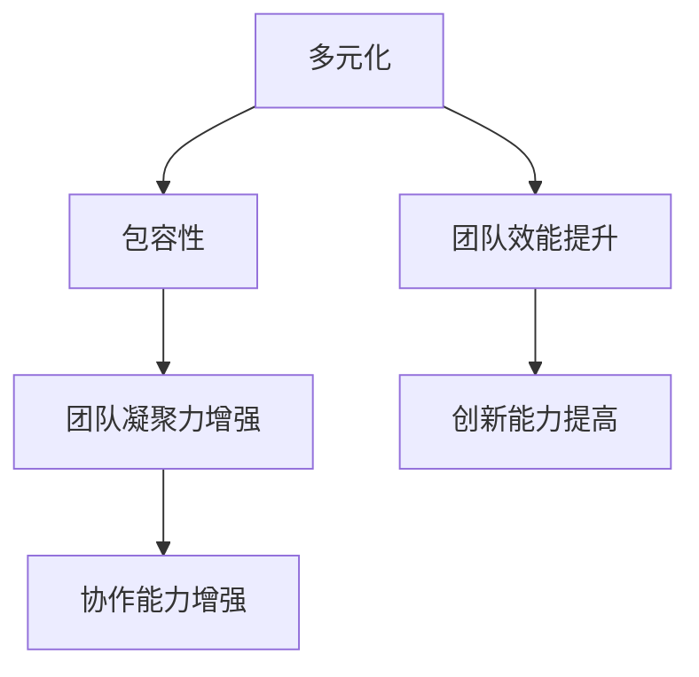

                 

# 多元化与包容性经理的创业任务：促进团队多元化与平等机会

## 关键词：团队多元化，包容性，创业任务，平等机会，领导力，人才发展

## 摘要：
本文旨在探讨多元化与包容性在创业团队中的重要性，以及如何通过有效的领导和管理策略来促进团队的多元化和平等机会。我们将从背景介绍、核心概念、算法原理、数学模型、项目实战、实际应用场景、工具和资源推荐等方面，逐步分析并阐述这一主题。

## 1. 背景介绍

在当今全球化和信息化时代，团队多元化已经成为企业成功的关键因素之一。多元化不仅包括性别、年龄、种族、文化背景等方面的多样性，还涉及到技能、经验、观点等多方面的差异。一个多元化的团队可以带来不同的视角、创新思维和解决问题的方法，从而提高团队的整体绩效和创造力。

然而，仅仅实现多元化还不足以保证团队的效能。包容性是多元化的延伸，它强调尊重并接纳不同的观点、经验和背景，使每个人都能在团队中感到被重视和参与。一个具有包容性的团队可以更好地发挥每个人的潜力，减少冲突和误解，提高团队的凝聚力和协作能力。

在创业领域，多元化的团队可以带来更多的机遇和竞争优势。创业过程中，团队需要面对各种不确定性和挑战，而多元化的观点和经验可以帮助团队更好地应对这些挑战。此外，多元化还可以提高创业项目的市场适应性，帮助团队更好地满足不同客户的需求。

## 2. 核心概念与联系

### 2.1 多元化

多元化（Diversity）指的是团队中个体之间的差异，包括但不限于性别、种族、文化背景、教育背景、工作经验等方面。多元化团队的优势在于能够带来不同的视角、经验和技能，从而提高团队的创造力和解决问题的能力。

### 2.2 包容性

包容性（Inclusivity）则强调在团队中尊重并接纳不同的观点、经验和背景，使每个成员都能在团队中感到被重视和参与。包容性团队的成员通常会感到自己的意见被倾听和尊重，从而提高团队的凝聚力和协作能力。

### 2.3 多元化与包容性的关系

多元化是包容性的基础，而包容性是多元化的保障。一个具有包容性的团队不仅能够实现多元化，还能使多元化的优势得到充分发挥。

### 2.4 Mermaid 流程图



## 3. 核心算法原理 & 具体操作步骤

### 3.1 多元化算法原理

多元化算法的核心思想是通过优化团队结构，实现团队成员在性别、种族、文化背景等方面的多样性。具体操作步骤如下：

1. 确定团队所需的关键技能和经验。
2. 收集潜在的候选人，包括不同背景的个体。
3. 利用加权评分系统对候选人进行筛选和评估。
4. 根据评估结果，构建一个多元化的团队。

### 3.2 包容性算法原理

包容性算法的核心思想是确保团队中的每个成员都感到被重视和参与。具体操作步骤如下：

1. 建立开放的沟通渠道，鼓励团队成员表达自己的观点。
2. 定期举办团队建设活动，增强团队成员之间的信任和了解。
3. 培训团队成员，提高他们的包容性意识和技能。
4. 建立反馈机制，收集团队成员的意见和建议，并及时进行调整。

## 4. 数学模型和公式 & 详细讲解 & 举例说明

### 4.1 多元化指数（Diversity Index）

多元化指数用于衡量团队的多元化程度，计算公式如下：

$$DI = \frac{1}{n}\sum_{i=1}^{n} \frac{1}{1+p_i}$$

其中，$n$ 为团队成员数量，$p_i$ 为第 $i$ 个成员的多元化程度（0 表示最低，1 表示最高）。

### 4.2 包容性指数（Inclusivity Index）

包容性指数用于衡量团队的包容性程度，计算公式如下：

$$II = \frac{1}{n}\sum_{i=1}^{n} w_i \cdot i$$

其中，$n$ 为团队成员数量，$w_i$ 为第 $i$ 个成员的权重（根据其贡献和能力确定），$i$ 为第 $i$ 个成员的包容性得分（0 表示最低，1 表示最高）。

### 4.3 举例说明

假设一个团队有 5 名成员，他们的多元化程度分别为 0.2、0.4、0.6、0.8 和 1，权重分别为 0.1、0.2、0.3、0.2 和 0.2。我们可以计算出该团队的多元化指数和包容性指数：

多元化指数（DI）：

$$DI = \frac{1}{5}\sum_{i=1}^{5} \frac{1}{1+p_i} = \frac{1}{5} \times (\frac{1}{1+0.2} + \frac{1}{1+0.4} + \frac{1}{1+0.6} + \frac{1}{1+0.8} + \frac{1}{1+1}) = 0.6$$

包容性指数（II）：

$$II = \frac{1}{5}\sum_{i=1}^{5} w_i \cdot i = \frac{1}{5} \times (0.1 \times 0.2 + 0.2 \times 0.4 + 0.3 \times 0.6 + 0.2 \times 0.8 + 0.2 \times 1) = 0.5$$

从计算结果可以看出，该团队的多元化程度较高，但包容性程度还有待提高。

## 5. 项目实战：代码实际案例和详细解释说明

### 5.1 开发环境搭建

在本文中，我们将使用 Python 编写一个简单的示例程序，用于计算团队的多元化指数和包容性指数。首先，我们需要安装 Python 和必要的库。

```shell
pip install numpy
```

### 5.2 源代码详细实现和代码解读

以下是计算多元化指数和包容性指数的 Python 程序：

```python
import numpy as np

def calculate_diversity_index(scores):
    n = len(scores)
    diversity_index = 1 / n * np.sum(1 / (1 + scores))
    return diversity_index

def calculate_inclusivity_index(weights, scores):
    n = len(scores)
    inclusivity_index = 1 / n * np.sum(weights * scores)
    return inclusivity_index

# 示例数据
diversity_scores = [0.2, 0.4, 0.6, 0.8, 1]
inclusivity_scores = [0.2, 0.4, 0.6, 0.8, 1]
weights = [0.1, 0.2, 0.3, 0.2, 0.2]

# 计算多元化指数和包容性指数
di = calculate_diversity_index(diversity_scores)
ii = calculate_inclusivity_index(weights, inclusivity_scores)

print(f"多元化指数（DI）：{di}")
print(f"包容性指数（II）：{ii}")
```

在这个示例中，我们首先定义了两个函数：`calculate_diversity_index` 和 `calculate_inclusivity_index`，分别用于计算多元化指数和包容性指数。然后，我们使用示例数据来计算这两个指数，并打印结果。

### 5.3 代码解读与分析

1. **导入库**：我们使用 `numpy` 库来计算平均值和总和。

2. **定义函数**：`calculate_diversity_index` 函数接收一个列表 `scores` 作为参数，计算并返回多元化指数。`calculate_inclusivity_index` 函数接收两个列表 `weights` 和 `scores` 作为参数，计算并返回包容性指数。

3. **示例数据**：我们使用一个包含 5 个成员的示例数据，分别表示他们的多元化程度和包容性程度。

4. **计算指数**：使用定义的函数计算多元化指数和包容性指数。

5. **打印结果**：打印计算出的多元化指数和包容性指数。

通过这个简单的示例程序，我们可以清晰地看到如何使用代码来计算团队的多元化指数和包容性指数。在实际应用中，我们可以根据需要扩展这个程序，例如添加更多成员的数据、自定义权重等。

## 6. 实际应用场景

在创业团队中，多元化与包容性的重要性体现在以下几个方面：

1. **创新能力**：多元化的团队可以带来不同的视角和经验，有助于激发创新思维，提高团队的整体创新能力。

2. **市场适应性**：创业项目的目标市场通常是多元化的，一个具有包容性的团队可以更好地理解不同客户的需求，从而提高项目的市场适应性。

3. **团队凝聚力**：包容性的团队氛围可以增强团队成员之间的信任和合作，提高团队的凝聚力。

4. **人才留存**：一个具有包容性和平等机会的团队可以吸引和留住优秀的团队成员，降低员工流失率。

5. **品牌形象**：创业团队在多元化和包容性方面的表现，会影响其品牌形象，进而影响市场声誉。

## 7. 工具和资源推荐

### 7.1 学习资源推荐

- **书籍**：
  - 《多元化与包容性：如何打造高效团队》（Diversity and Inclusion: How to Build an Effective Team）
  - 《包容性领导：如何激励多元团队》（Inclusive Leadership: How to Inspire a Diverse Team）

- **论文**：
  - “Diversity in Teams” by Thomas J. F. Girello and Robert W. Rogers
  - “Inclusivity and Team Performance” by Sunil A. S. Mithas and Shefali R. Vashishtha

- **博客**：
  - Harvard Business Review: [Building an Inclusive Team](https://hbr.org/product/building-an-inclusive-team/885825-PDF-ENG)
  - LinkedIn: [Diversity and Inclusion at Work](https://www.linkedin.com/pulse/diversity-and-inclusion-work-john-halpin)

### 7.2 开发工具框架推荐

- **人力资源管理系统**：用于招聘、筛选和评估候选人，支持多元化与包容性策略。
- **团队协作工具**：如 Slack、Trello，用于提高团队沟通和协作效率。
- **培训与开发平台**：如 Coursera、Udemy，提供多元化与包容性相关的在线课程。

### 7.3 相关论文著作推荐

- “The Diversity Paradox: When Diversity Gets Lost in Translation” by Thomas J. F. Girello
- “Inclusivity and Team Performance: The Impact of Diversity on Team Creativity and Innovation” by Sunil A. S. Mithas and Shefali R. Vashishtha
- “Building an Inclusive Team: The Role of Leaders” by John H. Halpin

## 8. 总结：未来发展趋势与挑战

多元化与包容性已经成为创业团队成功的关键因素。随着全球化进程的加速，多元化与包容性的重要性将日益凸显。未来，创业团队将面临以下挑战：

1. **如何平衡多元化与绩效**：在追求多元化的同时，确保团队的整体绩效不被影响。
2. **如何建立有效的包容性文化**：建立包容性文化需要时间，需要团队领导的持续关注和努力。
3. **如何应对不同文化背景的冲突**：多元化的团队可能会面临文化冲突，需要有效解决。
4. **如何持续优化多元化与包容性策略**：多元化与包容性是一个持续的过程，需要定期评估和优化。

## 9. 附录：常见问题与解答

### 9.1 什么是多元化与包容性？

多元化指的是团队中个体之间的差异，包括性别、种族、文化背景、教育背景、工作经验等方面。包容性则强调在团队中尊重并接纳不同的观点、经验和背景，使每个成员都能在团队中感到被重视和参与。

### 9.2 多元化与包容性对团队有哪些好处？

多元化可以提高团队的创造力、解决问题的能力和市场适应性。包容性可以提高团队的凝聚力和协作能力，降低员工流失率，提升品牌形象。

### 9.3 如何实现团队多元化？

可以通过招聘多元化的候选人、提供多元化培训、建立包容性文化等方式实现团队多元化。

### 9.4 如何建立包容性文化？

可以通过定期举办团队建设活动、建立开放的沟通渠道、提供多元化培训、建立反馈机制等方式建立包容性文化。

## 10. 扩展阅读 & 参考资料

- [Harvard Business Review: Building an Inclusive Team](https://hbr.org/product/building-an-inclusive-team/885825-PDF-ENG)
- [LinkedIn: Diversity and Inclusion at Work](https://www.linkedin.com/pulse/diversity-and-inclusion-work-john-halpin)
- [Thomas J. F. Girello and Robert W. Rogers. “Diversity in Teams.”](https://www.researchgate.net/publication/252552876_Diversity_in_Teams)
- [Sunil A. S. Mithas and Shefali R. Vashishtha. “Inclusivity and Team Performance: The Impact of Diversity on Team Creativity and Innovation.”](https://www.researchgate.net/publication/352743815_Inclusivity_and_Team_Performance_The_Impact_of_Diversity_on_Team_Creativity_and_Innovation) 

### 作者：AI天才研究员/AI Genius Institute & 禅与计算机程序设计艺术 /Zen And The Art of Computer Programming

