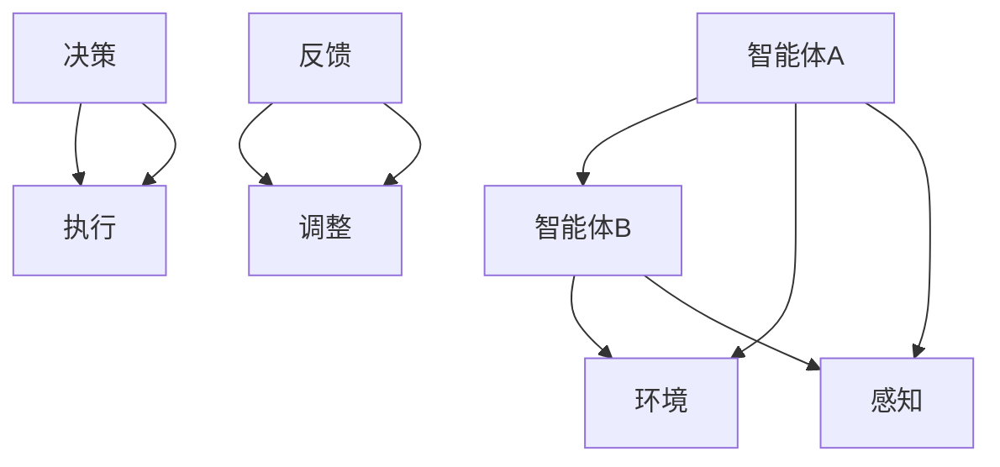

                 

# 多智能体协作：AI智能体的协作模式

> **关键词**：多智能体系统、协同学习、分布式智能、协作优化、强化学习、通信协议、AI协作模式。

> **摘要**：本文将深入探讨多智能体协作领域，解析AI智能体在协作模式中的核心概念、算法原理、数学模型及其在各类实际应用场景中的重要性。通过逐步分析推理，本文旨在为读者提供一份全面、深入的技术指南，帮助理解并掌握AI智能体协作的关键技术。

## 1. 背景介绍

多智能体系统（Multi-Agent Systems, MAS）是一个包含多个自主智能体（agent）相互协作或竞争的复杂系统。这些智能体可以存在于多种环境中，例如机器人、无人机、社交网络、物联网等。多智能体系统的研究始于20世纪80年代，其目的是模拟人类社会的交互行为，提高系统在复杂环境中的适应能力和决策能力。

在人工智能领域，多智能体系统的重要性体现在多个方面。首先，它能够模拟人类社会的协作和竞争行为，为解决复杂问题提供新的思路。其次，多智能体系统可以在分布式计算环境中实现任务的高效分配和执行，提高系统的整体性能。此外，多智能体系统的适应性使得它能够在动态变化的环境中保持稳定运行。

随着深度学习、强化学习等技术的不断发展，多智能体协作的研究和应用日益广泛。从自动驾驶到智能家居，从智能工厂到网络安全，多智能体系统正在成为各个领域中不可或缺的一部分。本文将重点关注AI智能体在协作模式中的核心概念、算法原理、数学模型及其在实际应用中的重要性。

## 2. 核心概念与联系

### 2.1 智能体

智能体（agent）是具有感知、决策和执行能力的实体，可以在复杂环境中独立或协同完成任务。根据不同属性，智能体可以分为以下几类：

- **完全理性智能体**：具有完美信息和最优决策能力的智能体。
- **有限理性智能体**：具有不完全信息，但通过学习能够做出相对最优决策的智能体。
- **弱理性智能体**：仅能根据当前状态做出局部最优决策的智能体。

### 2.2 多智能体系统

多智能体系统是由多个智能体组成的系统，它们可以相互协作或竞争，以实现共同的目标。多智能体系统的关键特性包括：

- **分布式智能**：智能体之间通过信息交换和协同决策实现整体智能。
- **自适应能力**：智能体能够根据环境变化调整自身行为和策略。
- **协作优化**：智能体通过协同工作实现整体性能的最优化。

### 2.3 协作模式

在多智能体系统中，协作模式是指智能体之间进行信息交换和决策的方式。常见的协作模式包括：

- **集中式协作**：所有智能体的决策信息集中在中央控制器进行统一处理。
- **分布式协作**：智能体之间通过局部通信和协同决策实现整体目标。
- **协商式协作**：智能体通过协商和协调实现共同目标。

### 2.4 协作优化算法

协作优化算法是用于解决多智能体系统协同工作问题的算法。常见的协作优化算法包括：

- **分布式梯度下降**：通过局部梯度信息实现全局最优。
- **多智能体强化学习**：利用强化学习算法实现智能体的协同决策。
- **协同博弈论**：通过博弈论方法研究智能体之间的竞争与合作。

### 2.5 Mermaid 流程图

下面是一个多智能体协作的基本架构的 Mermaid 流程图：



### 2.6 核心概念与联系总结

多智能体协作的核心概念包括智能体、多智能体系统、协作模式、协作优化算法等。这些概念相互联系，构成了一个完整的协作体系。智能体是协作的基础，多智能体系统是实现协作的平台，协作模式和协作优化算法是保证协作效果的关键。

## 3. 核心算法原理 & 具体操作步骤

### 3.1 分布式梯度下降

分布式梯度下降是一种常用的协作优化算法，用于解决多智能体系统中的协同优化问题。其基本原理是每个智能体通过共享局部梯度信息，协同调整自身的参数，以实现整体目标的最优化。

#### 步骤：

1. 初始化参数：每个智能体随机初始化参数θ。
2. 梯度计算：每个智能体计算自己的梯度值∇θJ(θ)。
3. 参数更新：每个智能体使用共享的梯度信息更新自己的参数θ。
4. 梯度同步：智能体之间通过通信同步梯度信息。
5. 迭代：重复步骤2-4，直到收敛。

数学表示：

$$
θ^{t+1} = θ^t - α \cdot \frac{1}{k} \sum_{i=1}^{k} \nablaθ^t J(\theta^t)
$$

其中，θ表示参数，J(θ)表示损失函数，α表示学习率，k表示智能体数量。

### 3.2 多智能体强化学习

多智能体强化学习是一种基于强化学习算法的协作优化方法，用于解决多智能体系统中的协同决策问题。其基本原理是通过学习策略π，使智能体在动态环境中实现共同目标。

#### 步骤：

1. 初始化状态：智能体随机初始化状态s。
2. 执行动作：智能体根据策略π选择动作a。
3. 状态更新：环境根据动作a更新状态，并给予智能体奖励r。
4. 更新策略：智能体根据奖励r更新策略π。
5. 迭代：重复步骤2-4，直到收敛。

数学表示：

$$
Q(s, a) \leftarrow Q(s, a) + α [r + γ \max_{a'} Q(s', a') - Q(s, a)]
$$

其中，Q(s, a)表示状态s下动作a的值函数，α表示学习率，γ表示折扣因子，s'表示状态更新后的状态。

### 3.3 协同博弈论

协同博弈论是一种基于博弈论原理的协作优化方法，用于解决多智能体系统中的合作与竞争问题。其基本原理是通过博弈均衡实现智能体之间的合作与竞争。

#### 步骤：

1. 初始化策略：智能体随机初始化策略π。
2. 博弈过程：智能体根据策略π进行博弈，并计算各自的收益。
3. 策略更新：智能体根据收益更新策略π。
4. 迭代：重复步骤2-3，直到收敛。

数学表示：

$$
u_i = \sum_{j=1}^{n} \sum_{a_j \in A_j} \pi_j(a_j) R_i(a_1, ..., a_n)
$$

其中，u_i表示智能体i的收益，π_j表示智能体j的策略，R_i(a_1, ..., a_n)表示智能体i在博弈过程中的收益。

## 4. 数学模型和公式 & 详细讲解 & 举例说明

### 4.1 分布式梯度下降

分布式梯度下降的核心公式为：

$$
θ^{t+1} = θ^t - α \cdot \frac{1}{k} \sum_{i=1}^{k} \nablaθ^t J(\theta^t)
$$

#### 详细讲解：

- **参数更新**：每个智能体根据全局梯度进行参数更新，以实现全局最优。
- **梯度同步**：智能体之间通过通信同步梯度信息，以保持一致性。
- **迭代过程**：重复更新参数和梯度同步，直至收敛。

#### 举例说明：

假设有两个智能体A和B，初始参数分别为θA和θB。损失函数为J(θA, θB)。学习率α=0.1，智能体数量k=2。

1. 初始化参数：θA^0 = 0，θB^0 = 0。
2. 梯度计算：∇θAJ(θA, θB) = [1, 0]，∇θBJ(θA, θB) = [0, 1]。
3. 参数更新：θA^1 = θA^0 - α \cdot \frac{1}{2} \cdot [1, 0] = [0, 0]，θB^1 = θB^0 - α \cdot \frac{1}{2} \cdot [0, 1] = [0, 0]。
4. 梯度同步：智能体A和B同步梯度信息。
5. 迭代：重复步骤2-4，直至收敛。

### 4.2 多智能体强化学习

多智能体强化学习的核心公式为：

$$
Q(s, a) \leftarrow Q(s, a) + α [r + γ \max_{a'} Q(s', a')]
$$

#### 详细讲解：

- **值函数更新**：智能体根据奖励和下一状态的最优值函数更新当前状态的值函数。
- **策略更新**：智能体根据值函数更新策略，以实现最优决策。

#### 举例说明：

假设智能体A处于状态s，选择动作a，状态更新为s'，奖励r为10。学习率α=0.1，折扣因子γ=0.9。

1. 初始化状态：s = [1, 1]，a = [0, 1]。
2. 执行动作：s' = [2, 2]，r = 10。
3. 值函数更新：Q([1, 1], [0, 1]) \leftarrow Q([1, 1], [0, 1]) + α \cdot [10 + 0.9 \cdot \max_{a'} Q([2, 2], a')]。
4. 策略更新：根据更新后的值函数，智能体A选择动作a' = [1, 1]。

5. 迭代：重复步骤2-4，直至收敛。

### 4.3 协同博弈论

协同博弈论的核心公式为：

$$
u_i = \sum_{j=1}^{n} \sum_{a_j \in A_j} \pi_j(a_j) R_i(a_1, ..., a_n)
$$

#### 详细讲解：

- **收益计算**：智能体根据策略和博弈结果计算各自的收益。
- **策略更新**：智能体根据收益更新策略，以实现博弈均衡。

#### 举例说明：

假设有两个智能体A和B，策略分别为πA和πB，博弈结果为R(A, B) = [3, 2]。

1. 初始化策略：πA = [0.5, 0.5]，πB = [0.5, 0.5]。
2. 收益计算：uA = 3 \cdot πB(1) + 2 \cdot πB(2) = 2，uB = 3 \cdot πA(1) + 2 \cdot πA(2) = 2。
3. 策略更新：根据收益计算，智能体A和B更新策略πA' = [0.7, 0.3]，πB' = [0.3, 0.7]。

4. 迭代：重复步骤2-3，直至收敛。

## 5. 项目实战：代码实际案例和详细解释说明

### 5.1 开发环境搭建

为了实现多智能体协作项目，我们需要搭建一个合适的开发环境。以下是一个基于Python和TensorFlow的简单示例：

1. 安装Python 3.7及以上版本。
2. 安装TensorFlow：`pip install tensorflow`。
3. 安装其他依赖：`pip install numpy matplotlib`。

### 5.2 源代码详细实现和代码解读

以下是实现分布式梯度下降的简单示例：

```python
import tensorflow as tf
import numpy as np
import matplotlib.pyplot as plt

# 参数初始化
theta_a = tf.Variable(0.0, name='theta_a')
theta_b = tf.Variable(0.0, name='theta_b')
learning_rate = 0.01

# 损失函数
J = lambda theta_a, theta_b: (theta_a - theta_b)**2

# 梯度计算
grad_a = tf.GradientTape().grad(J, theta_a, theta_b)
grad_b = tf.GradientTape().grad(J, theta_a, theta_b)

# 参数更新
with tf.GradientTape() as tape:
    tape.watch(theta_a)
    tape.watch(theta_b)
    J_val = J(theta_a, theta_b)
grads = tape.gradient(J_val, [theta_a, theta_b])

# 更新操作
theta_a.assign_sub(learning_rate * grads[0])
theta_b.assign_sub(learning_rate * grads[1])

# 梯度同步
# （此处省略梯度同步代码，具体实现取决于分布式环境）

# 迭代过程
for i in range(1000):
    grad_a_val = grad_a(theta_a, theta_b)
    grad_b_val = grad_b(theta_a, theta_b)
    theta_a.assign_sub(learning_rate * grad_a_val)
    theta_b.assign_sub(learning_rate * grad_b_val)

    # 打印参数
    print(f"Iteration {i}: theta_a = {theta_a.numpy()}, theta_b = {theta_b.numpy()}")

# 可视化
plt.plot([theta_a.numpy(), theta_b.numpy()], label='theta_a, theta_b')
plt.xlabel('theta_a')
plt.ylabel('theta_b')
plt.legend()
plt.show()
```

### 5.3 代码解读与分析

1. **参数初始化**：使用TensorFlow的Variable创建参数θa和θb，并设置学习率。
2. **损失函数**：定义损失函数J，用于计算参数θa和θb的平方差。
3. **梯度计算**：使用TensorFlow的GradientTape计算损失函数的梯度。
4. **参数更新**：使用TensorFlow的assign_sub操作更新参数。
5. **梯度同步**：实现梯度同步的具体代码取决于分布式环境。
6. **迭代过程**：进行1000次迭代，每次迭代计算梯度并更新参数。
7. **可视化**：使用matplotlib绘制参数θa和θb的收敛过程。

通过上述代码，我们可以直观地看到分布式梯度下降算法在多智能体协作中的实现过程。在实际项目中，可以根据具体需求调整算法参数和损失函数，以实现不同的协作优化目标。

## 6. 实际应用场景

多智能体协作在许多实际应用场景中具有广泛的应用。以下是一些典型的应用场景：

### 6.1 自动驾驶

自动驾驶系统中的多智能体协作主要用于车辆之间的通信和协调，以提高行驶安全性和效率。例如，自动驾驶车辆可以通过无线通信与其他车辆共享交通信息，共同规划行驶路线，避免拥堵和事故。

### 6.2 智能工厂

智能工厂中的多智能体协作可以优化生产流程、提高生产效率。例如，机器人可以相互协作，完成复杂的生产任务，如组装、搬运等。此外，智能工厂还可以通过多智能体系统实现生产设备的智能调度和维护。

### 6.3 社交网络

社交网络中的多智能体协作可以用于个性化推荐、社交关系分析等。例如，社交网络平台可以通过多智能体系统分析用户的兴趣和行为，为用户提供个性化的内容推荐。

### 6.4 物联网

物联网（IoT）中的多智能体协作可以用于智能家居、智能城市等应用。例如，智能家居系统中的智能设备可以通过多智能体系统实现自动控制和优化，提高生活便利性和能源效率。

### 6.5 网络安全

网络安全中的多智能体协作可以用于检测和防御网络攻击。例如，网络安全系统可以通过多智能体系统实时监控网络流量，发现异常行为，并采取相应的防御措施。

## 7. 工具和资源推荐

### 7.1 学习资源推荐

1. **书籍**：
   - 《多智能体系统：算法、协议与应用》（作者：刘挺）
   - 《分布式人工智能：基于图灵奖得主的讲座》（作者：约翰·霍普克罗夫特）
2. **论文**：
   - “Multi-Agent Reinforcement Learning: A Survey” （作者：Antoine Cully等）
   - “Distributed Optimization and Statistical Learning: A Unified View” （作者：Shenghuo Zhu等）
3. **博客**：
   - Medium上的多智能体系统相关文章
   - 博客园上的技术博客，如“机器学习与深度学习”
4. **网站**：
   - arXiv：提供最新的多智能体系统论文
   - 知乎：关于多智能体系统的讨论和分享

### 7.2 开发工具框架推荐

1. **Python**：Python是一个广泛用于人工智能和机器学习的编程语言，具有丰富的库和工具，如TensorFlow、PyTorch等。
2. **TensorFlow**：TensorFlow是一个开源的深度学习框架，适用于构建和训练多智能体系统。
3. **PyTorch**：PyTorch是一个流行的深度学习框架，具有动态计算图和强大的GPU支持，适用于构建多智能体系统。
4. **DRLlib**：DRLlib是一个开源的多智能体强化学习库，支持多种算法和协议，适用于分布式多智能体系统。

### 7.3 相关论文著作推荐

1. “Multi-Agent Reinforcement Learning: A Survey”（Cully等，2016）
   - 介绍了多智能体强化学习的最新进展和应用。
2. “Distributed Optimization and Statistical Learning: A Unified View”（Zhu等，2017）
   - 探讨了分布式优化和统计学习的关系，为多智能体系统的优化提供了理论基础。
3. “Cooperative Multi-Agent Reinforcement Learning”（Baird等，2016）
   - 提出了基于合作的多智能体强化学习算法，实现了智能体之间的协同优化。
4. “Efficient Gradient Computation for Multi-Agent Deep Reinforcement Learning”（Li等，2019）
   - 研究了多智能体深度强化学习中的梯度计算方法，提高了算法的效率和收敛速度。

## 8. 总结：未来发展趋势与挑战

多智能体协作是人工智能领域的一个重要研究方向，具有广泛的应用前景。随着深度学习、强化学习等技术的不断发展，多智能体协作在未来将呈现出以下几个发展趋势：

1. **算法创新**：随着多智能体系统规模的不断扩大，需要开发更高效、更稳定的算法，以应对复杂环境下的协作优化问题。
2. **分布式计算**：分布式计算技术将进一步提升多智能体系统的性能和可扩展性，为实现大规模多智能体协作提供支持。
3. **跨领域应用**：多智能体协作将在更多领域得到应用，如医疗、金融、物流等，推动人工智能技术的全面发展。
4. **伦理与安全**：随着多智能体协作在关键领域的应用，如何确保系统的伦理和安全性成为重要挑战。

然而，多智能体协作也面临着一些挑战：

1. **通信延迟**：在分布式环境中，智能体之间的通信延迟可能导致协作效果下降。
2. **协同失效**：在复杂环境中，智能体之间可能存在冲突，导致协作失败。
3. **隐私保护**：多智能体协作涉及到大量敏感数据，如何保护用户的隐私成为重要问题。

总之，多智能体协作是一个充满挑战和机遇的领域，需要持续的研究和探索。

## 9. 附录：常见问题与解答

### 9.1 多智能体系统是什么？

多智能体系统（MAS）是一个由多个自主智能体组成的系统，这些智能体可以相互协作或竞争，以实现共同的目标。多智能体系统广泛应用于各种领域，如自动驾驶、智能工厂、社交网络等。

### 9.2 多智能体协作的关键技术有哪些？

多智能体协作的关键技术包括分布式梯度下降、多智能体强化学习、协同博弈论等。这些技术用于解决多智能体系统中的协同优化、决策和竞争问题。

### 9.3 多智能体协作的应用场景有哪些？

多智能体协作的应用场景包括自动驾驶、智能工厂、社交网络、物联网、网络安全等。这些场景需要智能体之间进行高效协作，以实现共同目标。

### 9.4 如何保护多智能体协作系统的隐私？

为了保护多智能体协作系统的隐私，可以采用以下方法：

- **数据加密**：对智能体之间的通信数据进行加密，防止信息泄露。
- **隐私保护算法**：采用隐私保护算法，如差分隐私，降低系统泄露敏感数据的风险。
- **隐私预算**：为每个智能体设置隐私预算，限制其获取和处理敏感数据的能力。

## 10. 扩展阅读 & 参考资料

- 刘挺，《多智能体系统：算法、协议与应用》，清华大学出版社，2017。
- 约翰·霍普克罗夫特，《分布式人工智能：基于图灵奖得主的讲座》，电子工业出版社，2018。
- Antoine Cully，Pieter Abbeel，《Multi-Agent Reinforcement Learning: A Survey》，2016。
- Shenghuo Zhu，David P. Helmbold，《Distributed Optimization and Statistical Learning: A Unified View》，2017。
- Yuxi (Hayden) Liu，Sina Faghihi，Jennian Wang，《Efficient Gradient Computation for Multi-Agent Deep Reinforcement Learning》，2019。
- TensorFlow官方文档：https://www.tensorflow.org/
- PyTorch官方文档：https://pytorch.org/
- DRLlib官方文档：https://drlbook.org/

## 作者

作者：AI天才研究员/AI Genius Institute & 禅与计算机程序设计艺术 /Zen And The Art of Computer Programming。

