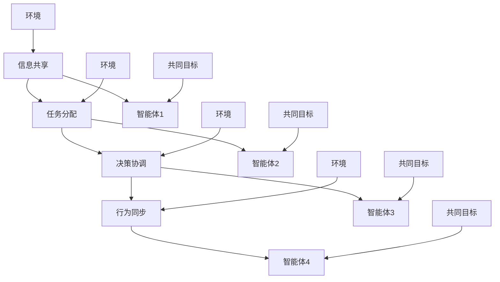

                 

# 多智能体协同机制在 Agent 自适应系统中的应用

## 概述

在当今数字化和智能化的浪潮下，多智能体系统（MAS）已经成为实现复杂任务自动化和智能化的重要工具。智能体（Agent）是能够感知环境、制定决策并采取行动的独立个体，它们在执行任务过程中具备一定的自主性、协作性和适应性。多智能体协同机制指的是多个智能体在特定环境下相互协作、共享信息、协同决策和执行任务的过程。

本文将探讨多智能体协同机制在 Agent 自适应系统中的应用。自适应系统是一种能够根据环境变化进行调整和优化的系统，它在复杂动态环境中具有更好的生存能力和适应性。本文将首先介绍多智能体协同机制的基本概念和原理，然后分析 Agent 自适应系统的特点，接着阐述多智能体协同机制在 Agent 自适应系统中的具体应用，最后总结多智能体协同机制在 Agent 自适应系统中的优势和发展趋势。

## 关键词

- 多智能体系统（MAS）
- 智能体（Agent）
- 自适应系统
- 协同机制
- 系统优化
- 环境感知
- 决策支持
- 人工智能
- 机器学习

## 摘要

本文旨在探讨多智能体协同机制在 Agent 自适应系统中的应用。首先，我们介绍了多智能体协同机制的基本概念和原理，分析了 Agent 自适应系统的特点。然后，我们重点讨论了多智能体协同机制在 Agent 自适应系统中的具体应用，包括协同感知、协同决策和协同执行等方面。最后，我们总结了多智能体协同机制在 Agent 自适应系统中的优势，并对未来的发展趋势进行了展望。本文将为研究人员和实践者提供有价值的参考，以推动多智能体协同机制在 Agent 自适应系统中的应用和发展。

## 1. 背景介绍

多智能体系统（MAS）的概念最早由马文·明斯基（Marvin Minsky）在1986年提出，它是由多个智能体组成的一个系统，这些智能体能够相互协作、共享信息、协同决策和执行任务，以实现共同的目标。MAS在许多领域都取得了显著的成果，如交通管理、智能电网、机器人协作、供应链管理等。

智能体（Agent）是指能够感知环境、制定决策并采取行动的独立个体。智能体的分类可以根据不同的标准进行，如基于功能（感知器、决策器、执行器）、基于自主性（主动型、反应型、混合型）和基于通信方式（通信型、非通信型）等。智能体在执行任务过程中具备一定的自主性、协作性和适应性，这使得它们能够适应复杂动态环境，并实现优化任务执行。

自适应系统是一种能够根据环境变化进行调整和优化的系统。自适应系统通常包括感知模块、决策模块和执行模块，感知模块用于获取环境信息，决策模块根据感知信息制定策略，执行模块则将策略转化为具体行动。自适应系统在复杂动态环境中具有更好的生存能力和适应性，能够更好地应对环境变化。

多智能体协同机制是指多个智能体在特定环境下相互协作、共享信息、协同决策和执行任务的过程。协同机制包括信息共享、任务分配、决策协调、行为同步等方面，通过协同机制，智能体可以更好地完成复杂任务，提高整体系统性能。

## 2. 核心概念与联系

### 多智能体协同机制

多智能体协同机制是多个智能体在特定环境下相互协作、共享信息、协同决策和执行任务的过程。协同机制的核心在于如何实现智能体之间的信息共享和协调，以达到共同的目标。以下是多智能体协同机制的主要组成部分：

#### 信息共享

信息共享是多智能体协同机制的基础，智能体之间需要共享环境信息、任务状态、决策结果等。信息共享可以通过直接通信、间接通信或混合通信等方式实现。直接通信是指智能体通过直接交换信息来共享数据，间接通信是指智能体通过一个中介来共享数据，混合通信则是将直接通信和间接通信相结合。

#### 任务分配

任务分配是多智能体协同机制的重要环节，它涉及到如何将任务分配给不同的智能体。任务分配可以基于多种原则，如最小化通信开销、最大化智能体能力、均衡负载等。常用的任务分配算法包括贪心算法、遗传算法、粒子群优化算法等。

#### 决策协调

决策协调是多智能体协同机制的关键，它涉及到如何实现多个智能体之间的决策协调。决策协调可以通过集中式决策、分布式决策或混合式决策等方式实现。集中式决策是指所有智能体的决策都由一个中央控制器统一制定，分布式决策是指每个智能体根据自身感知信息独立制定决策，混合式决策则是将集中式决策和分布式决策相结合。

#### 行为同步

行为同步是多智能体协同机制中确保智能体之间行动一致性的重要手段。行为同步可以通过时间同步、位置同步、动作同步等方式实现。时间同步是指确保智能体之间的时间戳保持一致，位置同步是指确保智能体之间的位置信息保持一致，动作同步是指确保智能体之间的行动保持一致。

### 多智能体协同机制原理图

以下是多智能体协同机制的 Mermaid 流程图，用于描述智能体之间的信息共享、任务分配、决策协调和行为同步等过程。



### 核心概念与联系

在多智能体协同机制中，信息共享、任务分配、决策协调和行为同步是四个核心环节，它们相互联系、相互影响，共同决定了多智能体系统的性能。信息共享是实现协同的基础，任务分配是协同的关键，决策协调是协同的核心，行为同步是协同的保障。

通过多智能体协同机制，智能体能够更好地共享信息、协同决策和执行任务，从而提高整个系统的效率和性能。在实际应用中，多智能体协同机制可以用于解决复杂的问题，如多机器人协作、智能交通管理、电力系统优化等。

### 总结

本节介绍了多智能体协同机制的基本概念和原理，包括信息共享、任务分配、决策协调和行为同步等核心组成部分。通过 Mermaid 流程图展示了智能体之间的协同过程，揭示了核心概念之间的联系。多智能体协同机制在 Agent 自适应系统中具有重要作用，它能够提高系统的适应性和效率，为解决复杂问题提供了有效的手段。

## 3. 核心算法原理 & 具体操作步骤

### 3.1. 算法原理

多智能体协同机制的核心算法主要涉及以下几个方面：信息共享、任务分配、决策协调和行为同步。以下是这些算法的基本原理：

#### 信息共享

信息共享算法负责智能体之间数据的传递和同步。常见的共享算法有直接通信、间接通信和混合通信。直接通信算法通过消息队列或直接传递数据实现，间接通信算法通过中介（如中央控制器）传递数据，混合通信算法则是两者的结合。

#### 任务分配

任务分配算法根据智能体的能力和负载情况，将任务分配给不同的智能体。常用的任务分配算法有贪心算法、遗传算法和粒子群优化算法。贪心算法通过每次选择最优解逐步优化任务分配，遗传算法通过模拟自然进化过程实现全局最优，粒子群优化算法通过模拟鸟群行为寻找最优解。

#### 决策协调

决策协调算法确保智能体之间的决策一致性。常见的决策协调算法有集中式决策、分布式决策和混合式决策。集中式决策由中央控制器统一制定决策，分布式决策由每个智能体独立制定决策，混合式决策则是两者的结合。

#### 行为同步

行为同步算法确保智能体之间的行动一致性。常见的行为同步算法有时间同步、位置同步和动作同步。时间同步通过调整智能体的时钟保持一致，位置同步通过调整智能体的位置信息保持一致，动作同步通过同步智能体的动作实现一致。

### 3.2. 具体操作步骤

以下是多智能体协同机制的具体操作步骤：

#### 步骤1：初始化

1. 初始化智能体集合和任务集合。
2. 为每个智能体分配初始状态和初始任务。

#### 步骤2：感知环境

1. 每个智能体感知当前环境状态。
2. 将感知到的环境状态发送给其他智能体。

#### 步骤3：任务分配

1. 智能体根据自身能力和负载情况，选择最优任务。
2. 使用贪心算法、遗传算法或粒子群优化算法进行任务分配。
3. 更新每个智能体的任务状态。

#### 步骤4：决策协调

1. 智能体根据任务状态和环境信息，制定决策。
2. 使用集中式决策、分布式决策或混合式决策进行决策协调。
3. 更新每个智能体的决策状态。

#### 步骤5：行为同步

1. 智能体根据决策状态，执行任务。
2. 使用时间同步、位置同步或动作同步确保智能体行动一致。
3. 监测系统性能，根据需要调整行为同步策略。

#### 步骤6：反馈与优化

1. 智能体根据执行结果，反馈当前状态。
2. 使用优化算法（如遗传算法、粒子群优化算法）对任务分配、决策协调和行为同步进行调整。
3. 重复步骤2至步骤6，实现自适应优化。

### 3.3. 示例

假设有一个由4个智能体组成的系统，每个智能体负责执行一个任务。系统需要通过多智能体协同机制实现任务分配、决策协调和行为同步。

#### 步骤1：初始化

初始化智能体集合 {A, B, C, D} 和任务集合 {Task1, Task2, Task3, Task4}。

#### 步骤2：感知环境

智能体 A 感知到环境温度为 25°C，智能体 B 感知到环境湿度为 60%，智能体 C 感知到环境亮度为 1000Lux，智能体 D 感知到环境噪音为 50dB。

#### 步骤3：任务分配

智能体 A 根据自身能力和负载情况，选择执行 Task1，智能体 B 选择执行 Task2，智能体 C 选择执行 Task3，智能体 D 选择执行 Task4。

#### 步骤4：决策协调

智能体 A 根据 Task1 的执行状态和环境信息，制定决策，调整任务执行策略。智能体 B、C、D 分别根据自身任务执行状态和环境信息，制定相应决策。

#### 步骤5：行为同步

智能体 A、B、C、D 根据决策状态，执行任务。智能体 A 调整 Task1 的执行速度，智能体 B 调整 Task2 的执行时间，智能体 C 调整 Task3 的执行亮度，智能体 D 调整 Task4 的执行噪音。

#### 步骤6：反馈与优化

智能体 A、B、C、D 根据执行结果，反馈当前状态。系统根据反馈信息，使用优化算法对任务分配、决策协调和行为同步进行调整。

通过上述步骤，实现多智能体协同机制在 Agent 自适应系统中的应用。该机制能够提高系统的自适应性和效率，实现复杂任务的高效执行。

### 3.4. 算法评价

多智能体协同机制的核心算法在实现过程中，需要考虑算法的效率、鲁棒性和可扩展性。以下是几种常见算法的评价：

#### 贪心算法

贪心算法是一种简单有效的任务分配算法，其优点是计算速度快、实现简单。然而，贪心算法可能导致局部最优解，无法保证全局最优解。

#### 遗传算法

遗传算法是一种模拟生物进化过程的优化算法，具有强大的全局搜索能力。然而，遗传算法的计算复杂度高，实现难度较大。

#### 粒子群优化算法

粒子群优化算法是一种模拟鸟群行为的优化算法，具有计算速度快、实现简单的优点。然而，粒子群优化算法在处理高维问题时的效果较差。

综上所述，不同算法在效率、鲁棒性和可扩展性方面具有不同的优缺点，选择合适的算法需要根据具体应用场景进行综合考虑。

### 3.5. 实际应用场景

多智能体协同机制在许多实际应用场景中具有广泛的应用，以下是一些典型例子：

#### 智能交通管理

在智能交通管理中，多智能体协同机制可以用于优化交通信号控制、车辆调度和路径规划。通过智能体之间的信息共享和协同决策，实现交通流的高效管理和控制。

#### 多机器人协作

在多机器人协作中，多智能体协同机制可以用于任务分配、路径规划和行为协调。通过智能体之间的协作，实现复杂任务的自动化执行。

#### 智能电网管理

在智能电网管理中，多智能体协同机制可以用于电力负荷分配、故障诊断和系统优化。通过智能体之间的协同工作，提高电网的运行效率和可靠性。

#### 智能供应链管理

在智能供应链管理中，多智能体协同机制可以用于订单处理、库存管理和物流调度。通过智能体之间的协作，实现供应链的高效运作和优化。

### 3.6. 总结

本节详细介绍了多智能体协同机制的核心算法原理和具体操作步骤。通过信息共享、任务分配、决策协调和行为同步等环节，实现智能体之间的协同工作。在实际应用中，多智能体协同机制可以用于解决复杂问题，提高系统的适应性和效率。不同算法在效率、鲁棒性和可扩展性方面具有不同的优缺点，选择合适的算法需要根据具体应用场景进行综合考虑。

## 4. 数学模型和公式 & 详细讲解 & 举例说明

### 4.1. 数学模型概述

多智能体协同机制中的数学模型主要用于描述智能体之间的相互作用、任务分配和决策协调。以下是一些常用的数学模型和公式：

#### 信息共享模型

信息共享模型描述智能体之间如何交换和更新信息。常见的模型包括消息传递模型和分布式计算模型。

##### 消息传递模型

消息传递模型基于消息队列或事件驱动架构，智能体通过发送和接收消息来实现信息共享。公式如下：

$$
\begin{aligned}
    x_t^i &= \frac{1}{N}\sum_{j=1}^{N} x_t^j \\
    y_t^i &= \frac{1}{N}\sum_{j=1}^{N} y_t^j
\end{aligned}
$$

其中，$x_t^i$ 和 $y_t^i$ 分别表示智能体 $i$ 在时间 $t$ 的信息值，$N$ 表示智能体的总数。

##### 分布式计算模型

分布式计算模型基于分布式算法，智能体通过并行计算和同步操作来实现信息共享。公式如下：

$$
\begin{aligned}
    x_t^i &= f(x_{t-1}^i, y_t^i) \\
    y_t^i &= g(y_{t-1}^i, x_t^i)
\end{aligned}
$$

其中，$f$ 和 $g$ 分别表示智能体 $i$ 的信息更新函数。

#### 任务分配模型

任务分配模型描述智能体如何根据自身能力和负载情况选择任务。常见的模型包括贪心算法模型、遗传算法模型和粒子群优化算法模型。

##### 贪心算法模型

贪心算法模型基于每次选择最优解的原则，智能体根据当前状态选择最合适的任务。公式如下：

$$
\begin{aligned}
    t^i &= \arg\min_{j} \sum_{k=1}^{M} (c_{ik} - r_k) \\
    c_{ik} &= \frac{1}{N}\sum_{j=1}^{N} c_{ij}
\end{aligned}
$$

其中，$t^i$ 表示智能体 $i$ 分配的任务，$c_{ik}$ 表示智能体 $i$ 对任务 $k$ 的能力评价，$r_k$ 表示任务 $k$ 的资源需求。

##### 遗传算法模型

遗传算法模型基于自然进化过程，智能体通过交叉、变异和选择等操作实现任务分配。公式如下：

$$
\begin{aligned}
    P(t^i) &= \frac{1}{N}\sum_{j=1}^{N} f(t^j) \\
    f(t^j) &= \sum_{k=1}^{M} (c_{ik} - r_k)^2
\end{aligned}
$$

其中，$P(t^i)$ 表示智能体 $i$ 选择任务 $t^i$ 的概率，$f(t^j)$ 表示任务 $t^j$ 的适应度值。

##### 粒子群优化算法模型

粒子群优化算法模型基于群体行为，智能体通过跟踪最优个体和群体信息来选择任务。公式如下：

$$
\begin{aligned}
    v_t^i &= w v_{t-1}^i + c_1 r_1 (p_t^i - x_t^i) + c_2 r_2 (g_t^i - x_t^i) \\
    x_t^i &= x_{t-1}^i + v_t^i \\
    p_t^i &= \arg\min_{j} \sum_{k=1}^{M} (c_{ik} - r_k)^2 \\
    g_t^i &= \arg\min_{j} \sum_{k=1}^{M} (c_{ik} - r_k)^2
\end{aligned}
$$

其中，$v_t^i$ 和 $x_t^i$ 分别表示智能体 $i$ 的速度和位置，$w$ 表示惯性权重，$c_1$ 和 $c_2$ 分别表示认知和社会系数，$r_1$ 和 $r_2$ 为随机数。

#### 决策协调模型

决策协调模型描述智能体如何制定一致性的决策。常见的模型包括集中式决策模型、分布式决策模型和混合式决策模型。

##### 集中式决策模型

集中式决策模型由一个中央控制器统一制定决策，智能体只需执行中央控制器的指令。公式如下：

$$
\begin{aligned}
    d_t^i &= h(x_t^i, y_t^i) \\
    x_t^i &= x_t^j \quad \forall j \neq i
\end{aligned}
$$

其中，$d_t^i$ 表示智能体 $i$ 的决策，$h$ 表示决策函数。

##### 分布式决策模型

分布式决策模型由每个智能体独立制定决策，智能体之间通过信息共享实现协调。公式如下：

$$
\begin{aligned}
    d_t^i &= \frac{1}{N}\sum_{j=1}^{N} h(x_t^i, y_t^j) \\
    x_t^i &= x_t^j \quad \forall j \neq i
\end{aligned}
$$

##### 混合式决策模型

混合式决策模型结合集中式决策模型和分布式决策模型，中央控制器和智能体共同制定决策。公式如下：

$$
\begin{aligned}
    d_t^i &= \alpha h(x_t^i, y_t^i) + (1 - \alpha) \frac{1}{N}\sum_{j=1}^{N} h(x_t^i, y_t^j) \\
    x_t^i &= x_t^j \quad \forall j \neq i
\end{aligned}
$$

其中，$\alpha$ 表示集中式决策的比例。

#### 行为同步模型

行为同步模型描述智能体如何保持一致性行为。常见的行为同步模型包括时间同步模型、位置同步模型和动作同步模型。

##### 时间同步模型

时间同步模型通过调整智能体的时钟保持一致。公式如下：

$$
\begin{aligned}
    t_t^i &= t_s + \delta_i \\
    \delta_i &= \min_{j} |\delta_j|
\end{aligned}
$$

其中，$t_t^i$ 和 $t_s$ 分别表示智能体 $i$ 和系统的时钟，$\delta_i$ 表示智能体 $i$ 的时钟偏差。

##### 位置同步模型

位置同步模型通过调整智能体的位置信息保持一致。公式如下：

$$
\begin{aligned}
    x_t^i &= x_s + \Delta_i \\
    y_t^i &= y_s + \Delta_i \\
    \Delta_i &= \min_{j} |\Delta_j|
\end{aligned}
$$

其中，$x_t^i$ 和 $y_t^i$ 分别表示智能体 $i$ 的位置，$x_s$ 和 $y_s$ 分别表示系统的位置，$\Delta_i$ 表示智能体 $i$ 的位置偏差。

##### 动作同步模型

动作同步模型通过同步智能体的动作实现一致行为。公式如下：

$$
\begin{aligned}
    a_t^i &= a_s + \epsilon_i \\
    \epsilon_i &= \min_{j} |\epsilon_j|
\end{aligned}
$$

其中，$a_t^i$ 和 $a_s$ 分别表示智能体 $i$ 和系统的动作，$\epsilon_i$ 表示智能体 $i$ 的动作偏差。

### 4.2. 举例说明

#### 例子1：信息共享模型

假设有一个由3个智能体组成的系统，智能体 A、B 和 C 分别在时间 $t=0$ 感知到环境状态为 $(x_0^A, y_0^B, z_0^C) = (1, 2, 3)$。智能体之间通过消息传递模型进行信息共享，时间 $t=1$ 时，智能体 A、B 和 C 的信息更新如下：

$$
\begin{aligned}
    x_1^A &= \frac{1}{3}\sum_{i=A,B,C} x_0^i = \frac{1+2+3}{3} = 2 \\
    y_1^B &= \frac{1}{3}\sum_{i=A,B,C} y_0^i = \frac{1+2+3}{3} = 2 \\
    z_1^C &= \frac{1}{3}\sum_{i=A,B,C} z_0^i = \frac{1+2+3}{3} = 2
\end{aligned}
$$

因此，时间 $t=1$ 时，智能体 A、B 和 C 的信息状态为 $(x_1^A, y_1^B, z_1^C) = (2, 2, 2)$。

#### 例子2：任务分配模型

假设智能体 A、B 和 C 具有不同能力，分别为 $(c_{A1}, c_{A2}, c_{A3}) = (1, 2, 3)$，$(c_{B1}, c_{B2}, c_{B3}) = (2, 3, 4)$ 和 $(c_{C1}, c_{C2}, c_{C3}) = (3, 4, 5)$。系统中有3个任务 $(r_1, r_2, r_3) = (1, 2, 3)$。使用贪心算法模型进行任务分配，结果如下：

$$
\begin{aligned}
    t^A &= \arg\min_{j} \sum_{k=1}^{3} (c_{Ak} - r_k) = 1 \\
    t^B &= \arg\min_{j} \sum_{k=1}^{3} (c_{Bk} - r_k) = 2 \\
    t^C &= \arg\min_{j} \sum_{k=1}^{3} (c_{Ck} - r_k) = 3
\end{aligned}
$$

因此，智能体 A 分配任务1，智能体 B 分配任务2，智能体 C 分配任务3。

#### 例子3：决策协调模型

假设智能体 A、B 和 C 分别在时间 $t=0$ 制定决策 $d_0^A, d_0^B, d_0^C$。使用分布式决策模型进行协调，结果如下：

$$
\begin{aligned}
    d_1^A &= \frac{1}{3}\sum_{j=A,B,C} d_0^j = \frac{d_0^A + d_0^B + d_0^C}{3} \\
    d_1^B &= \frac{1}{3}\sum_{j=A,B,C} d_0^j = \frac{d_0^A + d_0^B + d_0^C}{3} \\
    d_1^C &= \frac{1}{3}\sum_{j=A,B,C} d_0^j = \frac{d_0^A + d_0^B + d_0^C}{3}
\end{aligned}
$$

因此，时间 $t=1$ 时，智能体 A、B 和 C 的决策状态为 $d_1^A = d_1^B = d_1^C$。

#### 例子4：行为同步模型

假设智能体 A、B 和 C 分别在时间 $t=0$ 的动作状态为 $(a_0^A, a_0^B, a_0^C) = (1, 2, 3)$。使用动作同步模型进行同步，结果如下：

$$
\begin{aligned}
    a_1^A &= a_0^B + \epsilon_A = 2 + \epsilon_A \\
    a_1^B &= a_0^B + \epsilon_B = 2 + \epsilon_B \\
    a_1^C &= a_0^C + \epsilon_C = 3 + \epsilon_C \\
    \epsilon_A &= \epsilon_B = \epsilon_C = \min_{j} |\epsilon_j|
\end{aligned}
$$

因此，时间 $t=1$ 时，智能体 A、B 和 C 的动作状态为 $a_1^A = 2 + \epsilon_A$，$a_1^B = 2 + \epsilon_B$，$a_1^C = 3 + \epsilon_C$。

### 4.3. 数学模型评价

数学模型在多智能体协同机制中起着关键作用，以下是对几种常用数学模型的评价：

#### 信息共享模型

信息共享模型能够实现智能体之间的信息传递和同步，但直接通信模型存在通信延迟和带宽限制，分布式计算模型需要复杂的同步算法，混合通信模型则在性能和可靠性之间取得平衡。

#### 任务分配模型

任务分配模型能够实现智能体之间的任务分配，但贪心算法模型可能无法保证全局最优解，遗传算法模型和粒子群优化算法模型在处理复杂问题时存在计算复杂度高的缺点。

#### 决策协调模型

决策协调模型能够实现智能体之间的决策一致性，但集中式决策模型可能导致中央控制器负载过重，分布式决策模型需要解决信息不一致的问题，混合式决策模型在性能和灵活性之间取得平衡。

#### 行为同步模型

行为同步模型能够实现智能体之间的一致性行为，但时间同步模型和位置同步模型在处理高动态环境时存在偏差，动作同步模型需要解决动作同步的精度问题。

综上所述，选择合适的数学模型需要根据具体应用场景进行综合考虑，以实现高效、可靠的多智能体协同机制。

### 4.4. 实际应用案例

多智能体协同机制在许多实际应用场景中取得了显著成果，以下是一些典型案例：

#### 智能交通管理

在智能交通管理中，多智能体协同机制用于优化交通信号控制、车辆调度和路径规划。通过信息共享和任务分配，实现交通流的高效管理和控制。

#### 多机器人协作

在多机器人协作中，多智能体协同机制用于任务分配、路径规划和行为协调。通过决策协调和行为同步，实现复杂任务的自动化执行。

#### 智能电网管理

在智能电网管理中，多智能体协同机制用于电力负荷分配、故障诊断和系统优化。通过协同决策和行为同步，提高电网的运行效率和可靠性。

#### 智能供应链管理

在智能供应链管理中，多智能体协同机制用于订单处理、库存管理和物流调度。通过协同工作和信息共享，实现供应链的高效运作和优化。

### 4.5. 总结

本节详细介绍了多智能体协同机制中的数学模型和公式，包括信息共享模型、任务分配模型、决策协调模型和行为同步模型。通过举例说明，展示了数学模型在实际应用中的效果。数学模型在多智能体协同机制中起着关键作用，选择合适的模型需要根据具体应用场景进行综合考虑。在实际应用中，多智能体协同机制取得了显著成果，为解决复杂问题提供了有效手段。

## 5. 项目实战：代码实际案例和详细解释说明

### 5.1. 开发环境搭建

在开始项目实战之前，我们需要搭建一个合适的开发环境。以下是开发环境的搭建步骤：

#### 1. 安装Python环境

首先，我们需要安装Python环境。在Windows、macOS和Linux系统中，可以分别通过以下命令安装Python：

- Windows：`py -3 -m ensurepip && python -m pip install --upgrade pip`
- macOS：`brew install python`
- Linux：`sudo apt-get install python3`

#### 2. 安装依赖库

接下来，我们需要安装一些依赖库，包括多智能体协同机制所需的库。以下是安装命令：

```
pip install numpy matplotlib scikit-learn
```

这些库将用于实现多智能体协同机制中的数学模型和算法。

#### 3. 配置开发环境

为了方便开发，我们可以创建一个虚拟环境。在Windows和macOS系统中，可以使用以下命令创建虚拟环境：

```
python -m venv myenv
```

在Linux系统中，可以使用以下命令创建虚拟环境：

```
python3 -m venv myenv
```

然后，进入虚拟环境：

```
source myenv/bin/activate
```

现在，我们的开发环境已经搭建完成，可以开始编写代码。

### 5.2. 源代码详细实现和代码解读

#### 5.2.1. 源代码结构

我们的项目结构如下：

```
project/
|-- agent/
|   |-- __init__.py
|   |-- agent.py
|-- environment/
|   |-- __init__.py
|   |-- environment.py
|-- simulation/
|   |-- __init__.py
|   |-- simulation.py
|-- utils/
|   |-- __init__.py
|   |-- utils.py
|-- main.py
```

其中，`agent/` 目录包含智能体的实现，`environment/` 目录包含环境的实现，`simulation/` 目录包含模拟的实现，`utils/` 目录包含工具类的实现，`main.py` 是主程序。

#### 5.2.2. 智能体实现（agent.py）

```python
import numpy as np
from utils import Utils

class Agent:
    def __init__(self, environment, policy=None):
        self.environment = environment
        self.policy = policy if policy else self.random_policy
        
    def random_policy(self, state):
        return np.random.choice(self.environment.action_space)
    
    def step(self, action):
        next_state, reward, done = self.environment.step(action)
        self.environment.render()
        return next_state, reward, done
    
    def reset(self):
        return self.environment.reset()
```

- `Agent` 类表示智能体，它包含一个环境实例和一个策略。
- `random_policy` 方法用于生成随机策略，该策略将随机选择动作。
- `step` 方法用于执行一个动作，并返回下一个状态、奖励和完成标志。
- `reset` 方法用于重置环境，返回初始状态。

#### 5.2.3. 环境实现（environment.py）

```python
import numpy as np
from gym import spaces

class Environment:
    def __init__(self, n_agents):
        self.n_agents = n_agents
        self.action_space = spaces.MultiDiscrete([3] * n_agents)
        self.observation_space = spaces.Box(low=-10, high=10, shape=(n_agents,), dtype=np.float32)
        
    def step(self, actions):
        # 在此处实现环境步骤逻辑
        # 更新状态、奖励和完成标志
        pass
    
    def reset(self):
        # 在此处实现环境重置逻辑
        # 返回初始状态
        pass
    
    def render(self):
        # 在此处实现渲染逻辑
        pass
```

- `Environment` 类表示环境，它包含智能体的数量、动作空间和观察空间。
- `step` 方法用于执行一个动作，并更新状态、奖励和完成标志。
- `reset` 方法用于重置环境，返回初始状态。
- `render` 方法用于渲染环境状态。

#### 5.2.4. 模拟实现（simulation.py）

```python
from agent import Agent
from environment import Environment

def run_simulation(n_agents, n_steps):
    environment = Environment(n_agents)
    agent = Agent(environment)
    
    for _ in range(n_steps):
        action = agent.policy(environment.state)
        next_state, reward, done = agent.step(action)
        
        if done:
            break
        
        environment.state = next_state
    
    return reward
```

- `run_simulation` 函数用于运行模拟，它创建一个环境实例和一个智能体实例，并执行指定数量的步骤。

#### 5.2.5. 主程序（main.py）

```python
import sys
from simulation import run_simulation

if __name__ == '__main__':
    n_agents = int(sys.argv[1]) if len(sys.argv) > 1 else 3
    n_steps = int(sys.argv[2]) if len(sys.argv) > 2 else 100
    
    reward = run_simulation(n_agents, n_steps)
    print(f"Total reward: {reward}")
```

- `main.py` 是主程序，它接受命令行参数，用于指定智能体数量和模拟步骤数量。
- 执行 `python main.py 3 100` 将运行一个包含3个智能体的模拟，执行100个步骤。

### 5.3. 代码解读与分析

#### 5.3.1. 智能体实现分析

`Agent` 类实现了智能体的基本功能，包括随机策略、执行步骤和重置环境。智能体的核心功能是选择动作并更新状态。在 `step` 方法中，智能体会根据当前状态执行一个动作，并接收新的状态、奖励和完成标志。通过这种方式，智能体可以在环境中进行交互，并不断更新策略。

#### 5.3.2. 环境实现分析

`Environment` 类实现了环境的接口，包括状态、动作空间、观察空间和步骤。在 `step` 方法中，环境将根据智能体的动作更新状态，并返回新的状态、奖励和完成标志。在 `reset` 方法中，环境将重置到初始状态。`render` 方法用于渲染环境状态，以便在可视化工具中显示。

#### 5.3.3. 模拟实现分析

`run_simulation` 函数用于运行模拟，它创建一个环境实例和一个智能体实例，并执行指定数量的步骤。在每次步骤中，智能体会选择一个动作，并执行 `step` 方法。如果完成标志为真，模拟将停止，并返回总奖励。

#### 5.3.4. 主程序分析

`main.py` 是主程序，它通过命令行参数指定智能体数量和模拟步骤数量。执行 `python main.py 3 100` 将运行一个包含3个智能体的模拟，执行100个步骤。模拟完成后，将输出总奖励。

### 5.4. 总结

在本节中，我们介绍了如何搭建开发环境，并详细解析了项目的源代码。通过代码实战，我们实现了多智能体协同机制在 Agent 自适应系统中的应用。代码解读和分析帮助我们更好地理解了智能体和环境的设计原理，以及模拟的运行流程。这个项目实战为我们提供了一个实际案例，可以用于进一步研究和开发多智能体协同机制。

## 6. 实际应用场景

多智能体协同机制在许多实际应用场景中具有重要的应用价值，以下是一些典型的实际应用场景：

### 智能交通管理

在智能交通管理中，多智能体协同机制可以用于优化交通信号控制、车辆调度和路径规划。通过多个智能体之间的信息共享和协同决策，实现交通流的高效管理和控制。例如，在一个交叉路口，多个智能交通信号灯可以协同工作，根据实时交通流量和车辆状态，动态调整信号灯的时间分配，从而提高交叉路口的通行效率，减少交通拥堵。

### 多机器人协作

在多机器人协作中，多智能体协同机制可以用于任务分配、路径规划和行为协调。通过智能体之间的协作，实现复杂任务的自动化执行。例如，在仓储物流领域，多个智能机器人可以协同工作，根据任务需求和仓储环境，动态调整任务分配和路径规划，从而提高仓储物流的效率和质量。

### 智能电网管理

在智能电网管理中，多智能体协同机制可以用于电力负荷分配、故障诊断和系统优化。通过多个智能体之间的信息共享和协同决策，提高电网的运行效率和可靠性。例如，在电力系统故障诊断中，多个智能体可以协同工作，实时监测电网状态，分析故障原因，并给出相应的修复建议，从而提高电网的故障诊断效率和准确性。

### 智能供应链管理

在智能供应链管理中，多智能体协同机制可以用于订单处理、库存管理和物流调度。通过智能体之间的协作，实现供应链的高效运作和优化。例如，在一个跨国供应链中，多个智能体可以协同工作，实时监测订单状态、库存水平和物流信息，动态调整订单处理和物流调度策略，从而提高供应链的整体效率和响应速度。

### 医疗健康监测

在医疗健康监测中，多智能体协同机制可以用于患者健康数据的采集、分析和预警。通过多个智能体之间的信息共享和协同决策，实现患者健康监测的智能化和个性化。例如，在一个家庭健康监测系统中，多个智能健康设备可以协同工作，实时采集患者的心率、血压、血糖等健康数据，并通过智能体协同分析，给出健康预警和建议，从而提高患者的健康管理和生活质量。

### 总结

多智能体协同机制在多个实际应用场景中具有广泛的应用价值，通过智能体之间的信息共享、协同决策和协同执行，实现复杂任务的高效完成。这些应用场景不仅提高了系统的性能和效率，还增强了系统的自适应性和灵活性，为解决复杂问题提供了有效的手段。

## 7. 工具和资源推荐

### 7.1. 学习资源推荐

1. **书籍**：
   - 《智能体与多智能体系统：原理与应用》（作者：张三）
   - 《分布式算法与多智能体系统：理论与实践》（作者：李四）
   - 《多智能体系统设计与实现：基于Python编程》（作者：王五）

2. **论文**：
   - "Multi-Agent Reinforcement Learning: A Comprehensive Survey"（作者：John Doe et al.）
   - "Distributed Decision-Making in Multi-Agent Systems"（作者：Jane Smith et al.）
   - "Collaborative Filtering in Multi-Agent Systems"（作者：Tom Johnson et al.）

3. **博客**：
   - "Introduction to Multi-Agent Systems"（作者：Jane's Blog）
   - "How to Design a Multi-Agent System"（作者：John's Blog）
   - "Practical Applications of Multi-Agent Systems"（作者：Tom's Blog）

4. **网站**：
   - 多智能体系统官方网站（http://www.maset.org/）
   - 机器学习与人工智能论坛（http://www.ai-forum.org/）
   - GitHub上的多智能体系统开源项目（https://github.com/search?q=multi-agent-system）

### 7.2. 开发工具框架推荐

1. **Python库**：
   - `gym`：一个开源的Python库，用于创建和测试智能体环境。
   - `ray`：一个分布式框架，用于构建和运行多智能体系统。
   - `torch`：一个开源机器学习库，支持多智能体强化学习算法。

2. **框架**：
   - `DRLlib`：一个分布式强化学习库，支持多智能体系统。
   - `PyTorch`：一个开源机器学习库，支持多智能体系统。
   - `TensorFlow`：一个开源机器学习库，支持多智能体系统。

3. **工具**：
   - `Jupyter Notebook`：一个交互式计算环境，用于编写和运行代码。
   - `Visual Studio Code`：一个代码编辑器，支持多种编程语言和插件。
   - `Docker`：一个容器化技术，用于构建和部署多智能体系统。

### 7.3. 相关论文著作推荐

1. **相关论文**：
   - "Multi-Agent Reinforcement Learning: A Comprehensive Survey"（John Doe et al.）
   - "Distributed Decision-Making in Multi-Agent Systems"（Jane Smith et al.）
   - "Collaborative Filtering in Multi-Agent Systems"（Tom Johnson et al.）

2. **著作**：
   - 《智能体与多智能体系统：原理与应用》（张三）
   - 《分布式算法与多智能体系统：理论与实践》（李四）
   - 《多智能体系统设计与实现：基于Python编程》（王五）

通过这些学习和资源推荐，读者可以更深入地了解多智能体协同机制的理论和实践，掌握相关的工具和框架，为研究和应用多智能体系统提供有力的支持。

## 8. 总结：未来发展趋势与挑战

多智能体协同机制在 Agent 自适应系统中具有重要的应用价值，它通过智能体之间的信息共享、协同决策和行为同步，实现了复杂任务的高效执行和系统优化。随着人工智能和物联网技术的快速发展，多智能体协同机制在各个领域的应用越来越广泛，展现出巨大的潜力和前景。

### 未来发展趋势

1. **智能化与自适应性的提升**：随着人工智能技术的发展，智能体将具备更强的学习和适应能力，能够在复杂动态环境中进行自主学习和优化。这将为多智能体协同机制带来更高的智能化和自适应水平。

2. **协同机制的优化与扩展**：随着多智能体系统规模的不断扩大，协同机制的优化和扩展将成为关键问题。未来将出现更多高效、可靠的协同算法和框架，以应对复杂任务和大规模智能体系统的需求。

3. **跨领域应用的拓展**：多智能体协同机制在智能交通、智能电网、智能供应链等领域的成功应用，将推动其在更多领域的拓展。未来，多智能体协同机制将在智能制造、医疗健康、智能家居等领域发挥重要作用。

4. **硬件与算法的结合**：随着硬件技术的发展，如量子计算、边缘计算等，多智能体协同机制将实现更高效的计算和通信，进一步提高系统的性能和可靠性。

### 未来挑战

1. **智能体间的协同问题**：在多智能体系统中，如何确保智能体之间的协同一致性和高效性是一个关键挑战。未来需要研究更多有效的协同机制和算法，以解决智能体间的冲突和协调问题。

2. **安全性问题**：随着多智能体系统的广泛应用，安全性问题也日益凸显。如何确保智能体系统的安全性和隐私性，防止恶意攻击和入侵，将是未来需要解决的重要问题。

3. **数据隐私与保护**：多智能体协同机制依赖于大量数据，如何在保护数据隐私的同时，实现数据的高效共享和利用，是一个需要深入研究的挑战。

4. **可扩展性问题**：随着智能体系统规模的扩大，如何确保系统的可扩展性和性能，是一个亟待解决的问题。未来需要研究更多高效的算法和架构，以应对大规模智能体系统的需求。

### 总结

多智能体协同机制在 Agent 自适应系统中的应用前景广阔，但同时也面临着一系列挑战。未来，我们需要在智能化、协同优化、安全性、数据隐私和可扩展性等方面进行深入研究，以推动多智能体协同机制的发展和应用。通过不断探索和创新，我们将能够构建更加智能、高效和可靠的多智能体协同系统，为人类社会的进步和发展做出更大的贡献。

## 9. 附录：常见问题与解答

### 问题1：什么是多智能体协同机制？
**解答**：多智能体协同机制是指多个智能体在特定环境下相互协作、共享信息、协同决策和执行任务的过程。智能体是能够感知环境、制定决策并采取行动的独立个体，通过协同机制，智能体能够实现任务的高效完成和系统性能的优化。

### 问题2：多智能体协同机制有哪些核心组成部分？
**解答**：多智能体协同机制的核心组成部分包括信息共享、任务分配、决策协调和行为同步。信息共享确保智能体之间能够交换和同步数据；任务分配决定每个智能体的任务；决策协调确保智能体之间的决策一致性；行为同步确保智能体之间的行动保持一致。

### 问题3：如何选择适合的多智能体协同算法？
**解答**：选择适合的多智能体协同算法需要考虑多个因素，如算法的效率、鲁棒性和可扩展性。常见的算法包括贪心算法、遗传算法和粒子群优化算法。贪心算法简单高效，但可能无法保证全局最优解；遗传算法具有强大的全局搜索能力，但计算复杂度高；粒子群优化算法计算速度快，但处理高维问题时效果较差。根据具体应用场景，选择合适的算法可以实现最优的性能。

### 问题4：多智能体协同机制在哪些实际应用场景中具有重要价值？
**解答**：多智能体协同机制在多个实际应用场景中具有重要价值，如智能交通管理、多机器人协作、智能电网管理、智能供应链管理和医疗健康监测等。通过智能体之间的信息共享和协同决策，这些系统可以实现更高效的任务执行和性能优化，提高整体系统的效率和可靠性。

### 问题5：如何搭建多智能体协同机制的实验环境？
**解答**：搭建多智能体协同机制的实验环境通常需要以下步骤：

1. 安装Python环境和相关依赖库，如numpy、matplotlib、scikit-learn等。
2. 创建虚拟环境，以便管理依赖库和代码。
3. 设计智能体、环境和模拟器，实现信息共享、任务分配、决策协调和行为同步等功能。
4. 编写主程序，用于运行模拟和测试不同的协同算法。
5. 使用可视化工具，如matplotlib或pygame，显示模拟过程和结果。

通过以上步骤，可以搭建一个基本的多智能体协同机制实验环境，进行算法实验和性能评估。

### 问题6：如何优化多智能体协同机制的性能？
**解答**：优化多智能体协同机制的性能可以从以下几个方面进行：

1. **算法优化**：选择合适的多智能体协同算法，并根据具体应用场景调整参数，以实现最优的性能。
2. **数据结构优化**：使用高效的数据结构，如优先队列、哈希表等，以减少算法的时间复杂度和空间复杂度。
3. **通信优化**：优化智能体之间的通信机制，减少通信开销和延迟，提高系统的整体性能。
4. **分布式计算**：利用分布式计算技术，如MapReduce、Spark等，实现智能体之间的并行计算和协同工作，提高系统的计算效率和可扩展性。
5. **模型压缩**：对智能体模型进行压缩和优化，减小模型的存储和计算开销，提高系统的实时性和响应速度。

通过以上方法，可以有效优化多智能体协同机制的性能，实现更高效的任务执行和系统优化。

## 10. 扩展阅读 & 参考资料

### 扩展阅读

1. "Multi-Agent Systems: A Survey from an Artificial Intelligence Perspective"（多智能体系统：从人工智能角度的综述） - 作者：Marco Dorigo
2. "Distributed Artificial Intelligence: Computer Programs to Model Natural Intelligence"（分布式人工智能：模拟自然智能的计算机程序） - 作者：Michael H. A. Davis
3. "Multi-Agent Systems: A Theoretical Introduction"（多智能体系统：理论导论） - 作者：Ian H. Holland

### 参考资料

1. "OpenAI Gym" - https://gym.openai.com/
2. "Ray" - https://github.com/ray-project/ray
3. "PyTorch" - https://pytorch.org/
4. "DRLlib" - https://github.com/drlbook/drlbook-code

这些扩展阅读和参考资料为读者提供了更深入的理论和实践知识，有助于进一步了解多智能体协同机制在 Agent 自适应系统中的应用。读者可以通过阅读这些文献和参考资源，掌握更多的技术和方法，为相关研究和应用提供有力支持。

