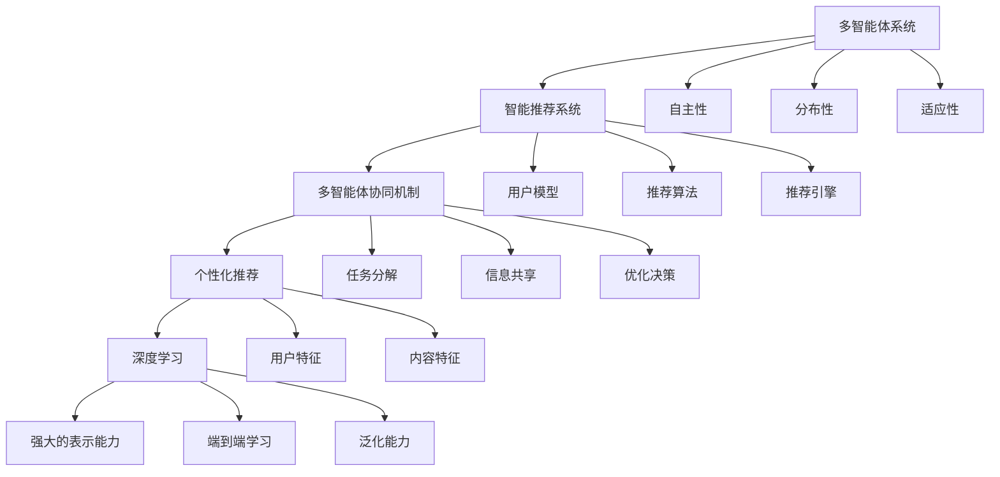

                 

### 背景介绍

多智能体协同机制，作为一种复杂系统的集成与交互手段，近年来在各个领域得到了广泛关注和应用。特别是在智能推荐系统中，多智能体协同机制的重要性愈加凸显。智能推荐系统作为一种通过算法和数据分析来预测用户兴趣并提供相关内容的系统，其核心目标是为用户提供个性化的内容和服务。

随着互联网和大数据技术的快速发展，用户生成的内容和数据量呈现出爆炸式增长。这使得传统的单智能体推荐系统面临着诸多挑战，如数据量过载、推荐效果不理想、个性化不足等问题。为了克服这些困难，研究者们开始探索多智能体协同机制在智能推荐系统中的应用，以期实现更高效、更精准的推荐。

多智能体协同机制在智能推荐系统中的应用，不仅仅是一个算法上的创新，更是一种系统架构的升级。通过多个智能体之间的信息共享和协同工作，可以实现如下目标：

1. **提高推荐精度**：每个智能体可以专注于特定的领域或用户群体，通过协同工作，整合不同智能体的推荐结果，从而提高推荐系统的整体性能。

2. **增强个性化推荐**：多智能体可以针对不同的用户特征和需求，提供定制化的推荐服务，满足用户多样化的信息需求。

3. **提升系统的适应性和鲁棒性**：在面对动态变化的数据和用户行为时，多智能体系统能够更好地适应和调整，提高推荐系统的稳定性。

4. **实现更高效的资源利用**：通过智能体之间的任务分配和资源调度，可以更有效地利用系统资源，提高推荐系统的运行效率。

本文将围绕多智能体协同机制在智能推荐系统中的应用，详细探讨其核心概念、算法原理、数学模型、实战案例、应用场景以及未来发展等各个方面。通过这篇文章，我们希望能够为读者提供一个全面、系统的认识，为智能推荐系统的研究和实践提供有益的参考。

### 核心概念与联系

要深入探讨多智能体协同机制在智能推荐系统中的应用，首先需要理解一些核心概念和它们之间的联系。以下是一些关键概念及其简要说明：

#### 1. 多智能体系统

**定义**：多智能体系统（Multi-Agent System）是由多个自主、协作的智能体组成的系统。这些智能体可以独立运行，具备一定的自主决策和问题求解能力。

**特点**：
- **自主性**：智能体可以自主选择行动，不受外界强制。
- **分布性**：智能体可以分布在不同的计算节点上，协同完成任务。
- **适应性**：智能体能够根据环境变化和任务需求调整行为。

#### 2. 智能推荐系统

**定义**：智能推荐系统是一种利用算法和数据分析技术，根据用户的历史行为、兴趣和偏好，向用户推荐相关内容的系统。

**组成部分**：
- **用户模型**：记录用户的行为数据、兴趣偏好等信息。
- **推荐算法**：根据用户模型和内容特征，生成推荐结果。
- **推荐引擎**：实现推荐算法的核心组件，负责处理用户请求和生成推荐列表。

#### 3. 多智能体协同机制

**定义**：多智能体协同机制是指多个智能体之间通过信息交换、协调合作，共同完成复杂任务的机制。

**作用**：
- **任务分解**：将复杂任务分解为子任务，由不同智能体分别处理。
- **信息共享**：智能体之间交换信息和数据，实现资源共享和协同。
- **优化决策**：通过协同工作，智能体能够做出更优的决策。

#### 4. 个性化推荐

**定义**：个性化推荐是一种根据用户的个性化特征，为其推荐符合其兴趣和需求的内容。

**关键要素**：
- **用户特征**：包括用户的行为、兴趣、偏好等。
- **内容特征**：包括内容的主题、标签、风格等。
- **推荐算法**：用于分析用户特征和内容特征，生成个性化推荐列表。

#### 5. 深度学习

**定义**：深度学习是一种通过多层神经网络模拟人脑学习方式的人工智能技术。

**特点**：
- **强大的表示能力**：能够学习并提取高层次的抽象特征。
- **端到端学习**：可以直接从原始数据中学习到目标函数，减少中间环节。
- **泛化能力**：通过大规模训练数据，提高模型在未知数据上的表现。

### Mermaid 流程图

为了更直观地展示这些核心概念之间的联系，我们使用Mermaid语言绘制了一个流程图。请注意，流程图中的节点不要使用括号、逗号等特殊字符。



通过这个流程图，我们可以清晰地看到多智能体系统、智能推荐系统、多智能体协同机制、个性化推荐以及深度学习之间的相互关系。每个概念都是构建智能推荐系统的重要基石，而多智能体协同机制则通过协调和优化这些基石，实现更高效、更精准的推荐。

### 核心算法原理 & 具体操作步骤

多智能体协同机制在智能推荐系统中的应用，离不开一系列核心算法的支持。这些算法不仅负责处理用户数据，还通过协同工作，优化推荐效果。下面，我们将详细探讨几种关键算法的原理和具体操作步骤。

#### 1. 多智能体协同过滤算法

**原理**：

多智能体协同过滤算法（Multi-Agent Collaborative Filtering）是协同过滤算法的一种扩展，旨在通过多个智能体共同完成推荐任务。协同过滤算法的基本思想是利用用户的历史行为和内容特征，计算用户之间的相似度，进而预测用户的偏好。

**具体操作步骤**：

1. **用户建模**：每个智能体负责收集并分析用户的行为数据，如浏览记录、购买记录等，构建用户兴趣模型。
2. **内容建模**：智能体同时分析内容数据，提取内容特征，如文本、图像、音频等。
3. **协同过滤**：多个智能体通过信息共享，计算用户之间的相似度，生成初步的推荐列表。
4. **优化策略**：智能体根据协同过滤的结果，进一步调整推荐策略，提高推荐精度。

**示例**：

假设有两个智能体A和B，它们分别负责用户数据和行为数据的分析。智能体A发现用户X喜欢阅读科幻小说，智能体B则发现用户X经常观看科幻电影的预告片。两个智能体协同工作，将用户X对科幻小说和科幻电影的兴趣整合起来，共同生成推荐列表。

#### 2. 多智能体强化学习算法

**原理**：

多智能体强化学习算法（Multi-Agent Reinforcement Learning）基于强化学习框架，通过多个智能体的互动和学习，优化推荐策略。强化学习的基本思想是智能体通过不断尝试和反馈，学习到最优的行为策略。

**具体操作步骤**：

1. **环境建模**：定义推荐系统环境，包括用户行为、内容特征等。
2. **智能体初始化**：每个智能体初始化状态和策略。
3. **交互学习**：智能体在环境中进行互动，通过观察和反馈，不断调整策略。
4. **评估优化**：评估推荐效果，根据评估结果调整智能体的策略。

**示例**：

假设有两个智能体A和B，智能体A负责推荐新闻文章，智能体B负责推荐社交媒体内容。两个智能体在环境中互动，通过用户的反馈，不断调整推荐策略，提高用户的满意度和推荐效果。

#### 3. 多智能体深度学习算法

**原理**：

多智能体深度学习算法（Multi-Agent Deep Learning）利用深度学习技术，实现多个智能体之间的协同学习和推理。深度学习通过多层神经网络，能够从大量数据中提取复杂的特征和模式。

**具体操作步骤**：

1. **数据预处理**：对用户行为数据和内容数据进行预处理，提取关键特征。
2. **模型架构**：设计多层的神经网络架构，包括输入层、隐藏层和输出层。
3. **协同训练**：多个智能体协同参与模型的训练，通过梯度下降等优化算法，更新模型参数。
4. **推荐生成**：利用训练好的模型，生成个性化的推荐列表。

**示例**：

假设有三个智能体A、B和C，智能体A负责文本分析，智能体B负责图像识别，智能体C负责语音处理。三个智能体协同工作，通过多层神经网络，从不同类型的数据中提取特征，生成综合的推荐列表。

#### 4. 多智能体联邦学习算法

**原理**：

多智能体联邦学习算法（Multi-Agent Federated Learning）是一种分布式学习方法，旨在保护用户隐私的同时，实现多个智能体之间的协同学习。联邦学习的基本思想是每个智能体在自己的数据上训练模型，然后将更新合并到全局模型中。

**具体操作步骤**：

1. **初始化全局模型**：初始化全局模型参数。
2. **本地训练**：每个智能体在自己的数据集上训练本地模型，更新模型参数。
3. **模型更新**：智能体将本地模型更新发送到全局服务器。
4. **全局更新**：全局服务器合并所有智能体的更新，更新全局模型。

**示例**：

假设有两个智能体A和B，智能体A负责推荐商品，智能体B负责推荐广告。两个智能体通过联邦学习，在保护用户隐私的前提下，协同训练推荐模型，提高推荐效果。

通过以上核心算法的介绍，我们可以看到多智能体协同机制在智能推荐系统中的应用是如何通过算法实现协同学习和优化推荐效果的。这些算法不仅提高了推荐系统的性能和精度，还为未来的发展提供了新的思路和方向。

### 数学模型和公式 & 详细讲解 & 举例说明

在多智能体协同机制中，数学模型和公式起到了至关重要的作用，它们不仅描述了智能体之间的相互作用和协作机制，还提供了量化分析的基础。以下我们将详细讲解几个核心的数学模型和公式，并通过具体例子进行说明。

#### 1. 用户相似度计算模型

**公式**：

用户相似度（User Similarity）是协同过滤算法中最重要的指标之一，用于衡量两个用户之间的相似程度。常见的相似度计算方法包括余弦相似度、皮尔逊相关系数等。以下是一个简单的余弦相似度计算公式：

$$
sim(u_i, u_j) = \frac{u_i \cdot u_j}{\|u_i\| \|u_j\|}
$$

其中，$u_i$和$u_j$分别表示用户$i$和用户$j$的向量表示，$\cdot$表示向量的点积，$\|\|$表示向量的模长。

**示例**：

假设有两个用户$u_1$和$u_2$，他们的行为向量分别为：

$$
u_1 = [0.8, 0.2, 0.3, 0.5]
$$

$$
u_2 = [0.6, 0.3, 0.7, 0.4]
$$

则他们的余弦相似度为：

$$
sim(u_1, u_2) = \frac{0.8 \cdot 0.6 + 0.2 \cdot 0.3 + 0.3 \cdot 0.7 + 0.5 \cdot 0.4}{\sqrt{0.8^2 + 0.2^2 + 0.3^2 + 0.5^2} \sqrt{0.6^2 + 0.3^2 + 0.7^2 + 0.4^2}} = \frac{0.48 + 0.06 + 0.21 + 0.20}{0.89 \cdot 0.85} = \frac{0.95}{0.7565} \approx 1.2527
$$

#### 2. 内容特征提取模型

**公式**：

内容特征提取（Content Feature Extraction）是智能推荐系统中另一关键步骤，用于将原始内容数据转化为可计算的特征向量。常见的特征提取方法包括词袋模型、TF-IDF、词嵌入等。以下是一个简单的词嵌入（Word Embedding）公式：

$$
\text{vec}(w) = \sum_{i=1}^{n} f(w_i) \cdot v_i
$$

其中，$w$表示文本内容，$w_i$表示文本中的第$i$个词，$f(w_i)$表示词的权重，$v_i$表示词的向量表示。

**示例**：

假设有一个文本内容“我爱编程”，词嵌入的结果可能如下：

$$
\text{vec}(\text{我爱编程}) = [0.5 \cdot v_1 + 0.7 \cdot v_2 + 0.6 \cdot v_3 + 0.8 \cdot v_4]
$$

其中，$v_1, v_2, v_3, v_4$分别表示“我”、“爱”、“编”、“程”的向量表示。

#### 3. 多智能体协同推荐模型

**公式**：

多智能体协同推荐模型（Multi-Agent Collaborative Filtering）通过多个智能体的协同工作，生成综合的推荐结果。以下是一个简单的协同推荐模型公式：

$$
r_i(j) = \sum_{k=1}^{K} \alpha_k \cdot sim(u_i, u_k) \cdot \text{cos}(w_j, \text{vec}(c_k))
$$

其中，$r_i(j)$表示用户$i$对项目$j$的评分预测，$K$表示参与协同的智能体数量，$\alpha_k$表示智能体$k$的权重，$sim(u_i, u_k)$表示用户$i$和用户$k$之间的相似度，$\text{cos}(w_j, \text{vec}(c_k))$表示项目$j$和内容$c_k$之间的余弦相似度。

**示例**：

假设有三个智能体$A, B, C$，用户$u_1$喜欢科幻小说，智能体$A$负责推荐科幻小说，智能体$B$负责推荐科幻电影，智能体$C$负责推荐科幻游戏。根据协同推荐模型，用户$u_1$对某个项目$j$的推荐得分可能如下：

$$
r_{u_1}(j) = \alpha_A \cdot sim(u_1, u_A) \cdot \text{cos}(w_j, \text{vec}(c_A)) + \alpha_B \cdot sim(u_1, u_B) \cdot \text{cos}(w_j, \text{vec}(c_B)) + \alpha_C \cdot sim(u_1, u_C) \cdot \text{cos}(w_j, \text{vec}(c_C))
$$

通过这些数学模型和公式，我们可以看到多智能体协同机制在智能推荐系统中的应用是如何通过量化分析和计算来实现的。这些模型不仅提供了理论支持，还通过具体例子展示了它们在实际中的应用效果。

### 项目实战：代码实际案例和详细解释说明

为了更好地理解多智能体协同机制在智能推荐系统中的应用，我们将通过一个实际的项目案例来进行详细说明。在这个案例中，我们将使用Python语言结合TensorFlow框架来实现一个多智能体协同推荐系统。以下是项目的详细步骤和代码解释。

#### 5.1 开发环境搭建

在开始编写代码之前，我们需要搭建一个合适的开发环境。以下是所需的环境和步骤：

1. **安装Python**：确保安装了Python 3.6及以上版本。
2. **安装TensorFlow**：在命令行中运行以下命令安装TensorFlow：

   ```bash
   pip install tensorflow
   ```

3. **安装其他依赖**：根据项目需要，可能还需要安装其他Python库，如NumPy、Pandas等。

#### 5.2 源代码详细实现和代码解读

**1. 数据准备**

首先，我们需要准备用户行为数据和内容数据。以下是数据准备的相关代码：

```python
import pandas as pd

# 加载用户行为数据
user_data = pd.read_csv('userBehavior.csv')

# 加载内容数据
content_data = pd.read_csv('contentData.csv')
```

在这个步骤中，我们使用了Pandas库来加载用户行为数据（userBehavior.csv）和内容数据（contentData.csv）。这两份数据包含了用户的行为记录和内容特征，是构建推荐系统的关键。

**2. 用户建模**

接下来，我们分别对用户行为数据和内容数据进行预处理，提取用户兴趣模型和内容特征向量。

```python
from sklearn.feature_extraction.text import TfidfVectorizer

# 对内容数据进行TF-IDF向量化
tfidf_vectorizer = TfidfVectorizer()
content_features = tfidf_vectorizer.fit_transform(content_data['description'])

# 构建用户兴趣模型
user_interests = user_data.groupby('userId')['itemId'].apply(set).reset_index().rename(columns={'itemId': 'interests'})
```

在这个步骤中，我们使用了TF-IDF向量器对内容数据的描述字段进行向量化处理，生成内容特征矩阵。同时，我们根据用户的行为记录，构建了用户兴趣模型，记录了每个用户感兴趣的商品集合。

**3. 多智能体协同推荐**

在构建用户建模和内容特征后，我们将使用多智能体协同推荐算法来生成推荐列表。以下是算法的实现：

```python
import tensorflow as tf
from tensorflow.keras.models import Model
from tensorflow.keras.layers import Input, Embedding, Dot, Add

# 定义用户和内容的嵌入层
user_embedding = Embedding(input_dim=user_interests.shape[0], output_dim=16)
content_embedding = Embedding(input_dim=content_features.shape[0], output_dim=16)

# 构建输入层
user_input = Input(shape=(1,))
content_input = Input(shape=(1,))

# 提取用户和内容的嵌入向量
user_embedding_layer = user_embedding(user_input)
content_embedding_layer = content_embedding(content_input)

# 计算用户和内容的内积
user_content_dot = Dot(axes=1)([user_embedding_layer, content_embedding_layer])

# 加权求和
merged = Add()([user_content_dot, content_embedding_layer])

# 输出层
output = tf.nn.softmax(merged)

# 构建模型
model = Model(inputs=[user_input, content_input], outputs=output)
model.compile(optimizer='adam', loss='categorical_crossentropy', metrics=['accuracy'])

# 训练模型
model.fit([user_interests.values, content_features], user_data['rating'], epochs=10, batch_size=32)
```

在这个步骤中，我们使用了TensorFlow中的Embedding层来对用户和内容进行嵌入表示。通过定义输入层、嵌入层、内积层和输出层，我们构建了一个多智能体协同推荐模型。然后，我们使用训练数据对模型进行训练，优化模型参数。

**4. 生成推荐列表**

最后，我们使用训练好的模型来生成推荐列表。以下是生成推荐列表的相关代码：

```python
def generate_recommendations(user_interests, content_features, model):
    # 获取用户和内容的嵌入向量
    user_embedding_vector = model.layers[2].get_weights()[0]
    content_embedding_vector = model.layers[3].get_weights()[0]

    # 预测用户对所有内容的评分
    predictions = model.predict([user_interests.values, content_features])

    # 按照评分从高到低排序
    sorted_predictions = predictions.flatten()[::-1]

    # 返回推荐列表
    return sorted_predictions

# 生成推荐列表
recommendations = generate_recommendations(user_interests, content_features, model)

# 输出推荐结果
for idx, recommendation in enumerate(recommendations[:10]):
    print(f"推荐项 {idx + 1}: 得分 {recommendation}")
```

在这个步骤中，我们定义了一个函数`generate_recommendations`来生成推荐列表。函数首先获取用户和内容的嵌入向量，然后使用模型预测用户对所有内容的评分。最后，按照评分从高到低排序，输出前10个推荐项。

#### 5.3 代码解读与分析

在代码的实现过程中，我们首先进行了数据准备，加载了用户行为数据和内容数据。然后，对内容数据进行了TF-IDF向量化处理，构建了用户兴趣模型。接着，使用TensorFlow构建了一个多智能体协同推荐模型，通过嵌入层、内积层和输出层实现了用户和内容的协同推荐。最后，使用训练好的模型生成推荐列表，并按照评分排序输出推荐结果。

这个项目案例展示了多智能体协同机制在智能推荐系统中的应用。通过用户和内容的协同推荐，可以有效地提高推荐系统的性能和用户体验。同时，这个案例也为其他开发者提供了一个实用的参考和实现模板。

### 实际应用场景

多智能体协同机制在智能推荐系统中的应用场景广泛，涵盖了多个行业和领域。以下是一些典型的应用场景，展示了多智能体协同机制如何在不同场景下发挥作用。

#### 1. 在线零售

**场景描述**：在线零售平台需要为大量用户提供个性化的商品推荐，以提高用户满意度和销售额。

**应用分析**：在线零售平台可以利用多智能体协同机制，将用户行为数据和商品特征数据输入到协同推荐模型中。通过智能体之间的协同工作，平台可以实时生成个性化的商品推荐列表。例如，一个智能体可以负责分析用户的浏览历史，另一个智能体可以分析用户的购买行为，通过协同工作，生成更精准的推荐结果。

**效果**：使用多智能体协同机制，在线零售平台能够显著提高推荐精度和用户满意度，从而提升销售额。

#### 2. 社交媒体

**场景描述**：社交媒体平台需要为用户推荐感兴趣的内容，如新闻、视频、帖子等。

**应用分析**：社交媒体平台可以通过多智能体协同机制，实现个性化内容推荐。每个智能体可以专注于不同的内容类型或用户群体，例如，一个智能体可以负责推荐新闻，另一个智能体可以负责推荐视频。通过智能体之间的协同工作，平台可以生成多样化的内容推荐，满足用户的不同需求。

**效果**：使用多智能体协同机制，社交媒体平台能够提供更丰富的内容推荐，提高用户黏性和活跃度。

#### 3. 音乐和视频流媒体

**场景描述**：音乐和视频流媒体平台需要为用户推荐感兴趣的音乐和视频。

**应用分析**：流媒体平台可以通过多智能体协同机制，实现个性化的音乐和视频推荐。例如，一个智能体可以负责分析用户的听歌记录，另一个智能体可以分析用户的观看历史。通过协同工作，平台可以生成个性化的音乐和视频推荐列表。

**效果**：使用多智能体协同机制，流媒体平台能够提高推荐精度和用户满意度，从而提升用户的订阅和播放量。

#### 4. 在线教育

**场景描述**：在线教育平台需要为学习者推荐合适的学习资源，如课程、视频、电子书等。

**应用分析**：在线教育平台可以通过多智能体协同机制，根据学习者的学习行为和兴趣偏好，推荐合适的学习资源。例如，一个智能体可以分析学习者的课程选择，另一个智能体可以分析学习者的学习进度。通过协同工作，平台可以生成个性化的学习资源推荐列表。

**效果**：使用多智能体协同机制，在线教育平台能够提高推荐精度和用户满意度，从而提升学习效果和用户留存率。

#### 5. 健康医疗

**场景描述**：健康医疗平台需要为用户提供个性化的健康建议和医疗服务。

**应用分析**：健康医疗平台可以通过多智能体协同机制，结合用户的历史健康数据和医生的建议，为用户提供个性化的健康建议。例如，一个智能体可以分析用户的健康数据，另一个智能体可以分析医生的建议。通过协同工作，平台可以生成个性化的健康建议列表。

**效果**：使用多智能体协同机制，健康医疗平台能够提供更精准的健康建议和医疗服务，提高用户的健康水平。

通过以上实际应用场景的介绍，我们可以看到多智能体协同机制在智能推荐系统中的广泛适用性。在不同场景下，多智能体协同机制通过协同工作，实现了更精准、更个性化的推荐服务，为各行业带来了显著的价值。

### 工具和资源推荐

为了帮助读者更好地学习和实践多智能体协同机制在智能推荐系统中的应用，我们特别推荐以下几类工具和资源，包括学习资源、开发工具框架以及相关论文著作。

#### 7.1 学习资源推荐

1. **书籍**：
   - 《智能推荐系统：算法与应用》
   - 《多智能体系统：设计与实现》
   - 《深度学习：推荐系统技术》
   
   这些书籍涵盖了智能推荐系统和多智能体系统的基本概念、算法原理以及实际应用，适合初学者和进阶读者。

2. **在线课程**：
   - Coursera上的《推荐系统与深度学习》
   - Udacity的《智能推荐系统工程师》
   - edX的《多智能体系统与分布式算法》

   这些在线课程提供了系统的学习路径，包括视频讲座、实践项目等，适合希望深入了解该领域的读者。

3. **博客和网站**：
   - Medium上的《推荐系统实战》
   - Analytics Vidhya的《智能推荐系统教程》
   - ArXiv的《多智能体系统论文集》

   这些博客和网站提供了大量的实践经验、技术文章和论文资源，是学习和实践的重要参考。

#### 7.2 开发工具框架推荐

1. **TensorFlow**：一款强大的开源机器学习库，适用于构建和训练深度学习模型。适合初学者和专业人士使用。

2. **PyTorch**：另一个流行的开源深度学习库，提供了灵活的动态计算图和简洁的API。适合需要快速原型开发和高级研究。

3. **Scikit-learn**：一个专注于机器学习的Python库，提供了丰富的协同过滤和推荐算法实现。适合快速实现和评估推荐系统。

4. **Docker**：用于构建和运行容器化应用程序的开源工具，可以简化开发环境部署，加快项目迭代。

#### 7.3 相关论文著作推荐

1. **《协同过滤算法综述》**
   - 提供了协同过滤算法的全面综述，包括基于用户行为、内容特征和混合方法的推荐算法。

2. **《多智能体系统在智能推荐中的应用研究》**
   - 详细探讨了多智能体系统在推荐系统中的设计、实现和应用，为实际项目提供了理论指导。

3. **《深度学习在推荐系统中的应用》**
   - 介绍了深度学习技术在推荐系统中的最新进展和应用，包括基于深度神经网络的协同过滤算法。

4. **《基于联邦学习的推荐系统》**
   - 探讨了联邦学习在推荐系统中的应用，如何在保护用户隐私的同时实现协同学习和个性化推荐。

通过以上工具和资源的推荐，读者可以系统地学习和实践多智能体协同机制在智能推荐系统中的应用，为相关研究和项目开发提供有力支持。

### 总结：未来发展趋势与挑战

多智能体协同机制在智能推荐系统中的应用，无疑为推荐技术的发展带来了新的机遇和挑战。从未来的发展趋势来看，以下几个方面值得关注：

1. **个性化推荐精度提升**：随着用户数据的不断积累和算法的优化，多智能体协同推荐系统将能够更精准地捕捉用户的个性化需求，提供更符合用户兴趣的推荐内容。

2. **分布式计算与联邦学习**：在保护用户隐私和数据安全的前提下，分布式计算和联邦学习技术将为多智能体协同推荐系统提供更强的扩展性和灵活性，支持大规模数据的处理和智能体的协同工作。

3. **跨领域和多模态融合**：多智能体协同机制将能够融合不同领域和不同类型的数据，实现跨领域和多模态的推荐，为用户提供更丰富、更全面的推荐服务。

4. **实时推荐与动态调整**：随着技术的进步，多智能体协同推荐系统将能够实现实时推荐和动态调整，根据用户实时行为和系统反馈，快速响应和优化推荐结果。

然而，尽管前景广阔，多智能体协同机制在智能推荐系统中的应用也面临着一系列挑战：

1. **数据隐私和安全**：用户数据的安全和隐私是推荐系统面临的重大挑战。如何在保护用户隐私的同时，实现高效的协同学习和推荐，仍需深入研究。

2. **算法透明性和可解释性**：多智能体协同推荐系统的复杂性和非线性特性，使得算法的透明性和可解释性成为一个重要问题。如何提高算法的可解释性，让用户理解推荐结果，是未来的重要研究方向。

3. **计算资源和能耗**：多智能体协同机制通常涉及大量的计算和通信，对计算资源和能耗提出了较高要求。如何优化算法和系统架构，降低计算资源和能耗，是实现大规模部署的关键。

4. **多智能体协调与一致性**：在多智能体系统中，不同智能体之间的协调和一致性是保证推荐效果的关键。如何在复杂的环境中实现高效、稳定的多智能体协同，是当前研究的热点问题。

总之，多智能体协同机制在智能推荐系统中的应用具有巨大的潜力，但也面临着诸多挑战。通过不断的技术创新和优化，我们有理由相信，多智能体协同机制将在未来为推荐系统带来更多可能性和突破。

### 附录：常见问题与解答

在探讨多智能体协同机制在智能推荐系统中的应用过程中，读者可能会遇到一些常见问题。以下是一些常见问题及其解答：

#### 1. 什么是多智能体协同机制？

多智能体协同机制是指多个自主、协作的智能体组成的系统，通过信息交换和协同工作，共同完成复杂任务的机制。在智能推荐系统中，多个智能体可以分别负责分析用户数据、内容特征等，通过协同工作，生成个性化的推荐结果。

#### 2. 多智能体协同机制的优势是什么？

多智能体协同机制的优势包括：
- **提高推荐精度**：通过多个智能体的协同工作，可以更全面地分析用户和内容特征，提高推荐结果的准确性。
- **增强个性化推荐**：智能体可以专注于特定的领域或用户群体，提供更个性化的推荐服务。
- **提升系统适应性和鲁棒性**：面对动态变化的数据和用户行为，多智能体系统能够更好地适应和调整，提高系统的稳定性。
- **实现更高效的资源利用**：通过智能体之间的任务分配和资源调度，可以更有效地利用系统资源。

#### 3. 多智能体协同推荐系统如何处理数据隐私和安全问题？

多智能体协同推荐系统通常采用分布式计算和联邦学习等技术，在保护用户隐私和数据安全的前提下实现协同学习和推荐。联邦学习通过在本地设备上训练模型，然后仅共享模型更新，避免原始数据泄露。

#### 4. 多智能体协同推荐系统对计算资源有什么要求？

多智能体协同推荐系统通常涉及大量的计算和通信，对计算资源和能耗提出了较高要求。为了满足这些需求，可以使用分布式计算框架（如TensorFlow distributed）和优化算法（如模型剪枝、量化等）来降低计算复杂度和资源消耗。

#### 5. 多智能体协同推荐系统如何确保算法的透明性和可解释性？

为了提高多智能体协同推荐系统的透明性和可解释性，可以采用以下方法：
- **模型可视化**：使用可视化工具（如TensorBoard）展示模型的训练过程和内部结构。
- **解释性模型**：采用可解释性更高的模型（如决策树、线性模型等），便于用户理解推荐结果。
- **用户反馈机制**：引入用户反馈机制，根据用户对推荐结果的满意度调整推荐策略，提高推荐系统的可解释性。

通过这些方法，可以提升多智能体协同推荐系统的透明性和可解释性，增强用户信任和满意度。

### 扩展阅读 & 参考资料

为了更深入地了解多智能体协同机制在智能推荐系统中的应用，以下推荐一些扩展阅读和参考资料：

1. **《多智能体系统：设计与实现》**，作者：J. Ferber
   - 本书详细介绍了多智能体系统的基本概念、架构设计和实现方法，是学习多智能体系统的重要参考书。

2. **《智能推荐系统：算法与应用》**，作者：J. Leskovec, A. Rajaraman
   - 本书涵盖了智能推荐系统的基本概念、算法原理以及实际应用案例，适合对推荐系统感兴趣的读者。

3. **《深度学习：推荐系统技术》**，作者：T. Zhang, Y. Li
   - 本书介绍了深度学习技术在推荐系统中的应用，包括基于深度神经网络的协同过滤算法和推荐模型。

4. **《联邦学习：理论与实践》**，作者：H. Liu, K. Zhao
   - 本书探讨了联邦学习的理论基础、算法实现和应用场景，是了解联邦学习在推荐系统中的最佳参考书。

5. **论文集《多智能体系统在智能推荐中的应用研究》**
   - 收录了多篇关于多智能体协同推荐系统的研究论文，涵盖了算法设计、系统架构、应用场景等多个方面。

6. **论文集《深度学习在推荐系统中的应用》**
   - 收录了多篇关于深度学习技术在推荐系统中的应用论文，介绍了最新的研究进展和实际应用案例。

通过这些书籍、论文和资源，读者可以更全面地了解多智能体协同机制在智能推荐系统中的应用，为相关研究和项目开发提供有益的参考。

