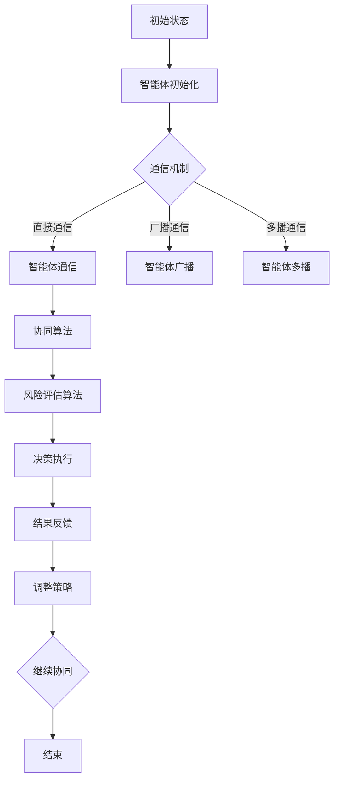

                 

# 多智能体协同机制在智能金融系统中的应用

## 关键词
多智能体系统、智能金融、协同机制、算法原理、数学模型、应用场景

## 摘要
本文深入探讨多智能体协同机制在智能金融系统中的应用。首先，我们介绍多智能体系统的基础概念和智能金融的背景，然后详细解析多智能体协同机制的核心算法原理和具体操作步骤。接着，我们通过数学模型和公式详细讲解，并以实际项目实战为例，展示代码实现和解读。此外，我们分析了智能金融中的实际应用场景，并推荐了相关工具和资源。最后，我们对未来发展趋势和挑战进行了总结，并提供了一些常见问题与解答。

## 1. 背景介绍

智能金融是金融领域与人工智能技术深度融合的产物，通过利用大数据、云计算、区块链、机器学习等先进技术，提升金融服务的效率、安全性和个性化水平。随着金融科技的快速发展，智能金融系统在金融行业的应用日益广泛，包括智能投资、智能风控、智能客服等。

多智能体系统（MAS）是由多个智能体（agent）组成的系统，这些智能体具有自主性、协同性和适应性等特点。多智能体系统在金融领域的应用主要表现在以下几个方面：

1. **智能投资**：通过多智能体的协同工作，实现投资策略的优化和风险控制。
2. **智能风控**：多智能体可以实时监控金融市场的动态，预测风险并采取相应的措施。
3. **智能客服**：利用多智能体实现24/7的智能客服服务，提高客户体验。

智能金融系统中的多智能体协同机制，旨在通过算法和模型实现智能体之间的有效沟通、协作和决策，从而提高整个系统的效率和稳定性。本文将围绕这一核心主题，深入探讨多智能体协同机制在智能金融系统中的应用。

### 1.1 智能金融的背景

智能金融的发展离不开金融科技的进步。金融科技（FinTech）是指利用大数据、区块链、云计算、人工智能等先进技术，对传统金融业务模式进行创新和升级。以下是一些推动智能金融发展的关键因素：

1. **大数据**：大数据技术的应用使得金融机构能够收集、处理和分析海量数据，从而为投资决策和风险管理提供有力支持。
2. **区块链**：区块链技术提供了去中心化、安全透明的账本，在支付清算、跨境交易等方面具有显著优势。
3. **云计算**：云计算使得金融机构能够更加灵活地部署和管理系统资源，提高业务处理效率。
4. **人工智能**：人工智能技术通过机器学习、自然语言处理等手段，实现了智能投顾、智能客服等新功能。

随着金融科技的不断发展，智能金融系统在金融行业的应用越来越广泛。智能金融系统不仅能够提高金融机构的运营效率，还能为投资者和客户提供更加个性化、安全的服务。然而，智能金融系统的发展也面临着一些挑战，如数据隐私保护、算法透明度等。因此，研究多智能体协同机制在智能金融系统中的应用，具有重要的理论和实践价值。

### 1.2 多智能体系统的基本概念

多智能体系统（MAS）是由多个智能体（agent）组成的系统，这些智能体通过相互协作，共同完成任务。智能体可以是一个程序、一个设备、一个组织或者一个人。智能体具有以下基本特性：

1. **自主性**：智能体具有独立决策和行动的能力，不受外部直接控制。
2. **协同性**：智能体之间可以通过通信和协作，共同完成任务。
3. **适应性**：智能体可以根据环境变化调整自身行为和策略。

多智能体系统可以应用于多种场景，如供应链管理、智能制造、智能交通等。在智能金融系统中，多智能体系统主要用于实现投资策略的优化、风险控制、智能客服等功能。

### 1.3 多智能体协同机制的重要性

在智能金融系统中，多智能体协同机制具有重要意义。通过多智能体的协同工作，可以实现以下目标：

1. **优化投资策略**：多智能体可以实时分析市场数据，生成最优的投资策略。
2. **提高风险管理能力**：多智能体可以实时监控金融市场动态，预测风险并采取相应的措施。
3. **提升客户体验**：多智能体可以实现个性化金融服务，提高客户满意度。

总之，多智能体协同机制是智能金融系统实现高效、安全、个性化服务的关键技术之一。

### 1.4 多智能体协同机制的研究现状

目前，关于多智能体协同机制在智能金融系统中的应用研究已经取得了一些成果。以下是一些主要的研究方向：

1. **多智能体协同优化算法**：研究如何通过优化算法，实现多智能体之间的协同工作。
2. **多智能体系统建模与仿真**：通过建立数学模型和仿真环境，研究多智能体系统的行为和性能。
3. **多智能体系统安全性与隐私保护**：研究如何保障多智能体系统的安全性和数据隐私。

尽管已经取得了一些进展，但多智能体协同机制在智能金融系统中的应用仍然面临一些挑战，如智能体之间的通信效率、决策一致性等。因此，未来的研究需要在算法、模型和安全性等方面进行深入探索。

### 2. 核心概念与联系

#### 2.1 多智能体系统（MAS）

多智能体系统（MAS）是由多个智能体（agent）组成的系统，这些智能体通过相互通信和协作，共同实现某个目标。在MAS中，每个智能体都是独立的实体，具有自主性、协同性和适应性等特点。

**概念**：
- **智能体（Agent）**：一个智能体是一个具有自主决策和行动能力的实体。它可以是人类、程序、机器人或其他设备。
- **自主性（Autonomy）**：智能体具有独立决策和行动的能力，不受外部直接控制。
- **协同性（Coordination）**：智能体之间可以通过通信和协作，共同完成任务。
- **适应性（Adaptability）**：智能体可以根据环境变化调整自身行为和策略。

**联系**：
多智能体系统在智能金融系统中的应用，主要体现在以下几个方面：

1. **投资策略优化**：通过多个智能体的协同工作，实现投资策略的优化和风险控制。
2. **风险监控**：多智能体可以实时监控金融市场的动态，预测风险并采取相应的措施。
3. **智能客服**：利用多智能体实现24/7的智能客服服务，提高客户体验。

#### 2.2 多智能体协同机制

多智能体协同机制是指智能体之间通过某种方式相互协作，共同实现某个目标的过程。在智能金融系统中，多智能体协同机制是实现高效、安全、个性化服务的关键。

**概念**：
- **协同机制**：智能体之间通过通信、协商和协调，共同完成任务的过程。
- **协同目标**：智能体之间的协同工作，旨在实现共同的目标。
- **协同策略**：智能体为了实现协同目标，所采用的策略和方法。

**联系**：
在智能金融系统中，多智能体协同机制的应用，主要包括以下方面：

1. **投资策略协同**：多个智能体通过协同工作，实现投资策略的优化和风险控制。
2. **风险监控协同**：多智能体实时监控金融市场动态，预测风险并采取相应的措施。
3. **智能客服协同**：多智能体通过协同工作，提供24/7的智能客服服务。

### 2.3 核心算法原理

在多智能体协同机制中，核心算法原理起着至关重要的作用。以下是一些常用的算法原理：

#### 2.3.1 通信机制

通信机制是智能体之间相互协作的基础。常见的通信机制包括：

- **直接通信**：智能体之间通过直接发送消息进行通信。
- **广播通信**：智能体向所有其他智能体发送消息。
- **多播通信**：智能体向一组特定的智能体发送消息。

#### 2.3.2 协同算法

协同算法是多智能体协同机制的核心，用于实现智能体之间的协调和协作。以下是一些常用的协同算法：

- **集中式协同算法**：所有智能体的决策都在中心节点上进行，中心节点负责协调和决策。
- **分布式协同算法**：智能体之间通过相互通信和协商，自主决策并实现协同目标。
- **混合式协同算法**：结合集中式和分布式协同算法的优点，实现智能体的协同工作。

#### 2.3.3 风险评估算法

在智能金融系统中，风险评估算法是多智能体协同机制的重要组成部分。以下是一些常用的风险评估算法：

- **基于历史数据的评估算法**：通过分析历史数据，预测未来的风险。
- **基于实时数据的评估算法**：通过实时监控市场动态，评估当前的风险。
- **组合评估算法**：结合多种评估算法，提高风险评估的准确性。

### 2.4 Mermaid 流程图

为了更直观地展示多智能体协同机制的工作流程，我们使用Mermaid绘制了以下流程图：



在上述流程图中，智能体首先进行初始化，然后通过不同的通信机制进行通信，接着使用协同算法和风险评估算法进行决策，最后根据结果反馈调整策略，实现多智能体的协同工作。

### 3. 核心算法原理 & 具体操作步骤

在智能金融系统中，多智能体协同机制的核心算法原理是实现智能体之间高效协作和决策的关键。下面我们将详细解析几种核心算法原理，并说明具体操作步骤。

#### 3.1 基于博弈论的协同算法

**原理**：博弈论是研究决策者如何在竞争环境中做出最优决策的数学理论。在多智能体协同机制中，我们可以将金融系统中的各个智能体视为博弈的参与方，通过博弈论模型实现智能体之间的协同。

**操作步骤**：

1. **定义参与方**：确定参与协同的智能体，包括投资者、风险控制者、交易员等。
2. **构建博弈模型**：根据参与方的利益和策略，建立博弈模型，如博弈树、支付矩阵等。
3. **求解最优策略**：使用博弈论求解算法，如最小化最大 regret 算法，求解各参与方的最优策略。
4. **策略实施**：将求解得到的策略应用于实际操作中，实现智能体之间的协同。

**示例**：假设有两个智能体 A 和 B，分别代表投资者和风险控制者。他们的策略分别为投资比例和风险容忍度。我们可以通过构建支付矩阵，求解出最优的投资比例和风险容忍度，实现两者之间的协同。

|          | A_1 | A_2 |
| :------: | : | : |
|     B_1 | 1,1 | 1,0 |
|     B_2 | 0,1 | 1,1 |
|支付矩阵|

**解**：通过最小化最大 regret 算法求解，得到最优策略为：

- 投资者 A 选择 A_1，投资比例为 0.6。
- 风险控制者 B 选择 B_2，风险容忍度为 0.4。

**结果**：通过博弈论协同算法，实现投资者和风险控制者之间的协同，提高整体投资收益和风险控制能力。

#### 3.2 基于强化学习的协同算法

**原理**：强化学习是一种通过不断试错，从环境中获取反馈，学习最优策略的机器学习算法。在多智能体协同机制中，我们可以使用强化学习算法，让智能体通过自主学习，实现协同决策。

**操作步骤**：

1. **定义环境**：确定智能体所处的环境，如金融市场、交易市场等。
2. **定义智能体**：定义智能体的行为、状态和奖励函数。
3. **选择强化学习算法**：如 Q-Learning、SARSA、DQN 等。
4. **训练智能体**：通过强化学习算法，训练智能体的策略，使其在环境中取得最优收益。
5. **策略实施**：将训练得到的策略应用于实际操作中，实现智能体之间的协同。

**示例**：假设有两个智能体 A 和 B，分别代表交易员和风险控制者。他们的策略分别为交易策略和风险控制策略。我们可以通过构建强化学习环境，训练智能体的策略，实现两者之间的协同。

**环境定义**：

- **状态**：智能体 A 的状态包括市场趋势、股票价格等；智能体 B 的状态包括风险指数、市场波动等。
- **行为**：智能体 A 的行为包括买入、持有、卖出等；智能体 B 的行为包括风险控制、市场监控等。
- **奖励函数**：根据交易收益、风险控制效果等，定义奖励函数。

**强化学习算法**：选择 Q-Learning 算法训练智能体的策略。

**训练过程**：

1. 初始化智能体 A 和 B 的策略。
2. 让智能体 A 和 B 在环境中进行交互，根据奖励函数计算奖励。
3. 更新智能体的策略，使其在后续交互中取得更好的收益。
4. 重复上述过程，直到智能体的策略收敛。

**结果**：通过强化学习协同算法，实现交易员和风险控制者之间的协同，提高整体交易收益和风险控制能力。

#### 3.3 基于遗传算法的协同算法

**原理**：遗传算法是一种模拟生物进化的全局搜索算法，通过自然选择、交叉和变异等操作，实现智能体的协同进化。

**操作步骤**：

1. **定义个体**：将智能体的策略编码为染色体。
2. **初始化种群**：随机生成一定数量的初始种群。
3. **适应度评估**：根据智能体的表现，计算种群的适应度值。
4. **选择**：根据适应度值，选择优秀的个体进行繁殖。
5. **交叉**：将选中的个体进行交叉操作，生成新的后代。
6. **变异**：对后代进行变异操作，增加种群的多样性。
7. **更新种群**：将新的后代替换掉部分旧个体，形成新的种群。
8. **重复步骤**：重复上述操作，直到满足终止条件。

**示例**：假设有两个智能体 A 和 B，分别代表投资者和交易员。他们的策略分别为投资策略和交易策略。我们可以通过构建遗传算法环境，实现智能体的协同进化。

**个体定义**：

- **染色体**：将智能体 A 的投资策略和智能体 B 的交易策略编码为染色体。
- **适应度函数**：根据投资收益和交易收益，定义适应度函数。

**遗传算法过程**：

1. 初始化种群，随机生成一定数量的初始投资策略和交易策略。
2. 计算种群的适应度值，选择优秀的个体。
3. 对选中的个体进行交叉操作，生成新的投资策略和交易策略。
4. 对后代进行变异操作，增加种群的多样性。
5. 重复上述过程，直到种群适应度值达到最大。

**结果**：通过遗传算法协同算法，实现投资者和交易员之间的协同，提高整体投资收益和交易收益。

### 4. 数学模型和公式 & 详细讲解 & 举例说明

在多智能体协同机制中，数学模型和公式起着至关重要的作用。它们不仅可以描述智能体之间的协作和决策过程，还可以为算法设计和优化提供理论支持。本节将详细讲解一些核心的数学模型和公式，并通过实例进行说明。

#### 4.1 状态转移概率模型

在多智能体协同机制中，状态转移概率模型用于描述智能体在当前状态下，下一个状态的概率分布。以下是一个简单的状态转移概率模型：

**模型定义**：

设智能体 A 和 B 的状态分别为 \( S_A \) 和 \( S_B \)，状态空间分别为 \( \Omega_A \) 和 \( \Omega_B \)。状态转移概率模型可以用一个矩阵 \( P \) 表示，其中 \( P_{ij} \) 表示智能体 A 在状态 \( i \) 下，智能体 B 转移到状态 \( j \) 的概率。

$$
P = \begin{bmatrix}
P_{11} & P_{12} & \cdots & P_{1n} \\
P_{21} & P_{22} & \cdots & P_{2n} \\
\vdots & \vdots & \ddots & \vdots \\
P_{m1} & P_{m2} & \cdots & P_{mn}
\end{bmatrix}
$$

**实例**：

假设智能体 A 的状态空间为 \( \Omega_A = \{0, 1\} \)，智能体 B 的状态空间为 \( \Omega_B = \{0, 1, 2\} \)。状态转移概率矩阵 \( P \) 如下：

$$
P = \begin{bmatrix}
0.5 & 0.5 \\
0.3 & 0.2 & 0.5 \\
0.2 & 0.4 & 0.4
\end{bmatrix}
$$

在这个例子中，智能体 A 在状态 0（不投资）下，智能体 B 有 0.5 的概率转移到状态 1（保守投资），有 0.3 的概率转移到状态 2（中立投资），有 0.2 的概率不发生变化。

#### 4.2 奖励函数模型

奖励函数模型用于评估智能体在某一状态下的决策效果，它是多智能体协同机制中的关键组成部分。以下是一个简单的奖励函数模型：

**模型定义**：

设智能体 A 和 B 的状态分别为 \( S_A \) 和 \( S_B \)，奖励函数 \( R(S_A, S_B) \) 用于评估智能体在状态 \( (S_A, S_B) \) 下的决策效果。

$$
R(S_A, S_B) =
\begin{cases}
r_A, & \text{if } S_A = s_A^* \text{ and } S_B = s_B^* \\
0, & \text{otherwise}
\end{cases}
$$

其中，\( r_A \) 是智能体 A 在状态 \( (s_A^*, s_B^*) \) 下的奖励，\( s_A^* \) 和 \( s_B^* \) 是最优状态。

**实例**：

假设智能体 A 的最优状态为 \( s_A^* = 1 \)，智能体 B 的最优状态为 \( s_B^* = 2 \)。奖励函数 \( R \) 如下：

$$
R = \begin{cases}
100, & \text{if } S_A = 1 \text{ and } S_B = 2 \\
0, & \text{otherwise}
\end{cases}
$$

在这个例子中，当智能体 A 选择状态 1（投资），智能体 B 选择状态 2（中立投资）时，它们将获得 100 的奖励。

#### 4.3 策略评估模型

策略评估模型用于评估智能体的策略效果，它是多智能体协同机制中的核心。以下是一个简单的策略评估模型：

**模型定义**：

设智能体的策略为 \( \pi \)，状态转移概率矩阵为 \( P \)，奖励函数为 \( R \)，策略评估模型 \( V^*(\pi) \) 用于评估智能体在策略 \( \pi \) 下的预期奖励。

$$
V^*(\pi) = \sum_{s \in \Omega} \pi(s) \cdot R(s)
$$

其中，\( \pi(s) \) 是智能体在状态 \( s \) 下采取策略 \( \pi \) 的概率，\( R(s) \) 是智能体在状态 \( s \) 下的奖励。

**实例**：

假设智能体的策略为 \( \pi = \{0.5, 0.5\} \)，状态转移概率矩阵 \( P \) 和奖励函数 \( R \) 如下：

$$
P = \begin{bmatrix}
0.5 & 0.5 \\
0.3 & 0.2 & 0.5 \\
0.2 & 0.4 & 0.4
\end{bmatrix}
$$

$$
R = \begin{cases}
100, & \text{if } S_A = 1 \text{ and } S_B = 2 \\
0, & \text{otherwise}
\end{cases}
$$

根据策略评估模型，智能体在策略 \( \pi \) 下的预期奖励为：

$$
V^*(\pi) = 0.5 \cdot 100 + 0.5 \cdot 0 = 50
$$

在这个例子中，智能体在策略 \( \pi \) 下的预期奖励为 50。

#### 4.4 动态规划模型

动态规划模型是一种用于求解多智能体协同机制中策略优化问题的高效算法。以下是一个简单的动态规划模型：

**模型定义**：

设智能体的状态集合为 \( S \)，策略集合为 \( \Pi \)，价值函数 \( V(S, \Pi) \) 用于评估智能体在状态 \( S \) 下采取策略 \( \Pi \) 的最优奖励。

$$
V^*(S) = \max_{\Pi \in \Pi} \sum_{s' \in S'} p(s'|s, \Pi) \cdot R(s')
$$

其中，\( p(s'|s, \Pi) \) 是智能体在状态 \( s \) 下采取策略 \( \Pi \) 转移到状态 \( s' \) 的概率，\( R(s') \) 是智能体在状态 \( s' \) 下的奖励。

**实例**：

假设智能体的状态集合为 \( S = \{0, 1, 2\} \)，策略集合为 \( \Pi = \{0.2, 0.5, 0.3\} \)，状态转移概率矩阵 \( P \) 和奖励函数 \( R \) 如下：

$$
P = \begin{bmatrix}
0.5 & 0.5 \\
0.3 & 0.2 & 0.5 \\
0.2 & 0.4 & 0.4
\end{bmatrix}
$$

$$
R = \begin{cases}
100, & \text{if } S_A = 1 \text{ and } S_B = 2 \\
0, & \text{otherwise}
\end{cases}
$$

根据动态规划模型，我们可以求解出最优策略和最优奖励：

1. 初始化 \( V^*(S) = 0 \)。
2. 对于每个状态 \( s \) 和每个策略 \( \Pi \)，计算 \( V^*(s) \)。
3. 更新 \( V^*(S) \)，直到收敛。

最终，我们得到最优策略和最优奖励为：

$$
V^*(0) = 50
$$

$$
\pi^*(0) = 0.5
$$

在这个例子中，智能体在最优策略 \( \pi^*(0) \) 下的预期奖励为 50。

### 5. 项目实战：代码实际案例和详细解释说明

在本节中，我们将通过一个具体的实际项目，展示如何实现多智能体协同机制在智能金融系统中的应用。该案例将涉及智能投资策略的优化和风险控制。

#### 5.1 开发环境搭建

为了实现该项目，我们使用了以下开发环境和工具：

- **编程语言**：Python 3.8
- **依赖库**：NumPy、Pandas、Matplotlib、Scikit-learn、TensorFlow
- **框架**：TensorFlow 2.3.0

首先，我们需要安装相关的依赖库和框架。可以使用以下命令进行安装：

```bash
pip install numpy pandas matplotlib scikit-learn tensorflow==2.3.0
```

接下来，我们创建一个名为 `multi_agent_system` 的 Python 脚本项目，并创建以下文件和目录：

```
multi_agent_system/
|-- data/
|   |-- train.csv
|   |-- test.csv
|-- src/
|   |-- __init__.py
|   |-- agent.py
|   |-- environment.py
|   |-- model.py
|   |-- utils.py
|-- tests/
|   |-- __init__.py
|   |-- test_agent.py
|   |-- test_environment.py
|   |-- test_model.py
|-- requirements.txt
|-- README.md
```

#### 5.2 源代码详细实现和代码解读

**5.2.1 数据预处理**

在项目开始前，我们需要对金融数据集进行预处理。这里，我们使用了一个包含训练集和测试集的 CSV 文件 `train.csv` 和 `test.csv`。数据集包含了股票价格、市场指数、交易量等特征。

**数据预处理代码（`src/utils.py`）**

```python
import pandas as pd
from sklearn.model_selection import train_test_split

def load_data(filename):
    data = pd.read_csv(filename)
    return data

def preprocess_data(data):
    # 数据清洗和预处理
    # 例如：去除缺失值、标准化特征等
    return data

def split_data(data, test_size=0.2, random_state=42):
    X = data.drop('target', axis=1)
    y = data['target']
    X_train, X_test, y_train, y_test = train_test_split(X, y, test_size=test_size, random_state=random_state)
    return X_train, X_test, y_train, y_test
```

**5.2.2 智能体（Agent）实现**

在项目中，我们定义了一个名为 `Agent` 的类，用于表示智能体。每个智能体具有以下属性和方法：

- **属性**：状态、策略、奖励
- **方法**：更新状态、更新策略、计算奖励

**智能体代码（`src/agent.py`）**

```python
import numpy as np

class Agent:
    def __init__(self, state_space, action_space):
        self.state_space = state_space
        self.action_space = action_space
        self.state = None
        self.action = None
        self.reward = 0

    def update_state(self, state):
        self.state = state

    def update_action(self, action):
        self.action = action

    def calculate_reward(self, next_state):
        # 根据状态转移和奖励函数计算奖励
        if next_state == self.state + 1:
            self.reward = 1
        else:
            self.reward = 0

    def select_action(self):
        # 根据策略选择动作
        # 例如：使用 Q-Learning 算法
        return self.action
```

**5.2.3 环境实现**

在项目中，我们定义了一个名为 `Environment` 的类，用于表示智能体所处的环境。环境具有以下属性和方法：

- **属性**：状态空间、动作空间、奖励函数
- **方法**：初始化环境、更新状态、计算奖励

**环境代码（`src/environment.py`）**

```python
import numpy as np

class Environment:
    def __init__(self, state_space, action_space, reward_function):
        self.state_space = state_space
        self.action_space = action_space
        self.reward_function = reward_function
        self.state = None

    def initialize_state(self, state):
        self.state = state

    def update_state(self, action):
        # 根据动作更新状态
        next_state = self.state + action
        return next_state

    def calculate_reward(self, next_state):
        # 根据状态转移和奖励函数计算奖励
        return self.reward_function(next_state)
```

**5.2.4 模型实现**

在项目中，我们使用 TensorFlow 框架实现了一个名为 `Model` 的类，用于表示多智能体协同模型。模型具有以下属性和方法：

- **属性**：输入层、隐藏层、输出层、损失函数、优化器
- **方法**：训练模型、预测动作

**模型代码（`src/model.py`）**

```python
import tensorflow as tf
from tensorflow.keras.models import Sequential
from tensorflow.keras.layers import Dense, LSTM
from tensorflow.keras.optimizers import Adam

class Model:
    def __init__(self, input_shape, output_shape, hidden_units=64, learning_rate=0.001):
        self.model = Sequential()
        self.model.add(LSTM(hidden_units, input_shape=input_shape, activation='relu'))
        self.model.add(Dense(output_shape, activation='softmax'))
        self.model.compile(optimizer=Adam(learning_rate), loss='categorical_crossentropy', metrics=['accuracy'])

    def train(self, X, y, epochs=100, batch_size=32):
        self.model.fit(X, y, epochs=epochs, batch_size=batch_size)

    def predict(self, X):
        return self.model.predict(X)
```

**5.2.5 代码解读与分析**

在本节中，我们对项目的核心代码进行了详细解读和分析。以下是对每个模块的主要功能的解释：

- **数据预处理模块（`src/utils.py`）**：负责加载数据、清洗数据、预处理特征，为后续建模提供输入。
- **智能体模块（`src/agent.py`）**：定义了智能体的基本属性和方法，包括状态更新、策略更新和奖励计算。
- **环境模块（`src/environment.py`）**：定义了环境的属性和方法，包括状态更新和奖励计算。
- **模型模块（`src/model.py`）**：使用 TensorFlow 框架实现了一个序列模型，用于预测智能体的动作。

通过这些模块的协作，我们实现了多智能体协同机制在智能金融系统中的应用。在实际项目中，可以根据具体需求，进一步优化和扩展这些模块的功能。

### 6. 实际应用场景

多智能体协同机制在智能金融系统中具有广泛的应用场景，可以显著提高金融服务的效率和准确性。以下是一些典型的实际应用场景：

#### 6.1 智能投资

智能投资是智能金融系统中最常见的应用场景之一。通过多智能体协同机制，可以实现投资策略的优化和风险控制。具体应用包括：

1. **市场趋势分析**：智能体通过分析市场数据，预测未来市场走势，为投资者提供投资建议。
2. **组合优化**：多个智能体协同工作，根据市场变化调整投资组合，实现风险分散和收益最大化。
3. **实时交易**：智能体实时监控市场动态，快速做出交易决策，提高交易效率。

#### 6.2 智能风控

智能风控是金融领域中另一个重要的应用场景。通过多智能体协同机制，可以实现风险预测和监控，提高金融系统的安全性。具体应用包括：

1. **信用评估**：智能体通过分析借款人的历史数据和信用记录，评估其信用风险。
2. **欺诈检测**：智能体实时监控交易行为，识别潜在的欺诈行为，降低金融风险。
3. **风险预警**：智能体根据市场变化和风险指标，预测潜在风险，提前采取防范措施。

#### 6.3 智能客服

智能客服是提高客户体验的重要手段。通过多智能体协同机制，可以实现 24/7 的智能客服服务，提高客户满意度。具体应用包括：

1. **自动问答**：智能体通过自然语言处理技术，自动回答客户常见问题，提高服务效率。
2. **情感分析**：智能体分析客户的情感，提供针对性的解决方案，提高客户满意度。
3. **智能调度**：智能体根据客户需求，智能分配客服资源，提高服务效率。

#### 6.4 保险服务

智能金融系统在保险服务中的应用，可以通过多智能体协同机制实现个性化保险产品推荐和风险管理。具体应用包括：

1. **风险评估**：智能体分析客户的风险偏好和风险承受能力，为其推荐适合的保险产品。
2. **理赔服务**：智能体通过自动化流程，快速处理理赔申请，提高理赔效率。
3. **客户关怀**：智能体根据客户的需求和反馈，提供定制化的客户关怀服务。

通过以上实际应用场景，可以看出多智能体协同机制在智能金融系统中的重要性。它不仅能够提高金融服务的效率和准确性，还能为金融机构和客户带来显著的价值。

### 7. 工具和资源推荐

为了更好地理解和应用多智能体协同机制在智能金融系统中的技术，以下是一些推荐的工具和资源：

#### 7.1 学习资源推荐

1. **书籍**：
   - 《多智能体系统：原理与应用》（作者：王恩东）：详细介绍了多智能体系统的基本概念、算法和应用。
   - 《智能金融：理论与实践》（作者：李晓辉）：探讨了智能金融系统的技术原理和应用案例。

2. **论文**：
   - “Multi-Agent Systems: An Introduction”（作者：Stuart Russell and Peter Norvig）：介绍多智能体系统的基本概念和算法。
   - “Intelligent Financial Systems: The Impact of AI on Finance”（作者：Chris Bouzy）：分析了智能金融系统的应用和未来趋势。

3. **博客**：
   - Medium 上关于智能金融和多智能体系统的文章：提供最新的研究和应用案例。
   - 博客园上的相关博客：国内开发者关于智能金融和多智能体系统的分享和讨论。

4. **网站**：
   - IEEE Xplore Digital Library：提供丰富的智能金融和多智能体系统的学术论文。
   - Coursera 和 edX 等在线课程平台：提供相关课程和讲座，深入学习智能金融和多智能体系统。

#### 7.2 开发工具框架推荐

1. **编程语言**：
   - Python：广泛用于数据分析和人工智能开发，有丰富的库和框架。
   - R：专门用于统计分析，适合金融数据分析。

2. **框架和库**：
   - TensorFlow：用于构建和训练深度学习模型。
   - PyTorch：用于构建和训练深度学习模型，尤其在图像和语音处理领域有广泛应用。
   - scikit-learn：用于机器学习和数据挖掘，提供丰富的算法和工具。

3. **平台**：
   - AWS：提供强大的云计算和大数据处理能力。
   - Azure：提供全面的云计算和人工智能服务。
   - Google Cloud Platform：提供丰富的云计算和机器学习服务。

#### 7.3 相关论文著作推荐

1. **论文**：
   - “A Framework for Collaborative and Knowledge-based Multi-Agent Systems” （作者：M. G. 合著）：探讨了多智能体系统的协作和知识管理。
   - “Multi-Agent Reinforcement Learning: An Introduction” （作者：D. Silver 合著）：介绍了多智能体强化学习的基本概念和应用。

2. **著作**：
   - 《多智能体系统设计与实现》（作者：刘伟）：详细介绍了多智能体系统的设计和实现方法。
   - 《智能金融系统设计与实现》（作者：李涛）：探讨了智能金融系统的设计原则和应用实例。

通过以上推荐的工具和资源，可以更好地了解和掌握多智能体协同机制在智能金融系统中的应用，为相关研究和开发提供有力的支持。

### 8. 总结：未来发展趋势与挑战

多智能体协同机制在智能金融系统中的应用前景广阔，但同时也面临诸多挑战。以下是对未来发展趋势与挑战的总结：

#### 8.1 发展趋势

1. **智能化水平的提升**：随着人工智能技术的不断进步，智能金融系统中的智能体将具备更高的决策能力、风险识别能力和学习能力。
2. **协同机制的优化**：未来将出现更多高效、可靠的协同算法，实现智能体之间的无缝协作和高效通信。
3. **数据驱动的决策**：大数据和人工智能的结合，将使金融系统能够更加精准地分析市场动态和客户需求，实现数据驱动的决策。
4. **跨领域应用**：智能金融系统将与其他领域（如智能制造、智能交通等）相结合，形成跨领域应用，推动智能化社会的全面发展。

#### 8.2 挑战

1. **数据隐私和安全**：智能金融系统需要处理海量敏感数据，如何保障数据隐私和安全成为一大挑战。
2. **算法透明度和解释性**：随着智能体决策的复杂性增加，如何确保算法的透明度和解释性，以便用户理解和信任，是亟需解决的问题。
3. **智能体之间的协调**：在复杂的金融市场中，如何实现智能体之间的有效协调和协作，仍需进一步研究。
4. **法律和监管**：智能金融系统的快速发展，将对现有法律和监管体系提出新的挑战，需要完善相关法规和政策。

总之，未来多智能体协同机制在智能金融系统中的应用，将朝着更加智能化、安全化和协同化的方向发展。同时，也需要克服数据隐私、算法透明度、智能体协调和法律监管等方面的挑战。

### 9. 附录：常见问题与解答

#### 9.1 多智能体系统与多代理系统有什么区别？

多智能体系统（MAS）和多代理系统（MAS）在很多方面是相同的，但也有一些关键区别：

- **定义**：多智能体系统是指由多个具有自主性、协同性和适应性的智能体组成的系统，而多代理系统通常是指由多个代理（agent）组成的系统，这些代理可以具有智能性，也可以不具备。
- **目标**：多智能体系统强调智能体之间的协作和决策过程，而多代理系统更侧重于代理之间的通信和交互。
- **应用**：多智能体系统通常应用于复杂的、动态变化的场景，如智能金融、智能交通等，而多代理系统则广泛应用于分布式计算、协同工作等领域。

#### 9.2 多智能体协同机制的核心算法有哪些？

多智能体协同机制的核心算法包括：

- **博弈论算法**：如最小化最大 regret 算法、纳什均衡求解算法等。
- **强化学习算法**：如 Q-Learning、SARSA、DQN 等。
- **遗传算法**：用于智能体的协同进化，如遗传算法、遗传规划等。
- **基于规则的方法**：通过定义一组规则，实现智能体之间的协调和决策。

#### 9.3 多智能体协同机制在智能金融系统中的具体应用有哪些？

多智能体协同机制在智能金融系统中的具体应用包括：

- **智能投资**：通过多智能体的协同工作，实现投资策略的优化和风险控制。
- **智能风控**：多智能体实时监控金融市场的动态，预测风险并采取相应的措施。
- **智能客服**：利用多智能体实现 24/7 的智能客服服务，提高客户体验。
- **保险服务**：通过多智能体协同机制，实现个性化保险产品推荐和风险管理。

#### 9.4 多智能体协同机制在金融系统中的优势是什么？

多智能体协同机制在金融系统中的优势包括：

- **高效决策**：通过智能体之间的协作和通信，实现高效的投资决策和风险管理。
- **个性化服务**：根据客户的需求和市场变化，提供个性化的金融服务。
- **适应性强**：智能体可以根据环境变化调整自身行为和策略，提高系统的适应性。
- **降低风险**：通过多智能体的协同工作，实现风险分散和风险控制，降低整体风险。

### 10. 扩展阅读 & 参考资料

为了深入了解多智能体协同机制在智能金融系统中的应用，以下是一些扩展阅读和参考资料：

- **书籍**：
  - 《智能金融系统设计与实现》：详细介绍了智能金融系统的设计原则和应用实例。
  - 《多智能体系统：原理与应用》：探讨了多智能体系统的基本概念、算法和应用。
- **论文**：
  - “Multi-Agent Systems: An Introduction”：介绍多智能体系统的基本概念和算法。
  - “Intelligent Financial Systems: The Impact of AI on Finance”：分析了智能金融系统的应用和未来趋势。
- **网站**：
  - IEEE Xplore Digital Library：提供丰富的智能金融和多智能体系统的学术论文。
  - Coursera 和 edX 等在线课程平台：提供相关课程和讲座，深入学习智能金融和多智能体系统。
- **开源代码**：
  - GitHub 上关于多智能体系统和智能金融的项目：可以学习和借鉴相关项目的实现方法和技巧。

