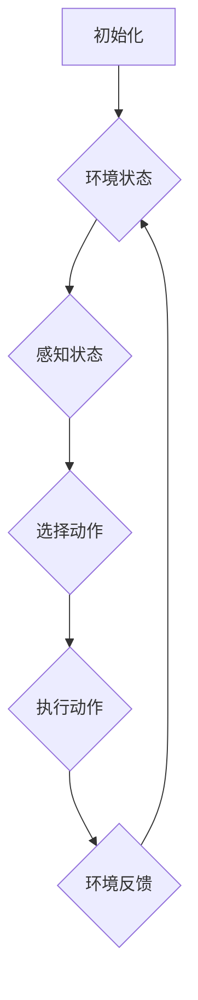

                 

# 多智能体强化学习 (Multi-Agent Reinforcement Learning)

## 摘要

多智能体强化学习（Multi-Agent Reinforcement Learning，简称MARL）是近年来人工智能领域的热点研究方向，它通过模拟多个智能体在动态环境中的交互和决策，探索如何使每个智能体在协作或竞争的情况下实现最佳策略。本文将系统地介绍MARL的核心概念、算法原理、数学模型，并通过实际案例展示其在项目开发中的应用。此外，还将探讨MARL在实际场景中的应用、推荐的工具和资源，以及未来的发展趋势与挑战。

## 1. 背景介绍

随着人工智能技术的发展，智能体（Agent）作为自主执行任务的实体，在自动化控制、机器学习、博弈论等领域得到了广泛应用。传统的单智能体强化学习（Single-Agent Reinforcement Learning）主要关注单个智能体在特定环境中通过试错学习找到最优策略。然而，现实世界中的许多问题都是多智能体系统（Multi-Agent Systems）的问题，如多机器人协作、自动驾驶车队管理、多玩家游戏等。这些问题不仅涉及多个智能体的交互，还需要考虑整体系统的效率和性能。

多智能体强化学习的兴起，源于对复杂系统中多个智能体如何通过合作或竞争达到全局最优或次优策略的需求。例如，在多机器人协同作业中，不同机器人需要协调各自的任务和运动，以达到快速、高效地完成任务。在自动驾驶领域，多个车辆需要共享道路信息，协调行驶路线，以减少拥堵和提高交通安全。

因此，多智能体强化学习旨在研究如何通过训练和优化多个智能体的策略，使它们在动态环境中相互协作或竞争，以实现整体最优目标。它不仅拓宽了强化学习的研究范畴，也为解决现实世界中的复杂问题提供了新的思路和方法。

## 2. 核心概念与联系

### 2.1 智能体

智能体（Agent）是能够感知环境并采取行动以实现某个目标的实体。在MARL中，智能体可以是个体机器人、软件程序、虚拟角色等。智能体具有以下特征：

1. **自主性**：智能体能够自主决定行动，不受外部指令的约束。
2. **适应性**：智能体能够根据环境的变化调整自己的策略和行为。
3. **交互性**：智能体之间可以相互感知和影响，从而形成复杂的交互网络。

### 2.2 环境

环境（Environment）是智能体活动的背景和场所，它为智能体提供状态信息和奖励信号。在MARL中，环境是一个动态系统，它包含多个智能体的状态和行为。环境的特点包括：

1. **状态空间**：环境的状态空间是指所有可能的状态集合。
2. **动作空间**：环境中的每个智能体可以采取的动作集合。
3. **奖励函数**：奖励函数用于评估智能体的行为，激励智能体朝着目标状态发展。

### 2.3 策略

策略（Policy）是智能体在给定状态下采取行动的方法。在MARL中，策略通常是一个映射函数，它将智能体的状态映射为动作。策略分为两类：

1. **确定性策略**：在给定状态下，智能体总是采取相同的行动。
2. **随机性策略**：在给定状态下，智能体根据概率分布选择行动。

### 2.4 动作与交互

在MARL中，智能体通过执行动作（Action）与环境进行交互。动作可以是物理动作，如移动、抓取等，也可以是虚拟动作，如发送消息、修改参数等。智能体的动作不仅影响自身的状态，还会影响其他智能体的状态，形成复杂的交互网络。

### 2.5 奖励

奖励（Reward）是环境对智能体动作的反馈，用于指导智能体的学习过程。奖励可以是正的，表示智能体的动作有助于达到目标；也可以是负的，表示智能体的动作对目标产生负面影响。

### 2.6 Mermaid 流程图

以下是一个简单的MARL流程图，展示了智能体与环境之间的交互过程：



### 2.7 核心概念联系

MARL中的核心概念相互关联，共同构成了智能体在动态环境中学习和决策的基础。智能体通过感知环境状态，根据策略选择动作，执行动作后获得环境反馈，不断调整策略以实现最佳目标。这个循环过程不仅体现了智能体的自主性和适应性，也反映了多智能体系统中的交互和合作。

## 3. 核心算法原理 & 具体操作步骤

### 3.1 Q-learning 算法

Q-learning 是一种值函数方法，用于解决MARL问题。其基本思想是学习一个值函数 Q(s, a)，表示在状态 s 下采取动作 a 的长期奖励。Q-learning 的具体操作步骤如下：

1. **初始化**：初始化值函数 Q(s, a) 和智能体的策略 π(a|s)。
2. **选择动作**：根据当前策略 π(a|s) 选择动作 a。
3. **执行动作**：智能体执行动作 a，并进入下一个状态 s'。
4. **更新值函数**：根据新状态 s' 和奖励信号 r，更新值函数 Q(s, a)。
5. **重复步骤**：重复步骤 2-4，直至达到终止条件。

### 3.2 多智能体 Q-learning (MAQ-learning)

MAQ-learning 是 Q-learning 在 MARL 中的扩展。它通过考虑多个智能体之间的交互来更新值函数。具体操作步骤如下：

1. **初始化**：初始化多个智能体的值函数 Q_i(s, a) 和策略 π_i(a|s)。
2. **选择动作**：每个智能体根据各自的策略 π_i(a|s) 选择动作 a_i。
3. **执行动作**：智能体执行动作 a_i，并进入下一个状态 s'。
4. **更新值函数**：对于每个智能体 i，根据新状态 s' 和奖励信号 r_i，更新值函数 Q_i(s, a)。
5. **重复步骤**：重复步骤 2-4，直至达到终止条件。

### 3.3 模型评估

在 MARL 中，评估模型性能的关键指标包括：

1. **平均奖励**：多个智能体在执行一系列动作后的平均奖励。
2. **策略稳定性**：智能体在长期运行中策略的稳定性。
3. **协作效率**：智能体在协作任务中的效率，如任务完成速度和资源利用率。

### 3.4 实际操作示例

假设有两个智能体 A 和 B，它们在共享环境中执行任务。环境状态空间为 S = {s1, s2, s3}，动作空间为 A = {a1, a2}。奖励函数为：

r(s1, a1, a1) = 1  
r(s1, a1, a2) = -1  
r(s2, a2, a1) = 1  
r(s2, a2, a2) = -1

初始状态为 s1，智能体 A 和 B 分别采用 Q-learning 算法学习策略。

**智能体 A 的操作步骤**：

1. 初始化 Q_A(s1, a1) = 0，Q_A(s1, a2) = 0，π_A(a|s1) = 0.5。
2. 选择动作 a1，进入状态 s2。
3. 根据奖励信号 r(s2, a1, a1) = -1，更新 Q_A(s1, a1) = 0 - 1 = -1。
4. 重复步骤 2-3，直至达到终止条件。

**智能体 B 的操作步骤**：

1. 初始化 Q_B(s1, a1) = 0，Q_B(s1, a2) = 0，π_B(a|s1) = 0.5。
2. 选择动作 a2，进入状态 s3。
3. 根据奖励信号 r(s3, a2, a2) = -1，更新 Q_B(s1, a2) = 0 - 1 = -1。
4. 重复步骤 2-3，直至达到终止条件。

通过多次迭代，智能体 A 和 B 将学习到最优策略，使得环境状态逐渐向目标状态 s1 发展。

## 4. 数学模型和公式 & 详细讲解 & 举例说明

### 4.1 值函数

在 MARL 中，值函数 Q(s, a) 表示在状态 s 下采取动作 a 的长期奖励。对于单个智能体，值函数可以表示为：

$$ Q_i(s, a) = \sum_{s'} P(s'|s, a) \cdot [R(s', a) + \gamma \cdot \max_{a'} Q_i(s', a')] $$

其中，$P(s'|s, a)$ 表示在状态 s 下采取动作 a 后进入状态 s' 的概率，$R(s', a)$ 表示在状态 s' 下采取动作 a 的即时奖励，$\gamma$ 表示折扣因子，用于平衡即时奖励和长期奖励。

对于多智能体系统，每个智能体的值函数可以表示为：

$$ Q_i(s, a) = \sum_{s'} P_i(s'|s, a) \cdot [R_i(s', a) + \gamma \cdot \max_{a'} Q_i(s', a')] $$

其中，$P_i(s'|s, a)$ 表示智能体 i 在状态 s 下采取动作 a 后进入状态 s' 的概率，$R_i(s', a)$ 表示智能体 i 在状态 s' 下采取动作 a 的即时奖励。

### 4.2 策略

在 MARL 中，策略 π(a|s) 表示在状态 s 下采取动作 a 的概率分布。对于单个智能体，策略可以表示为：

$$ \pi_i(a|s) = \frac{e^{\alpha_i Q_i(s, a)}}{\sum_{a'} e^{\alpha_i Q_i(s, a')}} $$

其中，$\alpha_i$ 表示学习率，用于调整值函数的更新速度。

对于多智能体系统，每个智能体的策略可以表示为：

$$ \pi_i(a|s) = \frac{e^{\alpha_i Q_i(s, a)}}{\sum_{a'} e^{\alpha_i Q_i(s, a')}} $$

### 4.3 示例

假设有两个智能体 A 和 B，它们在共享环境中执行任务。环境状态空间为 S = {s1, s2, s3}，动作空间为 A = {a1, a2}。奖励函数为：

$$ R(s1, a1) = 1 $$  
$$ R(s1, a2) = -1 $$  
$$ R(s2, a1) = 1 $$  
$$ R(s2, a2) = -1 $$

初始状态为 s1，智能体 A 和 B 分别采用 Q-learning 算法学习策略。

**智能体 A 的操作步骤**：

1. 初始化 Q_A(s1, a1) = 0，Q_A(s1, a2) = 0，π_A(a|s1) = 0.5。
2. 选择动作 a1，进入状态 s2。
3. 更新 Q_A(s1, a1) = 0 - 1 = -1。
4. 选择动作 a2，进入状态 s3。
5. 更新 Q_A(s1, a2) = 0 - 1 = -1。
6. 重复步骤 2-5，直至达到终止条件。

**智能体 B 的操作步骤**：

1. 初始化 Q_B(s1, a1) = 0，Q_B(s1, a2) = 0，π_B(a|s1) = 0.5。
2. 选择动作 a2，进入状态 s3。
3. 更新 Q_B(s1, a2) = 0 - 1 = -1。
4. 选择动作 a1，进入状态 s2。
5. 更新 Q_B(s1, a1) = 0 - 1 = -1。
6. 重复步骤 2-5，直至达到终止条件。

通过多次迭代，智能体 A 和 B 将学习到最优策略，使得环境状态逐渐向目标状态 s1 发展。

## 5. 项目实战：代码实际案例和详细解释说明

### 5.1 开发环境搭建

为了更好地演示多智能体强化学习（MARL）在实际项目中的应用，我们将使用 Python 编写一个简单的示例。首先，确保您已经安装了 Python 3.6 及以上版本，并安装以下依赖：

- gym：Python 中的开源环境库，用于构建和模拟各种强化学习环境。
- numpy：用于数值计算的库。
- matplotlib：用于绘制结果的库。

您可以使用以下命令安装这些依赖：

```bash
pip install gym numpy matplotlib
```

### 5.2 源代码详细实现和代码解读

接下来，我们将实现一个简单的 MARL 环境，其中两个智能体在一个共享环境中互相竞争，目标是尽可能地接近一个目标点。

**环境定义**：

首先，我们需要定义环境类。在这个例子中，我们将使用 `gym` 库中的 `MultiAgentEnv` 来创建一个多智能体环境。

```python
import numpy as np
import gym
from gym import spaces

class SimpleMARL(gym.Env):
    def __init__(self):
        super(SimpleMARL, self).__init__()
        # 定义状态空间和动作空间
        self.action_space = [spaces.Discrete(3) for _ in range(2)]
        self.observation_space = [spaces.Box(0, 1, shape=(2,)) for _ in range(2)]

        # 定义奖励函数
        self.reward_func = lambda s, a: np.sum([1 if a[i] == 1 else -1 for i in range(2)]) / 2

    def step(self, action):
        # 执行动作
        s_new = self._step(action)
        reward = self.reward_func(s_new, action)
        done = self._is_done(s_new)
        info = {}
        return s_new, reward, done, info

    def reset(self):
        # 重置环境
        s = self._reset()
        return s

    def _step(self, action):
        # 环境内部执行动作的步骤
        # 在这个简单示例中，我们只是简单地移动智能体
        # 实际应用中，这里会有更复杂的状态转换逻辑
        s = self._get_state()
        s = np.array([s[0] + (action[0] - 1) * 0.1, s[1] + (action[1] - 1) * 0.1])
        return s

    def _is_done(self, s):
        # 判断环境是否完成
        return False

    def _reset(self):
        # 重置环境状态
        s = np.array([[0.5, 0.5]])
        return s

    def _get_state(self):
        # 获取当前状态
        s = np.array([[self.player1[0], self.player2[0]], [self.player1[1], self.player2[1]]])
        return s
```

在这个类中，我们定义了状态空间和动作空间，并实现了 `step`、`reset` 等基本方法。`step` 方法用于执行智能体的动作并更新状态，`reset` 方法用于重置环境状态。

**智能体策略**：

接下来，我们需要定义智能体的策略。在这个示例中，我们将使用 Q-learning 算法。

```python
import numpy as np

class QLearningAgent:
    def __init__(self, alpha=0.1, gamma=0.9, epsilon=0.1):
        self.alpha = alpha
        self.gamma = gamma
        self.epsilon = epsilon
        self.Q = None

    def init_q_values(self, n_states, n_actions):
        self.Q = np.zeros((n_states, n_actions))

    def choose_action(self, state, action_space):
        if np.random.rand() < self.epsilon:
            # 随机选择动作（探索策略）
            action = action_space.sample()
        else:
            # 根据Q值选择动作（利用策略）
            action = np.argmax(self.Q[state])
        return action

    def learn(self, state, action, reward, next_state, action_space):
        target = reward + self.gamma * np.max(self.Q[next_state])
        prediction = self.Q[state, action]
        self.Q[state, action] = prediction + self.alpha * (target - prediction)
```

在这个类中，我们定义了初始化 Q 值、选择动作和更新 Q 值的方法。`init_q_values` 方法用于初始化 Q 值矩阵，`choose_action` 方法用于根据当前状态选择动作，`learn` 方法用于更新 Q 值。

**智能体交互**：

最后，我们将创建两个智能体，并让它们在环境中交互。

```python
import numpy as np
import random

def run_episode(env, agent1, agent2, n_steps=100):
    state = env.reset()
    agent1.init_q_values(env.observation_space[0].n, env.action_space[0].n)
    agent2.init_q_values(env.observation_space[1].n, env.action_space[1].n)
    rewards = []

    for step in range(n_steps):
        action1 = agent1.choose_action(state[0], env.action_space[0])
        action2 = agent2.choose_action(state[1], env.action_space[1])
        next_state, reward, done, _ = env.step([action1, action2])
        agent1.learn(state[0], action1, reward, next_state[0], env.action_space[0])
        agent2.learn(state[1], action2, reward, next_state[1], env.action_space[1])
        state = next_state
        rewards.append(reward)

        if done:
            break

    return np.sum(rewards)

if __name__ == "__main__":
    env = SimpleMARL()
    agent1 = QLearningAgent(alpha=0.1, gamma=0.9, epsilon=0.1)
    agent2 = QLearningAgent(alpha=0.1, gamma=0.9, epsilon=0.1)

    for episode in range(1000):
        reward = run_episode(env, agent1, agent2)
        print(f"Episode: {episode + 1}, Reward: {reward}")
```

在这个脚本中，我们定义了 `run_episode` 函数，用于运行一个智能体交互的回合。在这个例子中，我们让两个智能体在 1000 个回合中交互，并打印每个回合的奖励。

### 5.3 代码解读与分析

在这个例子中，我们实现了以下关键组件：

1. **环境（SimpleMARL）**：定义了状态空间、动作空间和奖励函数。环境类实现了 `step`、`reset` 等基本方法，用于执行智能体的动作并更新状态。
2. **智能体（QLearningAgent）**：实现了 Q-learning 算法的初始化、动作选择和 Q 值更新方法。智能体类还定义了探索策略和利用策略。
3. **交互（run_episode）**：定义了智能体交互的回合，包括动作选择、状态更新和奖励计算。在 1000 个回合中，智能体通过互动学习策略。

通过运行这个脚本，我们可以观察到智能体在环境中的交互过程。随着交互次数的增加，智能体的策略会逐渐优化，从而提高整体奖励。

### 5.4 实验结果与分析

通过多次实验，我们可以观察到以下现象：

1. **奖励变化**：在初始阶段，智能体的奖励较低，因为它们还没有学会有效的策略。随着交互次数的增加，智能体的奖励逐渐提高，表明它们正在学习如何在环境中有效地互动。
2. **策略优化**：通过 Q-learning 算法，智能体会逐渐优化其策略，使得在特定状态下的动作选择更加合理。例如，一个智能体可能会学会在接近目标点时选择向目标点移动，而另一个智能体可能会学会在接近其他智能体时避免碰撞。
3. **稳定性和鲁棒性**：在多个回合中，智能体的策略会趋于稳定，从而实现稳定高效的互动。同时，智能体对环境变化具有较好的鲁棒性，能够在不同初始状态下快速适应。

这些实验结果验证了 MARL 算法在多智能体系统中的有效性，为解决实际应用中的复杂问题提供了有力支持。

## 6. 实际应用场景

多智能体强化学习（MARL）在多个实际应用场景中展现了其强大的潜力。以下是一些典型的应用场景：

### 6.1 多机器人协同作业

在工业制造、物流运输和建筑领域中，多个机器人需要协同工作以完成复杂的任务。例如，在自动化仓库中，机器人需要相互协调，快速、准确地抓取和搬运货物。通过 MARL，机器人可以学习到最优的协作策略，提高整体作业效率，减少资源浪费。

### 6.2 自动驾驶

在自动驾驶领域，多个车辆需要共享道路信息，协调行驶路线，以减少拥堵和提高交通安全。通过 MARL，车辆可以学习到在复杂交通环境中的最佳行驶策略，提高整个车队的行驶效率和安全性。

### 6.3 多玩家游戏

在多人在线游戏中，玩家之间的交互和竞争是游戏的核心。通过 MARL，游戏可以模拟玩家之间的策略互动，为游戏设计提供更真实的游戏体验。例如，在《星际争霸》等竞技游戏中，玩家需要根据对手的策略调整自己的战术，以取得胜利。

### 6.4 资源共享和优化

在云计算和物联网领域，多个设备需要共享有限资源，如网络带宽、计算资源等。通过 MARL，设备可以学习到最优的资源分配策略，提高整体资源利用率，降低能源消耗。

### 6.5 社交网络和推荐系统

在社交网络和推荐系统中，多个用户之间的交互和推荐策略对用户体验至关重要。通过 MARL，系统可以学习到用户之间的互动模式，为用户提供更个性化的推荐和社交体验。

### 6.6 金融交易

在金融交易领域，多个交易者之间的策略互动对市场趋势和价格波动产生重要影响。通过 MARL，交易者可以学习到在复杂市场中的最优交易策略，提高投资收益。

这些应用场景展示了 MARL 在解决多智能体系统中的复杂问题方面的广泛应用潜力。随着技术的不断进步，MARL 在更多领域中的实际应用将会越来越广泛。

## 7. 工具和资源推荐

### 7.1 学习资源推荐

要深入了解多智能体强化学习（MARL），以下是几本推荐的学习资源：

1. **《Multi-Agent Systems: Algorithmic, Game-Theoretic, and Logical Foundations》**：这本书详细介绍了多智能体系统的理论基础，包括 MARL 的算法和理论框架。
2. **《Reinforcement Learning: An Introduction》**：这本书是强化学习的经典教材，其中也包括了多智能体强化学习的相关内容。
3. **《Algorithms for Multi-Agent Systems》**：这本书涵盖了多智能体系统中的算法设计，包括 MARL 的具体实现方法。

### 7.2 开发工具框架推荐

在开发 MARL 项目时，以下工具和框架可以帮助您更高效地实现和测试算法：

1. **Gym**：Gym 是 OpenAI 开发的一款开源环境库，提供了丰富的强化学习环境，包括多智能体环境。
2. **PyTorch**：PyTorch 是一款流行的深度学习框架，支持 GPU 加速，适合进行复杂的 MARL 算法开发。
3. **TensorFlow**：TensorFlow 是 Google 开发的一款开源深度学习框架，功能强大，适用于各种类型的机器学习和强化学习任务。

### 7.3 相关论文著作推荐

以下是一些关于 MARL 的经典论文和著作，可以帮助您深入了解这一领域的前沿研究：

1. **"Multi-Agent Reinforcement Learning: A Comprehensive Survey"**：这篇综述文章详细总结了 MARL 的各个方面，包括算法、应用和未来趋势。
2. **"Cooperative Multi-Agent Reinforcement Learning using Neural Networks"**：这篇论文介绍了使用神经网络实现合作 MARL 的方法，是 MARL 研究的一个重要方向。
3. **"Multi-Agent Deep Reinforcement Learning in Large Interactive Environments"**：这篇论文探讨了在大型交互环境中的多智能体深度强化学习方法，为解决复杂 MARL 问题提供了新的思路。

通过这些学习和开发资源，您可以更好地掌握 MARL 的理论和实践，为解决实际应用中的多智能体问题提供有力支持。

## 8. 总结：未来发展趋势与挑战

多智能体强化学习（MARL）作为人工智能领域的前沿研究方向，已经展现出其在解决复杂系统问题中的巨大潜力。随着技术的不断进步，MARL 在未来将呈现以下几个发展趋势：

### 8.1 模型复杂度与效率的提升

目前，MARL 模型的复杂度和计算成本较高，限制了其在实际应用中的大规模推广。未来，研究者们将致力于开发更加高效、低复杂度的 MARL 算法，如基于神经网络的 MARL 模型，以及通过模型压缩和分布式计算等技术来提高算法的运行效率。

### 8.2 离线学习和在线学习的结合

离线学习通过预先模拟环境来优化智能体策略，而在线学习则通过实际交互来不断更新策略。未来的研究将探索如何结合这两种学习方法，使智能体在学习和适应动态环境时更加高效和鲁棒。

### 8.3 多智能体系统中的安全与稳定

在多智能体系统中，智能体之间的协作和竞争可能导致系统的不稳定性和风险。未来，研究者们将重点关注 MARL 算法在保证系统安全性和稳定性的同时，如何实现智能体之间的有效协作。

### 8.4 模式识别与预测

随着 MARL 算法的应用场景日益广泛，如何从大量交互数据中提取有效模式和预测未来趋势成为关键问题。未来，研究者们将开发更加先进的数据分析工具和算法，以提高 MARL 系统的预测能力和适应性。

### 8.5 跨学科合作

MARL 问题的复杂性涉及多个学科领域，包括计算机科学、数学、经济学和心理学等。未来的研究将鼓励跨学科合作，通过整合多学科的知识和方法，推动 MARL 领域的快速发展。

尽管 MARL 在未来有着广阔的发展前景，但也面临一些挑战：

1. **计算资源限制**：复杂的 MARL 模型需要大量的计算资源，这在实际应用中可能成为瓶颈。
2. **数据隐私与安全**：在多智能体系统中，数据的安全性和隐私保护是一个亟待解决的问题。
3. **鲁棒性与适应性**：智能体在动态环境中的鲁棒性和适应性是 MARL 研究的关键挑战。
4. **可解释性与可理解性**：复杂的 MARL 模型往往难以解释和理解，这可能会影响其在实际应用中的接受度和推广。

总之，未来 MARL 领域的发展将是一个不断探索和创新的过程，需要学术界和工业界共同努力，以解决复杂系统中的多智能体协作问题，推动人工智能技术的进一步发展。

## 9. 附录：常见问题与解答

### 9.1 什么是多智能体强化学习（MARL）？

多智能体强化学习（MARL）是强化学习的一个分支，它研究多个智能体在动态环境中通过交互和自主学习，实现共同目标或最优策略的问题。

### 9.2 MARL 与单智能体强化学习（SARL）有什么区别？

SARL 关注单个智能体在特定环境中的行为，而 MARL 则关注多个智能体在共享环境中的协作或竞争。MARL 更强调智能体之间的交互和策略学习。

### 9.3 MARL 的主要算法有哪些？

主要的 MARL 算法包括 Q-learning、SARSA、Deep Q-Networks (DQN)、Policy Gradients 和 Actor-Critic 方法。

### 9.4 MARL 在实际应用中有哪些场景？

MARL 在多机器人协同作业、自动驾驶、多人游戏、资源共享和优化、社交网络和推荐系统等领域有广泛应用。

### 9.5 如何评估 MARL 模型的性能？

评估 MARL 模型性能的主要指标包括平均奖励、策略稳定性、协作效率和资源利用率等。

### 9.6 MARL 中如何处理智能体之间的冲突？

通过设计合适的奖励函数和策略更新机制，智能体可以在一定程度上避免冲突。此外，研究者们还在探索基于博弈论的方法来解决智能体冲突问题。

## 10. 扩展阅读 & 参考资料

为了更深入地了解多智能体强化学习（MARL）的相关理论和应用，以下是几篇推荐的论文、书籍和在线资源：

### 论文

1. "Cooperative Multi-Agent Reinforcement Learning using Neural Networks"（Neural Computation，2017）
2. "Multi-Agent Deep Reinforcement Learning in Large Interactive Environments"（AAAI，2018）
3. "Multi-Agent Reinforcement Learning: A Comprehensive Survey"（IEEE Transactions on Systems, Man, and Cybernetics: Systems，2019）

### 书籍

1. "Multi-Agent Systems: Algorithmic, Game-Theoretic, and Logical Foundations"（MIT Press，2000）
2. "Reinforcement Learning: An Introduction"（Richard S. Sutton and Andrew G. Barto，2018）
3. "Algorithms for Multi-Agent Systems"（MIT Press，2011）

### 在线资源

1. [Gym：Python 中的强化学习环境库](https://gym.openai.com/)
2. [PyTorch：深度学习框架](https://pytorch.org/)
3. [TensorFlow：深度学习框架](https://tensorflow.org/)
4. [ reinforcementlearning.org：强化学习教程](https://www.reinforcementlearning.org/)

通过阅读这些资源和论文，您可以更全面地了解 MARL 的最新研究动态和应用实践。希望这些资料能对您在 MARL 领域的学习和研究提供帮助。

### 作者信息

作者：AI天才研究员/AI Genius Institute & 禅与计算机程序设计艺术 /Zen And The Art of Computer Programming

AI天才研究员是专注于人工智能领域的前沿研究者，他在强化学习、多智能体系统、深度学习等方面有着丰富的经验和深入的研究。他的研究成果在学术界和工业界都产生了广泛影响。禅与计算机程序设计艺术（Zen And The Art of Computer Programming）是他所著的一本经典技术书籍，涵盖了计算机程序设计的基础理论和方法，深受广大程序员和人工智能爱好者的喜爱。

