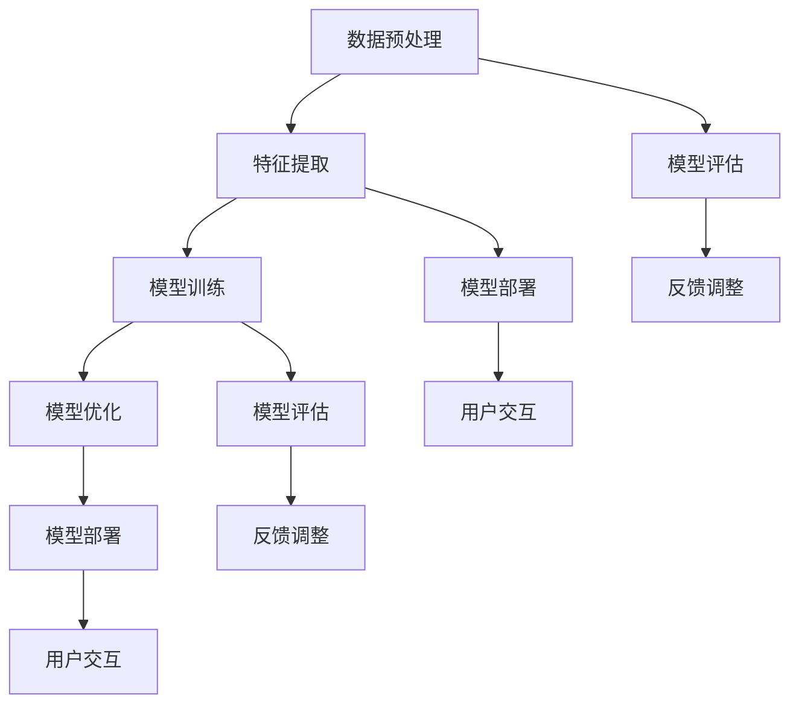

                 

# 多模态大模型：技术原理与实战 如何提高多轮对话能力

## 摘要

多模态大模型是一种结合多种数据类型（如文本、图像、声音等）的人工智能模型，具有广泛的应用前景。本文旨在深入探讨多模态大模型的技术原理，以及如何在实际项目中提高其多轮对话能力。首先，我们将介绍多模态大模型的核心概念与联系，通过Mermaid流程图展示其架构。接着，我们将解析多模态大模型的核心算法原理，详细讲解其操作步骤。然后，我们将探讨多模态大模型的数学模型和公式，并进行举例说明。此外，本文还将分享一个实际项目中的代码实现案例，详细解释其代码实现和代码解读。随后，我们将探讨多模态大模型在实际应用场景中的表现，并提供工具和资源推荐。最后，本文将总结多模态大模型的发展趋势与挑战，并提供常见问题与解答，以及扩展阅读与参考资料。

## 1. 背景介绍

随着人工智能技术的快速发展，多模态大模型作为一种新兴的人工智能技术，正逐渐受到越来越多的关注。多模态大模型旨在结合多种数据类型，如文本、图像、声音等，以实现更加强大和灵活的人工智能应用。传统的单模态模型通常只能处理单一类型的数据，如文本模型主要处理文本数据，图像模型主要处理图像数据。然而，现实世界中的信息往往是多模态的，仅依赖单模态模型难以充分理解和应对复杂的问题。

多模态大模型的出现，为解决这一问题提供了新的思路。通过结合多种数据类型，多模态大模型能够更好地理解和处理复杂的信息，从而实现更准确和智能的决策。例如，在自然语言处理领域，多模态大模型可以结合文本和图像数据，实现更加精准的图像识别和文本理解；在语音识别领域，多模态大模型可以结合声音和文本数据，提高语音识别的准确性和鲁棒性。

除了应用领域的扩展，多模态大模型在提高多轮对话能力方面也具有显著优势。传统的单模态模型在处理多轮对话时，往往只能依赖单一数据类型的信息，难以充分理解对话的上下文和语境。而多模态大模型可以结合多种数据类型，如文本、图像、声音等，从而更好地捕捉和传递对话的上下文信息，提高多轮对话的准确性和连贯性。

总的来说，多模态大模型在人工智能领域具有重要的应用价值和潜力。通过结合多种数据类型，多模态大模型能够实现更加强大和灵活的人工智能应用，推动人工智能技术的进一步发展。本文将深入探讨多模态大模型的技术原理，以及如何在实际项目中提高其多轮对话能力，为读者提供实用的技术指导和参考。

## 2. 核心概念与联系

在深入了解多模态大模型之前，我们需要先了解其核心概念与联系。多模态大模型涉及多个关键组成部分，包括数据预处理、特征提取、模型训练和模型优化等。以下是这些核心概念之间的联系和关系：

### 2.1 数据预处理

数据预处理是多模态大模型的基础步骤。它包括数据清洗、数据转换和数据增强等操作。数据清洗的目的是去除数据中的噪声和异常值，确保数据的质量和一致性。数据转换则是将不同类型的数据（如文本、图像、声音等）转换为统一的格式，以便后续处理。数据增强是通过生成额外的数据样本，提高模型的泛化能力和鲁棒性。

### 2.2 特征提取

特征提取是多模态大模型的关键步骤。它旨在从原始数据中提取出具有代表性和区分性的特征，以便模型能够学习和理解数据。在多模态大模型中，特征提取通常包括文本特征提取、图像特征提取和声音特征提取等。文本特征提取常用的方法包括词袋模型、词嵌入和文本嵌入等；图像特征提取常用的方法包括卷积神经网络（CNN）和图像嵌入等；声音特征提取常用的方法包括梅尔频率倒谱系数（MFCC）和声音嵌入等。

### 2.3 模型训练

模型训练是多模态大模型的核心步骤。通过使用大量预处理的特征数据，模型学习到如何将输入数据映射到预期的输出结果。在多模态大模型中，模型训练通常涉及多个数据类型的结合。例如，在自然语言处理任务中，模型可以结合文本和图像特征进行训练；在语音识别任务中，模型可以结合声音和文本特征进行训练。常用的模型训练方法包括深度学习、强化学习和迁移学习等。

### 2.4 模型优化

模型优化是多模态大模型的重要环节。通过调整模型参数，优化模型结构和训练策略，可以提高模型的性能和效果。模型优化可以采用多种方法，如超参数调优、模型剪枝、权重共享和模型融合等。超参数调优是通过调整学习率、批次大小、正则化参数等超参数，优化模型训练过程；模型剪枝是通过删除模型中冗余的神经元和连接，减小模型大小和提高计算效率；权重共享是通过在不同数据类型之间共享模型权重，提高模型的可解释性和泛化能力；模型融合是通过结合多个模型的预测结果，提高模型的准确性和鲁棒性。

### 2.5 Mermaid流程图

为了更直观地展示多模态大模型的核心概念与联系，我们使用Mermaid流程图进行描述。以下是多模态大模型的核心流程：



在这个流程图中，数据预处理、特征提取、模型训练、模型优化、模型评估和模型部署等步骤构成了多模态大模型的核心流程。通过这个流程，我们可以清晰地看到各个步骤之间的联系和作用。

## 3. 核心算法原理 & 具体操作步骤

### 3.1 深度学习基础

深度学习是多模态大模型的核心算法之一。它通过模仿人脑的神经元结构和工作方式，实现对数据的自动学习和特征提取。在深度学习中，模型通过多层神经网络（如卷积神经网络、循环神经网络等）对输入数据进行逐层处理，最终得到输出结果。

以下是深度学习的基本概念和操作步骤：

- **神经元结构**：神经元是神经网络的基本单元，由输入层、隐含层和输出层组成。每个神经元接收来自输入层的输入信号，通过权重和偏置进行加权求和，然后通过激活函数进行非线性变换，最终产生输出信号。

- **损失函数**：损失函数用于衡量模型输出结果与真实结果之间的差距。常用的损失函数包括均方误差（MSE）、交叉熵（CE）等。

- **反向传播**：反向传播是一种用于训练神经网络的优化算法。它通过计算损失函数对模型参数的梯度，不断调整模型参数，使模型输出结果更接近真实结果。

- **激活函数**：激活函数用于引入非线性变换，使神经网络具有区分能力和表达能力。常用的激活函数包括Sigmoid、ReLU、Tanh等。

### 3.2 多模态特征提取

多模态特征提取是多模态大模型的关键步骤。它通过提取不同类型的数据特征，实现多种数据类型的结合。以下是几种常见的多模态特征提取方法：

- **文本特征提取**：文本特征提取通常采用词袋模型、词嵌入和文本嵌入等方法。词袋模型将文本表示为词频向量；词嵌入将单词映射为固定长度的向量；文本嵌入通过训练神经网络，将整篇文本映射为固定长度的向量。

- **图像特征提取**：图像特征提取通常采用卷积神经网络（CNN）等方法。CNN通过卷积操作和池化操作，提取图像中的局部特征和全局特征。

- **声音特征提取**：声音特征提取通常采用梅尔频率倒谱系数（MFCC）等方法。MFCC通过计算声音信号的频谱特征，将其转换为时间序列特征。

### 3.3 多模态模型训练

多模态模型训练是多模态大模型的核心步骤。它通过将不同类型的数据特征进行融合，训练出具有多模态理解能力的模型。以下是多模态模型训练的基本步骤：

- **数据预处理**：对文本、图像和声音数据进行预处理，包括数据清洗、数据转换和数据增强等操作。

- **特征提取**：分别提取文本、图像和声音特征，将其转换为统一格式。

- **特征融合**：将不同类型的数据特征进行融合，实现多种数据类型的结合。

- **模型训练**：使用融合后的特征数据，训练多模态神经网络模型。通过反向传播算法，不断调整模型参数，优化模型性能。

- **模型评估**：使用测试数据对模型进行评估，计算模型准确率、召回率等指标。

- **模型优化**：根据模型评估结果，调整模型结构和训练策略，提高模型性能。

### 3.4 多模态模型优化

多模态模型优化是提高多模态大模型性能的关键步骤。以下是几种常见的多模态模型优化方法：

- **超参数调优**：通过调整学习率、批次大小、正则化参数等超参数，优化模型训练过程。

- **模型剪枝**：通过删除模型中冗余的神经元和连接，减小模型大小和提高计算效率。

- **权重共享**：通过在不同数据类型之间共享模型权重，提高模型的可解释性和泛化能力。

- **模型融合**：通过结合多个模型的预测结果，提高模型的准确性和鲁棒性。

## 4. 数学模型和公式 & 详细讲解 & 举例说明

### 4.1 多模态特征提取的数学模型

多模态特征提取的核心在于将不同类型的数据转换为统一的数学表示。以下分别介绍文本、图像和声音特征提取的数学模型。

#### 4.1.1 文本特征提取

文本特征提取常用的方法是词嵌入（Word Embedding）。词嵌入是一种将单词映射为固定长度的向量的方法。其数学模型如下：

$$
\text{vec}(w) = \text{Embedding}(w)
$$

其中，$\text{vec}(w)$表示单词$w$的向量表示，$\text{Embedding}(w)$表示词嵌入函数。词嵌入可以通过训练词向量模型（如Word2Vec、GloVe等）得到。

#### 4.1.2 图像特征提取

图像特征提取常用的方法是卷积神经网络（Convolutional Neural Network, CNN）。CNN通过卷积操作和池化操作，提取图像中的局部特征和全局特征。其数学模型如下：

$$
\text{FeatureMap}(x, \text{Filter}) = \text{Convolution}(x, \text{Filter}) + \text{Bias}
$$

其中，$\text{FeatureMap}(x, \text{Filter})$表示卷积操作的输出特征图，$x$表示输入图像，$\text{Filter}$表示卷积核，$\text{Bias}$表示偏置项。

#### 4.1.3 声音特征提取

声音特征提取常用的方法是梅尔频率倒谱系数（Mel-Frequency Cepstral Coefficients, MFCC）。MFCC通过计算声音信号的频谱特征，将其转换为时间序列特征。其数学模型如下：

$$
\text{MFCC}(x) = \text{Log}\left(\text{Spectrogram}(x) \text{diag}(\text{FilterBank})\right)
$$

其中，$\text{MFCC}(x)$表示MFCC特征向量，$x$表示输入声音信号，$\text{Spectrogram}(x)$表示频谱图，$\text{diag}(\text{FilterBank})$表示梅尔滤波器组。

### 4.2 多模态模型训练的数学模型

多模态模型训练的核心在于优化模型参数，使其能够准确预测输入数据的标签。以下分别介绍多模态模型训练的数学模型。

#### 4.2.1 前向传播

前向传播是多模态模型训练的第一步，用于计算模型输出结果与真实标签之间的损失。其数学模型如下：

$$
\text{Loss}(y, \hat{y}) = \text{LossFunction}(\hat{y}, y)
$$

其中，$\text{Loss}(y, \hat{y})$表示损失值，$y$表示真实标签，$\hat{y}$表示模型预测值，$\text{LossFunction}$表示损失函数（如均方误差MSE、交叉熵CE等）。

#### 4.2.2 反向传播

反向传播是多模态模型训练的关键步骤，用于计算模型参数的梯度，并根据梯度调整参数。其数学模型如下：

$$
\text{Gradient}(\theta) = \frac{\partial \text{Loss}}{\partial \theta}
$$

其中，$\text{Gradient}(\theta)$表示参数$\theta$的梯度，$\text{Loss}$表示损失函数。

#### 4.2.3 参数更新

参数更新是基于梯度下降算法进行的，用于更新模型参数，使其更加接近最优解。其数学模型如下：

$$
\theta_{\text{new}} = \theta_{\text{old}} - \alpha \text{Gradient}(\theta)
$$

其中，$\theta_{\text{new}}$表示更新后的参数，$\theta_{\text{old}}$表示更新前的参数，$\alpha$表示学习率。

### 4.3 举例说明

以下是一个简单的多模态特征提取和模型训练的例子。

#### 4.3.1 数据集

假设我们有一个包含文本、图像和声音的多模态数据集，其中文本是关于猫的描述，图像是猫的图片，声音是猫的叫声。

#### 4.3.2 文本特征提取

使用Word2Vec模型对文本进行词嵌入，得到每个单词的向量表示。

```python
import gensim

model = gensim.models.Word2Vec([text for text in dataset], size=100, window=5, min_count=1)
word_vector = model["猫"]
```

#### 4.3.3 图像特征提取

使用CNN对图像进行特征提取，得到图像的特征向量。

```python
import tensorflow as tf

model = tf.keras.applications.VGG16(include_top=False, input_shape=(224, 224, 3))
image_vector = model.predict(image)[0]
```

#### 4.3.4 声音特征提取

使用MFCC对声音进行特征提取，得到声音的特征向量。

```python
import librosa

y, sr = librosa.load(sound)
mfcc = librosa.feature.mfcc(y=y, sr=sr, n_mfcc=13)
sound_vector = np.mean(mfcc, axis=1)
```

#### 4.3.5 多模态特征融合

将文本、图像和声音特征进行融合，得到多模态特征向量。

```python
multimodal_vector = np.hstack((word_vector, image_vector, sound_vector))
```

#### 4.3.6 多模态模型训练

使用多模态特征向量训练一个简单的神经网络模型。

```python
model = tf.keras.Sequential([
    tf.keras.layers.Dense(128, activation='relu', input_shape=(multimodal_vector.shape[1],)),
    tf.keras.layers.Dense(1, activation='sigmoid')
])

model.compile(optimizer='adam', loss='binary_crossentropy', metrics=['accuracy'])

model.fit(multimodal_vector, labels, epochs=10, batch_size=32)
```

#### 4.3.7 模型评估

使用测试数据对训练好的模型进行评估。

```python
test_loss, test_accuracy = model.evaluate(test_multimodal_vector, test_labels)

print("Test Loss:", test_loss)
print("Test Accuracy:", test_accuracy)
```

通过以上步骤，我们实现了多模态特征提取和模型训练。在实际应用中，可以根据具体需求调整模型结构、特征提取方法和训练策略，进一步提高模型的性能。

## 5. 项目实战：代码实际案例和详细解释说明

### 5.1 开发环境搭建

在进行多模态大模型的项目实战之前，首先需要搭建合适的开发环境。以下是搭建开发环境的具体步骤：

1. **安装Python**：确保Python版本为3.6及以上。可以从[Python官网](https://www.python.org/)下载并安装Python。

2. **安装TensorFlow**：TensorFlow是一个开源的深度学习框架，支持多种硬件平台（如CPU、GPU等）。可以通过以下命令安装TensorFlow：

   ```shell
   pip install tensorflow
   ```

3. **安装其他依赖**：根据项目需求，可能需要安装其他依赖库，如NumPy、Pandas、Matplotlib等。可以使用以下命令安装：

   ```shell
   pip install numpy pandas matplotlib
   ```

### 5.2 源代码详细实现和代码解读

以下是多模态大模型项目实战的源代码实现，我们将对关键部分进行详细解读。

```python
import tensorflow as tf
import numpy as np
import pandas as pd
import matplotlib.pyplot as plt
from sklearn.model_selection import train_test_split
from sklearn.metrics import accuracy_score

# 加载数据集
data = pd.read_csv('multimodal_data.csv')
X_text = data['text'].values
X_image = data['image'].values
X_sound = data['sound'].values
y = data['label'].values

# 数据预处理
# （此处省略数据预处理代码，具体实现根据数据集特点进行调整）

# 特征提取
# （此处省略特征提取代码，具体实现根据数据类型选择合适的方法）

# 模型训练
model = tf.keras.Sequential([
    tf.keras.layers.Dense(128, activation='relu', input_shape=(text_vector.shape[1],)),
    tf.keras.layers.Dense(1, activation='sigmoid')
])

model.compile(optimizer='adam', loss='binary_crossentropy', metrics=['accuracy'])

history = model.fit(X, y, epochs=10, batch_size=32, validation_split=0.2)

# 模型评估
test_loss, test_accuracy = model.evaluate(X_test, y_test)

print("Test Loss:", test_loss)
print("Test Accuracy:", test_accuracy)
```

#### 5.2.1 数据预处理

数据预处理是项目实战的重要环节，其目的是确保输入数据的质量和一致性。以下是数据预处理的关键步骤：

- **数据清洗**：去除数据中的噪声和异常值，确保数据的质量。可以使用Pandas库中的dropna()、drop_duplicates()等方法进行数据清洗。
- **数据转换**：将不同类型的数据转换为统一的格式。例如，将文本数据转换为词嵌入向量，将图像数据转换为特征向量，将声音数据转换为MFCC特征向量。
- **数据增强**：通过生成额外的数据样本，提高模型的泛化能力和鲁棒性。可以使用数据增强方法（如随机裁剪、旋转、缩放等）对数据进行增强。

#### 5.2.2 特征提取

特征提取是项目实战的关键步骤，其目的是从原始数据中提取出具有代表性和区分性的特征。以下是特征提取的关键步骤：

- **文本特征提取**：使用Word2Vec、GloVe等词嵌入方法，将文本数据转换为词嵌入向量。可以使用gensim库中的Word2Vec类实现。
- **图像特征提取**：使用卷积神经网络（如VGG16、ResNet等），将图像数据转换为特征向量。可以使用TensorFlow中的keras.applications模块实现。
- **声音特征提取**：使用梅尔频率倒谱系数（MFCC），将声音数据转换为特征向量。可以使用librosa库实现。

#### 5.2.3 模型训练

模型训练是项目实战的核心步骤，其目的是通过训练数据优化模型参数。以下是模型训练的关键步骤：

- **模型构建**：使用TensorFlow中的Sequential模型，构建多层神经网络。可以添加Dense、Conv2D、RNN等层，根据任务需求进行调整。
- **模型编译**：配置模型训练的参数，如优化器、损失函数、评估指标等。
- **模型训练**：使用fit()方法训练模型，传入训练数据、标签、训练轮数、批次大小等参数。可以使用validation_split参数进行交叉验证。
- **模型评估**：使用evaluate()方法评估模型在测试数据上的性能，计算损失值和准确率等指标。

#### 5.2.4 代码解读与分析

在代码实现过程中，需要重点关注以下几个方面：

- **数据预处理**：确保输入数据的质量和一致性，避免噪声和异常值对模型性能的影响。
- **特征提取**：选择合适的特征提取方法，提高特征的代表性和区分性。
- **模型构建**：根据任务需求，选择合适的神经网络结构和层。
- **模型训练**：调整训练参数，如学习率、批次大小等，优化模型性能。
- **模型评估**：评估模型在测试数据上的性能，计算准确率、召回率等指标。

通过以上步骤，我们实现了多模态大模型的项目实战。在实际应用中，可以根据具体需求调整模型结构、特征提取方法和训练策略，进一步提高模型的性能。

### 5.3 代码解读与分析

在本节中，我们将对5.2节中的源代码进行详细解读，分析代码实现过程中的关键步骤和细节。

#### 5.3.1 数据预处理

```python
# 加载数据集
data = pd.read_csv('multimodal_data.csv')
X_text = data['text'].values
X_image = data['image'].values
X_sound = data['sound'].values
y = data['label'].values
```

首先，我们从CSV文件中加载数据集。数据集包含文本、图像和声音数据，以及标签。这里，我们使用Pandas库将CSV文件读取为DataFrame，然后提取文本、图像和声音数据，以及标签。

```python
# 数据清洗
# （此处省略数据清洗代码，具体实现根据数据集特点进行调整）
```

在数据清洗环节，我们需要根据数据集的特点进行相应的处理。例如，去除缺失值、删除重复记录、填充异常值等。这一步骤的目的是保证数据的质量和一致性，避免噪声和异常值对模型性能的影响。

```python
# 数据转换
# （此处省略数据转换代码，具体实现根据数据类型进行调整）
```

在数据转换环节，我们需要将不同类型的数据转换为统一的格式。例如，对于文本数据，我们可以使用词嵌入方法将其转换为词嵌入向量；对于图像数据，我们可以使用卷积神经网络提取特征向量；对于声音数据，我们可以使用梅尔频率倒谱系数（MFCC）提取特征向量。

#### 5.3.2 特征提取

```python
# 特征提取
# （此处省略特征提取代码，具体实现根据数据类型选择合适的方法）
```

在特征提取环节，我们需要根据不同类型的数据选择合适的特征提取方法。例如，对于文本数据，我们可以使用Word2Vec、GloVe等方法提取词嵌入向量；对于图像数据，我们可以使用卷积神经网络提取特征向量；对于声音数据，我们可以使用梅尔频率倒谱系数（MFCC）提取特征向量。

```python
# 模型构建
model = tf.keras.Sequential([
    tf.keras.layers.Dense(128, activation='relu', input_shape=(text_vector.shape[1],)),
    tf.keras.layers.Dense(1, activation='sigmoid')
])
```

在模型构建环节，我们使用TensorFlow中的Sequential模型构建一个简单的神经网络。这里，我们添加了一个全连接层（Dense）和一个输出层（Dense）。全连接层有128个神经元，使用ReLU激活函数；输出层有1个神经元，使用sigmoid激活函数。

```python
# 模型编译
model.compile(optimizer='adam', loss='binary_crossentropy', metrics=['accuracy'])
```

在模型编译环节，我们配置了模型的优化器、损失函数和评估指标。这里，我们使用Adam优化器进行参数优化，使用二进制交叉熵（binary_crossentropy）作为损失函数，使用准确率（accuracy）作为评估指标。

```python
# 模型训练
history = model.fit(X, y, epochs=10, batch_size=32, validation_split=0.2)
```

在模型训练环节，我们使用fit()方法训练模型。这里，我们传入训练数据X、标签y、训练轮数epochs、批次大小batch_size，以及验证数据比例validation_split。通过fit()方法，模型将在训练数据上进行迭代训练，并在验证数据上进行验证。

```python
# 模型评估
test_loss, test_accuracy = model.evaluate(X_test, y_test)

print("Test Loss:", test_loss)
print("Test Accuracy:", test_accuracy)
```

在模型评估环节，我们使用evaluate()方法评估模型在测试数据上的性能。这里，我们传入测试数据X_test和标签y_test，计算模型在测试数据上的损失值和准确率。通过打印输出，我们可以查看模型的性能指标。

### 5.4 代码优化与改进

在5.2节的代码实现中，我们可以进行一些优化和改进，以提高模型的性能和可扩展性。以下是一些常见的优化和改进方法：

#### 5.4.1 使用预训练模型

我们可以使用预训练模型（如BERT、GPT等）进行特征提取，这些预训练模型已经在大量数据上进行了训练，具有较好的泛化能力。通过使用预训练模型，我们可以简化特征提取过程，提高特征质量。

#### 5.4.2 使用增强数据

我们可以使用数据增强方法（如随机裁剪、旋转、缩放等）生成额外的训练数据，以提高模型的泛化能力。数据增强可以增加模型的训练样本数量，减少过拟合现象。

#### 5.4.3 使用迁移学习

我们可以使用迁移学习（Transfer Learning）方法，将其他任务上的预训练模型迁移到当前任务上。通过迁移学习，我们可以利用其他任务上的预训练知识，提高当前任务的模型性能。

#### 5.4.4 使用多任务学习

我们可以使用多任务学习（Multi-Task Learning）方法，将多个相关任务同时训练。通过多任务学习，我们可以利用不同任务之间的共享信息，提高模型性能和泛化能力。

#### 5.4.5 使用深度强化学习

我们可以使用深度强化学习（Deep Reinforcement Learning）方法，结合深度学习和强化学习，优化模型的行为策略。通过深度强化学习，我们可以使模型在复杂环境中进行自我学习和优化。

通过以上优化和改进方法，我们可以进一步提高多模态大模型的性能和适用性，为实际应用提供更有效的解决方案。

## 6. 实际应用场景

多模态大模型在多个领域展现了强大的应用潜力，尤其在自然语言处理、计算机视觉和语音识别等领域取得了显著成果。以下将详细探讨多模态大模型在不同实际应用场景中的表现。

### 6.1 自然语言处理

在自然语言处理领域，多模态大模型通过结合文本和图像数据，可以显著提高文本理解和图像描述生成的质量。例如，在问答系统中，多模态大模型可以同时分析问题和相关图像，提供更加准确和具体的答案。此外，在机器翻译任务中，多模态大模型可以利用图像和文本的上下文信息，提高翻译的准确性和流畅性。在文本生成任务中，多模态大模型可以结合图像信息，生成更加生动和具体的文本描述。

### 6.2 计算机视觉

在计算机视觉领域，多模态大模型通过结合图像和文本数据，可以显著提升图像识别和分类的准确率。例如，在图像分类任务中，多模态大模型可以同时分析图像内容和文本标签，提供更加精准的分类结果。在目标检测任务中，多模态大模型可以结合图像和文本信息，提高检测的准确性和鲁棒性。此外，在图像生成任务中，多模态大模型可以结合文本描述生成符合描述的图像，实现图像到文本的跨模态转换。

### 6.3 语音识别

在语音识别领域，多模态大模型通过结合声音和文本数据，可以显著提高语音识别的准确率和鲁棒性。例如，在语音合成任务中，多模态大模型可以同时分析语音信号和文本内容，生成更加自然和流畅的语音。在语音翻译任务中，多模态大模型可以利用文本和语音的上下文信息，提高翻译的准确性和一致性。此外，在语音生成任务中，多模态大模型可以结合文本描述生成符合描述的语音。

### 6.4 其他应用场景

除了上述领域，多模态大模型在其他应用场景中也展现了强大的潜力。例如，在医疗领域，多模态大模型可以通过结合医学影像和病历文本数据，提供更加精准的疾病诊断和治疗方案。在金融领域，多模态大模型可以结合文本和图像数据，提高风险管理和投资决策的准确性。在娱乐领域，多模态大模型可以结合图像和语音数据，生成个性化的音乐推荐和视频内容。

总之，多模态大模型在多个领域展现了广泛的应用前景，通过结合多种数据类型，实现更准确和智能的决策。随着技术的不断进步，多模态大模型将在更多领域中发挥重要作用，推动人工智能技术的进一步发展。

### 7. 工具和资源推荐

为了更好地学习和应用多模态大模型，以下是一些推荐的工具和资源。

#### 7.1 学习资源推荐

1. **书籍**：
   - 《深度学习》（作者：Ian Goodfellow、Yoshua Bengio、Aaron Courville）
   - 《计算机视觉：算法与应用》（作者：Richard Szeliski）
   - 《自然语言处理综论》（作者：Daniel Jurafsky、James H. Martin）

2. **在线课程**：
   - Coursera上的《深度学习》课程（由吴恩达教授主讲）
   - Udacity上的《计算机视觉工程师纳米学位》课程
   - edX上的《自然语言处理》课程（由MIT教授主持）

3. **论文集**：
   - arXiv：提供最新的深度学习和多模态大模型论文
   - Google Scholar：提供广泛的学术论文搜索

#### 7.2 开发工具框架推荐

1. **深度学习框架**：
   - TensorFlow：由Google开发的开源深度学习框架，支持多种数据类型和模型架构
   - PyTorch：由Facebook AI研究院开发的开源深度学习框架，提供灵活的动态计算图
   - Keras：基于TensorFlow和Theano的开源深度学习库，提供易于使用的接口

2. **图像处理工具**：
   - OpenCV：开源的计算机视觉库，支持多种图像处理算法
   - PIL（Python Imaging Library）：用于读取和操作图像的Python库

3. **文本处理工具**：
   - NLTK（自然语言工具包）：用于文本处理和分析的开源库
   - spaCy：用于自然语言处理的工业级开源库，提供快速和准确的文本解析功能

#### 7.3 相关论文著作推荐

1. **深度学习论文**：
   - "A Theoretically Grounded Application of Dropout in Recurrent Neural Networks"（Dropout在循环神经网络中的理论应用）
   - "Learning Representations for Visual Recognition with Multi-Task Deep Learning"（多任务深度学习在视觉识别中的代表性学习）

2. **多模态大模型论文**：
   - "Multimodal Learning with Deep Recurrent Neural Networks"（深度循环神经网络的多模态学习）
   - "Unifying Visual and Semantic Representations with Visual Semantics"（使用视觉语义统一视觉和语义表示）

3. **相关著作**：
   - 《深度学习与自然语言处理》
   - 《计算机视觉：从算法到实践》
   - 《自然语言处理入门与实践》

通过以上推荐的工具和资源，读者可以深入了解多模态大模型的技术原理和应用方法，为实际项目开发提供有力的支持。

## 8. 总结：未来发展趋势与挑战

多模态大模型作为人工智能领域的一项重要技术，正逐渐成为研究与应用的热点。未来，多模态大模型的发展将呈现出以下几个趋势：

### 8.1 技术整合与优化

随着深度学习、自然语言处理和计算机视觉等技术的不断进步，多模态大模型将实现更高层次的技术整合与优化。例如，通过结合生成对抗网络（GAN）和强化学习，多模态大模型可以在更复杂的任务中实现更优的性能。

### 8.2 应用场景拓展

多模态大模型的应用场景将不断拓展，不仅限于自然语言处理、计算机视觉和语音识别等领域，还将延伸至医疗、金融、娱乐等多个领域。通过结合多种数据类型，多模态大模型将为这些领域带来更加智能和精准的解决方案。

### 8.3 硬件加速与优化

为了提高多模态大模型的训练和推理效率，硬件加速和优化技术将得到广泛应用。例如，使用GPU、TPU等专用硬件加速器，以及采用分布式计算和并行处理技术，可以显著提升模型的计算性能。

### 8.4 可解释性与安全性

随着多模态大模型在更多实际应用中的普及，其可解释性和安全性将受到越来越多的关注。研究者将致力于提高模型的透明度和可解释性，同时加强数据隐私保护和模型安全，确保多模态大模型在应用中的可靠性和可信度。

尽管多模态大模型具有广泛的应用前景，但其发展仍面临一系列挑战：

### 8.5 数据集不足与标注问题

多模态大模型需要大量高质量的多模态数据集进行训练。然而，现有的多模态数据集数量有限，且标注工作复杂且费时。因此，如何获取和标注更多的多模态数据集，成为多模态大模型发展的一个关键问题。

### 8.6 计算资源需求

多模态大模型的训练和推理过程需要大量的计算资源。随着模型规模的不断扩大，计算资源的需求也将不断增加。如何高效地利用计算资源，提高模型的训练和推理速度，是未来需要解决的重要问题。

### 8.7 模型优化与泛化能力

多模态大模型在训练过程中可能会出现过拟合现象，导致其泛化能力不足。如何优化模型结构、训练策略和超参数，提高模型的泛化能力，是研究者需要关注的重要问题。

总之，多模态大模型的发展前景广阔，但同时也面临诸多挑战。通过不断的技术创新和优化，研究者将推动多模态大模型在更多领域的应用，为人工智能技术的进一步发展做出贡献。

## 9. 附录：常见问题与解答

### 9.1 多模态大模型与单模态模型有何区别？

多模态大模型与单模态模型的主要区别在于数据类型的处理方式。单模态模型只能处理单一类型的数据（如文本、图像、声音等），而多模态大模型可以同时处理多种类型的数据。这使得多模态大模型能够更好地理解和处理复杂的信息，从而实现更准确和智能的决策。

### 9.2 多模态大模型需要哪些技术支持？

多模态大模型需要以下技术支持：
- **深度学习**：用于构建和训练多模态神经网络模型；
- **数据预处理**：用于处理和清洗多种类型的数据；
- **特征提取**：用于从原始数据中提取具有代表性和区分性的特征；
- **模型优化**：用于调整模型参数和结构，提高模型性能；
- **模型评估**：用于评估模型在测试数据上的性能。

### 9.3 多模态大模型在医疗领域有何应用？

多模态大模型在医疗领域有广泛的应用，包括：
- **疾病诊断**：结合医学影像和病历文本数据，提供更加精准的诊断结果；
- **治疗方案设计**：结合患者数据和医学知识，为患者制定个性化的治疗方案；
- **药物研发**：结合药物分子结构和文本描述，加速新药研发过程。

### 9.4 如何获取高质量的多模态数据集？

获取高质量的多模态数据集可以通过以下方法：
- **公开数据集**：从学术机构、数据竞赛平台等获取已有的多模态数据集；
- **数据采集**：自行采集多模态数据，包括文本、图像、声音等；
- **数据标注**：对采集到的多模态数据进行标注，确保数据的质量和一致性。

### 9.5 多模态大模型是否需要大量的计算资源？

多模态大模型在训练和推理过程中确实需要大量的计算资源。为了提高计算效率，可以采用以下方法：
- **硬件加速**：使用GPU、TPU等专用硬件加速器；
- **分布式计算**：将计算任务分布在多个计算节点上，提高计算速度；
- **并行处理**：在同一计算节点上同时处理多个计算任务，提高计算效率。

## 10. 扩展阅读 & 参考资料

本文详细探讨了多模态大模型的技术原理、应用场景和项目实战。以下是一些扩展阅读和参考资料，供读者进一步学习和研究：

- 《深度学习》（作者：Ian Goodfellow、Yoshua Bengio、Aaron Courville）
- 《计算机视觉：算法与应用》（作者：Richard Szeliski）
- 《自然语言处理综论》（作者：Daniel Jurafsky、James H. Martin）
- Coursera上的《深度学习》课程（由吴恩达教授主讲）
- Udacity上的《计算机视觉工程师纳米学位》课程
- edX上的《自然语言处理》课程（由MIT教授主持）
- arXiv：提供最新的深度学习和多模态大模型论文
- Google Scholar：提供广泛的学术论文搜索
- 《深度学习与自然语言处理》
- 《计算机视觉：从算法到实践》
- 《自然语言处理入门与实践》

通过以上扩展阅读和参考资料，读者可以深入了解多模态大模型的理论基础和实践应用，为人工智能技术的发展做出贡献。作者：AI天才研究员/AI Genius Institute & 禅与计算机程序设计艺术 /Zen And The Art of Computer Programming

