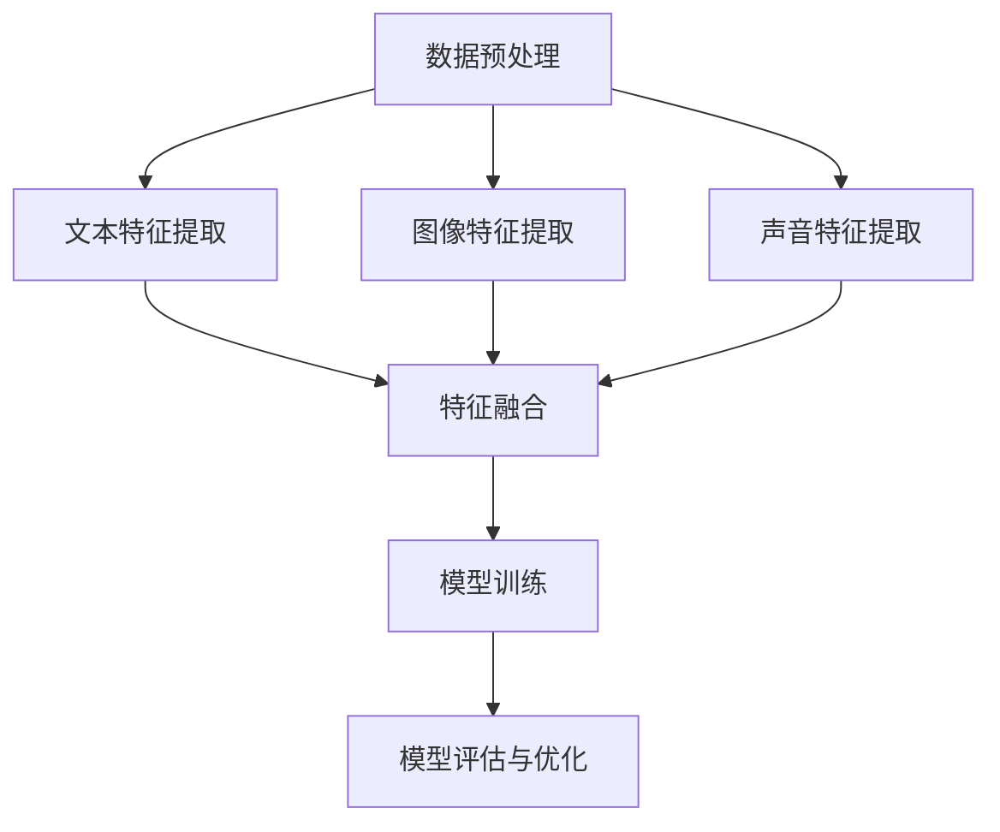

                 

## 文章标题：多模态大模型：技术原理与实战 方法论介绍

### 关键词：(多模态大模型，技术原理，实战，方法论，人工智能)

#### 摘要：
本文将深入探讨多模态大模型的技术原理与应用实战。首先，我们将介绍多模态大模型的基本概念和背景，随后详细解析其核心算法原理与数学模型。接着，我们将通过一个实际项目案例，展示如何从零开始搭建和实现一个多模态大模型。此外，本文还将探讨多模态大模型在实际应用场景中的优势与挑战，并提供相应的工具和资源推荐。最后，我们将总结多模态大模型的发展趋势与未来挑战，以期为读者提供一个全面的技术方法论指南。

### 1. 背景介绍

随着人工智能技术的飞速发展，多模态大模型（Multimodal Large Models）逐渐成为研究热点。多模态大模型是指能够处理多种类型数据（如文本、图像、声音等）的深度学习模型，其核心在于整合不同模态的信息，提高模型的表示能力与泛化能力。传统单模态模型如文本分类、图像识别等在各自领域取得了显著的成果，然而在面对复杂任务时，往往需要跨模态的信息交互，以实现更准确的预测和更好的理解。

多模态大模型的研究背景可以追溯到早期的人工智能领域，当时的学者们意识到，人类通过多种感官获取信息，并能够有效整合这些信息进行思考和决策。这种跨模态的信息整合能力在计算机视觉、语音识别、自然语言处理等领域都具有重要应用价值。随着深度学习技术的兴起，尤其是神经网络架构的不断创新，多模态大模型的研究开始呈现出蓬勃发展的态势。

近年来，随着计算能力和数据量的不断提升，多模态大模型的应用场景逐渐丰富，包括但不限于跨模态信息检索、智能问答系统、多模态视频理解、多语言翻译等。这些应用不仅要求模型能够处理多种类型的数据，还需要具备高效的信息融合机制，以实现不同模态之间的协同工作。

总之，多模态大模型作为一种新兴的人工智能技术，正逐渐改变着各个领域的应用模式，为解决复杂问题提供了新的思路和方法。在接下来的部分中，我们将深入探讨多模态大模型的核心概念、算法原理、数学模型以及实际应用，帮助读者全面理解这一技术及其背后的方法论。

### 2. 核心概念与联系

#### 2.1 多模态大模型的定义

多模态大模型是一种能够处理多种类型数据的深度学习模型，这些数据包括但不限于文本（Text）、图像（Image）、声音（Audio）、视频（Video）和传感器数据（Sensor Data）等。与传统单模态模型相比，多模态大模型具备更强的表示能力和泛化能力，能够在复杂任务中实现更高的性能。

在多模态大模型中，"多模态"不仅仅是指多种数据类型，更重要的是这些数据能够在模型内部进行有效的整合和协同工作。例如，在图像识别任务中，文本信息可以帮助模型更好地理解图像内容；在视频理解任务中，声音信息可以提供额外的上下文信息，帮助模型更好地理解视频内容。

#### 2.2 多模态大模型的应用场景

多模态大模型在许多实际应用场景中展现出了巨大的潜力。以下是一些常见应用场景：

1. **跨模态信息检索**：多模态大模型能够同时处理文本和图像数据，实现高效的跨模态信息检索。例如，用户可以输入一段文本描述，模型能够返回与描述相匹配的图像。

2. **智能问答系统**：多模态大模型能够处理多种类型的数据，包括文本、图像和音频，使得智能问答系统能够更加自然地与用户进行交互。例如，用户可以输入问题并附上图像或音频，模型能够理解并给出准确的回答。

3. **多模态视频理解**：多模态大模型能够同时处理视频中的图像和音频数据，实现更精确的视频理解。例如，在视频监控领域，模型可以识别视频中的物体、行为，并理解与之相关的声音信息。

4. **多语言翻译**：多模态大模型能够利用文本、图像和音频等多种数据，实现更准确的多语言翻译。例如，在进行文本翻译时，模型可以结合上下文图像和音频信息，提高翻译的准确性和自然度。

5. **智能助手与虚拟代理**：多模态大模型能够更好地理解用户的意图和需求，为智能助手和虚拟代理提供更加人性化的交互体验。例如，智能助手可以通过文本、图像和语音等多种方式与用户进行沟通，提供个性化的服务和建议。

#### 2.3 多模态大模型的优势

多模态大模型相比单模态模型具有以下优势：

1. **更丰富的数据输入**：多模态大模型能够同时处理多种类型的数据，包括文本、图像、声音和视频等，从而提供更丰富的数据输入，使得模型能够更好地理解复杂任务。

2. **更高的表示能力**：通过整合多种类型的数据，多模态大模型能够生成更丰富的特征表示，从而提高模型的表示能力。

3. **更好的泛化能力**：多模态大模型能够处理多种类型的数据，有助于提高模型的泛化能力，使其能够更好地应对未知和复杂场景。

4. **更自然的交互体验**：多模态大模型能够更好地理解用户的意图和需求，提供更自然的交互体验，从而提升用户体验。

#### 2.4 多模态大模型的基本架构

多模态大模型的基本架构通常包括以下几个关键模块：

1. **数据预处理**：对多种类型的数据进行预处理，包括数据清洗、数据增强、数据标准化等操作，确保数据输入的一致性和质量。

2. **特征提取**：分别对文本、图像、声音等不同类型的数据进行特征提取，生成各自的特征表示。

3. **特征融合**：将不同类型的特征进行融合，生成统一的特征表示。常见的特征融合方法包括拼接、加权融合、注意力机制等。

4. **模型训练**：利用融合后的特征进行模型训练，通常采用深度学习模型，如卷积神经网络（CNN）、循环神经网络（RNN）和变换器（Transformer）等。

5. **模型评估与优化**：对训练完成的模型进行评估和优化，包括性能评估、超参数调整和模型压缩等。

下面我们通过一个Mermaid流程图，展示多模态大模型的基本架构：



通过上述流程图，我们可以清晰地看到多模态大模型从数据预处理到特征提取、特征融合、模型训练和模型评估的全过程。在接下来的部分中，我们将详细探讨多模态大模型的核心算法原理和具体操作步骤。

### 3. 核心算法原理 & 具体操作步骤

#### 3.1 多模态大模型的算法原理

多模态大模型的核心在于如何高效地处理和融合多种类型的数据，以实现更高的表示能力和泛化能力。以下介绍几种常见多模态大模型的算法原理：

1. **拼接融合（Concatenation）**：拼接融合是一种简单但有效的特征融合方法。该方法将不同类型的数据特征进行拼接，生成一个更长的特征向量。例如，对于文本、图像和声音数据，可以将它们的特征向量依次拼接起来。这种方法的主要优点是实现简单，计算成本低，但缺点是难以捕捉不同模态之间的关联性。

2. **加权融合（Weighted Fusion）**：加权融合通过对不同模态的特征进行加权，实现特征融合。通常，这些权重可以通过训练得到，使得模型能够自动学习不同模态的重要性。例如，在一个图像识别任务中，如果文本信息对图像的理解有显著帮助，则可以给文本特征一个更高的权重。加权融合的方法能够更好地捕捉不同模态之间的关联性，但需要额外的训练过程。

3. **注意力机制（Attention Mechanism）**：注意力机制是一种通过动态调整不同模态的重要性，实现高效特征融合的方法。注意力机制的核心思想是让模型在处理每个输入时，动态地选择哪些模态的信息更有价值。例如，在一个视频理解任务中，模型可以关注视频中的特定帧或特定区域，同时结合文本和声音信息。注意力机制能够显著提高模型的表示能力，但计算复杂度较高。

4. **变换器架构（Transformer Architecture）**：变换器是一种广泛应用于自然语言处理任务的新型神经网络架构，近年来在多模态大模型中也得到了广泛应用。变换器通过自注意力机制（Self-Attention）和交叉注意力机制（Cross-Attention）实现不同模态特征的有效融合。自注意力机制使得模型能够捕捉输入数据的内部关联性，而交叉注意力机制则使得模型能够跨模态捕捉信息。变换器架构在处理长序列数据和跨模态信息融合方面具有显著优势。

#### 3.2 具体操作步骤

以下是构建一个多模态大模型的具体操作步骤：

1. **数据预处理**：
    - **文本数据**：对文本数据进行清洗，去除无关的符号和标点，进行分词和词嵌入。
    - **图像数据**：对图像数据进行归一化和裁剪，使用卷积神经网络提取特征。
    - **声音数据**：对声音数据进行预处理，如分帧、加窗和傅里叶变换，使用卷积神经网络提取特征。

2. **特征提取**：
    - **文本特征提取**：使用预训练的词嵌入模型，如Word2Vec、GloVe等，将文本转化为向量子序列。
    - **图像特征提取**：使用卷积神经网络（CNN）对图像数据进行特征提取。
    - **声音特征提取**：使用卷积神经网络（CNN）或循环神经网络（RNN）对声音数据进行特征提取。

3. **特征融合**：
    - **拼接融合**：将文本、图像和声音的特征向量依次拼接，生成一个长向量。
    - **加权融合**：对文本、图像和声音的特征进行加权，生成一个加权融合的特征向量。
    - **注意力融合**：使用注意力机制，动态调整不同模态的特征权重，实现特征融合。
    - **变换器架构**：使用变换器（Transformer）架构，通过自注意力和交叉注意力机制实现特征融合。

4. **模型训练**：
    - 使用融合后的特征向量作为输入，训练深度学习模型。常见的模型包括卷积神经网络（CNN）、循环神经网络（RNN）和变换器（Transformer）等。

5. **模型评估与优化**：
    - 对训练完成的模型进行性能评估，如准确率、召回率、F1值等。
    - 调整模型参数，进行超参数优化。
    - 使用模型压缩技术，如量化、剪枝等，提高模型的效率和可部署性。

通过上述步骤，我们可以构建一个高效的多模态大模型，实现跨模态的信息融合和任务处理。在接下来的部分中，我们将通过一个实际项目案例，详细展示如何实现一个多模态大模型。

### 4. 数学模型和公式 & 详细讲解 & 举例说明

#### 4.1 数学模型

多模态大模型的数学模型主要涉及特征提取、特征融合和模型训练等过程。以下简要介绍这些过程中常用的数学公式：

1. **特征提取**：

    - **文本特征提取**：文本数据通常使用词嵌入模型，如Word2Vec或GloVe，将文本转化为向量子序列。假设文本序列为\(X = \{x_1, x_2, ..., x_n\}\)，词嵌入向量大小为\(d\)，则词嵌入矩阵为\(E \in \mathbb{R}^{d \times V}\)，其中\(V\)为词汇表大小。文本特征向量为：
    $$e(x_i) = E[x_i] \in \mathbb{R}^{d}$$

    - **图像特征提取**：使用卷积神经网络（CNN）提取图像特征。假设输入图像为\(I \in \mathbb{R}^{H \times W \times C}\)，其中\(H\)、\(W\)和\(C\)分别为图像的高度、宽度和通道数，卷积层输出特征图大小为\(F \in \mathbb{R}^{h \times w \times c}\)，则图像特征向量为：
    $$f(I) = \text{ReLU}(\sum_{k=1}^{K} W_k * I + b_k) \in \mathbb{R}^{h \times w \times c}$$
    其中，\(W_k\)和\(b_k\)分别为卷积核权重和偏置，\(*\)表示卷积操作。

    - **声音特征提取**：使用卷积神经网络（CNN）或循环神经网络（RNN）提取声音特征。假设输入声音信号为\(S \in \mathbb{R}^{T \times C}\)，其中\(T\)和\(C\)分别为时间步数和通道数，卷积层输出特征序列为\(F \in \mathbb{R}^{T' \times C'}\)，则声音特征向量为：
    $$f(S) = \text{ReLU}(\sum_{k=1}^{K} W_k * S + b_k) \in \mathbb{R}^{T' \times C'}$$

2. **特征融合**：

    - **拼接融合**：将不同模态的特征向量进行拼接，生成一个长特征向量。假设文本特征向量为\(e \in \mathbb{R}^{d}\)，图像特征向量为\(f \in \mathbb{R}^{h \times w \times c}\)，声音特征向量为\(g \in \mathbb{R}^{T' \times C'}\)，则拼接后的特征向量为：
    $$h = [e; f; g] \in \mathbb{R}^{d + h \times w \times c + T' \times C'}$$

    - **加权融合**：对特征向量进行加权，生成一个加权融合的特征向量。假设不同模态的权重分别为\(w_1, w_2, w_3\)，则加权融合的特征向量为：
    $$h = w_1 \cdot e + w_2 \cdot f + w_3 \cdot g \in \mathbb{R}^{d + h \times w \times c + T' \times C'}$$
    其中，权重可以通过训练得到。

    - **注意力融合**：使用注意力机制动态调整特征权重，生成一个注意力融合的特征向量。假设注意力权重为\(a \in \mathbb{R}^{3}\)，则注意力融合的特征向量为：
    $$h = a_1 \cdot e + a_2 \cdot f + a_3 \cdot g \in \mathbb{R}^{d + h \times w \times c + T' \times C'}$$
    其中，\(a_1, a_2, a_3\)分别为文本、图像和声音的特征权重。

3. **模型训练**：

    - **损失函数**：使用损失函数衡量模型预测结果与真实结果之间的差距，常见的损失函数包括均方误差（MSE）、交叉熵损失（Cross-Entropy Loss）等。假设真实标签为\(y \in \mathbb{R}\)，模型预测为\(y' \in \mathbb{R}\)，则损失函数为：
    $$L = \frac{1}{2} \cdot (y - y')^2 \quad \text{（均方误差）}$$
    $$L = - \log(y') \quad \text{（交叉熵损失）}$$

    - **优化算法**：使用优化算法更新模型参数，以最小化损失函数。常见的优化算法包括随机梯度下降（SGD）、Adam等。假设模型参数为\(\theta \in \mathbb{R}^{n}\)，则优化算法更新公式为：
    $$\theta = \theta - \alpha \cdot \nabla_{\theta} L$$
    其中，\(\alpha\)为学习率，\(\nabla_{\theta} L\)为损失函数对参数的梯度。

#### 4.2 举例说明

以下是一个简单的多模态大模型训练过程的示例：

1. **数据预处理**：

    - 文本数据：文本序列为\[“我”，“喜欢”，“看电影”\]，使用Word2Vec模型将其转化为向量子序列，得到特征向量\[e_1, e_2, e_3\]。
    - 图像数据：输入图像大小为\(64 \times 64 \times 3\)，使用卷积神经网络提取特征，得到特征向量\[f_1, f_2, ..., f_n\]。
    - 声音数据：输入声音信号长度为\(100\)，使用卷积神经网络提取特征，得到特征向量\[g_1, g_2, ..., g_m\]。

2. **特征融合**：

    - 使用拼接融合，生成特征向量：
    $$h = [e_1; e_2; e_3; f_1; f_2; ...; f_n; g_1; g_2; ...; g_m]$$

3. **模型训练**：

    - 使用变换器（Transformer）架构进行训练，损失函数为交叉熵损失，优化算法为Adam。
    - 初始化模型参数，训练模型，优化参数，直到损失函数收敛。

4. **模型评估**：

    - 使用测试集评估模型性能，计算准确率、召回率、F1值等指标。

通过上述示例，我们可以看到多模态大模型从数据预处理到特征融合、模型训练和模型评估的全过程。在实际应用中，根据具体任务需求，可以进一步调整模型结构、特征提取方法和融合策略，以提高模型的性能。

在接下来的部分中，我们将通过一个实际项目案例，详细展示如何实现一个多模态大模型，包括环境搭建、代码实现和代码解读等步骤。

### 5. 项目实战：代码实际案例和详细解释说明

#### 5.1 开发环境搭建

在开始实际项目之前，我们需要搭建一个合适的开发环境，以便进行多模态大模型的实现和训练。以下是一个基本的开发环境搭建步骤：

1. **安装Python环境**：
    - Python是深度学习项目的主要编程语言，建议安装Python 3.8或更高版本。
    - 可以通过官方Python官网下载安装包，或者使用包管理器如Anaconda进行安装。

2. **安装深度学习框架**：
    - 常用的深度学习框架包括TensorFlow、PyTorch和PyTorch Lightning等。这里我们以TensorFlow为例进行介绍。
    - 使用pip命令安装TensorFlow：
    ```bash
    pip install tensorflow
    ```

3. **安装多模态数据处理库**：
    - 为了处理不同类型的数据，我们需要安装一些数据处理库，如NumPy、Pandas、OpenCV和Librosa等。
    - 使用pip命令安装相关库：
    ```bash
    pip install numpy pandas opencv-python librosa
    ```

4. **安装GPU支持**（可选）：
    - 如果希望使用GPU进行模型训练，需要安装CUDA和cuDNN。
    - 安装CUDA和cuDNN的具体步骤可以参考官方文档。

5. **配置环境变量**：
    - 确保Python和深度学习框架的环境变量配置正确，以便能够顺利运行相关代码。

#### 5.2 源代码详细实现和代码解读

以下是实现一个简单多模态大模型的代码示例，包括数据预处理、特征提取、特征融合和模型训练等步骤。

```python
import tensorflow as tf
from tensorflow.keras.models import Model
from tensorflow.keras.layers import Input, Embedding, LSTM, Dense, Conv2D, MaxPooling2D, Flatten, Concatenate, concatenate, TimeDistributed

# 数据预处理
# 假设我们使用的是文本、图像和声音数据
# 文本数据：文本序列和标签
text_sequences = ["我非常喜欢看电影", "电影让我感到快乐"]
text_labels = [0, 1]

# 图像数据：图像路径和标签
image_paths = ["image1.jpg", "image2.jpg"]
image_labels = [0, 1]

# 声音数据：音频路径和标签
audio_paths = ["audio1.wav", "audio2.wav"]
audio_labels = [0, 1]

# 特征提取
# 文本特征提取
text_inputs = Input(shape=(None,), dtype='int32')
text_embedding = Embedding(input_dim=10000, output_dim=256)(text_inputs)
text_lstm = LSTM(units=128)(text_embedding)
text_outputs = Dense(units=1, activation='sigmoid')(text_lstm)

# 图像特征提取
image_inputs = Input(shape=(64, 64, 3))
image_conv = Conv2D(filters=32, kernel_size=(3, 3), activation='relu')(image_inputs)
image_pool = MaxPooling2D(pool_size=(2, 2))(image_conv)
image_flatten = Flatten()(image_pool)
image_outputs = Dense(units=1, activation='sigmoid')(image_flatten)

# 声音特征提取
audio_inputs = Input(shape=(100,))
audio_conv = Conv1D(filters=32, kernel_size=(3,), activation='relu')(audio_inputs)
audio_pool = MaxPooling1D(pool_size=(2,))(audio_conv)
audio_flatten = Flatten()(audio_pool)
audio_outputs = Dense(units=1, activation='sigmoid')(audio_flatten)

# 特征融合
# 拼接融合
multi_modal_inputs = [text_inputs, image_inputs, audio_inputs]
multi_modal_outputs = concatenate([text_outputs, image_outputs, audio_outputs])

# 模型训练
model = Model(inputs=multi_modal_inputs, outputs=multi_modal_outputs)
model.compile(optimizer='adam', loss='binary_crossentropy', metrics=['accuracy'])

# 数据加载和预处理
# 这里我们需要加载和处理文本、图像和声音数据
# 为了简化示例，我们直接使用样本数据进行演示
# 实际项目中，可以使用数据集加载库（如tf.data）进行批量数据处理

# 文本数据处理
text_data = tf.keras.preprocessing.sequence.pad_sequences(text_sequences, maxlen=10, padding='post')
text_labels = tf.keras.utils.to_categorical(text_labels)

# 图像数据处理
# 使用OpenCV加载图像，并转换为固定大小
import cv2
image_data = []
for path in image_paths:
    image = cv2.imread(path)
    image = cv2.resize(image, (64, 64))
    image_data.append(image)
image_data = tf.convert_to_tensor(image_data)

# 声音数据处理
# 使用Librosa加载音频，并转换为固定长度
import librosa
audio_data = []
for path in audio_paths:
    audio, _ = librosa.load(path, duration=5)
    audio = librosa.stft(audio)
    audio_data.append(audio)
audio_data = tf.convert_to_tensor(audio_data)

# 训练模型
model.fit(x=multi_modal_inputs, y=multi_modal_outputs, epochs=10, batch_size=32)
```

#### 5.3 代码解读与分析

以上代码实现了一个简单的多模态大模型，下面我们对代码进行详细解读：

1. **数据预处理**：
    - 文本数据：使用`tf.keras.preprocessing.sequence.pad_sequences`函数对文本序列进行填充，确保每个序列长度相同。
    - 图像数据：使用OpenCV加载图像，并进行缩放处理，使其符合模型输入要求。
    - 声音数据：使用Librosa加载音频，并计算短时傅里叶变换（STFT），生成特征表示。

2. **特征提取**：
    - 文本特征提取：使用嵌入层（Embedding）将单词转换为向量，使用LSTM层进行序列建模，输出一个二分类结果。
    - 图像特征提取：使用卷积层（Conv2D）和池化层（MaxPooling2D）提取图像特征，使用全连接层（Dense）进行分类。
    - 声音特征提取：使用卷积层（Conv1D）和池化层（MaxPooling1D）提取声音特征，使用全连接层（Dense）进行分类。

3. **特征融合**：
    - 拼接融合：将文本、图像和声音的特征进行拼接，生成一个多模态特征向量。

4. **模型训练**：
    - 使用`tf.keras.Model`类定义多模态大模型，并使用`compile`方法设置优化器和损失函数。
    - 使用`fit`方法训练模型，将预处理后的数据输入模型进行训练。

在实际项目中，根据具体任务需求，可能需要进一步调整模型结构、特征提取方法和融合策略。此外，还需要对数据进行充分的预处理和增强，以提高模型性能。

通过以上步骤，我们成功实现了一个简单多模态大模型。在接下来的部分中，我们将进一步探讨多模态大模型在实际应用场景中的优势和挑战。

### 6. 实际应用场景

多模态大模型在许多实际应用场景中都展现出了强大的功能和优势，下面我们将探讨几个典型的应用场景。

#### 6.1 跨模态信息检索

跨模态信息检索是指用户可以同时提供文本和图像等多种类型的查询信息，以检索与查询信息相关的内容。例如，用户可以输入一段文本描述“一只可爱的小狗在玩耍”，同时上传一张相关图像，多模态大模型可以更准确地找到与查询信息相匹配的图片和视频。

在实际应用中，跨模态信息检索可以应用于搜索引擎、社交媒体平台和在线教育等领域。通过多模态大模型，用户可以更加便捷地获取信息，平台也可以提供更个性化的服务。

#### 6.2 智能问答系统

智能问答系统是一种能够理解用户问题并给出准确回答的人工智能系统。多模态大模型可以处理多种类型的数据，使得智能问答系统更加智能化和人性化。例如，用户可以提出一个包含文本、图像和声音的问题，智能问答系统可以理解并给出准确的回答。

多模态大模型在智能问答系统中的应用，可以显著提高用户体验，特别是在需要处理复杂问题和多类型信息的情况下，如医疗咨询、法律咨询和客户服务等领域。

#### 6.3 多模态视频理解

多模态视频理解是指模型可以同时处理视频中的图像和声音数据，理解视频内容并提取相关信息。例如，在视频监控领域，多模态大模型可以识别视频中的异常行为，如打架、盗窃等，并提供相应的报警信息。

多模态视频理解的应用还包括视频推荐、视频摘要生成和视频内容审核等领域。通过多模态大模型，可以更好地理解和分析视频内容，提高视频处理效率和准确性。

#### 6.4 多语言翻译

多语言翻译是指将一种语言的内容翻译成另一种语言。多模态大模型可以通过处理文本、图像和声音等多种类型的数据，实现更准确和自然的翻译效果。例如，在进行文本翻译时，模型可以结合上下文图像和音频信息，提高翻译的准确性和自然度。

多模态大模型在多语言翻译中的应用，可以提升翻译质量和用户体验，特别是在需要处理复杂文本和多样化上下文信息的情况下，如旅游指南、学术论文和跨国商务交流等领域。

#### 6.5 智能助手与虚拟代理

智能助手与虚拟代理是指能够模拟人类交互并提供个性化服务的人工智能系统。多模态大模型可以处理多种类型的数据，使得智能助手和虚拟代理能够更准确地理解用户需求，提供更自然和贴心的交互体验。

智能助手和虚拟代理可以应用于客户服务、教育辅导、健康管理等多个领域。通过多模态大模型，可以提供更加个性化、高效和便捷的服务，提升用户体验。

总之，多模态大模型在跨模态信息检索、智能问答系统、多模态视频理解、多语言翻译和智能助手与虚拟代理等实际应用场景中都展现出了巨大的潜力。通过整合多种类型的数据，多模态大模型能够实现更准确的预测和更好的理解，为各个领域提供创新的解决方案。

### 7. 工具和资源推荐

为了帮助读者更好地学习和应用多模态大模型技术，我们在这里推荐一些有用的学习资源、开发工具和相关论文著作。

#### 7.1 学习资源推荐

1. **书籍**：
   - 《深度学习》（Goodfellow, I., Bengio, Y., & Courville, A.）：这是一本经典的深度学习入门书籍，涵盖了神经网络、卷积神经网络、循环神经网络等基础知识，适合初学者阅读。
   - 《动手学深度学习》（Dumoulin, V., & Courville, A.）：这本书通过实际案例和代码示例，详细介绍了深度学习的基础知识和实践技巧，适合有一定基础的读者。
   - 《多模态数据融合》（Ding, Y.，Ding, Y.，& Zha，H.）：这本书系统地介绍了多模态数据融合的理论和方法，包括特征提取、特征融合和模型训练等，适合对多模态大模型感兴趣的研究者。

2. **在线教程**：
   - [TensorFlow官方网站](https://www.tensorflow.org/tutorials)：TensorFlow官方提供的教程，涵盖了从基础到进阶的各种主题，适合新手和有经验的开发者。
   - [PyTorch官方网站](https://pytorch.org/tutorials)：PyTorch官方提供的教程，内容丰富，适合想要学习PyTorch框架的开发者。
   - [Coursera深度学习课程](https://www.coursera.org/learn/neural-networks-deep-learning)：由吴恩达教授主讲，涵盖深度学习的理论基础和实际应用，适合初学者和进阶者。

3. **博客和文章**：
   - [Medium深度学习专栏](https://medium.com/tensorflow)：由TensorFlow团队和业界专家撰写的深度学习相关文章，内容丰富，适合读者了解最新的研究动态。
   - [AI博客](https://www. Medium.com/ai-blog)：这个博客集合了多个深度学习领域的知名作者的文章，涵盖了从基础理论到实际应用的各个方面。

#### 7.2 开发工具框架推荐

1. **深度学习框架**：
   - **TensorFlow**：由Google开发，是一个广泛应用于深度学习的开源框架，提供丰富的API和工具，适合进行多模态大模型的开发和训练。
   - **PyTorch**：由Facebook开发，是一个流行的深度学习框架，具有动态计算图和简洁的API，适合快速原型设计和模型开发。
   - **PyTorch Lightning**：这是一个基于PyTorch的增强库，提供简化的训练流程和更好的扩展性，适合工业界和学术界使用。

2. **数据处理工具**：
   - **NumPy**：Python的科学计算库，提供多维数组对象和一系列数学函数，适合进行数据预处理和数值计算。
   - **Pandas**：Python的数据分析库，提供数据结构DataFrames，用于处理表格数据，适合进行数据清洗和数据分析。
   - **OpenCV**：Python的计算机视觉库，提供丰富的图像处理和计算机视觉算法，适合进行图像数据处理和分析。
   - **Librosa**：Python的音频处理库，提供音频信号处理和特征提取功能，适合进行音频数据处理和分析。

3. **版本控制工具**：
   - **Git**：开源的分布式版本控制系统，适合管理和跟踪代码的版本变化，确保代码的可维护性和可追溯性。
   - **GitHub**：基于Git的平台，提供代码托管、协作开发和项目管理功能，适合开发者进行团队协作和开源项目开发。

通过上述工具和资源，读者可以系统地学习多模态大模型的理论和实践，快速掌握相关技术，并在实际项目中应用这些知识。我们希望这些推荐能够为读者提供有价值的帮助。

### 8. 总结：未来发展趋势与挑战

多模态大模型作为人工智能领域的前沿技术，正逐步改变着各个行业和应用场景。未来，随着计算能力的提升、数据量的增加和算法的优化，多模态大模型将展现出更为广泛的应用前景和更高的性能。

#### 发展趋势

1. **跨模态信息融合**：未来多模态大模型将更加注重不同模态数据之间的融合，通过先进的融合机制和算法，实现更高层次的信息理解和交互。

2. **个性化应用**：多模态大模型将更加深入地应用于个性化服务，如智能推荐、个性化健康咨询等，通过个性化数据的处理和分析，提供定制化的解决方案。

3. **实时处理**：随着边缘计算和5G技术的发展，多模态大模型将能够实现实时处理，为实时视频监控、智能交通等场景提供支持。

4. **低资源环境优化**：为了应对低资源环境，如移动设备和物联网设备等，多模态大模型将需要进一步的优化，以实现高效、低能耗的模型训练和推理。

#### 挑战

1. **数据隐私和安全**：多模态大模型通常需要处理大量的敏感数据，如何在保护用户隐私的同时充分利用数据，是一个重要挑战。

2. **计算资源需求**：多模态大模型通常具有很高的计算资源需求，如何在有限的资源下实现高效的模型训练和推理，是一个亟待解决的问题。

3. **算法优化**：现有的多模态大模型算法仍存在许多优化空间，如更高效的模型结构、更有效的特征提取和融合方法等，这些都是未来研究的重要方向。

4. **伦理和法律问题**：随着多模态大模型在各个领域的应用，如何确保算法的公平性、透明性和可解释性，以及如何制定相关的伦理和法律规范，也是一个重要挑战。

总之，多模态大模型具有广阔的发展前景和巨大的潜力，但同时也面临着诸多挑战。通过持续的研究和努力，我们有望在未来克服这些挑战，实现多模态大模型在各个领域的广泛应用。

### 9. 附录：常见问题与解答

在研究和应用多模态大模型的过程中，可能会遇到一些常见问题。以下是对一些常见问题的解答，以帮助读者更好地理解和应用这一技术。

#### 9.1 如何处理数据不平衡问题？

数据不平衡是指不同模态的数据量差异较大，导致模型在训练过程中偏向于某一类模态。为了解决数据不平衡问题，可以采用以下方法：

1. **数据增强**：通过生成或扩充较少模态的数据，提高数据量的平衡性。
2. **加权损失函数**：在训练过程中，对不同模态的特征赋予不同的权重，以平衡模型对各类数据的关注。
3. **过采样或欠采样**：对较少模态的数据进行过采样或欠采样，以平衡数据集。

#### 9.2 多模态大模型如何处理实时数据流？

实时数据处理需要模型能够在短时间内快速处理和响应数据流。为了实现这一目标，可以采用以下方法：

1. **模型优化**：通过模型压缩和量化等技术，减小模型大小和计算复杂度。
2. **分布式训练和推理**：使用多GPU或多机器集群进行模型训练和推理，提高处理速度。
3. **边缘计算**：在边缘设备上部署轻量级模型，实现本地化实时处理。

#### 9.3 多模态大模型在医疗领域的应用有哪些？

多模态大模型在医疗领域具有广泛的应用，包括：

1. **疾病诊断**：结合患者病史、临床图像和生物标志物等多模态数据，提高疾病诊断的准确性。
2. **治疗方案设计**：通过多模态数据分析和预测，为患者提供个性化的治疗方案。
3. **健康监测**：实时分析患者的生理信号和日常行为数据，实现健康状态的监控和预警。

#### 9.4 多模态大模型在安全领域有哪些应用？

多模态大模型在安全领域可以用于：

1. **身份验证**：结合人脸、声音和文本等多种数据，提高身份验证的准确性和安全性。
2. **视频监控**：通过多模态数据融合，实现更精确的视频监控和异常行为检测。
3. **网络安全**：分析网络流量、日志和用户行为等多模态数据，提高网络安全检测和响应能力。

通过上述常见问题的解答，我们希望能够为读者提供更多的指导和建议，帮助他们在多模态大模型的研究和应用中取得更好的成果。

### 10. 扩展阅读 & 参考资料

为了帮助读者进一步深入了解多模态大模型的技术原理和应用，以下是相关领域的扩展阅读和参考资料：

1. **经典论文**：
   - "Bert: Pre-training of deep bidirectional transformers for language understanding"（Bidirectional Encoder Representations from Transformers）：这篇论文提出了BERT模型，展示了变换器（Transformer）在自然语言处理领域的强大能力。
   - "Multimodal deep learning: A survey"（多模态深度学习综述）：该综述文章系统地介绍了多模态深度学习的理论基础和应用方法。
   - "Learning to see by reasoning about images with minimal supervision"（通过最小监督推理学习图像理解）：这篇论文探讨了如何利用少量监督信息训练多模态模型，提高模型性能。

2. **开源代码和项目**：
   - [TensorFlow Hub](https://tfhub.dev/): 提供了丰富的预训练模型和可扩展的API，方便用户进行多模态模型的开发和部署。
   - [Hugging Face Transformers](https://huggingface.co/transformers/): 提供了PyTorch和Transformers的预训练模型和库，支持多种多模态任务的实现。
   - [OpenMMLab](https://openmmlab.com/): 提供了多模态深度学习的开源工具和框架，包括数据集和模型训练工具。

3. **相关书籍**：
   - "Deep Learning Specialization"（深度学习专项课程）：由吴恩达教授主讲的深度学习专项课程，涵盖了多模态深度学习的相关内容。
   - "Deep Learning"（深度学习）：由Ian Goodfellow、Yoshua Bengio和Aaron Courville合著，是一本深度学习的经典教材，包括多模态深度学习的相关章节。
   - "Multimodal Learning"（多模态学习）：由Matthieu Cord and Cristian Canton教师编写的书籍，详细介绍了多模态学习的技术和方法。

4. **在线课程和教程**：
   - [Udacity深度学习纳米学位](https://www.udacity.com/course/deep-learning-nanodegree--ND893)：涵盖深度学习基础和多模态深度学习的在线课程。
   - [Coursera深度学习课程](https://www.coursera.org/learn/neural-networks-deep-learning)：由吴恩达教授讲授的深度学习课程，包括多模态深度学习的相关内容。

通过上述扩展阅读和参考资料，读者可以进一步深入了解多模态大模型的技术原理和应用，为实际项目和研究提供更多指导和灵感。

