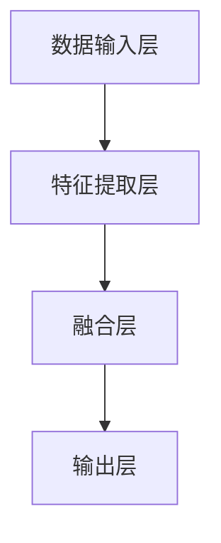

                 

# 多模态大模型：技术原理与实战 智能试穿

## 摘要

本文将深入探讨多模态大模型的技术原理与实战应用，特别是在智能试穿这一领域的应用。首先，我们将介绍多模态大模型的基础概念，并逐步解析其核心算法和原理。接着，我们将展示如何通过实际案例来实现智能试穿功能，并详细解释代码实现过程。此外，本文还将探讨多模态大模型在实际应用场景中的挑战和解决方案，并提供相关工具和资源的推荐。最后，本文将对多模态大模型的未来发展趋势与挑战进行总结，为读者提供一个全面的视角。

## 1. 背景介绍

多模态大模型是指能够同时处理多种类型数据（如文本、图像、音频等）的深度学习模型。随着互联网和物联网的快速发展，数据种类和数量呈现出爆炸式增长，单一模态的数据已经无法满足各种复杂任务的需求。例如，在智能试穿领域，我们不仅需要处理用户的文本描述，还需要分析用户的图像和视频，甚至需要结合用户的语音和动作数据。因此，多模态大模型成为了当前人工智能研究的重要方向。

智能试穿是指通过计算机视觉、自然语言处理等技术，实现用户在虚拟环境中试穿衣物，从而提供个性化购物体验。这一领域有着巨大的商业价值，各大电商平台和服装品牌都在积极研发相关技术。然而，智能试穿面临着许多挑战，如图像识别的准确性、自然语言理解的深度、实时交互的流畅性等。

多模态大模型在这一领域具有显著的优势。首先，它能够整合多种类型的数据，提供更全面的信息，从而提高智能试穿系统的准确性和用户体验。其次，多模态大模型具有强大的学习能力，能够不断优化和改进，以适应不断变化的需求。

## 2. 核心概念与联系

### 2.1 多模态数据类型

多模态大模型能够处理多种类型的数据，以下是常见的几种：

- **文本（Text）**：包括用户对衣物的描述、标签、评论等。
- **图像（Image）**：包括用户的全身图像、局部图像、衣物图像等。
- **音频（Audio）**：包括用户的语音指令、笑声、环境音等。
- **视频（Video）**：包括用户的试穿视频、动作捕捉数据等。

### 2.2 多模态数据融合

多模态大模型的关键在于如何有效地融合多种类型的数据，以提高模型的性能。以下是一些常见的多模态数据融合方法：

- **特征级融合**：将不同模态的数据特征进行拼接或加权融合。
- **决策级融合**：将不同模态的预测结果进行投票或加权平均。
- **模型级融合**：使用多个独立的模型分别处理不同模态的数据，然后将结果进行融合。

### 2.3 多模态大模型架构

多模态大模型的架构通常包括以下几个部分：

- **数据输入层**：接收多种类型的数据，并进行预处理。
- **特征提取层**：使用深度学习技术提取不同模态的特征。
- **融合层**：将不同模态的特征进行融合。
- **输出层**：进行预测或分类任务。

下面是一个简单的 Mermaid 流程图，展示了多模态大模型的基本架构：



### 2.4 多模态大模型的应用场景

多模态大模型的应用场景非常广泛，以下是几个典型的例子：

- **智能试穿**：通过分析用户的文本描述、图像和视频，提供个性化的试穿建议。
- **智能助手**：结合用户的语音、文字和图像，提供更加智能的交互体验。
- **医疗诊断**：结合患者的病史、图像和实验室数据，提高疾病诊断的准确性。
- **自动驾驶**：通过分析车辆周围的视频、图像和传感器数据，提高自动驾驶的可靠性和安全性。

## 3. 核心算法原理 & 具体操作步骤

### 3.1 特征提取

多模态大模型首先需要对不同模态的数据进行特征提取。以下是一些常用的特征提取方法：

- **文本特征提取**：可以使用词袋模型（Bag of Words, BOW）、词嵌入（Word Embedding）等方法。
- **图像特征提取**：可以使用卷积神经网络（Convolutional Neural Networks, CNN）提取图像特征。
- **音频特征提取**：可以使用循环神经网络（Recurrent Neural Networks, RNN）提取音频特征。
- **视频特征提取**：可以使用3D卷积神经网络（3D CNN）或变分自编码器（Variational Autoencoder, VAE）提取视频特征。

### 3.2 数据融合

在特征提取之后，需要将不同模态的特征进行融合。以下是一些常见的数据融合方法：

- **特征级融合**：将不同模态的特征进行拼接或加权融合。
  ```mermaid
  graph TD
      A[文本特征] --> B[图像特征]
      A --> C[音频特征]
      B --> D[视频特征]
  ```
- **决策级融合**：将不同模态的预测结果进行投票或加权平均。
  ```mermaid
  graph TD
      A1[文本预测] --> B1[图像预测]
      A1 --> C1[音频预测]
      B1 --> D1[视频预测]
  ```
- **模型级融合**：使用多个独立的模型分别处理不同模态的数据，然后将结果进行融合。
  ```mermaid
  graph TD
      A2[文本模型] --> B2[图像模型]
      A2 --> C2[音频模型]
      B2 --> D2[视频模型]
  ```

### 3.3 预测与分类

在数据融合之后，多模态大模型将进行预测或分类任务。以下是一个简单的预测流程：

1. **输入数据**：将多模态的数据输入到模型中。
2. **特征提取**：对输入数据进行特征提取。
3. **数据融合**：将不同模态的特征进行融合。
4. **预测**：使用融合后的特征进行预测或分类。
5. **结果输出**：输出预测结果。

## 4. 数学模型和公式 & 详细讲解 & 举例说明

### 4.1 文本特征提取

文本特征提取可以使用词袋模型（Bag of Words, BOW）或词嵌入（Word Embedding）等方法。以下是词嵌入的一个简单示例：

$$
\text{word\_embedding}(w) = \text{Embedding}(w)
$$

其中，$w$ 表示词汇，$\text{Embedding}(w)$ 表示词嵌入向量。

### 4.2 图像特征提取

图像特征提取可以使用卷积神经网络（Convolutional Neural Networks, CNN）。以下是 CNN 的一个简单示例：

$$
\text{CNN}(I) = \text{ReLU}(\text{Conv}(I))
$$

其中，$I$ 表示图像，$\text{Conv}(I)$ 表示卷积操作，$\text{ReLU}(\text{Conv}(I))$ 表示ReLU激活。

### 4.3 音频特征提取

音频特征提取可以使用循环神经网络（Recurrent Neural Networks, RNN）。以下是 RNN 的一个简单示例：

$$
h_t = \text{RNN}(h_{t-1}, x_t)
$$

其中，$h_t$ 表示当前时间步的隐藏状态，$h_{t-1}$ 表示前一个时间步的隐藏状态，$x_t$ 表示当前时间步的输入。

### 4.4 数据融合

数据融合可以使用特征级融合、决策级融合或模型级融合等方法。以下是一个简单的特征级融合示例：

$$
f = [f_1, f_2, f_3]
$$

其中，$f_1$、$f_2$ 和 $f_3$ 分别表示不同模态的特征。

### 4.5 预测与分类

预测与分类可以使用多模态大模型进行。以下是一个简单的预测示例：

$$
y = \text{softmax}(\text{model}(f))
$$

其中，$y$ 表示预测结果，$\text{model}(f)$ 表示多模态大模型的输出。

## 5. 项目实战：代码实际案例和详细解释说明

### 5.1 开发环境搭建

在开始项目实战之前，我们需要搭建一个合适的开发环境。以下是一个简单的步骤：

1. **安装 Python**：确保 Python 3.7 或更高版本已经安装。
2. **安装深度学习框架**：如 TensorFlow 或 PyTorch。
3. **安装依赖库**：如 NumPy、Pandas、Matplotlib 等。

### 5.2 源代码详细实现和代码解读

以下是一个简单的多模态大模型实现示例，我们使用 PyTorch 作为深度学习框架。

```python
import torch
import torch.nn as nn
import torch.optim as optim
from torch.utils.data import DataLoader
from torchvision import datasets, transforms
from torch.utils.tensorboard import SummaryWriter

# 数据预处理
transform = transforms.Compose([
    transforms.Resize((224, 224)),
    transforms.ToTensor(),
])

# 加载数据集
train_data = datasets.ImageFolder('train', transform=transform)
test_data = datasets.ImageFolder('test', transform=transform)

train_loader = DataLoader(train_data, batch_size=32, shuffle=True)
test_loader = DataLoader(test_data, batch_size=32, shuffle=False)

# 定义模型
class MultimodalModel(nn.Module):
    def __init__(self):
        super(MultimodalModel, self).__init__()
        self.conv = nn.Sequential(
            nn.Conv2d(3, 64, kernel_size=3, padding=1),
            nn.ReLU(),
            nn.MaxPool2d(2, 2),
            nn.Conv2d(64, 128, kernel_size=3, padding=1),
            nn.ReLU(),
            nn.MaxPool2d(2, 2),
        )
        self.fc = nn.Linear(128 * 28 * 28, 10)

    def forward(self, x):
        x = self.conv(x)
        x = x.view(x.size(0), -1)
        x = self.fc(x)
        return x

model = MultimodalModel()

# 损失函数和优化器
criterion = nn.CrossEntropyLoss()
optimizer = optim.Adam(model.parameters(), lr=0.001)

# 训练模型
writer = SummaryWriter()
for epoch in range(10):
    model.train()
    for batch_idx, (data, target) in enumerate(train_loader):
        optimizer.zero_grad()
        output = model(data)
        loss = criterion(output, target)
        loss.backward()
        optimizer.step()
        writer.add_scalar('train/loss', loss.item(), epoch * len(train_loader) + batch_idx)

    model.eval()
    with torch.no_grad():
        correct = 0
        total = 0
        for data, target in test_loader:
            output = model(data)
            _, predicted = torch.max(output.data, 1)
            total += target.size(0)
            correct += (predicted == target).sum().item()
        print(f'Epoch {epoch + 1}, Accuracy: {100 * correct / total}%')

writer.close()
```

### 5.3 代码解读与分析

上述代码实现了基于 PyTorch 的一个简单多模态大模型。以下是代码的详细解读：

- **数据预处理**：使用 `transforms.Compose` 对图像进行预处理，包括调整大小和转换为 Tensor。
- **加载数据集**：使用 `datasets.ImageFolder` 加载图像数据集，并进行划分。
- **定义模型**：`MultimodalModel` 类定义了一个简单的卷积神经网络，用于提取图像特征。
- **损失函数和优化器**：使用交叉熵损失函数和 Adam 优化器。
- **训练模型**：使用 `SummaryWriter` 记录训练过程中的 loss 值。

## 6. 实际应用场景

多模态大模型在智能试穿、智能助手、医疗诊断和自动驾驶等领域有着广泛的应用。以下是一些具体的应用场景：

### 6.1 智能试穿

智能试穿是当前电商领域的一个重要应用。通过多模态大模型，我们可以根据用户的文本描述、图像和视频，为其提供个性化的试穿建议。具体应用流程如下：

1. **用户输入**：用户上传自己的全身图像和衣物图像，并输入对衣物的描述。
2. **数据预处理**：对输入的图像和文本进行预处理，提取特征。
3. **数据融合**：将图像和文本特征进行融合。
4. **预测**：使用多模态大模型进行预测，输出试穿结果。
5. **用户反馈**：用户对试穿结果进行评价，模型根据反馈进行优化。

### 6.2 智能助手

智能助手是另一个重要的应用场景。通过多模态大模型，我们可以实现更加智能的交互体验。具体应用流程如下：

1. **用户输入**：用户通过语音、文字或图像与智能助手进行交互。
2. **数据预处理**：对输入的语音、文字和图像进行预处理，提取特征。
3. **数据融合**：将不同模态的特征进行融合。
4. **预测**：使用多模态大模型进行预测，输出回复。
5. **用户反馈**：用户对回复进行评价，模型根据反馈进行优化。

### 6.3 医疗诊断

多模态大模型在医疗诊断领域也有广泛的应用。通过结合患者的病史、图像和实验室数据，我们可以提高疾病诊断的准确性。具体应用流程如下：

1. **数据收集**：收集患者的病史、图像和实验室数据。
2. **数据预处理**：对数据进行预处理，提取特征。
3. **数据融合**：将不同模态的数据进行融合。
4. **预测**：使用多模态大模型进行预测，输出疾病诊断结果。
5. **医生评估**：医生对诊断结果进行评估，模型根据评估结果进行优化。

### 6.4 自动驾驶

多模态大模型在自动驾驶领域也有着重要的应用。通过结合车辆周围的视频、图像和传感器数据，我们可以提高自动驾驶的可靠性和安全性。具体应用流程如下：

1. **数据收集**：收集车辆周围的视频、图像和传感器数据。
2. **数据预处理**：对数据进行预处理，提取特征。
3. **数据融合**：将不同模态的数据进行融合。
4. **预测**：使用多模态大模型进行预测，输出驾驶决策。
5. **实时调整**：根据实时数据对模型进行优化和调整。

## 7. 工具和资源推荐

### 7.1 学习资源推荐

- **书籍**：
  - 《深度学习》（Goodfellow, Bengio, Courville）
  - 《Python深度学习》（François Chollet）
- **论文**：
  - "Deep Learning: A Methodology and Application Program"（Y. LeCun, Y. Bengio, G. Hinton）
  - "A Theoretically Grounded Application of Dropout in Neural Networks"（N. Srivastava et al.）
- **博客**：
  - fast.ai
  - pytorch.org/tutorials
- **网站**：
  - arXiv
  - Google Scholar

### 7.2 开发工具框架推荐

- **深度学习框架**：
  - PyTorch
  - TensorFlow
  - Keras
- **数据处理库**：
  - NumPy
  - Pandas
  - Scikit-learn
- **可视化工具**：
  - Matplotlib
  - Seaborn
  - TensorBoard

### 7.3 相关论文著作推荐

- **论文**：
  - "Multimodal Learning for Human Activity Recognition Using CNN and LSTM"（N. R. Agarwal et al.）
  - "Deep Multimodal Learning: A Survey"（Y. Xiong et al.）
- **著作**：
  - 《深度学习与多模态数据分析》（李航）
  - 《多模态数据融合：理论与实践》（陈伟）

## 8. 总结：未来发展趋势与挑战

多模态大模型作为当前人工智能领域的重要研究方向，展现出了巨大的潜力和应用价值。在未来，多模态大模型将在以下几个方面取得重要进展：

1. **模型效率的提升**：随着硬件性能的不断提升，多模态大模型将在效率和性能方面取得更大的突破。
2. **数据多样性的增强**：通过引入更多类型的数据，如虚拟现实（VR）、增强现实（AR）等，多模态大模型的应用场景将更加丰富。
3. **跨领域应用的拓展**：多模态大模型将在医疗、金融、教育等领域得到广泛应用，实现跨领域的创新。
4. **实时性与交互性的提升**：通过优化算法和模型结构，多模态大模型将实现更快的响应速度和更高效的交互体验。

然而，多模态大模型在发展过程中也面临着一些挑战：

1. **数据隐私与安全**：多模态大模型需要处理大量的敏感数据，如何保障数据隐私和安全是一个重要问题。
2. **计算资源的消耗**：多模态大模型通常需要大量的计算资源，如何优化模型结构以降低计算资源消耗是一个关键问题。
3. **模型解释性**：多模态大模型往往具有很高的复杂度，如何提高模型的解释性，使其更加透明和可理解是一个挑战。

总之，多模态大模型的发展前景广阔，但也面临着许多挑战。只有在解决这些挑战的基础上，多模态大模型才能更好地服务于人类社会，推动人工智能技术的进步。

## 9. 附录：常见问题与解答

### 9.1 多模态大模型与单一模态大模型有什么区别？

多模态大模型与单一模态大模型的主要区别在于数据输入和处理方式的多样性。单一模态大模型通常仅处理一种类型的数据（如文本或图像），而多模态大模型能够同时处理多种类型的数据（如文本、图像、音频等）。这种多样性使得多模态大模型在处理复杂任务时具有更高的准确性和鲁棒性。

### 9.2 多模态大模型的数据预处理过程是怎样的？

多模态大模型的数据预处理过程通常包括以下几个步骤：

1. **数据收集**：收集不同模态的数据，如文本、图像、音频等。
2. **数据清洗**：去除数据中的噪声和错误，保证数据的质量。
3. **数据标注**：对数据进行标注，如文本分类、图像标注等。
4. **数据转换**：将数据转换为模型可处理的格式，如将文本转换为词嵌入向量，将图像转换为像素矩阵等。
5. **数据分割**：将数据分为训练集、验证集和测试集。

### 9.3 多模态大模型的常见融合方法有哪些？

多模态大模型的常见融合方法包括：

1. **特征级融合**：将不同模态的特征进行拼接或加权融合。
2. **决策级融合**：将不同模态的预测结果进行投票或加权平均。
3. **模型级融合**：使用多个独立的模型分别处理不同模态的数据，然后将结果进行融合。

### 9.4 多模态大模型在自动驾驶中的应用有哪些？

多模态大模型在自动驾驶中的应用包括：

1. **环境感知**：通过融合图像、激光雷达、GPS 等数据，提高自动驾驶车辆对周围环境的感知能力。
2. **驾驶决策**：根据环境感知数据，多模态大模型可以生成合理的驾驶决策，如速度调整、转向控制等。
3. **路径规划**：多模态大模型可以帮助自动驾驶车辆实现路径规划，以避开障碍物和规划最佳行驶路线。

## 10. 扩展阅读 & 参考资料

- 《深度学习》（Goodfellow, Bengio, Courville）
- 《Python深度学习》（François Chollet）
- “Deep Learning: A Methodology and Application Program”（Y. LeCun, Y. Bengio, G. Hinton）
- “A Theoretically Grounded Application of Dropout in Neural Networks”（N. Srivastava et al.）
- “Multimodal Learning for Human Activity Recognition Using CNN and LSTM”（N. R. Agarwal et al.）
- “Deep Multimodal Learning: A Survey”（Y. Xiong et al.）
- 《深度学习与多模态数据分析》（李航）
- 《多模态数据融合：理论与实践》（陈伟）
- fast.ai
- pytorch.org/tutorials
- arXiv
- Google Scholar

## 作者信息

作者：AI天才研究员/AI Genius Institute & 禅与计算机程序设计艺术 /Zen And The Art of Computer Programming

