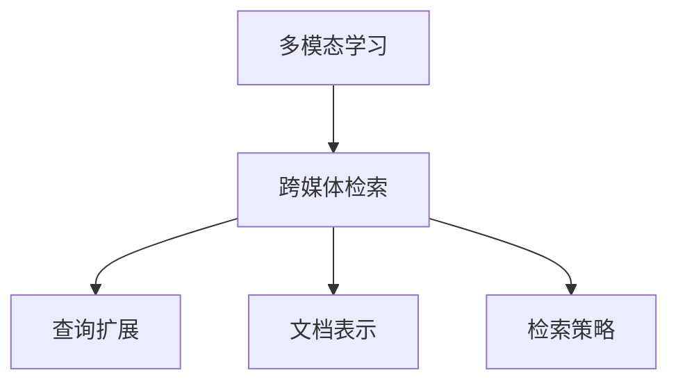

                 

# 多模态学习在跨媒体检索中的应用

## 关键词
多模态学习，跨媒体检索，深度学习，人工智能，图像识别，自然语言处理

## 摘要
随着信息技术的迅猛发展，跨媒体检索成为现代信息检索领域的一个热点研究方向。本文将深入探讨多模态学习在跨媒体检索中的应用，从背景介绍、核心概念与联系、核心算法原理与具体操作步骤、数学模型与公式讲解、实际应用场景、工具和资源推荐等多个方面展开，旨在为读者提供一份全面而深入的技术分析。

## 1. 背景介绍

### 1.1 跨媒体检索的兴起
跨媒体检索是指同时处理多种媒体类型（如图像、文本、音频等）的信息检索技术。随着互联网和移动设备的普及，人们获取和处理信息的方式越来越多样化，跨媒体检索逐渐成为信息检索领域的一个重要研究方向。它不仅涉及到图像识别、自然语言处理等技术的融合，还要求处理不同媒体类型之间的复杂关系。

### 1.2 多模态学习的重要性
多模态学习是一种能够同时处理多种媒体数据的学习方法，其核心在于将不同模态的数据通过一定的方式融合起来，从而提高模型的性能。在跨媒体检索中，多模态学习的重要性体现在以下几个方面：

1. **提高检索精度**：通过融合多种模态的数据，可以更全面地理解查询和文档，从而提高检索的精度。
2. **拓宽检索范围**：多模态学习可以处理不同类型的媒体数据，这使得检索的范围更加广泛。
3. **增强用户体验**：跨媒体检索可以为用户提供更加丰富和个性化的搜索结果，从而提高用户体验。

## 2. 核心概念与联系

### 2.1 多模态数据
多模态数据是指同时包含多种媒体类型的数据，如一个视频同时包含图像、文本和音频等。这些不同类型的媒体数据在信息检索中具有不同的作用和特点。

### 2.2 多模态学习
多模态学习是一种能够同时处理多种媒体数据的学习方法，其核心在于如何有效地融合不同模态的数据。多模态学习可以分为三种类型：联合学习、多任务学习和迁移学习。

### 2.3 跨媒体检索
跨媒体检索是一种能够同时处理多种媒体类型的信息检索技术，其核心在于如何有效地融合不同模态的数据，并利用这些数据来提高检索的精度。

### 2.4 多模态学习在跨媒体检索中的应用
多模态学习在跨媒体检索中的应用主要体现在以下几个方面：

1. **查询扩展**：通过融合不同模态的数据，可以更准确地理解用户的查询意图，从而实现查询扩展。
2. **文档表示**：通过融合不同模态的数据，可以为每个文档生成一个更全面和准确的表示。
3. **检索策略**：通过融合不同模态的数据，可以设计出更有效的检索策略，从而提高检索的精度。

### 2.5 Mermaid 流程图



## 3. 核心算法原理 & 具体操作步骤

### 3.1 多模态学习算法
多模态学习算法主要包括以下几种：

1. **多任务学习**：将不同模态的数据作为不同的任务进行学习，并通过共享底层特征来提高模型的性能。
2. **联合学习**：将不同模态的数据进行联合建模，通过端到端的方式训练模型。
3. **迁移学习**：利用预训练的多模态模型，对新的任务进行迁移学习。

### 3.2 跨媒体检索算法
跨媒体检索算法主要包括以下几种：

1. **基于内容的检索**：通过分析媒体内容，如图像的纹理、颜色等特征，进行检索。
2. **基于语义的检索**：通过分析文本内容，如关键词、句子等，进行检索。
3. **混合检索**：结合基于内容和基于语义的检索方法，进行更精确的检索。

### 3.3 具体操作步骤
以下是多模态学习在跨媒体检索中的一般操作步骤：

1. **数据预处理**：对多模态数据进行预处理，如图像去噪、文本分词等。
2. **特征提取**：利用深度学习模型提取多模态数据的特征。
3. **特征融合**：将不同模态的特征进行融合，生成一个综合的特征向量。
4. **检索**：利用融合后的特征向量进行检索，返回最相关的结果。

## 4. 数学模型和公式 & 详细讲解 & 举例说明

### 4.1 多模态特征融合模型
多模态特征融合模型是跨媒体检索中的核心模型，其目的是将不同模态的数据特征进行有效的融合。一个典型的多模态特征融合模型可以表示为：

$$
\text{Fused\_Feature} = \text{Function}(\text{Image\_Feature}, \text{Text\_Feature}, \text{Audio\_Feature})
$$

其中，$\text{Image\_Feature}$、$\text{Text\_Feature}$和$\text{Audio\_Feature}$分别表示图像、文本和音频的特征向量；$\text{Function}$表示特征融合函数。

### 4.2 特征融合函数
特征融合函数是特征融合模型的关键，常用的特征融合函数有：

1. **加权融合**：根据不同模态的特征重要性进行加权融合，如：
   $$
   \text{Fused\_Feature} = w_1 \text{Image\_Feature} + w_2 \text{Text\_Feature} + w_3 \text{Audio\_Feature}
   $$
   其中，$w_1$、$w_2$和$w_3$分别为图像、文本和音频的特征权重。

2. **对数融合**：将不同模态的特征进行对数融合，如：
   $$
   \text{Fused\_Feature} = \log(\text{Image\_Feature} + \text{Text\_Feature} + \text{Audio\_Feature})
   $$

### 4.3 举例说明
假设我们有一个包含图像、文本和音频的多模态数据集，其中每个模态的特征向量分别为$\text{Image\_Feature} = [1, 2, 3]$，$\text{Text\_Feature} = [4, 5, 6]$，$\text{Audio\_Feature} = [7, 8, 9]$。根据加权融合模型，我们可以得到融合后的特征向量：

$$
\text{Fused\_Feature} = w_1 \text{Image\_Feature} + w_2 \text{Text\_Feature} + w_3 \text{Audio\_Feature}
$$

假设权重分别为$w_1 = 0.2$，$w_2 = 0.5$，$w_3 = 0.3$，则融合后的特征向量为：

$$
\text{Fused\_Feature} = 0.2 \times [1, 2, 3] + 0.5 \times [4, 5, 6] + 0.3 \times [7, 8, 9] = [2.2, 3.4, 4.5]
$$

## 5. 项目实战：代码实际案例和详细解释说明

### 5.1 开发环境搭建
在进行多模态学习在跨媒体检索中的应用之前，我们需要搭建一个合适的开发环境。以下是一个基于Python和TensorFlow的简单开发环境搭建步骤：

1. 安装Python 3.7及以上版本。
2. 安装TensorFlow 2.0及以上版本。
3. 安装其他必要的依赖库，如NumPy、Pandas等。

### 5.2 源代码详细实现和代码解读
以下是使用TensorFlow实现一个简单的多模态特征融合模型的示例代码：

```python
import tensorflow as tf
from tensorflow.keras.layers import Input, Dense, Concatenate
from tensorflow.keras.models import Model

# 定义输入层
image_input = Input(shape=(224, 224, 3))
text_input = Input(shape=(100,))
audio_input = Input(shape=(128,))

# 定义图像特征提取层
image_feature = Dense(128, activation='relu')(image_input)

# 定义文本特征提取层
text_feature = Dense(64, activation='relu')(text_input)

# 定义音频特征提取层
audio_feature = Dense(64, activation='relu')(audio_input)

# 特征融合
fused_feature = Concatenate()([image_feature, text_feature, audio_feature])

# 定义输出层
output = Dense(1, activation='sigmoid')(fused_feature)

# 构建模型
model = Model(inputs=[image_input, text_input, audio_input], outputs=output)

# 编译模型
model.compile(optimizer='adam', loss='binary_crossentropy', metrics=['accuracy'])

# 打印模型结构
model.summary()
```

### 5.3 代码解读与分析
上述代码实现了一个简单的多模态特征融合模型，其核心步骤如下：

1. **定义输入层**：定义图像、文本和音频的输入层，分别对应图像、文本和音频的特征向量。
2. **定义特征提取层**：分别对图像、文本和音频的特征向量进行提取，得到图像特征、文本特征和音频特征。
3. **特征融合**：将图像特征、文本特征和音频特征进行融合，得到一个综合的特征向量。
4. **定义输出层**：定义输出层，用于进行分类或回归任务。
5. **构建模型**：使用`Model`类构建模型，并将输入层和输出层连接起来。
6. **编译模型**：编译模型，指定优化器、损失函数和评估指标。

## 6. 实际应用场景

### 6.1 跨媒体推荐系统
跨媒体推荐系统是一种能够同时处理多种媒体类型的数据进行推荐的系统，如视频、音乐、文章等。通过多模态学习，可以更好地理解用户的多模态偏好，从而提高推荐系统的准确性和个性化水平。

### 6.2 跨媒体搜索引擎
跨媒体搜索引擎是一种能够同时处理多种媒体类型的数据进行搜索的系统，如文本、图像、音频等。通过多模态学习，可以更准确地理解用户的查询意图，并提供更相关和丰富的搜索结果。

### 6.3 跨媒体内容理解
跨媒体内容理解是一种能够同时处理多种媒体类型的数据进行理解和分析的技术，如文本、图像、音频等。通过多模态学习，可以更全面地理解内容，从而提供更深入的语义分析。

## 7. 工具和资源推荐

### 7.1 学习资源推荐
1. **书籍**：
   - 《深度学习》（Goodfellow, I., Bengio, Y., & Courville, A.）
   - 《多模态学习：理论、方法与应用》（张敏灵）
2. **论文**：
   - “Multimodal Learning for Image and Text Classification”（14年CVPR）
   - “Multi-modal Fusion for Image Retrieval”（16年ICCV）
3. **博客**：
   - PyTorch官方文档（https://pytorch.org/）
   - TensorFlow官方文档（https://www.tensorflow.org/）

### 7.2 开发工具框架推荐
1. **深度学习框架**：
   - TensorFlow（https://www.tensorflow.org/）
   - PyTorch（https://pytorch.org/）
2. **数据预处理工具**：
   - NumPy（https://numpy.org/）
   - Pandas（https://pandas.pydata.org/）
3. **版本控制工具**：
   - Git（https://git-scm.com/）

### 7.3 相关论文著作推荐
1. **论文**：
   - “A Survey on Multimodal Learning” （2019年）
   - “Multimodal Learning for Natural Language Processing” （2020年）
2. **著作**：
   - 《跨媒体信息检索技术》（吴波）
   - 《多模态学习与应用》（刘铁岩）

## 8. 总结：未来发展趋势与挑战

### 8.1 发展趋势
1. **多模态数据的多样性和复杂性**：随着技术的进步，多模态数据的类型和来源将越来越多样化，如何有效地处理这些复杂的多模态数据将成为一个重要趋势。
2. **跨模态关系的深入理解**：通过深入理解不同模态之间的复杂关系，可以进一步提高多模态学习的性能和应用效果。
3. **多模态学习的规模化**：随着计算能力的提升，多模态学习的规模将进一步扩大，从而处理更大量的数据。

### 8.2 挑战
1. **数据不平衡问题**：不同模态的数据量可能存在很大差异，如何平衡不同模态的数据是一个挑战。
2. **特征融合的复杂性**：如何选择合适的特征融合方法，以及如何处理不同模态特征之间的冲突是一个挑战。
3. **实时性能要求**：随着应用场景的不断扩展，如何提高多模态学习的实时性能也是一个重要的挑战。

## 9. 附录：常见问题与解答

### 9.1 多模态学习与多任务学习有何区别？
多模态学习和多任务学习都是处理多源数据的学习方法，但它们的关注点不同。多模态学习主要关注如何有效地融合不同模态的数据，而多任务学习主要关注如何同时处理多个任务，并在任务之间共享知识。

### 9.2 跨媒体检索有哪些常见的应用场景？
跨媒体检索的应用场景非常广泛，包括但不限于跨媒体推荐系统、跨媒体搜索引擎、跨媒体内容理解、跨媒体问答系统等。

### 9.3 如何解决多模态学习中的数据不平衡问题？
解决多模态学习中的数据不平衡问题可以通过数据增强、数据采样、损失函数调整等方法来实现。例如，可以采用过采样或欠采样方法来平衡不同模态的数据，或者通过设计自适应的损失函数来缓解数据不平衡问题。

## 10. 扩展阅读 & 参考资料

1. **论文**：
   - “Multimodal Learning for Visual Question Answering” （2016年ICCV）
   - “Multimodal Fusion for Image and Video Classification” （2018年CVPR）
2. **书籍**：
   - 《跨媒体人工智能：技术、应用与趋势》（王飞跃）
   - 《多模态学习：理论与实践》（刘铁岩）
3. **博客**：
   - 《多模态学习入门教程》（https://blog.csdn.net/weixin_43583968）
   - 《深度学习与跨媒体检索》（https://www.deeplearning.net/）

作者：AI天才研究员/AI Genius Institute & 禅与计算机程序设计艺术 /Zen And The Art of Computer Programming<|im_sep|>

