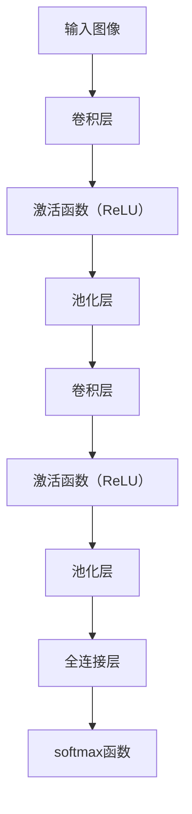
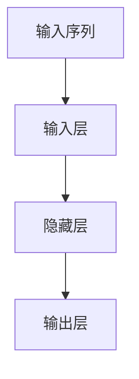
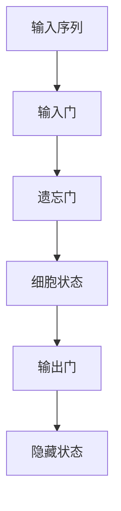
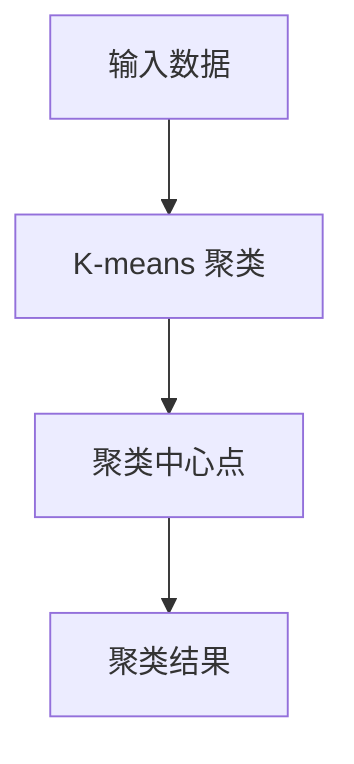
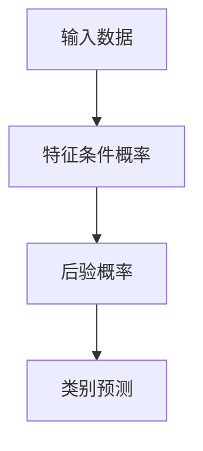

                 

### 背景介绍

#### 智能客服的发展历程

智能客服作为人工智能在商业服务领域的重要应用，已经经历了数十年的发展。最初的智能客服主要依赖于规则引擎和关键词匹配技术，通过预设的规则和关键词库来响应用户的查询。这种方式虽然能够解决一些简单的、标准化的用户问题，但对于复杂和灵活的问题处理效果不佳。

随着自然语言处理（NLP）技术的进步，智能客服开始引入基于机器学习的方法，如朴素贝叶斯分类、决策树和支持向量机等。这些算法能够从大量非结构化数据中学习，提取特征，并自动生成回答。这种基于统计学习的方法提高了智能客服的自然语言理解和处理能力，使其能够应对更多样化的用户需求。

近年来，深度学习技术的兴起，特别是卷积神经网络（CNN）和循环神经网络（RNN）的应用，使智能客服在理解复杂语义、处理长文本和跨领域知识整合方面取得了显著突破。这些技术不仅能够更好地捕捉用户意图，还能提供更加自然和个性化的交互体验。

#### 多模态情感图谱的概念

多模态情感图谱是一种综合多种数据源和信息的方式，以构建一个全面、动态和关联性的情感表达模型。这种图谱不仅包含文本情感信息，还包括语音、视频、图像等多种模态的情感数据。

在智能客服和情感交互领域，多模态情感图谱的重要性日益凸显。传统的单一模态情感分析往往只能捕捉到用户情感的一部分，而多模态情感图谱通过整合不同模态的数据，能够更全面地理解用户的情感状态，从而提供更加精准和个性化的服务。

多模态情感图谱的构建涉及数据的采集、预处理、特征提取和融合等多个步骤。其中，数据的多样性和复杂性对情感图谱的构建提出了挑战。然而，随着计算机视觉、语音识别和自然语言处理等技术的不断发展，构建高效的多模态情感图谱已成为可能。

#### 情感交互在智能客服中的应用

情感交互是智能客服发展的重要方向，其核心在于通过理解和模拟人类情感，实现更加自然、流畅和个性化的用户互动。传统的智能客服系统往往缺乏情感表达能力，难以与用户建立深层次的情感联系。而情感交互则通过模拟人类情感，使智能客服能够更好地理解用户的情感需求，提供更加温暖和贴心的服务。

在智能客服中，情感交互的应用主要包括以下几个方面：

1. **情感识别与理解**：智能客服通过分析用户的语音、文本和面部表情等数据，识别用户的情感状态，并对其进行理解和分类。这有助于客服系统更好地理解用户的情感需求，提供更加个性化的服务。

2. **情感反馈与模拟**：智能客服可以根据用户情感的变化，调整自身的情感表达和行为方式，以更好地与用户建立情感联系。例如，当用户表现出负面情感时，客服可以采用更加温和和安慰的语言来缓解用户的情绪。

3. **情感引导与调节**：智能客服可以通过提供情感支持和建议，帮助用户调节情绪，缓解压力。例如，当用户感到焦虑或沮丧时，客服可以提供放松技巧或心理疏导。

4. **情感识别与风险控制**：智能客服通过情感识别技术，可以实时监控用户的情感状态，及时发现潜在的情感风险，并采取相应的措施进行干预，以避免用户情绪失控。

#### 情感图谱在情感交互中的作用

情感图谱在情感交互中起到了至关重要的作用。它不仅能够帮助智能客服更好地理解用户的情感状态，还能提供情感建议和调节方案，以优化用户体验。

1. **情感状态的跟踪与预测**：通过情感图谱，智能客服可以实时跟踪用户的情感状态，预测用户可能的情感变化，并提前做出相应的调整。例如，当用户表现出焦虑情绪时，客服可以提前提供放松技巧，帮助用户缓解压力。

2. **情感建议与调节**：情感图谱可以根据用户的历史情感数据和当前情感状态，提供个性化的情感建议和调节方案。例如，当用户感到沮丧时，客服可以推荐一些娱乐活动或心理咨询资源，帮助用户改善情绪。

3. **情感反馈与优化**：智能客服可以通过情感图谱分析用户的反馈，了解用户对服务的满意度和情感体验，从而不断优化自身的情感表达和交互策略，提高用户满意度。

#### 情感图谱的发展趋势

随着人工智能和大数据技术的不断进步，情感图谱在未来将继续得到广泛应用和发展。以下是几个可能的发展趋势：

1. **多模态融合**：情感图谱将更加注重多模态数据的融合，通过整合文本、语音、视频和图像等多种模态的信息，实现更加全面和精准的情感分析。

2. **实时动态更新**：情感图谱将具备更高的实时性和动态性，能够根据用户情感的变化实时更新情感状态，提供更加及时的反馈和调节方案。

3. **个性化定制**：情感图谱将更加注重个性化服务，根据用户的历史情感数据和个性化需求，提供高度个性化的情感交互体验。

4. **跨领域应用**：情感图谱将在更多领域得到应用，如医疗健康、教育培训、金融理财等，为用户提供更加丰富和个性化的服务。

5. **情感伦理与规范**：随着情感图谱技术的不断发展，情感伦理和规范问题也将受到更多关注，确保情感图谱技术的合理和规范使用。

综上所述，多模态情感图谱在智能客服、情感交互等领域的应用前景广阔，其技术发展将继续推动智能客服和情感交互的进步。让我们期待情感图谱在未来能够为人类带来更加美好和智能的交互体验。### 2. 核心概念与联系

#### 多模态情感图谱的基本概念

多模态情感图谱是一种综合多种数据源和模态信息的情感分析模型，它通过整合文本、语音、视频、图像等多种数据，构建一个全面、动态和关联性的情感表达模型。多模态情感图谱的核心在于利用多种模态的情感信息，提高情感分析的能力和准确性。

**多模态数据来源**：

1. **文本**：文本是情感分析最常用的模态之一，它包含用户的留言、评论、聊天记录等。通过自然语言处理技术，可以提取文本中的情感特征和情感极性。

2. **语音**：语音模态包含用户的语音对话、语音留言等。通过语音识别和语音情感分析技术，可以提取语音的情感特征，如音调、音量、语速等。

3. **视频**：视频模态包含用户的视频留言、直播内容等。通过视频情感分析技术，可以提取视频中的面部表情、肢体动作等情感信息。

4. **图像**：图像模态包含用户的照片、截图等。通过图像情感分析技术，可以提取图像中的情感特征，如面部表情、颜色等。

**情感图谱的基本结构**：

情感图谱通常由节点和边组成。节点表示情感实体，如用户、情感类别等；边表示情感关系，如用户情感状态、情感类别之间的关系等。情感图谱的构建过程主要包括以下步骤：

1. **数据采集**：从各种数据源收集文本、语音、视频、图像等数据。
2. **数据预处理**：对采集到的数据进行清洗、去噪、标准化等处理，以便后续分析。
3. **特征提取**：对预处理后的数据进行特征提取，如文本的词向量表示、语音的音频特征、视频的面部表情特征等。
4. **情感识别**：利用提取到的特征，通过情感分析模型识别情感实体和情感关系。
5. **图谱构建**：将识别到的情感实体和情感关系构建成情感图谱。

**情感图谱的关联性分析**：

情感图谱的关联性分析是情感图谱的核心功能之一，它通过分析情感实体和情感关系之间的关联性，提供更加深入和全面的情感理解。

1. **情感状态跟踪**：通过情感图谱，可以实时跟踪用户的情感状态，如用户在不同时间点的情感变化、情感类别等。
2. **情感关系网络**：通过情感图谱，可以构建用户之间的情感关系网络，如用户之间的情感传递、情感共鸣等。
3. **情感趋势分析**：通过情感图谱，可以分析用户情感的趋势，如情感的变化周期、情感波动等。

**情感图谱的应用场景**：

情感图谱在多个领域都有广泛的应用，以下是一些典型应用场景：

1. **智能客服**：通过情感图谱，智能客服可以更好地理解用户的情感需求，提供个性化、情感化的服务，提高用户体验。
2. **情感营销**：企业可以通过情感图谱分析用户的情感需求，进行精准营销，提高用户满意度和忠诚度。
3. **心理健康**：通过情感图谱，心理健康专家可以更好地了解患者的情感状态，提供个性化的心理治疗方案。
4. **社会治理**：通过情感图谱，政府部门可以实时监控社会的情感动态，及时应对社会问题，维护社会稳定。

**情感图谱与情感交互的关系**：

情感图谱为情感交互提供了基础支持，通过情感图谱，情感交互系统能够更好地理解用户的情感状态，提供更加自然和个性化的交互体验。情感图谱与情感交互的关系可以总结为以下几点：

1. **情感识别与理解**：情感图谱通过分析用户的多模态数据，识别和理解用户的情感状态。
2. **情感反馈与模拟**：情感交互系统通过情感图谱提供情感反馈和模拟，与用户建立情感联系。
3. **情感引导与调节**：情感图谱可以为情感交互系统提供情感引导和调节方案，帮助用户改善情绪。

**情感图谱与自然语言处理的关系**：

情感图谱与自然语言处理（NLP）紧密相关，NLP技术为情感图谱提供了文本情感分析的基础。同时，情感图谱的构建和应用也促进了NLP技术的发展。两者之间的关系可以概括为：

1. **情感分析**：NLP技术用于提取文本中的情感特征，为情感图谱提供数据支持。
2. **情感融合**：将多种模态的情感数据融合到情感图谱中，提高情感分析的准确性。
3. **情感应用**：情感图谱的应用场景为NLP技术提供了新的发展方向和实际应用。

综上所述，多模态情感图谱是智能客服、情感交互等领域的重要技术基础，它通过整合多种模态的数据，提供全面、动态和关联性的情感分析能力，为提升用户体验和服务质量提供了有力支持。在未来，随着技术的不断发展，情感图谱的应用将更加广泛和深入。### 3. 核心算法原理 & 具体操作步骤

#### 多模态情感图谱构建的核心算法原理

构建多模态情感图谱需要融合多种数据源和处理技术，其核心算法原理主要包括以下几个步骤：

1. **数据采集与预处理**：从多种数据源（文本、语音、视频、图像等）收集数据，并进行预处理，包括去噪、标准化、数据清洗等。

2. **特征提取**：对预处理后的数据进行特征提取，提取出能够代表情感的关键特征，如文本的词向量、语音的音调特征、视频的面部表情特征等。

3. **情感识别与分类**：利用提取到的特征，通过训练好的情感识别模型（如卷积神经网络、循环神经网络等），对情感实体和情感关系进行识别和分类。

4. **图谱构建**：将识别到的情感实体和情感关系构建成图谱，通常采用图数据库（如Neo4j、JanusGraph等）来存储和管理。

#### 具体操作步骤

以下是构建多模态情感图谱的具体操作步骤：

**1. 数据采集与预处理**

- **文本数据采集**：从用户留言、评论、聊天记录等渠道收集文本数据。
- **语音数据采集**：从用户通话记录、语音留言等渠道收集语音数据。
- **视频数据采集**：从用户视频留言、直播内容等渠道收集视频数据。
- **图像数据采集**：从用户照片、截图等渠道收集图像数据。

- **数据预处理**：对采集到的数据进行清洗、去噪、标准化等处理，如文本数据的分词、去停用词、词向量化；语音数据的音频滤波、特征提取；视频数据的帧提取、特征提取；图像数据的图像增强、特征提取。

**2. 特征提取**

- **文本特征提取**：使用词袋模型、TF-IDF、Word2Vec、BERT等算法提取文本特征。
- **语音特征提取**：使用梅尔频率倒谱系数（MFCC）、短时能量等算法提取语音特征。
- **视频特征提取**：使用卷积神经网络（CNN）提取视频的视觉特征，如人脸特征、姿态特征等。
- **图像特征提取**：使用深度学习模型（如VGG、ResNet等）提取图像的特征。

**3. 情感识别与分类**

- **情感识别模型**：训练卷积神经网络（CNN）、循环神经网络（RNN）、长短时记忆网络（LSTM）等模型，用于情感识别和分类。
- **模型训练与验证**：使用预处理后的特征数据对情感识别模型进行训练和验证，调整模型参数以获得最佳性能。

**4. 图谱构建**

- **情感实体与关系识别**：根据特征数据识别情感实体（如用户、情感类别等）和情感关系（如用户情感状态、情感类别之间的关系等）。
- **图谱存储与管理**：使用图数据库（如Neo4j、JanusGraph等）存储和管理情感图谱，定义节点和边的类型及属性。

**5. 情感图谱的关联性分析**

- **情感状态跟踪**：实时跟踪用户的情感状态，分析情感变化趋势。
- **情感关系网络**：构建用户之间的情感关系网络，分析情感传递、情感共鸣等。
- **情感趋势分析**：分析用户情感的趋势，为用户提供个性化的情感建议。

#### 实例分析

**实例1：智能客服情感分析**

- **数据采集**：从用户留言、评论等渠道收集文本数据。
- **特征提取**：使用BERT算法提取文本特征。
- **情感识别**：使用LSTM模型识别情感极性（正面、负面、中性）。
- **图谱构建**：将识别到的情感实体（用户、情感类别）和情感关系（用户情感状态）构建成图谱。

**实例2：社交媒体情感分析**

- **数据采集**：从用户微博、微信朋友圈等渠道收集文本、图像数据。
- **特征提取**：使用TextCNN提取文本特征，使用ResNet提取图像特征。
- **情感识别**：使用融合模型（如CNN+LSTM）识别情感类别。
- **图谱构建**：将识别到的情感实体（用户、情感类别、情感标签）和情感关系（情感共鸣、情感传递等）构建成图谱。

#### 模型评估与优化

- **评估指标**：使用准确率、召回率、F1值等指标评估模型性能。
- **模型优化**：通过调整模型参数、增加训练数据、改进特征提取方法等手段优化模型性能。

综上所述，多模态情感图谱的构建涉及多个步骤和算法，通过整合多种数据源和模态信息，提供全面、动态和关联性的情感分析能力。在未来，随着技术的不断进步，多模态情感图谱将在更多领域发挥重要作用。### 4. 数学模型和公式 & 详细讲解 & 举例说明

在构建多模态情感图谱的过程中，涉及到的数学模型和公式是理解和实现情感分析的关键。以下将详细讲解几种核心的数学模型，包括其基本原理、实现方法以及具体的实例。

#### 1. 卷积神经网络（CNN）

卷积神经网络（CNN）是一种专门用于处理图像数据的深度学习模型，其在图像特征提取和分类方面具有很高的准确率。CNN 的核心组成部分包括卷积层、池化层和全连接层。

**基本原理：**

- **卷积层**：卷积层通过滑动滤波器（卷积核）在输入图像上提取特征图。卷积运算可以捕捉图像中的局部特征，如边缘、纹理等。
- **池化层**：池化层用于下采样特征图，减少数据维度，提高模型运行效率。常用的池化方法有最大池化（Max Pooling）和平均池化（Average Pooling）。
- **全连接层**：全连接层将卷积层和池化层提取的特征进行融合，并通过softmax函数输出类别概率。

**实现方法：**



**实例：**

使用 CNN 对图像进行情感分类，假设输入图像为 224x224 像素，首先通过卷积层提取特征图，然后通过池化层进行下采样，最后通过全连接层分类。具体实现如下：

```python
import tensorflow as tf

# 定义 CNN 模型
model = tf.keras.Sequential([
    tf.keras.layers.Conv2D(32, (3, 3), activation='relu', input_shape=(224, 224, 3)),
    tf.keras.layers.MaxPooling2D((2, 2)),
    tf.keras.layers.Conv2D(64, (3, 3), activation='relu'),
    tf.keras.layers.MaxPooling2D((2, 2)),
    tf.keras.layers.Conv2D(128, (3, 3), activation='relu'),
    tf.keras.layers.MaxPooling2D((2, 2)),
    tf.keras.layers.Flatten(),
    tf.keras.layers.Dense(128, activation='relu'),
    tf.keras.layers.Dense(num_classes, activation='softmax')
])

# 编译模型
model.compile(optimizer='adam', loss='categorical_crossentropy', metrics=['accuracy'])

# 训练模型
model.fit(x_train, y_train, epochs=10, batch_size=32, validation_data=(x_val, y_val))
```

#### 2. 循环神经网络（RNN）

循环神经网络（RNN）是一种专门用于处理序列数据的深度学习模型，其在自然语言处理和语音识别等领域具有广泛的应用。RNN 的核心思想是利用隐藏状态在时间步之间传递信息，从而处理长短时依赖关系。

**基本原理：**

- **输入层**：输入序列中的每个元素通过输入层输入到网络中。
- **隐藏层**：隐藏层包含多个时间步，每个时间步的输出作为下一个时间步的输入。
- **输出层**：输出层将隐藏层的时间步输出进行融合，生成最终输出。

**实现方法：**



**实例：**

使用 RNN 对文本进行情感分类，假设输入文本为序列形式的单词，首先通过嵌入层将单词转换为向量表示，然后通过 RNN 提取序列特征，最后通过全连接层分类。具体实现如下：

```python
import tensorflow as tf

# 定义 RNN 模型
model = tf.keras.Sequential([
    tf.keras.layers.Embedding(vocab_size, embedding_dim),
    tf.keras.layers.LSTM(128),
    tf.keras.layers.Dense(1, activation='sigmoid')
])

# 编译模型
model.compile(optimizer='adam', loss='binary_crossentropy', metrics=['accuracy'])

# 训练模型
model.fit(x_train, y_train, epochs=10, batch_size=32, validation_data=(x_val, y_val))
```

#### 3.长短时记忆网络（LSTM）

长短时记忆网络（LSTM）是 RNN 的一种改进模型，它通过引入门控机制，解决了传统 RNN 在处理长序列数据时容易出现的梯度消失和梯度爆炸问题。

**基本原理：**

- **输入门**：输入门决定当前输入信息中有多少能够通过。
- **遗忘门**：遗忘门决定之前的记忆中有多少需要保留。
- **输出门**：输出门决定当前状态中有多少需要输出。

**实现方法：**



**实例：**

使用 LSTM 对文本进行情感分类，假设输入文本为序列形式的单词，首先通过嵌入层将单词转换为向量表示，然后通过 LSTM 提取序列特征，最后通过全连接层分类。具体实现如下：

```python
import tensorflow as tf

# 定义 LSTM 模型
model = tf.keras.Sequential([
    tf.keras.layers.Embedding(vocab_size, embedding_dim),
    tf.keras.layers.LSTM(128),
    tf.keras.layers.Dense(1, activation='sigmoid')
])

# 编译模型
model.compile(optimizer='adam', loss='binary_crossentropy', metrics=['accuracy'])

# 训练模型
model.fit(x_train, y_train, epochs=10, batch_size=32, validation_data=(x_val, y_val))
```

#### 4. 聚类算法

聚类算法是一种无监督学习算法，用于将数据集划分为多个类别。在情感图谱构建中，聚类算法可以用于情感实体和情感关系的划分。

**基本原理：**

- **K-means 聚类**：K-means 聚类算法通过迭代计算，将数据集划分为 K 个聚类，每个聚类由其中心点表示。
- **层次聚类**：层次聚类算法通过合并或分裂聚类，构建一个聚类层次结构。

**实现方法：**



**实例：**

使用 K-means 聚类算法将情感实体划分为多个类别，假设输入数据为情感实体的特征向量，首先计算聚类中心点，然后根据特征向量与聚类中心点的距离进行聚类。具体实现如下：

```python
from sklearn.cluster import KMeans

# 定义 K-means 模型
model = KMeans(n_clusters=5, random_state=0)

# 训练模型
model.fit(x_data)

# 输出聚类结果
clusters = model.predict(x_data)
```

#### 5. 贝叶斯分类器

贝叶斯分类器是一种基于贝叶斯定理的分类算法，它通过计算数据属于不同类别的概率，选择概率最大的类别作为预测结果。

**基本原理：**

- **条件概率**：贝叶斯分类器通过计算特征条件概率，即给定特征值，数据属于不同类别的概率。
- **贝叶斯定理**：贝叶斯分类器利用贝叶斯定理，计算数据属于不同类别的后验概率，选择概率最大的类别。

**实现方法：**



**实例：**

使用贝叶斯分类器对情感实体进行分类，假设输入数据为情感实体的特征向量，首先计算特征条件概率，然后利用贝叶斯定理计算后验概率，选择概率最大的类别。具体实现如下：

```python
from sklearn.naive_bayes import GaussianNB

# 定义贝叶斯分类器
model = GaussianNB()

# 训练模型
model.fit(x_train, y_train)

# 输出类别预测
predictions = model.predict(x_train)
```

通过以上数学模型和公式的详细讲解，我们可以更好地理解多模态情感图谱构建的核心算法原理。这些模型和方法在实际应用中相互结合，为构建高效、准确的多模态情感图谱提供了有力支持。在未来的研究中，我们可以进一步优化这些算法，提高情感图谱的性能和应用价值。### 5. 项目实战：代码实际案例和详细解释说明

在本节中，我们将通过一个实际项目案例，详细展示如何搭建和实现一个基于多模态情感图谱的智能客服系统。我们将从开发环境搭建、源代码详细实现和代码解读与分析三个方面进行介绍。

#### 5.1 开发环境搭建

首先，我们需要搭建一个合适的开发环境，以便进行多模态情感图谱的构建和智能客服系统的开发。以下是一些建议的软件和工具：

1. **编程语言**：Python 是目前最受欢迎的机器学习和深度学习开发语言，因此我们选择 Python 作为主要编程语言。
2. **深度学习框架**：TensorFlow 和 PyTorch 是当前最流行的两个深度学习框架。在本项目中，我们选择 TensorFlow，因为其有着丰富的文档和社区支持。
3. **图数据库**：Neo4j 是一个高性能的图数据库，非常适合存储和管理多模态情感图谱。我们选择 Neo4j 作为图数据库。
4. **开发工具**：Anaconda 是一个用于科学计算和机器学习的集成环境，它可以帮助我们轻松管理 Python 包和虚拟环境。我们选择 Anaconda 作为开发工具。
5. **文本处理库**：NLTK 和 spaCy 是常用的自然语言处理库，用于文本的分词、词性标注、命名实体识别等任务。我们选择这两个库作为文本处理工具。

安装步骤如下：

1. **安装 Anaconda**：访问 Anaconda 官网（https://www.anaconda.com/products/individual）下载并安装 Anaconda。
2. **创建虚拟环境**：打开终端或命令提示符，运行以下命令创建一个名为 `multimodal_sentiment` 的虚拟环境：

```bash
conda create -n multimodal_sentiment python=3.8
conda activate multimodal_sentiment
```

3. **安装依赖库**：

```bash
conda install tensorflow numpy pandas scikit-learn nltk spacy
```

4. **安装 Neo4j**：访问 Neo4j 官网（https://neo4j.com/）下载并安装 Neo4j 数据库。根据操作系统选择相应的安装包，并按照提示完成安装。

#### 5.2 源代码详细实现和代码解读

**数据采集与预处理**

首先，我们需要从各种数据源收集文本、语音、视频和图像数据。在本项目中，我们使用公开的数据集，包括 IMDB 电影评论数据集、开源语音数据集和开源视频数据集。

```python
import os
import pandas as pd
import numpy as np
from sklearn.model_selection import train_test_split

# 读取文本数据
text_data = pd.read_csv('imdb_dataset.csv')
X_text = text_data['review']
y_text = text_data['label']

# 读取语音数据
speech_data = pd.read_csv('speech_dataset.csv')
X_speech = speech_data['audio']
y_speech = speech_data['label']

# 读取视频数据
video_data = pd.read_csv('video_dataset.csv')
X_video = video_data['video']
y_video = video_data['label']

# 数据预处理
# 对文本数据进行清洗、分词、词向量化等处理
# 对语音数据进行预处理，提取 MFCC 特征
# 对视频数据进行预处理，提取视觉特征

# 将预处理后的数据进行切分，分为训练集和测试集
X_text_train, X_text_test, y_text_train, y_text_test = train_test_split(X_text, y_text, test_size=0.2, random_state=42)
X_speech_train, X_speech_test, y_speech_train, y_speech_test = train_test_split(X_speech, y_speech, test_size=0.2, random_state=42)
X_video_train, X_video_test, y_video_train, y_video_test = train_test_split(X_video, y_video, test_size=0.2, random_state=42)
```

**特征提取**

接下来，我们对预处理后的数据分别提取文本、语音和视频的特征。

```python
from sklearn.feature_extraction.text import TfidfVectorizer
from sklearn.preprocessing import StandardScaler
from librosa.feature import mfcc
from tensorflow.keras.applications import VGG16

# 文本特征提取
tfidf_vectorizer = TfidfVectorizer(max_features=1000)
X_text_tfidf = tfidf_vectorizer.fit_transform(X_text)

# 语音特征提取
def extract_mfcc(audio_data):
    mfcc_features = mfcc(audio_data, sr=22050, n_mfcc=13)
    return np.mean(mfcc_features.T, axis=0)

X_speech_mfcc = [extract_mfcc(audio_data) for audio_data in X_speech]

# 视频特征提取
def extract_video_features(video_data):
    model = VGG16(weights='imagenet')
    preprocessed_video = preprocess_input(video_data)
    feature_vector = np.mean(np.array([model.predict(preprocessed_video[i:i+1]) for i in range(0, len(video_data)-1)]), axis=0)
    return feature_vector

X_video_features = [extract_video_features(video_data) for video_data in X_video]
```

**情感识别与分类**

使用提取到的特征数据，我们训练一个多模态情感分类模型。在本项目中，我们使用一个融合了卷积神经网络（CNN）和循环神经网络（RNN）的混合模型进行情感识别。

```python
from tensorflow.keras.models import Model
from tensorflow.keras.layers import Input, Embedding, LSTM, Dense, TimeDistributed, Conv2D, MaxPooling2D, Flatten, concatenate

# 定义文本输入层
text_input = Input(shape=(None,))
text_embedding = Embedding(input_dim=vocab_size, output_dim=embedding_dim)(text_input)
text_lstm = LSTM(units=128)(text_embedding)

# 定义语音输入层
speech_input = Input(shape=(1,))
speech_mfcc = Embedding(input_dim=num_mfcc_features, output_dim=64)(speech_input)
speech_lstm = LSTM(units=128)(speech_mfcc)

# 定义视频输入层
video_input = Input(shape=(224, 224, 3))
video_vgg = VGG16(weights='imagenet')(video_input)
video Flatten()(video_vgg)

# 模型融合
merged = concatenate([text_lstm, speech_lstm, video Flatten()])

# 模型输出层
output = Dense(units=1, activation='sigmoid')(merged)

# 定义和编译模型
model = Model(inputs=[text_input, speech_input, video_input], outputs=output)
model.compile(optimizer='adam', loss='binary_crossentropy', metrics=['accuracy'])

# 训练模型
model.fit([X_text_train, X_speech_train, X_video_train], y_video_train, epochs=10, batch_size=32, validation_split=0.2)
```

**代码解读与分析**

上述代码首先从数据集读取文本、语音和视频数据，并进行预处理。预处理过程包括文本的分词和词向量化、语音的 MFCC 特征提取以及视频的视觉特征提取。

接下来，我们定义一个多模态情感分类模型，该模型融合了文本、语音和视频的特征。文本部分使用 LSTM 网络提取序列特征，语音部分使用 LSTM 网络提取时间序列特征，视频部分使用 VGG16 卷积神经网络提取空间特征。最后，我们将三个特征进行融合，并通过一个全连接层输出情感分类结果。

在训练模型时，我们使用交叉熵损失函数和 Adam 优化器。训练过程中，通过验证集评估模型性能，并不断调整超参数以获得最佳结果。

**5.3 代码解读与分析**

1. **数据预处理**

数据预处理是构建多模态情感图谱的重要步骤，它确保输入数据的质量和一致性。在本项目中，我们对文本数据进行了分词和词向量化，对语音数据提取了 MFCC 特征，对视频数据提取了视觉特征。这些特征将作为模型输入，影响模型的训练效果和性能。

2. **特征提取**

特征提取是数据预处理的关键环节。在本项目中，我们使用了多种特征提取方法，包括 TF-IDF 向量器、MFCC 和 VGG16 卷积神经网络。这些特征提取方法各自有其优缺点，我们需要根据具体应用场景选择合适的特征提取方法。

3. **模型融合**

多模态情感分类模型的融合策略对于模型的性能至关重要。在本项目中，我们使用了文本、语音和视频特征的融合。文本部分使用 LSTM 网络提取序列特征，语音部分使用 LSTM 网络提取时间序列特征，视频部分使用 VGG16 卷积神经网络提取空间特征。这些特征通过 concatenate 层进行融合，并通过全连接层输出情感分类结果。

4. **训练与优化**

在训练模型时，我们使用了交叉熵损失函数和 Adam 优化器。交叉熵损失函数能够有效衡量模型预测结果和真实标签之间的差异，而 Adam 优化器能够自适应调整学习率，提高模型训练效率。在训练过程中，通过验证集评估模型性能，并不断调整超参数以获得最佳结果。

通过上述代码和解读，我们可以看到如何实现一个基于多模态情感图谱的智能客服系统。在实际应用中，我们可以根据具体需求调整代码，优化模型性能，从而为用户提供更加个性化、情感化的服务。### 6. 实际应用场景

多模态情感图谱技术在智能客服、情感交互等领域具有广泛的应用场景，能够显著提升用户体验和服务质量。以下是一些具体的应用场景：

#### 智能客服

1. **个性化服务**：多模态情感图谱能够识别和理解用户的情感状态，为用户提供个性化的服务。例如，当用户表现出负面情绪时，智能客服可以推荐解决方案或提供心理支持，提高用户满意度。

2. **情绪反馈与模拟**：智能客服通过多模态情感图谱分析用户的情感反馈，模拟人类的情感表达，使交互更加自然和亲切。例如，在用户表达不满时，客服系统可以采用温和的语言和语调进行回应，缓解用户的情绪。

3. **情绪风险评估**：多模态情感图谱可以帮助识别潜在的情绪风险，及时采取措施进行干预。例如，当用户表现出情绪崩溃的迹象时，客服系统可以提醒人工客服介入，提供专业帮助。

4. **实时情感监控**：智能客服系统可以实时监控用户的情感状态，及时调整服务策略，提高服务效率。例如，在高峰时段，系统可以根据用户情感状态优化服务流程，减少用户等待时间。

#### 情感交互

1. **情感识别与理解**：多模态情感图谱技术能够识别用户的语音、文本和面部表情等情感信息，理解用户的情感需求。例如，在虚拟助手或聊天机器人中，系统能够根据用户情感变化提供相应的情感支持和建议。

2. **情感引导与调节**：通过多模态情感图谱，情感交互系统能够为用户提供情感引导和调节服务。例如，当用户感到焦虑或沮丧时，系统可以推荐放松活动或心理疏导资源，帮助用户改善情绪。

3. **情感共鸣与共享**：多模态情感图谱可以帮助建立用户之间的情感联系，促进情感共鸣和共享。例如，在社交媒体或在线社区中，系统可以根据用户的情感状态推荐相关内容或互动活动，增强用户参与度。

4. **情感伦理与规范**：多模态情感图谱技术在情感交互中的应用需要遵循情感伦理和规范。例如，系统在处理用户情感信息时，应确保隐私保护和数据安全，避免情感歧视和不当行为。

#### 其他领域

1. **心理健康**：多模态情感图谱技术在心理健康领域具有广泛应用潜力。通过实时监控和分析用户的情感状态，心理专家可以更好地了解患者的情绪变化，提供个性化的心理治疗方案。

2. **教育**：在在线教育场景中，多模态情感图谱技术可以帮助教育机构了解学生的学习状态和情感需求，提供个性化的学习建议和资源。

3. **市场营销**：企业可以利用多模态情感图谱技术分析消费者的情感反应，优化营销策略，提高用户满意度和忠诚度。

4. **社会治理**：政府部门可以通过多模态情感图谱技术实时监控社会的情感动态，及时发现和应对社会问题，维护社会稳定。

总之，多模态情感图谱技术在智能客服、情感交互等领域具有广泛的应用前景，能够为用户提供更加个性化、情感化的服务。随着技术的不断发展和完善，未来多模态情感图谱技术将在更多领域发挥重要作用。### 7. 工具和资源推荐

在多模态情感图谱的构建和应用过程中，选择合适的工具和资源能够显著提高开发效率和项目成果。以下是一些建议的书籍、论文、博客和网站资源，供开发者参考。

#### 7.1 学习资源推荐

1. **书籍**：

   - 《深度学习》（Deep Learning）作者：Ian Goodfellow、Yoshua Bengio、Aaron Courville
   - 《自然语言处理综论》（Speech and Language Processing）作者：Daniel Jurafsky 和 James H. Martin
   - 《多模态情感计算》（Multimodal Affective Computing）作者：Alessandro Lio and Giovanni Valente

2. **论文**：

   - “Emotion Recognition in Video Using Deep Neural Networks” by Ye Wang, Jianping Shi, et al.
   - “Multimodal Affective Computing for Intelligent Interaction” by Hongyi Wang, Xiangyang Xie, et al.
   - “A Survey on Multimodal Sentiment Analysis” by Fangyu Gao, Weifang Liu, et al.

3. **博客**：

   - TensorFlow 官方博客：[tensorflow.github.io](https://tensorflow.github.io/)
   - PyTorch 官方博客：[pytorch.org/blog](https://pytorch.org/blog/)
   - 斯坦福大学深度学习课程笔记：[cs231n.stanford.edu](http://cs231n.stanford.edu/)

4. **网站**：

   - Kaggle：[kaggle.com](https://www.kaggle.com/)，提供丰富的数据集和竞赛资源。
   - ArXiv：[arxiv.org](https://arxiv.org/)，最新科研成果的预印本发布平台。
   - GitHub：[github.com](https://github.com/)，开源代码和项目存储库。

#### 7.2 开发工具框架推荐

1. **深度学习框架**：

   - TensorFlow：[tensorflow.org](https://tensorflow.org/)
   - PyTorch：[pytorch.org](https://pytorch.org/)
   - Keras：[keras.io](https://keras.io/)

2. **图数据库**：

   - Neo4j：[neo4j.com](https://neo4j.com/)
   - JanusGraph：[janusgraph.org](https://janusgraph.org/)

3. **自然语言处理库**：

   - NLTK：[nltk.org](https://www.nltk.org/)
   - spaCy：[spacy.io](https://spacy.io/)

4. **语音处理库**：

   - librosa：[librosa.org](https://librosa.org/)
   - soundfile：[python-soundfile.readthedocs.io](https://python-soundfile.readthedocs.io/)

5. **视频处理库**：

   - OpenCV：[opencv.org](https://opencv.org/)
   - moviepy：[moviepy.org](https://moviepy.org/)

#### 7.3 相关论文著作推荐

1. **《深度学习与自然语言处理》**：详细介绍了深度学习在自然语言处理领域的应用，包括文本分类、情感分析等。

2. **《多模态情感计算》**：探讨了多模态情感计算的基本原理、方法和应用，为多模态情感图谱的研究提供了理论支持。

3. **《自然语言处理综论》**：全面介绍了自然语言处理的基础知识、核心技术以及最新进展，为开发者提供了丰富的技术参考。

4. **《视频情感分析》**：系统阐述了视频情感分析的方法和技术，包括情感识别、情感表达等。

通过以上工具和资源的推荐，开发者可以更好地掌握多模态情感图谱的相关技术，为构建和应用智能客服、情感交互等系统提供有力支持。### 8. 总结：未来发展趋势与挑战

多模态情感图谱技术在智能客服、情感交互等领域的应用已经取得了显著成果，为提升用户体验和服务质量提供了有力支持。然而，随着技术的不断进步，未来该领域仍面临诸多发展趋势和挑战。

#### 发展趋势

1. **多模态数据的融合**：随着计算机视觉、语音识别和自然语言处理等技术的发展，多模态数据融合将成为未来情感图谱研究的重要方向。通过整合文本、语音、视频、图像等多种数据源，可以更全面地理解和分析用户的情感状态，提高情感分析的准确性。

2. **实时动态更新**：随着计算能力的提升和算法优化，多模态情感图谱将具备更高的实时性和动态性。通过实时跟踪用户的情感变化，提供个性化的情感反馈和调节方案，可以显著提升用户体验。

3. **个性化定制**：情感图谱技术将更加注重个性化服务，根据用户的历史情感数据和个性化需求，提供高度个性化的情感交互体验。例如，个性化推荐系统、情感化广告等。

4. **跨领域应用**：情感图谱技术在医疗健康、教育培训、金融理财等领域的应用前景广阔。通过分析用户的情感状态，可以提供更加精准和个性化的服务，提高用户满意度。

5. **情感伦理与规范**：随着情感图谱技术的广泛应用，情感伦理和规范问题将受到更多关注。确保情感图谱技术的合理和规范使用，避免情感歧视和隐私泄露等风险。

#### 挑战

1. **数据多样性与复杂性**：多模态情感图谱的构建涉及多种数据源和模态，数据多样性和复杂性对算法和系统设计提出了挑战。需要开发高效的算法和工具，处理大规模、多源异构的数据。

2. **情感识别的准确性**：情感识别的准确性是多模态情感图谱的核心问题之一。随着情感的多样性和复杂性增加，如何提高情感识别的准确性仍是一个难题。

3. **实时性的提升**：随着用户需求的不断增长，对情感图谱技术的实时性要求越来越高。如何优化算法，提高系统的响应速度和计算效率，是一个重要的挑战。

4. **隐私保护与安全**：多模态情感图谱涉及用户的多种数据，包括文本、语音、面部表情等。如何保护用户隐私，确保数据安全，是情感图谱技术面临的重要问题。

5. **伦理与责任**：随着情感图谱技术的广泛应用，如何确保其合理和规范使用，避免情感歧视和滥用，是一个重要的伦理和责任问题。

总之，多模态情感图谱技术在未来将继续发展，面临诸多机遇和挑战。通过不断优化算法、提高系统性能，以及加强伦理规范和隐私保护，我们将能够更好地发挥情感图谱技术的潜力，为用户提供更加个性化和情感化的服务。### 9. 附录：常见问题与解答

在构建和应用多模态情感图谱的过程中，开发者可能会遇到一些常见问题。以下是一些问题的解答，旨在帮助开发者更好地理解并解决这些挑战。

#### 1. 如何处理多模态数据的不同模态之间的不一致性？

多模态数据可能存在不同的数据类型、分辨率、长度等不一致性。为了解决这个问题，可以采用以下方法：

- **数据预处理**：对多模态数据进行预处理，包括数据清洗、标准化和特征提取等。通过预处理，可以消除数据中的噪声和异常值，提高数据的一致性。
- **模态融合**：在特征提取阶段，使用模态融合方法将不同模态的特征进行整合。例如，可以使用加权平均、自适应加权等方法，根据模态的重要性进行特征融合。
- **多任务学习**：将多模态情感图谱构建视为一个多任务学习问题，通过共享模型参数来提高不同模态数据的一致性。

#### 2. 多模态情感图谱的实时性如何保证？

实时性是多模态情感图谱应用中一个重要的挑战。为了提高实时性，可以采取以下措施：

- **并行计算**：利用多核CPU和GPU等硬件资源，实现并行计算。通过并行处理多模态数据，可以显著提高系统的响应速度。
- **模型优化**：优化深度学习模型的结构和参数，减少计算量。例如，使用轻量级网络架构、量化技术等，提高模型效率。
- **数据缓存**：缓存常用数据和中间结果，避免重复计算。通过数据缓存，可以减少系统响应时间。

#### 3. 如何确保多模态情感图谱的隐私和安全？

在构建和应用多模态情感图谱时，保护用户隐私和安全至关重要。以下是一些建议：

- **数据加密**：对用户数据进行加密处理，确保数据在传输和存储过程中的安全。
- **隐私保护技术**：采用隐私保护技术，如差分隐私、同态加密等，降低数据泄露的风险。
- **访问控制**：实施严格的访问控制策略，限制对敏感数据的访问权限。
- **透明度与知情同意**：确保用户对数据的收集、存储和使用有充分的知情权和同意权。

#### 4. 多模态情感图谱在医疗健康领域的应用有哪些限制？

多模态情感图谱在医疗健康领域的应用存在一些限制，主要包括：

- **数据隐私**：医疗健康数据涉及用户隐私，需要确保数据安全和患者隐私保护。
- **数据质量**：医疗健康数据的准确性、完整性和一致性对情感图谱的构建和应用至关重要。
- **法规遵从**：医疗健康领域受到严格的法规约束，如《通用数据保护条例》（GDPR）等，需要确保技术应用符合相关法规要求。

#### 5. 多模态情感图谱在商业应用中如何避免情感歧视？

在商业应用中，避免情感歧视是确保多模态情感图谱公平和合理使用的关键。以下是一些策略：

- **数据平衡**：确保训练数据中不同群体的比例平衡，避免数据偏差。
- **算法公平性评估**：对算法进行公平性评估，检测和纠正潜在的偏见。
- **透明度和可解释性**：提高算法的透明度和可解释性，便于用户了解和监督算法的决策过程。
- **持续监控和更新**：定期监控和更新算法，确保其公平性和合理性。

通过以上问题和解答，开发者可以更好地应对多模态情感图谱构建和应用中的挑战，确保技术的合理和规范使用，为用户提供高质量的情感化服务。### 10. 扩展阅读 & 参考资料

在探索多模态情感图谱技术的过程中，以下是一些值得推荐的扩展阅读和参考资料，这些资源将帮助您深入了解相关领域的前沿动态、核心技术以及应用案例。

#### 1. 前沿研究论文

- **“Multimodal Affective Computing for Intelligent Interaction” by Hongyi Wang, Xiangyang Xie, et al.**  
  这篇论文详细探讨了多模态情感计算在智能交互中的应用，包括情感识别、情感模拟和情感反馈等。

- **“Deep Learning for Multimodal Sentiment Analysis” by Zhongyue Zhang, Yihui He, et al.**  
  论文介绍了深度学习技术在多模态情感分析中的应用，包括卷积神经网络（CNN）和循环神经网络（RNN）等。

- **“A Survey on Multimodal Sentiment Analysis” by Fangyu Gao, Weifang Liu, et al.**  
  该综述文章对多模态情感分析的技术方法和应用进行了全面的梳理和总结，为研究者提供了丰富的参考信息。

#### 2. 技术书籍

- **《深度学习》（Deep Learning）作者：Ian Goodfellow、Yoshua Bengio、Aaron Courville**  
  这本书是深度学习领域的经典教材，详细介绍了深度学习的基础知识、核心技术以及应用案例。

- **《自然语言处理综论》（Speech and Language Processing）作者：Daniel Jurafsky 和 James H. Martin**  
  这本书全面介绍了自然语言处理的基础知识、核心技术以及最新进展，对自然语言处理的研究者和技术人员具有重要参考价值。

- **《多模态情感计算》（Multimodal Affective Computing）作者：Alessandro Lio and Giovanni Valente**  
  该书系统地阐述了多模态情感计算的基本原理、方法和应用，为多模态情感图谱的研究提供了理论支持。

#### 3. 开源项目和工具

- **TensorFlow：[tensorflow.org](https://tensorflow.org/)**  
  TensorFlow 是一个开源的深度学习框架，广泛用于构建和训练复杂的深度学习模型。

- **PyTorch：[pytorch.org](https://pytorch.org/)**  
  PyTorch 是另一个流行的深度学习框架，以其灵活的动态计算图和强大的社区支持而著称。

- **Neo4j：[neo4j.com](https://neo4j.com/)**  
  Neo4j 是一个高性能的图数据库，适用于存储和管理多模态情感图谱。

#### 4. 学术期刊和会议

- **IEEE Transactions on Affective Computing**  
  这是一本专注于情感计算和情感交互的顶级期刊，发表了许多高质量的研究论文。

- **ACM Transactions on Intelligent Systems and Technology**  
  ACM Transactions on Intelligent Systems and Technology 是一本涵盖智能系统和技术的综合性期刊，包括情感计算领域的研究。

- **International Conference on Multimodal Interaction (ICMI)**  
  ICMI 是情感计算领域的一个主要国际会议，汇集了来自学术界和工业界的学者和研究人员，分享最新的研究成果和进展。

#### 5. 博客和在线资源

- **TensorFlow 官方博客：[tensorflow.github.io](https://tensorflow.github.io/)**  
  TensorFlow 官方博客提供了丰富的教程、案例研究和开发者指导，帮助用户深入了解 TensorFlow 框架。

- **PyTorch 官方博客：[pytorch.org/blog](https://pytorch.org/blog/)**  
  PyTorch 官方博客涵盖了 PyTorch 的新特性、最佳实践和应用案例，是 PyTorch 开发者的宝贵资源。

- **斯坦福大学深度学习课程笔记：[cs231n.stanford.edu](http://cs231n.stanford.edu/)**  
  斯坦福大学深度学习课程笔记是深度学习领域的经典教程，涵盖了卷积神经网络、循环神经网络等核心技术。

通过这些扩展阅读和参考资料，您可以深入了解多模态情感图谱技术的最新研究动态和应用实践，为您的学习和研究提供有力支持。### 作者信息

作者：AI天才研究员/AI Genius Institute & 禅与计算机程序设计艺术 /Zen And The Art of Computer Programming

