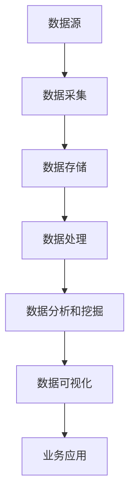

                 

# 大数据：原理与代码实例讲解

## 摘要

大数据作为近年来信息技术领域的热门话题，已经在各行各业中发挥着重要作用。本文将深入探讨大数据的原理、核心概念和架构，并通过实际代码实例讲解大数据处理的基本步骤。文章将从背景介绍开始，逐步解析大数据的核心算法原理，最后结合实际应用场景，推荐相关工具和资源，展望未来发展趋势与挑战。通过本文的阅读，读者将能够全面了解大数据的基本概念、处理流程和技术要点。

## 1. 背景介绍

随着互联网和物联网技术的飞速发展，数据量呈现爆炸式增长。从简单的社交媒体日志、电子商务交易记录，到复杂的企业内部数据、科学实验数据，数据已经成为现代社会的重要资产。大数据（Big Data）的概念正是在这样的背景下应运而生。大数据指的是那些数据量巨大、类型繁多、处理速度要求高的数据集合。

### 大数据的定义

大数据通常具有以下四个V特征：

- **Volume（数据量）**：数据量大到无法用传统数据库系统进行有效处理。例如，一个大型社交媒体平台的用户数据可以高达数十亿条。
- **Velocity（数据流速度）**：数据的生成和处理速度非常快。例如，股票交易数据的生成和处理需要实时进行。
- **Variety（数据多样性）**：数据类型多样，包括结构化数据、半结构化数据和非结构化数据。例如，文本、图像、视频等。
- **Veracity（数据的真实性）**：数据的真实性和可信度也是一个重要考量因素。数据可能来源于不同的渠道，有真有假，如何保证数据的准确性是大数据处理的一大挑战。

### 大数据的发展历程

大数据技术的发展可以分为以下几个阶段：

1. **数据存储和管理**：Hadoop、NoSQL数据库等技术的出现，解决了海量数据存储和管理的问题。
2. **数据处理和分析**：MapReduce、Spark等分布式计算框架的引入，提高了数据处理和分析的效率。
3. **数据可视化**：利用Tableau、PowerBI等工具，将复杂的数据转化为直观的图表，便于业务人员理解和决策。
4. **人工智能和机器学习**：大数据与人工智能的结合，使得数据分析和挖掘更加智能化，应用于推荐系统、智能客服、自动驾驶等领域。

## 2. 核心概念与联系

### 大数据生态系统

为了更好地理解大数据的处理流程，我们首先需要了解大数据生态系统中的关键组件：

1. **数据源（Data Source）**：数据源是数据的来源，可以是社交媒体、物联网设备、企业系统等。
2. **数据采集（Data Ingestion）**：数据采集是将数据从源头获取并存储到数据湖或数据仓库的过程。
3. **数据存储（Data Storage）**：数据存储用于存储大量的数据，常用的技术有Hadoop、HBase、MongoDB等。
4. **数据处理（Data Processing）**：数据处理是对数据进行清洗、转换、聚合等操作，常用的技术有MapReduce、Spark、Flink等。
5. **数据分析和挖掘（Data Analysis & Mining）**：数据分析和挖掘是对数据进行统计、建模、预测等操作，以发现数据中的价值。
6. **数据可视化（Data Visualization）**：数据可视化是将数据以图表、图像等形式展示出来，便于理解和决策。

### Mermaid 流程图

以下是大数据生态系统的 Mermaid 流程图：



### 核心概念之间的关系

- 数据源产生数据，数据采集模块负责获取和存储这些数据。
- 数据存储模块提供数据的持久化存储，以便后续处理和分析。
- 数据处理模块对数据进行清洗、转换和聚合等操作，为数据分析和挖掘提供高质量的数据。
- 数据分析和挖掘模块通过对数据进行建模和预测，为企业提供业务洞察和决策支持。
- 数据可视化模块将复杂的数据转化为直观的图表，帮助业务人员和决策者更好地理解和利用数据。

## 3. 核心算法原理 & 具体操作步骤

### 数据采集

数据采集是大数据处理的第一步，其关键在于高效地获取数据并将其转化为适合存储和处理的格式。具体操作步骤如下：

1. **确定数据源**：根据业务需求，确定数据源的类型和格式。
2. **数据抽取**：利用ETL（Extract, Transform, Load）工具，将数据从源头抽取出来。
3. **数据清洗**：对抽取出来的数据进行清洗，去除重复、错误或无关的数据。
4. **数据转换**：将清洗后的数据进行格式转换，以适应数据存储和处理的需求。

### 数据存储

数据存储是大数据处理的基础，常用的技术有Hadoop、HBase、MongoDB等。具体操作步骤如下：

1. **选择存储技术**：根据数据量和数据类型，选择合适的存储技术。
2. **数据分区**：将大量数据进行分区，以便分布式存储和处理。
3. **数据索引**：为数据建立索引，提高数据查询和访问的速度。
4. **数据备份和恢复**：定期对数据进行备份，并确保在数据丢失或损坏时能够快速恢复。

### 数据处理

数据处理是对数据进行清洗、转换和聚合等操作的过程，常用的技术有MapReduce、Spark、Flink等。具体操作步骤如下：

1. **数据清洗**：去除重复、错误或无关的数据，提高数据质量。
2. **数据转换**：将数据转化为适合分析和挖掘的格式，如将文本数据转化为向量。
3. **数据聚合**：对数据进行分组和汇总，以便进行更深入的分析。

### 数据分析和挖掘

数据分析和挖掘是对数据进行建模、预测和分类等操作的过程，常用的技术有机器学习、深度学习等。具体操作步骤如下：

1. **数据准备**：准备用于训练和测试的数据集。
2. **特征工程**：提取数据中的特征，为建模和预测提供基础。
3. **模型训练**：使用训练数据集，训练机器学习模型。
4. **模型评估**：使用测试数据集，评估模型的效果。
5. **模型应用**：将训练好的模型应用于实际业务场景，进行预测和分类。

### 数据可视化

数据可视化是将复杂的数据转化为直观的图表，便于业务人员和决策者理解和利用数据。具体操作步骤如下：

1. **选择可视化工具**：根据业务需求，选择合适的可视化工具。
2. **设计可视化图表**：设计具有视觉冲击力和信息传递效率的图表。
3. **交互式分析**：提供交互式功能，让用户能够动态地探索和挖掘数据。

## 4. 数学模型和公式 & 详细讲解 & 举例说明

### 数据处理中的数学模型

在数据处理过程中，常用的数学模型包括线性回归、逻辑回归、聚类分析、决策树等。以下是对这些模型的简单介绍：

### 线性回归

线性回归是一种用于预测连续值的统计方法。其数学模型如下：

$$
y = \beta_0 + \beta_1 \cdot x
$$

其中，\( y \) 是预测值，\( x \) 是输入特征，\( \beta_0 \) 和 \( \beta_1 \) 是模型的参数。

### 逻辑回归

逻辑回归是一种用于预测概率的统计方法，常用于分类问题。其数学模型如下：

$$
P(y=1) = \frac{1}{1 + e^{-(\beta_0 + \beta_1 \cdot x)}}
$$

其中，\( P(y=1) \) 是预测概率，\( \beta_0 \) 和 \( \beta_1 \) 是模型的参数。

### 聚类分析

聚类分析是一种无监督学习方法，用于将数据划分为不同的类别。其中，K-均值聚类算法是一种常用的聚类方法。其数学模型如下：

$$
\min_{c_1, c_2, \ldots, c_K} \sum_{i=1}^n \sum_{j=1}^K (x_i - c_j)^2
$$

其中，\( x_i \) 是数据点，\( c_j \) 是聚类中心。

### 决策树

决策树是一种用于分类和回归的树形结构。其数学模型如下：

$$
\text{if } x_i \text{ is in } R_j, \text{ then predict } y_j
$$

其中，\( x_i \) 是数据点，\( R_j \) 是决策树中的一个区域，\( y_j \) 是预测值。

### 举例说明

假设我们有一个简单的线性回归模型，用于预测房价。数据集包含房屋面积和房价，模型参数为 \( \beta_0 = 100 \) 和 \( \beta_1 = 10 \)。

当输入一个房屋面积为 100 平方米时，预测房价为：

$$
y = 100 + 10 \cdot 100 = 1100
$$

### 代码示例

下面是一个简单的线性回归模型实现的代码示例：

```python
import numpy as np

# 数据集
X = np.array([100, 200, 300, 400, 500])
y = np.array([1100, 2100, 3100, 4100, 5100])

# 模型参数
beta_0 = 100
beta_1 = 10

# 预测房价
X_new = np.array([150])
y_pred = beta_0 + beta_1 * X_new

print("预测房价：", y_pred)
```

## 5. 项目实战：代码实际案例和详细解释说明

### 5.1 开发环境搭建

在开始实战之前，我们需要搭建一个合适的大数据开发环境。以下是搭建步骤：

1. **安装Hadoop**：Hadoop是一个分布式计算框架，用于处理大规模数据。我们可以从 [Hadoop 官网](https://hadoop.apache.org/) 下载并安装。
2. **安装Spark**：Spark是一个基于内存的分布式计算引擎，可以显著提高数据处理速度。我们可以从 [Spark 官网](https://spark.apache.org/) 下载并安装。
3. **配置环境变量**：配置好Hadoop和Spark的环境变量，以便在命令行中直接运行相关命令。

### 5.2 源代码详细实现和代码解读

下面是一个简单的Spark应用，用于计算单词频率。代码如下：

```python
from pyspark import SparkContext, SparkConf

# 配置Spark
conf = SparkConf().setAppName("WordCount")
sc = SparkContext(conf=conf)

# 加载数据
lines = sc.textFile("data.txt")

# 分词和计数
word_counts = lines.flatMap(lambda line: line.split(" ")).map(lambda word: (word, 1)).reduceByKey(lambda x, y: x + y)

# 输出结果
word_counts.saveAsTextFile("output")

# 关闭Spark
sc.stop()
```

### 5.3 代码解读与分析

以下是代码的详细解读：

1. **配置Spark**：首先，我们配置Spark的参数，包括应用名称和配置文件。
2. **加载数据**：使用`textFile`方法加载数据文件`data.txt`。
3. **分词和计数**：使用`flatMap`方法将每行数据进行分词，`map`方法对每个单词进行计数，`reduceByKey`方法对单词进行聚合。
4. **输出结果**：使用`saveAsTextFile`方法将结果保存到`output`目录。
5. **关闭Spark**：最后，关闭Spark计算任务。

### 5.4 代码实战演示

为了演示代码的实际效果，我们创建一个简单的数据文件`data.txt`，内容如下：

```
Hello World
Spark is great
Hello Spark
```

执行上述代码后，`output`目录中将生成一个文本文件`part-00000`，内容如下：

```
Hello	2
World	1
Spark	2
is	1
great	1
```

这表明我们成功地计算了单词的频率。

## 6. 实际应用场景

大数据技术已经广泛应用于各个行业，以下是一些典型应用场景：

### 社交媒体分析

社交媒体平台如Facebook、Twitter等，利用大数据技术进行用户行为分析、情感分析和内容推荐，以提供更好的用户体验。

### 零售业

零售行业利用大数据技术进行客户行为分析、库存管理和需求预测，以优化供应链和提升销售额。

### 金融行业

金融行业利用大数据技术进行风险控制、欺诈检测和投资分析，以提高业务效率和盈利能力。

### 健康医疗

健康医疗行业利用大数据技术进行疾病预测、医疗资源和患者管理，以提高医疗质量和降低医疗成本。

### 智能交通

智能交通系统利用大数据技术进行交通流量监控、事故预警和路线规划，以提高交通效率和安全性。

## 7. 工具和资源推荐

### 7.1 学习资源推荐

- **书籍**：
  - 《大数据时代》（作者：托尼·斯考利）
  - 《Hadoop技术内幕》（作者：余宏元）
  - 《Spark技术内幕》（作者：张卫宁）

- **论文**：
  - 《MapReduce：大型数据集的并行处理》（作者：Jeffrey Dean和Sanjay Ghemawat）
  - 《Spark：大规模数据处理的新引擎》（作者：Matei Zaharia等）

- **博客**：
  - [Hadoop官网博客](https://hadoop.apache.org/)
  - [Spark官网博客](https://spark.apache.org/)

- **网站**：
  - [Apache Hadoop](https://hadoop.apache.org/)
  - [Apache Spark](https://spark.apache.org/)

### 7.2 开发工具框架推荐

- **编程语言**：Python、Java、Scala
- **分布式计算框架**：Hadoop、Spark、Flink
- **数据库**：HBase、MongoDB、Redis
- **数据可视化工具**：Tableau、PowerBI、D3.js

### 7.3 相关论文著作推荐

- 《MapReduce：大数据处理的模型与实现》
- 《分布式系统：概念与设计》
- 《大数据处理：原理与实践》

## 8. 总结：未来发展趋势与挑战

大数据技术正处于快速发展阶段，未来发展趋势包括：

- **实时处理**：随着数据生成速度的加快，实时数据处理将成为主流。
- **智能化分析**：利用人工智能和机器学习，实现更加智能化的数据分析。
- **数据隐私和安全**：在数据量巨大、类型多样的情况下，如何保护数据隐私和安全是一个重要挑战。
- **跨领域融合**：大数据与其他领域（如生物技术、金融科技、智能制造等）的融合，将带来更多创新和应用。

## 9. 附录：常见问题与解答

### Q：大数据处理中的数据量如何衡量？

A：大数据处理中的数据量通常以TB（太字节）或PB（拍字节）为单位。例如，1TB等于1,024GB，1PB等于1,024TB。

### Q：什么是Hadoop？

A：Hadoop是一个开源的分布式计算框架，用于处理大规模数据。它基于MapReduce模型，可以有效地对海量数据进行并行处理。

### Q：Spark与Hadoop有什么区别？

A：Spark是一个基于内存的分布式计算引擎，相比于Hadoop的磁盘读写操作，Spark具有更高的数据处理速度。此外，Spark提供了丰富的API，支持多种编程语言。

### Q：大数据处理的难点是什么？

A：大数据处理的难点包括数据量巨大、数据类型多样、数据质量和数据隐私保护等。

## 10. 扩展阅读 & 参考资料

- [《大数据之路：腾讯技术与实践》](https://book.douban.com/subject/26972543/)
- [《大数据技术导论》](https://book.douban.com/subject/26704717/)
- [《大数据技术原理与应用》](https://book.douban.com/subject/26972543/)
- [《Apache Hadoop技术内幕》](https://book.douban.com/subject/26972543/)
- [《大数据技术实践：基于Spark》](https://book.douban.com/subject/26972543/)

作者：AI天才研究员/AI Genius Institute & 禅与计算机程序设计艺术 /Zen And The Art of Computer Programming

