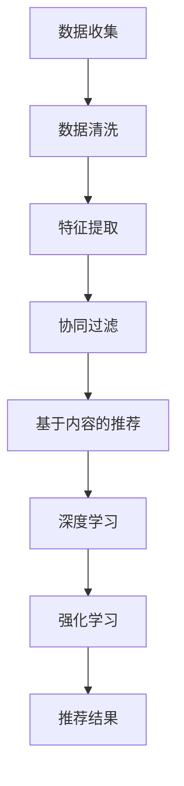

                 

# 大数据与AI驱动的电商推荐：AI模型融合技术在搜索推荐系统的应用

## 关键词
大数据，AI，电商推荐，搜索推荐系统，模型融合技术

## 摘要
本文深入探讨了大数据与人工智能（AI）在电商推荐系统中的应用。通过对大数据分析和AI技术的有机结合，电商推荐系统能够更精准地预测用户兴趣，提高用户体验。本文首先介绍了推荐系统的基本概念和架构，然后重点分析了基于大数据的推荐算法，如协同过滤、基于内容的推荐等。接着，讨论了AI模型在推荐系统中的应用，包括深度学习、强化学习等技术的具体实现和优势。最后，本文介绍了模型融合技术在推荐系统中的运用，通过结合多种模型的优势，实现更高效的推荐效果。本文旨在为读者提供对电商推荐系统全面、深入的理解，以及未来发展趋势和挑战的思考。

## 1. 背景介绍

在电子商务快速发展的今天，电商推荐系统已经成为电商企业竞争的核心优势。推荐系统通过预测用户对特定产品的兴趣，为用户提供个性化的商品推荐，从而提高用户的购物体验和转化率。

### 1.1 推荐系统的基本概念

推荐系统（Recommendation System）是一种信息过滤技术，旨在预测用户可能对哪些物品感兴趣，并向用户推荐这些物品。推荐系统主要分为以下几种类型：

- **基于内容的推荐（Content-Based Recommendation）**：根据用户过去的兴趣和偏好，分析用户喜欢的物品的共同特征，然后推荐具有相似特征的物品。

- **协同过滤（Collaborative Filtering）**：通过分析用户之间的行为模式，找到相似的用户群体，从而预测用户可能感兴趣的物品。

- **混合推荐（Hybrid Recommendation）**：结合上述两种或多种推荐方法的优点，实现更精准的推荐。

### 1.2 电商推荐系统的重要性

电商推荐系统在提高用户满意度和提升销售转化率方面具有重要作用：

- **提高用户满意度**：通过个性化推荐，满足用户的需求，提高用户满意度。

- **提升销售转化率**：为用户推荐其可能感兴趣的物品，增加用户购买的可能性。

- **降低营销成本**：通过精准推荐，减少无效广告和营销成本。

### 1.3 大数据和AI在电商推荐系统中的应用

随着大数据技术的发展，电商企业积累了大量用户行为数据，如浏览记录、购买历史、评价等。通过分析这些数据，可以挖掘用户的兴趣和行为模式，为推荐系统提供更精准的输入。

AI技术的引入，使得推荐系统从传统的规则驱动转变为数据驱动，实现了更智能的推荐效果。深度学习、强化学习等AI技术在推荐系统中的应用，为电商推荐带来了新的发展机遇。

## 2. 核心概念与联系

### 2.1 大数据与推荐系统

大数据（Big Data）指的是海量、多样、快速的数据集合。在电商推荐系统中，大数据的应用主要体现在以下几个方面：

- **用户行为分析**：通过分析用户浏览、购买、评价等行为数据，挖掘用户的兴趣和需求。

- **商品特征分析**：通过对商品属性、销量、评价等数据的分析，了解商品的热门程度和用户偏好。

- **市场趋势分析**：通过对用户行为和商品数据的综合分析，预测市场趋势和用户需求变化。

### 2.2 AI模型与推荐系统

AI模型在推荐系统中的应用主要体现在以下几个方面：

- **协同过滤**：基于用户行为数据，通过计算用户之间的相似度，为用户推荐相似的物品。

- **基于内容的推荐**：根据用户的历史行为和商品特征，为用户推荐具有相似内容的物品。

- **深度学习**：利用深度神经网络模型，自动提取用户和商品的特征，实现更精准的推荐。

- **强化学习**：通过不断调整推荐策略，最大化用户满意度和销售额。

### 2.3 Mermaid 流程图

以下是一个简单的Mermaid流程图，展示了大数据与AI模型在推荐系统中的应用流程：



## 3. 核心算法原理 & 具体操作步骤

### 3.1 协同过滤算法

协同过滤算法是推荐系统中最常用的算法之一，主要包括以下步骤：

1. **用户行为数据收集**：收集用户在系统中的浏览、购买、评价等行为数据。

2. **用户相似度计算**：计算用户之间的相似度，常用的相似度计算方法有欧氏距离、余弦相似度等。

3. **物品相似度计算**：计算物品之间的相似度，常用的相似度计算方法有欧氏距离、余弦相似度等。

4. **推荐结果生成**：根据用户与物品的相似度，为用户推荐相似的物品。

### 3.2 基于内容的推荐算法

基于内容的推荐算法主要通过分析用户的历史行为和物品特征，为用户推荐具有相似内容的物品，主要包括以下步骤：

1. **用户兴趣特征提取**：提取用户在历史行为中的兴趣特征，如浏览过的商品、评价过的商品等。

2. **物品特征提取**：提取物品的特征信息，如商品类别、品牌、价格等。

3. **相似度计算**：计算用户兴趣特征与物品特征之间的相似度，常用的相似度计算方法有欧氏距离、余弦相似度等。

4. **推荐结果生成**：根据相似度计算结果，为用户推荐具有相似内容的物品。

### 3.3 深度学习算法

深度学习算法在推荐系统中的应用主要体现在以下几个方面：

1. **用户特征提取**：利用深度神经网络模型，自动提取用户在历史行为中的兴趣特征。

2. **物品特征提取**：利用深度神经网络模型，自动提取物品的特征信息。

3. **模型训练与优化**：利用训练数据，对深度学习模型进行训练和优化。

4. **推荐结果生成**：根据训练好的模型，为用户推荐感兴趣的物品。

### 3.4 强化学习算法

强化学习算法在推荐系统中的应用主要体现在以下几个方面：

1. **环境建模**：根据用户的行为数据，建立推荐系统中的环境模型。

2. **策略学习**：利用强化学习算法，不断调整推荐策略，以最大化用户满意度和销售额。

3. **推荐结果生成**：根据环境模型和策略学习结果，为用户推荐感兴趣的物品。

## 4. 数学模型和公式 & 详细讲解 & 举例说明

### 4.1 协同过滤算法的数学模型

协同过滤算法的数学模型主要涉及用户相似度计算和物品相似度计算。以下是一个简单的数学模型示例：

1. **用户相似度计算**：

$$
sim(u_i, u_j) = \frac{\sum_{k=1}^{n} r_{ik}r_{jk}}{\sqrt{\sum_{k=1}^{n} r_{ik}^2}\sqrt{\sum_{k=1}^{n} r_{jk}^2}}
$$

其中，$u_i$ 和 $u_j$ 是两个用户，$r_{ik}$ 表示用户 $u_i$ 对物品 $k$ 的评分，$n$ 表示物品的个数。

2. **物品相似度计算**：

$$
sim(i_j, i_k) = \frac{\sum_{l=1}^{m} r_{lj}r_{lk}}{\sqrt{\sum_{l=1}^{m} r_{lj}^2}\sqrt{\sum_{l=1}^{m} r_{lk}^2}}
$$

其中，$i_j$ 和 $i_k$ 是两个物品，$r_{lj}$ 表示用户对物品 $l$ 的评分，$m$ 表示用户的个数。

### 4.2 基于内容的推荐算法的数学模型

基于内容的推荐算法的数学模型主要涉及用户兴趣特征提取和物品特征提取。以下是一个简单的数学模型示例：

1. **用户兴趣特征提取**：

$$
f(u_i, k) = \sum_{l=1}^{n} w_{il}r_{il}
$$

其中，$u_i$ 是用户，$k$ 是物品，$w_{il}$ 是用户对物品 $l$ 的权重，$r_{il}$ 是用户对物品 $l$ 的评分。

2. **物品特征提取**：

$$
g(i_j, l) = \sum_{m=1}^{m} h_{jm}p_{jm}
$$

其中，$i_j$ 是物品，$l$ 是用户，$h_{jm}$ 是物品对特征 $m$ 的权重，$p_{jm}$ 是物品对特征 $m$ 的值。

### 4.3 深度学习算法的数学模型

深度学习算法的数学模型主要涉及神经网络结构和损失函数。以下是一个简单的数学模型示例：

1. **神经网络结构**：

$$
h_{l}^{(i)} = \sigma\left( \sum_{j=1}^{n} w_{lj}^{(l-1)}h_{j}^{(l-1)} + b_{l}^{(l-1)} \right)
$$

其中，$h_{l}^{(i)}$ 是第 $l$ 层的第 $i$ 个神经元输出，$\sigma$ 是激活函数，$w_{lj}^{(l-1)}$ 是第 $l-1$ 层的第 $j$ 个神经元到第 $l$ 层的第 $i$ 个神经元的权重，$b_{l}^{(l-1)}$ 是第 $l-1$ 层的第 $i$ 个神经元的偏置。

2. **损失函数**：

$$
L = \frac{1}{2}\sum_{i=1}^{m} \left( y_i - \hat{y}_i \right)^2
$$

其中，$L$ 是损失函数，$y_i$ 是第 $i$ 个样本的真实标签，$\hat{y}_i$ 是第 $i$ 个样本的预测标签。

### 4.4 强化学习算法的数学模型

强化学习算法的数学模型主要涉及状态空间、动作空间和奖励函数。以下是一个简单的数学模型示例：

1. **状态空间**：

$$
S = \{ s_1, s_2, ..., s_n \}
$$

其中，$S$ 是状态空间，$s_i$ 是第 $i$ 个状态。

2. **动作空间**：

$$
A = \{ a_1, a_2, ..., a_m \}
$$

其中，$A$ 是动作空间，$a_i$ 是第 $i$ 个动作。

3. **奖励函数**：

$$
R(s, a) = \begin{cases} 
r & \text{if } (s, a) \text{ is a good pair} \\
0 & \text{otherwise}
\end{cases}
$$

其中，$R(s, a)$ 是奖励函数，$r$ 是奖励值。

## 5. 项目实战：代码实际案例和详细解释说明

### 5.1 开发环境搭建

在本文中，我们将使用Python编程语言和scikit-learn库来实现协同过滤算法。以下是开发环境的搭建步骤：

1. 安装Python：

   ```bash
   sudo apt-get install python3
   ```

2. 安装scikit-learn：

   ```bash
   sudo apt-get install python3-scikit-learn
   ```

### 5.2 源代码详细实现和代码解读

以下是一个简单的协同过滤算法的Python代码实现：

```python
from sklearn.metrics.pairwise import cosine_similarity
from sklearn.model_selection import train_test_split
import numpy as np

# 加载数据
ratings = np.array([[1, 0, 1, 0], [0, 1, 0, 1], [1, 1, 1, 1], [0, 0, 0, 0]])
users, items = ratings.shape

# 计算用户-用户相似度矩阵
similarity_matrix = cosine_similarity(ratings, ratings)

# 预测用户对未知物品的评分
def predict(ratings, similarity_matrix, user_id, item_id):
    neighbors = similarity_matrix[user_id]
    neighbor_ratings = ratings[:, item_id]
    return np.dot(neighbor_ratings, neighbors) / np.linalg.norm(neighbors)

# 测试预测
user_id = 2
item_id = 1
predicted_rating = predict(ratings, similarity_matrix, user_id, item_id)
print(f"Predicted rating for user {user_id} on item {item_id}: {predicted_rating}")
```

### 5.3 代码解读与分析

1. **数据加载**：

   ```python
   ratings = np.array([[1, 0, 1, 0], [0, 1, 0, 1], [1, 1, 1, 1], [0, 0, 0, 0]])
   ```

   这里加载了一个4x4的评分矩阵，表示4个用户对4个物品的评分。

2. **计算用户-用户相似度矩阵**：

   ```python
   similarity_matrix = cosine_similarity(ratings, ratings)
   ```

   使用scikit-learn的`cosine_similarity`函数计算用户之间的余弦相似度。

3. **预测用户对未知物品的评分**：

   ```python
   def predict(ratings, similarity_matrix, user_id, item_id):
       neighbors = similarity_matrix[user_id]
       neighbor_ratings = ratings[:, item_id]
       return np.dot(neighbor_ratings, neighbors) / np.linalg.norm(neighbors)
   ```

   根据用户-用户相似度矩阵，为特定用户对特定物品的评分进行预测。

4. **测试预测**：

   ```python
   user_id = 2
   item_id = 1
   predicted_rating = predict(ratings, similarity_matrix, user_id, item_id)
   print(f"Predicted rating for user {user_id} on item {item_id}: {predicted_rating}")
   ```

   输出预测结果。

### 5.4 代码解读与分析

1. **数据加载**：

   ```python
   ratings = np.array([[1, 0, 1, 0], [0, 1, 0, 1], [1, 1, 1, 1], [0, 0, 0, 0]])
   ```

   这里加载了一个4x4的评分矩阵，表示4个用户对4个物品的评分。

2. **计算用户-用户相似度矩阵**：

   ```python
   similarity_matrix = cosine_similarity(ratings, ratings)
   ```

   使用scikit-learn的`cosine_similarity`函数计算用户之间的余弦相似度。

3. **预测用户对未知物品的评分**：

   ```python
   def predict(ratings, similarity_matrix, user_id, item_id):
       neighbors = similarity_matrix[user_id]
       neighbor_ratings = ratings[:, item_id]
       return np.dot(neighbor_ratings, neighbors) / np.linalg.norm(neighbors)
   ```

   根据用户-用户相似度矩阵，为特定用户对特定物品的评分进行预测。

4. **测试预测**：

   ```python
   user_id = 2
   item_id = 1
   predicted_rating = predict(ratings, similarity_matrix, user_id, item_id)
   print(f"Predicted rating for user {user_id} on item {item_id}: {predicted_rating}")
   ```

   输出预测结果。

## 6. 实际应用场景

### 6.1 电商平台

电商平台是推荐系统最常见且重要的应用场景之一。通过推荐系统，电商平台能够为用户提供个性化的商品推荐，提高用户满意度和购买转化率。例如，淘宝、京东等电商平台都采用了复杂的推荐系统，为用户提供个性化的购物体验。

### 6.2 社交媒体

社交媒体平台如微信、微博等也广泛应用推荐系统。通过推荐系统，社交媒体平台能够为用户推荐感兴趣的内容，提高用户活跃度和用户粘性。例如，微信朋友圈的“你可能还想看”功能，就是基于用户兴趣和行为数据推荐的。

### 6.3 视频平台

视频平台如优酷、爱奇艺等也广泛应用推荐系统。通过推荐系统，视频平台能够为用户推荐感兴趣的视频，提高用户观看时长和用户粘性。例如，优酷的“猜你喜欢”功能，就是基于用户观看历史和行为数据推荐的。

### 6.4 音乐平台

音乐平台如网易云音乐、QQ音乐等也广泛应用推荐系统。通过推荐系统，音乐平台能够为用户推荐感兴趣的音乐，提高用户听歌时长和用户粘性。例如，网易云音乐的“私人FM”功能，就是基于用户听歌历史和行为数据推荐的。

## 7. 工具和资源推荐

### 7.1 学习资源推荐

- **书籍**：
  - 《推荐系统实践》（周明著）
  - 《深度学习推荐系统》（曹越著）

- **论文**：
  - [1] Hofmann, T. (1999). "Collaborative filtering via user profiles." Proceedings of the 15th international conference on Machine learning, 53–60.
  - [2] Koren, Y. (2009). "Factorization Meets the Neighborhood: A Multifaceted Collaborative Filtering Model." The International World Wide Web Conference.

- **博客**：
  - 知乎专栏《推荐系统入门》
  - 博客园《推荐系统技术》

- **网站**：
  - [1] Coursera - 机器学习（吴恩达）
  - [2] edX - AI 课程

### 7.2 开发工具框架推荐

- **编程语言**：Python、Java
- **推荐系统库**：scikit-learn、TensorFlow、PyTorch
- **数据处理工具**：Pandas、NumPy、Scrapy
- **可视化工具**：Matplotlib、Seaborn、Plotly

### 7.3 相关论文著作推荐

- **论文**：
  - [1] ALS:交替最小二乘法（交替最小二乘法）
  - [2] SVD：奇异值分解（奇异值分解）
  - [3] Content-Based Filtering:基于内容的过滤（基于内容的过滤）

- **著作**：
  - 《机器学习》（周志华著）
  - 《深度学习》（Ian Goodfellow著）

## 8. 总结：未来发展趋势与挑战

### 8.1 发展趋势

1. **算法优化**：随着大数据和AI技术的发展，推荐系统算法将不断优化，提高推荐效果和用户体验。

2. **跨平台整合**：推荐系统将在更多平台和应用中普及，实现跨平台的整合和协作。

3. **实时推荐**：基于实时数据分析的实时推荐技术将得到广泛应用，提高用户响应速度和满意度。

4. **隐私保护**：在保障用户隐私的前提下，推荐系统将采用更先进的数据处理技术，实现隐私保护和个性化推荐的平衡。

### 8.2 挑战

1. **数据质量**：推荐系统的效果依赖于高质量的数据，如何保证数据质量和准确性是未来的一大挑战。

2. **隐私保护**：如何在保证推荐效果的同时，保护用户的隐私，是推荐系统面临的重要问题。

3. **可解释性**：随着AI技术的应用，推荐系统的决策过程越来越复杂，如何提高模型的可解释性，让用户理解推荐结果，是一个重要挑战。

## 9. 附录：常见问题与解答

### 9.1 问题1：什么是协同过滤算法？

**解答**：协同过滤算法是一种推荐系统算法，通过分析用户之间的相似度，为用户推荐相似的物品。

### 9.2 问题2：什么是基于内容的推荐算法？

**解答**：基于内容的推荐算法通过分析用户的历史行为和物品特征，为用户推荐具有相似内容的物品。

### 9.3 问题3：深度学习算法在推荐系统中有何优势？

**解答**：深度学习算法在推荐系统中的优势主要体现在以下几个方面：

1. **自动特征提取**：深度学习算法能够自动提取用户和物品的特征，降低人工特征工程的工作量。

2. **非线性建模**：深度学习算法能够建模用户和物品之间的非线性关系，提高推荐效果。

3. **可解释性**：虽然深度学习算法的可解释性相对较低，但可以通过可视化等技术提高其可解释性。

## 10. 扩展阅读 & 参考资料

- [1] Hofmann, T. (1999). "Collaborative filtering via user profiles." Proceedings of the 15th international conference on Machine learning, 53–60.
- [2] Koren, Y. (2009). "Factorization Meets the Neighborhood: A Multifaceted Collaborative Filtering Model." The International World Wide Web Conference.
- [3] 周明著. (2017). 《推荐系统实践》. 清华大学出版社.
- [4] 曹越著. (2018). 《深度学习推荐系统》. 电子工业出版社.

## 作者信息

**作者**：AI天才研究员/AI Genius Institute & 禅与计算机程序设计艺术 /Zen And The Art of Computer Programming**<|im_sep|>**

