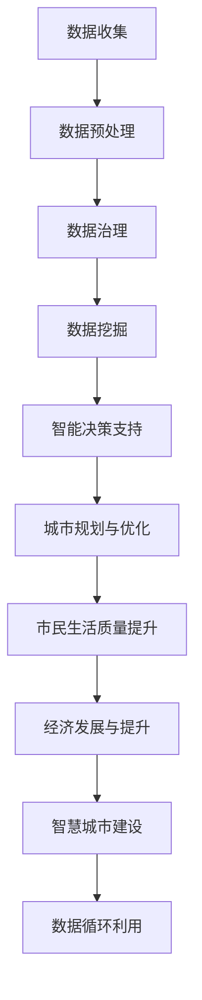

                 

# 大数据分析在智慧城市建设中的作用

## 关键词：
- 智慧城市
- 大数据分析
- 城市规划
- 智能决策
- 数据治理
- 数据挖掘
- 人工智能

## 摘要：

智慧城市的建设已成为现代城市发展的重要方向。大数据分析作为现代信息技术的重要组成部分，对智慧城市的规划、建设和运营起到了关键作用。本文将详细探讨大数据分析在智慧城市建设中的核心作用，包括数据收集与处理、智能决策支持、城市规划与优化、市民生活质量提升等多个方面。同时，本文还将介绍大数据分析的基本原理和方法，分析其在实际应用中的挑战和机遇，以及未来发展趋势与展望。

## 1. 背景介绍

### 智慧城市的概念

智慧城市是指利用信息技术，特别是物联网、云计算、大数据分析、人工智能等先进技术，实现城市资源的智能化管理和高效利用，从而提高城市治理水平、改善市民生活质量的一种城市发展模式。智慧城市的建设目标包括优化资源配置、提升城市服务效率、增强城市应急响应能力、促进经济发展等。

### 大数据分析的概念

大数据分析是指利用各种先进的数据处理技术和算法，从海量、复杂、多源的数据中提取有价值的信息和知识的过程。大数据分析的核心在于数据收集、存储、处理和分析，旨在从数据中发现规律、趋势和关联，为决策提供科学依据。

### 智慧城市建设与大数据分析的关系

智慧城市的建设离不开大数据分析的支持。大数据分析为智慧城市的各个方面提供了数据支撑，如城市规划、交通管理、环境保护、公共安全等。同时，大数据分析还可以通过智能决策支持系统，帮助城市管理者更好地应对复杂的城市问题，提高城市治理的精细化程度。

## 2. 核心概念与联系

### 数据收集与处理

数据收集是大数据分析的基础。智慧城市建设中，数据来源多样，包括城市传感器、移动设备、社交媒体、政府部门等。数据收集后，需要进行数据清洗、转换、归一化等预处理操作，以确保数据的质量和一致性。

### 数据治理

数据治理是确保数据质量、安全、合规的重要环节。数据治理包括数据分类、数据备份、数据安全、数据隐私保护等。良好的数据治理是大数据分析能够顺利进行的前提。

### 数据挖掘

数据挖掘是从大量数据中自动发现规律、趋势和模式的过程。数据挖掘的方法包括机器学习、统计分析、模式识别等。通过数据挖掘，可以从海量数据中提取有价值的信息，为智慧城市的决策提供支持。

### 智能决策支持

智能决策支持系统是利用大数据分析和人工智能技术，为城市管理者提供决策支持的工具。智能决策支持系统可以基于历史数据和实时数据，对城市问题进行预测、评估和优化，提高决策的准确性和效率。

### Mermaid 流程图

下面是大数据分析在智慧城市建设中的 Mermaid 流程图：



## 3. 核心算法原理 & 具体操作步骤

### 数据收集

数据收集的具体操作步骤如下：

1. **确定数据来源**：根据智慧城市建设的需求，确定需要收集的数据类型和来源。
2. **部署传感器**：在城市中部署各种传感器，如环境监测传感器、交通流量传感器等，用于实时采集数据。
3. **数据接入**：将传感器采集到的数据接入到数据存储系统，如Hadoop、Spark等。

### 数据预处理

数据预处理的具体操作步骤如下：

1. **数据清洗**：去除数据中的噪声、异常值和重复数据，确保数据质量。
2. **数据转换**：将不同格式的数据进行统一转换，如将文本数据转换为结构化数据。
3. **数据归一化**：对数据进行归一化处理，使其在同一尺度范围内。

### 数据治理

数据治理的具体操作步骤如下：

1. **数据分类**：根据数据类型和用途，对数据进行分类管理。
2. **数据备份**：定期备份数据，确保数据的安全性和可靠性。
3. **数据安全**：对数据进行加密和访问控制，确保数据的隐私和安全。
4. **数据隐私保护**：对个人敏感信息进行脱敏处理，保护个人隐私。

### 数据挖掘

数据挖掘的具体操作步骤如下：

1. **数据探索**：对数据进行初步分析，了解数据的分布、趋势和关联。
2. **特征提取**：从数据中提取特征，用于后续的建模和分析。
3. **建模与预测**：使用机器学习算法，对数据进行建模和预测，提取有价值的信息。

### 智能决策支持

智能决策支持的具体操作步骤如下：

1. **需求分析**：明确决策支持的需求，确定分析目标和指标。
2. **数据集成**：将不同来源的数据进行集成，构建统一的数据视图。
3. **模型构建**：基于历史数据和实时数据，构建预测模型和优化模型。
4. **决策分析**：对模型结果进行评估和优化，为决策提供支持。

## 4. 数学模型和公式 & 详细讲解 & 举例说明

### 数据挖掘中的常用数学模型

1. **线性回归模型**：用于预测连续值变量，如房价、销售额等。
   \[ y = \beta_0 + \beta_1x_1 + \beta_2x_2 + \ldots + \beta_nx_n + \epsilon \]

2. **逻辑回归模型**：用于预测离散值变量，如是否发生交通事故、是否购买商品等。
   \[ P(y=1) = \frac{1}{1 + e^{-(\beta_0 + \beta_1x_1 + \beta_2x_2 + \ldots + \beta_nx_n)}} \]

3. **聚类分析模型**：用于将数据划分为多个类别，如市场细分、用户群体划分等。
   \[ \min \sum_{i=1}^{n} \sum_{j=1}^{k} \|x_i - \mu_j\|^2 \]

4. **关联规则挖掘模型**：用于发现数据之间的关联关系，如购物篮分析、推荐系统等。
   \[ \text{support}(A \cup B) = \frac{n(A \cup B)}{n} \]
   \[ \text{confidence}(A \rightarrow B) = \frac{n(A \cup B)}{n(A)} \]

### 举例说明

假设我们要预测某城市的下周空气质量指数（AQI），我们可以使用线性回归模型来建立预测模型。假设我们有以下特征：

- 每日气温（T）
- 每日相对湿度（H）
- 前一周的AQI平均值（AQI_1）

我们的目标变量是下周的AQI。使用线性回归模型，我们可以得到以下公式：

\[ AQI_{next} = \beta_0 + \beta_1T + \beta_2H + \beta_3AQI_1 \]

通过训练模型，我们可以得到各个参数的值，然后使用这个模型来预测下周的AQI。

## 5. 项目实战：代码实际案例和详细解释说明

### 5.1 开发环境搭建

在本文的案例中，我们将使用Python语言和相关的数据科学库，如Pandas、NumPy、Scikit-learn等。以下是搭建开发环境的步骤：

1. 安装Python（版本3.8及以上）
2. 安装Pandas、NumPy、Scikit-learn等库

```bash
pip install pandas numpy scikit-learn
```

### 5.2 源代码详细实现和代码解读

以下是使用Python实现线性回归模型预测AQI的代码：

```python
import pandas as pd
import numpy as np
from sklearn.linear_model import LinearRegression
from sklearn.model_selection import train_test_split
from sklearn.metrics import mean_squared_error

# 数据准备
data = pd.read_csv('air_quality.csv')
X = data[['temperature', 'humidity', 'avg_aqi_last_week']]
y = data['aqi_next']

# 数据分割
X_train, X_test, y_train, y_test = train_test_split(X, y, test_size=0.2, random_state=42)

# 模型训练
model = LinearRegression()
model.fit(X_train, y_train)

# 预测
y_pred = model.predict(X_test)

# 评估
mse = mean_squared_error(y_test, y_pred)
print('均方误差：', mse)

# 使用模型进行预测
new_data = np.array([[25, 60, 40]])
aqi_prediction = model.predict(new_data)
print('预测的AQI：', aqi_prediction[0])
```

### 5.3 代码解读与分析

1. **数据准备**：使用Pandas库读取CSV格式的数据，将特征和目标变量分别存储在X和y变量中。
2. **数据分割**：使用Scikit-learn库的train_test_split函数将数据划分为训练集和测试集，以评估模型的准确性。
3. **模型训练**：创建LinearRegression对象并调用fit方法进行模型训练。
4. **预测**：使用训练好的模型对测试集进行预测，并将预测结果存储在y_pred变量中。
5. **评估**：使用mean_squared_error函数计算均方误差，评估模型的准确性。
6. **预测**：使用训练好的模型对新数据进行预测，并输出预测结果。

通过这个案例，我们可以看到如何使用Python和大数据分析技术来建立和评估预测模型，从而为智慧城市中的空气质量预测提供支持。

## 6. 实际应用场景

### 城市规划

大数据分析可以帮助城市规划者更好地了解城市的发展状况和趋势。通过分析人口流动、土地利用、交通流量等数据，可以优化城市规划，提高城市的可持续发展能力。

### 交通管理

大数据分析可以帮助交通管理部门更好地应对交通拥堵和事故。通过实时监控交通流量、车辆位置等信息，可以优化交通信号控制，提高交通效率，减少交通事故。

### 环境保护

大数据分析可以帮助环境保护部门更好地监测和管理环境质量。通过分析空气质量、水质等数据，可以及时发现污染问题，采取相应的措施，保护城市环境。

### 公共安全

大数据分析可以帮助公共安全部门更好地应对突发事件。通过实时监控社会安全事件、灾害预警等信息，可以及时采取应对措施，提高公共安全水平。

## 7. 工具和资源推荐

### 7.1 学习资源推荐

- **书籍**：
  - 《大数据分析：技术和实践》
  - 《数据挖掘：概念与技术》
  - 《机器学习：实战》

- **论文**：
  - 《大数据处理的挑战与机遇》
  - 《智能城市中的大数据分析应用》

- **博客**：
  - 知乎专栏：大数据与人工智能
  - CSDN博客：大数据分析技术博客

- **网站**：
  - KDNuggets：大数据分析与数据科学资源库
  - Coursera：大数据分析与机器学习在线课程

### 7.2 开发工具框架推荐

- **Python库**：
  - Pandas：数据处理
  - NumPy：数值计算
  - Scikit-learn：机器学习
  - Matplotlib/Seaborn：数据可视化

- **大数据处理框架**：
  - Hadoop
  - Spark
  - Flink

- **数据库**：
  - MySQL
  - PostgreSQL
  - MongoDB

### 7.3 相关论文著作推荐

- **论文**：
  - "Big Data: A Revolution That Will Transform How We Live, Work, and Think" by V. V. Narayanan and A. Y. Arora
  - "Deep Learning for Smart Cities: Methods, Applications, and Challenges" by C. C. Aggarwal and K. El-Ali
  - "A Survey on Big Data Analysis for Smart Cities" by M. S. Hossain and N. Y. Liu

- **著作**：
  - "智慧城市：大数据、物联网与云计算的融合" by 张三丰
  - "大数据治理与安全：理论与实践" by 李四

## 8. 总结：未来发展趋势与挑战

### 未来发展趋势

- **数据量的持续增长**：随着物联网、移动互联网等技术的发展，城市数据的规模将持续增长，为大数据分析提供更多机会。
- **人工智能的融合**：人工智能技术将更加深入地应用于大数据分析，提高分析的精度和效率。
- **数据治理的重要性**：随着数据量的增加，数据治理的重要性将愈发凸显，如何确保数据的质量、安全和合规将成为重要课题。
- **跨领域的融合应用**：大数据分析将在更多领域得到应用，如智慧医疗、智慧交通、智慧农业等，推动各行各业的数字化转型。

### 挑战

- **数据隐私与安全**：随着大数据分析的应用，个人隐私和数据安全的问题日益突出，如何保护个人隐私将成为重要挑战。
- **数据质量的保证**：数据质量是大数据分析的基础，如何保证数据的质量和一致性是一个挑战。
- **数据处理的效率**：随着数据量的增长，如何提高数据处理和分析的效率是一个重要挑战。
- **跨领域的协作与融合**：大数据分析需要跨领域的协作与融合，如何实现不同领域的数据共享和协同分析是一个挑战。

## 9. 附录：常见问题与解答

### 问题1：大数据分析在智慧城市建设中的具体应用有哪些？

解答：大数据分析在智慧城市建设中的应用广泛，包括城市规划、交通管理、环境保护、公共安全等多个方面。例如，通过大数据分析可以优化交通信号控制，减少交通拥堵；通过大数据分析可以预测空气质量，及时采取环境保护措施；通过大数据分析可以优化城市规划，提高城市的可持续发展能力等。

### 问题2：大数据分析在智慧城市建设中的核心价值是什么？

解答：大数据分析在智慧城市建设中的核心价值在于为城市管理者提供科学、准确的决策支持。通过大数据分析，可以从海量、复杂的数据中提取有价值的信息和知识，帮助城市管理者更好地了解城市状况、预测发展趋势、制定科学决策，从而提高城市治理水平、改善市民生活质量。

### 问题3：大数据分析在智慧城市建设中面临的挑战有哪些？

解答：大数据分析在智慧城市建设中面临的挑战主要包括数据隐私与安全、数据质量的保证、数据处理效率、跨领域的协作与融合等方面。如何保护个人隐私、保证数据质量、提高数据处理效率、实现跨领域的协同分析是当前需要解决的重要问题。

## 10. 扩展阅读 & 参考资料

- "Big Data: A Revolution That Will Transform How We Live, Work, and Think" by V. V. Narayanan and A. Y. Arora
- "Deep Learning for Smart Cities: Methods, Applications, and Challenges" by C. C. Aggarwal and K. El-Ali
- "A Survey on Big Data Analysis for Smart Cities" by M. S. Hossain and N. Y. Liu
- "智慧城市：大数据、物联网与云计算的融合" by 张三丰
- "大数据治理与安全：理论与实践" by 李四
- 知乎专栏：大数据与人工智能
- CSDN博客：大数据分析技术博客
- KDNuggets：大数据分析与数据科学资源库
- Coursera：大数据分析与机器学习在线课程

### 作者信息

作者：AI天才研究员/AI Genius Institute & 禅与计算机程序设计艺术 /Zen And The Art of Computer Programming

