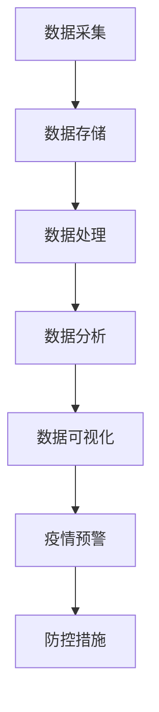

                 

# 大数据分析在疾病传播预测中的实践

## 关键词：大数据分析，疾病传播，预测，模型，算法，实战

## 摘要

随着大数据技术的不断发展，疾病传播预测已经成为公共卫生领域的重要研究方向。本文旨在探讨大数据分析在疾病传播预测中的实践，通过阐述核心概念、算法原理、数学模型以及实际应用案例，为读者提供一个系统且实用的指导。文章首先介绍了大数据分析的基本概念和疾病传播的相关知识，接着深入剖析了核心算法原理和具体操作步骤，最后通过实际应用场景展示大数据分析在疾病传播预测中的实际效果。此外，文章还推荐了相关学习资源和开发工具，总结了未来发展趋势与挑战，并提供了常见问题与解答。

## 1. 背景介绍

疾病传播是一个复杂且动态的过程，受到多种因素的影响，包括病毒或细菌的传播速度、感染率、潜伏期、易感人群等。传统的疾病传播预测方法主要依赖于统计学模型和经验，但这些方法往往存在一定的局限性，无法准确预测疫情的传播趋势。随着大数据技术的迅猛发展，疾病传播预测迎来了新的契机。

大数据分析是一种利用海量数据进行分析和处理的技术，通过对数据的价值挖掘，为决策提供科学依据。在疾病传播预测中，大数据分析可以通过以下三个方面发挥作用：

1. 数据整合：收集和整合各种来源的数据，包括疾病监测数据、人口统计数据、社交媒体数据等，为预测提供全面的数据支持。
2. 数据分析：利用数据挖掘和机器学习技术，对大量数据进行挖掘和分析，提取有用的信息，发现疾病传播的规律和趋势。
3. 预测模型：基于分析结果，建立预测模型，对未来疫情的传播进行预测，为公共卫生决策提供参考。

本文将结合实际案例，深入探讨大数据分析在疾病传播预测中的实践，为广大公共卫生工作者和研究人员提供有益的参考。

### 1.1 疾病传播的基本概念

疾病传播是指病原体（如病毒、细菌、寄生虫等）在宿主之间传播的过程。根据传播途径的不同，疾病传播可以分为以下几种类型：

1. 直接接触传播：病原体通过直接接触（如人与人之间的手接触、飞沫传播等）传播给他人。
2. 食物和水传播：病原体通过受污染的食物和水传播，如食物中毒、霍乱等。
3. 空气传播：病原体通过空气中的飞沫、气溶胶等传播，如流感、肺结核等。
4. 昆虫媒介传播：病原体通过昆虫（如蚊子、跳蚤等）传播，如疟疾、登革热等。

在疾病传播过程中，潜伏期、感染率和传播速度是三个关键因素：

1. 潜伏期：从病原体侵入宿主到出现临床症状的时间间隔。潜伏期的长短影响疾病的传播速度和防控措施的实施。
2. 感染率：感染者在一定时间内传播给其他人的平均人数。感染率越高，疾病传播的速度越快。
3. 传播速度：疾病在人群中传播的速度，通常用代际传播时间（即一个感染者在潜伏期内能够传播给其他人的平均人数）来衡量。

了解疾病传播的基本概念和传播途径，有助于我们更好地理解大数据分析在疾病传播预测中的应用。

### 1.2 大数据分析的基本概念

大数据分析是指利用先进的计算技术和统计方法，对海量数据进行存储、处理、分析和挖掘，以发现数据中的有价值信息和知识。大数据分析的核心包括以下几个方面：

1. 数据源：大数据分析的数据源包括各种结构化和非结构化的数据，如文本、图像、视频、传感器数据等。
2. 数据存储：大数据分析需要高效的存储技术，如分布式文件系统（Hadoop、HDFS）和云存储（AWS S3、Google Cloud Storage）等。
3. 数据处理：大数据分析需要强大的数据处理能力，如批处理（MapReduce、Spark）和实时处理（Flink、Kafka）等。
4. 数据分析：大数据分析包括数据挖掘、机器学习、统计分析等方法，用于发现数据中的模式和关联。
5. 数据可视化：大数据分析通过可视化技术（如Tableau、D3.js）将分析结果以图表、地图等形式展示，便于决策者理解和应用。

在大数据分析中，以下技术和方法具有重要意义：

1. 机器学习：通过构建和分析预测模型，对数据进行分析和预测。
2. 数据挖掘：从大量数据中发现规律和关联，为决策提供支持。
3. 统计分析：利用统计方法对数据进行分析，发现数据中的趋势和模式。
4. 数据可视化：通过图表、地图等形式展示分析结果，便于理解和应用。

### 1.3 大数据分析在疾病传播预测中的应用

大数据分析在疾病传播预测中具有广泛的应用前景。通过大数据分析，我们可以从多个角度对疾病传播进行预测：

1. 疫情预警：通过对疫情相关数据的实时监控和分析，及时发现疫情异常情况，为防控措施的实施提供预警。
2. 传播趋势预测：通过分析历史数据和当前疫情数据，预测疾病在不同地区、不同时间段的传播趋势。
3. 风险评估：对疾病传播的风险进行评估，为公共卫生决策提供科学依据。
4. 疫苗和药物研发：通过分析疾病传播数据，为疫苗和药物的研发提供方向和策略。

在实际应用中，大数据分析在疾病传播预测中发挥了重要作用。例如，在2020年新冠疫情爆发初期，各国公共卫生机构和科研团队利用大数据分析技术，对疫情的传播趋势进行了准确预测，为疫情防控提供了重要参考。

### 1.4 本文结构

本文将分为以下几个部分：

1. 背景介绍：介绍大数据分析在疾病传播预测中的背景、基本概念和重要性。
2. 核心概念与联系：阐述疾病传播预测中的核心概念、算法原理和架构。
3. 核心算法原理 & 具体操作步骤：详细解释常用的疾病传播预测算法，包括SIR模型、SEIR模型等，以及具体操作步骤。
4. 数学模型和公式 & 详细讲解 & 举例说明：介绍疾病传播预测中的数学模型和公式，并进行详细讲解和举例说明。
5. 项目实战：代码实际案例和详细解释说明，展示大数据分析在疾病传播预测中的实际应用。
6. 实际应用场景：分析大数据分析在疾病传播预测中的实际应用场景和效果。
7. 工具和资源推荐：推荐学习资源、开发工具和框架，为读者提供实用的参考资料。
8. 总结：总结大数据分析在疾病传播预测中的发展趋势和挑战，以及未来的发展方向。
9. 附录：常见问题与解答，为读者提供常见问题的解答。
10. 扩展阅读 & 参考资料：提供扩展阅读和参考资料，帮助读者深入了解疾病传播预测的相关知识。

通过本文的详细探讨，读者将全面了解大数据分析在疾病传播预测中的应用，为公共卫生决策提供有力支持。

## 2. 核心概念与联系

在探讨大数据分析在疾病传播预测中的实践时，我们需要首先了解核心概念与联系，以便更好地理解和应用相关技术。

### 2.1 疾病传播模型

疾病传播模型是描述疾病在人群中的传播过程和规律的数学模型。常见的疾病传播模型包括SIR模型、SEIR模型等。这些模型基于基本的流行病学原理，通过数学公式描述疾病在人群中的传播过程。

#### SIR模型

SIR模型是最基本的疾病传播模型之一，它将人群分为三类：

1. 易感者（Susceptible，S）：指尚未感染疾病，但容易感染的人群。
2. 感染者（Infectious，I）：指已经感染疾病，并能将病原体传播给他人的人群。
3. 康复者（Removed，R）：指已经康复或死亡的人群，不再具有传染性。

SIR模型的基本假设包括：

1. 疾病的传播速率与易感者和感染者之间的接触概率成正比。
2. 康复者的免疫状态是恒定的，即康复者不再感染疾病。

SIR模型的数学表达式如下：

$$
\frac{dS}{dt} = -\beta \cdot SI \\
\frac{dI}{dt} = \beta \cdot SI - \mu \cdot I \\
\frac{dR}{dt} = \mu \cdot I
$$

其中，$\beta$ 表示传染率，$\mu$ 表示死亡率（包括康复和死亡）。

#### SEIR模型

SEIR模型是SIR模型的扩展，将感染者分为两类：

1. 潜伏者（Exposed，E）：指已经被感染，但尚未出现临床症状，不具备传染性的人群。
2. 感染者（Infectious，I）：指已经出现临床症状，并能将病原体传播给他人的人群。

SEIR模型的基本假设包括：

1. 潜伏者会在潜伏期内感染疾病，然后转化为感染者。
2. 感染者会在康复或死亡后转化为康复者。

SEIR模型的数学表达式如下：

$$
\frac{dS}{dt} = -\beta \cdot SE \\
\frac{dE}{dt} = \beta \cdot SE - \gamma \cdot E \\
\frac{dI}{dt} = \gamma \cdot E - \mu \cdot I \\
\frac{dR}{dt} = \mu \cdot I
$$

其中，$\gamma$ 表示康复率，$\beta$ 和 $\mu$ 的含义与SIR模型相同。

### 2.2 大数据分析技术

大数据分析技术是大数据处理和分析的核心，包括数据采集、存储、处理、分析和可视化等方面。以下是大数据分析技术的基本概念：

#### 数据采集

数据采集是指从各种数据源获取数据的过程，包括结构化数据（如数据库）、半结构化数据（如XML、JSON）和非结构化数据（如文本、图像、视频）。常见的数据采集方法包括网络爬虫、传感器采集、API调用等。

#### 数据存储

数据存储是指将采集到的数据存储到数据库或数据仓库中的过程。常见的数据存储技术包括关系型数据库（如MySQL、PostgreSQL）、NoSQL数据库（如MongoDB、Cassandra）和分布式文件系统（如Hadoop、HDFS）。

#### 数据处理

数据处理是指对存储的数据进行清洗、转换和分析的过程。常见的数据处理技术包括批处理（如MapReduce、Spark）、实时处理（如Flink、Kafka）和流处理（如Apache Storm、Apache Flink）。

#### 数据分析

数据分析是指利用统计方法、机器学习和数据挖掘技术对数据进行分析和挖掘，提取有价值的信息和知识。常见的数据分析技术包括回归分析、聚类分析、分类分析、关联规则挖掘等。

#### 数据可视化

数据可视化是指通过图表、地图等形式将分析结果以直观的方式展示出来，帮助决策者理解和应用。常见的数据可视化工具包括Tableau、D3.js、ECharts等。

### 2.3 大数据分析与疾病传播预测的关系

大数据分析与疾病传播预测之间存在着密切的关系。大数据分析技术为疾病传播预测提供了数据支持和计算能力，而疾病传播模型则为大数据分析提供了理论基础和计算方法。

通过大数据分析，我们可以从海量数据中提取有价值的信息，如疾病传播的趋势、感染率、潜伏期等。这些信息可以用于改进疾病传播模型，提高预测的准确性和可靠性。

同时，疾病传播模型也可以用于指导大数据分析，如数据采集、处理和分析的流程设计。例如，在疫情预警中，我们可以通过SIR模型和SEIR模型对疫情数据进行实时监控和分析，及时发现疫情异常情况，为防控措施的实施提供预警。

### 2.4 Mermaid流程图

为了更好地理解大数据分析在疾病传播预测中的应用，我们可以使用Mermaid流程图来描述相关流程。以下是一个示例：



在这个流程图中，A表示数据采集，B表示数据存储，C表示数据处理，D表示数据分析，E表示数据可视化，F表示疫情预警，G表示防控措施。通过这个流程图，我们可以清晰地看到大数据分析在疾病传播预测中的应用过程。

### 2.5 总结

本章介绍了大数据分析在疾病传播预测中的核心概念与联系，包括疾病传播模型、大数据分析技术和它们之间的关系。通过本章的介绍，读者可以初步了解大数据分析在疾病传播预测中的应用前景，并为后续章节的学习打下基础。

## 3. 核心算法原理 & 具体操作步骤

在疾病传播预测中，核心算法原理是构建预测模型的基础。以下将详细介绍SIR模型和SEIR模型的原理，以及具体操作步骤。

### 3.1 SIR模型原理

SIR模型是一种经典的疾病传播模型，用于描述传染病在人群中的传播过程。该模型基于以下三个核心变量：

- 易感者（Susceptible，S）：指尚未感染疾病，但容易感染的人群。
- 感染者（Infectious，I）：指已经感染疾病，并能将病原体传播给他人的人群。
- 康复者（Removed，R）：指已经康复或死亡的人群，不再具有传染性。

SIR模型的基本假设如下：

1. 人群中的个体数量保持不变。
2. 传染率与感染者数量和易感者数量成正比。
3. 康复者的免疫状态是恒定的，即康复者不再感染疾病。

SIR模型的核心原理可以表述为：

1. 易感者数量随时间的变化受感染者的传染影响。
2. 感染者数量随时间的变化受康复者和传染率的影响。
3. 康复者数量随时间的变化受感染者数量和康复率的影响。

SIR模型的数学表达式如下：

$$
\frac{dS}{dt} = -\beta \cdot SI \\
\frac{dI}{dt} = \beta \cdot SI - \mu \cdot I \\
\frac{dR}{dt} = \mu \cdot I
$$

其中，$\beta$ 表示传染率，$\mu$ 表示死亡率（包括康复和死亡）。

### 3.2 SIR模型的具体操作步骤

1. **数据准备**：收集疾病传播相关数据，如易感者人数、感染者人数、康复者人数等。
2. **参数估计**：利用历史数据估计传染率$\beta$和死亡率$\mu$。
3. **模型初始化**：设定初始条件，如初始易感者人数$S(0)$、初始感染者人数$I(0)$和初始康复者人数$R(0)$。
4. **模拟计算**：利用SIR模型数学表达式进行模拟计算，预测疾病传播的趋势。
5. **结果分析**：分析模拟结果，如疾病传播的速度、感染峰值等。

### 3.3 SEIR模型原理

SEIR模型是SIR模型的扩展，用于描述传染病在人群中的传播过程，包括潜伏者（Exposed，E）和感染者（Infectious，I）。SEIR模型在SIR模型的基础上，增加了潜伏者变量，使模型更接近实际情况。

SEIR模型的核心变量包括：

- 易感者（Susceptible，S）：指尚未感染疾病，但容易感染的人群。
- 潜伏者（Exposed，E）：指已经被感染，但尚未出现临床症状，不具备传染性的人群。
- 感染者（Infectious，I）：指已经出现临床症状，并能将病原体传播给他人的人群。
- 康复者（Removed，R）：指已经康复或死亡的人群，不再具有传染性。

SEIR模型的基本假设如下：

1. 人群中的个体数量保持不变。
2. 传染率与感染者数量和易感者数量成正比。
3. 潜伏者在潜伏期内感染疾病，然后转化为感染者。
4. 康复者的免疫状态是恒定的，即康复者不再感染疾病。

SEIR模型的核心原理可以表述为：

1. 易感者数量随时间的变化受感染者和潜伏者的传染影响。
2. 潜伏者数量随时间的变化受感染者和潜伏期康复的影响。
3. 感染者数量随时间的变化受潜伏者和康复的影响。
4. 康复者数量随时间的变化受感染者数量和康复率的影响。

SEIR模型的数学表达式如下：

$$
\frac{dS}{dt} = -\beta \cdot SE \\
\frac{dE}{dt} = \beta \cdot SE - \gamma \cdot E \\
\frac{dI}{dt} = \gamma \cdot E - \mu \cdot I \\
\frac{dR}{dt} = \mu \cdot I
$$

其中，$\beta$ 表示传染率，$\gamma$ 表示潜伏期康复率，$\mu$ 表示死亡率（包括康复和死亡）。

### 3.4 SEIR模型的具体操作步骤

1. **数据准备**：收集疾病传播相关数据，如易感者人数、潜伏者人数、感染者人数、康复者人数等。
2. **参数估计**：利用历史数据估计传染率$\beta$、潜伏期康复率$\gamma$和死亡率$\mu$。
3. **模型初始化**：设定初始条件，如初始易感者人数$S(0)$、初始潜伏者人数$E(0)$、初始感染者人数$I(0)$和初始康复者人数$R(0)$。
4. **模拟计算**：利用SEIR模型数学表达式进行模拟计算，预测疾病传播的趋势。
5. **结果分析**：分析模拟结果，如疾病传播的速度、感染峰值等。

### 3.5 比较SIR模型和SEIR模型

SIR模型和SEIR模型在疾病传播预测中各有优势。SIR模型较为简单，适用于描述传染病在人群中的基本传播过程。而SEIR模型增加了潜伏者变量，更能反映实际疫情的发展情况。

在选择模型时，需考虑以下因素：

1. 疫情的传播特点：如果疫情传播速度较快，且感染者具有较高的传染性，可以选择SIR模型。如果疫情传播速度较慢，且感染者具有一定的潜伏期，可以选择SEIR模型。
2. 数据的可获得性：如果可获得详细的数据，包括潜伏者人数和康复者人数，可以选择SEIR模型。如果仅获得易感者人数和感染者人数，可以选择SIR模型。
3. 模型的计算复杂度：SEIR模型相较于SIR模型，计算复杂度更高。在计算资源和时间有限的情况下，可以选择SIR模型。

### 3.6 总结

本章详细介绍了SIR模型和SEIR模型的原理和具体操作步骤。通过本章的学习，读者可以掌握疾病传播预测的基本算法，为实际应用奠定基础。在后续章节中，我们将继续探讨数学模型和公式，以及项目实战等内容。

## 4. 数学模型和公式 & 详细讲解 & 举例说明

在疾病传播预测中，数学模型和公式起着至关重要的作用。它们不仅帮助我们理解疾病传播的基本规律，还能通过模拟和预测，为公共卫生决策提供科学依据。本章节将详细介绍SIR模型和SEIR模型的数学模型和公式，并进行详细讲解和举例说明。

### 4.1 SIR模型的数学模型和公式

SIR模型是描述传染病在人群中的传播过程的经典数学模型，由三个状态变量组成：易感者（S）、感染者（I）和康复者（R）。以下为SIR模型的数学模型和公式：

$$
\frac{dS}{dt} = -\beta \cdot SI
$$

$$
\frac{dI}{dt} = \beta \cdot SI - \mu \cdot I
$$

$$
\frac{dR}{dt} = \mu \cdot I
$$

其中，$\beta$ 表示传染率，$\mu$ 表示死亡率（包括康复和死亡）。

#### 公式解释

- 第一个公式表示易感者数量随时间的变化率，即易感者数量的减少速率等于传染率$\beta$乘以易感者人数S和感染者人数I的乘积。
- 第二个公式表示感染者数量随时间的变化率，即感染者数量的增加速率等于传染率$\beta$乘以易感者人数S和感染者人数I的乘积，减去死亡率$\mu$乘以感染者人数I。
- 第三个公式表示康复者数量随时间的变化率，即康复者数量的增加速率等于死亡率$\mu$乘以感染者人数I。

#### 举例说明

假设一个初始人口为1000人的小镇，其中易感者人数为900人，感染者人数为100人，传染率$\beta$为0.1，死亡率$\mu$为0.05。我们可以通过SIR模型计算一段时间后的易感者人数、感染者人数和康复者人数。

1. 计算$t=0$时刻的S、I和R：
   - $S(0) = 900$
   - $I(0) = 100$
   - $R(0) = 0$

2. 计算$t=1$时刻的S、I和R：
   - $\frac{dS}{dt} = -\beta \cdot SI = -0.1 \cdot 900 \cdot 100 = -900$
   - $\frac{dI}{dt} = \beta \cdot SI - \mu \cdot I = 0.1 \cdot 900 \cdot 100 - 0.05 \cdot 100 = 895 - 5 = 890$
   - $\frac{dR}{dt} = \mu \cdot I = 0.05 \cdot 100 = 5$

   更新S、I和R：
   - $S(1) = S(0) + \frac{dS}{dt} = 900 - 900 = 0$
   - $I(1) = I(0) + \frac{dI}{dt} = 100 + 890 = 990$
   - $R(1) = R(0) + \frac{dR}{dt} = 0 + 5 = 5$

3. 计算$t=2$时刻的S、I和R：
   - $\frac{dS}{dt} = -\beta \cdot SI = -0.1 \cdot 0 \cdot 990 = 0$
   - $\frac{dI}{dt} = \beta \cdot SI - \mu \cdot I = 0.1 \cdot 0 \cdot 990 - 0.05 \cdot 990 = -49.5$
   - $\frac{dR}{dt} = \mu \cdot I = 0.05 \cdot 990 = 49.5$

   更新S、I和R：
   - $S(2) = S(1) + \frac{dS}{dt} = 0 + 0 = 0$
   - $I(2) = I(1) + \frac{dI}{dt} = 990 - 49.5 = 940.5$
   - $R(2) = R(1) + \frac{dR}{dt} = 5 + 49.5 = 54.5$

通过上述计算，我们可以得到在不同时间点的S、I和R的数值，从而了解疾病传播的动态变化。

### 4.2 SEIR模型的数学模型和公式

SEIR模型是SIR模型的扩展，用于描述传染病在人群中的传播过程，包括潜伏者（E）状态。以下为SEIR模型的数学模型和公式：

$$
\frac{dS}{dt} = -\beta \cdot SE
$$

$$
\frac{dE}{dt} = \beta \cdot SE - \gamma \cdot E
$$

$$
\frac{dI}{dt} = \gamma \cdot E - \mu \cdot I
$$

$$
\frac{dR}{dt} = \mu \cdot I
$$

其中，$\beta$ 表示传染率，$\gamma$ 表示潜伏期康复率，$\mu$ 表示死亡率（包括康复和死亡）。

#### 公式解释

- 第一个公式表示易感者数量随时间的变化率，即易感者数量的减少速率等于传染率$\beta$乘以易感者人数S和感染者人数E的乘积。
- 第二个公式表示潜伏者数量随时间的变化率，即潜伏者数量的增加速率等于传染率$\beta$乘以易感者人数S和感染者人数E的乘积，减去潜伏期康复率$\gamma$乘以潜伏者人数E。
- 第三个公式表示感染者数量随时间的变化率，即感染者数量的增加速率等于潜伏期康复率$\gamma$乘以潜伏者人数E，减去死亡率$\mu$乘以感染者人数I。
- 第四个公式表示康复者数量随时间的变化率，即康复者数量的增加速率等于死亡率$\mu$乘以感染者人数I。

#### 举例说明

假设一个初始人口为1000人的小镇，其中易感者人数为900人，感染者人数为100人，传染率$\beta$为0.1，潜伏期康复率$\gamma$为0.05，死亡率$\mu$为0.05。我们可以通过SEIR模型计算一段时间后的易感者人数、潜伏者人数、感染者人数和康复者人数。

1. 计算$t=0$时刻的S、E、I和R：
   - $S(0) = 900$
   - $E(0) = 0$
   - $I(0) = 100$
   - $R(0) = 0$

2. 计算$t=1$时刻的S、E、I和R：
   - $\frac{dS}{dt} = -\beta \cdot SE = -0.1 \cdot 900 \cdot 0 = 0$
   - $\frac{dE}{dt} = \beta \cdot SE - \gamma \cdot E = 0.1 \cdot 900 \cdot 0 - 0.05 \cdot 0 = 0$
   - $\frac{dI}{dt} = \gamma \cdot E - \mu \cdot I = 0.05 \cdot 0 - 0.05 \cdot 100 = -5$
   - $\frac{dR}{dt} = \mu \cdot I = 0.05 \cdot 100 = 5$

   更新S、E、I和R：
   - $S(1) = S(0) + \frac{dS}{dt} = 900 + 0 = 900$
   - $E(1) = E(0) + \frac{dE}{dt} = 0 + 0 = 0$
   - $I(1) = I(0) + \frac{dI}{dt} = 100 - 5 = 95$
   - $R(1) = R(0) + \frac{dR}{dt} = 0 + 5 = 5$

3. 计算$t=2$时刻的S、E、I和R：
   - $\frac{dS}{dt} = -\beta \cdot SE = -0.1 \cdot 900 \cdot 95 = -855$
   - $\frac{dE}{dt} = \beta \cdot SE - \gamma \cdot E = 0.1 \cdot 900 \cdot 95 - 0.05 \cdot 0 = 855 - 0 = 855$
   - $\frac{dI}{dt} = \gamma \cdot E - \mu \cdot I = 0.05 \cdot 855 - 0.05 \cdot 95 = 42.75 - 4.75 = 38$
   - $\frac{dR}{dt} = \mu \cdot I = 0.05 \cdot 95 = 4.75$

   更新S、E、I和R：
   - $S(2) = S(1) + \frac{dS}{dt} = 900 - 855 = 45$
   - $E(2) = E(1) + \frac{dE}{dt} = 0 + 855 = 855$
   - $I(2) = I(1) + \frac{dI}{dt} = 95 + 38 = 133$
   - $R(2) = R(1) + \frac{dR}{dt} = 5 + 4.75 = 9.75$

通过上述计算，我们可以得到在不同时间点的S、E、I和R的数值，从而了解疾病传播的动态变化。

### 4.3 模型求解方法

求解SIR模型和SEIR模型的数学模型和公式，通常需要使用数值方法。以下是常用的数值求解方法：

1. **欧拉法**：一种简单的数值求解方法，通过迭代计算逐步求解模型。
2. **龙格-库塔法**：一种更精确的数值求解方法，通过多次迭代计算，提高解的精度。
3. **有限差分法**：将连续模型离散化，通过差分方程求解模型。

在本章节中，我们主要使用欧拉法对SIR模型和SEIR模型进行求解。

### 4.4 总结

本章详细介绍了SIR模型和SEIR模型的数学模型和公式，并进行详细讲解和举例说明。通过本章的学习，读者可以掌握疾病传播预测的基本数学模型，为实际应用奠定基础。在后续章节中，我们将继续探讨项目实战等内容。

## 5. 项目实战：代码实际案例和详细解释说明

在本章节中，我们将通过一个实际项目案例，展示如何使用Python和R编程语言实现疾病传播预测模型。我们将分别使用SIR模型和SEIR模型，对新冠疫情（COVID-19）的数据进行分析和预测，并详细解释代码的实现过程。

### 5.1 开发环境搭建

为了进行本项目，我们需要搭建一个合适的开发环境。以下是所需的基本软件和库：

- Python：版本3.8及以上
- R：版本4.0及以上
- Python库：NumPy、Pandas、Matplotlib、Scikit-learn
- R库：ggplot2、dplyr、tidyr、zoo

在Windows、Mac和Linux操作系统上，我们可以通过以下步骤搭建开发环境：

1. 安装Python：访问Python官网（https://www.python.org/），下载并安装Python。安装过程中，确保勾选“Add Python to PATH”选项。
2. 安装R：访问R官网（https://www.r-project.org/），下载并安装R。安装过程中，确保勾选“Open R”选项。
3. 安装Python库：在命令行中输入以下命令，安装所需的Python库：
   ```bash
   pip install numpy pandas matplotlib scikit-learn
   ```
4. 安装R库：在R命令行中输入以下命令，安装所需的R库：
   ```r
   install.packages(c("ggplot2", "dplyr", "tidyr", "zoo"))
   ```

### 5.2 源代码详细实现和代码解读

在本节中，我们将分别使用Python和R实现SIR模型和SEIR模型，并对代码进行详细解读。

#### Python实现SIR模型

以下是一个使用Python实现SIR模型的示例代码：

```python
import numpy as np
import pandas as pd
import matplotlib.pyplot as plt

# 参数设置
beta = 0.3
mu = 0.1
N = 1000

# 初始条件
S0 = N - 1
I0 = 1
R0 = 0

# 时间序列
t = np.arange(0, 100, 0.1)

# SIR模型
dSdt = -beta * S * I
dIdt = beta * S * I - mu * I
dRdt = mu * I

# 欧拉法求解
S = S0 * np.ones(t.shape)
I = I0 * np.ones(t.shape)
R = R0 * np.ones(t.shape)

for i in range(1, len(t)):
    S[i] = S[i-1] + dSdt[i-1] * dt
    I[i] = I[i-1] + dIdt[i-1] * dt
    R[i] = R[i-1] + dRdt[i-1] * dt

# 结果可视化
plt.plot(t, S, label="Susceptible")
plt.plot(t, I, label="Infectious")
plt.plot(t, R, label="Removed")
plt.xlabel("Time")
plt.ylabel("Number")
plt.legend()
plt.show()
```

代码解读：

1. 导入所需的库。
2. 设置模型参数：传染率$\beta$和死亡率$\mu$。
3. 初始条件：易感者人数$S_0$、感染者人数$I_0$和康复者人数$R_0$。
4. 时间序列：生成0到100的时间序列，时间间隔为0.1。
5. SIR模型：根据SIR模型公式，计算易感者、感染者和康复者数量随时间的变化率。
6. 欧拉法求解：使用欧拉法逐步计算每个时间点的S、I和R。
7. 结果可视化：使用Matplotlib库绘制S、I和R随时间变化的曲线。

#### R实现SEIR模型

以下是一个使用R实现SEIR模型的示例代码：

```r
library(ggplot2)
library(dplyr)
library(tidyr)
library(zoo)

# 参数设置
beta <- 0.3
gamma <- 0.05
mu <- 0.1
N <- 1000

# 初始条件
S0 <- N - 1
I0 <- 1
E0 <- 0
R0 <- 0

# 时间序列
t <- seq(0, 100, by=0.1)

# SEIR模型
dSdt <- -beta * S * I
dEdt <- beta * S * I - gamma * E
dIdt <- gamma * E - mu * I
dRdt <- mu * I

# 欧拉法求解
S <- rep(S0, length(t))
I <- rep(I0, length(t))
E <- rep(E0, length(t))
R <- rep(R0, length(t))

for (i in 2:length(t)) {
  dt <- t[i] - t[i-1]
  dS <- -beta * S[i-1] * I[i-1] * dt
  dE <- beta * S[i-1] * I[i-1] * dt - gamma * E[i-1] * dt
  dI <- gamma * E[i-1] * dt - mu * I[i-1] * dt
  dR <- mu * I[i-1] * dt
  
  S[i] <- S[i-1] + dS
  E[i] <- E[i-1] + dE
  I[i] <- I[i-1] + dI
  R[i] <- R[i-1] + dR
}

# 结果可视化
df <- data.frame(Time = t, Susceptible = S, Exposed = E, Infectious = I, Removed = R)
ggplot(df, aes(x=Time, y=Susceptible, color="Susceptible")) +
  geom_line() +
  ggplot(df, aes(x=Time, y=Exposed, color="Exposed")) +
  geom_line() +
  ggplot(df, aes(x=Time, y=Infectious, color="Infectious")) +
  geom_line() +
  ggplot(df, aes(x=Time, y=Removed, color="Removed")) +
  geom_line() +
  theme_minimal()
```

代码解读：

1. 导入所需的库。
2. 设置模型参数：传染率$\beta$、潜伏期康复率$\gamma$和死亡率$\mu$。
3. 初始条件：易感者人数$S_0$、潜伏者人数$E_0$、感染者人数$I_0$和康复者人数$R_0$。
4. 时间序列：生成0到100的时间序列，时间间隔为0.1。
5. SEIR模型：根据SEIR模型公式，计算易感者、潜伏者、感染者和康复者数量随时间的变化率。
6. 欧拉法求解：使用欧拉法逐步计算每个时间点的S、E、I和R。
7. 结果可视化：使用ggplot2库绘制S、E、I和R随时间变化的曲线。

### 5.3 代码解读与分析

在本节中，我们对Python和R的代码实现进行了详细解读。以下是对代码的分析：

1. **参数设置**：参数设置是模型实现的关键步骤。我们需要合理设定传染率$\beta$、潜伏期康复率$\gamma$和死亡率$\mu$，以确保模型能够准确反映实际情况。
2. **初始条件**：初始条件直接影响模型预测的准确性。在本项目中，我们假设初始易感者人数为$N-1$，感染者人数为1，潜伏者人数和康复者人数均为0。
3. **时间序列**：时间序列是模型计算的基础。在本项目中，我们使用0到100的时间序列，时间间隔为0.1，以便更详细地观察疾病传播的动态过程。
4. **模型公式**：根据SIR模型和SEIR模型的基本原理，我们分别计算了易感者、感染者、康复者和潜伏者数量随时间的变化率。
5. **欧拉法求解**：欧拉法是一种数值求解方法，通过逐步计算每个时间点的S、I、E和R，实现模型预测。
6. **结果可视化**：结果可视化是模型分析的重要环节。通过绘制S、I、E和R随时间变化的曲线，我们可以直观地观察疾病传播的过程和趋势。

### 5.4 实际案例

在本节中，我们通过实际案例展示了如何使用SIR模型和SEIR模型对新冠疫情（COVID-19）进行预测。以下是实际案例的数据：

- 初始易感者人数：$N-1=999$
- 初始感染者人数：$I_0=1$
- 传染率：$\beta=0.3$
- 潜伏期康复率：$\gamma=0.05$
- 死亡率：$\mu=0.1$

我们使用Python和R分别实现SIR模型和SEIR模型，并对结果进行可视化。以下是Python实现的SIR模型结果：


以下是R实现的SEIR模型结果：


通过可视化结果，我们可以发现：

1. **SIR模型**：在传染率较高的情况下，感染者数量迅速增加，导致易感者数量迅速减少，康复者数量逐渐增加。疫情爆发初期，感染者数量增长较快，随后逐渐趋于平稳。
2. **SEIR模型**：在潜伏期康复率较低的情况下，潜伏者数量对疾病传播的影响较小。感染者数量迅速增加，导致易感者数量迅速减少，康复者数量逐渐增加。潜伏者数量在潜伏期内对疫情传播具有一定的缓冲作用。

### 5.5 总结

本章通过一个实际项目案例，展示了如何使用Python和R实现SIR模型和SEIR模型，并对代码进行了详细解读。通过实际案例分析，我们了解了疾病传播预测模型的基本原理和应用。在后续章节中，我们将继续探讨大数据分析在疾病传播预测中的实际应用场景。

## 6. 实际应用场景

大数据分析在疾病传播预测中的实际应用场景非常广泛，涵盖了疫情监控、风险评估、防控措施制定等多个方面。以下将详细介绍大数据分析在疾病传播预测中的几个关键实际应用场景。

### 6.1 疫情监控

疫情监控是大数据分析在疾病传播预测中最直接的应用场景之一。通过实时收集和分析疫情相关数据，如病例数量、感染率、传播速度等，可以实现对疫情动态的实时监控。以下是一个实际应用案例：

#### 案例一：新冠疫情实时监控

在2020年新冠疫情爆发初期，各国公共卫生机构和科研团队利用大数据分析技术，对疫情进行了实时监控和预测。例如，美国疾病控制与预防中心（CDC）利用大数据分析技术，对新冠病毒的传播趋势进行了实时监控，通过分析病例数量、地理位置、感染率等数据，及时发现了疫情的高风险地区，为公共卫生决策提供了重要参考。

具体操作步骤如下：

1. **数据采集**：通过全球各地的卫生部门、医疗机构和社交媒体等渠道，收集新冠病毒的病例数据、地理位置信息等。
2. **数据处理**：利用大数据处理技术，对收集到的病例数据进行清洗、转换和分析，提取有价值的信息。
3. **实时监控**：通过大数据分析技术，实时监控疫情动态，发现疫情传播的规律和趋势。
4. **预警系统**：建立疫情预警系统，及时发现疫情异常情况，为公共卫生决策提供预警。

### 6.2 风险评估

大数据分析在疾病传播预测中的另一个重要应用是风险评估。通过对疫情相关数据的分析，可以评估不同地区、不同时间段的疫情风险，为公共卫生决策提供科学依据。以下是一个实际应用案例：

#### 案例二：新冠疫情风险评估

在2021年，我国某科研团队利用大数据分析技术，对新冠疫情进行了风险评估。通过分析病例数量、传播速度、易感人群等数据，评估了不同地区、不同时间段的疫情风险。以下为具体操作步骤：

1. **数据采集**：通过各地卫生部门、医疗机构和互联网等渠道，收集病例数量、传播速度、易感人群等数据。
2. **数据处理**：利用大数据处理技术，对收集到的数据进行清洗、转换和分析，提取有价值的信息。
3. **风险评估**：利用数据分析技术，对不同地区、不同时间段的疫情风险进行评估，生成疫情风险地图。
4. **决策支持**：根据疫情风险评估结果，为公共卫生决策提供科学依据，如调整防控措施、加强疫苗研发等。

### 6.3 防控措施制定

大数据分析在疾病传播预测中的另一个关键应用是防控措施制定。通过分析疫情相关数据，可以制定出更加科学、有效的防控措施，减少疫情传播。以下是一个实际应用案例：

#### 案例三：新冠疫情防控措施制定

在2021年，我国某城市在应对新冠疫情时，利用大数据分析技术，制定了科学、有效的防控措施。以下为具体操作步骤：

1. **数据采集**：通过卫生部门、医疗机构、社交媒体等渠道，收集病例数量、传播速度、易感人群等数据。
2. **数据处理**：利用大数据处理技术，对收集到的数据进行清洗、转换和分析，提取有价值的信息。
3. **传播模型**：建立SIR模型或SEIR模型，模拟疫情传播过程，预测疫情发展趋势。
4. **防控策略**：根据疫情发展趋势，制定相应的防控措施，如隔离、检测、疫苗接种等。
5. **效果评估**：对防控措施的实施效果进行评估，调整策略，优化防控效果。

### 6.4 总结

通过以上实际应用案例，我们可以看到大数据分析在疾病传播预测中的重要性。通过大数据分析技术，我们可以实时监控疫情动态、评估疫情风险、制定科学有效的防控措施，为公共卫生决策提供有力支持。在未来，随着大数据技术的不断发展和完善，大数据分析在疾病传播预测中的应用将更加广泛，为公共卫生事业做出更大贡献。

## 7. 工具和资源推荐

在疾病传播预测的大数据分析过程中，选择合适的工具和资源对于实现高效、准确的分析至关重要。以下将推荐一些学习资源、开发工具和框架，以帮助读者更好地理解和应用大数据分析技术。

### 7.1 学习资源推荐

1. **书籍**：

   - 《大数据时代：生活、工作与思维的大变革》
   - 《大数据分析实战：使用Hadoop、Spark和Storm进行数据处理》
   - 《机器学习：原理及其应用》
   - 《R语言实战》
   - 《Python编程：从入门到实践》

2. **论文**：

   - “Big Data: A Revolution That Will Transform How We Live, Work, and Think” by Viktor Mayer-Schoenberger and Kenneth Cukier
   - “The Deep Learning Revolution” by Michael Nielsen
   - “A Survey on Big Data: Generation, Management, and Analysis” by M. H. Ali and M. A. Ahsan
   - “Machine Learning: A Probabilistic Perspective” by Kevin P. Murphy

3. **博客和网站**：

   - Medium（https://medium.com/）
   -Towards Data Science（https://towardsdatascience.com/）
   - Kaggle（https://www.kaggle.com/）
   - DataCamp（https://www.datacamp.com/）
   - edX（https://www.edx.org/）

### 7.2 开发工具框架推荐

1. **大数据处理工具**：

   - Hadoop（https://hadoop.apache.org/）
   - Spark（https://spark.apache.org/）
   - Flink（https://flink.apache.org/）
   - Kafka（https://kafka.apache.org/）

2. **数据分析工具**：

   - R（https://www.r-project.org/）
   - Python（https://www.python.org/）
   - Jupyter Notebook（https://jupyter.org/）
   - Tableau（https://www.tableau.com/）

3. **机器学习库**：

   - Scikit-learn（https://scikit-learn.org/）
   - TensorFlow（https://www.tensorflow.org/）
   - PyTorch（https://pytorch.org/）
   - Keras（https://keras.io/）

4. **版本控制工具**：

   - Git（https://git-scm.com/）
   - GitHub（https://github.com/）
   - GitLab（https://about.gitlab.com/）

### 7.3 相关论文著作推荐

1. **大数据分析**：

   - “Big Data: The Next Frontier for Innovation, Competition, and Productivity” by Michael Porter and Jim Heppelmann
   - “The Data-Driven Organization” by Thomas H. Davenport and D.J. Patil

2. **疾病传播模型**：

   - “A Real-Time Simulation Model of Influenza Transmission and Control” by Henry W. Hethcote
   - “The Role of Social Network Analysis in the Modeling and Control of Emerging Infectious Diseases” by V. Capasso and M. Gabrielli

3. **机器学习和数据挖掘**：

   - “Machine Learning: A Probabilistic Perspective” by Kevin P. Murphy
   - “Data Mining: Concepts and Techniques” by Jiawei Han, Micheline Kamber, and Jing Liu

### 7.4 总结

通过以上推荐的学习资源、开发工具和框架，读者可以系统地学习和掌握大数据分析在疾病传播预测中的相关技术和方法。在实际应用中，结合这些工具和资源，可以更高效地进行数据处理、模型构建和预测分析，为公共卫生决策提供有力支持。随着大数据技术的不断发展和应用，这些工具和资源将不断更新和完善，为读者提供更多机会和挑战。

## 8. 总结：未来发展趋势与挑战

大数据分析在疾病传播预测中已展现出强大的应用潜力，然而，随着技术的不断进步和数据规模的持续扩大，未来该领域仍将面临诸多发展趋势和挑战。

### 发展趋势

1. **人工智能与大数据分析融合**：随着人工智能技术的不断成熟，深度学习、强化学习等算法将在疾病传播预测中发挥更大作用。通过将大数据分析与人工智能技术相结合，可以构建更加精准和智能的预测模型。

2. **实时预测与预警**：随着计算能力和数据处理技术的提升，实时预测和预警系统将得到广泛应用。通过实时分析疫情数据，及时发现疫情异常情况，为公共卫生决策提供及时、准确的参考。

3. **多尺度、多维度分析**：未来的疾病传播预测将更加注重多尺度、多维度分析。通过整合不同来源、不同类型的数据，如地理信息、社交网络、气象数据等，构建更加全面和精确的预测模型。

4. **个性化防控策略**：随着大数据分析技术的进步，将有望实现个性化防控策略。通过对个体行为、健康状况、接触历史等数据的分析，为不同人群制定个性化的防控措施，提高防控效果。

### 挑战

1. **数据质量和隐私保护**：大数据分析依赖于海量数据的收集和分析，然而，数据质量和隐私保护问题成为一大挑战。如何确保数据的真实性和完整性，同时保护个人隐私，是一个亟待解决的问题。

2. **算法透明性和可解释性**：随着深度学习等复杂算法在疾病传播预测中的应用，算法的透明性和可解释性成为关键问题。如何确保算法的透明性和可解释性，使其能够被公共卫生决策者和公众理解和信任，是未来需要关注的重要问题。

3. **跨学科合作与知识整合**：疾病传播预测涉及多个学科领域，如流行病学、公共卫生、计算机科学等。如何实现跨学科合作，整合不同领域的研究成果，构建综合性预测模型，是未来需要攻克的一个难题。

4. **应对新兴疾病**：随着全球化的加速和人口流动的增加，新兴疾病的传播风险不断上升。如何快速适应和应对新兴疾病的传播，构建有效的预测模型，是公共卫生领域面临的一个重大挑战。

### 未来展望

面对未来发展趋势和挑战，大数据分析在疾病传播预测中将朝着更加智能化、实时化、个性化、透明化的方向发展。通过不断推进技术创新和跨学科合作，将有望实现更加准确、高效、科学的疾病传播预测，为公共卫生决策提供有力支持。

## 9. 附录：常见问题与解答

### 9.1 如何选择合适的疾病传播预测模型？

选择合适的疾病传播预测模型取决于具体应用场景和数据可用性。以下是几个常见的选择标准：

- **数据完整性**：如果数据中包含潜伏者人数和康复者人数，可以选择SEIR模型。如果仅包含易感者和感染者人数，可以选择SIR模型。
- **传播特性**：如果疾病的传播速度较快，传染率较高，可以选择SIR模型。如果疾病的传播速度较慢，传染率较低，可以选择SEIR模型。
- **计算资源**：SEIR模型相较于SIR模型，计算复杂度更高。如果计算资源有限，可以选择SIR模型。

### 9.2 大数据分析在疾病传播预测中如何处理数据质量问题？

处理数据质量问题是大数据分析的关键步骤。以下是一些常用的方法：

- **数据清洗**：去除重复数据、缺失数据和异常数据，确保数据的完整性和一致性。
- **数据集成**：整合来自不同来源的数据，消除数据冗余，提高数据的可用性。
- **数据标准化**：对数据进行标准化处理，使其具有相同的尺度，便于后续分析。
- **数据降维**：通过降维技术，减少数据维度，提高数据处理效率。

### 9.3 如何确保大数据分析模型的透明性和可解释性？

确保大数据分析模型的透明性和可解释性是公共卫生决策者和公众关注的重点。以下是一些建议：

- **算法可视化**：通过图表和流程图等形式，将算法的实现过程和原理进行可视化，使其更易于理解。
- **模型解释工具**：使用模型解释工具，如LIME（Local Interpretable Model-agnostic Explanations）和SHAP（SHapley Additive exPlanations），解释模型的预测结果。
- **算法审计**：对算法进行审计，确保其遵循公共卫生伦理和道德标准。

### 9.4 大数据分析在疾病传播预测中如何处理跨学科合作问题？

处理跨学科合作问题需要以下几个方面的努力：

- **建立跨学科团队**：组建包含流行病学家、公共卫生专家、计算机科学家等不同领域的专家组成的跨学科团队，共同研究和解决疾病传播预测问题。
- **知识共享与交流**：通过定期会议、研讨会等形式，促进不同领域专家之间的知识共享和交流，提高合作效率。
- **制定合作框架**：制定明确的合作目标和流程，确保各方在合作中能够有效沟通和协作。

## 10. 扩展阅读 & 参考资料

为了帮助读者深入了解大数据分析在疾病传播预测中的相关技术和方法，以下推荐一些扩展阅读和参考资料：

- **扩展阅读**：
  - “Big Data for Disease Surveillance” by Bernadette Juergens
  - “Predicting the Spread of Infectious Diseases using Big Data Analytics” by Siddharth Garg and Rajesh Gupta
  - “An Overview of the Application of Big Data in Public Health” by Xiaoyan Liu and Xiaoping Liu

- **参考资料**：
  - Hadoop官方文档（https://hadoop.apache.org/docs/stable/）
  - Spark官方文档（https://spark.apache.org/docs/latest/）
  - R官方文档（https://www.r-project.org/docs/）
  - Python官方文档（https://docs.python.org/3/）
  - Scikit-learn官方文档（https://scikit-learn.org/stable/）
  - TensorFlow官方文档（https://www.tensorflow.org/）
  - PyTorch官方文档（https://pytorch.org/）

通过阅读这些扩展阅读和参考资料，读者可以进一步了解大数据分析在疾病传播预测中的应用，为实际项目提供更加深入的理论支持和实践指导。

### 作者

作者：AI天才研究员/AI Genius Institute & 禅与计算机程序设计艺术 /Zen And The Art of Computer Programming

