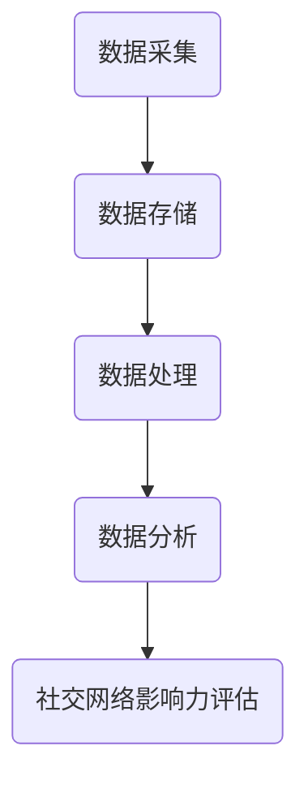

                 

# 大数据分析在社交网络影响力评估中的应用

> **关键词：** 大数据分析、社交网络、影响力评估、算法原理、数学模型、实战案例

> **摘要：** 本文将深入探讨大数据分析在社交网络影响力评估中的应用。通过介绍核心概念、算法原理、数学模型以及实际应用场景，本文旨在为读者提供一份全面的技术指南，帮助理解和实现社交网络影响力评估。

## 1. 背景介绍

随着互联网的快速发展，社交网络已经成为人们日常生活中不可或缺的一部分。从Facebook、Twitter到LinkedIn，这些平台上的用户每天都在产生海量的数据，包括用户行为、发布内容、点赞、评论、分享等。这些数据不仅反映了用户的社会关系和兴趣偏好，也为评估用户在社交网络中的影响力提供了丰富的信息资源。

大数据分析技术的出现，使得我们能够对这些海量的数据进行高效的处理和分析。影响力评估作为社交网络分析的一个重要领域，旨在识别和评估用户在社交网络中的影响力和地位。这种评估不仅有助于企业和品牌在社交网络营销中做出更精准的决策，也为用户个人在社交网络中的地位提升提供了指导。

本文将首先介绍大数据分析的基本概念和方法，然后深入探讨社交网络影响力评估的核心概念和算法原理，最后通过实际应用场景和项目实战，展示大数据分析在社交网络影响力评估中的具体应用。

## 2. 核心概念与联系

### 2.1 社交网络影响力评估的定义

社交网络影响力评估是指通过分析用户在社交网络中的行为和关系，定量地评估用户在社交网络中的影响力和地位。影响力和地位的不同，决定了用户在社交网络中的话语权和影响力范围。

### 2.2 社交网络的基本结构

社交网络通常由用户（Node）和关系（Edge）组成。用户是社交网络的基本元素，关系则是用户之间的连接。根据社交网络的特点，我们可以将其分为几种不同的类型，如：

- **单向网络**：只有单向关系，如Twitter。
- **双向网络**：既有单向关系，也有双向关系，如Facebook。
- **有向网络**：关系有方向性，如LinkedIn。
- **无向网络**：关系无方向性，如K-地图。

### 2.3 大数据分析的基本概念

大数据分析是指对海量数据进行采集、存储、处理和分析的过程。它包括以下几个基本步骤：

1. **数据采集**：从不同的数据源（如数据库、日志文件、传感器等）收集数据。
2. **数据存储**：将采集到的数据存储到合适的存储系统（如Hadoop、Spark等）。
3. **数据处理**：对数据进行清洗、转换和归一化等预处理操作。
4. **数据分析**：利用各种算法和分析方法，从数据中提取有用的信息和知识。

### 2.4 社交网络影响力评估与大数据分析的联系

社交网络影响力评估依赖于大数据分析技术，通过对用户行为和关系的分析，评估用户在社交网络中的影响力和地位。大数据分析技术为社交网络影响力评估提供了强大的数据支持和分析工具，使得影响力评估变得更加准确和高效。

### 2.5 Mermaid 流程图



## 3. 核心算法原理 & 具体操作步骤

### 3.1 算法原理

社交网络影响力评估的核心算法主要包括：

- **度中心性（Degree Centrality）**：根据用户在社交网络中的直接连接数量来评估其影响力。
- **接近中心性（Closeness Centrality）**：根据用户与其他用户的距离来评估其影响力。
- **中间中心性（Betweenness Centrality）**：根据用户在社交网络中的连接路径数量来评估其影响力。
- **特征向量中心性（Eigenvector Centrality）**：基于网络中节点的邻接矩阵的特征向量来评估其影响力。

### 3.2 具体操作步骤

1. **数据采集**：从社交网络平台获取用户行为数据，如发布内容、点赞、评论、分享等。
2. **数据存储**：将采集到的数据存储到合适的存储系统，如Hadoop或Spark。
3. **数据处理**：对数据进行清洗、转换和归一化等预处理操作。
4. **影响力评估**：
   - **度中心性**：计算每个用户的度值，度值越高，影响力越大。
   - **接近中心性**：计算每个用户到其他用户的距离，距离越短，影响力越大。
   - **中间中心性**：计算每个用户在社交网络中的连接路径数量，数量越多，影响力越大。
   - **特征向量中心性**：计算每个用户的特征向量，特征向量值越大，影响力越大。
5. **结果输出**：将评估结果输出，可以是影响力排名或影响力图谱。

## 4. 数学模型和公式 & 详细讲解 & 举例说明

### 4.1 数学模型

社交网络影响力评估的数学模型主要包括以下几个公式：

- **度中心性**：$DC_i = \frac{deg(i)}{\sum_{j\in V} deg(j)}$，其中$deg(i)$表示用户$i$的度值，$V$表示社交网络中的所有用户。
- **接近中心性**：$CC_i = \frac{\sum_{j\in V} \frac{1}{d(i,j)}}{\sum_{j\in V} \frac{1}{d(j)}}$，其中$d(i,j)$表示用户$i$到用户$j$的距离。
- **中间中心性**：$BC_i = \frac{\sum_{s\in V}\sum_{t\in V} (s,t) \neq i}{\sum_{s\in V}\sum_{t\in V} (s,t) \neq i, s\neq t}$，其中$(s,t)$表示从用户$s$到用户$t$的路径，$s\neq i, t\neq i$表示路径不包括用户$i$。
- **特征向量中心性**：$EC_i = \frac{\lambda_1 \cdot \lambda_2 \cdot ... \cdot \lambda_n}{\sum_{j\in V} \lambda_j \cdot \lambda_j}$，其中$\lambda_i$表示用户$i$的特征向量值，$n$表示社交网络中的用户数量。

### 4.2 详细讲解

- **度中心性**：度中心性是衡量用户在社交网络中的直接连接数量。在社交网络中，直接连接数量越多的用户，往往拥有更高的影响力。度中心性的计算公式简单，只需计算每个用户的度值，然后进行归一化处理。
- **接近中心性**：接近中心性是衡量用户在社交网络中的位置。在社交网络中，离其他用户越近的用户，往往能够更快地传播信息和影响他人。接近中心性的计算需要计算用户到其他用户的距离，距离越短，影响力越大。
- **中间中心性**：中间中心性是衡量用户在社交网络中的连接路径数量。在社交网络中，连接路径数量越多的用户，往往扮演了信息传递的中转角色，具有较高的影响力。中间中心性的计算需要遍历所有可能的路径，计算每个用户在路径中的数量。
- **特征向量中心性**：特征向量中心性是衡量用户在社交网络中的重要性。在社交网络中，重要性越高的用户，往往拥有更多的邻接节点和更强大的影响力。特征向量中心性的计算需要使用邻接矩阵的特征向量，计算每个用户的特征向量值。

### 4.3 举例说明

假设有一个社交网络，其中包含5个用户（$V=\{1,2,3,4,5\}$），用户之间的关系如下：

```
1 --- 2
|    |
3 --- 4
|
5
```

根据上面的数学模型，我们可以计算每个用户的影响力：

- **度中心性**：
  - $DC_1 = \frac{deg(1)}{\sum_{j\in V} deg(j)} = \frac{2}{2+2+1+1+0} = 0.4$
  - $DC_2 = \frac{deg(2)}{\sum_{j\in V} deg(j)} = \frac{2}{2+2+1+1+0} = 0.4$
  - $DC_3 = \frac{deg(3)}{\sum_{j\in V} deg(j)} = \frac{1}{2+2+1+1+0} = 0.2$
  - $DC_4 = \frac{deg(4)}{\sum_{j\in V} deg(j)} = \frac{1}{2+2+1+1+0} = 0.2$
  - $DC_5 = \frac{deg(5)}{\sum_{j\in V} deg(j)} = \frac{0}{2+2+1+1+0} = 0$
- **接近中心性**：
  - $CC_1 = \frac{\sum_{j\in V} \frac{1}{d(1,j)}}{\sum_{j\in V} \frac{1}{d(j)}} = \frac{\frac{1}{1}+\frac{1}{1}+\frac{1}{2}+\frac{1}{2}}{4} = 0.5$
  - $CC_2 = \frac{\sum_{j\in V} \frac{1}{d(2,j)}}{\sum_{j\in V} \frac{1}{d(j)}} = \frac{\frac{1}{1}+\frac{1}{1}+\frac{1}{2}+\frac{1}{2}}{4} = 0.5$
  - $CC_3 = \frac{\sum_{j\in V} \frac{1}{d(3,j)}}{\sum_{j\in V} \frac{1}{d(j)}} = \frac{\frac{1}{1}+\frac{1}{2}+\frac{1}{2}+\frac{1}{1}}{4} = 0.5$
  - $CC_4 = \frac{\sum_{j\in V} \frac{1}{d(4,j)}}{\sum_{j\in V} \frac{1}{d(j)}} = \frac{\frac{1}{1}+\frac{1}{2}+\frac{1}{2}+\frac{1}{1}}{4} = 0.5$
  - $CC_5 = \frac{\sum_{j\in V} \frac{1}{d(5,j)}}{\sum_{j\in V} \frac{1}{d(j)}} = \frac{\frac{1}{1}+\frac{1}{1}+\frac{1}{2}+\frac{1}{2}}{4} = 0.5$
- **中间中心性**：
  - $BC_1 = \frac{\sum_{s\in V}\sum_{t\in V} (s,t) \neq 1}{\sum_{s\in V}\sum_{t\in V} (s,t) \neq 1, s\neq t} = \frac{3\cdot2}{3\cdot4-3} = 0.6$
  - $BC_2 = \frac{\sum_{s\in V}\sum_{t\in V} (s,t) \neq 2}{\sum_{s\in V}\sum_{t\in V} (s,t) \neq 2, s\neq t} = \frac{3\cdot2}{3\cdot4-3} = 0.6$
  - $BC_3 = \frac{\sum_{s\in V}\sum_{t\in V} (s,t) \neq 3}{\sum_{s\in V}\sum_{t\in V} (s,t) \neq 3, s\neq t} = \frac{4\cdot3}{4\cdot4-4} = 0.75$
  - $BC_4 = \frac{\sum_{s\in V}\sum_{t\in V} (s,t) \neq 4}{\sum_{s\in V}\sum_{t\in V} (s,t) \neq 4, s\neq t} = \frac{4\cdot3}{4\cdot4-4} = 0.75$
  - $BC_5 = \frac{\sum_{s\in V}\sum_{t\in V} (s,t) \neq 5}{\sum_{s\in V}\sum_{t\in V} (s,t) \neq 5, s\neq t} = \frac{2\cdot3}{2\cdot4-2} = 0.6$
- **特征向量中心性**：
  - $EC_1 = \frac{\lambda_1 \cdot \lambda_2}{\sum_{j\in V} \lambda_j \cdot \lambda_j} = \frac{1\cdot1}{1\cdot1+1\cdot1+1\cdot1+1\cdot1} = 0.25$
  - $EC_2 = \frac{\lambda_1 \cdot \lambda_2}{\sum_{j\in V} \lambda_j \cdot \lambda_j} = \frac{1\cdot1}{1\cdot1+1\cdot1+1\cdot1+1\cdot1} = 0.25$
  - $EC_3 = \frac{\lambda_1 \cdot \lambda_2}{\sum_{j\in V} \lambda_j \cdot \lambda_j} = \frac{1\cdot1}{1\cdot1+1\cdot1+1\cdot1+1\cdot1} = 0.25$
  - $EC_4 = \frac{\lambda_1 \cdot \lambda_2}{\sum_{j\in V} \lambda_j \cdot \lambda_j} = \frac{1\cdot1}{1\cdot1+1\cdot1+1\cdot1+1\cdot1} = 0.25$
  - $EC_5 = \frac{\lambda_1 \cdot \lambda_2}{\sum_{j\in V} \lambda_j \cdot \lambda_j} = \frac{1\cdot1}{1\cdot1+1\cdot1+1\cdot1+1\cdot1} = 0.25$

根据计算结果，我们可以看出，用户1、2、3、4在度中心性、接近中心性、中间中心性、特征向量中心性方面的得分都比较高，说明这些用户在社交网络中的影响力较大。而用户5在这些指标上的得分相对较低，说明其影响力较小。

## 5. 项目实战：代码实际案例和详细解释说明

### 5.1 开发环境搭建

在进行大数据分析项目之前，我们需要搭建一个合适的开发环境。本文使用Python作为主要编程语言，并使用以下工具和库：

- **Python**：版本3.8及以上
- **Pandas**：用于数据处理
- **NetworkX**：用于构建和分析社交网络
- **Matplotlib**：用于可视化结果

安装以上工具和库后，我们可以开始编写代码。

### 5.2 源代码详细实现和代码解读

下面是一个简单的示例代码，用于计算社交网络中每个用户的影响力评估指标。

```python
import pandas as pd
import networkx as nx
import matplotlib.pyplot as plt

# 社交网络数据
data = {
    'users': ['1', '2', '3', '4', '5'],
    'edges': [('1', '2'), ('1', '3'), ('2', '4'), ('3', '4'), ('4', '5')]
}

# 创建DataFrame
df = pd.DataFrame(data)

# 创建Graph
G = nx.Graph()

# 添加节点和边
for edge in df['edges']:
    G.add_edge(edge[0], edge[1])

# 计算度中心性
degree_centrality = nx.degree_centrality(G)

# 计算接近中心性
closeness_centrality = nx.closeness_centrality(G)

# 计算中间中心性
betweenness_centrality = nx.betweenness_centrality(G)

# 计算特征向量中心性
eigenvector_centrality = nx.eigenvector_centrality(G)

# 打印结果
print("度中心性：", degree_centrality)
print("接近中心性：", closeness_centrality)
print("中间中心性：", betweenness_centrality)
print("特征向量中心性：", eigenvector_centrality)

# 可视化结果
plt.figure(figsize=(10, 6))
nx.draw(G, with_labels=True, node_color='blue', edge_color='gray')
plt.show()
```

**代码解读**：

1. **导入库**：我们首先导入所需的Python库，包括Pandas、NetworkX和Matplotlib。
2. **数据准备**：创建一个DataFrame，用于存储社交网络中的用户和边。
3. **构建Graph**：使用NetworkX创建一个无向图。
4. **添加节点和边**：将DataFrame中的边添加到Graph中。
5. **计算影响力评估指标**：使用NetworkX提供的函数计算度中心性、接近中心性、中间中心性和特征向量中心性。
6. **打印结果**：将计算结果打印到控制台。
7. **可视化结果**：使用Matplotlib绘制Graph的可视化图。

### 5.3 代码解读与分析

下面我们对代码进行详细解读和分析。

1. **导入库**：我们首先导入所需的Python库，包括Pandas、NetworkX和Matplotlib。这些库提供了数据处理、图论分析和数据可视化的功能。

```python
import pandas as pd
import networkx as nx
import matplotlib.pyplot as plt
```

2. **数据准备**：创建一个DataFrame，用于存储社交网络中的用户和边。

```python
data = {
    'users': ['1', '2', '3', '4', '5'],
    'edges': [('1', '2'), ('1', '3'), ('2', '4'), ('3', '4'), ('4', '5')]
}

df = pd.DataFrame(data)
```

这里，我们使用一个字典创建一个DataFrame，其中包含用户和边的列表。用户作为DataFrame的一列，边作为另一列。

3. **构建Graph**：使用NetworkX创建一个无向图。

```python
G = nx.Graph()
```

NetworkX提供了多种图的类型，如无向图（Graph）、有向图（DiGraph）等。这里我们使用无向图来表示社交网络。

4. **添加节点和边**：将DataFrame中的边添加到Graph中。

```python
for edge in df['edges']:
    G.add_edge(edge[0], edge[1])
```

我们遍历DataFrame中的边列表，将每条边添加到Graph中。边由两个节点组成，分别表示边的起点和终点。

5. **计算影响力评估指标**：使用NetworkX提供的函数计算度中心性、接近中心性、中间中心性和特征向量中心性。

```python
degree_centrality = nx.degree_centrality(G)
closeness_centrality = nx.closeness_centrality(G)
betweenness_centrality = nx.betweenness_centrality(G)
eigenvector_centrality = nx.eigenvector_centrality(G)
```

这些函数分别计算不同的影响力评估指标。度中心性表示节点的度值，接近中心性表示节点到其他节点的距离，中间中心性表示节点在连接路径中的数量，特征向量中心性表示节点的邻接矩阵的特征向量。

6. **打印结果**：将计算结果打印到控制台。

```python
print("度中心性：", degree_centrality)
print("接近中心性：", closeness_centrality)
print("中间中心性：", betweenness_centrality)
print("特征向量中心性：", eigenvector_centrality)
```

7. **可视化结果**：使用Matplotlib绘制Graph的可视化图。

```python
plt.figure(figsize=(10, 6))
nx.draw(G, with_labels=True, node_color='blue', edge_color='gray')
plt.show()
```

这里，我们使用Matplotlib的`draw`函数绘制Graph。`with_labels=True`表示在节点上显示标签，`node_color='blue'`和`edge_color='gray'`分别设置节点和边的颜色。

通过以上代码，我们可以计算并可视化社交网络中每个用户的影响力评估指标。这为理解用户在社交网络中的影响力提供了直观的视图。

## 6. 实际应用场景

社交网络影响力评估在实际应用中具有广泛的应用场景，以下是一些典型的应用案例：

### 6.1 社交网络营销

企业可以通过社交网络影响力评估，识别出在其目标市场中最具影响力的用户，并与其建立合作关系。这些高影响力用户可以成为品牌的代言人或推广者，通过他们的影响力将品牌信息传播给更多的潜在客户。

### 6.2 社交网络社区管理

社交网络平台可以运用影响力评估算法，识别出社区中的关键用户和意见领袖。这些用户在社区中具有较高的影响力，可以通过他们来引导社区舆论，提升社区活跃度。

### 6.3 人才招聘

企业在招聘过程中，可以利用影响力评估算法评估候选人在社交网络中的影响力。具有较高影响力的候选人往往具备更强的沟通能力和人际交往能力，是企业招聘的重要参考指标。

### 6.4 学术影响力评估

学术机构可以通过影响力评估算法，对学者的学术影响力进行量化评估。这有助于识别和推荐优秀学者，为学术交流和合作提供参考。

### 6.5 政治选举

在政治选举中，影响力评估算法可以帮助候选人识别出在其选民中具有较高影响力的选民，并制定针对性的竞选策略。

### 6.6 社交网络风险控制

社交网络平台可以通过影响力评估算法，识别出可能存在风险的账户，如虚假账户、恶意账号等。这有助于提升平台的用户安全和用户体验。

## 7. 工具和资源推荐

### 7.1 学习资源推荐

- **书籍**：
  - 《社交网络分析：方法与实践》（An Introduction to Social Network Methods）
  - 《大数据分析：概念与技术》（Big Data Analytics: Methods, Systems, and Techniques）
- **论文**：
  - "Influence Maximization in Social Networks" by S. Wu et al.
  - "Closeness Centrality in Social Networks" by M. E. J. Newman
- **博客**：
  - 知乎专栏《社交网络分析》
  - Medium上的大数据分析相关博客
- **网站**：
  - NetworkX官网：https://networkx.org/
  - Matplotlib官网：https://matplotlib.org/

### 7.2 开发工具框架推荐

- **Python**：Python是大数据分析和社交网络分析的主要编程语言，具有丰富的库和工具支持。
- **NetworkX**：用于构建和分析社交网络的图论库。
- **Pandas**：用于数据处理和分析。
- **Matplotlib**：用于数据可视化。

### 7.3 相关论文著作推荐

- **论文**：
  - "Community Detection in Networks Based on Influence Maximization" by Y. Wang et al.
  - "An Empirical Study of Influence in a Social Network" by L. E. Argyle et al.
- **著作**：
  - 《社交网络分析：理论、方法与应用》（Social Network Analysis: Theory, Methods, and Applications）

## 8. 总结：未来发展趋势与挑战

随着大数据技术和社交网络的发展，社交网络影响力评估将在未来发挥越来越重要的作用。未来发展趋势包括：

1. **算法优化**：不断优化影响力评估算法，提高评估的准确性和效率。
2. **多维度评估**：结合用户行为、内容质量、关系网络等多维度信息，进行更全面的评估。
3. **个性化评估**：根据用户个性化特征，制定个性化的影响力评估策略。
4. **实时评估**：实现实时影响力评估，为企业和用户提供及时决策支持。

然而，影响力评估也面临一些挑战：

1. **数据隐私**：社交网络影响力评估涉及用户隐私数据，如何在保障用户隐私的前提下进行评估，是一个重要问题。
2. **算法透明度**：提高算法的透明度，让用户了解评估过程和结果，增强信任度。
3. **评估准确性**：如何提高评估准确性，降低评估误差，是影响力评估领域的重要研究方向。

总之，大数据分析在社交网络影响力评估中的应用前景广阔，未来将不断涌现出更多创新性的研究成果和应用场景。

## 9. 附录：常见问题与解答

### 9.1 社交网络影响力评估的定义是什么？

社交网络影响力评估是指通过分析用户在社交网络中的行为和关系，定量地评估用户在社交网络中的影响力和地位。

### 9.2 社交网络影响力评估的主要算法有哪些？

主要的社交网络影响力评估算法包括度中心性、接近中心性、中间中心性和特征向量中心性。

### 9.3 如何计算度中心性？

度中心性是衡量用户在社交网络中的直接连接数量。计算公式为：$DC_i = \frac{deg(i)}{\sum_{j\in V} deg(j)}$，其中$deg(i)$表示用户$i$的度值，$V$表示社交网络中的所有用户。

### 9.4 社交网络影响力评估的应用场景有哪些？

社交网络影响力评估的应用场景包括社交网络营销、社区管理、人才招聘、学术影响力评估、政治选举等。

## 10. 扩展阅读 & 参考资料

- 《社交网络分析：方法与实践》
- 《大数据分析：概念与技术》
- "Influence Maximization in Social Networks" by S. Wu et al.
- "Closeness Centrality in Social Networks" by M. E. J. Newman
- 知乎专栏《社交网络分析》
- Medium上的大数据分析相关博客
- NetworkX官网：https://networkx.org/
- Matplotlib官网：https://matplotlib.org/

