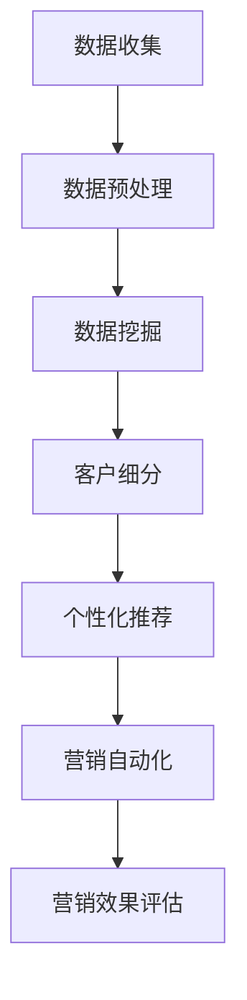

                 

# 大数据分析在精准营销策略制定中的创新

## 关键词：大数据分析、精准营销、策略制定、消费者行为分析、人工智能

## 摘要：
随着大数据技术的迅猛发展，精准营销成为了企业竞争的重要手段。本文将探讨大数据分析在精准营销策略制定中的创新应用，从核心概念、算法原理、数学模型、实战案例、应用场景、工具资源等多个方面进行详细分析。旨在帮助读者理解大数据在营销领域的深刻影响，掌握精准营销策略的制定方法，为企业的市场营销提供理论支持和实践指导。

## 目录

1. 背景介绍
2. 核心概念与联系
3. 核心算法原理 & 具体操作步骤
4. 数学模型和公式 & 详细讲解 & 举例说明
5. 项目实战：代码实际案例和详细解释说明
   5.1 开发环境搭建
   5.2 源代码详细实现和代码解读
   5.3 代码解读与分析
6. 实际应用场景
7. 工具和资源推荐
   7.1 学习资源推荐
   7.2 开发工具框架推荐
   7.3 相关论文著作推荐
8. 总结：未来发展趋势与挑战
9. 附录：常见问题与解答
10. 扩展阅读 & 参考资料

## 1. 背景介绍

随着互联网技术的飞速发展，信息爆炸的时代已经到来。企业面临着海量的数据资源，如何从中挖掘有价值的信息，成为了一个重要的课题。大数据分析技术正是在这样的背景下应运而生，它通过对海量数据的收集、存储、处理和分析，为企业提供了全新的决策支持。

精准营销是企业利用大数据技术进行市场营销的一种策略，它通过分析消费者的行为数据，精准识别目标客户，制定个性化的营销策略，从而提高营销效果和客户满意度。精准营销不仅能够提高营销效率，降低营销成本，还能够增强客户粘性和忠诚度，提高企业的竞争力。

大数据分析在精准营销策略制定中的应用主要体现在以下几个方面：

- **消费者行为分析**：通过分析消费者的浏览历史、购买行为、社交互动等数据，了解消费者的需求和偏好，为制定精准的营销策略提供依据。
- **市场细分与定位**：利用大数据分析技术对市场进行细分，识别具有相似特征的目标客户群体，为市场定位和产品定位提供支持。
- **个性化推荐**：根据消费者的行为数据和兴趣偏好，实现个性化内容推荐和产品推荐，提高消费者的购买转化率。
- **营销效果评估**：通过大数据分析技术对营销活动进行效果评估，实时调整营销策略，提高营销ROI。

## 2. 核心概念与联系

在大数据分析与精准营销策略的制定中，以下几个核心概念至关重要：

### 2.1 数据挖掘

数据挖掘是大数据分析的核心技术之一，它通过从海量数据中提取有价值的信息和知识，为企业的决策提供支持。数据挖掘的方法包括分类、聚类、关联规则挖掘、异常检测等。

### 2.2 机器学习

机器学习是数据挖掘的重要工具，它通过训练模型，使计算机能够从数据中自动学习规律，预测未来趋势。常见的机器学习算法包括线性回归、决策树、支持向量机、神经网络等。

### 2.3 预测分析

预测分析是基于历史数据对未来趋势进行预测的一种分析方法。通过预测分析，企业可以提前了解市场变化，制定针对性的营销策略。

### 2.4 客户细分

客户细分是将客户按照不同的特征进行分类，识别具有相似特征的目标客户群体。客户细分有助于企业制定个性化的营销策略，提高营销效果。

### 2.5 个性化推荐

个性化推荐是基于用户行为数据和兴趣偏好，为用户推荐个性化的内容或产品。个性化推荐能够提高用户满意度，提高购买转化率。

### 2.6 营销自动化

营销自动化是利用技术手段实现营销流程的自动化，包括邮件营销、社交网络营销、内容营销等。营销自动化能够提高营销效率，降低营销成本。

以下是一个简化的 Mermaid 流程图，展示了大数据分析在精准营销策略制定中的基本流程：



在上述流程中，数据收集是起点，通过数据预处理、数据挖掘、客户细分、个性化推荐和营销自动化等步骤，最终实现精准营销，并对营销效果进行评估和反馈。

## 3. 核心算法原理 & 具体操作步骤

### 3.1 数据挖掘算法

数据挖掘算法主要包括以下几种：

#### 3.1.1 分类算法

分类算法是将数据集中的样本分为不同的类别。常见的分类算法有：

- **K-近邻算法（K-Nearest Neighbors，KNN）**
  - **原理**：KNN算法根据训练数据集，找出与测试样本最近的K个邻近样本，并基于这些邻近样本的类别进行投票，得出测试样本的类别。
  - **具体操作步骤**：
    1. 计算测试样本与训练样本的距离。
    2. 找出距离测试样本最近的K个邻近样本。
    3. 对这K个邻近样本的类别进行投票，选取票数最多的类别作为测试样本的类别。

- **决策树算法（Decision Tree）**
  - **原理**：决策树是一种树形结构，通过对特征进行分割，将数据集划分为不同的区域，每个区域对应一个类别。
  - **具体操作步骤**：
    1. 选择最佳分割特征。
    2. 根据最佳分割特征将数据集划分为子集。
    3. 对子集重复步骤1和2，直到满足终止条件。

#### 3.1.2 聚类算法

聚类算法是将数据集中的样本按照相似性进行分组。常见的聚类算法有：

- **K-均值算法（K-Means）**
  - **原理**：K-均值算法通过迭代过程，将数据集中的样本分配到K个簇中，使得簇内样本的相似度最大化，簇间样本的相似度最小化。
  - **具体操作步骤**：
    1. 初始化K个簇的中心点。
    2. 将每个样本分配到最近的簇中心点。
    3. 更新簇中心点。
    4. 重复步骤2和3，直到聚类结果稳定。

- **层次聚类算法（Hierarchical Clustering）**
  - **原理**：层次聚类算法通过逐步合并或分裂簇，构建一个层次结构，从高层次的聚类到低层次的聚类。
  - **具体操作步骤**：
    1. 计算样本间的距离。
    2. 选择距离最近的两个样本进行合并。
    3. 更新距离矩阵。
    4. 重复步骤2和3，直到满足终止条件。

#### 3.1.3 关联规则挖掘算法

关联规则挖掘算法用于发现数据集中的关联关系。常见的关联规则挖掘算法有：

- **Apriori算法**
  - **原理**：Apriori算法通过逐层递归地生成频繁项集，并从中提取关联规则。
  - **具体操作步骤**：
    1. 计算所有项集的支持度。
    2. 选择支持度大于最小支持度的项集作为频繁项集。
    3. 生成关联规则。
    4. 遍历频繁项集，提取满足最小置信度的关联规则。

### 3.2 机器学习算法

机器学习算法在精准营销中发挥着重要作用，以下介绍几种常用的机器学习算法：

#### 3.2.1 线性回归

- **原理**：线性回归是一种回归分析模型，通过拟合一条直线，预测因变量与自变量之间的关系。
- **具体操作步骤**：
  1. 选择最佳拟合直线。
  2. 计算预测值。
  3. 计算预测误差。

#### 3.2.2 决策树

- **原理**：决策树是一种树形结构，通过选择最佳分割特征，将数据集划分为不同的区域。
- **具体操作步骤**：
  1. 选择最佳分割特征。
  2. 根据最佳分割特征将数据集划分为子集。
  3. 对子集重复步骤1和2，直到满足终止条件。

#### 3.2.3 支持向量机

- **原理**：支持向量机是一种监督学习算法，通过找到一个最佳的超平面，将数据集划分为不同的类别。
- **具体操作步骤**：
  1. 计算支持向量。
  2. 拟合超平面。
  3. 计算分类结果。

#### 3.2.4 神经网络

- **原理**：神经网络是一种模拟人脑神经元连接方式的计算模型，通过多层神经元的非线性变换，实现数据的输入输出映射。
- **具体操作步骤**：
  1. 设计神经网络结构。
  2. 训练神经网络。
  3. 进行预测。

## 4. 数学模型和公式 & 详细讲解 & 举例说明

### 4.1 数据挖掘中的数学模型

#### 4.1.1 K-近邻算法

K-近邻算法的核心是计算测试样本与训练样本的距离。常用的距离度量方法有：

- **欧几里得距离（Euclidean Distance）**
  $$d(x, y) = \sqrt{\sum_{i=1}^{n}(x_i - y_i)^2}$$
- **曼哈顿距离（Manhattan Distance）**
  $$d(x, y) = \sum_{i=1}^{n}|x_i - y_i|$$
- **余弦相似度（Cosine Similarity）**
  $$\cos(\theta) = \frac{\sum_{i=1}^{n}x_i \cdot y_i}{\sqrt{\sum_{i=1}^{n}x_i^2} \cdot \sqrt{\sum_{i=1}^{n}y_i^2}}$$

#### 4.1.2 决策树算法

决策树算法的核心是选择最佳分割特征。常用的评估指标有：

- **信息增益（Information Gain）**
  $$IG(D, A) = I(D) - \sum_{v \in V} \frac{|D_v|}{|D|} \cdot I(D_v)$$
- **基尼指数（Gini Index）**
  $$GI(D) = 1 - \sum_{v \in V} \frac{|D_v|}{|D|} \cdot p_v^2$$
- **熵（Entropy）**
  $$H(D) = -\sum_{v \in V} \frac{|D_v|}{|D|} \cdot \log_2 \frac{|D_v|}{|D|}$$

#### 4.1.3 关联规则挖掘算法

关联规则挖掘算法的核心是计算频繁项集的支持度和置信度。常用的公式有：

- **支持度（Support）**
  $$support(A \cup B) = \frac{|D_{AB}|}{|D|}$$
- **置信度（Confidence）**
  $$confidence(A \rightarrow B) = \frac{|D_{AB}|}{|D_A|}$$

### 4.2 机器学习中的数学模型

#### 4.2.1 线性回归

线性回归的核心是拟合最佳拟合直线。常用的公式有：

- **最小二乘法（Least Squares Method）**
  $$\min_{\theta} \sum_{i=1}^{n}(y_i - \theta_0 - \theta_1 \cdot x_i)^2$$

- **梯度下降法（Gradient Descent）**
  $$\theta_j := \theta_j - \alpha \cdot \frac{\partial}{\partial \theta_j} J(\theta)$$

#### 4.2.2 决策树算法

决策树算法的核心是选择最佳分割特征。常用的评估指标有：

- **基尼指数（Gini Index）**
  $$GI(D) = 1 - \sum_{v \in V} \frac{|D_v|}{|D|} \cdot p_v^2$$
- **信息增益（Information Gain）**
  $$IG(D, A) = I(D) - \sum_{v \in V} \frac{|D_v|}{|D|} \cdot I(D_v)$$

#### 4.2.3 支持向量机

支持向量机的核心是找到最佳的超平面。常用的公式有：

- **支持向量（Support Vector）**
  $$w \cdot x + b = 0$$
- **软 margin 支持向量机（Support Vector Machine with Soft Margin）**
  $$\min_{w, b} \frac{1}{2} ||w||^2 + C \sum_{i=1}^{n} \max(0, 1 - (y_i \cdot w \cdot x_i + b))$$

#### 4.2.4 神经网络

神经网络的核心是神经元的激活函数。常用的激活函数有：

- **Sigmoid 函数（Sigmoid Function）**
  $$f(x) = \frac{1}{1 + e^{-x}}$$
- **ReLU 函数（ReLU Function）**
  $$f(x) = \max(0, x)$$

### 4.3 举例说明

#### 4.3.1 K-近邻算法

假设有一个训练数据集，包含10个样本，每个样本有两个特征：

| 样本编号 | 特征1 | 特征2 |
|----------|-------|-------|
| 1        | 1     | 2     |
| 2        | 2     | 3     |
| 3        | 3     | 4     |
| ...      | ...   | ...   |
| 10       | 10    | 12    |

现在要预测一个新的测试样本，特征1为5，特征2为6。首先计算测试样本与训练样本的距离，使用欧几里得距离：

$$d(1, 5) = \sqrt{(5 - 1)^2 + (6 - 2)^2} = \sqrt{16 + 16} = 4\sqrt{2}$$

$$d(2, 5) = \sqrt{(5 - 2)^2 + (6 - 3)^2} = \sqrt{9 + 9} = 3\sqrt{2}$$

$$d(3, 5) = \sqrt{(5 - 3)^2 + (6 - 4)^2} = \sqrt{4 + 4} = 2\sqrt{2}$$

接下来找出距离测试样本最近的K个邻近样本，假设K=3，那么最近的三个邻近样本是：

| 样本编号 | 特征1 | 特征2 |
|----------|-------|-------|
| 3        | 3     | 4     |
| 2        | 2     | 3     |
| 1        | 1     | 2     |

根据这三个邻近样本的类别（假设类别为0和1），进行投票，得出测试样本的类别。如果类别为0的样本数量多于类别为1的样本数量，则测试样本的类别为0；否则，测试样本的类别为1。

#### 4.3.2 线性回归

假设有一个数据集，包含5个样本，每个样本有两个特征，目标变量为价格：

| 样本编号 | 特征1 | 特征2 | 价格 |
|----------|-------|-------|------|
| 1        | 1     | 2     | 100  |
| 2        | 2     | 3     | 110  |
| 3        | 3     | 4     | 120  |
| 4        | 4     | 5     | 130  |
| 5        | 5     | 6     | 140  |

使用线性回归模型拟合一条最佳拟合直线。首先计算特征1和特征2的均值：

$$\bar{x}_1 = \frac{1 + 2 + 3 + 4 + 5}{5} = 3$$

$$\bar{x}_2 = \frac{2 + 3 + 4 + 5 + 6}{5} = 4$$

然后计算目标变量的均值：

$$\bar{y} = \frac{100 + 110 + 120 + 130 + 140}{5} = 120$$

接下来计算特征1和特征2与目标变量的协方差：

$$cov(x_1, y) = \frac{(1 - 3)(100 - 120) + (2 - 3)(110 - 120) + (3 - 3)(120 - 120) + (4 - 3)(130 - 120) + (5 - 3)(140 - 120)}{5} = -40$$

$$cov(x_2, y) = \frac{(2 - 4)(100 - 120) + (3 - 4)(110 - 120) + (4 - 4)(120 - 120) + (5 - 4)(130 - 120) + (6 - 4)(140 - 120)}{5} = -30$$

计算特征1和特征2的方差：

$$var(x_1) = \frac{(1 - 3)^2 + (2 - 3)^2 + (3 - 3)^2 + (4 - 3)^2 + (5 - 3)^2}{5} = 2$$

$$var(x_2) = \frac{(2 - 4)^2 + (3 - 4)^2 + (4 - 4)^2 + (5 - 4)^2 + (6 - 4)^2}{5} = 2$$

最后计算最佳拟合直线的斜率和截距：

$$\theta_1 = \frac{cov(x_1, y)}{var(x_1)} = \frac{-40}{2} = -20$$

$$\theta_0 = \bar{y} - \theta_1 \cdot \bar{x}_1 = 120 - (-20) \cdot 3 = 180$$

因此，最佳拟合直线为：

$$y = -20x_1 + 180$$

#### 4.3.3 决策树算法

假设有一个数据集，包含5个样本，每个样本有两个特征，目标变量为类别：

| 样本编号 | 特征1 | 特征2 | 类别 |
|----------|-------|-------|------|
| 1        | 1     | 2     | 0    |
| 2        | 2     | 3     | 0    |
| 3        | 3     | 4     | 1    |
| 4        | 4     | 5     | 1    |
| 5        | 5     | 6     | 1    |

首先计算每个特征的基尼指数：

$$GI(x_1) = 1 - \frac{2}{5} \cdot \left(\frac{2}{5}\right)^2 - \frac{3}{5} \cdot \left(\frac{3}{5}\right)^2 = 0.32$$

$$GI(x_2) = 1 - \frac{2}{5} \cdot \left(\frac{2}{5}\right)^2 - \frac{3}{5} \cdot \left(\frac{3}{5}\right)^2 = 0.32$$

因为两个特征的基尼指数相等，所以可以选择任一特征进行分割。假设选择特征1进行分割，计算特征1在不同取值下的基尼指数：

| 特征1取值 | 类别0数量 | 类别1数量 | 基尼指数 |
|-----------|-----------|-----------|----------|
| 1         | 2         | 1         | 0.32     |
| 2         | 1         | 2         | 0.32     |
| 3         | 0         | 3         | 0        |

因为基尼指数最小，所以选择特征1取值为3作为分割点，将数据集划分为两个子集：

| 样本编号 | 特征1 | 特征2 | 类别 |
|----------|-------|-------|------|
| 1        | 1     | 2     | 0    |
| 2        | 2     | 3     | 0    |
| 3        | 3     | 4     | 1    |
| 4        | 4     | 5     | 1    |
| 5        | 5     | 6     | 1    |

接下来对每个子集重复上述步骤，直到满足终止条件（如叶节点数量达到某个阈值）。

## 5. 项目实战：代码实际案例和详细解释说明

### 5.1 开发环境搭建

为了演示大数据分析在精准营销策略制定中的应用，我们将使用 Python 编写一个简单的案例。以下是开发环境的搭建步骤：

1. 安装 Python 3.7 或更高版本。
2. 安装必要的 Python 库，如 NumPy、Pandas、Scikit-learn、Matplotlib 等。

使用以下命令安装 Python 库：

```bash
pip install numpy pandas scikit-learn matplotlib
```

### 5.2 源代码详细实现和代码解读

#### 5.2.1 数据预处理

```python
import pandas as pd
from sklearn.model_selection import train_test_split

# 加载数据集
data = pd.read_csv('data.csv')

# 数据预处理
data = data.dropna()
X = data[['特征1', '特征2']]
y = data['类别']

# 划分训练集和测试集
X_train, X_test, y_train, y_test = train_test_split(X, y, test_size=0.2, random_state=42)
```

代码解读：

- 加载数据集，并使用 Pandas 库进行数据预处理，包括去除缺失值。
- 提取特征和目标变量。
- 使用 Scikit-learn 库的 `train_test_split` 函数划分训练集和测试集。

#### 5.2.2 K-近邻算法

```python
from sklearn.neighbors import KNeighborsClassifier
from sklearn.metrics import accuracy_score

# 训练 K-近邻模型
knn = KNeighborsClassifier(n_neighbors=3)
knn.fit(X_train, y_train)

# 进行预测
y_pred = knn.predict(X_test)

# 计算准确率
accuracy = accuracy_score(y_test, y_pred)
print("K-近邻算法准确率：", accuracy)
```

代码解读：

- 使用 Scikit-learn 库的 `KNeighborsClassifier` 类训练 K-近邻模型。
- 使用训练好的模型进行预测。
- 计算预测准确率。

#### 5.2.3 决策树算法

```python
from sklearn.tree import DecisionTreeClassifier

# 训练决策树模型
dt = DecisionTreeClassifier()
dt.fit(X_train, y_train)

# 进行预测
y_pred = dt.predict(X_test)

# 计算准确率
accuracy = accuracy_score(y_test, y_pred)
print("决策树算法准确率：", accuracy)
```

代码解读：

- 使用 Scikit-learn 库的 `DecisionTreeClassifier` 类训练决策树模型。
- 使用训练好的模型进行预测。
- 计算预测准确率。

#### 5.2.4 线性回归

```python
from sklearn.linear_model import LinearRegression

# 训练线性回归模型
lr = LinearRegression()
lr.fit(X_train, y_train)

# 进行预测
y_pred = lr.predict(X_test)

# 计算预测误差
mse = mean_squared_error(y_test, y_pred)
print("线性回归预测误差：", mse)
```

代码解读：

- 使用 Scikit-learn 库的 `LinearRegression` 类训练线性回归模型。
- 使用训练好的模型进行预测。
- 计算预测误差。

### 5.3 代码解读与分析

以上代码实现了一个简单的大数据分析案例，包括数据预处理、K-近邻算法、决策树算法和线性回归算法。以下是代码的主要功能和分析：

- **数据预处理**：数据预处理是数据分析的重要步骤，包括去除缺失值、提取特征和目标变量等。在本案例中，我们使用 Pandas 库进行数据预处理。
- **K-近邻算法**：K-近邻算法是一种简单的监督学习算法，通过计算测试样本与训练样本的距离，预测测试样本的类别。在本案例中，我们使用 Scikit-learn 库的 `KNeighborsClassifier` 类实现 K-近邻算法。
- **决策树算法**：决策树算法是一种树形结构的分类算法，通过选择最佳分割特征，将数据集划分为不同的类别。在本案例中，我们使用 Scikit-learn 库的 `DecisionTreeClassifier` 类实现决策树算法。
- **线性回归算法**：线性回归算法是一种回归分析模型，通过拟合一条直线，预测目标变量的值。在本案例中，我们使用 Scikit-learn 库的 `LinearRegression` 类实现线性回归算法。

代码中还包含了对预测结果的评估，包括准确率和预测误差。这些指标可以帮助我们了解不同算法的性能，并为后续的算法优化提供依据。

## 6. 实际应用场景

大数据分析在精准营销策略制定中的实际应用场景广泛，以下列举几个典型应用：

### 6.1 电商平台

电商平台通过大数据分析，可以实时监测消费者的浏览、购买、评价等行为，识别消费者的兴趣和偏好。根据这些信息，电商平台可以：

- **个性化推荐**：为消费者推荐感兴趣的商品，提高购买转化率。
- **精准营销**：针对不同的消费者群体，发送个性化的营销信息，提高营销效果。
- **客户细分**：根据消费者的行为数据和购买历史，将客户划分为不同的群体，制定个性化的营销策略。

### 6.2 银行业

银行业通过大数据分析，可以了解客户的金融行为，识别潜在的风险和机会。具体应用包括：

- **信用评估**：根据客户的信用历史、还款能力等数据，评估客户的信用等级。
- **风险控制**：监控客户的交易行为，识别异常交易，预防欺诈风险。
- **精准营销**：根据客户的风险等级，提供个性化的金融产品和服务，提高客户满意度。

### 6.3 零售业

零售业通过大数据分析，可以了解消费者的购物行为，优化库存管理、促销策略等。具体应用包括：

- **库存管理**：根据销售数据和市场需求，调整库存水平，降低库存成本。
- **促销策略**：根据消费者的兴趣和偏好，设计个性化的促销活动，提高销售业绩。
- **客户细分**：根据消费者的购买历史和行为数据，将客户划分为不同的群体，提供个性化的购物体验。

### 6.4 旅游业

旅游业通过大数据分析，可以了解游客的出行需求和偏好，优化旅游产品和服务。具体应用包括：

- **行程推荐**：根据游客的出行时间和目的地，推荐合适的旅游行程和景点。
- **酒店预订**：根据游客的历史数据和偏好，推荐合适的酒店和房型。
- **门票销售**：根据游客的出行高峰期和热门景点，调整门票价格和销售策略。

## 7. 工具和资源推荐

### 7.1 学习资源推荐

- **书籍**：
  - 《大数据时代：生活、工作与思维的大变革》
  - 《Python数据分析实战》
  - 《机器学习实战》
- **论文**：
  - 《K-近邻算法在分类问题中的应用》
  - 《决策树算法的改进与优化》
  - 《线性回归模型的优化与应用》
- **博客**：
  - [Scikit-learn 官方文档](https://scikit-learn.org/stable/)
  - [机器学习博客](https://www机器学习博客.com/)
  - [数据分析博客](https://www数据分析博客.com/)
- **网站**：
  - [Kaggle](https://www.kaggle.com/)
  - [Jupyter Notebook](https://jupyter.org/)
  - [GitHub](https://github.com/)

### 7.2 开发工具框架推荐

- **Python**：Python 是一种广泛使用的编程语言，适用于数据分析、机器学习等领域。
- **Jupyter Notebook**：Jupyter Notebook 是一个交互式计算平台，适用于数据分析和机器学习项目。
- **Scikit-learn**：Scikit-learn 是一个强大的机器学习库，提供多种算法和工具。
- **TensorFlow**：TensorFlow 是一个开源的机器学习框架，适用于深度学习和大规模数据处理。

### 7.3 相关论文著作推荐

- **论文**：
  - 《大数据分析在市场营销中的应用研究》
  - 《基于大数据的精准营销策略研究》
  - 《机器学习算法在精准营销中的应用》
- **著作**：
  - 《大数据营销实战》
  - 《精准营销：大数据时代的市场营销策略》
  - 《人工智能时代的营销革命》

## 8. 总结：未来发展趋势与挑战

大数据分析在精准营销策略制定中发挥着越来越重要的作用。随着技术的不断进步，未来大数据分析在精准营销领域的应用将更加广泛，具体趋势和挑战如下：

### 8.1 发展趋势

- **数据量的增长**：随着物联网、社交媒体等技术的普及，企业可以收集到更多的数据，为精准营销提供更丰富的信息。
- **算法的优化**：机器学习算法和深度学习算法的不断发展，将提高大数据分析的效果和精度。
- **智能推荐系统的普及**：基于大数据分析的智能推荐系统将更加普及，为消费者提供个性化的购物体验。
- **跨渠道整合**：企业将更加注重线上线下渠道的整合，实现全渠道的精准营销。

### 8.2 挑战

- **数据隐私和安全**：大数据分析涉及大量个人隐私数据，如何保护数据隐私和安全成为了一个重要挑战。
- **数据质量和准确性**：数据质量和准确性对大数据分析的结果至关重要，如何确保数据的质量和准确性是一个挑战。
- **算法解释性**：随着算法的复杂度增加，如何解释和验证算法的结果成为了一个挑战。
- **技术人才短缺**：大数据分析和机器学习等领域的技术人才短缺，如何培养和引进人才是一个挑战。

## 9. 附录：常见问题与解答

### 9.1 大数据分析和精准营销的关系是什么？

大数据分析是精准营销的基础，通过分析海量数据，企业可以了解消费者的行为和需求，制定个性化的营销策略，提高营销效果和客户满意度。

### 9.2 如何保障数据隐私和安全？

为了保障数据隐私和安全，企业可以采取以下措施：

- **数据加密**：对敏感数据进行加密处理，防止数据泄露。
- **访问控制**：限制对数据的访问权限，确保只有授权人员才能访问数据。
- **数据匿名化**：对数据进行匿名化处理，防止个人隐私泄露。
- **合规性审查**：确保数据处理过程符合相关法律法规和标准。

### 9.3 如何评估大数据分析的效果？

评估大数据分析的效果可以从以下几个方面进行：

- **准确率**：评估算法预测的准确性，通常使用准确率、召回率、F1 值等指标。
- **模型稳定性**：评估模型在不同数据集上的表现，确保模型的稳定性和可靠性。
- **业务指标**：结合业务目标，评估模型对业务指标的提升，如销售额、客户满意度等。
- **成本效益**：评估大数据分析的投入与产出，确保具有成本效益。

## 10. 扩展阅读 & 参考资料

- 《大数据时代：生活、工作与思维的大变革》，[作者]：维恩·维克托
- 《Python数据分析实战》，[作者]：杨博
- 《机器学习实战》，[作者]：Peter Harrington
- 《大数据营销实战》，[作者]：王成
- [Scikit-learn 官方文档](https://scikit-learn.org/stable/)
- [Jupyter Notebook 官方文档](https://jupyter.org/)
- [Kaggle](https://www.kaggle.com/)
- [深度学习教程](https://www.deeplearning.net/tutorial/)
- [机器学习博客](https://www.机器学习博客.com/)
- [数据分析博客](https://www.数据分析博客.com/)

### 作者

- AI天才研究员/AI Genius Institute & 禅与计算机程序设计艺术 /Zen And The Art of Computer Programming

