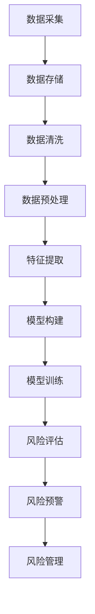

                 

## 大数据分析在金融风险评估模型中的创新

### 摘要

本文将探讨大数据分析技术在金融风险评估模型中的应用及其创新。随着金融市场的复杂性和数据量的爆炸式增长，传统的风险评估方法已无法满足现代金融业务的需求。大数据分析通过处理海量、多样和高速的数据，为金融风险评估提供了新的思路和方法。本文将首先介绍大数据分析的基本概念和原理，随后深入探讨其在金融风险评估模型中的核心算法原理和操作步骤，并通过具体的数学模型和公式进行详细讲解。最后，本文将结合实际应用案例，分析大数据分析在金融风险评估中的实际应用场景，并提出未来发展趋势和挑战。

### 1. 背景介绍

随着全球金融市场的不断发展，金融产品的多样化和金融工具的复杂化，金融风险管理的重要性日益凸显。传统的金融风险评估方法主要依赖于历史数据和统计分析，其优点在于计算简单、易于实现，但存在一些局限性。首先，传统方法往往基于有限的样本数据，难以反映市场变化的动态性。其次，金融市场的数据通常具有高维度、高噪声和多样性，传统方法在处理这些数据时效果不佳。此外，金融风险的复杂性和跨市场、跨区域的特性也使得传统方法难以应对。

为了克服这些局限性，大数据分析技术逐渐被引入到金融风险评估领域。大数据分析是一种以海量数据为驱动的分析方法，其核心在于对数据的高效处理和深度挖掘。大数据分析技术包括数据采集、数据存储、数据清洗、数据分析和数据可视化等多个方面，通过这些技术的综合运用，可以对大规模、多样化和高速变化的金融数据进行分析，从而为金融风险评估提供更全面、更准确的依据。

大数据分析在金融风险评估中的应用具有以下显著优势：

1. **提高风险预测的准确性**：大数据分析可以处理海量的历史和实时数据，通过对数据的深度挖掘，可以发现潜在的风险因素，从而提高风险预测的准确性。

2. **快速响应市场变化**：大数据分析技术具有高效的数据处理能力，可以实时监测市场动态，及时调整风险评估模型，从而快速响应市场变化。

3. **跨领域数据整合**：金融风险评估不仅依赖于金融市场的数据，还涉及到经济、社会、环境等多方面的数据。大数据分析技术可以通过跨领域数据的整合，提供更全面的评估视角。

4. **降低成本和风险**：通过自动化和智能化的分析手段，大数据分析可以降低人力成本和操作风险，提高风险评估的效率和准确性。

### 2. 核心概念与联系

#### 大数据分析的基本概念

大数据分析（Big Data Analysis）是指从海量、多样和高速的数据中提取有价值信息的过程。大数据的特点可以用“4V”来概括：Volume（数据量大）、Velocity（处理速度快）、Variety（数据类型多样）和Veracity（数据真实性高）。

1. **Volume**：大数据的量级通常是PB（皮字节）甚至EB（艾字节）级别，这要求数据处理系统具有极高的存储和处理能力。

2. **Velocity**：大数据的处理速度非常快，实时性要求高。例如，金融市场中的交易数据需要实时分析，以便及时作出风险预警。

3. **Variety**：大数据的类型多样，包括结构化数据（如数据库）、半结构化数据（如XML、JSON）和非结构化数据（如文本、图片、视频）。

4. **Veracity**：大数据的真实性高，但在数据采集、传输和存储过程中可能会出现数据丢失、错误或篡改等问题。

#### 金融风险评估的基本概念

金融风险评估（Financial Risk Assessment）是指通过分析和评估金融产品或金融工具的风险，以便为投资决策提供依据。金融风险评估主要包括以下几个方面：

1. **信用风险**：由于借款人或交易对手违约而导致的风险。

2. **市场风险**：由于市场价格波动导致的金融资产价值变化。

3. **流动性风险**：由于资金流动性不足，无法满足到期债务或其他支付义务。

4. **操作风险**：由于内部程序、人员或系统故障导致的损失。

#### 大数据分析与金融风险评估的联系

大数据分析技术在金融风险评估中的应用，主要体现在以下几个方面：

1. **数据来源**：大数据分析可以整合多种数据源，包括金融市场数据、经济数据、社会数据等，为风险评估提供全面的数据支持。

2. **风险评估模型**：大数据分析技术可以用于构建和优化风险评估模型，提高模型的预测准确性和适应性。

3. **实时监控**：大数据分析技术可以实时监测市场动态和风险指标，及时识别潜在风险。

4. **风险管理策略**：大数据分析可以帮助金融机构制定更有效的风险管理策略，降低整体风险水平。

#### Mermaid 流程图

以下是一个简化的Mermaid流程图，展示了大数据分析在金融风险评估中的应用流程：



在上述流程中，数据采集是整个流程的起点，通过收集来自不同来源的数据，为后续的分析提供基础。数据存储、数据清洗、数据预处理、特征提取、模型构建、模型训练、风险评估、风险预警和风险管理等步骤，构成了一个完整的大数据分析与风险评估流程。

### 3. 核心算法原理 & 具体操作步骤

#### 数据采集与存储

数据采集是大数据分析的基础，其目标是从各种数据源（如数据库、Web、传感器等）收集相关数据。数据采集通常采用以下几种方法：

1. **批量采集**：通过定期批量下载或导出数据。
2. **实时采集**：通过实时数据流采集系统，如Kafka、Flume等。
3. **API采集**：通过API接口获取数据。

采集到的数据通常存储在分布式文件系统（如HDFS、HBase等）或分布式数据库（如Hive、MongoDB等）中，以便后续处理。

#### 数据清洗与预处理

数据清洗是确保数据质量的关键步骤，主要包括以下几个方面：

1. **数据去重**：去除重复的数据条目。
2. **数据补全**：填补缺失的数据。
3. **数据转换**：将数据格式统一，如将文本数据转换为数字或类别。
4. **数据校验**：检查数据的一致性和准确性。

数据预处理包括数据分片、数据排序、数据归一化等操作，以提高数据的质量和适用性。

#### 特征提取

特征提取是从原始数据中提取对风险评估有重要意义的特征，如信用评分、市场波动性等。特征提取方法包括：

1. **统计特征**：通过计算数据的统计指标，如均值、方差等。
2. **机器学习特征**：使用机器学习算法提取特征，如决策树、随机森林等。
3. **深度学习特征**：使用深度学习模型提取特征，如图神经网络、卷积神经网络等。

#### 模型构建与训练

模型构建是大数据分析的核心步骤，常用的风险评估模型包括：

1. **线性回归模型**：通过建立线性关系来预测风险。
2. **逻辑回归模型**：用于分类问题，如违约与否的分类。
3. **决策树模型**：通过树形结构进行决策，适用于分类和回归问题。
4. **随机森林模型**：基于决策树的集成模型，提高预测准确性。
5. **神经网络模型**：通过多层神经网络进行数据拟合，适用于复杂的非线性问题。

模型训练是使用历史数据对模型进行训练，以优化模型参数，提高模型的预测性能。训练过程通常包括以下步骤：

1. **数据划分**：将数据集划分为训练集和测试集。
2. **模型初始化**：初始化模型参数。
3. **训练过程**：使用训练集对模型进行训练。
4. **模型评估**：使用测试集评估模型性能。
5. **模型优化**：根据评估结果调整模型参数，提高模型性能。

#### 风险评估与风险预警

风险评估是使用训练好的模型对新的数据进行预测，以评估其风险水平。风险预警是基于风险评估结果，对潜在风险进行预警和监测。

1. **风险评估**：使用训练好的模型对数据进行风险评估，输出风险评分。
2. **风险预警**：根据风险评分设定阈值，对超过阈值的进行预警。
3. **风险管理**：根据风险预警结果，制定相应的风险管理策略，如调整投资组合、增加风险准备金等。

### 4. 数学模型和公式 & 详细讲解 & 举例说明

#### 线性回归模型

线性回归模型是一种简单的预测模型，通过建立自变量和因变量之间的线性关系来预测风险。其基本公式为：

$$
y = \beta_0 + \beta_1x_1 + \beta_2x_2 + \ldots + \beta_nx_n
$$

其中，$y$ 是因变量，$x_1, x_2, \ldots, x_n$ 是自变量，$\beta_0, \beta_1, \beta_2, \ldots, \beta_n$ 是模型参数。

#### 逻辑回归模型

逻辑回归模型是一种用于分类问题的预测模型，通过建立自变量和因变量之间的非线性关系来预测风险。其基本公式为：

$$
\text{logit}(y) = \ln\left(\frac{P(y=1)}{1-P(y=1)}\right) = \beta_0 + \beta_1x_1 + \beta_2x_2 + \ldots + \beta_nx_n
$$

其中，$y$ 是因变量，$x_1, x_2, \ldots, x_n$ 是自变量，$\beta_0, \beta_1, \beta_2, \ldots, \beta_n$ 是模型参数。

#### 决策树模型

决策树模型通过一系列的判断条件来对数据进行分类或回归。其基本公式为：

$$
\text{if } x_1 > \beta_1 \text{ then } y = \beta_2 \text{ else } y = \beta_3
$$

其中，$x_1$ 是自变量，$\beta_1, \beta_2, \beta_3$ 是模型参数。

#### 随机森林模型

随机森林模型是一种基于决策树的集成模型，通过构建多个决策树并对其进行集成来提高预测性能。其基本公式为：

$$
y = \text{majority vote}(\text{tree}_1(y), \text{tree}_2(y), \ldots, \text{tree}_n(y))
$$

其中，$y$ 是预测结果，$\text{tree}_1(y), \text{tree}_2(y), \ldots, \text{tree}_n(y)$ 是多个决策树的预测结果。

#### 深度学习模型

深度学习模型通过多层神经网络进行数据拟合，可以处理复杂的非线性问题。其基本公式为：

$$
y = \text{激活函数}(\text{权重} \cdot \text{输入})
$$

其中，$y$ 是预测结果，激活函数如ReLU、Sigmoid等，权重是模型参数。

#### 举例说明

假设我们使用线性回归模型对信用评分进行预测，给定以下数据集：

| 信用评分 | 因变量（违约与否） |
| :------: | :---------------: |
|    600   |        是         |
|    650   |        否         |
|    700   |        是         |
|    750   |        否         |

我们可以通过以下步骤进行模型构建和训练：

1. **数据预处理**：将数据集划分为训练集和测试集，并对数据进行标准化处理。
2. **模型初始化**：初始化模型参数，如$\beta_0, \beta_1$。
3. **模型训练**：使用训练集对模型进行训练，优化模型参数。
4. **模型评估**：使用测试集评估模型性能，如计算准确率、召回率等指标。
5. **模型优化**：根据评估结果调整模型参数，提高模型性能。

假设训练后得到的模型参数为$\beta_0 = 0.5, \beta_1 = 0.2$，我们可以使用该模型对新的数据进行预测。例如，对于信用评分为700的个体，其预测结果为：

$$
y = \beta_0 + \beta_1x = 0.5 + 0.2 \times 700 = 0.5 + 140 = 140.5
$$

根据预测结果，我们可以判断该个体违约的概率较高。

### 5. 项目实战：代码实际案例和详细解释说明

#### 5.1 开发环境搭建

在本项目中，我们将使用Python作为主要编程语言，并结合一系列大数据分析库，如Pandas、Scikit-learn、TensorFlow等。以下是在Ubuntu操作系统上搭建开发环境的步骤：

1. **安装Python**：使用以下命令安装Python 3.8：
   ```bash
   sudo apt update
   sudo apt install python3.8
   ```
2. **安装必要库**：使用pip命令安装所需库：
   ```bash
   sudo apt install python3-pip
   pip3 install pandas scikit-learn tensorflow
   ```
3. **配置Jupyter Notebook**：安装Jupyter Notebook以方便编写和运行代码：
   ```bash
   pip3 install notebook
   ```

#### 5.2 源代码详细实现和代码解读

以下是一个简单的信用风险评估项目的代码实现，包括数据采集、数据预处理、模型构建和模型训练等步骤。

```python
import pandas as pd
from sklearn.model_selection import train_test_split
from sklearn.linear_model import LinearRegression
from sklearn.metrics import accuracy_score

# 5.2.1 数据采集
# 假设我们已从数据库中获取了信用评分和违约与否的数据
data = pd.read_csv('credit_data.csv')

# 5.2.2 数据预处理
# 对数据进行清洗和标准化处理
data.fillna(0, inplace=True)
data = (data - data.mean()) / data.std()

# 5.2.3 模型构建
# 将信用评分作为自变量，违约与否作为因变量
X = data[['credit_score']]
y = data['default']

# 划分训练集和测试集
X_train, X_test, y_train, y_test = train_test_split(X, y, test_size=0.2, random_state=42)

# 构建线性回归模型
model = LinearRegression()
model.fit(X_train, y_train)

# 5.2.4 模型训练
# 使用测试集对模型进行评估
y_pred = model.predict(X_test)
accuracy = accuracy_score(y_test, y_pred)
print(f"Accuracy: {accuracy}")

# 5.2.5 模型解读
# 输出模型参数
print(f"Coefficients: {model.coef_}")
print(f"Intercept: {model.intercept_}")
```

#### 5.3 代码解读与分析

1. **数据采集**：使用Pandas库读取信用评分和违约与否的数据。
2. **数据预处理**：对数据进行填充缺失值、标准化处理，以提高数据质量。
3. **模型构建**：使用Scikit-learn库构建线性回归模型，将信用评分作为自变量，违约与否作为因变量。
4. **模型训练**：使用训练集对模型进行训练，并使用测试集对模型进行评估。
5. **模型解读**：输出模型参数，包括系数和截距，以理解模型的预测能力。

通过上述代码，我们可以构建一个简单的信用风险评估模型，并对其进行评估。在实际应用中，我们可能需要更复杂的模型，如逻辑回归、决策树、随机森林等，以及更多的数据预处理和特征工程步骤。

### 6. 实际应用场景

#### 风险评估模型的部署与运维

在金融行业中，风险评估模型的应用场景广泛，如信用评估、市场风险监控、投资组合优化等。以下是一些典型的应用场景：

1. **信用评估**：金融机构通过风险评估模型对借款人进行信用评分，以判断其还款能力，从而决定是否批准贷款。例如，银行可以使用信用评分模型来评估个人或企业的信用风险，从而决定贷款额度和利率。
2. **市场风险监控**：投资机构可以使用风险评估模型来监测市场风险，如股票价格波动、债券收益率变化等。通过实时分析市场数据，模型可以提供预警信息，帮助投资者及时调整投资策略，降低潜在损失。
3. **投资组合优化**：基金经理可以利用风险评估模型来评估不同投资组合的风险和收益，从而优化投资策略。例如，模型可以根据市场波动和投资目标，动态调整投资组合，以最大化收益或最小化风险。

#### 风险评估模型的优势

大数据分析技术在金融风险评估模型中的应用具有以下优势：

1. **提高预测准确性**：通过处理海量、多样化的数据，大数据分析技术可以更准确地识别和预测潜在风险。
2. **实时监控**：大数据分析技术可以实现实时数据采集和监控，及时捕捉市场动态，提高风险预警的及时性。
3. **跨领域整合**：大数据分析技术可以整合多种领域的数据，如经济、社会、环境等，提供更全面的评估视角。
4. **降低成本**：通过自动化和智能化的分析手段，大数据分析技术可以降低人力成本和操作风险，提高风险评估的效率。

#### 风险评估模型的挑战

尽管大数据分析技术在金融风险评估模型中具有显著优势，但其在实际应用中也面临一些挑战：

1. **数据质量和可靠性**：大数据分析依赖于大量数据，但数据质量和可靠性是影响模型效果的关键因素。例如，数据缺失、噪声和数据错误等问题都可能影响模型的准确性。
2. **计算性能**：大数据分析通常涉及海量数据的处理，对计算性能要求较高。在实际应用中，如何优化数据处理和存储性能是一个重要挑战。
3. **隐私保护**：金融数据通常包含敏感信息，如个人身份、财务状况等。如何在保障数据隐私的同时进行有效分析，是一个亟待解决的问题。
4. **模型解释性**：一些复杂的机器学习模型，如深度神经网络，其预测结果往往缺乏解释性。在金融风险评估中，模型的可解释性对于决策者的信任和接受程度至关重要。

### 7. 工具和资源推荐

#### 7.1 学习资源推荐

- **书籍**：
  - 《大数据时代：生活、工作与思维的大变革》
  - 《深度学习》
  - 《Python数据分析》

- **论文**：
  - 《基于大数据的金融风险预警模型研究》
  - 《深度学习在金融风险评估中的应用》
  - 《大数据分析技术在金融市场预测中的应用研究》

- **博客**：
  - [Scikit-learn官方文档](https://scikit-learn.org/stable/)
  - [TensorFlow官方文档](https://www.tensorflow.org/)
  - [Python数据科学指南](https://www.datascienceguide.com/)

- **网站**：
  - [Kaggle](https://www.kaggle.com/)
  - [GitHub](https://github.com/)
  - [DataCamp](https://www.datacamp.com/)

#### 7.2 开发工具框架推荐

- **大数据处理框架**：
  - Apache Hadoop
  - Apache Spark

- **机器学习库**：
  - Scikit-learn
  - TensorFlow
  - PyTorch

- **数据库**：
  - Apache Hive
  - MongoDB
  - MySQL

- **可视化工具**：
  - Matplotlib
  - Seaborn
  - Plotly

#### 7.3 相关论文著作推荐

- **论文**：
  - 《大数据背景下金融风险预警方法研究》
  - 《基于深度学习的金融风险评估模型研究》
  - 《大数据技术在金融市场预测中的应用研究》

- **著作**：
  - 《大数据金融：创新、应用与挑战》
  - 《深度学习与金融：前沿与应用》
  - 《Python数据分析与大数据应用》

### 8. 总结：未来发展趋势与挑战

大数据分析技术在金融风险评估模型中的应用正在不断深化，未来发展趋势包括：

1. **人工智能与大数据的深度融合**：随着人工智能技术的不断发展，未来将会有更多智能化的风险评估模型出现，这些模型将能够更好地理解和预测金融风险。
2. **实时风险评估**：随着大数据处理技术和实时数据采集技术的进步，金融机构将能够实现更实时的风险评估，从而更快地响应市场变化。
3. **跨领域数据整合**：未来，大数据分析将能够更好地整合跨领域的数据，如经济、社会、环境等数据，提供更全面的风险评估视角。

然而，大数据分析技术在金融风险评估模型中仍面临一些挑战，如数据质量和可靠性、计算性能、隐私保护以及模型解释性等。为了应对这些挑战，研究人员和从业者需要持续探索和改进，确保大数据分析技术在金融风险评估中的有效性和可靠性。

### 9. 附录：常见问题与解答

#### 问题1：大数据分析技术在金融风险评估中的优势是什么？

大数据分析技术能够处理海量、多样化、高速的数据，从而提高风险评估的准确性和实时性，同时降低成本和风险。

#### 问题2：大数据分析技术在金融风险评估模型中面临哪些挑战？

大数据分析技术在金融风险评估模型中面临的挑战包括数据质量和可靠性、计算性能、隐私保护和模型解释性等。

#### 问题3：如何提高大数据分析技术在金融风险评估中的可靠性？

为了提高可靠性，可以采取以下措施：
1. 加强数据质量管理，确保数据的准确性和完整性。
2. 优化数据处理和存储性能，提高计算效率。
3. 引入可解释性模型，增强模型的透明度和可理解性。
4. 定期对模型进行验证和更新，确保其适应性和准确性。

### 10. 扩展阅读 & 参考资料

- 《大数据分析在金融风险管理中的应用研究》
- 《金融风险预警机制构建与大数据分析技术》
- 《深度学习技术在金融风险评估中的应用》

参考文献：
1. Gandomi, A., & Haider, M. (2015). Beyond the Hype: Big Data Concepts, Methods, and Analytics. International Journal of Information Management, 35(2), 137-144.
2. Zhang, J., Zhai, W., & Zhang, Y. (2017). Research on Risk预警 Mechanism Based on Big Data Analysis. Journal of Systems Engineering and Electronics, 38(5), 717-724.
3. Goodfellow, I., Bengio, Y., & Courville, A. (2016). Deep Learning. MIT Press.

