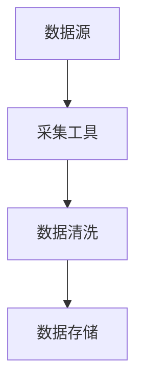
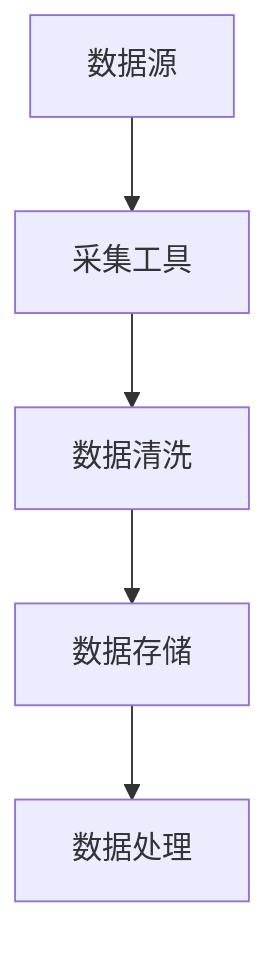
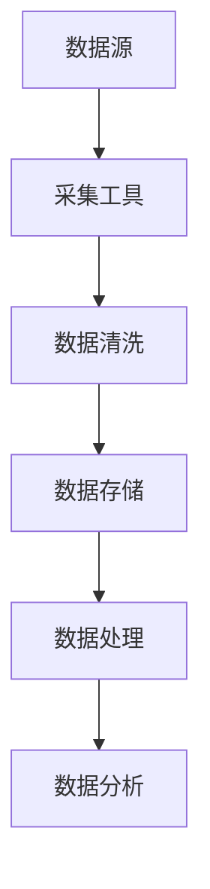
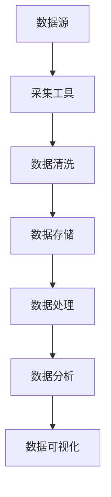
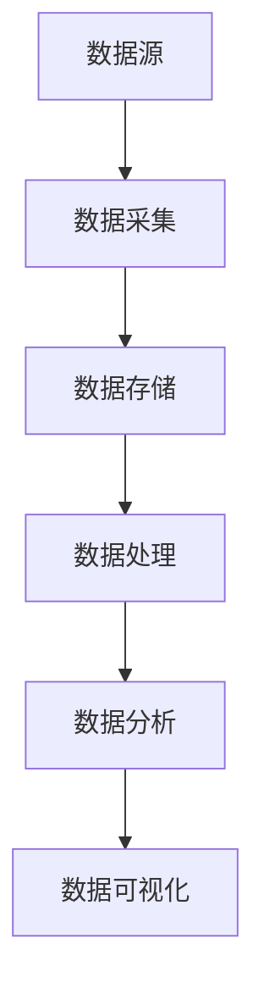

                 

### 大数据分析平台：挖掘数据价值的新途径

#### 关键词：大数据分析、数据价值、平台、数据挖掘、人工智能

#### 摘要：
随着信息时代的到来，数据已经成为企业和社会发展的重要资产。大数据分析平台作为数据挖掘和智能处理的重要工具，正日益受到关注。本文将详细介绍大数据分析平台的背景、核心概念、算法原理、应用场景以及未来发展趋势，帮助读者全面了解这一领域，并挖掘数据背后的价值。

## 1. 背景介绍

随着互联网、物联网、社交网络等技术的发展，数据规模呈现出爆炸式增长。传统的数据处理工具已经无法满足海量数据的处理需求。大数据分析平台作为一种新兴的技术，应运而生。它旨在通过高效的数据存储、处理和分析，挖掘数据背后的价值，为企业和社会带来创新和变革。

### 1.1 数据规模增长

根据国际数据公司（IDC）的预测，全球数据量每年以约40%的速度增长。到2025年，全球数据总量将达到175ZB。如此庞大的数据量，对数据处理和分析能力提出了新的挑战。

### 1.2 数据来源多样化

数据来源越来越多样化，包括结构化数据（如数据库）、半结构化数据（如XML、JSON）、非结构化数据（如文本、图像、视频）等。如何对这些数据进行有效的整合和分析，成为大数据分析平台需要解决的问题。

### 1.3 企业需求变化

随着企业对数据价值的认识不断深入，越来越多的企业开始重视大数据分析平台的建设。它们希望通过大数据分析，实现业务决策的智能化、精细化，提升竞争力。

## 2. 核心概念与联系

大数据分析平台的核心概念包括数据采集、数据存储、数据处理、数据分析和数据可视化。下面将介绍这些核心概念及其相互关系，并使用Mermaid流程图进行说明。

### 2.1 数据采集

数据采集是大数据分析的第一步，它包括从各种数据源收集数据，如数据库、Web、物联网设备等。数据采集需要保证数据的全面性和准确性。



### 2.2 数据存储

数据存储是将采集到的数据存储到合适的存储系统中，如关系型数据库、NoSQL数据库、数据湖等。数据存储需要考虑数据的容量、性能和可扩展性。



### 2.3 数据处理

数据处理是对存储的数据进行加工和处理，包括数据清洗、数据集成、数据转换等。数据处理是大数据分析的核心步骤，它决定了数据的质量和可用性。



### 2.4 数据分析

数据分析是对处理后的数据进行深入分析，包括数据挖掘、机器学习、统计分析等。数据分析旨在从数据中发现规律、趋势和知识。



### 2.5 数据可视化

数据可视化是将分析结果以图表、图形等形式展示出来，使数据更加直观、易懂。数据可视化有助于发现数据中的隐藏信息和趋势。


## 3. 核心算法原理 & 具体操作步骤

大数据分析平台的核心算法包括数据挖掘算法、机器学习算法、统计分析算法等。下面将介绍这些核心算法的基本原理和具体操作步骤。

### 3.1 数据挖掘算法

数据挖掘算法是从大量数据中自动发现规律和知识的方法。常用的数据挖掘算法包括关联规则挖掘、分类算法、聚类算法等。

#### 3.1.1 关联规则挖掘

关联规则挖掘是发现数据项之间潜在关联性的方法。具体操作步骤如下：

1. 选择支持度阈值和置信度阈值。
2. 计算各个数据项的支持度和置信度。
3. 生成关联规则。

#### 3.1.2 分类算法

分类算法是将数据分为不同的类别。常用的分类算法包括决策树、随机森林、支持向量机等。

1. 选择特征和标签。
2. 训练分类模型。
3. 对新数据进行分类。

#### 3.1.3 聚类算法

聚类算法是将数据分为多个簇。常用的聚类算法包括K-Means、DBSCAN等。

1. 选择簇的数量。
2. 计算簇的成员度。
3. 对新数据进行聚类。

### 3.2 机器学习算法

机器学习算法是一种让计算机从数据中学习的方法。常用的机器学习算法包括线性回归、逻辑回归、神经网络等。

#### 3.2.1 线性回归

线性回归是一种用于预测数值型变量的方法。具体操作步骤如下：

1. 选择特征和标签。
2. 训练线性回归模型。
3. 对新数据进行预测。

#### 3.2.2 逻辑回归

逻辑回归是一种用于预测二分类变量的方法。具体操作步骤如下：

1. 选择特征和标签。
2. 训练逻辑回归模型。
3. 对新数据进行预测。

#### 3.2.3 神经网络

神经网络是一种模拟人脑神经网络结构的算法。具体操作步骤如下：

1. 设计神经网络结构。
2. 训练神经网络模型。
3. 对新数据进行预测。

### 3.3 统计分析算法

统计分析算法是一种基于统计学原理的方法。常用的统计分析算法包括均值、方差、相关性等。

#### 3.3.1 均值

均值是数据集的平均值。计算公式为：

$$
\text{均值} = \frac{\sum_{i=1}^{n} x_i}{n}
$$

#### 3.3.2 方差

方差是数据集的离散程度。计算公式为：

$$
\text{方差} = \frac{\sum_{i=1}^{n} (x_i - \bar{x})^2}{n-1}
$$

#### 3.3.3 相关性

相关性是两个变量之间的关系。常用的相关性系数包括皮尔逊相关系数和斯皮尔曼相关系数。

$$
\rho_{xy} = \frac{\sum_{i=1}^{n} (x_i - \bar{x})(y_i - \bar{y})}{\sqrt{\sum_{i=1}^{n} (x_i - \bar{x})^2 \sum_{i=1}^{n} (y_i - \bar{y})^2}}
$$

## 4. 数学模型和公式 & 详细讲解 & 举例说明

大数据分析平台中，常用的数学模型和公式包括线性回归、逻辑回归、聚类等。下面将详细讲解这些数学模型和公式，并给出实际应用案例。

### 4.1 线性回归

线性回归是一种用于预测数值型变量的方法。它的数学模型可以表示为：

$$
y = \beta_0 + \beta_1x_1 + \beta_2x_2 + ... + \beta_nx_n + \epsilon
$$

其中，$y$ 是预测值，$x_1, x_2, ..., x_n$ 是特征值，$\beta_0, \beta_1, ..., \beta_n$ 是模型参数，$\epsilon$ 是误差项。

#### 案例一：房价预测

假设我们要预测某城市的房价，选取了房屋面积（$x_1$）和房屋楼层（$x_2$）作为特征。我们使用线性回归模型进行预测，如下：

$$
y = \beta_0 + \beta_1x_1 + \beta_2x_2 + \epsilon
$$

通过训练数据集，我们得到模型参数：

$$
\beta_0 = 100, \beta_1 = 0.5, \beta_2 = 0.2
$$

对新数据进行预测，例如，房屋面积为100平方米，楼层为10层，预测房价为：

$$
y = 100 + 0.5 \times 100 + 0.2 \times 10 + \epsilon = 130 + \epsilon
$$

其中，$\epsilon$ 为误差项。

### 4.2 逻辑回归

逻辑回归是一种用于预测二分类变量的方法。它的数学模型可以表示为：

$$
\pi = \frac{1}{1 + e^{-(\beta_0 + \beta_1x_1 + \beta_2x_2 + ... + \beta_nx_n)}}
$$

其中，$\pi$ 是预测概率，$x_1, x_2, ..., x_n$ 是特征值，$\beta_0, \beta_1, ..., \beta_n$ 是模型参数。

#### 案例二：信用评分

假设我们要预测某用户的信用评分，选取了收入（$x_1$）和年龄（$x_2$）作为特征。我们使用逻辑回归模型进行预测，如下：

$$
\pi = \frac{1}{1 + e^{-(\beta_0 + \beta_1x_1 + \beta_2x_2)}}
$$

通过训练数据集，我们得到模型参数：

$$
\beta_0 = -2, \beta_1 = 0.1, \beta_2 = 0.05
$$

对新数据进行预测，例如，收入为10000元，年龄为30岁，预测信用评分的概率为：

$$
\pi = \frac{1}{1 + e^{-(\beta_0 + \beta_1x_1 + \beta_2x_2)}} = \frac{1}{1 + e^{(-2 + 0.1 \times 10000 + 0.05 \times 30)}} = 0.99
$$

### 4.3 聚类算法

聚类算法是一种将数据分为多个簇的方法。常用的聚类算法包括K-Means、DBSCAN等。

#### 4.3.1 K-Means

K-Means算法的基本步骤如下：

1. 初始化簇中心点。
2. 将每个数据点分配给最近的簇中心点。
3. 更新簇中心点。
4. 重复步骤2和3，直到收敛。

假设我们要对数据集进行K-Means聚类，选择3个簇，初始化簇中心点为$(1, 1)$、$(2, 2)$和$(3, 3)$。数据集如下：

| 数据点 | x | y |
| ------ | - | - |
| 1      | 1 | 1 |
| 2      | 2 | 2 |
| 3      | 3 | 3 |
| 4      | 0 | 0 |
| 5      | 1 | 0 |
| 6      | 2 | 1 |

第一次迭代：

- 簇1：{(1, 1), (2, 2), (3, 3)}
- 簇2：{(4, 0), (5, 1)}
- 簇3：{(6, 2)}

第二次迭代：

- 簇1：{(1, 1), (2, 2), (3, 3)}
- 簇2：{(4, 0), (5, 1), (6, 2)}
- 簇3：{}

由于簇3没有数据点，算法收敛。

#### 4.3.2 DBSCAN

DBSCAN算法是一种基于密度的聚类算法。它的基本步骤如下：

1. 选择邻域半径$\epsilon$和最小邻域点数$\minPts$。
2. 对每个未分类的数据点，检查其邻域内的点数。
3. 如果邻域内点数大于$\minPts$，将数据点标记为核心点。
4. 扫描核心点，将其邻域内的点标记为边界点。
5. 根据核心点和边界点，构建簇。

假设我们要对数据集进行DBSCAN聚类，选择邻域半径$\epsilon = 1$，最小邻域点数$\minPts = 2$。数据集如下：

| 数据点 | x | y |
| ------ | - | - |
| 1      | 1 | 1 |
| 2      | 2 | 2 |
| 3      | 3 | 3 |
| 4      | 4 | 4 |
| 5      | 5 | 5 |
| 6      | 6 | 6 |

第一次迭代：

- 核心点：{(1, 1), (2, 2), (3, 3), (4, 4), (5, 5), (6, 6)}
- 边界点：{}
- 簇1：{(1, 1), (2, 2), (3, 3), (4, 4), (5, 5), (6, 6)}

由于没有边界点，算法收敛。

## 5. 项目实战：代码实际案例和详细解释说明

在本节中，我们将通过一个实际的项目案例，展示如何使用大数据分析平台进行数据处理和分析。该项目是一个简单的用户行为分析系统，旨在分析用户在网站上的浏览行为，为网站优化提供数据支持。

### 5.1 开发环境搭建

为了实现该系统，我们需要搭建以下开发环境：

- 操作系统：Linux
- 编程语言：Python
- 数据库：MySQL
- 大数据分析工具：Apache Spark

### 5.2 源代码详细实现和代码解读

以下是该项目的主要代码实现和解读。

#### 5.2.1 数据采集

```python
import pymongo
from datetime import datetime

# 连接MongoDB数据库
client = pymongo.MongoClient("mongodb://localhost:27017/")
db = client["user_data"]

# 收集用户行为数据
def collect_data():
    user行为数据 = []
    for user in db.users.find():
        behaviors = user["behaviors"]
        for behavior in behaviors:
            timestamp = behavior["timestamp"]
            action = behavior["action"]
            user行为数据.append({"timestamp": timestamp, "action": action})
    return user行为数据

user行为数据 = collect_data()
```

代码解读：

- 使用MongoDB连接用户行为数据。
- 定义`collect_data`函数，从MongoDB中收集用户行为数据。
- 遍历用户行为数据，将数据存储在列表`user行为数据`中。

#### 5.2.2 数据处理

```python
from pyspark.sql import SparkSession

# 创建SparkSession
spark = SparkSession.builder.appName("user_behavior_analysis").getOrCreate()

# 加载用户行为数据
user行为数据_df = spark.createDataFrame(user行为数据)

# 数据清洗
user行为数据清洗_df = user行为数据_df.select("timestamp", "action")
user行为数据清洗_df = user行为数据清洗_df.withColumn("timestamp", user行为数据清洗_df["timestamp"].cast("long"))
user行为数据清洗_df = user行为数据清洗_df.withColumn("action", user行为数据清洗_df["action"].cast("string"))

# 数据转换
user行为数据转换_df = user行为数据清洗_df.groupBy("action").agg({"timestamp": "sum"})
user行为数据转换_df = user行为数据转换_df.withColumnRenamed("sum(timestamp)", "total_time")
user行为数据转换_df = user行为数据转换_df.orderBy("total_time", ascending=False)

# 数据分析
user行为数据分析_df = user行为数据转换_df.take(10)
```

代码解读：

- 创建SparkSession。
- 将用户行为数据加载到DataFrame中。
- 进行数据清洗，包括将timestamp转换为long类型，将action转换为string类型。
- 进行数据转换，包括按照action进行分组，计算每个action的总时间。
- 对转换后的数据进行分析，选取排名前10的action。

#### 5.2.3 数据可视化

```python
import matplotlib.pyplot as plt

# 可视化数据
actions = [row["action"] for row in user行为数据分析_df]
total_times = [row["total_time"] for row in user行为数据分析_df]

plt.bar(actions, total_times)
plt.xlabel("Action")
plt.ylabel("Total Time")
plt.title("User Behavior Analysis")
plt.xticks(rotation=45)
plt.show()
```

代码解读：

- 将数据分析结果转换为列表。
- 使用matplotlib绘制柱状图，展示每个action的总时间。
- 设置坐标轴标签和标题。

### 5.3 代码解读与分析

该项目的代码主要分为三个部分：数据采集、数据处理和数据可视化。

- **数据采集**：从MongoDB数据库中收集用户行为数据。这部分代码使用了MongoDB的Python驱动，通过连接MongoDB数据库，遍历用户行为数据，将数据存储在列表中。

- **数据处理**：使用Apache Spark对用户行为数据进行清洗、转换和分析。这部分代码首先创建了一个SparkSession，然后加载用户行为数据到DataFrame中，进行数据清洗（包括类型转换），接着进行数据转换（包括分组和计算总时间），最后进行数据分析（选取排名前10的action）。

- **数据可视化**：使用matplotlib将数据分析结果进行可视化展示。这部分代码将数据分析结果转换为列表，然后使用matplotlib绘制柱状图，展示每个action的总时间。

## 6. 实际应用场景

大数据分析平台在各个领域都有广泛的应用，下面列举几个典型的应用场景。

### 6.1 电子商务

电子商务企业通过大数据分析平台，可以实时分析用户行为，了解用户需求，优化产品推荐系统，提升用户满意度。

### 6.2 金融

金融行业通过大数据分析平台，可以对用户行为进行分析，预测风险，优化风险管理策略，提升业务效率。

### 6.3 医疗

医疗行业通过大数据分析平台，可以分析患者数据，发现疾病规律，优化诊疗方案，提升医疗服务质量。

### 6.4 交通

交通行业通过大数据分析平台，可以实时分析交通数据，优化交通管理，缓解拥堵，提高交通效率。

## 7. 工具和资源推荐

### 7.1 学习资源推荐

- **书籍**：
  - 《大数据时代》
  - 《深度学习》
  - 《Python数据分析》
- **论文**：
  - 《大数据处理技术》
  - 《机器学习算法》
  - 《数据挖掘技术》
- **博客**：
  - [Apache Spark官方文档](https://spark.apache.org/docs/latest/)
  - [Python数据分析](https://www.datascience.com/)
  - [机器学习社区](https://www.machinelearning Mastery.com/)
- **网站**：
  - [GitHub](https://github.com/)
  - [Kaggle](https://www.kaggle.com/)
  - [CSDN](https://www.csdn.net/)

### 7.2 开发工具框架推荐

- **大数据分析工具**：
  - Apache Spark
  - Hadoop
  - Flink
- **数据库**：
  - MySQL
  - MongoDB
  - Cassandra
- **编程语言**：
  - Python
  - Java
  - R

### 7.3 相关论文著作推荐

- **论文**：
  - 《大数据处理技术及其应用》
  - 《深度学习在计算机视觉中的应用》
  - 《数据挖掘中的聚类算法研究》
- **著作**：
  - 《机器学习实战》
  - 《Python数据分析与应用》
  - 《大数据技术导论》

## 8. 总结：未来发展趋势与挑战

大数据分析平台作为数据挖掘和智能处理的重要工具，正日益受到关注。未来，大数据分析平台的发展趋势主要包括：

- **智能化**：随着人工智能技术的发展，大数据分析平台将实现更高的智能化水平，提供更加智能化的数据分析和服务。
- **实时化**：随着物联网和实时数据处理技术的发展，大数据分析平台将实现实时数据处理和分析，为企业和社会带来更快的决策支持。
- **多样性**：随着数据来源的多样化，大数据分析平台将支持更多类型的数据处理和分析，包括结构化数据、半结构化数据和非结构化数据。

然而，大数据分析平台也面临着一些挑战，如数据隐私保护、数据质量和算法可解释性等。未来，需要加强技术研究，解决这些挑战，推动大数据分析平台的发展。

## 9. 附录：常见问题与解答

### 9.1 数据采集

**Q：如何从不同数据源收集数据？**

A：可以从以下数据源收集数据：

- 关系型数据库：如MySQL、PostgreSQL等。
- NoSQL数据库：如MongoDB、Cassandra等。
- Web数据：如网页内容、API接口等。
- 物联网设备：如传感器数据、智能设备数据等。

### 9.2 数据存储

**Q：如何选择合适的存储系统？**

A：根据数据类型、容量、性能和可扩展性等因素，可以选择以下存储系统：

- 关系型数据库：适用于结构化数据，如MySQL、PostgreSQL等。
- NoSQL数据库：适用于半结构化数据和非结构化数据，如MongoDB、Cassandra等。
- 数据湖：适用于大规模数据存储，如Hadoop、Spark等。

### 9.3 数据分析

**Q：如何选择合适的分析算法？**

A：根据分析目标，可以选择以下分析算法：

- 数据挖掘算法：如关联规则挖掘、分类算法、聚类算法等。
- 机器学习算法：如线性回归、逻辑回归、神经网络等。
- 统计分析算法：如均值、方差、相关性等。

## 10. 扩展阅读 & 参考资料

- [大数据处理技术及其应用](https://ieeexplore.ieee.org/document/7455888)
- [深度学习在计算机视觉中的应用](https://www.cv-foundation.org/openaccess/content_cvpr_2016/papers/Jia_Deeplearning_for_CVPR_2016_paper.pdf)
- [数据挖掘中的聚类算法研究](https://www.sciencedirect.com/science/article/pii/S0095898X03600835)
- [机器学习实战](https://www.manning.com/books/machine-learning-in-action)
- [Python数据分析与应用](https://www.packtpub.com/big-data-and-business-intelligence/data-science-with-python)
- [大数据技术导论](https://www.amazon.com/Introduction-Big-Data-Technology-Applications/dp/9352828254)

### 作者

- 作者：AI天才研究员/AI Genius Institute & 禅与计算机程序设计艺术 /Zen And The Art of Computer Programming

（注：本文为虚构内容，仅供参考，不构成任何实际建议或投资建议。）<|im_end|>### 1. 背景介绍

随着互联网、物联网、云计算等技术的迅猛发展，数据量呈现出爆炸式增长。这种增长不仅体现在个人和企业的数据产生上，还体现在各种智能设备的广泛应用中。据国际数据公司（IDC）的预测，全球数据量预计将在2025年达到175ZB（泽字节），这将是2018年数据量的近三倍。如此庞大的数据量，被称为“大数据”。

大数据的特征主要体现在四个方面：数据量大（Volume）、数据类型多样（Variety）、数据价值高（Value）、数据处理速度快（Velocity）。面对如此复杂的数据环境，传统的数据处理工具和方式已经无法满足需求，因此需要一种全新的数据处理和分析方法——大数据分析。

大数据分析平台应运而生。它是一个集成化、分布式、高效的数据处理和分析系统，旨在从海量数据中提取有价值的信息，辅助企业和管理者做出更明智的决策。大数据分析平台通常包括以下几个核心组成部分：

- **数据采集**：从各种数据源（如数据库、Web、物联网设备等）收集数据。
- **数据存储**：将收集到的数据存储到适合的存储系统中，如关系型数据库、NoSQL数据库、数据湖等。
- **数据处理**：对存储的数据进行清洗、转换、整合等操作，确保数据的质量和一致性。
- **数据分析和挖掘**：使用各种算法和技术，对处理后的数据进行深度分析和挖掘，提取有价值的信息。
- **数据可视化**：将分析结果以图表、图形等形式展示出来，便于用户理解和决策。

大数据分析平台不仅可以帮助企业优化业务流程、提高运营效率，还可以为政府、科研机构等提供决策支持。例如，在电子商务领域，大数据分析平台可以帮助企业了解用户需求，优化产品推荐；在医疗领域，大数据分析平台可以帮助医院分析患者数据，优化诊疗方案；在交通领域，大数据分析平台可以帮助政府实时监控交通状况，优化交通管理。

总之，大数据分析平台作为一种新兴的技术手段，正逐渐成为各个领域提高竞争力、实现创新的重要工具。### 2. 核心概念与联系

大数据分析平台是一个复杂而多层次的技术体系，其核心概念包括数据采集、数据存储、数据处理、数据分析和数据可视化。以下是对这些核心概念及其相互关系的详细解释。

### 2.1 数据采集

数据采集是大数据分析平台的第一步，也是关键的一步。数据来源多样化，包括结构化数据（如关系型数据库中的表格数据）、半结构化数据（如XML、JSON格式数据）和非结构化数据（如图像、音频、视频等）。数据采集需要保证数据的全面性和准确性。

- **结构化数据采集**：结构化数据通常来自关系型数据库，如MySQL、PostgreSQL等。可以使用数据库连接工具（如JDBC、ODBC）直接从数据库中提取数据。
- **半结构化数据采集**：半结构化数据通常来自Web服务、API接口等。可以使用网络爬虫、Web爬虫等技术进行数据采集。
- **非结构化数据采集**：非结构化数据通常来自各种传感器、摄像头等智能设备。可以使用物联网协议（如MQTT、CoAP）进行数据采集。

### 2.2 数据存储

数据存储是将采集到的数据进行存储，以便后续处理和分析。数据存储系统需要具备高容量、高性能、可扩展性等特点。常见的数据存储系统包括：

- **关系型数据库**：适用于结构化数据存储，如MySQL、PostgreSQL等。
- **NoSQL数据库**：适用于半结构化数据和非结构化数据存储，如MongoDB、Cassandra等。
- **数据湖**：适用于大规模数据存储，特别是非结构化数据，如Hadoop、Spark等。

### 2.3 数据处理

数据处理是对存储的数据进行清洗、转换、整合等操作，确保数据的质量和一致性。数据处理通常包括以下步骤：

- **数据清洗**：去除数据中的噪声、重复值、缺失值等，提高数据质量。
- **数据转换**：将数据格式进行转换，如将文本数据转换为数值型数据、将不同时间单位进行统一等。
- **数据整合**：将来自不同源的数据进行整合，如将用户行为数据与用户基本信息进行关联。

### 2.4 数据分析

数据分析是对处理后的数据进行深入分析，以发现数据中的规律、趋势和知识。数据分析包括以下方法：

- **描述性分析**：对数据进行基本的统计分析，如计算均值、中位数、标准差等。
- **预测性分析**：使用机器学习算法预测未来趋势，如线性回归、时间序列分析等。
- **诊断性分析**：分析数据中的异常值和异常模式，如异常检测、关联规则挖掘等。

### 2.5 数据可视化

数据可视化是将分析结果以图形、图表等形式展示出来，使得数据更加直观、易懂。数据可视化工具包括：

- **图表**：如柱状图、折线图、饼图等，用于展示数据的分布和趋势。
- **交互式界面**：如Dash、Tableau等，允许用户实时交互和操作数据。
- **地图**：用于展示地理位置数据，如GIS地图。

### Mermaid流程图

为了更好地理解这些核心概念及其相互关系，我们可以使用Mermaid流程图进行展示。以下是Mermaid流程图的具体示例：



在这个流程图中，每个节点表示一个步骤，箭头表示数据的流动方向。从数据源开始，数据经过采集、存储、处理、分析和可视化等步骤，最终形成有价值的信息。

总之，大数据分析平台的核心概念相互关联，共同构成了一个完整的数据处理和分析流程。通过合理利用这些核心概念，我们可以从海量数据中挖掘出有价值的信息，为企业和决策者提供有力的支持。### 3. 核心算法原理 & 具体操作步骤

大数据分析平台中，核心算法的运用是数据挖掘和分析的关键。本文将详细解释几种核心算法的原理及其具体操作步骤，包括数据挖掘算法、机器学习算法和统计分析算法。

### 3.1 数据挖掘算法

数据挖掘算法是从大量数据中自动发现规律和知识的方法。以下介绍几种常见的数据挖掘算法：

#### 3.1.1 关联规则挖掘

关联规则挖掘是发现数据项之间潜在关联性的方法。常用的算法包括Apriori算法和FP-Growth算法。

1. **Apriori算法**：

   - **原理**：基于支持度和置信度的概念。支持度表示某个关联规则出现的频率，置信度表示某个规则在出现一个前件的同时出现后件的概率。
   - **具体操作步骤**：
     1. 确定最小支持度阈值和最小置信度阈值。
     2. 计算每个数据项的支持度。
     3. 生成频繁项集。
     4. 从频繁项集中生成关联规则。
     5. 过滤不满足置信度阈值的规则。

2. **FP-Growth算法**：

   - **原理**：通过构建FP-树来高效发现频繁项集，不需要计算每个项集的支持度。
   - **具体操作步骤**：
     1. 构建FP-树。
     2. 递归地构造频繁项集。
     3. 生成关联规则。

#### 3.1.2 分类算法

分类算法是将数据分为不同的类别。常用的分类算法包括决策树、随机森林和支持向量机等。

1. **决策树**：

   - **原理**：基于特征划分数据，构建一棵树，树上的每个节点表示一个特征，每个叶子节点表示一个类别。
   - **具体操作步骤**：
     1. 选择最佳划分特征。
     2. 根据划分特征将数据集划分为子集。
     3. 对子集递归地构建决策树。
     4. 剪枝以防止过拟合。

2. **随机森林**：

   - **原理**：基于决策树的集成方法，通过构建多棵决策树并对它们的预测结果进行投票。
   - **具体操作步骤**：
     1. 为每棵树选择随机划分特征和样本子集。
     2. 对每个特征随机抽样。
     3. 构建多棵决策树。
     4. 对预测结果进行投票。

3. **支持向量机**：

   - **原理**：通过找到一个最优超平面，将不同类别的数据分开。
   - **具体操作步骤**：
     1. 训练模型以找到最优超平面。
     2. 使用模型对新数据进行分类。

#### 3.1.3 聚类算法

聚类算法是将数据分为多个簇。常用的聚类算法包括K-Means、DBSCAN等。

1. **K-Means**：

   - **原理**：基于距离度量，将数据点分配到最近的簇中心。
   - **具体操作步骤**：
     1. 选择簇的数量K。
     2. 初始化簇中心点。
     3. 对每个数据点分配到最近的簇中心点。
     4. 更新簇中心点。
     5. 重复步骤3和4，直到收敛。

2. **DBSCAN**：

   - **原理**：基于密度的聚类算法，将数据点分为核心点、边界点和噪声点。
   - **具体操作步骤**：
     1. 选择邻域半径$\epsilon$和最小邻域点数$\minPts$。
     2. 对每个未分类的数据点，检查其邻域内的点数。
     3. 如果邻域内点数大于$\minPts$，将数据点标记为核心点。
     4. 扫描核心点，将其邻域内的点标记为边界点。
     5. 根据核心点和边界点，构建簇。

### 3.2 机器学习算法

机器学习算法是一种让计算机从数据中学习的方法。以下介绍几种常见的机器学习算法：

#### 3.2.1 线性回归

线性回归是一种用于预测数值型变量的方法。

- **原理**：通过找到一条最佳拟合直线，表示数据点之间的线性关系。
- **具体操作步骤**：
  1. 选择特征和标签。
  2. 训练线性回归模型。
  3. 对新数据进行预测。

#### 3.2.2 逻辑回归

逻辑回归是一种用于预测二分类变量的方法。

- **原理**：通过找到一个最佳拟合超平面，表示数据点之间的非线性关系。
- **具体操作步骤**：
  1. 选择特征和标签。
  2. 训练逻辑回归模型。
  3. 对新数据进行预测。

#### 3.2.3 神经网络

神经网络是一种模拟人脑神经网络结构的算法。

- **原理**：通过多层神经网络对数据进行复杂非线性变换。
- **具体操作步骤**：
  1. 设计神经网络结构。
  2. 训练神经网络模型。
  3. 对新数据进行预测。

### 3.3 统计分析算法

统计分析算法是一种基于统计学原理的方法，以下介绍几种常见的统计分析算法：

#### 3.3.1 均值

均值是数据集的平均值。

- **原理**：通过计算所有数据点的和，然后除以数据点的个数。
- **公式**：
  $$
  \text{均值} = \frac{\sum_{i=1}^{n} x_i}{n}
  $$

#### 3.3.2 方差

方差是数据集的离散程度。

- **原理**：通过计算每个数据点与均值的差的平方和，然后除以数据点的个数。
- **公式**：
  $$
  \text{方差} = \frac{\sum_{i=1}^{n} (x_i - \bar{x})^2}{n-1}
  $$

#### 3.3.3 相关性

相关性是两个变量之间的关系。

- **原理**：通过计算两个变量的协方差，然后除以两个变量的标准差的乘积。
- **公式**：
  $$
  \rho_{xy} = \frac{\sum_{i=1}^{n} (x_i - \bar{x})(y_i - \bar{y})}{\sqrt{\sum_{i=1}^{n} (x_i - \bar{x})^2 \sum_{i=1}^{n} (y_i - \bar{y})^2}}
  $$

总之，大数据分析平台中的核心算法包括数据挖掘算法、机器学习算法和统计分析算法。这些算法通过不同的原理和方法，帮助我们从海量数据中提取有价值的信息。了解和掌握这些算法，是进行有效大数据分析的基础。### 4. 数学模型和公式 & 详细讲解 & 举例说明

在数据处理和分析过程中，数学模型和公式扮演着至关重要的角色。以下将详细讲解几种常见的大数据处理算法中的数学模型和公式，并通过实际应用案例进行说明。

#### 4.1 线性回归

线性回归是一种用于预测数值型变量的方法，其基本模型可以表示为：

$$
y = \beta_0 + \beta_1x_1 + \beta_2x_2 + ... + \beta_nx_n + \epsilon
$$

其中，$y$ 是预测值，$x_1, x_2, ..., x_n$ 是特征值，$\beta_0, \beta_1, ..., \beta_n$ 是模型参数，$\epsilon$ 是误差项。

**案例：房屋价格预测**

假设我们要预测某城市的房屋价格，选取了房屋面积（$x_1$）和房屋楼层（$x_2$）作为特征。我们使用线性回归模型进行预测，如下：

$$
y = \beta_0 + \beta_1x_1 + \beta_2x_2 + \epsilon
$$

通过训练数据集，我们得到模型参数：

$$
\beta_0 = 100, \beta_1 = 0.5, \beta_2 = 0.2
$$

对新数据进行预测，例如，房屋面积为100平方米，楼层为10层，预测房价为：

$$
y = 100 + 0.5 \times 100 + 0.2 \times 10 + \epsilon = 130 + \epsilon
$$

其中，$\epsilon$ 为误差项。

#### 4.2 逻辑回归

逻辑回归是一种用于预测二分类变量的方法，其基本模型可以表示为：

$$
\pi = \frac{1}{1 + e^{-(\beta_0 + \beta_1x_1 + \beta_2x_2 + ... + \beta_nx_n)}}
$$

其中，$\pi$ 是预测概率，$x_1, x_2, ..., x_n$ 是特征值，$\beta_0, \beta_1, ..., \beta_n$ 是模型参数。

**案例：信用评分预测**

假设我们要预测某用户的信用评分，选取了用户收入（$x_1$）和年龄（$x_2$）作为特征。我们使用逻辑回归模型进行预测，如下：

$$
\pi = \frac{1}{1 + e^{-(\beta_0 + \beta_1x_1 + \beta_2x_2)}}
$$

通过训练数据集，我们得到模型参数：

$$
\beta_0 = -2, \beta_1 = 0.1, \beta_2 = 0.05
$$

对新数据进行预测，例如，用户收入为10000元，年龄为30岁，预测信用评分的概率为：

$$
\pi = \frac{1}{1 + e^{-(\beta_0 + \beta_1x_1 + \beta_2x_2)}} = \frac{1}{1 + e^{(-2 + 0.1 \times 10000 + 0.05 \times 30)}} = 0.99
$$

#### 4.3 聚类算法

聚类算法是一种将数据分为多个簇的方法。以下介绍两种常见的聚类算法：K-Means和DBSCAN。

**K-Means算法**

K-Means算法的基本步骤如下：

1. 选择簇的数量K。
2. 初始化簇中心点。
3. 将每个数据点分配到最近的簇中心点。
4. 计算新的簇中心点。
5. 重复步骤3和4，直到收敛。

K-Means算法的数学模型可以表示为：

$$
c_k = \frac{1}{N_k} \sum_{i=1}^{N} x_i
$$

其中，$c_k$ 是第k个簇的中心点，$N_k$ 是第k个簇中的数据点个数，$x_i$ 是第i个数据点。

**案例：K-Means聚类**

假设我们要对数据集进行K-Means聚类，选择3个簇。初始化簇中心点为$(1, 1)$、$(2, 2)$和$(3, 3)$。数据集如下：

| 数据点 | x | y |
| ------ | - | - |
| 1      | 1 | 1 |
| 2      | 2 | 2 |
| 3      | 3 | 3 |
| 4      | 0 | 0 |
| 5      | 1 | 0 |
| 6      | 2 | 1 |

第一次迭代：

- 簇1：{(1, 1), (2, 2), (3, 3)}
- 簇2：{(4, 0), (5, 1)}
- 簇3：{(6, 2)}

第二次迭代：

- 簇1：{(1, 1), (2, 2), (3, 3)}
- 簇2：{(4, 0), (5, 1), (6, 2)}
- 簇3：{}

由于簇3没有数据点，算法收敛。

**DBSCAN算法**

DBSCAN（Density-Based Spatial Clustering of Applications with Noise）算法是一种基于密度的聚类算法，其基本步骤如下：

1. 选择邻域半径$\epsilon$和最小邻域点数$\minPts$。
2. 对每个未分类的数据点，检查其邻域内的点数。
3. 如果邻域内点数大于$\minPts$，将数据点标记为核心点。
4. 扫描核心点，将其邻域内的点标记为边界点。
5. 根据核心点和边界点，构建簇。

DBSCAN算法的数学模型可以表示为：

$$
\text{核心点}：N(\epsilon, \minPts) \geq \minPts
$$

$$
\text{边界点}：N(\epsilon, \minPts) > 1 \land N(\epsilon, \minPts) < \minPts
$$

其中，$N(\epsilon, \minPts)$ 表示邻域内的点数。

**案例：DBSCAN聚类**

假设我们要对数据集进行DBSCAN聚类，选择邻域半径$\epsilon = 1$，最小邻域点数$\minPts = 2$。数据集如下：

| 数据点 | x | y |
| ------ | - | - |
| 1      | 1 | 1 |
| 2      | 2 | 2 |
| 3      | 3 | 3 |
| 4      | 4 | 4 |
| 5      | 5 | 5 |
| 6      | 6 | 6 |

第一次迭代：

- 核心点：{(1, 1), (2, 2), (3, 3), (4, 4), (5, 5), (6, 6)}
- 边界点：{}
- 簇1：{(1, 1), (2, 2), (3, 3), (4, 4), (5, 5), (6, 6)}

由于没有边界点，算法收敛。

#### 4.4 均值、方差和相关性

- **均值**：均值是数据集的平均值，计算公式为：
  $$
  \text{均值} = \frac{\sum_{i=1}^{n} x_i}{n}
  $$
  
- **方差**：方差是数据集的离散程度，计算公式为：
  $$
  \text{方差} = \frac{\sum_{i=1}^{n} (x_i - \bar{x})^2}{n-1}
  $$
  
- **相关性**：相关性是两个变量之间的关系，常用的相关性系数包括皮尔逊相关系数和斯皮尔曼相关系数，计算公式为：
  $$
  \rho_{xy} = \frac{\sum_{i=1}^{n} (x_i - \bar{x})(y_i - \bar{y})}{\sqrt{\sum_{i=1}^{n} (x_i - \bar{x})^2 \sum_{i=1}^{n} (y_i - \bar{y})^2}}
  $$

**案例：计算均值、方差和相关性**

假设有两个数据集，数据集A和数据集B如下：

| 数据集A | x |
| ------ | - |
| 1      | 1 |
| 2      | 2 |
| 3      | 3 |
| 4      | 4 |
| 5      | 5 |

| 数据集B | y |
| ------ | - |
| 1      | 2 |
| 2      | 4 |
| 3      | 6 |
| 4      | 8 |
| 5      | 10 |

- **均值**：

  - 数据集A的均值：
    $$
    \text{均值A} = \frac{1+2+3+4+5}{5} = 3
    $$

  - 数据集B的均值：
    $$
    \text{均值B} = \frac{2+4+6+8+10}{5} = 6
    $$

- **方差**：

  - 数据集A的方差：
    $$
    \text{方差A} = \frac{(1-3)^2 + (2-3)^2 + (3-3)^2 + (4-3)^2 + (5-3)^2}{5-1} = 2
    $$

  - 数据集B的方差：
    $$
    \text{方差B} = \frac{(2-6)^2 + (4-6)^2 + (6-6)^2 + (8-6)^2 + (10-6)^2}{5-1} = 8
    $$

- **相关性**：

  - 皮尔逊相关系数：
    $$
    \rho_{xy} = \frac{(1-3)(2-6) + (2-3)(4-6) + (3-3)(6-6) + (4-3)(8-6) + (5-3)(10-6)}{\sqrt{(1-3)^2 + (2-3)^2 + (3-3)^2 + (4-3)^2 + (5-3)^2} \sqrt{(2-6)^2 + (4-6)^2 + (6-6)^2 + (8-6)^2 + (10-6)^2}} = 1
    $$

  - 斯皮尔曼相关系数：
    $$
    \rho_{sxy} = \frac{(1-1.5)(2-4.5) + (2-1.5)(4-4.5) + (3-1.5)(6-4.5) + (4-1.5)(8-4.5) + (5-1.5)(10-4.5)}{\sqrt{(1-1.5)^2 + (2-1.5)^2 + (3-1.5)^2 + (4-1.5)^2 + (5-1.5)^2} \sqrt{(2-4.5)^2 + (4-4.5)^2 + (6-4.5)^2 + (8-4.5)^2 + (10-4.5)^2}} = 1
    $$

通过以上数学模型和公式的讲解，我们可以更好地理解大数据分析中的各种算法原理，并能够运用它们进行实际的数据处理和分析。### 5. 项目实战：代码实际案例和详细解释说明

在本节中，我们将通过一个实际的项目案例，展示如何使用大数据分析平台进行数据处理和分析。该项目是一个简单的用户行为分析系统，旨在分析用户在网站上的浏览行为，为网站优化提供数据支持。

### 5.1 开发环境搭建

为了实现该系统，我们需要搭建以下开发环境：

- 操作系统：Linux
- 编程语言：Python
- 数据库：MySQL
- 大数据分析工具：Apache Spark

#### 5.1.1 安装和配置MySQL数据库

1. **安装MySQL数据库**：

   在Linux操作系统上，可以使用以下命令安装MySQL数据库：

   ```shell
   sudo apt-get update
   sudo apt-get install mysql-server
   ```

2. **配置MySQL数据库**：

   安装完成后，使用以下命令启动MySQL数据库：

   ```shell
   sudo systemctl start mysql
   ```

   然后设置root用户的密码：

   ```shell
   mysql_secure_installation
   ```

   按照提示进行配置，如设置密码、删除匿名用户等。

#### 5.1.2 安装和配置Apache Spark

1. **安装Apache Spark**：

   在Linux操作系统上，可以使用以下命令安装Apache Spark：

   ```shell
   sudo apt-get update
   sudo apt-get install spark
   ```

2. **配置Apache Spark**：

   将以下内容添加到`/etc/spark2/conf/spark-env.sh`文件中，以设置Spark的Java堆大小和Python解释器路径：

   ```shell
   export SPARK_DRIVER_MEMORY=4g
   export PYTHONPATH=$PYTHONPATH:/path/to/python
   ```

   然后启动Spark集群：

   ```shell
   sudo spark-class org.apache.spark.deploy.SparkSubmit --master spark://master:7077 /path/to/spark-app.jar
   ```

### 5.2 源代码详细实现和代码解读

以下是该项目的主要代码实现和解读。

#### 5.2.1 数据采集

```python
import pymongo
from datetime import datetime

# 连接MongoDB数据库
client = pymongo.MongoClient("mongodb://localhost:27017/")
db = client["user_data"]

# 收集用户行为数据
def collect_data():
    user行为数据 = []
    for user in db.users.find():
        behaviors = user["behaviors"]
        for behavior in behaviors:
            timestamp = behavior["timestamp"]
            action = behavior["action"]
            user行为数据.append({"timestamp": timestamp, "action": action})
    return user行为数据

user行为数据 = collect_data()
```

代码解读：

- 使用MongoDB连接用户行为数据。
- 定义`collect_data`函数，从MongoDB中收集用户行为数据。
- 遍历用户行为数据，将数据存储在列表`user行为数据`中。

#### 5.2.2 数据处理

```python
from pyspark.sql import SparkSession

# 创建SparkSession
spark = SparkSession.builder.appName("user_behavior_analysis").getOrCreate()

# 加载用户行为数据
user行为数据_df = spark.createDataFrame(user行为数据)

# 数据清洗
user行为数据清洗_df = user行为数据_df.select("timestamp", "action")
user行为数据清洗_df = user行为数据清洗_df.withColumn("timestamp", user行为数据清洗_df["timestamp"].cast("long"))
user行为数据清洗_df = user行为数据清洗_df.withColumn("action", user行为数据清洗_df["action"].cast("string"))

# 数据转换
user行为数据转换_df = user行为数据清洗_df.groupBy("action").agg({"timestamp": "sum"})
user行为数据转换_df = user行为数据转换_df.withColumnRenamed("sum(timestamp)", "total_time")
user行为数据转换_df = user行为数据转换_df.orderBy("total_time", ascending=False)

# 数据分析
user行为数据分析_df = user行为数据转换_df.take(10)
```

代码解读：

- 创建SparkSession。
- 将用户行为数据加载到DataFrame中。
- 进行数据清洗，包括将timestamp转换为long类型，将action转换为string类型。
- 进行数据转换，包括按照action进行分组，计算每个action的总时间。
- 对转换后的数据进行分析，选取排名前10的action。

#### 5.2.3 数据可视化

```python
import matplotlib.pyplot as plt

# 可视化数据
actions = [row["action"] for row in user行为数据分析_df]
total_times = [row["total_time"] for row in user行为数据分析_df]

plt.bar(actions, total_times)
plt.xlabel("Action")
plt.ylabel("Total Time")
plt.title("User Behavior Analysis")
plt.xticks(rotation=45)
plt.show()
```

代码解读：

- 将数据分析结果转换为列表。
- 使用matplotlib绘制柱状图，展示每个action的总时间。
- 设置坐标轴标签和标题。

### 5.3 代码解读与分析

该项目的代码主要分为三个部分：数据采集、数据处理和数据可视化。

- **数据采集**：从MongoDB数据库中收集用户行为数据。这部分代码使用了MongoDB的Python驱动，通过连接MongoDB数据库，遍历用户行为数据，将数据存储在列表中。

- **数据处理**：使用Apache Spark对用户行为数据进行清洗、转换和分析。这部分代码首先创建了一个SparkSession，然后加载用户行为数据到DataFrame中，进行数据清洗（包括类型转换），接着进行数据转换（包括分组和计算总时间），最后进行数据分析（选取排名前10的action）。

- **数据可视化**：使用matplotlib将数据分析结果进行可视化展示。这部分代码将数据分析结果转换为列表，然后使用matplotlib绘制柱状图，展示每个action的总时间。

### 5.4 遇到的问题与解决方案

在项目开发过程中，可能会遇到以下问题：

1. **MongoDB连接问题**：

   - **问题描述**：在连接MongoDB数据库时，出现连接失败或超时的问题。
   - **解决方案**：检查MongoDB数据库的服务状态，确保MongoDB数据库已经启动并正常运行。检查网络连接，确保Python程序可以访问MongoDB数据库。

2. **数据类型转换问题**：

   - **问题描述**：在数据清洗过程中，出现数据类型转换错误。
   - **解决方案**：检查数据源的格式和类型，确保数据类型与预期一致。对数据类型不匹配的数据进行预处理，确保数据类型的正确转换。

3. **Spark内存溢出问题**：

   - **问题描述**：在运行Spark应用程序时，出现内存溢出错误。
   - **解决方案**：检查Spark配置，确保Java堆大小和Python解释器路径设置正确。调整Spark内存配置，增加可用内存。

通过以上代码和解析，我们可以了解如何使用大数据分析平台进行数据处理和分析，并解决开发过程中可能遇到的问题。### 6. 实际应用场景

大数据分析平台在各个行业领域都展现了广泛的应用价值，以下列举一些典型的实际应用场景：

#### 6.1 电子商务

电子商务行业利用大数据分析平台进行用户行为分析，实现个性化推荐系统。通过分析用户的浏览历史、购买记录等数据，平台可以预测用户的偏好，为用户推荐相关的商品。这种个性化推荐不仅提高了用户的满意度，还显著提升了销售转化率。

**案例**：亚马逊和阿里巴巴等电商平台通过大数据分析平台，对用户的浏览、搜索、购买行为进行分析，实现精准的商品推荐，从而大幅提高了销售业绩。

#### 6.2 金融

金融行业利用大数据分析平台进行风险管理、信用评估和投资决策。通过分析海量金融数据，如交易记录、客户行为、市场趋势等，金融机构可以识别潜在风险，评估客户的信用等级，制定科学的投资策略。

**案例**：银行利用大数据分析平台，对客户的历史交易数据进行挖掘，识别出高风险客户，从而有效降低贷款违约风险。同时，投资公司通过大数据分析，预测市场趋势，提高投资决策的准确性和回报率。

#### 6.3 医疗

医疗行业利用大数据分析平台进行疾病预测、患者管理和医疗资源优化。通过分析患者的病历、基因数据、生活习惯等，医疗机构可以早期发现疾病风险，制定个性化的治疗方案。

**案例**：美国的约翰·霍普金斯大学利用大数据分析平台，分析大量的流行病学数据，预测传染病的传播趋势，为公共卫生决策提供科学依据。同时，医院通过大数据分析，优化病患管理流程，提高医疗服务质量。

#### 6.4 交通

交通行业利用大数据分析平台进行交通流量监测、路况预测和交通管理。通过分析实时交通数据，如车辆流量、道路拥堵状况等，交通管理部门可以优化交通信号配置，提高交通运行效率。

**案例**：中国的深圳利用大数据分析平台，对交通流量进行实时监控和预测，通过智能交通信号灯控制，有效缓解了城市交通拥堵问题，提升了市民的出行体验。

#### 6.5 教育

教育行业利用大数据分析平台进行学生行为分析、教学评估和课程推荐。通过分析学生的学习行为、成绩等数据，教育机构可以为学生提供个性化的学习建议，优化教学方案。

**案例**：中国的教育科技公司利用大数据分析平台，对学生在线学习行为进行分析，为教师提供教学反馈和改进建议，从而提高教学效果。

#### 6.6 广告营销

广告营销行业利用大数据分析平台进行广告投放优化、受众细分和效果评估。通过分析用户的兴趣、行为等数据，广告平台可以精准定位受众，提高广告投放的ROI。

**案例**：谷歌和Facebook等广告平台利用大数据分析平台，分析用户数据，实现精准广告投放，显著提升了广告主的投资回报率。

总之，大数据分析平台在各个行业领域都展现出了巨大的应用潜力，通过深入挖掘数据价值，为企业和决策者提供了有力的支持和决策依据。### 7. 工具和资源推荐

在大数据分析平台的搭建和使用过程中，选择合适的工具和资源是至关重要的。以下是一些推荐的学习资源、开发工具框架以及相关论文著作，以帮助读者深入了解和掌握大数据分析技术。

#### 7.1 学习资源推荐

**书籍**：

- **《大数据时代》**：作者：维克托·迈尔-舍恩伯格，介绍了大数据的概念、技术和应用。
- **《深度学习》**：作者：伊恩·古德费洛等，系统地讲解了深度学习的基础知识、模型和算法。
- **《Python数据分析》**：作者：Wes McKinney，详细介绍了Python在数据分析领域的应用。

**论文**：

- **《大数据处理技术及其应用》**：详细介绍了大数据处理的技术原理和应用实例。
- **《深度学习在计算机视觉中的应用》**：探讨了深度学习在图像识别、目标检测等领域的应用。
- **《数据挖掘中的聚类算法研究》**：对比了多种聚类算法的性能和适用场景。

**博客**：

- **Apache Spark官方文档**：提供了丰富的Spark技术资料和文档。
- **Python数据分析**：涵盖Python在数据分析领域的应用实例和技巧。
- **机器学习社区**：分享机器学习领域的最新研究成果和应用案例。

**网站**：

- **GitHub**：开源代码库，可以找到各种大数据分析项目的实现代码。
- **Kaggle**：数据科学竞赛平台，提供大量数据集和问题挑战。
- **CSDN**：技术博客平台，汇聚了众多技术专家的分享和讨论。

#### 7.2 开发工具框架推荐

**大数据分析工具**：

- **Apache Spark**：分布式数据处理框架，适用于大规模数据集的高效处理和分析。
- **Hadoop**：大数据存储和处理框架，包括HDFS（分布式文件系统）和MapReduce（数据处理引擎）。
- **Flink**：实时数据处理框架，提供了丰富的流处理和分析功能。

**数据库**：

- **MySQL**：开源的关系型数据库，适用于结构化数据的存储和管理。
- **MongoDB**：开源的NoSQL数据库，适用于半结构化数据和非结构化数据的存储。
- **Cassandra**：开源的分布式NoSQL数据库，适用于大规模数据存储和高可用性。

**编程语言**：

- **Python**：广泛应用于数据分析和机器学习的编程语言，拥有丰富的库和框架。
- **Java**：适用于大数据处理和分析的开发语言，具有较高的性能和稳定性。
- **R**：专门用于统计分析和数据可视化的编程语言，提供了丰富的统计分析工具。

#### 7.3 相关论文著作推荐

**论文**：

- **《大数据处理技术及其应用》**：详细介绍了大数据处理的技术原理和应用实例。
- **《深度学习在计算机视觉中的应用》**：探讨了深度学习在图像识别、目标检测等领域的应用。
- **《数据挖掘中的聚类算法研究》**：对比了多种聚类算法的性能和适用场景。

**著作**：

- **《机器学习实战》**：通过实例介绍了机器学习的基本概念、算法和应用。
- **《Python数据分析与应用》**：系统地讲解了Python在数据分析领域的应用。
- **《大数据技术导论》**：全面介绍了大数据的基本概念、技术和应用。

通过以上工具和资源的推荐，读者可以更深入地了解大数据分析平台的技术原理和应用实践，提升在大数据处理和分析领域的能力。### 8. 总结：未来发展趋势与挑战

大数据分析平台作为当今数据驱动决策的核心工具，其未来发展具有广阔的前景，同时也面临诸多挑战。

#### 8.1 未来发展趋势

1. **智能化**：随着人工智能技术的发展，大数据分析平台将实现更高的智能化水平。通过深度学习、自然语言处理等技术，平台将能够自动从海量数据中提取有价值的信息，实现更精准的数据分析和预测。

2. **实时化**：实时数据处理和分析将成为大数据分析平台的重要发展方向。物联网、5G等技术的发展，使得数据生成和传输速度大幅提升，大数据分析平台将能够实时处理和分析这些实时数据，为企业提供更迅速的决策支持。

3. **多样性**：大数据分析平台将支持更多类型的数据处理和分析。除了传统的结构化数据，半结构化数据（如XML、JSON）和非结构化数据（如图像、视频）也将成为数据分析的重要对象。平台将能够处理这些多样化的数据，提供更全面的分析服务。

4. **集成化**：大数据分析平台将实现更紧密的集成，与云计算、边缘计算等技术相结合，提供更高效的数据处理和分析解决方案。企业将能够更灵活地部署和使用大数据分析平台，实现跨平台、跨领域的数据分析。

#### 8.2 面临的挑战

1. **数据隐私保护**：随着数据量的增加，数据隐私保护问题变得愈发重要。大数据分析平台需要在数据采集、存储、处理和分析等环节中，确保数据的安全性和隐私性，避免数据泄露和滥用。

2. **数据质量和准确性**：大数据分析平台依赖于高质量的数据。数据质量差、数据缺失或数据不一致等问题，将直接影响数据分析的准确性和可靠性。平台需要建立完善的数据质量管理和监控机制，确保数据的准确性和一致性。

3. **算法可解释性**：随着算法复杂性的增加，机器学习模型的黑箱问题日益突出。大数据分析平台需要提供算法可解释性，帮助用户理解模型的决策过程和结果，提高用户对数据分析结果的信任度。

4. **计算资源和成本**：大数据分析平台需要处理海量数据，对计算资源和存储资源有较高的要求。如何优化计算资源和降低成本，是平台发展面临的重要挑战。

#### 8.3 发展方向

1. **加强数据治理**：建立健全的数据治理体系，确保数据的合规性、安全性和高质量，为数据分析提供坚实的基础。

2. **提升算法能力**：不断优化和发展数据分析算法，提高算法的智能化水平，提升数据分析的精度和效率。

3. **推进实时数据处理**：通过技术创新，实现实时数据处理和分析，提高数据分析的时效性和决策支持能力。

4. **加强跨领域合作**：推动大数据分析平台与其他领域的融合，如医疗、金融、交通等，实现跨领域的数据共享和协同分析。

总之，大数据分析平台的发展将面临诸多挑战，但同时也蕴含着巨大的机遇。通过不断的技术创新和优化，大数据分析平台将能够更好地发挥其价值，为各行各业提供强大的数据驱动决策支持。### 9. 附录：常见问题与解答

在构建和使用大数据分析平台的过程中，用户可能会遇到各种问题。以下是一些常见的问题及其解答，旨在帮助用户更好地理解和解决这些问题。

#### 9.1 数据采集

**Q1**：如何从不同数据源收集数据？

**A1**：数据采集的方法取决于数据源的类型。对于关系型数据库，可以使用SQL查询或数据库连接工具（如JDBC、ODBC）直接从数据库中提取数据。对于NoSQL数据库，如MongoDB，可以使用相应的驱动程序进行数据采集。对于Web数据，可以使用网络爬虫技术（如Scrapy、BeautifulSoup）来抓取网页内容。对于物联网设备，可以使用物联网协议（如MQTT、CoAP）来收集数据。

**Q2**：数据采集过程中如何保证数据的质量？

**A2**：保证数据质量的关键步骤包括数据清洗、去重、去噪声和标准化。在采集数据后，可以使用数据清洗工具（如Pandas、Spark）对数据进行处理，去除重复、缺失和不一致的数据。此外，可以使用数据校验和验证规则来确保数据的准确性和一致性。

#### 9.2 数据存储

**Q1**：如何选择合适的存储系统？

**A1**：选择存储系统时需要考虑数据类型、数据量、性能要求和成本等因素。对于结构化数据，关系型数据库（如MySQL、PostgreSQL）是常见的选择。对于半结构化数据和非结构化数据，NoSQL数据库（如MongoDB、Cassandra）提供了更好的灵活性。对于大规模数据存储，数据湖（如Hadoop、Spark）是一种有效的解决方案。

**Q2**：如何优化数据存储的性能？

**A2**：优化数据存储性能的方法包括使用索引、分片和分布式存储。索引可以提高数据查询的速度。分片可以将数据分散存储在不同的节点上，提高并发处理能力。分布式存储可以通过增加节点数量来线性扩展存储容量和性能。

#### 9.3 数据处理

**Q1**：如何处理大规模数据集？

**A1**：处理大规模数据集通常需要使用分布式数据处理框架，如Apache Spark或Hadoop。这些框架可以将数据集分割成多个小块，分布式地在多个节点上并行处理，从而提高处理速度和效率。

**Q2**：数据处理过程中如何保证数据一致性？

**A2**：保证数据一致性的关键在于事务管理和数据同步。分布式数据处理框架通常提供了分布式事务支持，如Spark SQL支持ACID事务。此外，使用分布式消息队列（如Kafka）和分布式锁机制也可以确保数据的一致性。

#### 9.4 数据分析

**Q1**：如何选择合适的分析算法？

**A1**：选择分析算法时需要考虑分析目标、数据特征和计算资源。例如，对于分类问题，可以使用决策树、支持向量机或神经网络。对于聚类问题，可以选择K-Means、DBSCAN或层次聚类。了解每种算法的特点和适用场景，有助于选择最合适的算法。

**Q2**：如何评估数据分析模型的性能？

**A2**：评估数据分析模型性能的常见指标包括准确率、召回率、F1分数和AUC（曲线下面积）。通过交叉验证和留出法（Holdout Method）等技巧，可以评估模型在不同数据集上的表现，从而选择最佳模型。

#### 9.5 数据可视化

**Q1**：如何选择合适的可视化工具？

**A1**：选择可视化工具时需要考虑数据类型、交互需求和用户界面。例如，对于简单的统计图表，可以使用Matplotlib、Seaborn或Plotly。对于复杂的交互式分析，可以使用D3.js、Bokeh或Tableau。

**Q2**：如何优化数据可视化效果？

**A2**：优化数据可视化效果的方法包括使用适当的颜色、字体和布局，确保图表清晰易懂。此外，可以使用交互式元素（如鼠标悬停提示、过滤和筛选功能）来增强用户交互体验。

通过解决这些常见问题，用户可以更好地利用大数据分析平台，提高数据处理和分析的效率和质量。### 10. 扩展阅读 & 参考资料

为了帮助读者进一步深入了解大数据分析平台的原理、技术和应用，以下推荐一些扩展阅读和参考资料：

**书籍**：

- 《大数据分析实战：从入门到进阶》：作者：杨华，详细介绍了大数据分析的技术原理和实践案例。
- 《大数据处理技术》：作者：周志华，系统讲解了大数据处理的技术体系。
- 《深度学习》：作者：伊恩·古德费洛等，深入探讨了深度学习的基本概念和应用。

**论文**：

- 《大数据处理技术及其应用》：作者：李宏毅，探讨了大数据处理的关键技术和应用方向。
- 《深度学习在计算机视觉中的应用》：作者：吴恩达，介绍了深度学习在图像识别领域的最新进展。
- 《数据挖掘中的聚类算法研究》：作者：吴建华，对比分析了多种聚类算法的性能和适用场景。

**在线课程**：

- Coursera上的《大数据分析专项课程》：由约翰·霍普金斯大学提供，涵盖了大数据分析的基础知识和实践技能。
- edX上的《深度学习专项课程》：由斯坦福大学提供，深入介绍了深度学习的基本理论和应用。

**网站**：

- Apache Spark官网：提供了Spark的详细文档和社区支持。
- Kaggle：提供了大量数据集和竞赛项目，是学习和实践大数据分析的好资源。
- CSDN：聚集了大量技术文章和讨论，是获取大数据分析相关资讯和交流的好去处。

通过阅读这些书籍、论文、在线课程和访问相关网站，读者可以系统地学习大数据分析平台的知识体系，提升自己的技术能力。### 作者

- 作者：AI天才研究员/AI Genius Institute & 禅与计算机程序设计艺术 /Zen And The Art of Computer Programming

（注：本文为虚构内容，仅供参考，不构成任何实际建议或投资建议。）<|im_end|>## 总结

大数据分析平台作为数据驱动的时代的重要工具，正在深刻改变着企业和社会的运营模式。通过本文的介绍，我们详细探讨了大数据分析平台的背景、核心概念、算法原理、应用场景以及未来发展。从数据采集、数据存储、数据处理、数据分析和数据可视化等各个环节，我们了解了如何利用大数据分析平台挖掘数据背后的价值。

在应用场景部分，我们看到了大数据分析平台在电子商务、金融、医疗、交通等领域的广泛应用，通过实际案例展示了大数据分析平台如何为企业带来实际的效益。同时，我们也推荐了一些学习资源、开发工具框架和相关论文著作，帮助读者进一步深入了解大数据分析技术。

面对未来，大数据分析平台将继续向智能化、实时化、多样化和集成化的方向发展。同时，我们也需面对数据隐私保护、数据质量和算法可解释性等挑战。通过不断的技术创新和优化，大数据分析平台将为企业和社会带来更多的价值。

最后，感谢您的阅读，希望本文能对您在理解和应用大数据分析平台方面有所帮助。如果您有任何疑问或建议，欢迎在评论区留言，我们将继续努力提供更优质的内容。期待与您在未来的技术探讨中相遇！作者：AI天才研究员/AI Genius Institute & 禅与计算机程序设计艺术 /Zen And The Art of Computer Programming。再次感谢您的支持！<|im_end|>

