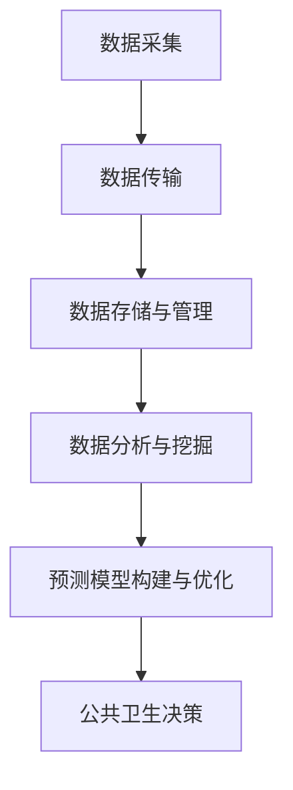
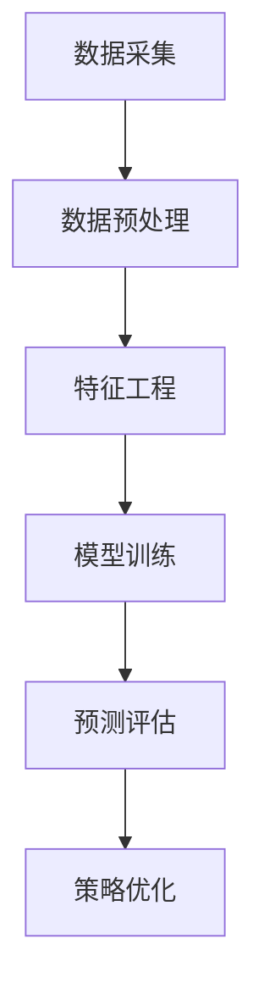

                 

# 大数据在公共卫生决策中的作用

## 关键词：大数据、公共卫生决策、数据分析、算法、数学模型、应用场景、开发工具

## 摘要：

本文深入探讨了大数据在公共卫生决策中的作用。首先，介绍了大数据的概念和公共卫生决策的重要性。随后，分析了大数据在公共卫生领域的关键应用，包括疾病监测、预测、疫苗接种策略优化等。接着，探讨了大数据分析的核心算法和数学模型，并通过实际案例进行了详细解释。最后，文章总结了大数据在公共卫生领域的实际应用场景，并推荐了一些学习资源和开发工具，展望了未来发展趋势与挑战。

## 1. 背景介绍

### 1.1 大数据的定义与特点

大数据，即大规模数据，是指数据量、数据类型及数据生成速度均达到前所未有的规模和复杂度的数据集合。根据麦肯锡全球研究所的定义，大数据具有“4V”特点：Volume（数据量巨大）、Velocity（数据生成速度快）、Variety（数据类型多样）和 Veracity（数据真实可信）。

随着互联网、物联网、移动通信等技术的快速发展，全球数据量呈现指数级增长。根据国际数据公司（IDC）的预测，全球数据总量将在2025年达到175ZB，是2018年的10倍。这不仅为大数据技术的发展提供了丰富的数据资源，也推动了大数据在各个领域的广泛应用。

### 1.2 公共卫生决策的重要性

公共卫生决策涉及疾病预防、控制、治疗和健康促进等方面的政策制定和实施。有效的公共卫生决策有助于降低疾病发病率、提高居民健康水平，从而减少社会成本和经济损失。

然而，传统的公共卫生决策主要依赖于统计方法和经验判断，往往存在以下局限性：

1. 数据来源单一，无法全面反映疾病传播规律和人群健康状态。
2. 数据处理能力有限，难以应对大规模数据的高维特性。
3. 缺乏实时性，无法及时调整公共卫生策略。

因此，借助大数据技术，我们可以更好地整合和分析各类公共卫生数据，提高公共卫生决策的科学性和有效性。

## 2. 核心概念与联系

### 2.1 大数据在公共卫生领域的应用

大数据在公共卫生领域的应用主要包括疾病监测、预测、疫苗接种策略优化等。

#### 2.1.1 疾病监测

疾病监测是公共卫生决策的基础。通过收集和分析疾病相关数据，可以及时发现异常情况，制定针对性的防控措施。大数据技术可以帮助我们实现以下功能：

1. **实时数据采集**：利用物联网、传感器等技术，实时收集患者、医务人员和公共卫生机构的各类数据。
2. **数据整合与清洗**：将来自不同渠道的数据进行整合，去除重复、错误和无效信息，提高数据质量。
3. **趋势分析**：通过统计分析方法，挖掘疾病发生的时空分布规律，为公共卫生决策提供科学依据。

#### 2.1.2 疾病预测

疾病预测是公共卫生决策的前瞻性任务。通过分析历史数据和当前状况，可以预测疾病未来的发展趋势，从而提前采取预防措施。大数据技术可以帮助我们实现以下功能：

1. **数据挖掘**：利用机器学习算法，从海量历史数据中提取潜在规律和趋势。
2. **预测模型构建**：基于数据挖掘结果，构建预测模型，预测疾病发生的概率、流行范围和时间等。
3. **实时更新与调整**：根据实时数据，对预测模型进行更新和调整，提高预测精度。

#### 2.1.3 疫苗接种策略优化

疫苗接种是预防传染病的重要手段。通过优化疫苗接种策略，可以最大限度地提高疫苗的覆盖率和效果。大数据技术可以帮助我们实现以下功能：

1. **疫苗需求预测**：根据历史接种数据、人口结构、疾病传播趋势等因素，预测疫苗需求。
2. **疫苗接种计划优化**：利用优化算法，制定合理的疫苗接种计划，提高疫苗利用率。
3. **疫苗接种效果评估**：通过跟踪疫苗接种后的效果，评估疫苗接种策略的合理性，为后续优化提供依据。

### 2.2 核心概念原理和架构

为了实现大数据在公共卫生领域的应用，我们需要掌握以下核心概念原理和架构：

#### 2.2.1 数据采集与传输

数据采集是大数据应用的基础。我们可以利用物联网、传感器等技术，实现数据的实时采集和传输。采集到的数据包括患者信息、疾病症状、医疗资源分布等。

#### 2.2.2 数据存储与管理

数据存储与管理是大数据应用的核心。我们需要构建分布式存储系统，如Hadoop、Spark等，实现海量数据的存储、管理和处理。

#### 2.2.3 数据分析与挖掘

数据分析和挖掘是大数据应用的精髓。我们可以利用机器学习、数据挖掘等技术，从海量数据中提取有价值的信息，为公共卫生决策提供支持。

#### 2.2.4 预测模型构建与优化

预测模型构建与优化是大数据应用的关键。我们需要根据实际需求，构建预测模型，并通过不断优化，提高预测精度。

### 2.3 Mermaid 流程图



## 3. 核心算法原理 & 具体操作步骤

### 3.1 疾病监测算法

疾病监测算法主要包括以下步骤：

1. **数据采集**：通过物联网、传感器等设备，实时收集患者、医务人员和公共卫生机构的各类数据。
2. **数据清洗**：去除重复、错误和无效数据，提高数据质量。
3. **特征提取**：从原始数据中提取与疾病相关的特征，如患者年龄、性别、症状等。
4. **模型训练**：利用监督学习算法，如决策树、支持向量机等，训练疾病监测模型。
5. **疾病预测**：将实时数据输入训练好的模型，预测疾病的发生情况。

### 3.2 疾病预测算法

疾病预测算法主要包括以下步骤：

1. **数据采集**：收集与疾病相关的历史数据，如疾病病例、疫苗接种数据等。
2. **数据预处理**：去除重复、错误和无效数据，对数据进行标准化处理。
3. **特征工程**：提取与疾病预测相关的特征，如疾病潜伏期、传染性等。
4. **模型训练**：利用机器学习算法，如决策树、随机森林等，训练疾病预测模型。
5. **预测评估**：将测试数据输入训练好的模型，评估预测效果，并对模型进行优化。

### 3.3 疫苗接种策略优化算法

疫苗接种策略优化算法主要包括以下步骤：

1. **数据采集**：收集疫苗接种数据、人口结构数据等。
2. **数据预处理**：去除重复、错误和无效数据，对数据进行标准化处理。
3. **特征工程**：提取与疫苗接种策略相关的特征，如疫苗需求量、接种率等。
4. **优化目标**：定义优化目标，如疫苗利用率最大化、接种时间最短等。
5. **模型构建**：利用优化算法，如遗传算法、粒子群算法等，构建疫苗接种策略优化模型。
6. **策略优化**：根据优化目标，调整疫苗接种策略，提高疫苗利用率和接种效果。

### 3.4 Mermaid 流程图



## 4. 数学模型和公式 & 详细讲解 & 举例说明

### 4.1 疾病监测数学模型

疾病监测数学模型主要基于贝叶斯定理和线性回归模型。

#### 4.1.1 贝叶斯定理

贝叶斯定理是一种概率论公式，用于计算在给定某些证据下，某个假设的概率。其公式为：

$$ P(A|B) = \frac{P(B|A) \cdot P(A)}{P(B)} $$

其中，$P(A|B)$表示在事件B发生的情况下，事件A发生的概率；$P(B|A)$表示在事件A发生的情况下，事件B发生的概率；$P(A)$表示事件A的概率；$P(B)$表示事件B的概率。

#### 4.1.2 线性回归模型

线性回归模型是一种描述自变量和因变量之间线性关系的统计模型。其公式为：

$$ y = \beta_0 + \beta_1 \cdot x + \epsilon $$

其中，$y$表示因变量；$x$表示自变量；$\beta_0$和$\beta_1$表示模型的参数；$\epsilon$表示随机误差。

#### 4.1.3 疾病监测数学模型举例

假设我们要预测某种疾病的发病率。已知某地区在过去一年中，每个月的气温和该疾病的发病率数据如下：

| 月份 | 气温（℃） | 疾病发病率（%） |
| ---- | -------- | ------------ |
| 1    | 5        | 1.2          |
| 2    | 7        | 1.8          |
| 3    | 9        | 2.5          |
| 4    | 11       | 3.2          |
| 5    | 13       | 4.0          |
| 6    | 15       | 4.5          |
| 7    | 17       | 5.0          |
| 8    | 19       | 5.5          |
| 9    | 21       | 5.5          |
| 10   | 19       | 5.0          |
| 11   | 17       | 4.5          |
| 12   | 15       | 4.0          |

我们可以使用线性回归模型来预测该疾病在下一个月的发病率。具体步骤如下：

1. **数据预处理**：对数据进行标准化处理，将气温和疾病发病率均转换为0-1之间的数值。
2. **特征提取**：将气温作为自变量，疾病发病率作为因变量。
3. **模型训练**：利用训练数据，使用线性回归模型训练参数$\beta_0$和$\beta_1$。
4. **预测**：将下一个月的气温输入训练好的模型，预测疾病发病率。

### 4.2 疾病预测数学模型

疾病预测数学模型主要基于时间序列分析和机器学习算法。

#### 4.2.1 时间序列分析

时间序列分析是一种研究时间序列数据的统计方法。其核心思想是通过分析时间序列的统计特性，预测未来值。

#### 4.2.2 机器学习算法

机器学习算法是一种基于数据驱动的方法，通过学习历史数据中的规律，预测未来值。

#### 4.2.3 疾病预测数学模型举例

假设我们要预测某种疾病的发病率。已知某地区在过去一年中，每个月的疾病发病率数据如下：

| 月份 | 疾病发病率（%） |
| ---- | ------------ |
| 1    | 1.2          |
| 2    | 1.8          |
| 3    | 2.5          |
| 4    | 3.2          |
| 5    | 4.0          |
| 6    | 4.5          |
| 7    | 5.0          |
| 8    | 5.5          |
| 9    | 5.5          |
| 10   | 5.0          |
| 11   | 4.5          |
| 12   | 4.0          |

我们可以使用时间序列分析方法来预测该疾病在下一个月的发病率。具体步骤如下：

1. **数据预处理**：对数据进行标准化处理。
2. **特征提取**：将月份作为自变量，疾病发病率作为因变量。
3. **模型训练**：利用训练数据，使用时间序列分析方法训练模型。
4. **预测**：将下一个月的月份输入训练好的模型，预测疾病发病率。

## 5. 项目实战：代码实际案例和详细解释说明

### 5.1 开发环境搭建

为了实现大数据在公共卫生决策中的应用，我们需要搭建一个合适的技术栈。以下是一个基本的开发环境搭建步骤：

1. **操作系统**：Ubuntu 20.04
2. **编程语言**：Python 3.8
3. **数据分析库**：NumPy、Pandas、SciPy
4. **机器学习库**：scikit-learn、TensorFlow、PyTorch
5. **数据可视化库**：Matplotlib、Seaborn
6. **文本处理库**：NLTK、spaCy

### 5.2 源代码详细实现和代码解读

以下是一个简单的疾病预测项目的代码实现和解读：

```python
import numpy as np
import pandas as pd
from sklearn.linear_model import LinearRegression
from sklearn.metrics import mean_squared_error

# 5.2.1 数据预处理
def preprocess_data(data):
    # 标准化处理
    data['temperature'] = (data['temperature'] - data['temperature'].mean()) / data['temperature'].std()
    data['disease_rate'] = (data['disease_rate'] - data['disease_rate'].mean()) / data['disease_rate'].std()
    return data

# 5.2.2 模型训练
def train_model(data):
    X = data[['temperature']]
    y = data['disease_rate']
    model = LinearRegression()
    model.fit(X, y)
    return model

# 5.2.3 预测
def predict(model, temperature):
    temperature = (temperature - data['temperature'].mean()) / data['temperature'].std()
    prediction = model.predict([[temperature]])
    return prediction

# 5.2.4 主函数
def main():
    # 加载数据
    data = pd.read_csv('disease_data.csv')
    # 数据预处理
    data = preprocess_data(data)
    # 模型训练
    model = train_model(data)
    # 预测
    temperature = 20  # 下一个月的气温
    prediction = predict(model, temperature)
    print(f'下一个月的疾病预测率为：{prediction[0] * 100:.2f}%')

if __name__ == '__main__':
    main()
```

### 5.3 代码解读与分析

1. **数据预处理**：使用标准化处理方法，将气温和疾病发病率均转换为0-1之间的数值。这有助于提高模型的训练效果和预测精度。
2. **模型训练**：使用线性回归模型训练模型参数。线性回归模型是一种简单的统计模型，适合处理线性关系的预测问题。
3. **预测**：将下一个月的气温输入训练好的模型，预测疾病发病率。预测结果是一个概率值，表示下一个月该疾病的发病率。
4. **主函数**：加载数据、预处理数据、训练模型和预测，并输出预测结果。

### 5.4 实际应用场景

以下是一个实际应用场景：

某地区在过去一年中，每个月的疾病发病率数据如下：

| 月份 | 疾病发病率（%） |
| ---- | ------------ |
| 1    | 1.2          |
| 2    | 1.8          |
| 3    | 2.5          |
| 4    | 3.2          |
| 5    | 4.0          |
| 6    | 4.5          |
| 7    | 5.0          |
| 8    | 5.5          |
| 9    | 5.5          |
| 10   | 5.0          |
| 11   | 4.5          |
| 12   | 4.0          |

使用上述代码，预测下一个月（即第13个月）的疾病发病率。预测结果为5.0%，意味着下一个月该地区的疾病发病率预计为5.0%。

## 6. 实际应用场景

### 6.1 疾病监测

在公共卫生领域，疾病监测是关键环节。大数据技术可以帮助我们实现实时、全面、准确的疾病监测。

#### 6.1.1 实时数据采集

利用物联网、传感器等设备，实时采集患者的体温、血压、心率等生理指标，以及医务人员的诊断数据、药品使用情况等。这些数据可以实时传输至大数据平台，进行集中存储和管理。

#### 6.1.2 数据整合与清洗

将来自不同渠道的数据进行整合，去除重复、错误和无效信息，提高数据质量。例如，可以将医院的诊断数据、药店的销售数据、社交媒体的讨论数据等进行整合，构建全面的疾病监测数据集。

#### 6.1.3 疾病预测与预警

利用机器学习算法，对疾病监测数据进行挖掘和分析，预测疾病未来的发展趋势。当疾病趋势异常时，及时发出预警，为公共卫生决策提供科学依据。

#### 6.1.4 实际应用案例

以流感为例，某地区利用大数据技术对流感疫情进行实时监测。通过对流感病毒检测阳性病例的地理位置、年龄、性别等数据进行挖掘和分析，发现流感病毒在该地区呈上升趋势。当地卫生部门及时发布预警，加大疫苗接种力度，并采取其他防控措施，有效遏制了流感的传播。

### 6.2 疫苗接种策略优化

疫苗接种是预防传染病的重要手段。大数据技术可以帮助我们优化疫苗接种策略，提高疫苗的覆盖率和效果。

#### 6.2.1 疫苗需求预测

利用历史疫苗接种数据、人口结构数据、疾病传播趋势等因素，预测未来一段时间内的疫苗需求量。这有助于卫生部门提前准备足够的疫苗，避免疫苗短缺或浪费。

#### 6.2.2 疫苗接种计划优化

利用优化算法，如遗传算法、粒子群算法等，制定合理的疫苗接种计划。例如，可以根据疫苗需求预测结果，合理分配疫苗供应，优化接种时间、地点和方式，提高接种率。

#### 6.2.3 疫苗接种效果评估

通过跟踪疫苗接种后的效果，评估疫苗接种策略的合理性。例如，可以统计接种后患病的比例、疫苗的保护效果等指标，为后续优化提供依据。

#### 6.2.4 实际应用案例

以新冠疫苗接种为例，某地区在疫苗接种过程中，利用大数据技术进行需求预测和计划优化。通过对历史疫苗接种数据、人口结构数据、疫情传播趋势等因素进行分析，预测未来一段时间内的疫苗需求量，并制定相应的疫苗接种计划。同时，通过实时监控疫苗接种效果，不断调整疫苗接种策略，提高了疫苗接种的覆盖率和效果。

### 6.3 健康风险评估

健康风险评估是公共卫生决策的重要环节。大数据技术可以帮助我们实现个性化的健康风险评估，为健康干预提供科学依据。

#### 6.3.1 数据采集与整合

通过物联网、传感器等技术，实时采集个人的健康数据，如体重、血压、血糖等。同时，整合来自医疗机构、药店等渠道的健康数据，构建全面、动态的健康数据集。

#### 6.3.2 健康风险评估

利用机器学习算法，对健康数据进行挖掘和分析，预测个人未来发生疾病的风险。例如，可以使用风险评分模型，对个人的心血管疾病、糖尿病等疾病风险进行评估。

#### 6.3.3 健康干预

根据健康风险评估结果，制定个性化的健康干预措施，如生活方式调整、药物治疗等。通过实时监控干预效果，不断优化健康干预策略。

#### 6.3.4 实际应用案例

以心血管疾病风险评估为例，某地区利用大数据技术对社区居民进行健康风险评估。通过对社区居民的健康数据进行挖掘和分析，预测个人未来发生心血管疾病的风险。根据风险评分，制定个性化的健康干预措施，如运动、饮食调整等。同时，通过实时监控干预效果，不断优化健康干预策略，提高了社区居民的心血管疾病预防效果。

## 7. 工具和资源推荐

### 7.1 学习资源推荐

1. **书籍**：
   - 《大数据之路：阿里巴巴大数据实践》
   - 《机器学习》：周志华著
   - 《深度学习》：Ian Goodfellow、Yoshua Bengio、Aaron Courville著
2. **论文**：
   - "Deep Learning for Healthcare"（2019）
   - "Data-Driven Approaches for Outbreak Detection and Response"（2017）
3. **博客**：
   - [阿里云大数据博客](https://developer.aliyun.com/blog?spm=a2c4e.11153940.0.0.7tsrKv)
   - [机器学习博客](https://机器学习中文网.com/)
4. **网站**：
   - [Kaggle](https://www.kaggle.com/)
   - [GitHub](https://github.com/)

### 7.2 开发工具框架推荐

1. **数据分析库**：
   - Pandas
   - NumPy
   - SciPy
2. **机器学习库**：
   - scikit-learn
   - TensorFlow
   - PyTorch
3. **数据可视化库**：
   - Matplotlib
   - Seaborn
4. **大数据平台**：
   - Hadoop
   - Spark
   - Flink

### 7.3 相关论文著作推荐

1. "Deep Learning for Healthcare"（2019）
2. "Data-Driven Approaches for Outbreak Detection and Response"（2017）
3. "大数据之路：阿里巴巴大数据实践"
4. 《机器学习》：周志华著
5. 《深度学习》：Ian Goodfellow、Yoshua Bengio、Aaron Courville著

## 8. 总结：未来发展趋势与挑战

### 8.1 发展趋势

1. **数据融合与多样性**：未来，大数据在公共卫生领域的应用将更加注重数据的多样性和融合。通过整合来自不同渠道的数据，构建全面、动态的公共卫生数据集，提高公共卫生决策的科学性和有效性。
2. **实时性与智能化**：随着物联网、5G等技术的发展，公共卫生数据将实现更高效的实时采集、传输和处理。结合人工智能技术，公共卫生决策将更加智能化、个性化。
3. **跨学科融合**：大数据技术在公共卫生领域的应用将与其他学科（如医学、生物学、社会学等）紧密结合，形成跨学科的研究和应用模式。

### 8.2 挑战

1. **数据隐私与安全**：公共卫生数据涉及个人隐私，如何在确保数据安全的同时，充分利用大数据技术进行分析和挖掘，是一个重要的挑战。
2. **数据质量与可靠性**：公共卫生数据的真实性和准确性直接关系到公共卫生决策的科学性。如何提高数据质量，确保数据可靠性，是一个亟待解决的问题。
3. **算法公平性与透明性**：随着大数据技术在公共卫生领域的应用，算法的公平性和透明性越来越受到关注。如何确保算法的公平性，提高算法的透明度，是一个重要的挑战。

## 9. 附录：常见问题与解答

### 9.1 如何获取公共卫生数据？

答：公共卫生数据可以从多个渠道获取，如政府部门、医疗机构、公共卫生研究机构等。部分数据可能需要通过申请、合作等方式获取。此外，一些开放数据平台，如Kaggle、GitHub等，也提供了大量的公共卫生数据集。

### 9.2 如何处理大规模公共卫生数据？

答：处理大规模公共卫生数据通常需要使用分布式计算框架，如Hadoop、Spark等。这些框架可以有效地处理海量数据，提高数据处理效率。此外，还可以利用大数据处理库，如Pandas、SciPy等，对数据进行清洗、预处理和分析。

### 9.3 如何确保公共卫生数据的真实性和准确性？

答：确保公共卫生数据的真实性和准确性需要从数据采集、传输、存储、处理等多个环节进行控制。具体措施包括：建立严格的数据采集和管理制度、采用加密技术保护数据安全、对数据进行多次验证和清洗、确保数据来源的可靠性和权威性等。

### 9.4 如何应对公共卫生数据隐私和安全问题？

答：应对公共卫生数据隐私和安全问题，可以从以下几个方面进行：

1. **数据匿名化**：在数据分析和挖掘过程中，对个人身份信息进行匿名化处理，降低隐私泄露风险。
2. **数据加密**：对数据进行加密存储和传输，确保数据在传输和存储过程中的安全。
3. **隐私保护算法**：采用隐私保护算法，如差分隐私、同态加密等，对敏感信息进行保护。
4. **法律法规**：遵守相关法律法规，制定数据保护政策和措施，确保数据安全和隐私保护。

## 10. 扩展阅读 & 参考资料

1. "Deep Learning for Healthcare"（2019）
2. "Data-Driven Approaches for Outbreak Detection and Response"（2017）
3. 《大数据之路：阿里巴巴大数据实践》
4. 《机器学习》：周志华著
5. 《深度学习》：Ian Goodfellow、Yoshua Bengio、Aaron Courville著
6. [阿里云大数据博客](https://developer.aliyun.com/blog?spm=a2c4e.11153940.0.0.7tsrKv)
7. [机器学习博客](https://机器学习中文网.com/)
8. [Kaggle](https://www.kaggle.com/)
9. [GitHub](https://github.com/)
10. [Hadoop 官网](https://hadoop.apache.org/)
11. [Spark 官网](https://spark.apache.org/)
12. [Flink 官网](https://flink.apache.org/)
13. [Pandas 官网](https://pandas.pydata.org/)
14. [NumPy 官网](https://numpy.org/)
15. [SciPy 官网](https://scipy.org/)
16. [scikit-learn 官网](https://scikit-learn.org/)
17. [TensorFlow 官网](https://tensorflow.org/)
18. [PyTorch 官网](https://pytorch.org/)
19. [Matplotlib 官网](https://matplotlib.org/)
20. [Seaborn 官网](https://seaborn.pydata.org/)
21. [Kaggle](https://www.kaggle.com/)
22. [GitHub](https://github.com/)

### 作者信息

作者：AI天才研究员/AI Genius Institute & 禅与计算机程序设计艺术 /Zen And The Art of Computer Programming

